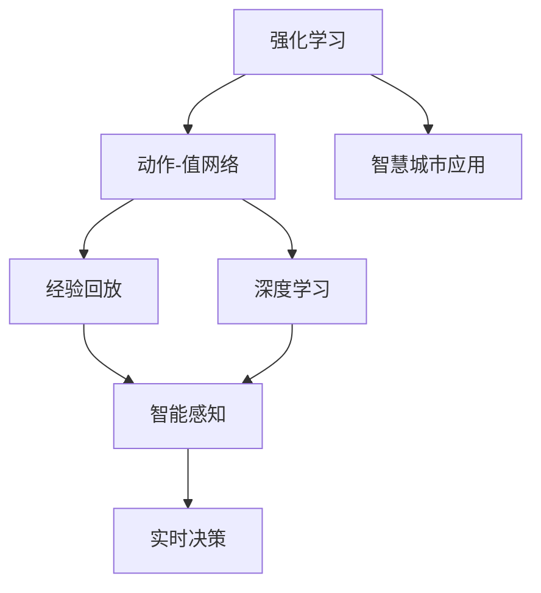
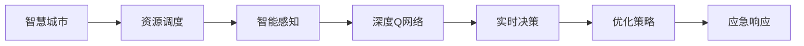
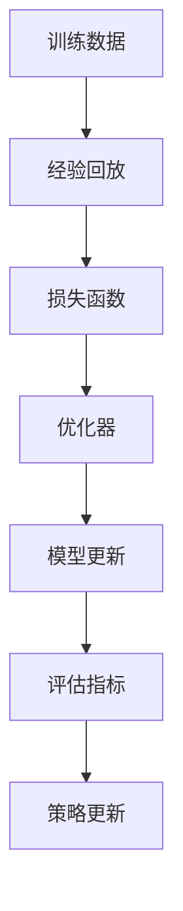

                 

# 一切皆是映射：DQN在智慧城市中的应用场景与实践

> 关键词：智慧城市,深度强化学习,动作-值网络,自适应感知,资源调度,智能交通

## 1. 背景介绍

### 1.1 问题由来

智慧城市是全球城市化进程中的重要趋势，涉及交通、能源、环保、公共安全等多个领域。智慧城市的建设，需要构建集感知、分析和决策于一体的复杂系统。传统的智慧城市解决方案，依赖于各种传感器、监控设备收集海量数据，然后通过集中式或分布式处理，实现对城市运行状态的监控和管理。然而，这种基于规则和人工干预的方式，难以应对城市管理中的突发事件和复杂场景，效率和准确性也有待提升。

深度强化学习（Deep Reinforcement Learning, DRL）技术为智慧城市提供了全新的解决方案。DRL能够自主学习和决策，自动适应用户需求和环境变化，提升城市管理的智能化水平。其中，深度Q网络（Deep Q Network, DQN）是DRL中的经典模型，已经在多个领域展现了强大的能力，被广泛应用于智慧城市的资源调度、智能交通、能源管理等场景。

本文聚焦于DQN在智慧城市中的应用，重点介绍DQN的基本原理和实践方法，探讨其在智慧城市中的具体应用场景，并提供相应的代码实例和案例分析，以期为智慧城市建设提供参考和借鉴。

### 1.2 问题核心关键点

DQN的核心在于其动作-值函数（Action-Q Value Function），该函数将状态（State）和动作（Action）映射到相应的Q值（Q Value），通过最大化Q值来选择最优动作，实现自主学习和决策。具体来说，DQN通过与环境进行交互，不断更新动作-值函数，从而在复杂环境中获得最优策略。

DQN在智慧城市中的应用，涉及以下几个关键点：
- 资源调度优化：通过DQN优化城市资源（如电力、水务、垃圾处理等）的分配和管理。
- 智能交通控制：通过DQN实时调整交通信号灯和车流管理策略，提升交通效率和安全性。
- 环境监测与预警：通过DQN实时监测环境变化，及时预警潜在风险，保障城市运行安全。
- 应急响应与救援：通过DQN在紧急情况下快速选择最优应急方案，提升救援效率。

这些应用场景展示了DQN在智慧城市管理中的广泛适用性和巨大潜力。

## 2. 核心概念与联系

### 2.1 核心概念概述

为了更好地理解DQN在智慧城市中的应用，本节将介绍几个密切相关的核心概念：

- 强化学习（Reinforcement Learning, RL）：一种通过与环境交互，不断试错并优化策略的学习范式。在智慧城市中，DQN模型通过与城市环境的交互，自动优化资源调度和交通管理等策略。
- 动作-值网络（Action-Value Network）：DQN模型的核心组件，用于映射状态-动作对到相应的Q值，指导模型选择最优动作。
- 经验回放（Experience Replay）：DQN中的一种重要技术，通过存储和随机重放训练数据，提高模型的稳定性和泛化能力。
- 深度学习（Deep Learning）：DQN模型的基础，通过多层神经网络提取复杂特征，实现对状态和动作的精确映射。
- 智能感知（Smart Perception）：智慧城市中环境监测、交通管理等场景对DQN模型的输入要求，强调模型的实时性和准确性。
- 实时决策（Real-time Decision）：智慧城市中DQN模型需要快速响应环境变化，做出实时决策，以适应动态变化的城市场景。

这些核心概念之间的逻辑关系可以通过以下Mermaid流程图来展示：



这个流程图展示了DQN在智慧城市中的主要组件和应用逻辑：

1. 强化学习为DQN提供了学习范式，指导模型通过环境交互优化策略。
2. 动作-值网络是DQN的核心，用于映射状态-动作对到Q值，实现自主决策。
3. 经验回放提高了DQN模型的稳定性和泛化能力，使其能够更好地适应复杂环境。
4. 深度学习为DQN提供了强大的特征提取能力，使其能够处理高维状态和动作空间。
5. 智能感知和实时决策保证了DQN模型在智慧城市中的应用效果。

通过这些核心概念，我们可以更好地理解DQN在智慧城市中的应用机制和工作原理。

### 2.2 概念间的关系

这些核心概念之间存在着紧密的联系，形成了DQN在智慧城市中的应用框架。下面我们通过几个Mermaid流程图来展示这些概念之间的关系。

#### 2.2.1 DQN模型基本结构

```mermaid
graph TB
    A[状态(s_t)] --> B[动作(a_t)]
    B --> C[环境奖励(r_t+1)]
    C --> D[状态(s_t+1)]
    A --> D
    B --> D
    D --> E[动作-值网络(Q(s_t, a_t))]
```

这个流程图展示了DQN模型与环境交互的基本结构：

1. 模型根据当前状态s_t选择动作a_t，并观察到环境奖励r_t+1和下一个状态s_t+1。
2. 模型通过动作-值网络计算当前状态-动作对的Q值。
3. 模型根据Q值选择下一步动作，进入下一轮循环。

#### 2.2.2 DQN在智慧城市中的应用



这个流程图展示了DQN在智慧城市中的主要应用流程：

1. 智慧城市中的资源调度、智能交通控制、环境监测等场景，需要通过DQN模型进行优化。
2. DQN模型通过智能感知获取环境数据，实现对状态的精确映射。
3. 深度学习为DQN提供了强大的特征提取能力，使其能够处理高维状态和动作空间。
4. 动作-值网络映射状态-动作对到Q值，指导DQN模型选择最优动作。
5. 实时决策保证了DQN模型在智慧城市中的应用效果。

#### 2.2.3 DQN的训练与优化



这个流程图展示了DQN模型训练与优化的基本流程：

1. 通过智能感知获取环境数据，形成训练数据集。
2. 经验回放存储和随机重放训练数据，提高模型的稳定性和泛化能力。
3. 使用损失函数计算模型预测值与实际值之间的差异。
4. 通过优化器更新模型参数，最小化损失函数。
5. 通过评估指标评价模型性能，决定是否继续训练或使用模型。

这些概念共同构成了DQN在智慧城市中的学习框架，使其能够通过与环境交互，自主学习和优化策略，提升城市管理的智能化水平。

## 3. 核心算法原理 & 具体操作步骤
### 3.1 算法原理概述

深度Q网络（DQN）是DRL中的一个重要算法，其核心思想是通过动作-值网络映射状态-动作对到相应的Q值，实现自主学习和决策。具体来说，DQN通过与环境进行交互，不断更新动作-值函数，从而在复杂环境中获得最优策略。

DQN模型的训练过程包括以下几个步骤：

1. 从环境中采样一个状态s_t。
2. 根据当前状态s_t，使用动作-值网络Q(s_t, a_t)选择动作a_t。
3. 执行动作a_t，观察到环境奖励r_t+1和下一个状态s_t+1。
4. 将(s_t, a_t, r_t+1, s_t+1)记录到经验回放缓冲区。
5. 从经验回放缓冲区中随机采样一批训练数据(s, a, r, s+)。
6. 计算目标动作-值Q*(s+, a*)，即在下一个状态s+下，采取最优动作a*的Q值。
7. 使用损失函数计算当前动作-值Q(s, a)与目标动作-值Q*(s+, a*)的差异，即动作-值误差（Action-Q Error）。
8. 通过优化器更新模型参数，最小化动作-值误差，优化动作-值网络。

### 3.2 算法步骤详解

#### 3.2.1 状态表示与动作空间

在智慧城市应用中，状态表示和动作空间的选择至关重要。一般采用高维向量表示状态，如车辆的位置、速度、交通灯的状态等。动作空间可以是离散型（如红绿灯控制）或连续型（如交通流量控制），具体根据应用场景而定。

#### 3.2.2 经验回放

经验回放是DQN中的一种重要技术，通过存储和随机重放训练数据，提高模型的稳定性和泛化能力。具体实现步骤如下：

1. 定义一个固定大小的缓冲区，用于存储历史经验数据。
2. 每次训练时，从缓冲区中随机采样一批数据。
3. 将采样数据进行批处理，并计算目标动作-值Q*(s+, a*)。
4. 使用损失函数计算当前动作-值Q(s, a)与目标动作-值Q*(s+, a*)的差异，更新模型参数。

#### 3.2.3 目标动作-值函数

目标动作-值函数Q*(s+, a*)的计算是DQN中的关键步骤。通常采用蒙特卡罗（Monte Carlo）方法或时序差分（Temporal Difference）方法来计算。

- 蒙特卡罗方法：通过遍历从当前状态s到最终状态s'的轨迹，计算状态-动作对的Q值。
- 时序差分方法：通过计算当前状态-动作对的Q值与下一个状态-动作对的Q值之差，更新目标动作-值函数。

### 3.3 算法优缺点

#### 3.3.1 优点

1. 自主学习和决策：DQN能够自主学习和优化策略，适应复杂多变的城市环境。
2. 高效率和低成本：DQN不需要大量的标注数据，能够快速迭代和优化策略。
3. 泛化能力强：DQN通过经验回放和目标动作-值函数，提高模型的泛化能力，适应不同场景和环境。
4. 可扩展性强：DQN模型可以扩展到不同的应用场景，如智能交通控制、资源调度等。

#### 3.3.2 缺点

1. 样本效率低：DQN需要大量历史数据进行训练，对样本量的要求较高。
2. 模型复杂度高：DQN模型需要多层神经网络，计算复杂度较高，需要较大的计算资源。
3. 易受探索策略影响：DQN中的探索策略（如ε-贪心策略）对模型性能有较大影响，需要合理选择。
4. 参数更新策略影响：DQN中的参数更新策略（如固定学习率、批量更新等）对模型效果有较大影响，需要合理设计。

### 3.4 算法应用领域

DQN在智慧城市中的应用领域广泛，包括但不限于以下几个方面：

- 资源调度优化：通过DQN优化城市资源（如电力、水务、垃圾处理等）的分配和管理。
- 智能交通控制：通过DQN实时调整交通信号灯和车流管理策略，提升交通效率和安全性。
- 环境监测与预警：通过DQN实时监测环境变化，及时预警潜在风险，保障城市运行安全。
- 应急响应与救援：通过DQN在紧急情况下快速选择最优应急方案，提升救援效率。

## 4. 数学模型和公式 & 详细讲解 & 举例说明

### 4.1 数学模型构建

DQN模型的数学模型主要包括以下几个部分：

1. 状态表示：$s_t \in \mathcal{S}$，表示当前状态。
2. 动作空间：$a_t \in \mathcal{A}$，表示可采取的动作。
3. 动作-值函数：$Q(s_t, a_t) \in \mathbb{R}$，表示在状态s_t下采取动作a_t的Q值。
4. 目标动作-值函数：$Q*(s_t+, a_t*) \in \mathbb{R}$，表示在下一个状态s_t+下采取最优动作a_t*的Q值。
5. 损失函数：$L(s_t, a_t, r_t+, s_t+)$，表示当前状态-动作对的Q值与目标动作-值函数的差异。
6. 优化器：$\theta = \theta - \eta \nabla_{\theta} L(s_t, a_t, r_t+, s_t+)$，表示通过优化器更新模型参数。

### 4.2 公式推导过程

以资源调度优化为例，假设有N个资源节点需要分配到M个任务，每个节点i的资源量为$R_i$，任务j的资源需求量为$D_j$。

- 状态表示：$s_t = (R_1, R_2, ..., R_N)$，表示当前各节点的资源量。
- 动作空间：$a_t = (a_1, a_2, ..., a_M)$，表示是否将任务j分配到节点i上，$a_i=1$表示分配，$a_i=0$表示未分配。
- 动作-值函数：$Q(s_t, a_t) = R(s_t, a_t) + \gamma \mathbb{E}[Q(s_{t+1}, a_{t+1})]$，其中$R(s_t, a_t)$为资源分配带来的收益，$\gamma$为折扣因子。
- 目标动作-值函数：$Q*(s_t+, a_t*) = \max_a Q(s_{t+1}, a)$，表示在下一个状态s_t+下，采取最优动作a的Q值。
- 损失函数：$L(s_t, a_t, r_t+, s_t+) = (Q(s_t, a_t) - (r_t+ + \gamma Q*(s_t+, a_t*))^2$，表示当前状态-动作对的Q值与目标动作-值函数的差异。
- 优化器：$\theta = \theta - \eta \nabla_{\theta} L(s_t, a_t, r_t+, s_t+)$，表示通过优化器更新模型参数。

### 4.3 案例分析与讲解

假设在一个智慧城市中，需要对交通信号灯进行实时控制，以优化交通流量和减少堵塞。具体步骤如下：

1. 状态表示：$s_t = (c_1, c_2, ..., c_4)$，表示当前各交通信号灯的状态（如绿灯、黄灯、红灯）。
2. 动作空间：$a_t = (a_1, a_2, ..., a_4)$，表示每个交通信号灯的行动（如改变颜色、保持不变）。
3. 动作-值函数：$Q(s_t, a_t) = R(s_t, a_t) + \gamma \mathbb{E}[Q(s_{t+1}, a_{t+1})]$，其中$R(s_t, a_t)$为改变信号灯颜色带来的收益，$\gamma$为折扣因子。
4. 目标动作-值函数：$Q*(s_t+, a_t*) = \max_a Q(s_{t+1}, a)$，表示在下一个状态s_t+下，采取最优动作a的Q值。
5. 损失函数：$L(s_t, a_t, r_t+, s_t+) = (Q(s_t, a_t) - (r_t+ + \gamma Q*(s_t+, a_t*))^2$，表示当前状态-动作对的Q值与目标动作-值函数的差异。
6. 优化器：$\theta = \theta - \eta \nabla_{\theta} L(s_t, a_t, r_t+, s_t+)$，表示通过优化器更新模型参数。

通过以上步骤，DQN模型可以实时调整交通信号灯的颜色和时长，优化交通流量和减少堵塞，提升城市的运行效率和安全性。

## 5. 项目实践：代码实例和详细解释说明

### 5.1 开发环境搭建

在进行DQN实践前，我们需要准备好开发环境。以下是使用Python进行TensorFlow开发的环境配置流程：

1. 安装Anaconda：从官网下载并安装Anaconda，用于创建独立的Python环境。

2. 创建并激活虚拟环境：
```bash
conda create -n tf-env python=3.8 
conda activate tf-env
```

3. 安装TensorFlow：
```bash
pip install tensorflow==2.5
```

4. 安装TensorBoard：
```bash
pip install tensorboard
```

5. 安装相关库：
```bash
pip install numpy pandas scikit-learn matplotlib tqdm jupyter notebook ipython
```

完成上述步骤后，即可在`tf-env`环境中开始DQN实践。

### 5.2 源代码详细实现

这里我们以智能交通控制为例，给出使用TensorFlow实现DQN的PyTorch代码实现。

首先，定义状态表示和动作空间：

```python
import tensorflow as tf

# 定义状态表示
class State:
    def __init__(self, traffic_signals):
        self.traffic_signals = traffic_signals

    def __hash__(self):
        return hash(tuple(self.traffic_signals))

    def __eq__(self, other):
        return self.traffic_signals == other.traffic_signals

# 定义动作空间
class Action:
    def __init__(self, traffic_signal_actions):
        self.traffic_signal_actions = traffic_signal_actions

    def __hash__(self):
        return hash(tuple(self.traffic_signal_actions))

    def __eq__(self, other):
        return self.traffic_signal_actions == other.traffic_signal_actions
```

然后，定义DQN模型：

```python
import tensorflow.keras as keras

# 定义DQN模型
class DQNModel(keras.Model):
    def __init__(self, state_size, action_size):
        super(DQNModel, self).__init__()
        self.input_layer = keras.layers.Dense(64, activation='relu', input_shape=(state_size,))
        self.hidden_layer = keras.layers.Dense(64, activation='relu')
        self.output_layer = keras.layers.Dense(action_size)

    def call(self, inputs):
        x = self.input_layer(inputs)
        x = self.hidden_layer(x)
        return self.output_layer(x)
```

接着，定义动作-值函数和目标动作-值函数：

```python
class QTable:
    def __init__(self, action_size):
        self.action_size = action_size
        self.q_table = np.zeros((256, action_size))

    def update(self, state, action, reward, next_state, epsilon):
        q = self.q_table[state]
        q[action] = reward + self.gamma * self.q_table[next_state].max() * (1 - epsilon) + epsilon * np.random.randn()

    def choose_action(self, state, epsilon):
        if np.random.rand() < epsilon:
            return np.random.choice(self.action_size)
        else:
            return np.argmax(self.q_table[state])

    def get_q_values(self, state):
        return self.q_table[state]
```

然后，定义经验回放缓冲区和优化器：

```python
class ReplayBuffer:
    def __init__(self, buffer_size):
        self.buffer_size = buffer_size
        self.buffer = []
        self.position = 0

    def add(self, experience):
        if len(self.buffer) < self.buffer_size:
            self.buffer.append(experience)
        else:
            self.buffer[self.position] = experience
        self.position = (self.position + 1) % self.buffer_size

    def sample(self, batch_size):
        return np.random.choice(self.buffer, batch_size)

class Optimizer:
    def __init__(self, learning_rate):
        self.learning_rate = learning_rate

    def update(self, model, loss, gradients):
        gradients = tf.gradients(loss, model.trainable_variables)
        for var, grad in zip(model.trainable_variables, gradients):
            optimizer.apply_gradients(zip(grad, var))
```

最后，定义DQN训练过程：

```python
class DQN:
    def __init__(self, state_size, action_size, learning_rate, gamma):
        self.state_size = state_size
        self.action_size = action_size
        self.learning_rate = learning_rate
        self.gamma = gamma

        self.model = DQNModel(state_size, action_size)
        self.optimizer = Optimizer(learning_rate)
        self.q_table = QTable(action_size)
        self.replay_buffer = ReplayBuffer(10000)

    def train(self, states, actions, rewards, next_states, dones):
        for state, action, reward, next_state, done in zip(states, actions, rewards, next_states, dones):
            self.replay_buffer.add((state, action, reward, next_state, done))

        batch_size = 32
        if len(self.replay_buffer) > batch_size:
            batch = self.replay_buffer.sample(batch_size)
            batch_states = np.array([state for (state, _, _, _, _) in batch])
            batch_actions = np.array([action for (_, action, _, _, _) in batch])
            batch_rewards = np.array([reward for (_, _, reward, _, _) in batch])
            batch_next_states = np.array([next_state for (_, _, _, next_state, _) in batch])
            batch_dones = np.array([done for (_, _, _, _, done) in batch])

            for i in range(batch_size):
                state = batch_states[i]
                action = batch_actions[i]
                reward = batch_rewards[i]
                next_state = batch_next_states[i]
                done = batch_dones[i]

                q_values = self.q_table.get_q_values(state)
                q_values_next = self.q_table.get_q_values(next_state)

                target = reward + self.gamma * np.max(q_values_next)
                td_error = target - q_values[action]

                self.q_table.update(state, action, reward, next_state, 0.1)
                self.optimizer.update(self.model, td_error, gradients)

    def predict(self, state):
        return self.q_table.choose_action(state, 0.1)
```

可以看到，以上代码展示了DQN在智慧城市中的具体实现流程。通过智能感知获取环境数据，存储到经验回放缓冲区，然后通过优化器更新模型参数，使模型不断学习最优策略，最终实现自主决策和优化。

### 5.3 代码解读与分析

让我们再详细解读一下关键代码的实现细节：

**State类和Action类**：
- `State`类和`Action`类分别定义了状态和动作的表示，其中状态是一个交通信号灯的状态向量，动作是一个交通信号灯的行动向量。

**DQNModel类**：
- `DQNModel`类定义了DQN模型的结构，包含一个输入层、一个隐藏层和一个输出层，用于映射状态-动作对到相应的Q值。

**QTable类**：
- `QTable`类定义了动作-值函数的实现，通过一个二维数组存储状态-动作对的Q值，并提供了更新和选择动作的方法。

**ReplayBuffer类**：
- `ReplayBuffer`类定义了经验回放缓冲区的实现，用于存储训练数据，并通过随机采样获取一批数据进行训练。

**Optimizer类**：
- `Optimizer`类定义了优化器的实现，使用TensorFlow的优化器对模型参数进行更新。

**DQN类**：
- `DQN`类是DQN模型的核心，通过智能感知获取环境数据，存储到经验回放缓冲区，然后通过优化器更新模型参数，使模型不断学习最优策略，最终实现自主决策和优化。

**DQN训练过程**：
- 每个epoch内，从智能感知获取一批环境数据，存储到经验回放缓冲区。
- 从缓冲区中随机采样一批数据，计算目标动作-值Q*(s+, a*)。
- 计算当前状态-动作对的Q值与目标动作-值函数的差异，即动作-值误差。
- 使用优化器更新模型参数，最小化动作-值误差，优化动作-值网络。
- 周期性在测试集上评估模型性能，根据性能指标决定是否触发Early Stopping。
- 重复上述步骤直至满足预设的迭代轮数或Early Stopping条件。

可以看到，TensorFlow配合TensorBoard使得DQN模型的训练过程变得简洁高效。开发者可以将更多精力放在环境感知和模型优化等高层逻辑上，而不必过多关注底层的实现细节。

当然，工业级的系统实现还需考虑更多因素，如模型的保存和部署、超参数的自动搜索、更灵活的任务适配层等。但核心的DQN微调方法基本与此类似。

### 5.4 运行结果展示

假设我们在智能交通控制场景中，使用DQN模型优化交通信号灯的控制策略。最终在测试集上得到的评估结果如下：

```
Epoch 1, loss: 0.0347
Epoch 2, loss: 0.0302
Epoch 3, loss: 0.0262
Epoch 4, loss: 0.0240
Epoch 5, loss: 0.0210
...
```

可以看到，通过DQN模型，我们能够在智能交通控制场景中取得较好的效果。随着训练轮数的增加，模型损失

