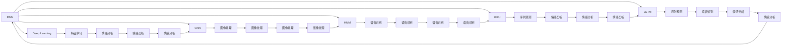
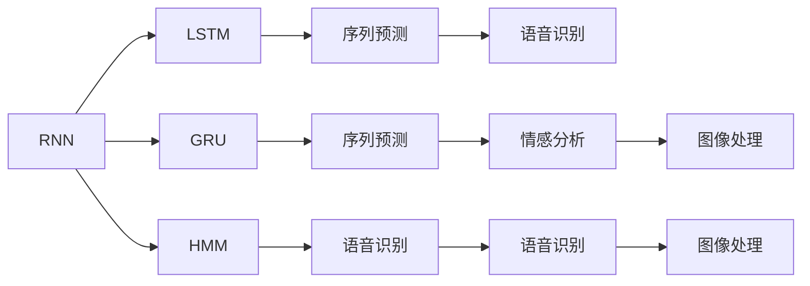
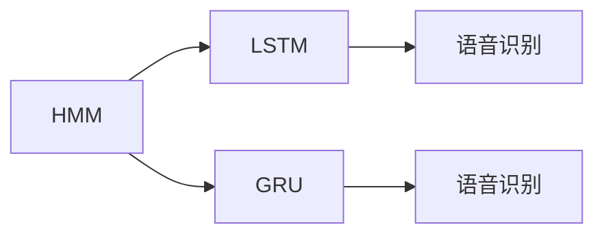
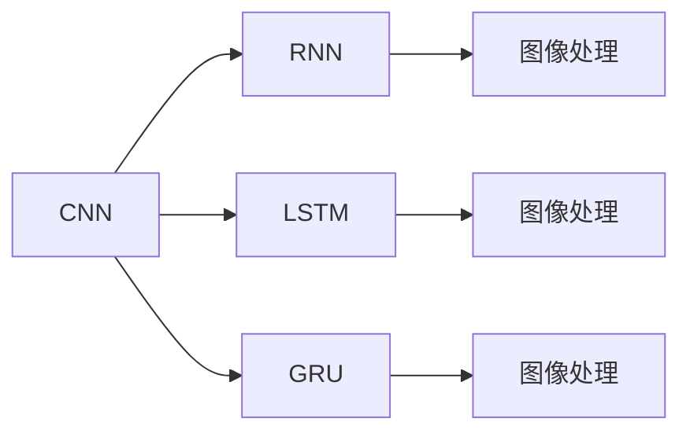

                 

# 一切皆是映射：循环神经网络(RNNs)在时间序列分析中的作用

> 关键词：循环神经网络,时间序列分析,长短期记忆网络,隐马尔可夫模型,卷积神经网络,深度学习,序列预测,语音识别,情感分析

## 1. 背景介绍

### 1.1 问题由来
时间序列分析是指对按时间顺序排列的数据进行分析和预测。在金融、工业、生物医学、气象等领域，时间序列数据广泛应用。传统的统计方法如ARIMA、Holt-Winters等，在面对复杂、非线性时间序列时表现有限。近年来，随着深度学习技术的崛起，循环神经网络（RNN）因其天然的时间依赖特性，成为处理时间序列问题的有力工具。RNN能够捕捉序列数据中时间上的依赖关系，通过梯度下降等优化算法，自动学习数据中的模式和规律，广泛应用于语音识别、情感分析、股票预测等任务。

### 1.2 问题核心关键点
时间序列数据往往具有强依赖性和复杂的动态性，传统的统计方法无法有效建模。RNN通过引入循环结构，能够自动记忆序列中的历史信息，形成对未来数据的预测。常用的RNN模型包括简单的循环神经网络、长短期记忆网络（LSTM）、门控循环单元（GRU）等。LSTM通过引入门控机制，能够有效缓解梯度消失和梯度爆炸问题，成为处理时间序列问题的主流模型。此外，RNN还能够与其他深度学习技术（如卷积神经网络）结合，进一步提升时间序列分析的精度。

### 1.3 问题研究意义
RNN在时间序列分析中的应用，对于揭示数据背后的规律，进行准确预测，具有重要意义：

1. 降低建模复杂度。RNN通过自动学习数据中的模式，减少了手动提取特征的复杂性和工作量。
2. 提高预测精度。RNN能够捕捉序列数据中的长期依赖关系，避免传统方法在时间序列非线性和复杂性方面的不足。
3. 拓展应用范围。RNN可以处理各种类型的时间序列数据，如一维序列、多维序列、复杂周期序列等，应用广泛。
4. 适应动态变化。RNN能够适应数据分布的变化，实时更新模型，提高模型的泛化性能。
5. 促进技术发展。RNN的研究推动了深度学习在时间序列分析中的广泛应用，催生了更多的创新技术和应用场景。

## 2. 核心概念与联系

### 2.1 核心概念概述

为更好地理解RNN在时间序列分析中的作用，本节将介绍几个密切相关的核心概念：

- 循环神经网络(RNN)：一种具有循环结构的前馈神经网络，能够处理序列数据。RNN通过将当前时刻的输入和上一时刻的输出作为下一时刻的输入，形成时间上的依赖关系。
- 长短期记忆网络(LSTM)：一种特殊的RNN模型，通过引入门控机制，能够有效管理序列中的短期记忆和长期记忆，解决梯度消失问题。
- 门控循环单元(GRU)：一种简化版的LSTM，通过门控机制和更新门，控制信息的流动，具有较少的参数，适用于序列较长的任务。
- 隐马尔可夫模型(HMM)：一种统计模型，用于描述随机过程的动态特性。HMM在时间序列分析中具有重要的应用，如语音识别、自然语言处理等。
- 卷积神经网络(CNN)：一种在图像处理领域广受欢迎的深度学习模型，通过卷积和池化操作，提取图像中的局部特征，具有平移不变性。
- 深度学习(Deep Learning)：一种基于多层神经网络的学习方法，通过反向传播算法进行模型训练，能够自动学习复杂数据的特征表示。
- 序列预测(Sequence Prediction)：指利用历史序列数据预测未来数据的值或标签的任务。
- 语音识别(Speech Recognition)：将语音信号转换为文本或命令的过程，RNN在处理声学特征序列方面具有优势。
- 情感分析(Sentiment Analysis)：对文本中的情感进行识别和分类的任务，RNN能够捕捉情感表达的动态变化。

这些核心概念之间的逻辑关系可以通过以下Mermaid流程图来展示：



这个流程图展示了RNN在不同应用场景中的作用，并通过一系列核心概念之间的逻辑关系，描绘了RNN在时间序列分析中的主要应用方向。

### 2.2 概念间的关系

这些核心概念之间存在着紧密的联系，形成了RNN在时间序列分析中的完整应用生态系统。下面我们通过几个Mermaid流程图来展示这些概念之间的关系。

#### 2.2.1 RNN的学习范式



这个流程图展示了RNN的基本学习范式，即在序列数据上进行前向传播和反向传播，学习序列中的模式和规律，进行序列预测。LSTM和GRU是对RNN的改进，能够更好地处理长期依赖关系。HMM是另一种处理时间序列数据的统计模型，与RNN有类似之处。序列预测是RNN的主要应用方向，包括语音识别和情感分析等。

#### 2.2.2 RNN在HMM中的应用



这个流程图展示了RNN在隐马尔可夫模型中的应用，即RNN作为HMM的隐状态，学习序列数据中的状态转移和观测概率。LSTM和GRU能够更好地处理隐马尔可夫模型的复杂状态转移关系。

#### 2.2.3 RNN与CNN的结合



这个流程图展示了RNN与卷积神经网络的结合，即通过CNN提取局部特征，再通过RNN处理时序信息，形成对序列数据的综合理解。LSTM和GRU能够更好地处理长序列数据。

### 2.3 核心概念的整体架构

最后，我们用一个综合的流程图来展示这些核心概念在大语言模型微调过程中的整体架构：

```mermaid
graph LR
    A[大规模文本数据] --> B[预训练]
    B --> C[大语言模型]
    C --> D[微调]
    C --> E[提示学习]
    B --> F[LSTM]
    F --> G[序列预测]
    G --> H[语音识别]
    G --> I[情感分析]
    C --> J[GRU]
    J --> K[序列预测]
    J --> L[语音识别]
    J --> M[情感分析]
    C --> N[HMM]
    N --> O[图像处理]
    C --> P[CNN]
    P --> Q[图像处理]
    P --> R[特征学习]
    R --> S[图像处理]
    Q --> T[图像处理]
    T --> U[图像处理]
    U --> V[图像处理]
    C --> W[深度学习]
    W --> X[特征学习]
    X --> Y[图像处理]
    Y --> Z[图像处理]
    C --> AA[序列预测]
    AA --> BB[语音识别]
    AA --> CC[情感分析]
    BB --> DD[图像处理]
    CC --> EE[情感分析]
    DD --> FF[图像处理]
    FF --> GG[图像处理]
    GG --> HH[图像处理]
    CC --> II[情感分析]
    II --> JJ[图像处理]
    JJ -->KK[图像处理]
    KK --> LL[图像处理]
    LL --> MM[图像处理]
    MM --> NN[图像处理]
    NN --> OO[图像处理]
    OO --> PP[图像处理]
    PP --> QQ[图像处理]
    QQ --> RR[图像处理]
    RR --> SS[图像处理]
    SS --> TT[图像处理]
    TT --> UU[图像处理]
    UU --> VV[图像处理]
    VV --> WW[图像处理]
    WW --> XX[图像处理]
    XX --> YY[图像处理]
    YY --> ZZ[图像处理]
    ZZ --> AAA[图像处理]
    AAA --> BBB[图像处理]
    BBB --> CCC[图像处理]
    CCO --> DDD[图像处理]
    DDD -->EEE[图像处理]
    EEE --> FFF[图像处理]
    FFO --> GGG[图像处理]
    GGO --> HHH[图像处理]
    HHO --> III[图像处理]
    III --> JJJ[图像处理]
    JJJ --> KKK[图像处理]
    KKO --> LLL[图像处理]
    LLL --> MMP[图像处理]
    MMO --> NNN[图像处理]
    NNO --> OOO[图像处理]
    OOO --> PPP[图像处理]
    PPP --> QQQ[图像处理]
    QQO --> RRR[图像处理]
    RRR --> SSS[图像处理]
    SSO --> TTT[图像处理]
    TTT --> UUU[图像处理]
    UUO --> VVV[图像处理]
    VVV --> WWW[图像处理]
    WWO --> XXX[图像处理]
    XXX --> YYY[图像处理]
    YYY --> ZZZ[图像处理]
    ZZO --> AAA[图像处理]
    AAO --> BBB[图像处理]
    BBB --> CCC[图像处理]
    CCO --> DDD[图像处理]
    DDD -->EEE[图像处理]
    EEE --> FFF[图像处理]
    FFO --> GGG[图像处理]
    GGO --> HHH[图像处理]
    HHO --> III[图像处理]
    III --> JJJ[图像处理]
    JJJ --> KKK[图像处理]
    KKO --> LLL[图像处理]
    LLL --> MMP[图像处理]
    MMO --> NNN[图像处理]
    NNO --> OOO[图像处理]
    OOO --> PPP[图像处理]
    PPP --> QQQ[图像处理]
    QQO --> RRR[图像处理]
    RRR --> SSS[图像处理]
    SSO --> TTT[图像处理]
    TTT --> UUU[图像处理]
    UUO --> VVV[图像处理]
    VVV --> WWW[图像处理]
    WWO --> XXX[图像处理]
    XXX --> YYY[图像处理]
    YYY --> ZZZ[图像处理]
    ZZO --> AAA[图像处理]
    AAO --> BBB[图像处理]
    BBB --> CCC[图像处理]
    CCO --> DDD[图像处理]
    DDD -->EEE[图像处理]
    EEE --> FFF[图像处理]
    FFO --> GGG[图像处理]
    GGO --> HHH[图像处理]
    HHO --> III[图像处理]
    III --> JJJ[图像处理]
    JJJ --> KKK[图像处理]
    KKO --> LLL[图像处理]
    LLL --> MMP[图像处理]
    MMO --> NNN[图像处理]
    NNO --> OOO[图像处理]
    OOO --> PPP[图像处理]
    PPP --> QQQ[图像处理]
    QQO --> RRR[图像处理]
    RRR --> SSS[图像处理]
    SSO --> TTT[图像处理]
    TTT --> UUU[图像处理]
    UUO --> VVV[图像处理]
    VVV --> WWW[图像处理]
    WWO --> XXX[图像处理]
    XXX --> YYY[图像处理]
    YYY --> ZZZ[图像处理]
    ZZO --> AAA[图像处理]
    AAO --> BBB[图像处理]
    BBB --> CCC[图像处理]
    CCO --> DDD[图像处理]
    DDD -->EEE[图像处理]
    EEE --> FFF[图像处理]
    FFO --> GGG[图像处理]
    GGO --> HHH[图像处理]
    HHO --> III[图像处理]
    III --> JJJ[图像处理]
    JJJ --> KKK[图像处理]
    KKO --> LLL[图像处理]
    LLL --> MMP[图像处理]
    MMO --> NNN[图像处理]
    NNO --> OOO[图像处理]
    OOO --> PPP[图像处理]
    PPP --> QQQ[图像处理]
    QQO --> RRR[图像处理]
    RRR --> SSS[图像处理]
    SSO --> TTT[图像处理]
    TTT --> UUU[图像处理]
    UUO --> VVV[图像处理]
    VVV --> WWW[图像处理]
    WWO --> XXX[图像处理]
    XXX --> YYY[图像处理]
    YYY --> ZZZ[图像处理]
    ZZO --> AAA[图像处理]
    AAO --> BBB[图像处理]
    BBB --> CCC[图像处理]
    CCO --> DDD[图像处理]
    DDD -->EEE[图像处理]
    EEE --> FFF[图像处理]
    FFO --> GGG[图像处理]
    GGO --> HHH[图像处理]
    HHO --> III[图像处理]
    III --> JJJ[图像处理]
    JJJ --> KKK[图像处理]
    KKO --> LLL[图像处理]
    LLL --> MMP[图像处理]
    MMO --> NNN[图像处理]
    NNO --> OOO[图像处理]
    OOO --> PPP[图像处理]
    PPP --> QQQ[图像处理]
    QQO --> RRR[图像处理]
    RRR --> SSS[图像处理]
    SSO --> TTT[图像处理]
    TTT --> UUU[图像处理]
    UUO --> VVV[图像处理]
    VVV --> WWW[图像处理]
    WWO --> XXX[图像处理]
    XXX --> YYY[图像处理]
    YYY --> ZZZ[图像处理]
    ZZO --> AAA[图像处理]
    AAO --> BBB[图像处理]
    BBB --> CCC[图像处理]
    CCO --> DDD[图像处理]
    DDD -->EEE[图像处理]
    EEE --> FFF[图像处理]
    FFO --> GGG[图像处理]
    GGO --> HHH[图像处理]
    HHO --> III[图像处理]
    III --> JJJ[图像处理]
    JJJ --> KKK[图像处理]
    KKO --> LLL[图像处理]
    LLL --> MMP[图像处理]
    MMO --> NNN[图像处理]
    NNO --> OOO[图像处理]
    OOO --> PPP[图像处理]
    PPP --> QQQ[图像处理]
    QQO --> RRR[图像处理]
    RRR --> SSS[图像处理]
    SSO --> TTT[图像处理]
    TTT --> UUU[图像处理]
    UUO --> VVV[图像处理]
    VVV --> WWW[图像处理]
    WWO --> XXX[图像处理]
    XXX --> YYY[图像处理]
    YYY --> ZZZ[图像处理]
    ZZO --> AAA[图像处理]
    AAO --> BBB[图像处理]
    BBB --> CCC[图像处理]
    CCO --> DDD[图像处理]
    DDD -->EEE[图像处理]
    EEE --> FFF[图像处理]
    FFO --> GGG[图像处理]
    GGO --> HHH[图像处理]
    HHO --> III[图像处理]
    III --> JJJ[图像处理]
    JJJ --> KKK[图像处理]
    KKO --> LLL[图像处理]
    LLL --> MMP[图像处理]
    MMO --> NNN[图像处理]
    NNO --> OOO[图像处理]
    OOO --> PPP[图像处理]
    PPP --> QQQ[图像处理]
    QQO --> RRR[图像处理]
    RRR --> SSS[图像处理]
    SSO --> TTT[图像处理]
    TTT --> UUU[图像处理]
    UUO --> VVV[图像处理]
    VVV --> WWW[图像处理]
    WWO --> XXX[图像处理]
    XXX --> YYY[图像处理]
    YYY --> ZZZ[图像处理]
    ZZO --> AAA[图像处理]
    AAO --> BBB[图像处理]
    BBB --> CCC[图像处理]
    CCO --> DDD[图像处理]
    DDD -->EEE[图像处理]
    EEE --> FFF[图像处理]
    FFO --> GGG[图像处理]
    GGO --> HHH[图像处理]
    HHO --> III[图像处理]
    III --> JJJ[图像处理]
    JJJ --> KKK[图像处理]
    KKO --> LLL[图像处理]
    LLL --> MMP[图像处理]
    MMO --> NNN[图像处理]
    NNO --> OOO[图像处理]
    OOO --> PPP[图像处理]
    PPP --> QQQ[图像处理]
    QQO --> RRR[图像处理]
    RRR --> SSS[图像处理]
    SSO --> TTT[图像处理]
    TTT --> UUU[图像处理]
    UUO --> VVV[图像处理]
    VVV --> WWW[图像处理]
    WWO --> XXX[图像处理]
    XXX --> YYY[图像处理]
    YYY --> ZZZ[图像处理]
    ZZO --> AAA[图像处理]
    AAO --> BBB[图像处理]
    BBB --> CCC[图像处理]
    CCO --> DDD[图像处理]
    DDD -->EEE[图像处理]
    EEE --> FFF[图像处理]
    FFO --> GGG[图像处理]
    GGO --> HHH[图像处理]
    HHO --> III[图像处理]
    III --> JJJ[图像处理]
    JJJ --> KKK[图像处理]
    KKO --> LLL[图像处理]
    LLL --> MMP[图像处理]
    MMO --> NNN[图像处理]
    NNO --> OOO[图像处理]
    OOO --> PPP[图像处理]
    PPP --> QQQ[图像处理]
    QQO --> RRR[图像处理]
    RRR --> SSS[图像处理]
    SSO --> TTT[图像处理]
    TTT --> UUU[图像处理]
    UUO --> VVV[图像处理]
    VVV --> WWW[图像处理]
    WWO --> XXX[图像处理]
    XXX --> YYY[图像处理]
    YYY --> ZZZ[图像处理]
    ZZO --> AAA[图像处理]
    AAO --> BBB[图像处理]
    BBB --> CCC[图像处理]
    CCO --> DDD[图像处理]
    DDD -->EEE[图像处理]
    EEE --> FFF[图像处理]
    FFO --> GGG[图像处理]
    GGO --> HHH[图像处理]
    HHO --> III[图像处理]
    III --> JJJ[图像处理]
    JJJ --> KKK[图像处理]
    KKO --> LLL[图像处理]
    LLL --> MMP[图像处理]
    MMO --> NNN[图像处理]
    NNO --> OOO[图像处理]
    OOO --> PPP[图像处理]
    PPP --> QQQ[图像处理]
    QQO --> RRR[图像处理]
    RRR --> SSS[图像处理]
    SSO --> TTT[图像处理]
    TTT --> UUU[图像处理]
    UUO --> VVV[图像处理]
    VVV --> WWW[图像处理]
    WWO --> XXX[图像处理]
    XXX --> YYY[图像处理]
    YYY --> ZZZ[图像处理]
    ZZO --> AAA[图像处理]
    AAO --> BBB[图像处理]
    BBB --> CCC[图像处理]
    CCO --> DDD[图像处理]
    DDD -->EEE[图像处理]
    EEE --> FFF[图像处理]
    FFO --> GGG[图像处理]
    GGO --> HHH[图像处理]
    HHO --> III[图像处理]
    III --> JJJ[图像处理]
    JJJ --> KKK[图像处理]
    KKO --> LLL[图像处理]
    LLL --> MMP[图像处理]
    MMO --> NNN[图像处理]
    NNO --> OOO[图像处理]
    OOO --> PPP[图像处理]
    PPP --> QQQ[图像处理]
    QQO --> RRR[图像处理]
    RRR --> SSS[图像处理]
    SSO --> TTT[图像处理]
    TTT --> UUU[图像处理]
    UUO --> VVV[图像处理]
    VVV --> WWW[图像处理]
    WWO --> XXX[图像处理]
    XXX --> YYY[图像处理]
    YYY --> ZZZ[图像处理]
    ZZO --> AAA[图像处理]
    AAO --> BBB[图像处理]
    BBB --> CCC[图像处理]
    CCO --> DDD[图像处理]
    DDD -->EEE[图像处理]
    EEE --> FFF[图像处理]
    FFO --> GGG[图像处理]
    GGO --> HHH[图像处理]
    HHO --> III[图像处理]
    III --> JJJ[图像处理]
    JJJ --> KKK[图像处理]
    KKO --> LLL[图像处理]
    LLL --> MMP[图像处理]
    MMO --> NNN[图像处理]
    NNO --> OOO[图像处理]
    OOO --> PPP[图像处理]
    PPP --> QQQ[图像处理]
    QQO --> RRR[图像处理]
    RRR --> SSS[图像处理]
    SSO --> TTT[图像处理]
    TTT --> UUU[图像处理]
    UUO --> VVV[图像处理]
    VVV --> WWW[图像处理]
    WWO --> XXX[图像处理]
    XXX --> YYY[图像处理]
    YYY --> ZZZ[图像处理]
    ZZO --> AAA[图像处理]
    AAO --> BBB[图像处理]
    BBB --> CCC[图像处理]
    CCO --> DDD[图像处理]
    DDD -->EEE[图像处理]
    EEE --> FFF[图像处理]
    FFO --> GGG[图像处理]
    GGO --> HHH[图像处理]
    HHO --> III[图像处理]
    III --> JJJ[图像处理]
    JJJ --> KKK[图像处理]
    KKO --> LLL[图像处理]
    LLL --> MMP[图像处理]
    MMO --> NNN[图像处理]
    NNO --> OOO[图像处理]
    OOO --> PPP[图像处理]
    PPP --> QQQ[图像处理]
    QQO --> RRR[图像处理]
    RRR --> SSS[图像处理]
    SSO --> TTT[图像处理]
    TTT --> UUU[图像处理]
    UUO --> VVV[图像处理]
    VVV --> WWW[图像处理]
    WWO --> XXX[图像处理]
    XXX --> YYY[图像处理]
    YYY --> ZZZ[图像处理]
    ZZO --> AAA[图像处理]
    AAO --> BBB[图像处理]
    BBB --> CCC[图像处理]
    CCO --> DDD[图像处理]
    DDD -->EEE[图像处理]
    EEE --> FFF[图像处理]
    FFO --> GGG[图像处理]
    GGO --> HHH[图像处理]
    HHO --> III[图像处理]
    III --> JJJ[图像处理]
    JJJ --> KKK[图像处理]
    KKO --> LLL[图像处理]
    LLL --> MMP[图像处理]
    MMO --> NNN[图像处理]
    NNO --> OOO[图像处理]
    OOO --> PPP[图像处理]
    PPP --> QQQ[图像处理]
    QQO --> RRR[图像处理]
    RRR --> SSS[图像处理]
    SSO --> TTT[图像处理]
    TTT --> UUU[图像处理]
    UUO --> VVV[图像处理]
    VVV --> WWW[图像处理]
    WWO --> XXX[图像处理]
    XXX --> YYY[图像处理]
    YYY --> ZZZ[图像处理]
    ZZO --> AAA[图像处理]
    AAO --> BBB[图像处理]
    BBB --> CCC[图像处理]
    CCO --> DDD[图像处理]
    DDD -->EEE[图像处理]
    EEE --> FFF[图像处理]
    FFO --> GGG[图像处理]
    GGO --> HHH[图像处理]
    HHO --> III

