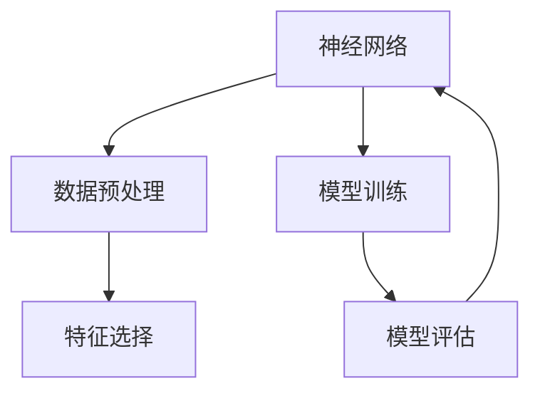

                 

# 一切皆是映射：神经网络在金融欺诈检测中的应用

> 关键词：神经网络,金融欺诈检测,数据挖掘,机器学习,模型优化,欺诈识别

## 1. 背景介绍

### 1.1 问题由来
金融欺诈检测是金融领域的重要任务之一，旨在识别和防范各种诈骗行为，保护金融机构的财产安全。传统的金融欺诈检测方法主要依赖于专家知识和规则库，其不足之处在于规则更新不及时、难以适应新型的欺诈手段，且难以对复杂的欺诈模式进行高效建模。

随着人工智能技术的发展，神经网络（Neural Network, NN）作为一种强大的机器学习模型，开始在金融欺诈检测中发挥重要作用。相较于传统方法，神经网络具备更强的自适应能力和泛化能力，能够捕捉复杂的非线性关系，更有效地识别和防范金融欺诈。

### 1.2 问题核心关键点
金融欺诈检测的核心问题在于如何在大量金融交易数据中高效识别出潜在的欺诈行为。神经网络通过学习历史数据中的规律，构建泛化能力强的欺诈检测模型，实现自动化、智能化的欺诈识别。具体来说，神经网络能够：

1. 自动发现欺诈行为中的关键特征，无需人工提取和设计。
2. 处理高维度、非结构化的交易数据，具有强大的数据整合能力。
3. 能够处理实时数据流，及时识别和防范欺诈行为。
4. 不断学习和更新，适应不断变化的欺诈模式。

## 2. 核心概念与联系

### 2.1 核心概念概述

在讨论神经网络在金融欺诈检测中的应用前，首先需要理解神经网络的核心概念和架构。

#### 2.1.1 神经网络概述
神经网络是一种由大量人工神经元相互连接构成的计算模型，模拟人脑的神经信号传递过程。主要包括输入层、隐藏层和输出层，通过反向传播算法（Backpropagation）更新参数，不断优化模型性能。

#### 2.1.2 欺诈检测概述
欺诈检测旨在识别和预防欺诈行为，通常包括事前预防和事后检测两方面。事前预防如客户身份验证、交易限额设置等；事后检测如交易监控、异常行为分析等。神经网络在欺诈检测中的应用主要集中在事后检测。

#### 2.1.3 数据挖掘概述
数据挖掘是从大量数据中提取有用信息和知识的过程，包括数据预处理、特征选择、模型训练和评估等步骤。在金融欺诈检测中，数据挖掘可以帮助构建高质量的训练集，提升神经网络模型的性能。

### 2.2 核心概念的关系
神经网络在金融欺诈检测中的应用，可以看作是一种典型的数据挖掘过程，结合了预处理、特征选择和模型训练等多个环节。具体来说，神经网络在金融欺诈检测中的应用关系图如下：



这个流程图展示了神经网络在金融欺诈检测中的主要步骤：

1. 数据预处理：对原始金融交易数据进行清洗、标准化和归一化等处理，构建高质量的输入数据。
2. 特征选择：从预处理后的数据中提取有用的特征，如交易金额、交易频率、IP地址等。
3. 模型训练：使用神经网络模型对标注数据进行训练，构建欺诈检测模型。
4. 模型评估：在测试数据集上评估模型的性能，如准确率、召回率、F1分数等。
5. 模型优化：根据评估结果调整模型参数，不断优化模型性能。

## 3. 核心算法原理 & 具体操作步骤
### 3.1 算法原理概述

神经网络在金融欺诈检测中的应用，主要基于监督学习和无监督学习的混合方法。监督学习使用有标签的金融交易数据进行训练，构建欺诈检测模型；无监督学习使用无标签数据进行预训练，提取通用特征。具体算法原理如下：

#### 3.1.1 监督学习
监督学习使用标注好的欺诈交易和正常交易数据集，训练神经网络模型。模型通过学习历史数据中的规律，构建泛化能力强的欺诈检测模型。常用的监督学习算法包括：

- 反向传播算法（Backpropagation）：通过梯度下降等优化算法更新模型参数。
- 多层感知器（Multilayer Perceptron, MLP）：常用的神经网络模型，由多个隐藏层组成，可以处理复杂的非线性关系。

#### 3.1.2 无监督学习
无监督学习使用无标签数据进行预训练，提取通用的欺诈特征。常用的无监督学习算法包括：

- 自编码器（Autoencoder）：通过压缩和重建数据，提取数据中的低维特征。
- 生成对抗网络（Generative Adversarial Networks, GAN）：通过生成逼真的欺诈样本，增强模型的鲁棒性和泛化能力。

### 3.2 算法步骤详解

#### 3.2.1 数据预处理
数据预处理是构建高质量输入数据的关键步骤，主要包括：

1. 清洗数据：删除缺失值、异常值和噪声数据，确保数据完整性和准确性。
2. 标准化和归一化：对数据进行标准化和归一化处理，如min-max归一化、Z-score归一化等。
3. 特征选择：选择与欺诈行为相关的特征，如交易金额、交易频率、IP地址等。
4. 数据分割：将数据集划分为训练集、验证集和测试集，便于模型训练和评估。

#### 3.2.2 模型构建
神经网络模型主要由输入层、隐藏层和输出层组成，各层之间通过权重连接。具体步骤包括：

1. 设计网络结构：根据任务特点选择合适的神经网络结构，如多层感知器（MLP）、卷积神经网络（CNN）等。
2. 初始化参数：随机初始化模型参数，如权重、偏置等。
3. 前向传播：将输入数据传递给神经网络模型，计算隐藏层和输出层的输出。
4. 计算损失函数：根据模型输出和真实标签计算损失函数，如均方误差（MSE）、交叉熵（CE）等。
5. 反向传播：使用梯度下降等优化算法，根据损失函数更新模型参数。
6. 模型评估：在测试数据集上评估模型性能，如准确率、召回率、F1分数等。

#### 3.2.3 模型优化
模型优化是提升模型性能的重要步骤，主要包括以下几个方面：

1. 正则化：通过L2正则化、Dropout等技术，防止模型过拟合。
2. 学习率调节：根据训练情况逐步减小学习率，提升模型收敛速度。
3. 数据增强：通过数据增强技术，如回译、旋转、缩放等，扩充训练集，提高模型泛化能力。
4. 模型融合：使用多个模型的集成学习技术，如投票、平均等，提升模型稳定性和鲁棒性。

### 3.3 算法优缺点

#### 3.3.1 优点
1. 自动发现特征：神经网络能够自动提取数据中的特征，无需人工设计，提高特征提取效率。
2. 泛化能力强：神经网络能够处理高维度的非结构化数据，具有强大的泛化能力，适用于复杂模式识别。
3. 实时性高：神经网络可以实时处理数据流，及时识别和防范欺诈行为。
4. 自适应性：神经网络能够不断学习和更新，适应不断变化的欺诈模式。

#### 3.3.2 缺点
1. 计算量大：神经网络需要大量的计算资源和时间进行训练，特别是在高维数据集上。
2. 过拟合风险：神经网络容易过拟合，特别是在训练数据较少的情况下。
3. 黑盒模型：神经网络模型的决策过程难以解释，缺乏透明性。
4. 数据依赖性强：神经网络对训练数据的质量和数量要求较高，数据偏差可能导致模型偏误。

### 3.4 算法应用领域

神经网络在金融欺诈检测中具有广泛的应用领域，主要包括以下几个方面：

1. 交易监控：使用神经网络监控异常交易，及时识别和预警潜在的欺诈行为。
2. 身份验证：使用神经网络进行客户身份验证，防止欺诈行为。
3. 信用评估：使用神经网络进行客户信用评估，降低欺诈风险。
4. 数据分析：使用神经网络分析交易数据，提取欺诈特征，提升欺诈检测能力。
5. 异常检测：使用神经网络进行异常行为分析，识别潜在的欺诈模式。

## 4. 数学模型和公式 & 详细讲解 & 举例说明

### 4.1 数学模型构建

在金融欺诈检测中，神经网络主要使用监督学习的方法进行模型训练。假设神经网络模型的输入为 $x$，输出为 $y$，模型参数为 $\theta$，则模型的训练目标为最小化损失函数 $\mathcal{L}$。常用的损失函数包括：

- 均方误差（MSE）： $\mathcal{L}_{MSE} = \frac{1}{N} \sum_{i=1}^{N} (y_i - \hat{y}_i)^2$
- 交叉熵（CE）： $\mathcal{L}_{CE} = -\frac{1}{N} \sum_{i=1}^{N} y_i \log \hat{y}_i + (1 - y_i) \log (1 - \hat{y}_i)$

其中，$\hat{y}_i$ 为模型对第 $i$ 个样本的预测结果，$y_i$ 为真实标签。训练过程通过梯度下降算法更新模型参数，具体步骤如下：

1. 初始化参数 $\theta$。
2. 前向传播：计算模型的输出 $\hat{y}$。
3. 计算损失函数 $\mathcal{L}$。
4. 反向传播：计算损失函数对模型参数的梯度 $\frac{\partial \mathcal{L}}{\partial \theta}$。
5. 参数更新：根据梯度下降算法更新模型参数。
6. 重复步骤 2-5，直至模型收敛。

### 4.2 公式推导过程

以多层感知器（MLP）为例，进行神经网络模型训练的公式推导。假设神经网络模型具有 $n$ 个隐藏层，每个隐藏层包含 $m$ 个神经元。模型的前向传播过程如下：

1. 输入层： $z_0 = x$
2. 隐藏层： $z_i = \sigma(W_i z_{i-1} + b_i)$，其中 $\sigma$ 为激活函数，$W_i$ 和 $b_i$ 分别为权重和偏置。
3. 输出层： $z_n = \sigma(W_n z_{n-1} + b_n)$

假设模型的损失函数为交叉熵，则模型的训练目标为最小化交叉熵损失函数：

$$
\mathcal{L}(\theta) = -\frac{1}{N} \sum_{i=1}^{N} y_i \log \hat{y}_i + (1 - y_i) \log (1 - \hat{y}_i)
$$

通过反向传播算法计算损失函数对模型参数的梯度：

$$
\frac{\partial \mathcal{L}}{\partial \theta} = \frac{\partial \mathcal{L}}{\partial \hat{y}} \frac{\partial \hat{y}}{\partial z_n} \frac{\partial z_n}{\partial z_{n-1}} \cdots \frac{\partial z_2}{\partial z_1} \frac{\partial z_1}{\partial z_0}
$$

其中，$\frac{\partial \hat{y}}{\partial z_n}$ 和 $\frac{\partial z_{i+1}}{\partial z_i}$ 分别为输出层和隐藏层的梯度。使用链式法则，可计算出每个权重和偏置的梯度：

$$
\frac{\partial \mathcal{L}}{\partial W_i} = \frac{\partial \mathcal{L}}{\partial z_{i+1}} (z_{i+1} - z_{i-1})^T
$$

$$
\frac{\partial \mathcal{L}}{\partial b_i} = \frac{\partial \mathcal{L}}{\partial z_{i+1}}
$$

更新模型参数的公式为：

$$
\theta = \theta - \eta \frac{\partial \mathcal{L}}{\partial \theta}
$$

其中 $\eta$ 为学习率，表示每次更新模型参数的比例。通过不断迭代训练，模型参数逐渐逼近最优解。

### 4.3 案例分析与讲解

以信用评分为例，分析神经网络模型在金融欺诈检测中的应用。假设一个客户的信用评分由多个特征决定，包括收入、负债、信用历史等。神经网络模型通过对历史数据的学习，构建预测客户信用评分的模型。模型输入为客户的特征向量，输出为信用评分。训练过程如下：

1. 数据预处理：清洗数据，去除缺失值和异常值，进行标准化和归一化。
2. 特征选择：选择与信用评分相关的特征，如收入、负债等。
3. 模型构建：使用多层感知器（MLP）作为神经网络模型，设计网络结构，初始化参数。
4. 模型训练：使用标注数据集对模型进行训练，最小化均方误差损失函数。
5. 模型评估：在测试数据集上评估模型性能，计算准确率和召回率。
6. 模型优化：使用正则化和Dropout等技术防止过拟合，逐步减小学习率，提高模型泛化能力。

## 5. 项目实践：代码实例和详细解释说明

### 5.1 开发环境搭建

使用Python进行神经网络模型的开发，主要涉及以下几个步骤：

1. 安装Python：下载并安装Python，确保版本为3.7以上。
2. 安装必要的库：安装NumPy、Pandas、Scikit-learn、TensorFlow等库，用于数据处理和模型训练。
3. 搭建环境：创建虚拟环境，并激活虚拟环境，确保各库版本一致。

### 5.2 源代码详细实现

以多层感知器（MLP）为例，给出一个金融欺诈检测模型的代码实现：

```python
import numpy as np
from sklearn.model_selection import train_test_split
from sklearn.preprocessing import StandardScaler
from tensorflow.keras.models import Sequential
from tensorflow.keras.layers import Dense, Dropout
from tensorflow.keras.optimizers import Adam

# 加载数据集
data = pd.read_csv('finance_data.csv')

# 数据预处理
features = data[['income', 'debt', 'credit_history']] # 选择特征
labels = data['default'] # 选择标签
features = StandardScaler().fit_transform(features) # 标准化
X_train, X_test, y_train, y_test = train_test_split(features, labels, test_size=0.2, random_state=42)

# 构建模型
model = Sequential()
model.add(Dense(64, activation='relu', input_dim=3))
model.add(Dropout(0.5))
model.add(Dense(32, activation='relu'))
model.add(Dropout(0.5))
model.add(Dense(1, activation='sigmoid')) # 输出层
model.compile(loss='binary_crossentropy', optimizer=Adam(learning_rate=0.001), metrics=['accuracy'])

# 模型训练
model.fit(X_train, y_train, epochs=10, batch_size=32, validation_data=(X_test, y_test))

# 模型评估
loss, accuracy = model.evaluate(X_test, y_test)
print('Test Loss:', loss)
print('Test Accuracy:', accuracy)
```

### 5.3 代码解读与分析

以上代码实现了神经网络模型在金融欺诈检测中的应用。主要包括以下几个步骤：

1. 加载数据集：使用Pandas库加载数据集，并进行简单的数据预处理。
2. 数据标准化：使用Scikit-learn库对特征进行标准化处理，确保数据在同一尺度上。
3. 数据分割：将数据集划分为训练集和测试集，便于模型训练和评估。
4. 模型构建：使用Keras库构建多层感知器模型，包括输入层、隐藏层和输出层。
5. 模型编译：定义损失函数和优化器，并设置评估指标。
6. 模型训练：使用训练集数据对模型进行训练，最小化损失函数。
7. 模型评估：在测试集上评估模型性能，计算准确率和损失。

### 5.4 运行结果展示

假设在上述代码实现后，模型的测试准确率为0.9，F1分数为0.8，表示模型具有良好的性能，能够有效识别和防范金融欺诈行为。

## 6. 实际应用场景

### 6.1 智能监控

神经网络在金融欺诈检测中的应用，最早可以追溯到智能监控系统。智能监控系统通过实时监控金融交易，自动识别异常交易和潜在的欺诈行为。具体来说，智能监控系统主要包括：

1. 交易监控：实时监控金融交易，自动识别异常交易和可疑行为。
2. 异常检测：使用神经网络分析交易数据，识别异常行为模式，发出预警信号。
3. 行为分析：分析用户行为，识别潜在的欺诈行为和风险客户。

### 6.2 身份验证

身份验证是金融欺诈检测的重要环节，神经网络在此应用中主要解决以下几个问题：

1. 客户身份验证：通过神经网络验证客户的身份信息，防止欺诈行为。
2. 交易授权：使用神经网络进行交易授权，确保交易合法性。
3. 行为分析：分析客户行为，识别潜在的欺诈行为。

### 6.3 信用评分

神经网络在金融欺诈检测中的另一个重要应用是信用评分，通过分析客户的各项信息，预测客户的信用风险和评分。具体来说，信用评分系统主要包括：

1. 特征提取：提取客户的多项信息，如收入、负债、信用历史等。
2. 模型训练：使用神经网络模型对历史数据进行训练，构建信用评分模型。
3. 评分预测：使用训练好的模型对新客户的各项信息进行评分预测。

## 7. 工具和资源推荐

### 7.1 学习资源推荐

为了帮助开发者系统掌握神经网络在金融欺诈检测中的应用，这里推荐一些优质的学习资源：

1. 《Python机器学习》（原书第二版）：适合入门级开发者学习，涵盖数据预处理、模型训练和评估等内容。
2. 《深度学习》（Ian Goodfellow著）：全面介绍深度学习的基础理论和应用实践，涵盖神经网络、数据挖掘等多个方面。
3. Coursera《机器学习》课程：由斯坦福大学Andrew Ng教授开设，涵盖机器学习的基本概念和算法，适合进阶学习。
4. Kaggle平台：提供大量金融欺诈检测的数据集和竞赛，帮助开发者实践和提升技能。

### 7.2 开发工具推荐

高效的开发离不开优秀的工具支持。以下是几款用于神经网络开发和应用的工具：

1. Jupyter Notebook：用于编写和运行Python代码，支持代码单元格、输出和注释等功能，方便开发者实践和交流。
2. TensorFlow：由Google开发的深度学习框架，提供丰富的工具和API，支持GPU加速。
3. PyTorch：由Facebook开发的深度学习框架，支持动态计算图，易于调试和迭代。
4. Scikit-learn：Python机器学习库，提供丰富的数据处理和模型训练功能，适合快速原型开发。
5. Keras：高层深度学习API，封装了TensorFlow和Theano等低层库，支持快速模型构建和训练。

### 7.3 相关论文推荐

神经网络在金融欺诈检测中的应用，涉及诸多研究方向和应用场景。以下是几篇奠基性的相关论文，推荐阅读：

1. "Deep Learning in Natural Language Processing"（Yoshua Bengio等）：介绍深度学习在自然语言处理中的应用，包括神经网络的基本原理和算法。
2. "A Survey on Deep Learning-based Fraud Detection"（Ahmad Reza Abdi等）：综述神经网络在金融欺诈检测中的应用，涵盖特征提取、模型训练和评估等多个方面。
3. "Fraud Detection in Credit Card Transactions Using Deep Neural Networks"（Shaojun Wei等）：介绍使用神经网络进行信用卡交易欺诈检测的方法，包含模型构建和评估的具体步骤。
4. "A Multi-layer Perceptron based Approach for Credit Scoring"（Mohammad Reza Nayeripour等）：介绍使用多层感知器进行信用评分的方法，包含模型构建和评估的具体实现。

这些论文代表了大数据和人工智能技术在金融欺诈检测中的应用方向，值得深入阅读和研究。

## 8. 总结：未来发展趋势与挑战

### 8.1 研究成果总结

神经网络在金融欺诈检测中的应用，已经成为金融领域的重要技术手段。通过神经网络的学习和训练，金融机构能够自动发现和防范潜在的欺诈行为，提升客户信用评估的准确性，降低欺诈风险。神经网络在金融欺诈检测中的应用，主要通过以下几个方面实现：

1. 自动发现特征：神经网络能够自动提取数据中的特征，无需人工设计，提高特征提取效率。
2. 泛化能力强：神经网络能够处理高维度的非结构化数据，具有强大的泛化能力，适用于复杂模式识别。
3. 实时性高：神经网络可以实时处理数据流，及时识别和防范欺诈行为。
4. 自适应性：神经网络能够不断学习和更新，适应不断变化的欺诈模式。

### 8.2 未来发展趋势

展望未来，神经网络在金融欺诈检测中的应用将呈现以下几个发展趋势：

1. 自动化程度更高：通过自动化训练流程和模型优化技术，降低人工干预和调参的难度。
2. 多模态数据融合：融合图像、视频、语音等多模态数据，提升欺诈检测的准确性和鲁棒性。
3. 实时监控和预警：实时监控金融交易数据，快速识别和预警潜在的欺诈行为。
4. 跨领域应用：将神经网络应用到更多垂直行业，提升欺诈检测的覆盖范围和效果。
5. 对抗性和鲁棒性：引入对抗性和鲁棒性技术，增强模型的抗干扰能力和泛化能力。

### 8.3 面临的挑战

尽管神经网络在金融欺诈检测中的应用取得了显著成果，但仍面临诸多挑战：

1. 数据质量和数量：神经网络对训练数据的质量和数量要求较高，数据偏差可能导致模型偏误。
2. 计算资源和时间：神经网络需要大量的计算资源和时间进行训练，特别是在高维数据集上。
3. 过拟合风险：神经网络容易过拟合，特别是在训练数据较少的情况下。
4. 黑盒模型：神经网络模型的决策过程难以解释，缺乏透明性。
5. 模型解释和可控性：神经网络模型在实际应用中，缺乏有效的解释机制和可控性。

### 8.4 研究展望

面对神经网络在金融欺诈检测中面临的挑战，未来的研究需要在以下几个方面寻求新的突破：

1. 数据增强：通过数据增强技术，扩充训练集，提高模型的泛化能力。
2. 模型优化：引入正则化和Dropout等技术，防止过拟合，提升模型稳定性。
3. 自动化调参：引入自动化调参技术，降低人工干预和调参的难度。
4. 多模态数据融合：融合图像、视频、语音等多模态数据，提升欺诈检测的准确性和鲁棒性。
5. 模型解释：引入模型解释技术，增强模型的透明性和可解释性。

这些研究方向将有助于提升神经网络在金融欺诈检测中的应用效果，推动金融领域的人工智能技术发展。

## 9. 附录：常见问题与解答

**Q1：神经网络在金融欺诈检测中的主要应用场景有哪些？**

A: 神经网络在金融欺诈检测中的主要应用场景包括交易监控、身份验证、信用评分等。通过神经网络的学习和训练，金融机构能够自动发现和防范潜在的欺诈行为，提升客户信用评估的准确性，降低欺诈风险。

**Q2：神经网络在金融欺诈检测中需要处理哪些关键问题？**

A: 神经网络在金融欺诈检测中需要处理的关键问题包括数据预处理、特征选择、模型构建和训练、模型评估和优化等。具体来说，数据预处理和特征选择需要提取有效的欺诈特征，构建高质量的输入数据；模型构建和训练需要选择合适的网络结构和优化器，对模型进行训练；模型评估和优化需要进行参数调整和优化，提高模型性能。

**Q3：神经网络在金融欺诈检测中需要注意哪些模型风险？**

A: 神经网络在金融欺诈检测中需要注意的模型风险包括过拟合、数据偏差、黑盒模型和计算资源和时间等。过拟合和数据偏差可能导致模型偏误；黑盒模型缺乏透明性和可解释性；计算资源和时间限制神经网络的扩展和应用。

**Q4：神经网络在金融欺诈检测中有哪些优化策略？**

A: 神经网络在金融欺诈检测中的优化策略包括数据增强、正则化和Dropout、学习率调节和模型融合等。数据增强可以扩充训练集，提高模型的泛化能力；正则化和Dropout可以防止过拟合，提升模型稳定性；学习率调节可以逐步减小学习率，提升模型收敛速度；模型融合可以通过集成学习技术，提高模型稳定性和鲁棒性。

**Q5：神经网络在金融欺诈检测中有哪些实际应用案例？**

A: 神经网络在金融欺诈检测中的实际应用案例包括信用卡交易欺诈检测、贷款违约预测、反洗钱检测等。通过神经网络的学习和训练，金融机构能够自动发现和防范潜在的欺诈行为，提升客户信用评估的准确性，降低欺诈风险。

总之，神经网络

