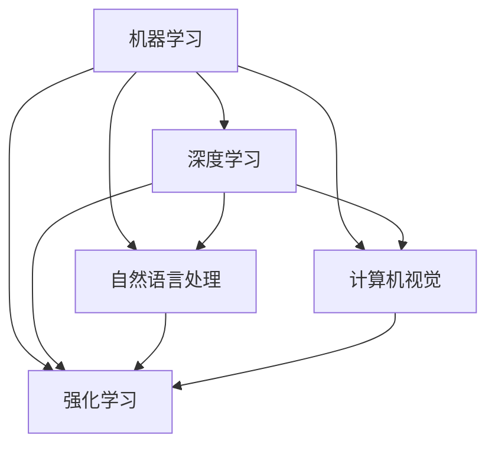
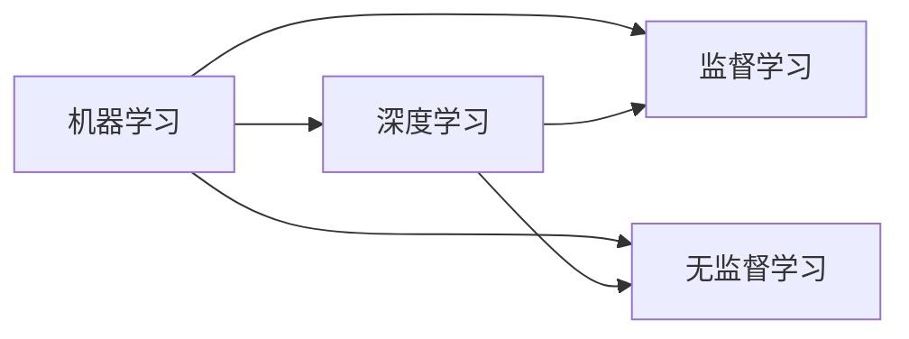
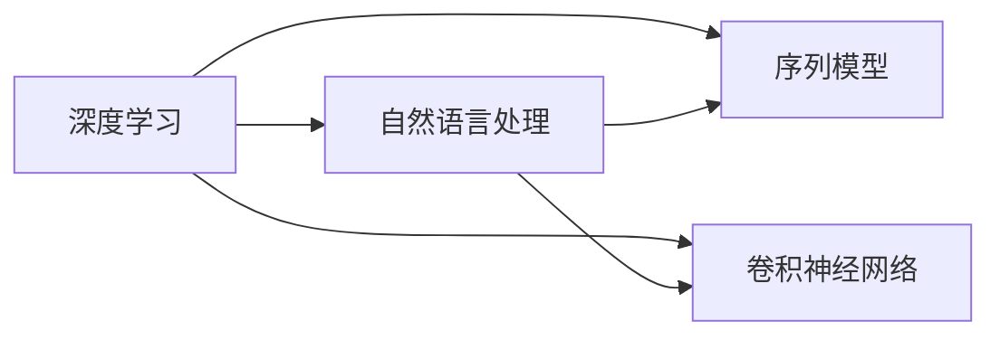
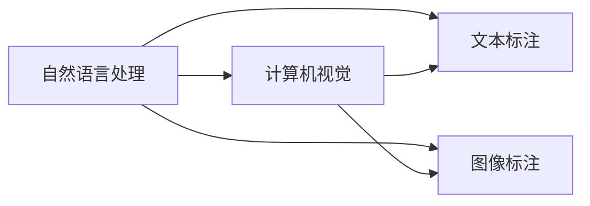
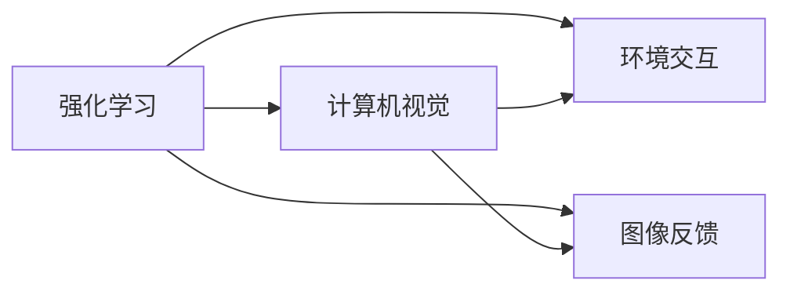
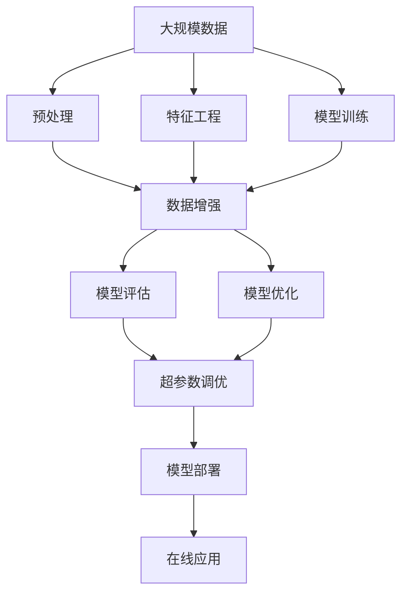

                 

# 人工智能基础原理与代码实战案例讲解

> 关键词：人工智能,基础原理,代码实战,案例讲解

## 1. 背景介绍

### 1.1 问题由来
人工智能（Artificial Intelligence, AI）作为21世纪最为热门的技术之一，已经渗透到各个领域，如自动驾驶、自然语言处理、医疗诊断等。随着AI技术的深入发展，越来越多的企业、研究机构和个人投入到AI的开发和应用中。

然而，AI领域的入门门槛较高，需要掌握广泛的知识和技能。对于初学者而言，如何系统地学习AI的基础原理，并将其应用于实际项目中，是一个重要而迫切的需求。

### 1.2 问题核心关键点
本文旨在帮助读者全面掌握AI的基础原理，并通过具体实战案例讲解，理解如何在实际项目中应用这些原理。文章将分为以下几个部分进行阐述：

1. **AI基础原理**：介绍机器学习、深度学习、自然语言处理等AI核心技术的基础概念和原理。
2. **代码实战案例**：通过具体的AI项目案例，展示AI技术的实际应用。
3. **案例讲解**：详细解析案例中的关键技术点，帮助读者深入理解AI项目开发的每一个环节。

### 1.3 问题研究意义
掌握AI基础原理和实战案例讲解，对于提升AI项目开发能力和技术水平具有重要意义：

1. 提升技术理解：通过理论知识与实际项目结合，帮助读者更深刻地理解AI技术。
2. 加速项目开发：掌握核心技术后，可以快速高效地开发和部署AI项目。
3. 促进持续学习：理解AI原理与实战案例，有助于持续学习和自我提升。
4. 增强问题解决能力：掌握AI技术，有助于在实际项目中解决复杂问题。
5. 推动行业应用：帮助企业将AI技术转化为实际应用，推动AI技术在各个行业中的应用。

## 2. 核心概念与联系

### 2.1 核心概念概述

在深入理解AI技术之前，需要掌握一些关键概念，这些概念构成了AI技术的基石：

- **机器学习（Machine Learning, ML）**：通过算法让计算机从数据中学习规律，并应用于预测、分类等任务。
- **深度学习（Deep Learning, DL）**：一种特殊的机器学习技术，通过多层次神经网络实现对复杂数据的建模和处理。
- **自然语言处理（Natural Language Processing, NLP）**：使计算机能够理解、处理和生成自然语言的技术。
- **计算机视觉（Computer Vision, CV）**：使计算机能够理解、处理和生成图像和视频的技术。
- **强化学习（Reinforcement Learning, RL）**：通过智能体在环境中交互，学习最优策略的技术。

这些概念之间存在着紧密的联系，共同构成了AI技术的核心框架：

### 2.2 概念间的关系

这些核心概念之间存在着相互依赖和促进的关系，下面通过几个Mermaid流程图来展示这些概念之间的关系：

#### 2.2.1 机器学习与深度学习的关系

这个流程图展示了机器学习和深度学习之间的相互关系。深度学习是机器学习的一个分支，通过多层神经网络实现对复杂数据的建模。

#### 2.2.2 深度学习与自然语言处理的关系

这个流程图展示了深度学习与自然语言处理之间的相互关系。自然语言处理是深度学习在文本处理领域的一个应用，通过序列模型和卷积神经网络等技术实现文本的建模和处理。

#### 2.2.3 自然语言处理与计算机视觉的关系

这个流程图展示了自然语言处理与计算机视觉之间的相互关系。计算机视觉中的图像标注和自然语言处理中的文本标注，是两者之间的重要交集，都涉及图像和文本数据的处理。

#### 2.2.4 强化学习与计算机视觉的关系

这个流程图展示了强化学习与计算机视觉之间的相互关系。强化学习通过智能体在环境中交互，学习最优策略，可以应用于计算机视觉中的图像处理任务。

### 2.3 核心概念的整体架构

最后，我们用一个综合的流程图来展示这些核心概念在大规模AI项目中的整体架构：

这个综合流程图展示了从数据预处理到模型部署的完整流程，各个环节相互依赖，共同构成了一个完整的AI项目。

## 3. 核心算法原理 & 具体操作步骤

### 3.1 算法原理概述

AI技术的基础原理涉及机器学习、深度学习、自然语言处理等多个领域。下面将逐一介绍这些核心算法的原理和应用。

#### 3.1.1 机器学习原理

机器学习通过算法让计算机从数据中学习规律，并应用于预测、分类等任务。其主要原理包括：

- **监督学习**：通过有标签数据训练模型，并应用于预测任务。例如，分类任务中，模型通过学习历史数据中的特征和标签，预测新数据点的标签。
- **无监督学习**：通过无标签数据训练模型，并应用于聚类、降维等任务。例如，K-means聚类算法，通过数据点之间的距离，将数据点分为若干簇。

#### 3.1.2 深度学习原理

深度学习通过多层神经网络实现对复杂数据的建模和处理。其主要原理包括：

- **前向传播**：将输入数据逐层传递，得到最终输出。例如，卷积神经网络（CNN）中的卷积层和池化层。
- **反向传播**：通过链式法则计算损失函数对各层权重的梯度，并更新权重。例如，基于梯度的优化算法（如SGD、Adam等）。

#### 3.1.3 自然语言处理原理

自然语言处理使计算机能够理解、处理和生成自然语言。其主要原理包括：

- **分词**：将文本分成单词或词组。例如，Word2Vec模型中的分词过程。
- **词嵌入**：将单词映射到向量空间，表示单词的语义关系。例如，GloVe模型中的词嵌入过程。
- **序列模型**：将文本序列映射为向量序列，并应用于语言模型和机器翻译等任务。例如，RNN和LSTM模型。

#### 3.1.4 计算机视觉原理

计算机视觉使计算机能够理解、处理和生成图像和视频。其主要原理包括：

- **图像预处理**：对图像进行去噪、归一化等处理，增强图像质量。例如，图像增强算法中的滤波器。
- **特征提取**：提取图像中的重要特征，用于图像分类、目标检测等任务。例如，SIFT和HOG特征提取算法。
- **卷积神经网络**：通过多层卷积和池化操作，提取图像的局部特征。例如，LeNet和AlexNet模型。

#### 3.1.5 强化学习原理

强化学习通过智能体在环境中交互，学习最优策略。其主要原理包括：

- **环境交互**：智能体在环境中执行动作，并根据动作结果获得奖励或惩罚。例如，AlphaGo模型中的蒙特卡洛树搜索。
- **策略优化**：通过强化学习算法（如Q-learning、Policy Gradient等），优化智能体的策略，使其在环境中获得最大奖励。

### 3.2 算法步骤详解

#### 3.2.1 机器学习算法步骤

1. **数据预处理**：对原始数据进行清洗、去噪、归一化等处理，准备用于模型训练的数据集。
2. **特征工程**：对数据进行特征提取和转换，提取有助于模型学习的特征。
3. **模型训练**：使用训练集对模型进行训练，调整模型参数，使其能够更好地拟合数据。
4. **模型评估**：使用测试集对模型进行评估，评估模型性能和泛化能力。
5. **模型优化**：根据评估结果，调整模型参数或选择新的模型，进一步优化模型性能。

#### 3.2.2 深度学习算法步骤

1. **数据预处理**：对原始数据进行清洗、去噪、归一化等处理，准备用于模型训练的数据集。
2. **特征工程**：对数据进行特征提取和转换，提取有助于模型学习的特征。
3. **模型设计**：设计多层次神经网络模型，选择合适的激活函数、损失函数等。
4. **模型训练**：使用训练集对模型进行训练，调整模型参数，使其能够更好地拟合数据。
5. **模型评估**：使用测试集对模型进行评估，评估模型性能和泛化能力。
6. **模型优化**：根据评估结果，调整模型参数或选择新的模型，进一步优化模型性能。

#### 3.2.3 自然语言处理算法步骤

1. **分词**：对文本进行分词处理，得到单词或词组序列。
2. **词嵌入**：将单词映射到向量空间，表示单词的语义关系。
3. **序列建模**：使用序列模型（如RNN、LSTM）对文本序列进行建模。
4. **模型训练**：使用训练集对模型进行训练，调整模型参数，使其能够更好地拟合数据。
5. **模型评估**：使用测试集对模型进行评估，评估模型性能和泛化能力。
6. **模型优化**：根据评估结果，调整模型参数或选择新的模型，进一步优化模型性能。

#### 3.2.4 计算机视觉算法步骤

1. **图像预处理**：对图像进行去噪、归一化等处理，增强图像质量。
2. **特征提取**：提取图像中的重要特征，用于图像分类、目标检测等任务。
3. **卷积神经网络**：使用卷积神经网络对图像进行建模。
4. **模型训练**：使用训练集对模型进行训练，调整模型参数，使其能够更好地拟合数据。
5. **模型评估**：使用测试集对模型进行评估，评估模型性能和泛化能力。
6. **模型优化**：根据评估结果，调整模型参数或选择新的模型，进一步优化模型性能。

#### 3.2.5 强化学习算法步骤

1. **环境交互**：智能体在环境中执行动作，并根据动作结果获得奖励或惩罚。
2. **策略设计**：设计智能体的策略，选择合适的动作空间和奖励函数。
3. **模型训练**：使用强化学习算法对策略进行训练，调整策略参数，使其能够更好地适应环境。
4. **模型评估**：在测试环境中评估智能体的性能，评估智能体在环境中的表现。
5. **模型优化**：根据评估结果，调整策略参数或选择新的策略，进一步优化智能体性能。

### 3.3 算法优缺点

#### 3.3.1 机器学习优缺点

- **优点**：
  - 数据驱动，能够适应数据分布的变化。
  - 方法成熟，容易理解和实现。
  - 能够处理各种类型的任务，如分类、回归等。

- **缺点**：
  - 需要大量标注数据，成本较高。
  - 模型复杂度较高，容易过拟合。
  - 对于复杂任务，需要较强的特征工程能力。

#### 3.3.2 深度学习优缺点

- **优点**：
  - 能够处理复杂数据，如图像、语音等。
  - 模型性能优异，能够获得更好的泛化能力。
  - 自动特征提取，减少了特征工程的工作量。

- **缺点**：
  - 模型复杂度较高，训练和推理耗时较长。
  - 需要大量计算资源，对硬件要求较高。
  - 对于大规模数据集，训练过程较慢。

#### 3.3.3 自然语言处理优缺点

- **优点**：
  - 能够处理文本数据，广泛应用于NLP领域。
  - 方法成熟，技术较完善。
  - 能够实现文本的分类、翻译、情感分析等任务。

- **缺点**：
  - 对于长文本，模型计算量较大。
  - 对于领域特定的任务，需要针对性的模型和数据。
  - 对于多语言处理，需要多语言的预训练模型。

#### 3.3.4 计算机视觉优缺点

- **优点**：
  - 能够处理图像和视频数据，广泛应用于CV领域。
  - 方法成熟，技术较完善。
  - 能够实现图像分类、目标检测、图像生成等任务。

- **缺点**：
  - 对于高分辨率图像，模型计算量较大。
  - 对于大规模数据集，训练过程较慢。
  - 对于实时性要求较高的任务，推理速度较慢。

#### 3.3.5 强化学习优缺点

- **优点**：
  - 能够处理复杂环境，实现自适应和自学习。
  - 能够处理多智能体的交互任务。
  - 能够实现智能决策和优化策略。

- **缺点**：
  - 需要大量环境数据，成本较高。
  - 模型复杂度较高，训练过程较慢。
  - 对于环境变化较大的任务，需要不断调整策略。

### 3.4 算法应用领域

#### 3.4.1 机器学习应用领域

机器学习广泛应用于各个领域，如金融、医疗、电商等。例如：

- **金融风控**：使用机器学习模型进行风险评估和信用评分。
- **医疗诊断**：使用机器学习模型进行疾病预测和诊断。
- **电商推荐**：使用机器学习模型进行用户推荐和个性化展示。

#### 3.4.2 深度学习应用领域

深度学习在图像、语音、自然语言处理等领域有广泛应用。例如：

- **图像识别**：使用深度学习模型进行图像分类、目标检测等任务。
- **语音识别**：使用深度学习模型进行语音识别和语音合成。
- **自然语言处理**：使用深度学习模型进行文本分类、情感分析等任务。

#### 3.4.3 自然语言处理应用领域

自然语言处理广泛应用于智能客服、机器翻译、情感分析等领域。例如：

- **智能客服**：使用自然语言处理模型进行智能对话和客户服务。
- **机器翻译**：使用自然语言处理模型进行多语言翻译和跨语言沟通。
- **情感分析**：使用自然语言处理模型进行情感分类和舆情分析。

#### 3.4.4 计算机视觉应用领域

计算机视觉广泛应用于智能监控、自动驾驶、图像识别等领域。例如：

- **智能监控**：使用计算机视觉模型进行人脸识别和行为分析。
- **自动驾驶**：使用计算机视觉模型进行目标检测和路径规划。
- **图像识别**：使用计算机视觉模型进行图像分类和物体检测。

#### 3.4.5 强化学习应用领域

强化学习广泛应用于游戏、机器人、自动化等领域。例如：

- **游戏AI**：使用强化学习模型进行游戏策略优化和智能决策。
- **机器人控制**：使用强化学习模型进行机器人路径规划和任务执行。
- **自动化流程**：使用强化学习模型进行自动化流程优化和调度。

## 4. 数学模型和公式 & 详细讲解 & 举例说明

### 4.1 数学模型构建

在AI项目开发中，数学模型是核心。下面将介绍几个典型的数学模型及其构建方法。

#### 4.1.1 线性回归模型

线性回归模型用于处理连续变量的预测任务，其数学模型为：

$$
y = \beta_0 + \beta_1x_1 + \beta_2x_2 + \cdots + \beta_nx_n + \epsilon
$$

其中，$y$表示预测值，$x_1, x_2, \cdots, x_n$表示输入变量，$\beta_0, \beta_1, \beta_2, \cdots, \beta_n$表示回归系数，$\epsilon$表示误差项。

#### 4.1.2 逻辑回归模型

逻辑回归模型用于处理二分类任务的预测，其数学模型为：

$$
\log \frac{p(y=1)}{1-p(y=1)} = \beta_0 + \beta_1x_1 + \beta_2x_2 + \cdots + \beta_nx_n
$$

其中，$p(y=1)$表示预测值为1的概率，$x_1, x_2, \cdots, x_n$表示输入变量，$\beta_0, \beta_1, \beta_2, \cdots, \beta_n$表示回归系数。

#### 4.1.3 支持向量机模型

支持向量机模型用于处理分类任务，其数学模型为：

$$
f(x) = \sum_{i=1}^{n} \alpha_iy_i\langle x, x_i \rangle - \frac{1}{2}\sum_{i=1}^{n}\sum_{j=1}^{n}\alpha_i\alpha_jy_iy_j\langle x_i, x_j \rangle + \frac{1}{2}\sum_{i=1}^{n}\alpha_i^2
$$

其中，$f(x)$表示预测值，$x$表示输入变量，$\alpha_i$表示每个样本的拉格朗日乘子，$y_i$表示标签。

#### 4.1.4 卷积神经网络模型

卷积神经网络模型用于处理图像数据，其数学模型为：

$$
f(x) = \sum_{i=1}^{n} \alpha_iw_i\langle x, w_i \rangle + b
$$

其中，$f(x)$表示预测值，$x$表示输入变量，$w_i$表示卷积核权重，$b$表示偏置项。

#### 4.1.5 循环神经网络模型

循环神经网络模型用于处理序列数据，其数学模型为：

$$
f(x) = \sum_{i=1}^{n} \alpha_iw_i\langle x, w_i \rangle + b
$$

其中，$f(x)$表示预测值，$x$表示输入变量，$w_i$表示循环神经网络的权重，$b$表示偏置项。

#### 4.1.6 强化学习模型

强化学习模型用于处理智能体在环境中执行动作并根据动作结果获得奖励或惩罚的问题，其数学模型为：

$$
Q(s, a) = r + \gamma \max_a' Q(s', a')
$$

其中，$Q(s, a)$表示在状态$s$下执行动作$a$的Q值，$r$表示即时奖励，$s'$表示下一个状态，$\gamma$表示折扣因子，$a'$表示在状态$s'$下可能执行的动作。

### 4.2 公式推导过程

#### 4.2.1 线性回归模型公式推导

线性回归模型的损失函数为均方误差，其推导过程如下：

$$
\mathcal{L} = \frac{1}{2m} \sum_{i=1}^{m}(y_i - \hat{y}_i)^2
$$

其中，$\mathcal{L}$表示损失函数，$y_i$表示真实值，$\hat{y}_i$表示预测值，$m$表示样本数量。

根据梯度下降算法，求取损失函数对回归系数的梯度，更新回归系数：

$$
\beta_j = \beta_j - \eta \frac{1}{m} \sum_{i=1}^{m}(y_i - \hat{y}_i)x_{ij}
$$

其中，$\beta_j$表示第$j$个回归系数，$\eta$表示学习率，$\hat{y}_i$表示预测值，$x_{ij}$表示第$i$个样本的第$j$个特征。

#### 4.2.2 逻辑回归模型公式推导

逻辑回归模型的损失函数为交叉熵，其推导过程如下：

$$
\mathcal{L} = -\frac{1}{m} \sum_{i=1}^{m}(y_i\log \hat{y}_i + (1-y_i)\log (1-\hat{y}_i))
$$

其中，$\mathcal{L}$表示损失函数，$y_i$表示真实值，$\hat{y}_i$表示预测值，$m$表示样本数量。

根据梯度下降算法，求取损失函数对回归系数的梯度，更新回归系数：

$$
\beta_j = \beta_j - \eta \frac{1}{m} \sum_{i=1}^{m}(y_i - \hat{y}_i)x_{ij}
$$

其中，$\beta_j$表示第$j$个回归系数，$\eta$表示学习率，$\hat{y}_i$表示预测值，$x_{ij}$表示第$i$个样本的第$j$个特征。

#### 4.2.3 支持向量机模型公式推导

支持向量机模型的损失函数为合页损失，其推导过程如下：

$$
\mathcal{L} = \frac{1}{m} \sum_{i=1}^{m}[\max(0, 1 - y_i f(x_i))]
$$

其中，$\mathcal{L}$表示损失函数，$y_i$表示真实值，$f(x_i)$表示预测值，$m$表示样本数量。

根据梯度下降算法，求取损失函数对回归系数的梯度，更新回归系数：

$$
\alpha_i = \alpha_i - \eta \frac{1}{m} \sum_{i=1}^{m}\alpha_iy_i\langle x_i, x_j \rangle - \frac{\lambda}{m} \alpha_i
$$

其中，$\alpha_i$表示每个样本的拉格朗日乘子，$\eta$表示学习率，$y_i$表示真实值，$f(x_i)$表示预测值，$x_i, x_j$表示样本向量，$\lambda$表示正则化参数。

#### 4.2.4 卷积神经网络模型公式推导

卷积神经网络模型的损失函数为均方误差，其推导过程如下：

$$
\mathcal{L} = \frac{1}{m} \sum_{i=1}^{m}(y_i - \hat{y}_i)^2
$$

其中，$\mathcal{L}$表示损失函数，$y_i$表示真实值，$\hat{y}_i$表示预测值，$m$表示样本数量。

根据梯度下降算法，求取损失函数对卷积核权重和偏置项的梯度，更新权重和偏置项：

$$
w_i = w_i - \eta \frac{1}{m} \sum_{i=1}^{m}(y_i - \hat{y}_i)x_{ij}
$$

$$
b = b - \eta \frac{1}{m} \sum_{i=1}^{m}(y_i - \hat{y}_i)
$$

其中，$w_i$表示卷积核权重，$b$表示偏置项，$x_{ij}$表示第$i$个样本的第$j$个特征，$\eta$表示学习率。

#### 4.2.5 循环神经网络模型公式推导

循环神经网络模型的损失函数为均方误差，其推导过程如下：

$$
\mathcal{L} = \frac{1}{m} \sum_{i=1}^{m}(y_i - \hat{y}_i)^2
$$

其中，$\mathcal{L}$表示损失函数，$y_i$表示真实值，$\hat{y}_i$表示预测值，$m$表示样本数量。

根据梯度下降算法，求取损失函数对循环神经网络权重和偏置项的梯度，更新权重和偏置项：

$$
w_i = w_i - \eta \frac{1}{m} \sum_{i=1}^{m}(y_i - \hat{y}_i)x_{ij}
$$

$$
b = b - \eta \frac{1}{m} \sum_{i=1}^{m}(y_i - \hat{y}_i)
$$

其中，$w_i$表示循环神经网络的权重，$b$表示偏置项，$x_{ij}$表示第$i$个样本的第$j$个特征，$\eta$表示学习率。

#### 4.2.6 强化学习模型公式推导

强化学习模型的损失函数为累积奖励，其推导过程如下：

$$
\mathcal{L} = -\frac{1}{m} \sum_{i=1}^{m} \sum_{t=1}^{T} r_t
$$

其中，$\mathcal{L}$表示损失函数，

