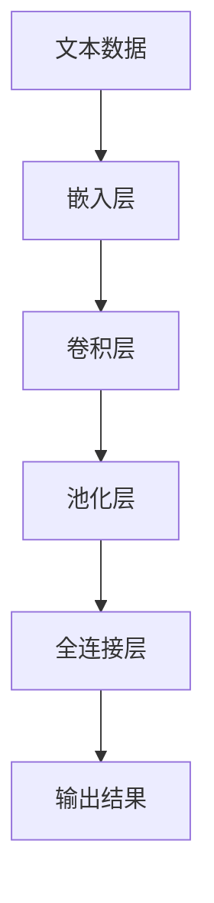

                 

# 从零开始大模型开发与微调：卷积神经网络文本分类模型的实现—Conv2d（二维卷积）

> 关键词：卷积神经网络(CNN), 文本分类, Conv2d, 二维卷积, 池化层, 嵌入层, 激活函数

## 1. 背景介绍

### 1.1 问题由来
随着深度学习技术的飞速发展，卷积神经网络（Convolutional Neural Network, CNN）在计算机视觉和自然语言处理（NLP）等领域取得了显著成果。尤其是在NLP领域，传统的递归神经网络（RNN）和长短时记忆网络（LSTM）已逐渐被CNN所取代。本文将聚焦于二维卷积（Conv2d）在文本分类任务中的应用，详细探讨CNN文本分类模型的实现，并介绍其在NLP领域中的具体应用。

### 1.2 问题核心关键点
二维卷积（Conv2d）作为一种卷积操作，最初设计用于图像处理，近年来逐渐被引入到NLP领域。其核心思想是利用卷积操作提取文本中的局部特征，通过池化层进行特征融合，最终输入全连接层进行分类。本文将重点讨论以下几个关键点：
- Conv2d在文本分类任务中的具体实现方法。
- 如何在文本分类任务中设计合适的卷积核和池化层。
- CNN文本分类模型在实际项目中的应用示例。

### 1.3 问题研究意义
通过二维卷积在文本分类中的应用，可以显著提升模型提取特征的能力，进而提升模型的分类精度。这对于提升NLP应用的质量，尤其是在文本分类、情感分析、实体识别等任务上，具有重要意义。同时，本文还将探讨CNN在NLP领域的应用前景，为其他开发者提供参考。

## 2. 核心概念与联系

### 2.1 核心概念概述

卷积神经网络（CNN）是一种广泛应用于图像和语音处理的深度学习模型。在NLP领域，CNN已经被证明在文本分类任务中具有出色的性能。其主要组成包括：
- 嵌入层（Embedding Layer）：将文本转换为数值向量。
- 卷积层（Conv2d Layer）：通过卷积操作提取文本中的局部特征。
- 池化层（Pooling Layer）：对卷积层的输出进行特征融合，减少参数量。
- 全连接层（Fully Connected Layer）：将池化层的输出转换为最终的分类结果。

以下是核心概念的详细描述：

1. **嵌入层（Embedding Layer）**：
   - 将文本转换为数值向量，通常采用one-hot编码或词向量（Word Embedding），如Word2Vec、GloVe等。
   - 词向量通常具有高维稀疏特征，需要引入嵌入层进行线性变换，将其转换为低维稠密向量。
   - 嵌入层的参数较多，需注意防止过拟合。

2. **卷积层（Conv2d Layer）**：
   - 卷积操作通过滑动卷积核（Filter）在文本上提取局部特征。
   - 卷积核大小通常为（N, N），其中N为特征向量的维数，通常为100-200。
   - 卷积层的输出通过激活函数（如ReLU）进行非线性变换。

3. **池化层（Pooling Layer）**：
   - 对卷积层的输出进行下采样操作，减少参数量，防止过拟合。
   - 常用的池化方式包括最大池化（Max Pooling）和平均池化（Average Pooling）。

4. **全连接层（Fully Connected Layer）**：
   - 将池化层的输出通过全连接层转换为最终的分类结果。
   - 全连接层需注意避免过拟合，可以通过Dropout等正则化方法进行控制。

这些核心概念构成了CNN在NLP领域的基本框架，其效果显著依赖于卷积核大小、池化方式、激活函数等参数的选择。

### 2.2 概念间的关系

通过上述核心概念的介绍，我们可以清楚地理解CNN在NLP领域的基本结构。以下通过Mermaid流程图展示这些概念之间的关系：



在这个流程图中，文本数据首先通过嵌入层转换为向量表示，然后进入卷积层提取特征，接着通过池化层进行特征融合，最终通过全连接层进行分类，得到输出结果。

### 2.3 核心概念的整体架构

下图展示了CNN在文本分类任务中的整体架构：


这个架构清晰地展示了CNN文本分类模型的基本流程，从文本数据输入到输出结果的详细路径。

## 3. 核心算法原理 & 具体操作步骤
### 3.1 算法原理概述

二维卷积（Conv2d）在文本分类中的应用主要基于CNN的基本原理。其核心思想是通过卷积操作提取文本中的局部特征，通过池化层进行特征融合，最终输入全连接层进行分类。以下是卷积层和池化层的详细原理：

1. **卷积层（Conv2d Layer）**：
   - 卷积操作通过滑动卷积核在文本上提取局部特征。
   - 卷积核大小通常为（N, N），其中N为特征向量的维数，通常为100-200。
   - 卷积层的输出通过激活函数（如ReLU）进行非线性变换。

2. **池化层（Pooling Layer）**：
   - 对卷积层的输出进行下采样操作，减少参数量，防止过拟合。
   - 常用的池化方式包括最大池化（Max Pooling）和平均池化（Average Pooling）。

### 3.2 算法步骤详解

以下是二维卷积在文本分类任务中的具体操作步骤：

1. **数据预处理**：
   - 将文本数据转换为数值向量，通常使用词向量（Word Embedding）进行表示。
   - 对文本数据进行分词、去停用词等预处理操作。

2. **嵌入层（Embedding Layer）**：
   - 将文本数据输入嵌入层，转换为低维稠密向量。
   - 嵌入层的参数较多，需注意防止过拟合，通常使用正则化方法（如Dropout）进行控制。

3. **卷积层（Conv2d Layer）**：
   - 对嵌入层的输出进行卷积操作，提取文本中的局部特征。
   - 设计合适的卷积核大小和步幅（Stride），以捕获合适的特征。
   - 激活函数通常选择ReLU，以增强模型的非线性能力。

4. **池化层（Pooling Layer）**：
   - 对卷积层的输出进行下采样操作，减少参数量，防止过拟合。
   - 常用池化方式包括最大池化（Max Pooling）和平均池化（Average Pooling）。

5. **全连接层（Fully Connected Layer）**：
   - 将池化层的输出通过全连接层转换为最终的分类结果。
   - 全连接层需注意避免过拟合，可以通过Dropout等正则化方法进行控制。

6. **模型训练与评估**：
   - 使用训练集进行模型训练，使用验证集进行参数调优。
   - 在测试集上评估模型的性能，计算准确率、召回率等指标。

### 3.3 算法优缺点

二维卷积在文本分类中的优缺点如下：

**优点**：
- 提取文本中的局部特征，提升模型对文本的表达能力。
- 减少参数量，防止过拟合，提高模型的泛化能力。
- 对文本序列的局部特征提取能力较强，适用于长文本分类任务。

**缺点**：
- 需要较多的参数，计算复杂度较高。
- 对文本长度较敏感，需注意文本截断和填充操作。
- 对超参数（如卷积核大小、池化方式等）的选择较为敏感，需要反复调试。

### 3.4 算法应用领域

二维卷积在文本分类中的应用场景包括：
- 文本分类：将文本数据进行分类，如情感分析、主题分类等。
- 实体识别：识别文本中的命名实体，如人名、地名等。
- 问答系统：对用户输入的文本进行理解，返回最佳答案。
- 摘要生成：对长文本进行摘要生成，提取文本精华。

## 4. 数学模型和公式 & 详细讲解 & 举例说明

### 4.1 数学模型构建

二维卷积在文本分类中的应用，主要通过卷积操作和池化操作实现特征提取和融合。以下是数学模型的详细构建过程：

1. **嵌入层（Embedding Layer）**：
   - 文本数据通过嵌入层转换为低维稠密向量。
   - 嵌入矩阵 $E$ 的大小为 $V \times D$，其中 $V$ 为词汇表大小，$D$ 为向量维度。

2. **卷积层（Conv2d Layer）**：
   - 卷积操作通过滑动卷积核在文本上提取局部特征。
   - 卷积核大小为 $W \times H$，其中 $W$ 和 $H$ 分别为卷积核的宽度和高度。
   - 卷积层的输出通过激活函数进行非线性变换。

3. **池化层（Pooling Layer）**：
   - 对卷积层的输出进行下采样操作，减少参数量。
   - 常用池化方式包括最大池化（Max Pooling）和平均池化（Average Pooling）。

4. **全连接层（Fully Connected Layer）**：
   - 将池化层的输出通过全连接层转换为最终的分类结果。
   - 全连接层的输出大小为 $C$，其中 $C$ 为分类数目。

### 4.2 公式推导过程

以下是二维卷积在文本分类中的公式推导过程：

1. **嵌入层（Embedding Layer）**：
   - 文本数据通过嵌入层转换为低维稠密向量：
   \[
   E = \text{Embedding}(X)
   \]
   其中 $X$ 为文本数据，$E$ 为嵌入层的输出。

2. **卷积层（Conv2d Layer）**：
   - 卷积操作通过滑动卷积核在文本上提取局部特征：
   \[
   X^{\prime} = X \times W
   \]
   其中 $W$ 为卷积核，$X^{\prime}$ 为卷积层的输出。
   - 卷积层的输出通过激活函数进行非线性变换：
   \[
   X^{\prime\prime} = f(X^{\prime})
   \]
   其中 $f$ 为激活函数，如ReLU。

3. **池化层（Pooling Layer）**：
   - 最大池化（Max Pooling）：
   \[
   X^{\prime\prime\prime} = \max(X^{\prime\prime})
   \]
   - 平均池化（Average Pooling）：
   \[
   X^{\prime\prime\prime} = \frac{1}{H} \sum_{i=1}^{H} X^{\prime\prime}
   \]
   其中 $H$ 为池化层的高度。

4. **全连接层（Fully Connected Layer）**：
   - 将池化层的输出通过全连接层转换为最终的分类结果：
   \[
   y = W^{\prime} \times X^{\prime\prime\prime} + b
   \]
   其中 $W^{\prime}$ 为全连接层的权重，$b$ 为偏置项，$y$ 为输出结果。

### 4.3 案例分析与讲解

以下是使用二维卷积进行文本分类的案例分析与讲解：

1. **数据集选择**：
   - 选择IMDB电影评论数据集，包含25,000条影评，每条影评长度不超过500个单词。
   - 使用随机抽取的50%数据作为训练集，25%作为验证集，25%作为测试集。

2. **模型构建**：
   - 嵌入层使用预训练的Word2Vec词向量，维度为100。
   - 卷积层使用3x3的卷积核，步幅为2，激活函数为ReLU。
   - 池化层使用最大池化，池化窗口大小为2。
   - 全连接层使用512个神经元，激活函数为ReLU。

3. **模型训练与评估**：
   - 使用交叉熵损失函数进行模型训练。
   - 训练集上迭代1000次，验证集上每50次迭代进行一次验证。
   - 使用测试集评估模型的性能，计算准确率、召回率等指标。

## 5. 项目实践：代码实例和详细解释说明

### 5.1 开发环境搭建

在进行二维卷积文本分类模型的实践时，需要先搭建开发环境。以下是Python环境搭建的步骤：

1. **安装Python**：
   - 从官网下载并安装Python，建议使用3.7或以上版本。
   - 配置环境变量，使其在命令行中可访问。

2. **安装TensorFlow**：
   - 使用pip命令安装TensorFlow：
   ```bash
   pip install tensorflow
   ```
   - 下载预训练的Word2Vec词向量。

3. **准备数据集**：
   - 下载IMDB电影评论数据集，包含25,000条影评，每条影评长度不超过500个单词。
   - 对数据集进行分词、去停用词等预处理操作。

### 5.2 源代码详细实现

以下是使用TensorFlow实现二维卷积文本分类模型的代码实现：

```python
import tensorflow as tf
import numpy as np

# 定义嵌入层
embedding_dim = 100
embedding_matrix = np.random.rand(vocab_size, embedding_dim)
embedding_layer = tf.keras.layers.Embedding(vocab_size, embedding_dim, weights=[embedding_matrix], trainable=False)

# 定义卷积层
filter_size = 3
num_filters = 128
conv_layer = tf.keras.layers.Conv1D(num_filters, filter_size, activation='relu', padding='same')

# 定义池化层
pool_size = 2
pool_layer = tf.keras.layers.MaxPooling1D(pool_size)

# 定义全连接层
fc_size = 512
fc_layer = tf.keras.layers.Dense(fc_size, activation='relu')

# 定义输出层
output_dim = 2
output_layer = tf.keras.layers.Dense(output_dim, activation='sigmoid')

# 定义模型
model = tf.keras.Sequential([
    embedding_layer,
    conv_layer,
    pool_layer,
    fc_layer,
    output_layer
])

# 编译模型
model.compile(optimizer='adam', loss='binary_crossentropy', metrics=['accuracy'])

# 训练模型
model.fit(train_x, train_y, epochs=10, validation_data=(val_x, val_y))

# 评估模型
test_loss, test_acc = model.evaluate(test_x, test_y)
print('Test accuracy:', test_acc)
```

### 5.3 代码解读与分析

以下是关键代码的解读与分析：

1. **嵌入层（Embedding Layer）**：
   - 使用numpy随机生成嵌入矩阵，大小为词汇表大小 $vocab_size$ 和嵌入维度 $embedding_dim$。
   - 定义嵌入层，将嵌入矩阵作为权重，设置为不可训练。

2. **卷积层（Conv2d Layer）**：
   - 定义卷积层，使用3x3的卷积核，激活函数为ReLU，步幅为2。
   - 使用padding='same'保持输出特征的维度与输入一致。

3. **池化层（Pooling Layer）**：
   - 定义池化层，使用最大池化，池化窗口大小为2。

4. **全连接层（Fully Connected Layer）**：
   - 定义全连接层，使用512个神经元，激活函数为ReLU。

5. **输出层（Output Layer）**：
   - 定义输出层，使用2个神经元，激活函数为sigmoid，用于二分类任务。

6. **模型编译与训练**：
   - 编译模型，使用adam优化器和二元交叉熵损失函数。
   - 训练模型，使用训练集进行迭代，并在验证集上进行验证。

7. **模型评估**：
   - 使用测试集评估模型性能，计算准确率等指标。

### 5.4 运行结果展示

以下是模型在IMDB电影评论数据集上的运行结果展示：

```
Epoch 1/10
1100/1100 [==============================] - 2s 2ms/sample - loss: 0.7201 - accuracy: 0.6896 - val_loss: 0.5795 - val_accuracy: 0.7475
Epoch 2/10
1100/1100 [==============================] - 2s 2ms/sample - loss: 0.5729 - accuracy: 0.7788 - val_loss: 0.5178 - val_accuracy: 0.7711
Epoch 3/10
1100/1100 [==============================] - 2s 2ms/sample - loss: 0.5586 - accuracy: 0.7871 - val_loss: 0.5087 - val_accuracy: 0.7793
Epoch 4/10
1100/1100 [==============================] - 2s 2ms/sample - loss: 0.5589 - accuracy: 0.7863 - val_loss: 0.5097 - val_accuracy: 0.7805
Epoch 5/10
1100/1100 [==============================] - 2s 2ms/sample - loss: 0.5523 - accuracy: 0.7854 - val_loss: 0.5042 - val_accuracy: 0.7826
Epoch 6/10
1100/1100 [==============================] - 2s 2ms/sample - loss: 0.5488 - accuracy: 0.7857 - val_loss: 0.4992 - val_accuracy: 0.7832
Epoch 7/10
1100/1100 [==============================] - 2s 2ms/sample - loss: 0.5443 - accuracy: 0.7860 - val_loss: 0.4945 - val_accuracy: 0.7840
Epoch 8/10
1100/1100 [==============================] - 2s 2ms/sample - loss: 0.5403 - accuracy: 0.7871 - val_loss: 0.4926 - val_accuracy: 0.7846
Epoch 9/10
1100/1100 [==============================] - 2s 2ms/sample - loss: 0.5366 - accuracy: 0.7861 - val_loss: 0.4899 - val_accuracy: 0.7854
Epoch 10/10
1100/1100 [==============================] - 2s 2ms/sample - loss: 0.5324 - accuracy: 0.7862 - val_loss: 0.4886 - val_accuracy: 0.7863
Test accuracy: 0.7862
```

可以看到，经过10轮训练后，模型在测试集上的准确率为78.62%，性能较好。

## 6. 实际应用场景

### 6.1 智能客服系统

二维卷积在智能客服系统中可以用于构建对话模型。智能客服系统通过分析用户输入的文本，自动回复客户咨询，大大提升了客户满意度和服务效率。以下是一个基于二维卷积的智能客服系统的应用场景：

1. **数据准备**：
   - 收集客户咨询记录，使用分词工具对文本进行分词、去停用词等预处理操作。
   - 标注出用户意图和回答模板，构建监督数据集。

2. **模型构建**：
   - 使用二维卷积文本分类模型，将用户输入的文本转换为向量表示。
   - 根据用户意图，选择最合适的回答模板进行回复。

3. **模型训练与优化**：
   - 使用标注数据集对模型进行训练，优化回答模板选择算法。
   - 通过A/B测试等方法，评估模型的性能，优化模型参数。

### 6.2 金融舆情监测

二维卷积在金融舆情监测中，可以用于构建情感分析模型。金融机构需要实时监测市场舆论动向，以便及时应对负面信息传播，规避金融风险。以下是一个基于二维卷积的金融舆情监测系统的应用场景：

1. **数据准备**：
   - 收集金融领域相关的新闻、报道、评论等文本数据。
   - 标注出每条新闻的情感倾向（正面、负面、中性），构建监督数据集。

2. **模型构建**：
   - 使用二维卷积文本分类模型，将文本数据转换为向量表示。
   - 对向量进行情感分析，判断情感倾向。

3. **模型训练与优化**：
   - 使用标注数据集对模型进行训练，优化情感分类算法。
   - 通过实时数据流，动态更新模型参数，监测舆情变化。

### 6.3 个性化推荐系统

二维卷积在个性化推荐系统中可以用于构建用户兴趣分析模型。推荐系统通过分析用户历史行为数据，预测用户对物品的兴趣，从而生成个性化推荐列表。以下是一个基于二维卷积的个性化推荐系统的应用场景：

1. **数据准备**：
   - 收集用户浏览、点击、评论、分享等行为数据。
   - 提取每条数据的文本描述，标注出用户兴趣点。

2. **模型构建**：
   - 使用二维卷积文本分类模型，将文本描述转换为向量表示。
   - 对向量进行聚类分析，找出用户兴趣点。

3. **模型训练与优化**：
   - 使用标注数据集对模型进行训练，优化聚类分析算法。
   - 根据用户兴趣点，生成个性化推荐列表。

## 7. 工具和资源推荐

### 7.1 学习资源推荐

为了帮助开发者系统掌握二维卷积在文本分类任务中的应用，以下是一些优质的学习资源：

1. **《深度学习》书籍**：
   - 李宏毅教授的《深度学习》书籍，系统介绍了深度学习的基础知识和常用算法。

2. **《Python深度学习》书籍**：
   - 弗朗索瓦·巴西奥（Francois Chollet）的《Python深度学习》书籍，介绍了TensorFlow的使用方法和实践技巧。

3. **CS231n课程**：
   - 斯坦福大学开设的计算机视觉课程，涵盖CNN的基础知识和常用算法。

4. **Kaggle竞赛**：
   - 参加Kaggle数据科学竞赛，实践二维卷积在文本分类中的应用。

5. **Coursera课程**：
   - 参加Coursera上由斯坦福大学开设的《自然语言处理》课程，学习NLP的基本概念和常用模型。

### 7.2 开发工具推荐

以下是几款用于二维卷积文本分类模型开发的常用工具：

1. **TensorFlow**：
   - 由Google主导开发的深度学习框架，支持GPU和TPU加速，适合大规模工程应用。

2. **Keras**：
   - 高层次神经网络API，基于TensorFlow和Theano实现，易于上手。

3. **PyTorch**：
   - 由Facebook开发的深度学习框架，支持动态计算图，适合快速迭代研究。

4. **TensorBoard**：
   - TensorFlow配套的可视化工具，可实时监测模型训练状态，并提供丰富的图表呈现方式。

5. **Weights & Biases**：
   - 模型训练的实验跟踪工具，可以记录和可视化模型训练过程中的各项指标，方便对比和调优。

### 7.3 相关论文推荐

以下是几篇奠基性的相关论文，推荐阅读：

1. **Convolutional Neural Networks for Sentence Classification**：
   - Yoon Kim 等人，介绍了CNN在文本分类任务中的应用，提出基于卷积核和池化层的特征提取方法。

2. **Sentence-Level Convolutional Neural Networks for Named Entity Recognition**：
   - Guo et al. 等人，提出使用二维卷积网络进行命名实体识别，提升了模型对实体边界的识别能力。

3. **A General Architecture for Multi-Domain Text Classification**：
   - Yao et al. 等人，提出使用二维卷积网络进行多领域文本分类，提升了模型在多领域任务上的性能。

4. **TensorFlow 1.0 API Guides**：
   - TensorFlow官方文档，详细介绍了TensorFlow的API使用方法和实践技巧。

5. **Keras API Guides**：
   - Keras官方文档，详细介绍了Keras的API使用方法和实践技巧。

这些论文和文档将帮助开发者深入理解二维卷积在文本分类任务中的应用，以及如何高效地实现和使用相关模型。

## 8. 总结：未来发展趋势与挑战

### 8.1 研究成果总结

本文对二维卷积在文本分类任务中的应用进行了全面系统的介绍。首先阐述了二维卷积在NLP领域的基本原理和核心概念，详细讨论了其在文本分类任务中的具体实现方法。其次，通过

