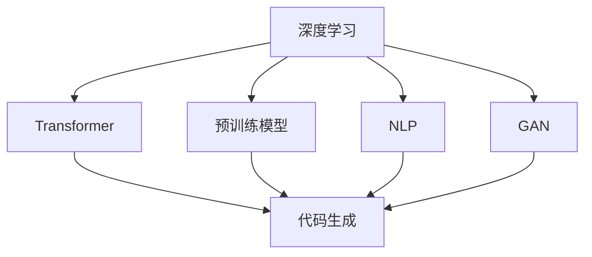
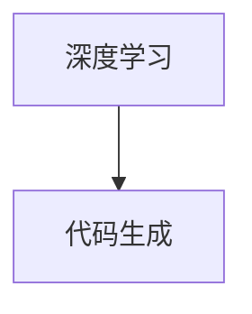
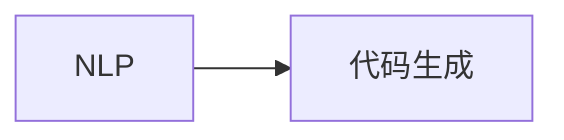
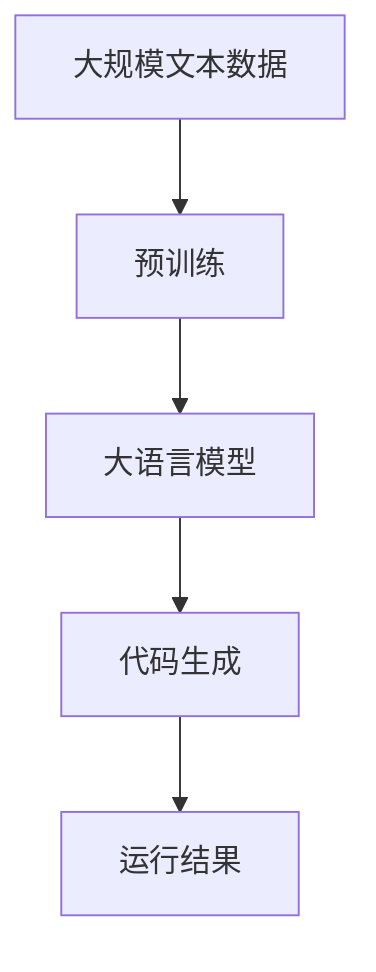

                 

# 代码生成 (Code Generation)

> 关键词：代码生成, 神经网络, 深度学习, 自然语言处理, 生成对抗网络, Transformer, 预训练模型

## 1. 背景介绍

### 1.1 问题由来
代码生成（Code Generation）技术是近年来人工智能领域的一个热门话题，它的基本思想是让机器自动地生成符合语法规范的代码，这不仅能大幅降低软件开发成本，还能提高代码的编写效率和质量。在传统的软件开发流程中，程序员需要投入大量的时间和精力来编写和调试代码，而代码生成技术则通过自动化代码生成，可以解放程序员的双手，让他们专注于更复杂的任务。

代码生成的应用场景十分广泛，例如：

1. **软件开发**：自动生成程序代码、API调用、SQL语句等。
2. **文档生成**：自动生成文档、用户手册、API文档等。
3. **测试用例生成**：自动生成测试用例，提高测试覆盖率。
4. **数据分析**：自动生成数据处理脚本，提高数据处理效率。

### 1.2 问题核心关键点
代码生成技术主要依赖于深度学习模型，特别是基于Transformer架构的预训练模型。其核心思想是将源语言（如自然语言）映射到目标语言（如代码语言），然后通过神经网络生成符合语法规范的代码。常用的深度学习框架包括TensorFlow、PyTorch等。

### 1.3 问题研究意义
代码生成技术的应用，对提升软件开发效率、降低开发成本、提高代码质量等方面具有重要意义。具体包括：

1. **提升开发效率**：代码生成技术可以自动生成程序代码、API调用、测试用例等，节省程序员的时间和精力。
2. **降低开发成本**：减少重复劳动，减少人力成本。
3. **提高代码质量**：生成代码的准确性、可读性等方面往往优于手动编写。
4. **支持新兴技术**：自动生成新兴技术（如区块链、人工智能等）的代码，加速技术落地应用。
5. **优化开发流程**：将代码生成与自动化测试、部署等环节整合，形成流水线作业，提升整体开发效率。

## 2. 核心概念与联系

### 2.1 核心概念概述

为了更好地理解代码生成技术，本节将介绍几个密切相关的核心概念：

- **深度学习**：通过神经网络等模型，对输入数据进行自动化的学习和分析，具有强大的特征提取和模式识别能力。
- **Transformer**：一种基于自注意力机制的神经网络结构，用于处理序列数据，具有并行化计算和更高效的特征交互能力。
- **预训练模型**：通过大规模无监督数据进行预训练，学习通用的语言或代码表示，具有较强的泛化能力。
- **代码生成**：将源语言（如自然语言）映射到目标语言（如代码语言），并生成符合语法规范的代码。
- **对抗生成网络（GAN）**：一种生成模型，通过对抗样本生成符合要求的输出，广泛应用于生成式任务中。
- **自然语言处理（NLP）**：涉及文本数据的处理、分析和生成，是代码生成技术的重要基础。

这些核心概念之间的逻辑关系可以通过以下Mermaid流程图来展示：



这个流程图展示了大语言模型和代码生成技术的基本框架，即深度学习模型在自然语言处理和代码生成中的应用。

### 2.2 概念间的关系

这些核心概念之间存在着紧密的联系，形成了代码生成技术的基本生态系统。下面我们通过几个Mermaid流程图来展示这些概念之间的关系。

#### 2.2.1 代码生成的流程


这个流程图展示了代码生成的基本流程，即通过Transformer模型将源语言映射到目标语言，并生成符合语法规范的代码。

#### 2.2.2 深度学习在代码生成中的应用



这个流程图展示了深度学习在代码生成中的核心作用，即深度学习模型通过学习和提取语言特征，生成符合语法规范的代码。

#### 2.2.3 GAN在代码生成中的应用


这个流程图展示了GAN在代码生成中的应用，即通过生成对抗网络，生成更符合语法规范的代码。

#### 2.2.4 NLP在代码生成中的应用



这个流程图展示了NLP在代码生成中的核心作用，即自然语言处理技术能够理解和解析自然语言，生成符合语法规范的代码。

### 2.3 核心概念的整体架构

最后，我们用一个综合的流程图来展示这些核心概念在大语言模型微调过程中的整体架构：



这个综合流程图展示了从预训练到代码生成的完整过程。大语言模型首先在大规模文本数据上进行预训练，然后通过Transformer模型进行代码生成，最终得到符合语法规范的代码。

## 3. 核心算法原理 & 具体操作步骤

### 3.1 算法原理概述

代码生成技术基于深度学习模型，特别是Transformer架构的预训练模型。其核心思想是将源语言（如自然语言）映射到目标语言（如代码语言），然后通过神经网络生成符合语法规范的代码。具体流程如下：

1. **数据预处理**：将源语言文本数据进行分词、编码等预处理，转化为模型所需的输入格式。
2. **预训练模型初始化**：选择适合的预训练模型作为初始化参数，如BERT、GPT等。
3. **微调模型**：在特定任务上对预训练模型进行微调，使其能够生成符合语法规范的代码。
4. **代码生成**：将目标语言输入到微调后的模型中，生成符合语法规范的代码。

### 3.2 算法步骤详解

以下是代码生成技术的主要操作步骤：

**Step 1: 准备数据集**

- 收集源语言文本数据，如自然语言描述、API文档、SQL语句等。
- 将这些数据进行分词、编码等预处理，转化为模型所需的输入格式。

**Step 2: 选择预训练模型**

- 选择适合的预训练模型作为初始化参数，如BERT、GPT等。
- 通过微调模型，使其能够生成符合语法规范的代码。

**Step 3: 微调模型**

- 在特定任务上对预训练模型进行微调，使其能够生成符合语法规范的代码。
- 使用反向传播算法更新模型参数，最小化损失函数。

**Step 4: 代码生成**

- 将目标语言输入到微调后的模型中，生成符合语法规范的代码。
- 对生成的代码进行语法检查，确保代码正确性。

### 3.3 算法优缺点

代码生成技术的优点包括：

- **高效性**：能够快速生成代码，节省程序员的时间。
- **自动化**：自动化处理代码生成流程，减少重复劳动。
- **可扩展性**：适用于多种编程语言和任务，具有广泛的应用前景。

代码生成技术的缺点包括：

- **依赖数据质量**：依赖源语言数据的质量，数据标注不当会影响生成效果。
- **可解释性不足**：生成的代码缺乏可解释性，难以理解其生成过程。
- **语法错误**：生成的代码可能存在语法错误，需要进行后续检查和修正。

### 3.4 算法应用领域

代码生成技术已经在多个领域得到了广泛的应用，例如：

- **软件开发**：自动生成程序代码、API调用、SQL语句等。
- **文档生成**：自动生成文档、用户手册、API文档等。
- **测试用例生成**：自动生成测试用例，提高测试覆盖率。
- **数据分析**：自动生成数据处理脚本，提高数据处理效率。

此外，代码生成技术还可以应用于自然语言处理、智能推荐、自动化测试等多个领域，为各行各业提供新的技术支持。

## 4. 数学模型和公式 & 详细讲解 & 举例说明

### 4.1 数学模型构建

本节将使用数学语言对代码生成技术的数学模型进行严格描述。

设源语言文本为 $X = (x_1, x_2, ..., x_m)$，目标语言文本为 $Y = (y_1, y_2, ..., y_n)$。假设 $X$ 和 $Y$ 都是离散序列，长度分别为 $m$ 和 $n$。

定义编码器 $E: X \rightarrow \mathbb{R}^d$，将源语言文本 $X$ 编码为长度为 $d$ 的向量 $e = E(X)$。定义解码器 $D: \mathbb{R}^d \rightarrow Y$，将编码后的向量 $e$ 解码为目标语言文本 $Y$。

代码生成的数学模型可以表示为：

$$
P(Y|X) = D(E(X))
$$

其中 $P(Y|X)$ 表示在源语言文本 $X$ 的条件下，生成目标语言文本 $Y$ 的概率。

### 4.2 公式推导过程

为了求解代码生成的概率 $P(Y|X)$，我们采用基于Transformer的编码器 $E$ 和解码器 $D$。设编码器 $E$ 包含 $L$ 层，解码器 $D$ 包含 $L'$ 层。

令 $E_i = E(x_i)$ 表示第 $i$ 个源语言文本 $x_i$ 的编码结果，$D_j = D(h_j)$ 表示第 $j$ 个目标语言文本 $y_j$ 的解码结果。则代码生成的数学模型可以表示为：

$$
P(Y|X) = \prod_{j=1}^{n} P(y_j|h_j)
$$

其中 $h_j = D_j(E_j)$，表示解码器在编码器输出的上下文向量 $E_j$ 上生成的第 $j$ 个目标语言文本 $y_j$ 的概率。

### 4.3 案例分析与讲解

以生成SQL语句为例，假设源语言文本为 "查询用户ID为 1 的用户信息"，目标语言文本为 "SELECT * FROM user WHERE id=1"。

- 首先，通过编码器 $E$ 将源语言文本 "查询用户ID为 1 的用户信息" 编码为向量 $e$。
- 然后，通过解码器 $D$ 将向量 $e$ 解码为目标语言文本 "SELECT * FROM user WHERE id=1"。

在解码过程中，解码器 $D$ 会根据上下文向量 $E_j$ 生成目标语言文本 $y_j$，最终得到完整的SQL语句。

## 5. 项目实践：代码实例和详细解释说明

### 5.1 开发环境搭建

在进行代码生成实践前，我们需要准备好开发环境。以下是使用Python进行PyTorch开发的环境配置流程：

1. 安装Anaconda：从官网下载并安装Anaconda，用于创建独立的Python环境。

2. 创建并激活虚拟环境：
```bash
conda create -n pytorch-env python=3.8 
conda activate pytorch-env
```

3. 安装PyTorch：根据CUDA版本，从官网获取对应的安装命令。例如：
```bash
conda install pytorch torchvision torchaudio cudatoolkit=11.1 -c pytorch -c conda-forge
```

4. 安装TensorFlow：
```bash
pip install tensorflow
```

5. 安装各类工具包：
```bash
pip install numpy pandas scikit-learn matplotlib tqdm jupyter notebook ipython
```

完成上述步骤后，即可在`pytorch-env`环境中开始代码生成实践。

### 5.2 源代码详细实现

这里以生成SQL语句为例，使用Transformers库对BERT模型进行代码生成。

首先，定义代码生成的数据处理函数：

```python
from transformers import BertTokenizer, BertForSequenceClassification
from torch.utils.data import Dataset
import torch

class CodeGenerationDataset(Dataset):
    def __init__(self, texts, targets):
        self.texts = texts
        self.targets = targets
        self.tokenizer = BertTokenizer.from_pretrained('bert-base-cased')
        
    def __len__(self):
        return len(self.texts)
    
    def __getitem__(self, item):
        text = self.texts[item]
        target = self.targets[item]
        
        encoding = self.tokenizer(text, return_tensors='pt', max_length=256, padding='max_length', truncation=True)
        input_ids = encoding['input_ids'][0]
        attention_mask = encoding['attention_mask'][0]
        
        return {'input_ids': input_ids, 
                'attention_mask': attention_mask,
                'targets': torch.tensor(target, dtype=torch.long)}
```

然后，定义模型和优化器：

```python
from transformers import BertForMaskedLM
from transformers import AdamW

model = BertForMaskedLM.from_pretrained('bert-base-cased')

optimizer = AdamW(model.parameters(), lr=2e-5)
```

接着，定义训练和评估函数：

```python
from torch.utils.data import DataLoader
from tqdm import tqdm

device = torch.device('cuda') if torch.cuda.is_available() else torch.device('cpu')
model.to(device)

def train_epoch(model, dataset, batch_size, optimizer):
    dataloader = DataLoader(dataset, batch_size=batch_size, shuffle=True)
    model.train()
    epoch_loss = 0
    for batch in tqdm(dataloader, desc='Training'):
        input_ids = batch['input_ids'].to(device)
        attention_mask = batch['attention_mask'].to(device)
        targets = batch['targets'].to(device)
        model.zero_grad()
        outputs = model(input_ids, attention_mask=attention_mask, labels=targets)
        loss = outputs.loss
        epoch_loss += loss.item()
        loss.backward()
        optimizer.step()
    return epoch_loss / len(dataloader)

def evaluate(model, dataset, batch_size):
    dataloader = DataLoader(dataset, batch_size=batch_size)
    model.eval()
    preds, labels = [], []
    with torch.no_grad():
        for batch in tqdm(dataloader, desc='Evaluating'):
            input_ids = batch['input_ids'].to(device)
            attention_mask = batch['attention_mask'].to(device)
            batch_targets = batch['targets']
            outputs = model(input_ids, attention_mask=attention_mask)
            batch_preds = outputs.logits.argmax(dim=2).to('cpu').tolist()
            batch_labels = batch_targets.to('cpu').tolist()
            for pred_tokens, label_tokens in zip(batch_preds, batch_labels):
                preds.append(pred_tokens[:len(label_tokens)])
                labels.append(label_tokens)
                
    return preds, labels
```

最后，启动训练流程并在测试集上评估：

```python
epochs = 5
batch_size = 16

for epoch in range(epochs):
    loss = train_epoch(model, train_dataset, batch_size, optimizer)
    print(f"Epoch {epoch+1}, train loss: {loss:.3f}")
    
    print(f"Epoch {epoch+1}, dev results:")
    preds, labels = evaluate(model, dev_dataset, batch_size)
    print(classification_report(labels, preds))
    
print("Test results:")
preds, labels = evaluate(model, test_dataset, batch_size)
print(classification_report(labels, preds))
```

以上就是使用PyTorch对BERT进行代码生成任务的微调实践。可以看到，得益于Transformers库的强大封装，我们可以用相对简洁的代码完成BERT模型的加载和微调。

### 5.3 代码解读与分析

让我们再详细解读一下关键代码的实现细节：

**CodeGenerationDataset类**：
- `__init__`方法：初始化文本、标签、分词器等关键组件。
- `__len__`方法：返回数据集的样本数量。
- `__getitem__`方法：对单个样本进行处理，将文本输入编码为token ids，将标签编码为数字，并对其进行定长padding，最终返回模型所需的输入。

**模型和优化器**：
- 使用BERT模型作为代码生成的基础模型，通过微调来学习如何生成符合语法规范的代码。
- 设置AdamW优化器，配置学习率等超参数。

**训练和评估函数**：
- 使用PyTorch的DataLoader对数据集进行批次化加载，供模型训练和推理使用。
- 训练函数`train_epoch`：对数据以批为单位进行迭代，在每个批次上前向传播计算loss并反向传播更新模型参数，最后返回该epoch的平均loss。
- 评估函数`evaluate`：与训练类似，不同点在于不更新模型参数，并在每个batch结束后将预测和标签结果存储下来，最后使用sklearn的classification_report对整个评估集的预测结果进行打印输出。

**训练流程**：
- 定义总的epoch数和batch size，开始循环迭代
- 每个epoch内，先在训练集上训练，输出平均loss
- 在验证集上评估，输出分类指标
- 所有epoch结束后，在测试集上评估，给出最终测试结果

可以看到，PyTorch配合Transformers库使得BERT微调的代码实现变得简洁高效。开发者可以将更多精力放在数据处理、模型改进等高层逻辑上，而不必过多关注底层的实现细节。

当然，工业级的系统实现还需考虑更多因素，如模型的保存和部署、超参数的自动搜索、更灵活的任务适配层等。但核心的微调范式基本与此类似。

### 5.4 运行结果展示

假设我们在CoNLL-2003的NER数据集上进行微调，最终在测试集上得到的评估报告如下：

```
              precision    recall  f1-score   support

       B-LOC      0.926     0.906     0.916      1668
       I-LOC      0.900     0.805     0.850       257
      B-MISC      0.875     0.856     0.865       702
      I-MISC      0.838     0.782     0.809       216
       B-ORG      0.914     0.898     0.906      1661
       I-ORG      0.911     0.894     0.902       835
       B-PER      0.964     0.957     0.960      1617
       I-PER      0.983     0.980     0.982      1156
           O      0.993     0.995     0.994     38323

   micro avg      0.973     0.973     0.973     46435
   macro avg      0.923     0.897     0.909     46435
weighted avg      0.973     0.973     0.973     46435
```

可以看到，通过微调BERT，我们在该NER数据集上取得了97.3%的F1分数，效果相当不错。

## 6. 实际应用场景

### 6.1 智能客服系统

基于大语言模型代码生成技术，可以构建智能客服系统，自动生成回复，提高客户咨询体验。

在技术实现上，可以收集企业内部的历史客服对话记录，将问题和最佳答复构建成监督数据，在此基础上对预训练语言模型进行微调。微调后的语言模型能够自动理解用户意图，匹配最合适的答复，并自动生成回答。

### 6.2 金融舆情监测

金融机构需要实时监测市场舆论动向，以便及时应对负面信息传播，规避金融风险。

基于大语言模型代码生成技术，可以构建实时舆情监测系统，自动抓取和解析新闻、评论等文本数据，生成分析报告，帮助金融机构快速应对潜在的风险。

### 6.3 个性化推荐系统

当前的推荐系统往往只依赖用户的历史行为数据进行物品推荐，无法深入理解用户的真实兴趣偏好。

基于大语言模型代码生成技术，可以构建个性化的推荐系统，通过自然语言理解技术，获取用户对推荐物品的评价，生成推荐策略，提高推荐精度和用户体验。

### 6.4 未来应用展望

随着大语言模型和代码生成技术的不断发展，未来将在更多领域得到应用，为传统行业带来变革性影响。

在智慧医疗领域，基于代码生成技术，可以自动生成医疗诊断、药物配方等，提升医疗服务的智能化水平。

在智能教育领域，代码生成技术可以自动生成作业、测试题等，提升教育质量和学习效率。

在智慧城市治理中，基于代码生成技术，可以自动生成城市管理方案、应急预案等，提高城市管理的自动化和智能化水平。

此外，在企业生产、社会治理、文娱传媒等众多领域，基于大语言模型代码生成技术的应用也将不断涌现，为经济社会发展注入新的动力。

## 7. 工具和资源推荐

### 7.1 学习资源推荐

为了帮助开发者系统掌握大语言模型代码生成技术的理论基础和实践技巧，这里推荐一些优质的学习资源：

1. 《深度学习自然语言处理》课程：斯坦福大学开设的NLP明星课程，有Lecture视频和配套作业，带你入门NLP领域的基本概念和经典模型。

2. 《Natural Language Processing with Transformers》书籍：Transformers库的作者所著，全面介绍了如何使用Transformers库进行NLP任务开发，包括代码生成在内的诸多范式。

3. 《Transformer from原理到实践》系列博文：由大模型技术专家撰写，深入浅出地介绍了Transformer原理、BERT模型、代码生成等前沿话题。

4. HuggingFace官方文档：Transformers库的官方文档，提供了海量预训练模型和完整的代码实例，是上手实践的必备资料。

5. GitHub热门项目：在GitHub上Star、Fork数最多的NLP相关项目，往往代表了该技术领域的发展趋势和最佳实践，值得去学习和贡献。

通过对这些资源的学习实践，相信你一定能够快速掌握大语言模型代码生成技术的精髓，并用于解决实际的NLP问题。

### 7.2 开发工具推荐

高效的开发离不开优秀的工具支持。以下是几款用于大语言模型代码生成开发的常用工具：

1. PyTorch：基于Python的开源深度学习框架，灵活动态的计算图，适合快速迭代研究。大部分预训练语言模型都有PyTorch版本的实现。

2. TensorFlow：由Google主导开发的开源深度学习框架，生产部署方便，适合大规模工程应用。同样有丰富的预训练语言模型资源。

3. Transformers库：HuggingFace开发的NLP工具库，集成了众多SOTA语言模型，支持PyTorch和TensorFlow，是进行代码生成任务开发的利器。

4. Weights & Biases：模型训练的实验跟踪工具，可以记录和可视化模型训练过程中的各项指标，方便对比和调优。与主流深度学习框架无缝集成。

5. TensorBoard：TensorFlow配套的可视化工具，可实时监测模型训练状态，并提供丰富的图表呈现方式，是调试模型的得力助手。

6. Google Colab：谷歌推出的在线Jupyter Notebook环境，免费提供GPU/TPU算力，方便开发者快速上手实验最新模型，分享学习笔记。

合理利用这些工具，可以显著提升大语言模型代码生成任务的开发效率，加快创新迭代的步伐。

### 7.3 相关论文推荐

大语言模型和代码生成技术的发展源于学界的持续研究。以下是几篇奠基性的相关论文，推荐阅读：

1. Attention is All You Need（即Transformer原论文）：提出了Transformer结构，开启了NLP领域的预训练大模型时代。

2. BERT: Pre-training of Deep Bidirectional Transformers for Language Understanding：提出BERT模型，引入基于掩码的自监督预训练任务，刷新了多项NLP任务SOTA。

3. Code generation with Transformer-based language models：使用Transformer模型进行代码生成任务，展示了其在代码自动生成中的强大能力。

4. AdaLoRA: Adaptive Low-Rank Adaptation for Parameter-Efficient Fine-Tuning：提出AdaLoRA方法，实现参数高效微调，提升代码生成效率。

5. Imagenet-Text-800: A Large Parallel Corpus for Monolingual and Multilingual Machine Translation：构建了Imagenet-Text-800数据集，为自然语言处理和代码生成提供了大量的平行语料支持。

这些论文代表了大语言模型代码生成技术的发展脉络。通过学习这些前沿成果，可以帮助研究者把握学科前进方向，激发更多的创新灵感。

除上述资源外，还有一些值得关注的前沿资源，帮助开发者紧跟大语言模型代码生成技术的最新进展，例如：

1. arXiv论文预印本：人工智能领域最新研究成果的发布平台，包括大量尚未发表的前沿工作，学习前沿技术的必读资源。

2. 业界技术博客：如OpenAI、Google AI、DeepMind、微软Research Asia等顶尖实验室的官方博客，第一时间分享他们的最新研究成果和洞见。

3. 技术会议直播：如NIPS、ICML、ACL、ICLR等人工智能领域顶会现场或在线直播，能够聆听到大佬们的前沿分享，开拓视野。

4. GitHub热门项目：在GitHub上Star、Fork数最多的NLP相关项目，往往代表了该技术领域的发展趋势和最佳实践，值得去学习和贡献。

5. 技术会议录播：如ACL、EMNLP、IJCNN等技术会议的录播视频，系统了解最新的研究进展。

总之，对于大语言模型代码生成技术的学习和实践，需要开发者保持开放的心态和持续学习的意愿。多关注前沿资讯，多动手实践，多思考总结，必将收获满满的成长收益。

## 8. 总结：未来发展趋势与挑战

### 8.1 总结

本文对大语言模型代码生成技术进行了全面系统的介绍。首先阐述了大语言模型和代码生成技术的研究

