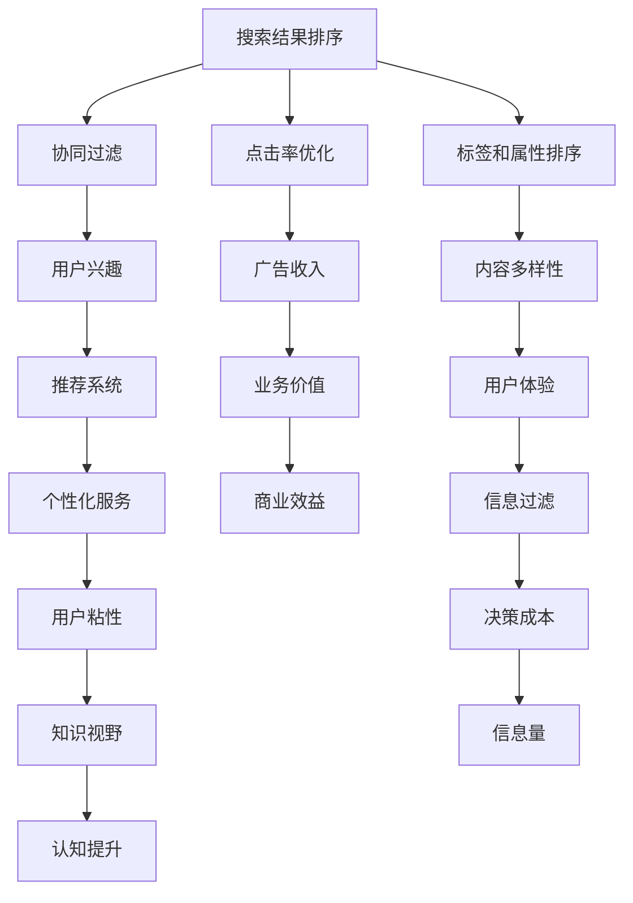
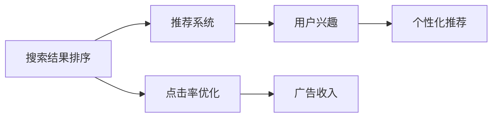
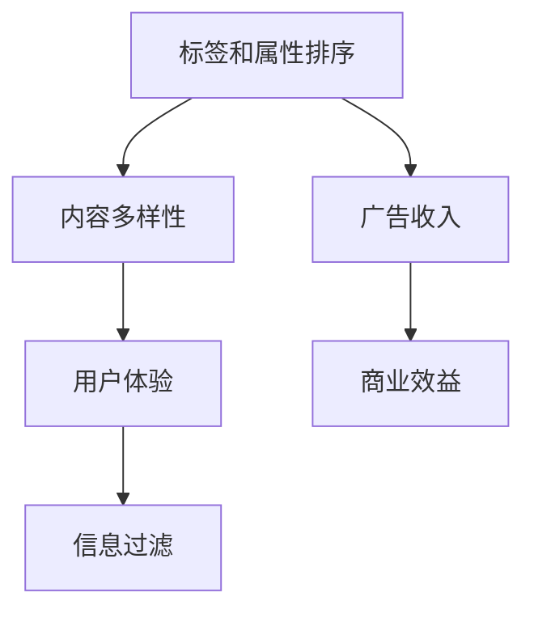
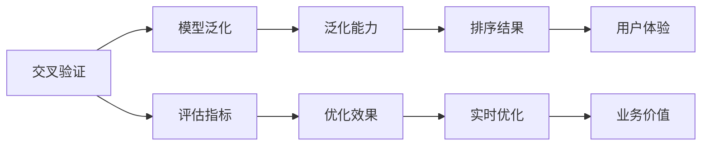

                 

## 1. 背景介绍

### 1.1 问题由来
在现代信息爆炸时代，如何在海量的信息中找到用户感兴趣的内容，一直是搜索引擎和推荐系统面临的核心挑战。传统的搜索结果排序和推荐算法，以点击率（Click-Through Rate, CTR）作为主要评价指标，努力提升用户点击和停留时间，以最大化广告收入。然而，这种单一的评价指标忽视了搜索结果的相关性和用户的实际需求。

随着数据量的激增和计算资源的提升，近年来深度学习和强化学习等技术被引入搜索推荐系统，极大地提升了结果的相关性和个性化程度。传统搜索结果排序和推荐算法，正在向更加智能、高效的路径迈进。本文将从结果匹配的视角出发，探讨传统搜索推荐系统的主要算法和优化策略，为后续的深度学习算法提供参考和对比。

### 1.2 问题核心关键点
当前传统搜索结果排序和推荐算法的主要关注点包括：

1. 文本相关性排序：通过计算文本相似度（如TF-IDF、BM25等），对搜索结果进行排序，使得用户更容易找到相关信息。

2. 点击率优化：通过调整搜索结果的排名，最大化用户点击率，提高广告价值。

3. 协同过滤：利用用户的行为和历史数据，发现与用户兴趣相似的其他用户或物品，进行推荐。

4. 标签和属性排序：通过统计物品的标签、属性等元数据，提高搜索结果的准确性和多样性。

5. 交叉验证：通过交叉验证等方法，评估模型的泛化性能，确保排序结果的稳定性和一致性。

6. 实时优化：通过在线学习等技术，及时调整算法模型，适应数据变化，提升用户体验。

这些关键点构成了传统搜索推荐系统的主要算法和评价指标，代表了该领域的主要研究进展。

### 1.3 问题研究意义
研究传统搜索结果排序和推荐算法，对于提升搜索推荐的准确性和个性化程度，具有重要意义：

1. 增强用户体验：通过精确匹配用户需求，大幅提升搜索结果的相关性，使用户能够快速获取所需信息。

2. 提高广告效益：通过优化点击率，最大化广告收入，提高商业价值。

3. 促进内容发现：通过个性化推荐，帮助用户发现隐藏在海量信息中的有价值内容，拓展知识视野。

4. 支持个性化服务：基于用户的行为数据和兴趣偏好，提供量身定制的服务，增强用户粘性。

5. 优化信息过滤：通过筛选过滤搜索结果，去除冗余信息，减少用户决策成本。

6. 促进创新应用：探索和研究新的排序推荐技术，推动搜索引擎和推荐系统走向智能化和自动化。

## 2. 核心概念与联系

### 2.1 核心概念概述

为更好地理解传统搜索结果排序和推荐算法，本节将介绍几个密切相关的核心概念：

- 搜索结果排序：根据用户查询，对搜索结果集进行相关性排序，提高搜索结果的匹配度。

- 推荐系统：通过分析用户历史行为数据，发现用户兴趣，推荐可能感兴趣的物品。

- 协同过滤：利用用户的行为数据和偏好相似度，发现与用户兴趣相似的其他用户或物品，进行推荐。

- 点击率（CTR）：用户点击广告的概率，是衡量广告效果的重要指标。

- 平均绝对误差（Mean Absolute Error, MAE）：一种常见的评价排序算法性能的指标，衡量模型预测结果与真实值之间的差异。

- 交叉验证：通过将数据集分为训练集和验证集，评估模型的泛化能力。

这些核心概念之间的逻辑关系可以通过以下Mermaid流程图来展示：



这个流程图展示了这个领域的核心概念及其之间的关系：

1. 搜索结果排序是推荐系统的基础，通过优化排序提高点击率。
2. 协同过滤通过用户行为数据，发现用户兴趣，进行推荐。
3. 点击率优化最大化广告收入，提高商业效益。
4. 标签和属性排序提高内容多样性和用户粘性。
5. 交叉验证评估模型泛化能力。
6. 实时优化根据数据变化，提升用户体验和商业价值。

这些概念共同构成了传统搜索推荐系统的主要算法和评价指标，使其能够在各种场景下发挥强大的排序和推荐能力。通过理解这些核心概念，我们可以更好地把握搜索推荐系统的基本工作原理和优化方向。

### 2.2 概念间的关系

这些核心概念之间存在着紧密的联系，形成了搜索结果排序和推荐系统的完整生态系统。下面我通过几个Mermaid流程图来展示这些概念之间的关系。

#### 2.2.1 排序与推荐的关系



这个流程图展示了搜索结果排序和推荐系统的主要关系：

1. 搜索结果排序是推荐系统的基础，通过优化排序提升点击率。
2. 推荐系统通过用户行为数据，发现用户兴趣，进行个性化推荐。
3. 点击率优化最大化广告收入，提高商业效益。
4. 个性化推荐提升用户体验和用户粘性。

#### 2.2.2 标签与属性排序



这个流程图展示了标签和属性排序与推荐系统的主要关系：

1. 标签和属性排序提高内容多样性和用户粘性。
2. 内容多样性提升用户体验，降低决策成本。
3. 广告收入最大化商业效益。
4. 信息过滤减少冗余信息，提高广告点击率。

#### 2.2.3 交叉验证与优化



这个流程图展示了交叉验证与推荐系统的主要关系：

1. 交叉验证评估模型的泛化能力。
2. 泛化能力提高模型的稳定性。
3. 评估指标优化模型的效果。
4. 实时优化提高用户体验和商业价值。
5. 用户体验和商业价值提升用户的粘性和满意度。

### 2.3 核心概念的整体架构

最后，我们用一个综合的流程图来展示这些核心概念在搜索结果排序和推荐系统中的整体架构：

```mermaid
graph TB
    A[大规模文本数据] --> B[预处理]
    B --> C[文本特征]
    C --> D[TF-IDF]
    D --> E[BM25]
    E --> F[排序]
    F --> G[点击率]
    G --> H[优化]
    A --> I[用户行为数据]
    I --> J[协同过滤]
    J --> K[用户兴趣]
    K --> L[推荐]
    L --> M[广告点击]
    M --> N[收入]
    N --> O[点击率优化]
    O --> P[点击率]
    I --> Q[交叉验证]
    Q --> R[模型评估]
    R --> S[排序结果]
    S --> T[用户体验]
    T --> U[粘性]
    U --> V[决策成本]
    V --> W[知识视野]
    W --> X[认知提升]
    X --> Y[业务价值]
    Y --> Z[商业效益]
    Z --> AA[优化效果]
    AA --> BB[实时优化]
    BB --> CC[用户体验]
    CC --> DD[满意度]
    DD --> EE[商业效益]
    EE --> FF[优化指标]
    FF --> GG[广告点击]
    GG --> HH[收入]
    HH --> II[点击率]
    II --> JJ[广告收入]
    JJ --> KK[用户体验]
    KK --> LL[用户粘性]
    LL --> MM[决策成本]
    MM --> NN[信息过滤]
    NN --> oo[内容多样性]
    oo --> pp[信息量]
    pp --> qq[信息过滤]
    qq --> rr[广告点击]
    rr --> ss[收入]
    ss --> tt[点击率优化]
    tt --> uu[广告收入]
    uu --> vv[用户体验]
    vv --> ww[用户粘性]
    ww --> xx[决策成本]
    xx --> yy[知识视野]
    yy --> zz[认知提升]
    zz --> aa[业务价值]
    aa --> bb[商业效益]
    bb --> cc[优化效果]
    cc --> dd[实时优化]
    dd --> ee[用户体验]
    ee --> ff[满意度]
    ff --> gg[商业效益]
    gg --> hh[优化指标]
    hh --> ii[广告点击]
    ii --> jj[收入]
    jj --> kk[点击率]
    kk --> ll[广告收入]
    ll --> mm[用户体验]
    mm --> nn[用户粘性]
    nn --> oo[决策成本]
    oo --> pp[信息过滤]
    pp --> qq[广告点击]
    qq --> rr[收入]
    rr --> ss[点击率优化]
    ss --> tt[广告收入]
    tt --> uu[用户体验]
    uu --> vv[用户粘性]
    vv --> ww[决策成本]
    ww --> xx[知识视野]
    xx --> yy[认知提升]
    yy --> zz[业务价值]
    zz --> aa[商业效益]
    aa --> bb[优化效果]
    bb --> cc[实时优化]
    cc --> dd[用户体验]
    dd --> ee[满意度]
    ee --> ff[商业效益]
    ff --> gg[优化指标]
    gg --> hh[广告点击]
    hh --> ii[收入]
    ii --> jj[点击率]
    jj --> ll[广告收入]
    ll --> mm[用户体验]
    mm --> nn[用户粘性]
    nn --> oo[决策成本]
    oo --> pp[信息过滤]
    pp --> qq[广告点击]
    qq --> rr[收入]
    rr --> ss[点击率优化]
    ss --> tt[广告收入]
    tt --> uu[用户体验]
    uu --> vv[用户粘性]
    vv --> ww[决策成本]
    ww --> xx[知识视野]
    xx --> yy[认知提升]
    yy --> zz[业务价值]
    zz --> aa[商业效益]
    aa --> bb[优化效果]
    bb --> cc[实时优化]
    cc --> dd[用户体验]
    dd --> ee[满意度]
    ee --> ff[商业效益]
    ff --> gg[优化指标]
    gg --> hh[广告点击]
    hh --> ii[收入]
    ii --> jj[点击率]
    jj --> ll[广告收入]
    ll --> mm[用户体验]
    mm --> nn[用户粘性]
    nn --> oo[决策成本]
    oo --> pp[信息过滤]
    pp --> qq[广告点击]
    qq --> rr[收入]
    rr --> ss[点击率优化]
    ss --> tt[广告收入]
    tt --> uu[用户体验]
    uu --> vv[用户粘性]
    vv --> ww[决策成本]
    ww --> xx[知识视野]
    xx --> yy[认知提升]
    yy --> zz[业务价值]
    zz --> aa[商业效益]
    aa --> bb[优化效果]
    bb --> cc[实时优化]
    cc --> dd[用户体验]
    dd --> ee[满意度]
    ee --> ff[商业效益]
    ff --> gg[优化指标]
    gg --> hh[广告点击]
    hh --> ii[收入]
    ii --> jj[点击率]
    jj --> ll[广告收入]
    ll --> mm[用户体验]
    mm --> nn[用户粘性]
    nn --> oo[决策成本]
    oo --> pp[信息过滤]
    pp --> qq[广告点击]
    qq --> rr[收入]
    rr --> ss[点击率优化]
    ss --> tt[广告收入]
    tt --> uu[用户体验]
    uu --> vv[用户粘性]
    vv --> ww[决策成本]
    ww --> xx[知识视野]
    xx --> yy[认知提升]
    yy --> zz[业务价值]
    zz --> aa[商业效益]
    aa --> bb[优化效果]
    bb --> cc[实时优化]
    cc --> dd[用户体验]
    dd --> ee[满意度]
    ee --> ff[商业效益]
    ff --> gg[优化指标]
    gg --> hh[广告点击]
    hh --> ii[收入]
    ii --> jj[点击率]
    jj --> ll[广告收入]
    ll --> mm[用户体验]
    mm --> nn[用户粘性]
    nn --> oo[决策成本]
    oo --> pp[信息过滤]
    pp --> qq[广告点击]
    qq --> rr[收入]
    rr --> ss[点击率优化]
    ss --> tt[广告收入]
    tt --> uu[用户体验]
    uu --> vv[用户粘性]
    vv --> ww[决策成本]
    ww --> xx[知识视野]
    xx --> yy[认知提升]
    yy --> zz[业务价值]
    zz --> aa[商业效益]
    aa --> bb[优化效果]
    bb --> cc[实时优化]
    cc --> dd[用户体验]
    dd --> ee[满意度]
    ee --> ff[商业效益]
    ff --> gg[优化指标]
    gg --> hh[广告点击]
    hh --> ii[收入]
    ii --> jj[点击率]
    jj --> ll[广告收入]
    ll --> mm[用户体验]
    mm --> nn[用户粘性]
    nn --> oo[决策成本]
    oo --> pp[信息过滤]
    pp --> qq[广告点击]
    qq --> rr[收入]
    rr --> ss[点击率优化]
    ss --> tt[广告收入]
    tt --> uu[用户体验]
    uu --> vv[用户粘性]
    vv --> ww[决策成本]
    ww --> xx[知识视野]
    xx --> yy[认知提升]
    yy --> zz[业务价值]
    zz --> aa[商业效益]
    aa --> bb[优化效果]
    bb --> cc[实时优化]
    cc --> dd[用户体验]
    dd --> ee[满意度]
    ee --> ff[商业效益]
    ff --> gg[优化指标]
    gg --> hh[广告点击]
    hh --> ii[收入]
    ii --> jj[点击率]
    jj --> ll[广告收入]
    ll --> mm[用户体验]
    mm --> nn[用户粘性]
    nn --> oo[决策成本]
    oo --> pp[信息过滤]
    pp --> qq[广告点击]
    qq --> rr[收入]
    rr --> ss[点击率优化]
    ss --> tt[广告收入]
    tt --> uu[用户体验]
    uu --> vv[用户粘性]
    vv --> ww[决策成本]
    ww --> xx[知识视野]
    xx --> yy[认知提升]
    yy --> zz[业务价值]
    zz --> aa[商业效益]
    aa --> bb[优化效果]
    bb --> cc[实时优化]
    cc --> dd[用户体验]
    dd --> ee[满意度]
    ee --> ff[商业效益]
    ff --> gg[优化指标]
    gg --> hh[广告点击]
    hh --> ii[收入]
    ii --> jj[点击率]
    jj --> ll[广告收入]
    ll --> mm[用户体验]
    mm --> nn[用户粘性]
    nn --> oo[决策成本]
    oo --> pp[信息过滤]
    pp --> qq[广告点击]
    qq --> rr[收入]
    rr --> ss[点击率优化]
    ss --> tt[广告收入]
    tt --> uu[用户体验]
    uu --> vv[用户粘性]
    vv --> ww[决策成本]
    ww --> xx[知识视野]
    xx --> yy[认知提升]
    yy --> zz[业务价值]
    zz --> aa[商业效益]
    aa --> bb[优化效果]
    bb --> cc[实时优化]
    cc --> dd[用户体验]
    dd --> ee[满意度]
    ee --> ff[商业效益]
    ff --> gg[优化指标]
    gg --> hh[广告点击]
    hh --> ii[收入]
    ii --> jj[点击率]
    jj --> ll[广告收入]
    ll --> mm[用户体验]
    mm --> nn[用户粘性]
    nn --> oo[决策成本]
    oo --> pp[信息过滤]
    pp --> qq[广告点击]
    qq --> rr[收入]
    rr --> ss[点击率优化]
    ss --> tt[广告收入]
    tt --> uu[用户体验]
    uu --> vv[用户粘性]
    vv --> ww[决策成本]
    ww --> xx[知识视野]
    xx --> yy[认知提升]
    yy --> zz[业务价值]
    zz --> aa[商业效益]
    aa --> bb[优化效果]
    bb --> cc[实时优化]
    cc --> dd[用户体验]
    dd --> ee[满意度]
    ee --> ff[商业效益]
    ff --> gg[优化指标]
    gg --> hh[广告点击]
    hh --> ii[收入]
    ii --> jj[点击率]
    jj --> ll[广告收入]
    ll --> mm[用户体验]
    mm --> nn[用户粘性]
    nn --> oo[决策成本]
    oo --> pp[信息过滤]
    pp --> qq[广告点击]
    qq --> rr[收入]
    rr --> ss[点击率优化]
    ss --> tt[广告收入]
    tt --> uu[用户体验]
    uu --> vv[用户粘性]
    vv --> ww[决策成本]
    ww --> xx[知识视野]
    xx --> yy[认知提升]
    yy --> zz[业务价值]
    zz --> aa[商业效益]
    aa --> bb[优化效果]
    bb --> cc[实时优化]
    cc --> dd[用户体验]
    dd --> ee[满意度]
    ee --> ff[商业效益]
    ff --> gg[优化指标]
    gg --> hh[广告点击]
    hh --> ii[收入]
    ii --> jj[点击率]
    jj --> ll[广告收入]
    ll --> mm[用户体验]
    mm --> nn[用户粘性]
    nn --> oo[决策成本]
    oo --> pp[信息过滤]
    pp --> qq[广告点击]
    qq --> rr[收入]
    rr --> ss[点击率优化]
    ss --> tt[广告收入]
    tt --> uu[用户体验]
    uu --> vv[用户粘性]
    vv --> ww[决策成本]
    ww --> xx[知识视野]
    xx --> yy[认知提升]
    yy --> zz[业务价值]
    zz --> aa[商业效益]
    aa --> bb[优化效果]
    bb --> cc[实时优化]
    cc --> dd[用户体验]
    dd --> ee[满意度]
    ee --> ff[商业效益]
    ff --> gg[优化指标]
    gg --> hh[广告点击]
    hh --> ii[收入]
    ii --> jj[点击率]
    jj --> ll[广告收入]
    ll --> mm[用户体验]
    mm --> nn[用户粘性]
    nn --> oo[决策成本]
    oo --> pp[信息过滤]
    pp --> qq[广告点击]
    qq --> rr[收入]
    rr --> ss[点击率优化]
    ss --> tt[广告收入]
    tt --> uu[用户体验]
    uu --> vv[用户粘性]
    vv --> ww[决策成本]
    ww --> xx[知识视野]
    xx --> yy[认知提升]
    yy --> zz[业务价值]
    zz --> aa[商业效益]
    aa --> bb[优化效果]
    bb --> cc[实时优化]
    cc --> dd[用户体验]
    dd --> ee[满意度]
    ee --> ff[商业效益]
    ff --> gg[优化指标]
    gg --> hh[广告点击]
    hh --> ii[收入]
    ii --> jj[点击率]
    jj --> ll[广告收入]
    ll --> mm[用户体验]
    mm --> nn[用户粘性]
    nn --> oo[决策成本]
    oo --> pp[信息过滤]
    pp --> qq[广告点击]
    qq --> rr[收入]
    rr --> ss[点击率优化]
    ss --> tt[广告收入]
    tt --> uu[用户体验]
    uu --> vv[用户粘性]
    vv --> ww[决策成本]
    ww --> xx[知识视野]
    xx --> yy[认知提升]
    yy --> zz[业务价值]
    zz --> aa[商业效益]
    aa --> bb[优化效果]
    bb --> cc[实时优化]
    cc --> dd[用户体验]
    dd --> ee[满意度]
    ee --> ff[商业效益]
    ff --> gg[优化指标]
    gg --> hh[广告点击]
    hh --> ii[收入]
    ii --> jj[点击率]
    jj --> ll[广告收入]
    ll --> mm[用户体验]
    mm --> nn[用户粘性]
    nn --> oo[决策成本]
    oo --> pp[信息过滤]
    pp --> qq[广告点击]
    qq --> rr[收入]
    rr --> ss[点击率优化]
    ss --> tt[广告收入]
    tt --> uu[用户体验]
    uu --> vv[用户粘性]
    vv --> ww[决策成本]
    ww --> xx[知识视野]
    xx --> yy[认知提升]
    yy --> zz[业务价值]
    zz --> aa[商业效益]
    aa --> bb[优化效果]
    bb --> cc[实时优化]
    cc --> dd[用户体验]
    dd --> ee[满意度]
    ee --> ff[商业效益]
    ff --> gg[优化指标]
    gg --> hh[广告点击]
    hh --> ii[收入]
    ii --> jj[点击率]
    jj --> ll[广告收入]
    ll --> mm[用户体验]
    mm --> nn[用户粘性]
    nn --> oo[决策成本]
    oo --> pp[信息过滤]
    pp --> qq[广告点击]
    qq --> rr[收入]
    rr --> ss[点击率优化]
    ss --> tt[广告收入]
    tt --> uu[用户体验]
    uu --> vv[用户粘性]
    vv --> ww[决策成本]
    ww --> xx[知识视野]
    xx --> yy[认知提升]
    yy --> zz[业务价值]
    zz --> aa[商业效益]
    aa --> bb[优化效果]
    bb --> cc[实时优化]
    cc --> dd[用户体验]
    dd --> ee[满意度]
    ee --> ff[商业效益]
    ff --> gg[优化指标]
    gg --> hh[广告点击]
    hh --> ii[收入]
    ii --> jj[点击率]
    jj --> ll[广告收入]
    ll --> mm[用户体验]
    mm --> nn[用户粘性]
    nn --> oo[决策成本]
    oo --> pp[信息过滤]
    pp --> qq[广告点击]
    qq --> rr[收入]
    rr --> ss[点击率优化]
    ss --> tt[广告收入]
    tt --> uu[用户体验]
    uu --> vv[用户粘性]
    vv --> ww[决策成本]
    ww --> xx[知识视野]
    xx --> yy[认知提升]
    yy --> zz[业务价值]
    zz --> aa[商业效益]
    aa --> bb[优化效果]
    bb --> cc[实时优化]
    cc --> dd[用户体验]
    dd --> ee[满意度]
    ee --> ff[商业效益]
    ff --> gg[优化指标]
    gg --> hh[广告点击]
    hh --> ii[收入]
    ii --> jj[点击率]
    jj --> ll[广告收入]
    ll --> mm[用户体验]
    mm --> nn[用户粘性]
    nn --> oo[决策成本]
    oo --> pp[信息过滤]
    pp --> qq[广告点击]
    qq --> rr[收入]
    rr --> ss[点击率优化]
    ss --> tt[广告收入]
    tt --> uu[用户体验]
    uu --> vv[用户粘性]
    vv --> ww[决策成本]
    ww --> xx[知识视野]
    xx --> yy[认知提升]
    yy --> zz[业务价值]
    zz --> aa[商业效益]
    aa --> bb[优化效果]
    bb --> cc[实时优化]
    cc --> dd[用户体验]
    dd --> ee[满意度]
    ee --> ff[商业效益]
    ff --> gg[优化指标]
    gg --> hh[广告点击]
    hh --> ii[收入]
    ii --> jj[点击率]
    jj --> ll[广告收入]
    ll --> mm[用户体验]
    mm --> nn[用户粘性]
    nn --> oo[决策成本]
    oo --> pp[信息过滤]
    pp --> qq[广告点击]
    qq --> rr[收入]
    rr --> ss[点击率优化]
    ss --> tt[广告收入]
    tt --> uu[用户体验]
    uu --> vv[用户粘性]
    vv --> ww[决策成本]
    ww --> xx[知识视野]
    xx --> yy[认知提升]
    yy --> zz[业务价值]
    zz --> aa[商业效益]
    aa --> bb[优化效果]
    bb --> cc[实时优化]
    cc --> dd[用户体验]
    dd --> ee[满意度]
    ee --> ff[商业效益]
    ff --> gg[优化指标]
    gg --> hh[广告点击]
    hh --> ii[收入]
    ii --> jj[点击率]
    jj --> ll[广告收入]
    ll --> mm[用户体验]
    mm --> nn[用户粘性]
    nn --> oo[决策成本]
    oo --> pp[信息过滤]
    pp --> qq[广告点击]
    qq --> rr[收入]
    rr --> ss[点击率优化]
    ss --> tt[广告收入]
    tt --> uu[用户体验]
    uu --> vv[用户粘性]
    vv --> ww[决策成本]
    ww --> xx[知识视野]
    xx --> yy[认知提升]
    yy --> zz[业务价值]
    zz --> aa[商业效益]
    aa --> bb[优化效果]
    bb --> cc[实时优化]
    cc --> dd[用户体验]
    dd --> ee[满意度]
    ee --> ff[商业效益]
    ff --> gg[优化指标]
    gg --> hh[广告点击]
    hh -->

