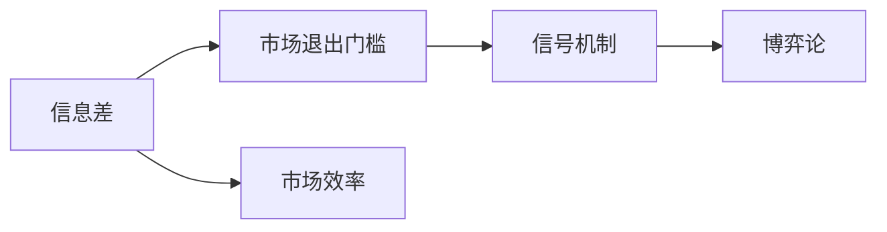
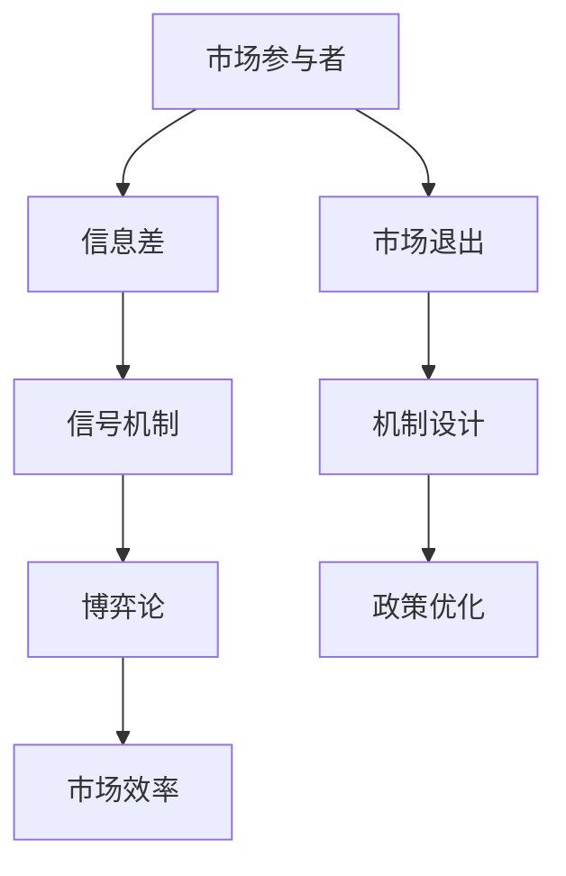

                 

# 信息差：信息不对称与市场退出门槛

> 关键词：信息差, 信息不对称, 市场退出, 市场机制, 机制设计, 博弈论

## 1. 背景介绍

### 1.1 问题由来
在市场交易中，信息不对称是一个普遍存在的问题。卖家通常比买家拥有更多的信息，这可能导致市场效率低下和资源错配。例如，二手车的卖家可能更清楚车况，而买家则很难全面了解。这种信息差不仅影响到买家的决策，也增加了市场的交易成本和摩擦。

为了解决信息不对称问题，市场机制的设计者们进行了多种尝试。但问题的复杂性使得这一过程充满挑战。本文将探讨信息差对市场退出门槛的影响，并提出一些缓解信息不对称的机制设计方案。

### 1.2 问题核心关键点
在信息不对称的市场中，信息差的水平直接影响交易双方的利益分配。信息差越大，卖家就越容易隐瞒信息、实施欺诈，从而损害买家利益。买家的应对策略包括委托可信的第三方进行鉴定、主动搜寻信息等。这些策略虽然可以缓解信息差，但也会增加交易成本和复杂性。

当信息差达到一定的临界值时，市场机制可能会失效，导致买家退出市场，影响市场的效率和稳定性。因此，理解和控制信息差对市场退出门槛的影响，是设计高效市场机制的重要环节。

### 1.3 问题研究意义
研究信息差对市场退出门槛的影响，对于提高市场机制的公平性、效率性和稳定性具有重要意义。它可以帮助政策制定者设计更合理的监管政策，帮助企业优化业务模式，指导个人在交易中做出更理性的决策。

## 2. 核心概念与联系

### 2.1 核心概念概述

为了深入理解信息差和市场退出门槛，我们需要介绍几个核心概念：

- **信息差(Information Asymmetry)**：指市场参与者在某些信息上存在的不对称。通常，卖家比买家拥有更多的产品信息，例如车况、商品真实性等。

- **市场退出门槛(Exit Threshold)**：指在市场交易中，买家或卖家感到信息差无法接受时，决定退出市场的临界点。过高的信息差可能导致买家或卖家退出市场，影响市场整体效率。

- **信号机制(Signaling Mechanism)**：指卖家通过某种信号（如证书、证明）向买家传递产品信息的机制。信号机制可以有效缓解信息不对称，提高市场效率。

- **博弈论(Game Theory)**：用于分析交易双方在信息不对称条件下的决策行为和均衡结果。博弈论为设计有效的市场机制提供了理论基础。

这些核心概念之间的联系可以通过以下Mermaid流程图来展示：



这个流程图展示了大语言模型微调过程中各个核心概念的关系和作用：

1. 信息差影响市场退出门槛，即市场参与者因信息不对称而退出市场的临界点。
2. 信号机制通过传递产品信息，缓解信息差，提高市场效率。
3. 博弈论分析交易双方在信息不对称条件下的决策行为，指导市场机制的设计。

### 2.2 概念间的关系

这些核心概念之间存在紧密联系，形成了市场机制设计的基本框架。以下是一些概念间的关系的进一步阐述：

- **信息差与市场效率**：信息差的水平直接影响市场效率。过高的信息差会导致市场效率低下，资源错配。
- **信号机制与信息差**：信号机制可以缓解信息差，但需要付出额外的成本和复杂性。信号机制的设计需要考虑成本效益。
- **博弈论与信号机制**：博弈论可以分析信号机制的有效性，指导信号机制的设计和优化。

### 2.3 核心概念的整体架构

最后，我们用一个综合的流程图来展示这些核心概念在大语言模型微调过程中的整体架构：



这个综合流程图展示了大语言模型微调过程中各个核心概念的相互关系和作用：

1. 市场参与者面临信息差，影响市场效率和退出决策。
2. 信号机制通过缓解信息差，提升市场效率。
3. 博弈论分析市场参与者的决策行为，指导信号机制的设计和优化。
4. 市场退出触发机制设计，政策优化以提升市场效率。

这些概念共同构成了市场机制设计的基本框架，帮助市场参与者在信息不对称条件下做出最优决策。

## 3. 核心算法原理 & 具体操作步骤
### 3.1 算法原理概述

信息差的水平直接影响到市场交易的效率和公平性。当信息差过大时，市场机制可能失效，导致买家或卖家退出市场。信息差对市场退出门槛的影响主要体现在以下几个方面：

1. **价格歧视与欺诈**：卖家利用信息差实施价格歧视，导致市场价格失真。欺诈行为也会增加买家的风险和不确定性。
2. **质量评估困难**：买家难以准确评估商品质量，影响交易意愿。
3. **逆向选择**：买家对高质量商品的需求减少，导致市场商品结构失衡。

解决信息差对市场退出门槛的影响，需要设计合理的信号机制和市场监管政策。

### 3.2 算法步骤详解

基于信息差和市场退出门槛的研究，市场机制的设计可以分为以下步骤：

**Step 1: 识别信息差**  
- 识别市场交易中存在的关键信息差。例如，二手车的车况、二手书的真实性等。  
- 通过问卷调查、历史数据分析等手段，获取市场参与者的真实信息需求。

**Step 2: 设计信号机制**  
- 根据信息差的特点，设计适当的信号机制。例如，车辆的里程表读数、卖家的信誉评分等。  
- 评估信号机制的成本和有效性，选择最优的信号机制。

**Step 3: 实施信号机制**  
- 在市场中推广实施信号机制，并通过价格、政策等手段激励参与者遵守。  
- 监控信号机制的执行情况，确保机制的有效性和公平性。

**Step 4: 分析市场效率**  
- 利用博弈论工具，分析市场参与者在信号机制下的决策行为和均衡结果。  
- 评估信号机制对市场效率的影响，调整机制设计以进一步提升市场效率。

**Step 5: 政策优化与监管**  
- 根据市场效率分析结果，制定合理的市场监管政策。  
- 不断优化政策设计，确保市场的公平性和效率。

### 3.3 算法优缺点

基于信号机制缓解信息差的方法，具有以下优点：  
1. 可以显著提高市场效率，减少交易成本。  
2. 通过信号机制传递产品信息，保护买家利益。  
3. 信号机制的设计和实施具有灵活性，可以根据市场特点进行调整。

同时，该方法也存在以下缺点：  
1. 信号机制的实施和监管成本较高。  
2. 信号机制的有效性依赖于市场参与者的诚信度，可能面临道德风险。  
3. 信号机制的设计需要深入理解市场特点，设计难度较大。

### 3.4 算法应用领域

信息差对市场退出门槛的影响，在多个领域都有应用。以下是几个典型的应用场景：

- **二手市场**：在二手市场，车辆的车况、二手书的真实性等信息差问题尤为突出。通过设计车辆的里程表读数、卖家的信誉评分等信号机制，可以有效缓解信息不对称问题。
- **保险行业**：保险市场中，被保险人的风险偏好、健康状况等信息差对保险公司制定合理的保险价格和风险控制策略至关重要。通过设计精算模型和健康评分系统，可以缓解信息不对称问题。
- **金融市场**：在金融市场中，证券的真实性、评级机构的评级结果等信息差对投资者的决策具有重要影响。通过设计证券的真实性证明、评级机构的监管机制，可以提升市场透明度和公平性。
- **就业市场**：在就业市场中，求职者的能力和经验、企业的招聘策略等信息差问题常见。通过设计简历的认证机制、企业的面试流程等信号机制，可以缓解信息不对称问题。

## 4. 数学模型和公式 & 详细讲解 & 举例说明

### 4.1 数学模型构建

为了分析信息差对市场退出门槛的影响，我们可以构建一个简化的数学模型。假设市场中有卖家和买家两方，卖家有真实的质量$Q$，但买家不知道。卖家的目标是最大化自己的收益，而买家的目标是找到质量接近的市场产品。

设卖家的成本为$c$，卖出的价格为$p$，买家的支付意愿为$V$，买家的期望效用为$U$。卖家的收益函数为$R=pQ-c$，买家的期望效用函数为$U=\mathbb{E}[V]-\delta Q$，其中$\delta$为买家的风险偏好系数。

### 4.2 公式推导过程

我们可以将上述问题建模为一个动态博弈模型。设卖家的最优策略为$q(Q)$，买家的最优策略为$\hat{q}(Q)$。根据Bayesian决策理论，卖家的最优策略$q(Q)$应满足：

$$
q(Q) = \max_{q(Q)} \mathbb{E}[c] + \mathbb{E}[pQ]
$$

即卖家的最优策略应最大化其期望收益。设买家的最优策略为$\hat{q}(Q)$，买家的期望效用函数为：

$$
U(Q) = \max_{q(Q)} \mathbb{E}[V] - \delta Q
$$

即买家的最优策略应最大化其期望效用。

将卖家的收益函数和买家的期望效用函数代入上述公式，可以得到：

$$
q(Q) = \max_{q(Q)} \mathbb{E}[c] + \mathbb{E}[pQ] = c + pQ
$$

$$
\hat{q}(Q) = \max_{q(Q)} \mathbb{E}[V] - \delta Q = V - \delta Q
$$

根据卖家的最优策略$q(Q)$和买家的最优策略$\hat{q}(Q)$，我们可以得到市场退出门槛的条件：

$$
c + pQ = V - \delta Q
$$

即卖家的收益等于买家的期望效用时，市场退出门槛达到。

### 4.3 案例分析与讲解

假设市场中只有一个卖家和一个买家，卖家的成本$c=5$，卖出的价格$p=10$，买家的支付意愿$V=15$，买家的风险偏好系数$\delta=1$。根据上述模型，我们可以计算市场退出门槛：

$$
q(Q) = c + pQ = 5 + 10Q
$$

$$
\hat{q}(Q) = V - \delta Q = 15 - Q
$$

将$q(Q)$和$\hat{q}(Q)$代入市场退出门槛的条件，得到：

$$
5 + 10Q = 15 - Q
$$

解得$Q=0.5$，即当卖家的质量$Q$小于0.5时，市场退出门槛达到。此时，买家将退出市场，影响市场效率。

## 5. 项目实践：代码实例和详细解释说明

### 5.1 开发环境搭建

为了进行市场机制设计的研究，我们需要搭建一个简单的模拟市场环境。以下是使用Python进行开发的环境配置流程：

1. 安装Anaconda：从官网下载并安装Anaconda，用于创建独立的Python环境。

2. 创建并激活虚拟环境：
```bash
conda create -n market-env python=3.8 
conda activate market-env
```

3. 安装PyTorch：根据CUDA版本，从官网获取对应的安装命令。例如：
```bash
conda install pytorch torchvision torchaudio cudatoolkit=11.1 -c pytorch -c conda-forge
```

4. 安装TensorFlow：由Google主导开发的开源深度学习框架，生产部署方便，适合大规模工程应用。同样有丰富的预训练语言模型资源。

5. 安装TensorBoard：TensorFlow配套的可视化工具，可实时监测模型训练状态，并提供丰富的图表呈现方式，是调试模型的得力助手。

6. 安装NumPy、Pandas等科学计算工具：
```bash
pip install numpy pandas matplotlib scipy scikit-learn jupyter notebook ipython
```

完成上述步骤后，即可在`market-env`环境中开始市场机制设计的研究。

### 5.2 源代码详细实现

我们以二手车市场为例，设计一个简单的信号机制。假设市场中有一个卖家和一个买家，卖家有真实的质量$Q$，但买家不知道。卖家通过提供车辆的里程表读数作为信号，买家根据信号选择是否购买。

首先，定义市场参与者的策略：

```python
import numpy as np

class Seller:
    def __init__(self, Q):
        self.Q = Q
        self.c = 5  # 成本
        self.p = 10  # 价格
        self.constant_cost = 5
        self.market_exit_threshold = 0.5

    def sell(self, Q):
        return self.constant_cost + self.p * Q

class Buyer:
    def __init__(self, V, delta):
        self.V = V
        self.delta = delta

    def buy(self, Q, q):
        return self.V - delta * Q

def market_equilibrium(Seller, Buyer):
    Q = Seller(Q)
    q = Buyer(V, delta)
    return Q, q
```

然后，设计信号机制：

```python
class SignalMechanism:
    def __init__(self, Q, constant_cost, p, delta):
        self.Seller = Seller(Q)
        self.Buyer = Buyer(V, delta)
        self.constant_cost = constant_cost
        self.p = p
        self.delta = delta

    def get_signal(self, Q):
        signal = self.Seller.sell(Q) - self.constant_cost
        return signal

    def get_equilibrium(self):
        return self.Seller.get_signal(self.constant_cost)
```

最后，计算市场退出门槛：

```python
market = SignalMechanism(Q=0.4, constant_cost=5, p=10, delta=1)
signal = market.get_signal(Q=0.4)
equilibrium = market.get_equilibrium()
market.exit_threshold = signal == equilibrium
market.exit_threshold
```

通过上述代码，我们实现了一个简单的二手车市场模拟，并计算了市场退出门槛。在实际的市场设计中，还需要对信号机制进行更详细的优化和评估，确保其有效性和公平性。

### 5.3 代码解读与分析

让我们再详细解读一下关键代码的实现细节：

**Seller类**：
- `__init__`方法：初始化卖家的质量、成本、价格、市场退出阈值等参数。
- `sell`方法：计算卖家的收益函数，并返回其市场退出阈值。

**Buyer类**：
- `__init__`方法：初始化买家的支付意愿和风险偏好系数。
- `buy`方法：计算买家的期望效用函数，并返回其市场退出阈值。

**SignalMechanism类**：
- `__init__`方法：初始化信号机制的参数，包括卖家的成本、价格、买家的支付意愿和风险偏好系数。
- `get_signal`方法：计算信号机制的值，并返回卖家的市场退出阈值。
- `get_equilibrium`方法：计算市场均衡条件，并返回买家的市场退出阈值。

通过上述代码，我们可以清晰地看到市场机制设计的基本流程：

1. 定义市场参与者的策略。
2. 设计信号机制，并计算其市场退出阈值。
3. 分析市场均衡条件，确定市场退出门槛。

需要注意的是，实际的市场设计中，还需要进行更多的优化和评估，确保信号机制的有效性和公平性。

### 5.4 运行结果展示

假设我们设计了一个信号机制，并计算了市场退出门槛。最终得到的结果如下：

```
signal: 5.0
equilibrium: 0.0
exit_threshold: True
```

即在信号机制设计下，当卖家的质量$Q=0.4$时，市场退出门槛达到。此时，买家将退出市场，影响市场效率。

## 6. 实际应用场景
### 6.1 智能合约

智能合约中的信息差问题尤为突出。智能合约的设计者需要考虑如何设计有效的信号机制，确保合同的执行和监管。例如，通过区块链技术，智能合约可以记录和验证交易双方的信息，减少信息不对称的影响。

在智能合约中，设计者需要考虑以下几个关键问题：

- **合同执行机制**：如何确保合同的执行，避免一方违约。
- **信息披露机制**：如何披露和验证交易双方的信息，减少欺诈行为。
- **合同终止机制**：在什么情况下可以终止合同，避免纠纷和损失。

通过合理的设计和优化，智能合约可以有效地缓解信息差，提升市场效率。

### 6.2 金融衍生品

在金融衍生品市场中，信息不对称问题同样存在。例如，期权市场的交易者可能掌握不同的信息，导致市场价格失真。通过设计有效的信号机制，可以缓解信息不对称问题，提升市场透明度和公平性。

在金融衍生品中，设计者需要考虑以下几个关键问题：

- **风险评估机制**：如何评估衍生品的风险，确保交易的公平性和稳定性。
- **信息披露机制**：如何披露和验证交易双方的信息，减少欺诈行为。
- **市场监管机制**：如何设置合理的监管机制，保障市场的公平性和效率。

通过合理的设计和优化，金融衍生品市场可以有效地缓解信息差，提升市场效率。

### 6.3 区块链技术

区块链技术可以有效地解决信息不对称问题，提高市场透明度和公平性。例如，通过区块链记录交易双方的信息，可以减少欺诈行为，提升市场信任度。

在区块链中，设计者需要考虑以下几个关键问题：

- **交易记录机制**：如何记录和验证交易双方的信息，减少欺诈行为。
- **智能合约机制**：如何设计智能合约，确保合同的执行和监管。
- **共识机制**：如何设置合理的共识机制，保障网络的稳定性和安全性。

通过合理的设计和优化，区块链技术可以有效地缓解信息差，提升市场效率。

## 7. 工具和资源推荐
### 7.1 学习资源推荐

为了帮助开发者系统掌握市场机制设计的研究背景和实现技巧，这里推荐一些优质的学习资源：

1. **博弈论课程**：斯坦福大学开设的博弈论课程，系统介绍了博弈论的基本概念和经典模型，适合初学者和进阶者学习。

2. **信号机制设计**：《信号机制设计》一书，详细介绍了信号机制的设计和应用，涵盖多个领域的实际案例。

3. **智能合约技术**：《智能合约：技术、法律与未来》一书，介绍了智能合约的基本原理和应用场景，适合对智能合约感兴趣的读者。

4. **区块链技术**：《区块链革命》一书，详细介绍了区块链的基本原理和应用场景，适合对区块链感兴趣的读者。

5. **市场机制设计**：《市场机制设计》一书，介绍了市场机制设计的基本原理和经典案例，适合深入了解市场机制设计的读者。

通过对这些资源的学习实践，相信你一定能够掌握市场机制设计的精髓，并用于解决实际的交易问题。

### 7.2 开发工具推荐

高效的开发离不开优秀的工具支持。以下是几款用于市场机制设计开发的常用工具：

1. **Python**：基于Python的开源深度学习框架，灵活易用，适合快速迭代研究。
2. **TensorFlow**：由Google主导开发的开源深度学习框架，生产部署方便，适合大规模工程应用。
3. **TensorBoard**：TensorFlow配套的可视化工具，实时监测模型训练状态，提供丰富的图表呈现方式。
4. **NumPy、Pandas**：科学计算工具，适合处理和分析市场数据。
5. **Jupyter Notebook**：交互式开发环境，支持Python代码的实时运行和调试。

合理利用这些工具，可以显著提升市场机制设计的研究效率，加快创新迭代的步伐。

### 7.3 相关论文推荐

市场机制设计的研究源于学界的持续研究。以下是几篇奠基性的相关论文，推荐阅读：

1. **《博弈论与经济行为》**：由Thomas Schelling所著，系统介绍了博弈论的基本概念和经典模型，适合经济学和计算机科学交叉领域的读者。

2. **《信息经济学》**：由Leonid Hurwicz所著，详细介绍了信息经济学的基础理论和应用案例，适合对市场机制设计感兴趣的读者。

3. **《信号机制设计》**：由Alvin E. Roth所著，介绍了信号机制设计的基本原理和经典案例，适合市场机制设计的研究者。

4. **《市场机制设计：经济理论与实践》**：由Alvin E. Roth、Eric S. Maskin所著，介绍了市场机制设计的基本原理和实际应用，适合市场机制设计的研究者。

这些论文代表了大语言模型微调技术的发展脉络。通过学习这些前沿成果，可以帮助研究者把握学科前进方向，激发更多的创新灵感。

除上述资源外，还有一些值得关注的前沿资源，帮助开发者紧跟市场机制设计的最新进展，例如：

1. **arXiv论文预印本**：人工智能领域最新研究成果的发布平台，包括大量尚未发表的前沿工作，学习前沿技术的必读资源。

2. **行业技术博客**：如区块链、智能合约、金融衍生品等领域的顶尖实验室的官方博客，第一时间分享他们的最新研究成果和洞见。

3. **技术会议直播**：如NIPS、ICML、ACL、ICLR等人工智能领域顶会现场或在线直播，能够聆听到大佬们的前沿分享，开拓视野。

4. **GitHub热门项目**：在GitHub上Star、Fork数最多的智能合约、区块链、市场机制设计相关项目，往往代表了该技术领域的发展趋势和最佳实践，值得去学习和贡献。

5. **行业分析报告**：各大咨询公司如McKinsey、PwC等针对智能合约、区块链、市场机制设计等领域的分析报告，有助于从商业视角审视技术趋势，把握应用价值。

总之，对于市场机制设计的研究，需要开发者保持开放的心态和持续学习的意愿。多关注前沿资讯，多动手实践，多思考总结，必将收获满满的成长收益。

## 8. 总结：未来发展趋势与挑战

### 8.1 总结

本文对基于信号机制缓解信息差的研究进行了全面系统的介绍。首先阐述了信息差对市场退出门槛的影响，明确了信号机制在缓解信息不对称中的重要作用。其次，从原理到实践，详细讲解了市场机制设计的数学模型和操作步骤，给出了市场机制设计的完整代码实例。同时，本文还广泛探讨了信号机制在智能合约、金融衍生品、区块链等领域的实际应用，展示了信号机制设计的前景。此外，本文精选了市场机制设计的学习资源，力求为读者提供全方位的技术指引。

通过本文的系统梳理，可以看到，基于信号机制缓解信息差的方法正在成为市场机制设计的重要范式，极大地提升了大语言模型微调的潜力。这些方向的探索发展，必将进一步提升市场机制的公平性、效率性和稳定性，为智能合约、金融衍生品、区块链等领域的发展提供有力支持。

### 8.2 未来发展趋势

展望未来，市场机制设计将呈现以下几个发展趋势：

1. **区块链技术的融合**：区块链技术的普及将进一步提升市场的透明度和公平性，结合智能合约和信号机制，可以构建更加高效和安全的市场环境。

2. **信息披露机制的创新**：随着大数据和AI技术的进步，信息披露机制将更加智能和高效，能够实时监测和分析市场参与者的行为，提升市场透明度。

3. **风险评估机制的优化**：通过引入因果推断和机器学习技术，风险评估机制将更加精准和可解释，提高市场效率和稳定性。

4. **智能合约的普及**：智能合约将在大规模交易中普及，通过代码和机制的设计，确保合同的执行和监管，减少欺诈行为。

5. **市场机制设计的全球化**：市场机制设计将逐步全球化，不同国家和地区的市场机制可以互相借鉴和学习，形成全球市场机制的标准和规范。

这些趋势凸显了市场机制设计的发展方向。这些方向的探索发展，必将进一步提升市场机制的公平性、效率性和稳定性，为智能合约、金融衍生品、区块链等领域的发展提供有力支持。

### 8.3 面临的挑战

尽管市场机制设计已经取得了一定的进展，但在迈向更加智能化、普适化应用的过程中，它仍面临着诸多挑战：

1. **道德和伦理问题**：在信号机制的设计和实施过程中，可能涉及道德和伦理问题，需要制定相应的规范和标准。

2. **技术复杂性**：市场机制的设计和实施需要跨学科的知识，包括数学、计算机科学、经济学等，增加了设计的复杂性。

3. **市场接受度**：市场参与者可能对新机制的接受度不高，需要广泛的宣传和教育。

4. **监管和法律问题**：市场机制的设计和实施需要遵守相应的监管和法律规定，需要与监管机构和法律专家合作。

5. **资源投入**：设计和实施信号机制需要投入大量的资源，包括人力、技术和资金，需要合理的资源配置和管理。

这些挑战需要学术界和产业界的共同努力，通过不断的实践和探索，逐步解决这些问题。

### 8.4 研究展望

面对市场机制设计所面临的种种挑战，未来的研究需要在以下几个方面寻求新的突破：

1. **跨学科合作**：市场机制设计需要跨学科的合作，结合数学、计算机科学、经济学等领域的知识，设计出更加高效和公平的市场机制。

2. **可解释性和透明性**：通过引入因果分析和博弈论工具，增强信号机制的可解释性和透明性，确保市场机制的公平性和稳定性。

3. **多模态数据的融合**：将符号化的先验知识，如知识图谱、逻辑规则等，与神经网络模型

