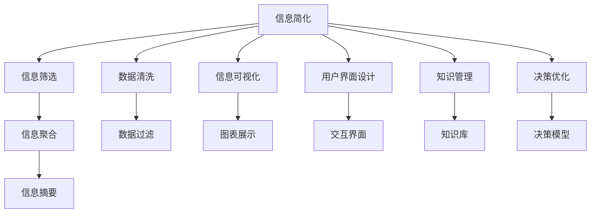
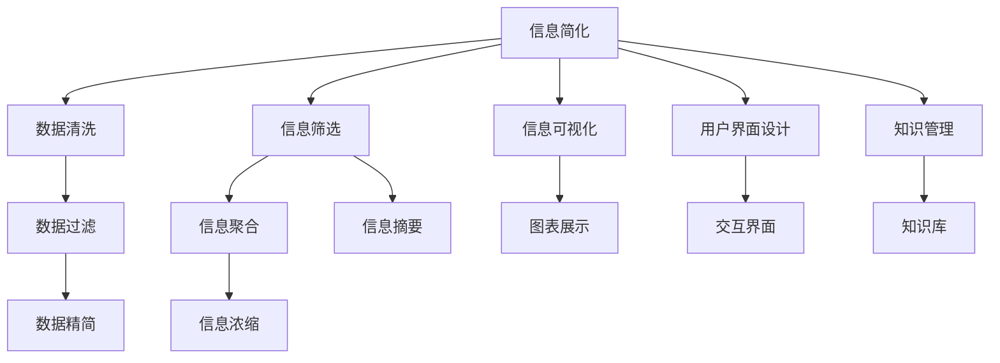
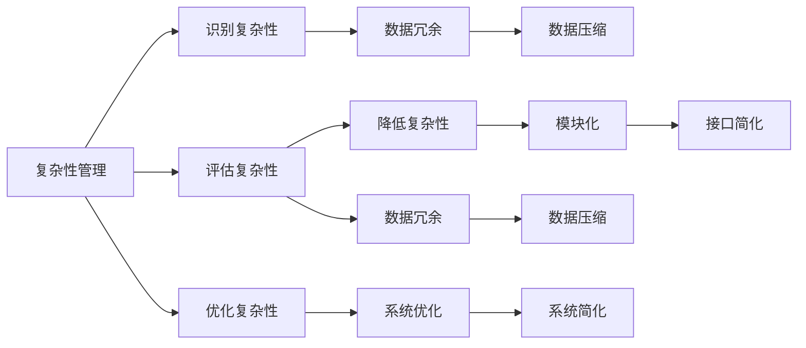

                 

# 信息简化的好处与艺术：在复杂世界中简化以提高生活质量和效率

> 关键词：信息简化, 复杂性管理, 生产力提升, 决策优化, 用户界面设计, 信息可视化, 知识管理

## 1. 背景介绍

### 1.1 问题由来
在当今信息爆炸的时代，我们面对的是一个越来越复杂多变的世界。信息技术的飞速发展极大地丰富了我们的生活和工作方式，但同时也带来了前所未有的信息过载。信息过载导致注意力分散、决策困难、效率降低等问题，极大地影响了我们的生活质量和工作效率。

### 1.2 问题核心关键点
信息过载和复杂性管理的核心问题是如何有效地筛选和处理海量信息，提取关键点，将复杂问题简化，以便于人们理解和做出决策。简化的信息能够帮助人们更快地找到问题的核心，提高决策的准确性和效率，进而提升生活质量和工作生产力。

### 1.3 问题研究意义
研究信息简化的方法，对于提升个人和组织的决策能力，优化资源配置，提高信息处理效率，具有重要意义：

1. 提升决策质量：简化信息有助于快速识别问题本质，降低决策的复杂性，提高决策速度和准确性。
2. 优化资源利用：合理的信息简化可以更好地分配和利用资源，减少浪费，提升整体效率。
3. 增强用户满意：简洁明了的用户界面和信息展示，能够提升用户体验，增加用户粘性。
4. 促进知识共享：简化信息有助于知识传递和共享，加速团队协作和创新。
5. 支持可持续发展：减少信息复杂性，有助于降低信息系统的维护和更新成本，支持可持续发展。

## 2. 核心概念与联系

### 2.1 核心概念概述

为了更好地理解信息简化的原理和应用，本节将介绍几个关键概念：

- 信息简化(Information Simplification)：指通过技术手段将原始数据、文档或信息转换为精简、易于理解的形式，以便于处理和利用。
- 复杂性管理(Complexity Management)：涉及识别、管理和降低复杂性，以提高系统或过程的可管理性和可操作性。
- 生产力提升(Productivity Enhancement)：通过优化信息处理流程和工具，提高个人和组织的工作效率和产出。
- 决策优化(Decision Optimization)：指在有限信息和资源条件下，选择最优的解决方案。
- 用户界面设计(User Interface Design)：涉及设计易用、高效、美观的界面，提升用户体验。
- 信息可视化(Information Visualization)：通过图表、图像等形式，直观展示信息，辅助理解和决策。
- 知识管理(Knowledge Management)：涉及知识的收集、组织、共享和应用，以支持创新和决策。

这些核心概念之间存在着紧密的联系，形成了信息简化和复杂性管理的基本框架。下面通过一个Mermaid流程图展示这些概念之间的逻辑关系：



这个流程图展示了信息简化过程涉及的各个环节及其相互关系：

1. 数据清洗：去除噪声和无用数据，确保信息准确性。
2. 信息筛选：从海量信息中挑选关键点和重要内容。
3. 信息聚合：将分散的信息进行整合，形成系统性结论。
4. 信息可视化：通过图表等形式，直观展示信息。
5. 用户界面设计：设计易用、美观的界面，提升用户体验。
6. 知识管理：收集、组织、共享知识，支持决策和创新。
7. 决策优化：基于简化后的信息，选择最优决策方案。

通过理解这些核心概念，我们可以更好地把握信息简化和复杂性管理的本质，为后续深入讨论具体的简化方法和技术奠定基础。

### 2.2 概念间的关系

这些核心概念之间存在着紧密的联系，形成了信息简化和复杂性管理的基本框架。下面通过几个Mermaid流程图展示这些概念之间的关系。

#### 2.2.1 信息简化的学习范式



这个流程图展示了信息简化的学习过程涉及的各个环节及其相互关系。信息简化的目标是通过清洗、筛选、聚合、可视化等手段，从原始数据中提取出关键信息，以支持决策和应用。

#### 2.2.2 复杂性管理的流程



这个流程图展示了复杂性管理的流程，包括识别、评估、降低和优化复杂性的各个步骤。通过有效的复杂性管理，可以提升系统的可管理性和可操作性，降低维护和操作成本。

#### 2.2.3 信息简化的技术手段

```mermaid
graph TB
    A[信息简化] --> B[自然语言处理]
    A --> C[文本压缩]
    A --> D[图像识别]
    A --> E[音频处理]
    B --> F[语义分析]
    C --> G[数据压缩算法]
    D --> H[视觉摘要]
    E --> I[语音识别]
    F --> J[关键词提取]
    G --> K[压缩算法]
    H --> L[图像摘要]
    I --> M[语音摘要]
    J --> N[关键词匹配]
    K --> O[压缩算法]
    L --> P[图像摘要]
    M --> Q[语音摘要]
    N --> R[匹配算法]
    O --> S[压缩算法]
    P --> T[图像摘要]
    Q --> U[语音摘要]
    R --> V[匹配算法]
    S --> W[压缩算法]
    T --> X[图像摘要]
    U --> Y[语音摘要]
    V --> Z[匹配算法]
    W --> AA[压缩算法]
    X --> AB[图像摘要]
    Y --> AC[语音摘要]
    Z --> AD[匹配算法]
    AA --> AE[压缩算法]
    AB --> AF[图像摘要]
    AC --> AG[语音摘要]
    AD --> AH[匹配算法]
    AE --> AI[压缩算法]
    AF --> AJ[图像摘要]
    AG --> AK[语音摘要]
    AH --> AL[匹配算法]
    AI --> AM[压缩算法]
    AJ --> AN[图像摘要]
    AK --> AO[语音摘要]
    AL --> AP[匹配算法]
    AM --> AQ[压缩算法]
    AN --> AR[图像摘要]
    AO --> AS[语音摘要]
    AP --> AT[匹配算法]
    AQ --> AU[压缩算法]
    AR --> AV[匹配算法]
    AS --> AW[压缩算法]
    AT --> AX[图像摘要]
    AU --> AY[语音摘要]
    AV --> AZ[匹配算法]
    AW --> BA[压缩算法]
    AX --> BB[图像摘要]
    AY --> BC[语音摘要]
    AZ --> BD[匹配算法]
    BA --> BE[压缩算法]
    BB --> BF[图像摘要]
    BC --> BG[语音摘要]
    BD --> BH[匹配算法]
    BE --> BI[压缩算法]
    BF --> BJ[图像摘要]
    BG --> BK[语音摘要]
    BH --> BL[匹配算法]
    BI --> BM[压缩算法]
    BJ --> BN[图像摘要]
    BK --> BO[语音摘要]
    BL --> BM[匹配算法]
    BM --> BQ[压缩算法]
    BN --> BR[图像摘要]
    BO --> BS[语音摘要]
    BL --> BT[匹配算法]
    BQ --> BU[压缩算法]
    BR --> BR[图像摘要]
    BS --> BT[语音摘要]
    BT --> BU[匹配算法]
    BU --> BV[匹配算法]
    BV --> BW[匹配算法]
    BW --> BX[匹配算法]
    BX --> BY[匹配算法]
    BY --> BZ[匹配算法]
    BZ --> CA[压缩算法]
    CA --> CB[压缩算法]
    CB --> CC[压缩算法]
    CC --> CD[压缩算法]
    CD --> CE[压缩算法]
    CE --> CF[压缩算法]
    CF --> CG[压缩算法]
    CG --> CH[压缩算法]
    CH --> CI[压缩算法]
    CI --> CJ[压缩算法]
    CJ --> CK[压缩算法]
    CK --> CL[压缩算法]
    CL --> CM[压缩算法]
    CM --> CN[压缩算法]
    CN --> CO[压缩算法]
    CO --> CP[压缩算法]
    CP --> CQ[压缩算法]
    CQ --> CR[压缩算法]
    CR --> CS[压缩算法]
    CS --> CT[压缩算法]
    CT --> CU[压缩算法]
    CU --> CV[压缩算法]
    CV --> CW[压缩算法]
    CW --> CX[压缩算法]
    CX --> CY[压缩算法]
    CY --> CZ[匹配算法]
    CZ --> DA[压缩算法]
    DA --> DB[压缩算法]
    DB --> DC[压缩算法]
    DC --> DD[压缩算法]
    DD --> DE[压缩算法]
    DE --> DF[压缩算法]
    DF --> DG[压缩算法]
    DG --> DH[压缩算法]
    DH --> DI[压缩算法]
    DI --> DJ[压缩算法]
    DJ --> DK[压缩算法]
    DK --> DL[压缩算法]
    DL --> DM[压缩算法]
    DM --> DN[压缩算法]
    DN --> DO[压缩算法]
    DO --> DP[压缩算法]
    DP --> DQ[压缩算法]
    DQ --> DR[压缩算法]
    DR --> DS[压缩算法]
    DS --> DT[压缩算法]
    DT --> DU[压缩算法]
    DU --> DV[压缩算法]
    DV --> DW[压缩算法]
    DW --> DX[压缩算法]
    DX --> DY[压缩算法]
    DY --> DZ[压缩算法]
    DZ --> EA[压缩算法]
    EA --> EB[压缩算法]
    EB --> EC[压缩算法]
    EC --> ED[压缩算法]
    ED --> EE[压缩算法]
    EE --> EF[压缩算法]
    EF --> EG[压缩算法]
    EG --> EH[压缩算法]
    EH --> EI[压缩算法]
    EI --> EJ[压缩算法]
    EJ --> EK[压缩算法]
    EK --> EL[压缩算法]
    EL --> EM[压缩算法]
    EM --> EN[压缩算法]
    EN --> EO[压缩算法]
    EO --> EP[压缩算法]
    EP --> EQ[压缩算法]
    EQ --> ER[压缩算法]
    ER --> ES[压缩算法]
    ES --> ET[压缩算法]
    ET --> EU[压缩算法]
    EU --> EV[压缩算法]
    EV --> EW[压缩算法]
    EW --> EX[压缩算法]
    EX --> EY[压缩算法]
    EY --> EZ[匹配算法]
    EZ --> FA[压缩算法]
    FA --> FB[压缩算法]
    FB --> FC[压缩算法]
    FC --> FD[压缩算法]
    FD --> FE[压缩算法]
    FE --> FF[压缩算法]
    FF --> FG[压缩算法]
    FG --> FH[压缩算法]
    FH --> FI[压缩算法]
    FI --> FJ[压缩算法]
    FJ --> FK[压缩算法]
    FK --> FL[压缩算法]
    FL --> FM[压缩算法]
    FM --> FN[压缩算法]
    FN --> FO[压缩算法]
    FO --> FP[压缩算法]
    FP --> FQ[压缩算法]
    FQ --> FR[压缩算法]
    FR --> FS[压缩算法]
    FS --> FT[压缩算法]
    FT --> FU[压缩算法]
    FU --> FV[压缩算法]
    FV --> FW[压缩算法]
    FW --> FX[压缩算法]
    FX --> FY[压缩算法]
    FY --> FZ[压缩算法]
    FZ --> GA[压缩算法]
    GA --> GB[压缩算法]
    GB --> GC[压缩算法]
    GC --> GD[压缩算法]
    GD --> GE[压缩算法]
    GE --> GF[压缩算法]
    GF --> GG[压缩算法]
    GG --> GH[压缩算法]
    GH --> GI[压缩算法]
    GI --> GJ[压缩算法]
    GJ --> GK[压缩算法]
    GK --> GL[压缩算法]
    GL --> GM[压缩算法]
    GM --> GN[压缩算法]
    GN --> GO[压缩算法]
    GO --> GP[压缩算法]
    GP --> GQ[压缩算法]
    GQ --> GR[压缩算法]
    GR --> GS[压缩算法]
    GS --> GT[压缩算法]
    GT --> GU[压缩算法]
    GU --> GV[压缩算法]
    GV --> GW[压缩算法]
    GW --> GX[压缩算法]
    GX --> GY[压缩算法]
    GY --> GZ[压缩算法]
    GZ --> HA[压缩算法]
    HA --> HB[压缩算法]
    HB --> HC[压缩算法]
    HC --> HD[压缩算法]
    HD --> HE[压缩算法]
    HE --> HF[压缩算法]
    HF --> HG[压缩算法]
    HG --> HH[压缩算法]
    HH --> HI[压缩算法]
    HI --> HJ[压缩算法]
    HJ --> HK[压缩算法]
    HK --> HL[压缩算法]
    HL --> HM[压缩算法]
    HM --> HN[压缩算法]
    HN --> HO[压缩算法]
    HO --> HP[压缩算法]
    HP --> HQ[压缩算法]
    HQ --> HR[压缩算法]
    HR --> HS[压缩算法]
    HS --> HT[压缩算法]
    HT --> HU[压缩算法]
    HU --> HV[压缩算法]
    HV --> HW[压缩算法]
    HW --> HX[压缩算法]
    HX --> HY[压缩算法]
    HY --> HZ[压缩算法]
    HZ --> IA[压缩算法]
    IA --> IB[压缩算法]
    IB --> IC[压缩算法]
    IC --> ID[压缩算法]
    ID --> IE[压缩算法]
    IE --> IF[压缩算法]
    IF --> IG[压缩算法]
    IG --> IH[压缩算法]
    IH --> II[压缩算法]
    II --> IJ[压缩算法]
    IJ --> IK[压缩算法]
    IK --> IL[压缩算法]
    IL --> IM[压缩算法]
    IM --> IN[压缩算法]
    IN --> IO[压缩算法]
    IO --> IP[压缩算法]
    IP --> IQ[压缩算法]
    IQ --> IR[压缩算法]
    IR --> IS[压缩算法]
    IS --> IT[压缩算法]
    IT --> IU[压缩算法]
    IU --> IV[压缩算法]
    IV --> IW[压缩算法]
    IW --> IX[压缩算法]
    IX --> IY[压缩算法]
    IY --> IZ[压缩算法]
    IZ --> JA[压缩算法]
    JA --> JB[压缩算法]
    JB --> JC[压缩算法]
    JC --> JD[压缩算法]
    JD --> JE[压缩算法]
    JE --> JF[压缩算法]
    JF --> JG[压缩算法]
    JG --> JH[压缩算法]
    JH --> Ji[压缩算法]
    Ji --> Jj[压缩算法]
    Jj --> Jk[压缩算法]
    Jk --> Jl[压缩算法]
    Jl --> Jm[压缩算法]
    Jm --> Jn[压缩算法]
    Jn --> Jo[压缩算法]
    Jo --> Jp[压缩算法]
    Jp --> Jq[压缩算法]
    Jq --> Jr[压缩算法]
    Jr --> Js[压缩算法]
    Js --> Jt[压缩算法]
    Jt --> Jv[压缩算法]
    Jv --> Jw[压缩算法]
    Jw --> Jx[压缩算法]
    Jx --> Jy[压缩算法]
    Jy --> Jz[压缩算法]
    Jz --> Ka[压缩算法]
    Ka --> Kb[压缩算法]
    Kb --> Kc[压缩算法]
    Kc --> Kd[压缩算法]
    Kd --> Ke[压缩算法]
    Ke --> Kf[压缩算法]
    Kf --> Kg[压缩算法]
    Kg --> Kh[压缩算法]
    Kh --> Ki[压缩算法]
    Ki --> Kj[压缩算法]
    Kj --> Kk[压缩算法]
    Kk --> Kl[压缩算法]
    Kl --> Km[压缩算法]
    Km --> Kn[压缩算法]
    Kn --> Ko[压缩算法]
    Ko --> Kp[压缩算法]
    Kp --> Kq[压缩算法]
    Kq --> Kr[压缩算法]
    Kr --> Ks[压缩算法]
    Ks --> Kt[压缩算法]
    Kt --> Ku[压缩算法]
    Ku --> Kv[压缩算法]
    Kv --> Kw[压缩算法]
    Kw --> Kx[压缩算法]
    Kx --> Ky[压缩算法]
    Ky --> Kz[压缩算法]
    Kz --> La[压缩算法]
    La --> Lb[压缩算法]
    Lb --> Lc[压缩算法]
    Lc --> Ld[压缩算法]
    Ld --> Le[压缩算法]
    Le --> Lf[压缩算法]
    Lf --> Lg[压缩算法]
    Lg --> Lh[压缩算法]
    Lh --> Li[压缩算法]
    Li --> Lj[压缩算法]
    Lj --> Lk[压缩算法]
    Lk --> Ll[压缩算法]
    Ll --> Lm[压缩算法]
    Lm --> Ln[压缩算法]
    Ln --> Lo[压缩算法]
    Lo --> Lp[压缩算法]
    Lp --> Lq[压缩算法]
    Lq --> Lr[压缩算法]
    Lr --> Ls[压缩算法]
    Ls --> Lt[压缩算法]
    Lt --> Lu[压缩算法]
    Lu --> Lv[压缩算法]
    Lv --> Lw[压缩算法]
    Lw --> Lx[压缩算法]
    Lx --> Ly[压缩算法]
    Ly --> Lz[压缩算法]
    Lz --> Ma[压缩算法]
    Ma --> Mb[压缩算法]
    Mb --> Mc[压缩算法]
    Mc --> Md[压缩算法]
    Md --> Me[压缩算法]
    Me --> Mf[压缩算法]
    Mf --> Mg[压缩算法]
    Mg --> Mh[压缩算法]
    Mh --> Mi[压缩算法]
    Mi --> Mj[压缩算法]
    Mj --> Mk[压缩算法]
    Mk --> Ml[压缩算法]
    Ml --> Mm[压缩算法]
    Mm --> Mn[压缩算法]
    Mn --> Mo[压缩算法]
    Mo --> Mp[压缩算法]
    Mp --> Mq[压缩算法]
    Mq --> Mr[压缩算法]
    Mr --> Ms[压缩算法]
    Ms --> Mt[压缩算法]
    Mt --> Mu[压缩算法]
    Mu --> Mv[压缩算法]
    Mv --> Mw[压缩算法]
    Mw --> Mx[压缩算法]
    Mx --> My[压缩算法]
    My --> Mz[压缩算法]
    Mz --> Na[压缩算法]
    Na --> Nb[压缩算法]
    Nb --> Nc[压缩算法]
    Nc --> Nd[压缩算法]
    Nd --> Ne[压缩算法]
    Ne --> Nf[压缩算法]
    Nf --> Ng[压缩算法]
    Ng --> Nh[压缩算法]
    Nh --> Ni[压缩算法]
    Ni --> Nj[压缩算法]
    Nj --> Nk[压缩算法]
    Nk --> Nl[压缩算法]
    Nl --> Nm[压缩算法]
    Nm --> Nn[压缩算法]
    Nn --> No[压缩算法]
    No --> Np[压缩算法]
    Np --> Nq[压缩算法]
    Nq --> Nr[压缩算法]
    Nr --> Ns[压缩算法]
    Ns --> Nt[压缩算法]
    Nt --> Nu[压缩算法]
    Nu --> Nv[压缩算法]
    Nv --> Nw[压缩算法]
    Nw --> Nx[压缩算法]
    Nx --> Ny[压缩算法]
    Ny --> Nz[压缩算法]
    Nz --> Oa[压缩算法]
    Oa --> Ob[压缩算法]
    Ob --> Oc[压缩算法]
    Oc --> Od[压缩算法]
    Od --> OE[压缩算法]
    OE --> Of[压缩算法]
    Of --> Og[压缩算法]
    Og --> Oh[压缩算法]
    Oh --> Oi[压缩算法]
    Oi --> Oj[压缩算法]
    Oj --> Ok[压缩算法]
    Ok --> Ol[压缩算法]
    Ol --> Om[压缩算法]
    Om --> On[压缩算法]
    On --> Oo[压缩算法]
    Oo --> Op[压缩算法]
    Op --> Oq[压缩算法]
    Oq --> Or[压缩算法]
    Or --> Os[压缩算法]
    Os --> Ot[压缩算法]
    Ot --> Ou[压缩算法]
    Ou --> Ov[压缩算法]
    Ov --> Ow[压缩算法]
    Ow --> Ox[压缩算法]
    Ox --> Oy[压缩算法]
    Oy --> Oz[压缩算法]
    Oz --> Pa[压缩算法]
    Pa --> Pb[压缩算法]
    Pb --> Pc[压缩算法]
    Pc --> Pd[压缩算法]
    Pd --> Pe[压缩算法]
    Pe --> Pf[压缩算法]
    Pf --> Pg[压缩算法]
    Pg --> Ph[压缩算法]
    Ph --> Pi[压缩算法]
    Pi --> Pj[压缩算法]
    Pj --> Pk[压缩算法]
    Pk --> Pl[压缩算法]
    Pl --> Pm[压缩算法]
    Pm --> Pn[压缩算法]
    Pn --> Po[压缩算法]
    Po --> Pp[压缩算法]
    Pp --> Pq[压缩算法]
    Pq --> Pr[压缩算法]
    Pr --> Ps[压缩算法]
    Ps --> Pt[压缩算法]
    Pt --> Pu[压缩算法]
    Pu --> Pv[压缩算法]
    Pv --> Pw[压缩算法]
    Pw --> Px[压缩算法]
    Px --> Py[压缩算法]
    Py --> Pz[压缩算法]
    Pz --> Qa[压缩算法]
    Qa --> Qb[压缩算法]
    Qb --> Qc[压缩算法]
    Qc --> Qd[压缩算法]
    Qd --> Qe[压缩算法]
    Qe --> Qf[压缩算法]
    Qf --> Qg[压缩算法]
    Qg --> Qh[压缩算法]
    Qh --> Qi[压缩算法]
    Qi --> Qj[压缩算法]
    Qj --> Qk[压缩算法]
    Qk --> Ql[压缩算法]
    Ql --> Qm[压缩算法]
    Qm --> Qn[压缩算法]
    Qn --> Qo[压缩算法]
    Qo --> Qp[压缩算法]
    Qp --> Qq[压缩算法]
    Qq --> Qr[压缩算法]
    Qr --> Qs[压缩算法]
    Qs --> Qt[压缩算法]
    Qt --> Qu[压缩算法]
    Qu --> Qv[压缩算法]
    Qv --> Qw[压缩算法]
    Qw --> Qx[压缩算法]
    Qx --> Qy[压缩算法]
    Qy --> Qz[压缩算法]
    Qz --> Ra[压缩算法]
    Ra --> Rb[压缩算法]
    Rb --> Rc[压缩算法]
    Rc --> Rd[压缩算法]
    Rd --> Re[压缩算法]
    Re --> Rf[压缩算法]
    Rf --> Rg[压缩算法]
    Rg --> Rh[压缩算法]
    Rh --> Ri[压缩算法]
    Ri --> Rj[压缩算法]
    Rj --> Rk[压缩算法]
    Rk --> Rl[压缩算法]
    Rl --> Rm[压缩算法]
    Rm --> Rn[压缩算法]
    Rn --> Ro[压缩算法]
    Ro -->Rp[压缩算法]
    Rp --> Rq[压缩算法]
    Rq --> Rr[压缩算法]
    Rr --> Rs[压缩算法]
    Rs --> Rt[压缩算法]
    Rt --> Ru[压缩算法]
    Ru --> Rv[压缩算法]
    Rv --> Rw[压缩算法]
    Rw --> Rx[压缩算法]
    Rx --> Ry[压缩算法]
    Ry --> Rz[压缩算法]
    Rz --> Sa[压缩算法]
    Sa --> Sb[压缩算法]
    Sb --> Sc[压缩算法]
    Sc --> Sd[压缩算法]
    Sd --> Se[压缩算法]
    Se --> Sf[压缩算法]
    Sf --> Sg[压缩算法]
    Sg --> Sh[压缩算法]
    Sh --> Si[压缩算法]
    Si --> Sj[压缩算法]
    Sj --> Sk[压缩算法]
    Sk --> Sl[压缩算法]
    Sl --> Sm[压缩算法]
    Sm --> Sn[压缩算法]
    Sn --> So[

