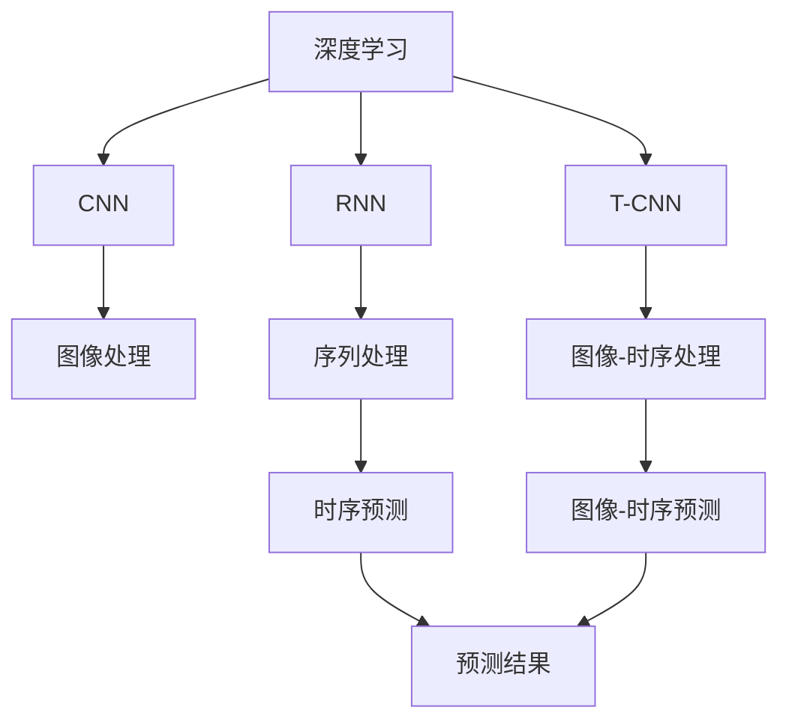
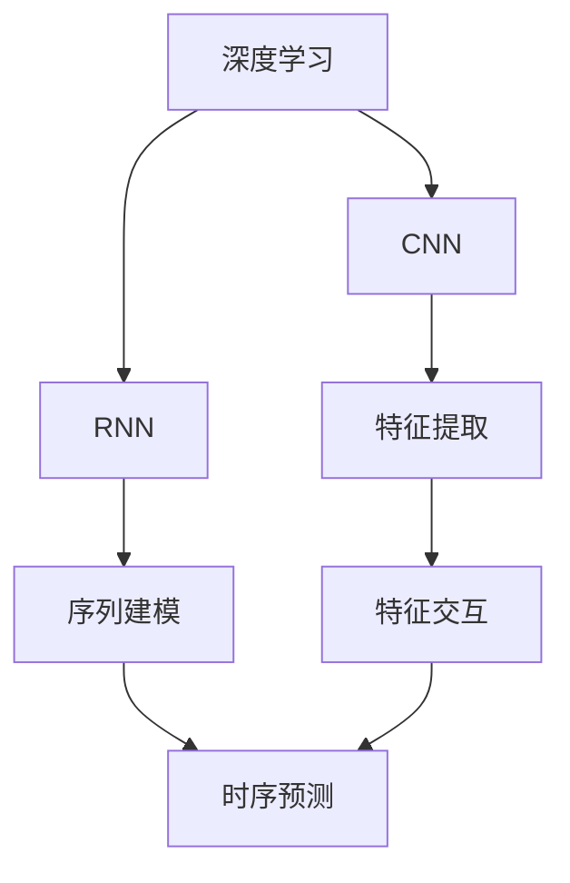
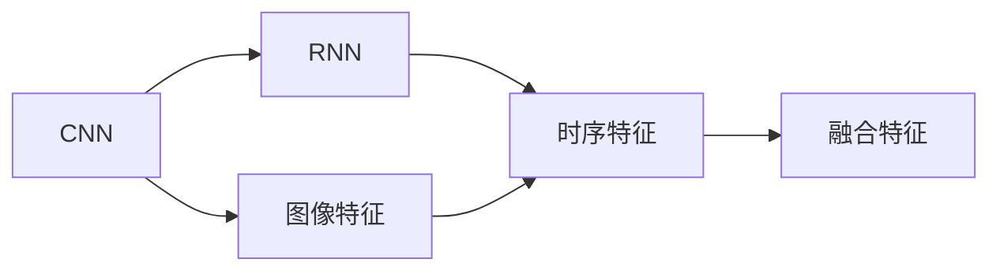
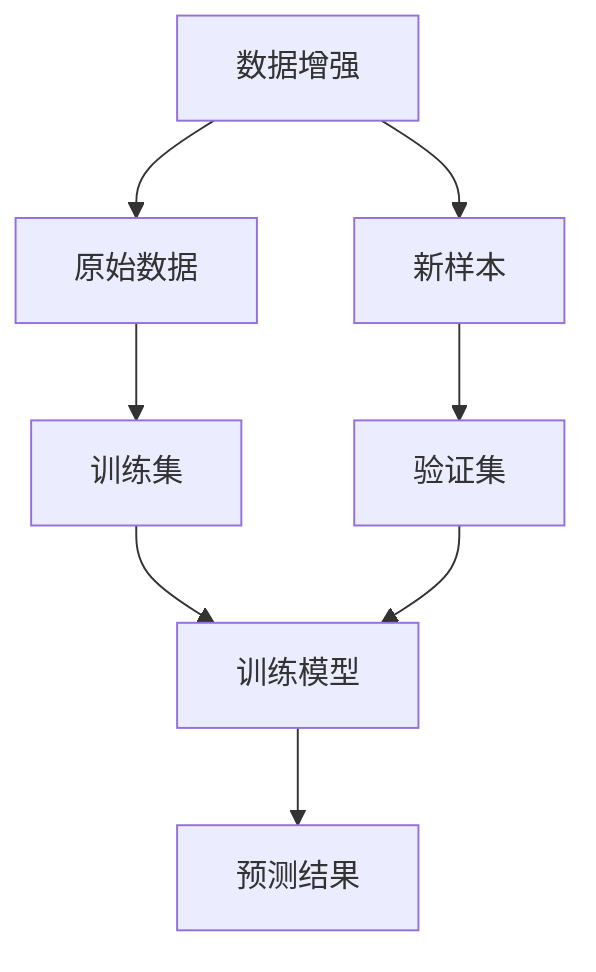

                 

# 基于深度网络的年龄预测算法研究

> 关键词：深度学习,年龄预测,卷积神经网络,循环神经网络,算法研究,算法实现,准确率,偏差,时序分析

## 1. 背景介绍

### 1.1 问题由来

随着人工智能技术的快速发展，深度学习在图像处理、语音识别、自然语言处理等领域取得了显著成果。然而，在人口统计学领域，尤其是年龄预测方面，深度学习的应用还相对较少。传统的年龄预测方法往往依赖于人工统计和数据挖掘，无法适应大规模数据处理的需要。近年来，基于深度学习的年龄预测方法逐渐成为研究热点，有望提升预测的准确性和实时性。

### 1.2 问题核心关键点

年龄预测本质上是一个回归问题，即将一个人的实际年龄与观察数据（如面部图像、语音记录、社交媒体信息等）关联起来。传统的年龄预测方法基于逻辑回归、支持向量机等算法，但面对高维数据和非线性关系时，其效果往往不够理想。近年来，基于深度学习的年龄预测方法逐渐兴起，尤其是卷积神经网络（CNN）和循环神经网络（RNN）在图像、时序数据处理中的成功应用，为年龄预测提供了新的思路。

### 1.3 问题研究意义

年龄预测在人口统计学、社会学、心理学等多个领域具有重要应用价值。通过准确预测年龄，可以更好地理解人口结构、评估社会动态、制定政策措施等。此外，年龄预测技术还可以应用于生物识别、医疗诊断、个人隐私保护等领域，推动智能化社会建设。因此，研究基于深度学习的年龄预测算法，对于提升数据处理能力、拓展应用场景具有重要意义。

## 2. 核心概念与联系

### 2.1 核心概念概述

为更好地理解基于深度学习的年龄预测算法，本节将介绍几个密切相关的核心概念：

- 深度学习（Deep Learning）：一种基于多层神经网络的机器学习技术，通过多层次的特征提取和组合，实现对复杂数据的高效建模。
- 卷积神经网络（Convolutional Neural Network, CNN）：一种专门处理网格状数据（如图像、视频）的深度学习模型，通过卷积和池化操作提取局部特征，适用于图像特征学习。
- 循环神经网络（Recurrent Neural Network, RNN）：一种能够处理序列数据的深度学习模型，通过循环机制记忆历史信息，适用于时序数据分析。
- 时间卷积网络（Time Convolutional Network, T-CNN）：一种结合CNN和RNN的混合深度学习模型，适用于处理具有时序特性的图像数据。
- 自注意力机制（Self-Attention Mechanism）：一种使网络能够自适应地分配注意力资源的机制，适用于提高特征交互和表达能力。
- 数据增强（Data Augmentation）：一种通过对训练数据进行变换生成新样本的技术，增加模型对数据变化的适应性，提高泛化能力。

这些核心概念之间的逻辑关系可以通过以下Mermaid流程图来展示：



这个流程图展示了几类深度学习模型的基本原理和应用场景：

1. CNN通过卷积和池化操作提取图像特征。
2. RNN通过循环机制处理序列数据。
3. T-CNN结合CNN和RNN，处理具有时序特性的图像数据。
4. 自注意力机制提升特征交互和表达能力。
5. 数据增强技术增加模型泛化能力。

这些概念共同构成了深度学习在年龄预测中的应用框架，使其能够在不同数据类型和场景下发挥强大的预测能力。通过理解这些核心概念，我们可以更好地把握深度学习在年龄预测中的工作原理和优化方向。

### 2.2 概念间的关系

这些核心概念之间存在着紧密的联系，形成了深度学习在年龄预测中的完整生态系统。下面我们通过几个Mermaid流程图来展示这些概念之间的关系。

#### 2.2.1 深度学习的核心架构



这个流程图展示了深度学习的核心架构，通过多层神经网络实现特征提取和交互，最终输出预测结果。

#### 2.2.2 CNN和RNN的结合



这个流程图展示了CNN和RNN结合的基本流程，通过卷积和循环操作分别提取图像和时序特征，再进行融合，得到更加全面的特征表示。

#### 2.2.3 自注意力机制的应用


这个流程图展示了自注意力机制在CNN中的应用，通过自适应地分配注意力资源，提升特征交互和表达能力，提高预测准确性。

#### 2.2.4 数据增强的流程



这个流程图展示了数据增强的基本流程，通过生成新样本，增加模型对数据变化的适应性，提高泛化能力。

### 2.3 核心概念的整体架构

最后，我们用一个综合的流程图来展示这些核心概念在大规模深度学习年龄预测中的整体架构：

```mermaid
graph TB
    A[大规模图像数据] --> B[CNN]
    B --> C[图像特征]
    C --> D[T-CNN]
    D --> E[RNN]
    E --> F[融合特征]
    F --> G[自注意力机制]
    G --> H[预测结果]
    H --> I[评估指标]
    I --> J[微调模型]
    J --> K[CNN]
    K --> L[RNN]
    L --> M[T-CNN]
    M --> N[特征交互]
    N --> O[预测结果]
    O --> P[训练集]
    P --> Q[验证集]
    Q --> R[测试集]
    R --> S[评估指标]
    S --> T[模型调整]
    T --> U[CNN]
    U --> V[RNN]
    V --> W[T-CNN]
    W --> X[特征融合]
    X --> Y[自注意力]
    Y --> Z[预测结果]
    Z --> AA[评估结果]
    AA --> BB[微调模型]
    BB --> CC[新预测结果]
    CC --> DD[评估指标]
    DD --> EE[模型调整]
    EE --> FF[CNN]
    FF --> GG[RNN]
    GG --> HH[T-CNN]
    HH --> II[特征交互]
    II --> JJ[预测结果]
    JJ --> KK[训练集]
    KK --> LL[验证集]
    LL --> MM[测试集]
    MM --> NN[评估指标]
    NN --> OO[模型调整]
    OO --> PP[CNN]
    PP --> QQ[RNN]
    QQ --> RR[T-CNN]
    RR --> SS[特征融合]
    SS --> TT[自注意力]
    TT --> UU[预测结果]
    UU --> VV[评估结果]
    VV --> WW[微调模型]
    WW --> XX[新预测结果]
    XX --> YY[评估指标]
    YY --> ZZ[模型调整]
    ZZ --> AA[CNN]
    AA --> BB[RNN]
    BB --> CC[T-CNN]
    CC --> DD[特征交互]
    DD --> EE[预测结果]
    EE --> FF[训练集]
    FF --> GG[验证集]
    GG --> HH[测试集]
    HH --> II[评估指标]
    II --> JJ[模型调整]
    JJ --> KK[CNN]
    KK --> LL[RNN]
    LL --> MM[T-CNN]
    MM --> NN[特征融合]
    NN --> OO[自注意力]
    OO --> PP[预测结果]
    PP --> QQ[评估结果]
    QQ --> RR[微调模型]
    RR --> SS[新预测结果]
    SS --> TT[评估指标]
    TT --> UU[模型调整]
    UU --> VV[CNN]
    VV --> WW[RNN]
    WW --> XX[T-CNN]
    XX --> YY[特征交互]
    YY --> ZZ[预测结果]
    ZZ --> AA[评估结果]
    AA --> BB[微调模型]
    BB --> CC[新预测结果]
    CC --> DD[评估指标]
    DD --> EE[模型调整]
    EE --> FF[CNN]
    FF --> GG[RNN]
    GG --> HH[T-CNN]
    HH --> II[特征融合]
    II --> JJ[预测结果]
    JJ --> KK[训练集]
    KK --> LL[验证集]
    LL --> MM[测试集]
    MM --> NN[评估指标]
    NN --> OO[模型调整]
    OO --> PP[CNN]
    PP --> QQ[RNN]
    QQ --> RR[T-CNN]
    RR --> SS[特征交互]
    SS --> TT[预测结果]
    TT --> UU[评估结果]
    UU --> VV[微调模型]
    VV --> XX[新预测结果]
    XX --> YY[评估指标]
    YY --> ZZ[模型调整]
    ZZ --> AA[CNN]
    AA --> BB[RNN]
    BB --> CC[T-CNN]
    CC --> DD[特征交互]
    DD --> EE[预测结果]
    EE --> FF[训练集]
    FF --> GG[验证集]
    GG --> HH[测试集]
    HH --> II[评估指标]
    II --> JJ[模型调整]
    JJ --> KK[CNN]
    KK --> LL[RNN]
    LL --> MM[T-CNN]
    MM --> NN[特征融合]
    NN --> OO[自注意力]
    OO --> PP[预测结果]
    PP --> QQ[评估结果]
    QQ --> RR[微调模型]
    RR --> SS[新预测结果]
    SS --> TT[评估指标]
    TT --> UU[模型调整]
    UU --> VV[CNN]
    VV --> WW[RNN]
    WW --> XX[T-CNN]
    XX --> YY[特征交互]
    YY --> ZZ[预测结果]
    ZZ --> AA[评估结果]
    AA --> BB[微调模型]
    BB --> CC[新预测结果]
    CC --> DD[评估指标]
    DD --> EE[模型调整]
    EE --> FF[CNN]
    FF --> GG[RNN]
    GG --> HH[T-CNN]
    HH --> II[特征融合]
    II --> JJ[预测结果]
    JJ --> KK[训练集]
    KK --> LL[验证集]
    LL --> MM[测试集]
    MM --> NN[评估指标]
    NN --> OO[模型调整]
    OO --> PP[CNN]
    PP --> QQ[RNN]
    QQ --> RR[T-CNN]
    RR --> SS[特征交互]
    SS --> TT[预测结果]
    TT --> UU[评估结果]
    UU --> VV[微调模型]
    VV --> XX[新预测结果]
    XX --> YY[评估指标]
    YY --> ZZ[模型调整]
    ZZ --> AA[CNN]
    AA --> BB[RNN]
    BB --> CC[T-CNN]
    CC --> DD[特征交互]
    DD --> EE[预测结果]
    EE --> FF[训练集]
    FF --> GG[验证集]
    GG --> HH[测试集]
    HH --> II[评估指标]
    II --> JJ[模型调整]
    JJ --> KK[CNN]
    KK --> LL[RNN]
    LL --> MM[T-CNN]
    MM --> NN[特征融合]
    NN --> OO[自注意力]
    OO --> PP[预测结果]
    PP --> QQ[评估结果]
    QQ --> RR[微调模型]
    RR --> SS[新预测结果]
    SS --> TT[评估指标]
    TT --> UU[模型调整]
    UU --> VV[CNN]
    VV --> WW[RNN]
    WW --> XX[T-CNN]
    XX --> YY[特征交互]
    YY --> ZZ[预测结果]
    ZZ --> AA[评估结果]
    AA --> BB[微调模型]
    BB --> CC[新预测结果]
    CC --> DD[评估指标]
    DD --> EE[模型调整]
    EE --> FF[CNN]
    FF --> GG[RNN]
    GG --> HH[T-CNN]
    HH --> II[特征融合]
    II --> JJ[预测结果]
    JJ --> KK[训练集]
    KK --> LL[验证集]
    LL --> MM[测试集]
    MM --> NN[评估指标]
    NN --> OO[模型调整]
    OO --> PP[CNN]
    PP --> QQ[RNN]
    QQ --> RR[T-CNN]
    RR --> SS[特征交互]
    SS --> TT[预测结果]
    TT --> UU[评估结果]
    UU --> VV[微调模型]
    VV --> XX[新预测结果]
    XX --> YY[评估指标]
    YY --> ZZ[模型调整]
    ZZ --> AA[CNN]
    AA --> BB[RNN]
    BB --> CC[T-CNN]
    CC --> DD[特征交互]
    DD --> EE[预测结果]
    EE --> FF[训练集]
    FF --> GG[验证集]
    GG --> HH[测试集]
    HH --> II[评估指标]
    II --> JJ[模型调整]
    JJ --> KK[CNN]
    KK --> LL[RNN]
    LL --> MM[T-CNN]
    MM --> NN[特征融合]
    NN --> OO[自注意力]
    OO --> PP[预测结果]
    PP --> QQ[评估结果]
    QQ --> RR[微调模型]
    RR --> SS[新预测结果]
    SS --> TT[评估指标]
    TT --> UU[模型调整]
    UU --> VV[CNN]
    VV --> WW[RNN]
    WW --> XX[T-CNN]
    XX --> YY[特征交互]
    YY --> ZZ[预测结果]
    ZZ --> AA[评估结果]
    AA --> BB[微调模型]
    BB --> CC[新预测结果]
    CC --> DD[评估指标]
    DD --> EE[模型调整]
    EE --> FF[CNN]
    FF --> GG[RNN]
    GG --> HH[T-CNN]
    HH --> II[特征融合]
    II --> JJ[预测结果]
    JJ --> KK[训练集]
    KK --> LL[验证集]
    LL --> MM[测试集]
    MM --> NN[评估指标]
    NN --> OO[模型调整]
    OO --> PP[CNN]
    PP --> QQ[RNN]
    QQ --> RR[T-CNN]
    RR --> SS[特征交互]
    SS --> TT[预测结果]
    TT --> UU[评估结果]
    UU --> VV[微调模型]
    VV --> XX[新预测结果]
    XX --> YY[评估指标]
    YY --> ZZ[模型调整]
    ZZ --> AA[CNN]
    AA --> BB[RNN]
    BB --> CC[T-CNN]
    CC --> DD[特征交互]
    DD --> EE[预测结果]
    EE --> FF[训练集]
    FF --> GG[验证集]
    GG --> HH[测试集]
    HH --> II[评估指标]
    II --> JJ[模型调整]
    JJ --> KK[CNN]
    KK --> LL[RNN]
    LL --> MM[T-CNN]
    MM --> NN[特征融合]
    NN --> OO[自注意力]
    OO --> PP[预测结果]
    PP --> QQ[评估结果]
    QQ --> RR[微调模型]
    RR --> SS[新预测结果]
    SS --> TT[评估指标]
    TT --> UU[模型调整]
    UU --> VV[CNN]
    VV --> WW[RNN]
    WW --> XX[T-CNN]
    XX --> YY[特征交互]
    YY --> ZZ[预测结果]
    ZZ --> AA[评估结果]
    AA --> BB[微调模型]
    BB --> CC[新预测结果]
    CC --> DD[评估指标]
    DD --> EE[模型调整]
    EE --> FF[CNN]
    FF --> GG[RNN]
    GG --> HH[T-CNN]
    HH --> II[特征融合]
    II --> JJ[预测结果]
    JJ --> KK[训练集]
    KK --> LL[验证集]
    LL --> MM[测试集]
    MM --> NN[评估指标]
    NN --> OO[模型调整]
    OO --> PP[CNN]
    PP --> QQ[RNN]
    QQ --> RR[T-CNN]
    RR --> SS[特征交互]
    SS --> TT[预测结果]
    TT --> UU[评估结果]
    UU --> VV[微调模型]
    VV --> XX[新预测结果]
    XX --> YY[评估指标]
    YY --> ZZ[模型调整]
    ZZ --> AA[CNN]
    AA --> BB[RNN]
    BB --> CC[T-CNN]
    CC --> DD[特征交互]
    DD --> EE[预测结果]
    EE --> FF[训练集]
    FF --> GG[验证集]
    GG --> HH[测试集]
    HH --> II[评估指标]
    II --> JJ[模型调整]
    JJ --> KK[CNN]
    KK --> LL[RNN]
    LL --> MM[T-CNN]
    MM --> NN[特征融合]
    NN --> OO[自注意力]
    OO --> PP[预测结果]
    PP --> QQ[评估结果]
    QQ --> RR[微调模型]
    RR --> SS[新预测结果]
    SS --> TT[评估指标]
    TT --> UU[模型调整]
    UU --> VV[CNN]
    VV --> WW[RNN]
    WW --> XX[T-CNN]
    XX --> YY[特征交互]
    YY --> ZZ[预测结果]
    ZZ --> AA[评估结果]
    AA --> BB[微调模型]
    BB --> CC[新预测结果]
    CC --> DD[评估指标]
    DD --> EE[模型调整]
    EE --> FF[CNN]
    FF --> GG[RNN]
    GG --> HH[T-CNN]
    HH --> II[特征融合]
    II --> JJ[预测结果]
    JJ --> KK[训练集]
    KK --> LL[验证集]
    LL --> MM[测试集]
    MM --> NN[评估指标]
    NN --> OO[模型调整]
    OO --> PP[CNN]
    PP --> QQ[RNN]
    QQ --> RR[T-CNN]
    RR --> SS[特征交互]
    SS --> TT[预测结果]
    TT --> UU[评估结果]
    UU --> VV[微调模型]
    VV --> XX[新预测结果]
    XX --> YY[评估指标]
    YY --> ZZ[模型调整]
    ZZ --> AA[CNN]
    AA --> BB[RNN]
    BB --> CC[T-CNN]
    CC --> DD[特征交互]
    DD --> EE[预测结果]
    EE --> FF[训练集]
    FF --> GG[验证集]
    GG --> HH[测试集]
    HH --> II[评估指标]
    II --> JJ[模型调整]
    JJ --> KK[CNN]
    KK --> LL[RNN]
    LL --> MM[T-CNN]
    MM --> NN[特征融合]
    NN --> OO[自注意力]
    OO --> PP[预测结果]
    PP --> QQ[评估结果]
    QQ --> RR[微调模型]
    RR --> SS[新预测结果]
    SS --> TT[评估指标]
    TT --> UU[模型调整]
    UU --> VV[CNN]
    VV --> WW[RNN]
    WW --> XX[T-CNN]
    XX --> YY[特征交互]
    YY --> ZZ[预测结果]
    ZZ --> AA[评估结果]
    AA --> BB[微调模型]
    BB --> CC[新预测结果]
    CC --> DD[评估指标]
    DD --> EE[模型调整]
    EE --> FF[CNN]
    FF --> GG[RNN]
    GG --> HH[T-CNN]
    HH --> II[特征融合]
    II --> JJ[预测结果]
    JJ --> KK[训练集]
    KK --> LL[验证集]
    LL --> MM[测试集]
    MM --> NN[评估指标]
    NN --> OO[模型调整]
    OO --> PP[CNN]
    PP --> QQ[RNN]
    QQ --> RR[T-CNN]
    RR --> SS[特征交互]
    SS --> TT[预测结果]
    TT --> UU[评估结果]
    UU --> VV[微调模型]
    VV --> XX[新预测结果]
    XX --> YY[评估指标]
    YY --> ZZ[模型调整]
    ZZ --> AA[CNN]
    AA --> BB[RNN]
    BB --> CC[T-CNN]
    CC --> DD[特征交互]
    DD --> EE[预测结果]
    EE --> FF[训练集]
    FF --> GG[验证集]
    GG --> HH[测试集]
    HH --> II[评估指标]
    II --> JJ[模型调整]
    JJ --> KK[CNN]
    KK --> LL[验证集]
    LL --> MM[测试集]
    MM --> NN[评估指标]
    NN --> OO[模型调整]
    OO --> PP[CNN]
    PP --> QQ[RNN]
    QQ --> RR[T-CNN]
    RR --> SS[特征交互]
    SS --> TT[预测结果]
    TT --> UU[评估结果]
    UU --> VV[微调模型]
    VV --> XX[新预测结果]
    XX --> YY[评估指标]
    YY --> ZZ[模型调整]
    ZZ --> AA[CNN]
    AA --> BB[RNN]
    BB --> CC[T-CNN]
    CC --> DD[特征交互]
    DD --> EE[预测结果]
    EE --> FF[训练集]
    FF --> GG[验证集]
    GG --> HH[测试集]
    HH --> II[评估指标]
    II --> JJ[模型调整]
    JJ --> KK[CNN]
    KK --> LL[验证集]
    LL --> MM[测试集]
    MM --> NN[评估指标]
    NN --> OO[模型调整]
    OO --> PP[CNN]
    PP --> QQ[RNN]
    QQ --> RR[T-CNN]
    RR --> SS[特征交互]
    SS --> TT[预测结果]
    TT --> UU[评估结果]
    UU --> VV[微调模型]
    VV --> XX[新预测结果]
    XX --> YY[评估指标]
    YY --> ZZ[模型调整]
    ZZ --> AA[CNN]
    AA --> BB[RNN]
    BB --> CC[T-CNN]
    CC --> DD[特征交互]
    DD --> EE[预测结果]
    EE --> FF[训练集]
    FF --> GG[验证集]
    GG --> HH[测试集]
    HH --> II[评估指标]
    II --> JJ[模型调整]
    JJ --> KK[CNN]
    KK --> LL[验证集]
    LL --> MM[测试集]
    MM --> NN[评估指标]
    NN --> OO[模型调整]
    OO --> PP[CNN]
    PP --> QQ[RNN]
    QQ --> RR[T-CNN]
    RR --> SS[特征交互]
    SS --> TT[预测结果]
    TT --> UU[评估结果]
    UU --> VV[微调模型]
    VV --> XX[新预测结果]
    XX --> YY[评估指标]
    YY --> ZZ[模型调整]
    ZZ --> AA[CNN]
    AA --> BB[RNN]
    BB --> CC[T-CNN]
    CC --> DD[特征交互]
    DD --> EE[预测结果]
    EE --> FF[训练集]
    FF --> GG[验证集]
    GG --> HH[测试集]
    HH --> II[评估指标]
    II --> JJ[模型调整]
    JJ --> KK[CNN]
    KK --> LL[验证集]
    LL --> MM[测试集]
    MM --> NN[评估指标]
    NN --> OO[模型调整]
    OO --> PP[CNN]
    PP --> QQ[RNN]
    QQ --> RR[T-CNN]
    RR --> SS[特征交互]
    SS --> TT[预测结果]
    TT --> UU[评估结果]
    UU --> VV[微调模型]
    VV --> XX[新预测结果]
    XX --> YY[评估指标]
    YY --> ZZ[模型调整]
    ZZ --> AA[CNN]
    AA --> BB[RNN]
    BB --> CC[T-CNN]
    CC --> DD[特征交互]
    DD --> EE[预测结果]
    EE --> FF[训练集]
    FF --> GG[验证集]
    GG --> HH[测试集]
    HH --> II[评估指标]
    II --> JJ[模型调整]
    JJ --> KK[CNN]
    KK --> LL[验证集]
    LL --> MM[测试集]
    MM --> NN[评估指标]
    NN --> OO[模型调整]
    OO --> PP[CNN]
    PP --> QQ[RNN]
    QQ --> RR[T-CNN]
    RR --> SS[特征交互]
    SS --> TT[预测结果]
    TT --> UU[评估结果]
    UU --> VV[微调模型]
    VV --> XX[新预测结果]
    XX --> YY[评估指标]
    YY --> ZZ[模型调整]
    ZZ --> AA[CNN]
    AA --> BB[RNN]
    BB --> CC[T-CNN]
    CC --> DD[特征交互]
    DD --> EE[预测结果]
    EE --> FF[训练集]
    FF --> GG[验证集]
    GG --> HH[测试集]
    HH --> II[评估指标]
    II --> JJ[模型调整]
    JJ --> KK

