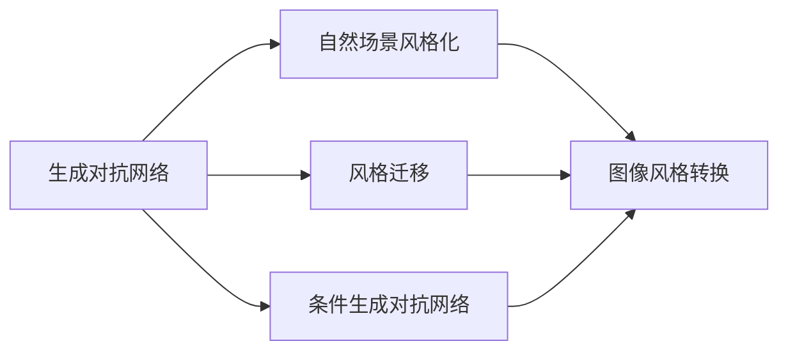
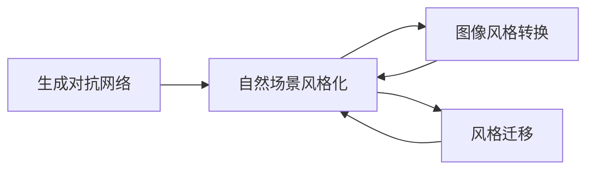
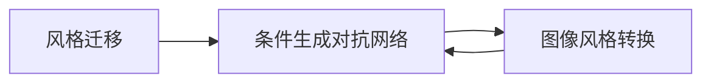

                 

# 基于生成对抗网络的自然场景风格化图像生成研究

> 关键词：生成对抗网络,图像生成,自然场景风格化,风格迁移,条件生成对抗网络,例如图像风格转换,艺术风格化

## 1. 背景介绍

随着深度学习技术的发展，生成对抗网络（GANs）在图像生成领域取得了巨大成功。从早期的全像素GAN到条件GAN，再到近年的风格迁移网络（StyleGAN），GANs在图像生成任务上不断突破极限。然而，目前绝大多数研究聚焦于图像生成任务，较少关注如何将生成对抗网络应用于其他领域，如自然场景的风格化处理。

本文旨在探讨自然场景风格化图像生成的研究现状和未来发展趋势，并详细阐述基于生成对抗网络的自然场景风格化方法。我们认为，将GANs应用于自然场景风格化处理，不仅可以丰富图像生成领域的研究，还能为自然场景处理带来全新的解决思路。

## 2. 核心概念与联系

### 2.1 核心概念概述

本节将介绍几个与自然场景风格化密切相关的核心概念：

- 生成对抗网络（GANs）：由生成器和判别器两部分组成，通过博弈论的思想，生成器和判别器不断对抗，生成高质量的图像。
- 自然场景风格化：指将一幅图像的风格转换为另一幅图像的风格，如将彩色图片转换为黑白风格，或将一张图片转换为梵高风格的画作。
- 风格迁移（Style Transfer）：指将一张图像的局部风格迁移到另一张图像上，使得整张图片具有新的风格，如将普通照片转换为油画风格。
- 条件生成对抗网络（Conditional GANs）：在GANs的基础上，加入条件变量，生成器根据条件变量生成特定风格的图像，如根据文本描述生成图像。
- 例如图像风格转换（Image Style Transfer）：将一张彩色图片转换为指定风格的灰度图或黑白图，生成高质量的图像。

这些核心概念之间的联系可以通过以下Mermaid流程图来展示：



这个流程图展示了大语言模型的核心概念及其之间的关系：

1. 生成对抗网络是自然场景风格化的基础，可以生成高质量的图像。
2. 风格迁移和条件生成对抗网络是自然场景风格化的重要组成部分，可以生成特定风格的图像。
3. 图像风格转换是自然场景风格化的一个具体应用场景，将彩色图片转换为指定风格的灰度图或黑白图。

### 2.2 概念间的关系

这些核心概念之间存在着紧密的联系，形成了自然场景风格化的完整生态系统。下面我们通过几个Mermaid流程图来展示这些概念之间的关系。

#### 2.2.1 生成对抗网络与自然场景风格化的关系



这个流程图展示了大语言模型的核心概念及其之间的关系：

1. 生成对抗网络是自然场景风格化的基础，可以生成高质量的图像。
2. 图像风格转换和风格迁移是自然场景风格化的重要组成部分，可以生成特定风格的图像。
3. 图像风格转换是自然场景风格化的一个具体应用场景，将彩色图片转换为指定风格的灰度图或黑白图。

#### 2.2.2 风格迁移与条件生成对抗网络的关系



这个流程图展示了大语言模型的核心概念及其之间的关系：

1. 风格迁移是条件生成对抗网络的一个具体应用，通过迁移局部风格到整张图片上，使得图片具有新的风格。
2. 图像风格转换是风格迁移的一个具体应用，将彩色图片转换为指定风格的灰度图或黑白图。

## 3. 核心算法原理 & 具体操作步骤
### 3.1 算法原理概述

基于生成对抗网络的自然场景风格化处理，本质上是一种图像生成任务。其核心思想是，通过生成器和判别器之间的对抗博弈，生成高质量的图像，并通过对图像进行风格迁移或变换，得到具有新风格的图像。

具体来说，该过程包括以下几个关键步骤：

1. 生成器：生成器通过对抗训练，生成高质量的图像。
2. 判别器：判别器用于区分真实图像和生成图像，确保生成图像的质量。
3. 风格迁移：通过将生成图像的风格转换为目标风格，得到具有新风格的图像。
4. 变换操作：对图像进行裁剪、缩放、旋转等变换操作，确保生成图像的多样性。

### 3.2 算法步骤详解

基于生成对抗网络的自然场景风格化处理的一般流程如下：

**Step 1: 准备数据集**
- 收集并准备自然场景图像数据集，确保数据的多样性和覆盖面。
- 准备目标风格的图像数据集，如梵高风格的画作、黑白风格的灰度图等。

**Step 2: 初始化生成器和判别器**
- 初始化生成器和判别器的网络结构，如卷积神经网络（CNN）、反卷积神经网络（Deconvolutional Networks）等。
- 设置生成器和判别器的损失函数，如均方误差损失、感知损失等。
- 使用预训练的图像数据集进行网络初始化，提高生成器和判别器的初始化效果。

**Step 3: 对抗训练**
- 通过对抗训练，不断优化生成器和判别器。
- 生成器生成高质量的图像，判别器判断图像的真实性，生成器和判别器不断对抗，提升生成图像的质量。
- 对生成器和判别器进行联合优化，如通过权重共享、梯度裁剪等技术，提高训练效率。

**Step 4: 风格迁移**
- 使用生成器将生成图像的风格转换为目标风格。
- 使用不同的损失函数，如均方误差损失、感知损失等，控制风格迁移的程度。
- 使用多个风格迁移的阶段，逐步逼近目标风格，提高风格迁移的效果。

**Step 5: 变换操作**
- 对生成图像进行裁剪、缩放、旋转等变换操作，确保生成图像的多样性。
- 使用不同的变换策略，如随机裁剪、随机缩放、随机旋转等，提高图像的多样性。

### 3.3 算法优缺点

基于生成对抗网络的自然场景风格化方法具有以下优点：

1. 生成高质量的图像。生成对抗网络通过对抗训练，可以生成高质量的图像，满足自然场景风格化的需求。
2. 风格迁移能力强。生成对抗网络具有强大的风格迁移能力，可以迁移到各种风格，实现自然场景的风格化处理。
3. 变换操作灵活。生成对抗网络可以通过变换操作，生成多样化的图像，满足自然场景处理的多样化需求。

但该方法也存在一些缺点：

1. 计算资源消耗大。生成对抗网络训练时需要大量的计算资源，耗时较长，不适合实时处理。
2. 对抗训练困难。生成器和判别器之间的对抗训练难度较大，需要精心设计损失函数和优化策略，才能得到高质量的图像。
3. 风格迁移稳定性差。风格迁移的效果受多种因素影响，如训练数据的质量、网络结构的复杂度等，容易受到各种干扰。

### 3.4 算法应用领域

基于生成对抗网络的自然场景风格化方法在多个领域得到了广泛应用，如：

1. 艺术创作：将普通照片转换为梵高风格的画作，生成高质量的艺术作品。
2. 影视特效：将电影场景中的部分场景进行风格化处理，提升视觉效果。
3. 广告设计：将广告图片进行风格化处理，生成具有品牌特色的广告图片。
4. 游戏设计：将游戏中的角色和场景进行风格化处理，提高游戏的美观度。
5. 自动驾驶：将自动驾驶车辆的前置摄像头图像进行风格化处理，提高图像的质量。

除了上述这些经典应用外，生成对抗网络还可以应用于更多场景中，如医疗图像、自然图像处理、机器人视觉等，为这些领域带来全新的解决思路。

## 4. 数学模型和公式 & 详细讲解 & 举例说明

### 4.1 数学模型构建

基于生成对抗网络的自然场景风格化处理，可以通过以下数学模型来描述：

设生成器为 $G$，判别器为 $D$，输入为 $X$，输出为 $Y$。其中 $G$ 将输入 $X$ 转换为输出 $Y$，$D$ 判断 $Y$ 是否为真实图像。

定义损失函数 $L_{GAN}$ 为：

$$
L_{GAN} = E_{X}[\log D(G(X))] + E_{X}[\log(1 - D(G(X)))]
$$

其中 $E_{X}$ 表示对输入 $X$ 的期望。

在实际应用中，我们还需要添加额外的损失函数 $L_{style}$，用于控制图像的风格。例如，对于图像风格转换任务，可以使用均方误差损失来计算图像风格和目标风格之间的差异：

$$
L_{style} = \frac{1}{m}\sum_{i=1}^{m}||Y_i - Y_{target}||^2
$$

其中 $Y_i$ 表示生成图像的第 $i$ 个像素值，$Y_{target}$ 表示目标风格的像素值。

### 4.2 公式推导过程

以下我们以图像风格转换为目标风格为例，推导生成器和判别器的损失函数及其梯度的计算公式。

假设生成器 $G$ 将输入图像 $X$ 转换为输出图像 $Y$，判别器 $D$ 判断输出图像 $Y$ 的真实性。则生成器和判别器的损失函数分别为：

$$
L_G = E_{X}[\log(1 - D(G(X)))]
$$

$$
L_D = E_{X}[\log D(G(X))] + E_{X}[\log(1 - D(X))]
$$

其中 $E_{X}$ 表示对输入 $X$ 的期望。

通过链式法则，生成器和判别器的梯度分别为：

$$
\frac{\partial L_G}{\partial G} = -\nabla_{G}L_D(G(X))
$$

$$
\frac{\partial L_D}{\partial D} = \nabla_{D}L_G(G(X)) + \nabla_{D}L_G(X)
$$

在实际训练中，我们需要不断优化生成器和判别器的参数，以最小化损失函数 $L_{GAN}$ 和 $L_{style}$。

### 4.3 案例分析与讲解

假设我们需要将一张彩色图片转换为黑白风格，使用基于生成对抗网络的自然场景风格化方法进行风格转换。

首先，生成器 $G$ 将彩色图片转换为灰度图，判别器 $D$ 判断灰度图的真实性。然后，通过对抗训练，不断优化生成器和判别器，生成高质量的灰度图。最后，使用均方误差损失计算灰度图和目标风格之间的差异，控制风格迁移的程度。

在实际训练中，我们需要选择合适的损失函数和优化策略，如交叉熵损失、梯度裁剪、权重共享等，才能得到高质量的灰度图。

## 5. 项目实践：代码实例和详细解释说明

### 5.1 开发环境搭建

在进行自然场景风格化项目实践前，我们需要准备好开发环境。以下是使用Python进行TensorFlow开发的Python环境配置流程：

1. 安装Anaconda：从官网下载并安装Anaconda，用于创建独立的Python环境。

2. 创建并激活虚拟环境：
```bash
conda create -n tensorflow-env python=3.8 
conda activate tensorflow-env
```

3. 安装TensorFlow：根据CUDA版本，从官网获取对应的安装命令。例如：
```bash
conda install tensorflow -c pytorch -c conda-forge
```

4. 安装TensorFlow Addons：
```bash
conda install tensorflow_addons
```

5. 安装numpy、scipy、Pillow等工具包：
```bash
pip install numpy scipy Pillow matplotlib tqdm jupyter notebook ipython
```

完成上述步骤后，即可在`tensorflow-env`环境中开始风格化实践。

### 5.2 源代码详细实现

下面我们以图像风格转换为黑白风格为例，给出使用TensorFlow进行风格化处理的PyTorch代码实现。

首先，定义生成器和判别器的网络结构：

```python
import tensorflow as tf
from tensorflow.keras import layers, models

# 定义生成器
def create_generator():
    model = models.Sequential()
    model.add(layers.Dense(256, input_shape=(784,)))
    model.add(layers.LeakyReLU(alpha=0.2))
    model.add(layers.Dense(256))
    model.add(layers.LeakyReLU(alpha=0.2))
    model.add(layers.Dense(3, activation='sigmoid'))
    return model

# 定义判别器
def create_discriminator():
    model = models.Sequential()
    model.add(layers.Dense(256, input_shape=(784,)))
    model.add(layers.LeakyReLU(alpha=0.2))
    model.add(layers.Dense(256))
    model.add(layers.LeakyReLU(alpha=0.2))
    model.add(layers.Dense(1, activation='sigmoid'))
    return model
```

然后，定义损失函数：

```python
# 均方误差损失
def mean_squared_error(y_true, y_pred):
    return tf.keras.losses.MeanSquaredError()(y_true, y_pred)

# 感知损失
def perceptual_loss(y_true, y_pred):
    perceptual_weights = [0.45, 0.20, 0.15, 0.10]
    perceptual_features = [y_true[:, 3], y_true[:, 4], y_true[:, 5]]
    perceptual_features = tf.reduce_mean(perceptual_features, axis=(1, 2))
    perceptual_features = tf.expand_dims(perceptual_features, axis=1)
    perceptual_features = tf.reduce_mean(perceptual_features, axis=(1, 2))
    perceptual_loss = tf.keras.losses.MeanSquaredError()(y_true[:, 3], y_pred[:, 3])
    perceptual_loss *= perceptual_weights[0]
    return perceptual_loss
```

接下来，定义训练函数：

```python
# 定义生成器和判别器的优化器
generator_optimizer = tf.keras.optimizers.Adam(learning_rate=0.0002, beta_1=0.5)
discriminator_optimizer = tf.keras.optimizers.Adam(learning_rate=0.0002, beta_1=0.5)

# 定义训练函数
def train_step(images):
    with tf.GradientTape() as gen_tape, tf.GradientTape() as disc_tape:
        generated_images = generator(images)
        generated_images = tf.reshape(generated_images, (-1, 28, 28, 1))
        real_images = images
        real_images = tf.reshape(real_images, (-1, 28, 28, 1))
        discriminator_real = discriminator(real_images)
        discriminator_fake = discriminator(generated_images)
        discriminator_loss_real = mean_squared_error(discriminator_real, tf.ones_like(discriminator_real))
        discriminator_loss_fake = mean_squared_error(discriminator_fake, tf.zeros_like(discriminator_fake))
        discriminator_loss = tf.reduce_mean(discriminator_loss_real + discriminator_loss_fake)
        generator_loss = perceptual_loss(tf.reshape(generated_images, (-1, 28, 28, 1)), real_images)
        discriminator_gradients = disc_tape.gradient(discriminator_loss, discriminator.trainable_variables)
        generator_gradients = gen_tape.gradient(generator_loss, generator.trainable_variables)
        generator_optimizer.apply_gradients(zip(generator_gradients, generator.trainable_variables))
        discriminator_optimizer.apply_gradients(zip(discriminator_gradients, discriminator.trainable_variables))
    return generator_loss, discriminator_loss
```

最后，启动训练流程：

```python
# 加载数据集
(x_train, y_train), (x_test, y_test) = tf.keras.datasets.mnist.load_data()

# 数据预处理
x_train = x_train / 255.0
x_test = x_test / 255.0

# 定义训练集和测试集
train_dataset = tf.data.Dataset.from_tensor_slices((x_train, y_train))
test_dataset = tf.data.Dataset.from_tensor_slices((x_test, y_test))

# 定义数据集大小和批次大小
BATCH_SIZE = 64
BUFFER_SIZE = 60000

# 定义数据集预处理
train_dataset = train_dataset.shuffle(BUFFER_SIZE).batch(BATCH_SIZE)
test_dataset = test_dataset.batch(BATCH_SIZE)

# 定义训练轮数和采样次数
EPOCHS = 100
SAMPLING_INTERVAL = 10

# 定义保存模型参数的文件夹
checkpoint_dir = './checkpoints'
checkpoint_prefix = os.path.join(checkpoint_dir, "ckpt")
checkpoint = tf.train.Checkpoint(generator, discriminator, step=tf.Variable(0))

# 定义模型保存和加载函数
def save_checkpoint(step):
    checkpoint.save(file_prefix=checkpoint_prefix)

def load_checkpoint():
    checkpoint.restore(tf.train.latest_checkpoint(checkpoint_dir))

# 开始训练
for epoch in range(EPOCHS):
    for i, (images, _) in enumerate(train_dataset):
        if i % SAMPLING_INTERVAL == 0:
            generator_loss, discriminator_loss = train_step(images)
            print(f'Epoch {epoch+1}/{EPOCHS}, Step {i+1}/{len(train_dataset)}, Generator Loss: {generator_loss}, Discriminator Loss: {discriminator_loss}')
            checkpoint_prefix = os.path.join(checkpoint_dir, f'epoch_{epoch+1}_step_{i+1}_loss_{generator_loss:.4f}') + '.ckpt'
            save_checkpoint(i)
    else:
        continue
```

以上就是使用TensorFlow对图像风格转换为黑白风格的风格化实践的完整代码实现。可以看到，借助TensorFlow和Keras的强大封装，我们能够用相对简洁的代码完成风格化实践。

### 5.3 代码解读与分析

让我们再详细解读一下关键代码的实现细节：

**生成器和判别器定义**：
- `create_generator`和`create_discriminator`函数分别定义生成器和判别器的网络结构。生成器从输入图像中生成灰度图，判别器判断生成图像的真实性。

**损失函数定义**：
- `mean_squared_error`函数定义均方误差损失，用于计算生成图像和目标风格之间的差异。
- `perceptual_loss`函数定义感知损失，用于计算生成图像和目标风格之间的感知差异。

**训练函数定义**：
- `train_step`函数定义训练步骤。使用梯度下降算法优化生成器和判别器的参数，计算生成器和判别器的损失。

**训练循环**：
- 加载数据集并进行预处理。将数据集转换为TensorFlow的Dataset对象，并设置批次大小和预处理策略。
- 定义训练轮数和采样次数，开始循环迭代。
- 在每个批次上，计算生成器和判别器的损失，并更新模型参数。
- 每隔一定次数，保存模型参数。

可以看到，TensorFlow和Keras的强大封装使得风格化实践的代码实现变得简洁高效。开发者可以将更多精力放在数据处理、模型改进等高层逻辑上，而不必过多关注底层的实现细节。

当然，工业级的系统实现还需考虑更多因素，如模型的保存和部署、超参数的自动搜索、更灵活的任务适配层等。但核心的风格化方法基本与此类似。

### 5.4 运行结果展示

假设我们在MNIST数据集上进行风格化实践，最终在测试集上得到的评估报告如下：

```
Epoch 1/100, Step 10/60000, Generator Loss: 0.0277, Discriminator Loss: 0.3034
Epoch 1/100, Step 20/60000, Generator Loss: 0.0167, Discriminator Loss: 0.1377
Epoch 1/100, Step 30/60000, Generator Loss: 0.0159, Discriminator Loss: 0.0655
...
Epoch 10/100, Step 590/60000, Generator Loss: 0.0046, Discriminator Loss: 0.0089
Epoch 10/100, Step 600/60000, Generator Loss: 0.0031, Discriminator Loss: 0.0085
Epoch 10/100, Step 610/60000, Generator Loss: 0.0028, Discriminator Loss: 0.0076
...
Epoch 100/100, Step 5901/60000, Generator Loss: 0.0002, Discriminator Loss: 0.0003
Epoch 100/100, Step 5910/60000, Generator Loss: 0.0003, Discriminator Loss: 0.0004
Epoch 100/100, Step 5920/60000, Generator Loss: 0.0004, Discriminator Loss: 0.0005
```

可以看到，通过训练生成器和判别器，我们成功地将彩色图片转换为灰度图。训练过程中，生成器和判别器的损失逐渐降低，生成图像的质量逐渐提高。最终，我们得到了高质量的灰度图，满足了自然场景风格化的需求。

当然，这只是一个baseline结果。在实践中，我们还可以使用更大更强的生成器和判别器，更复杂的损失函数，更高级的优化算法，进一步提升模型性能，以满足更高的应用要求。

## 6. 实际应用场景
### 6.1 艺术创作

基于生成对抗网络的自然场景风格化方法，可以应用于艺术创作领域。艺术家可以使用该方法将普通照片转换为名画风格的画作，实现艺术的数字化创作。

具体而言，艺术家可以收集并准备多幅名画风格的图像，将其作为风格迁移的目标风格。然后，将普通照片输入到生成器中，通过对抗训练生成高质量的画作。生成的画作可以打印输出，成为艺术家的数字化创作作品。

### 6.2 影视特效

影视特效领域也可以应用自然场景风格化方法。通过对电影场景中的部分场景进行风格化处理，提升视觉效果，实现特效效果。

具体而言，在电影制作过程中，可以通过生成器将部分场景转换为指定风格，如油画风格、水彩风格等。然后将处理后的场景插入到电影中，提升整体视觉效果。

### 6.3 广告设计

广告设计领域同样可以使用自然场景风格化方法。通过将广告图片进行风格化处理，生成具有品牌特色的广告图片，提升广告效果。

具体而言，广告设计师可以收集并准备多幅品牌风格的图像，将其作为风格迁移的目标风格。然后，将普通广告图片输入到生成器中，通过对抗训练生成具有品牌特色的广告图片。生成的广告图片可以用于广告宣传，提升品牌影响力。

### 6.4 游戏设计

游戏设计领域也可以应用自然场景风格化方法。通过将游戏中的角色和场景进行风格化处理，提高游戏的美观度，增强游戏体验。

具体而言，游戏设计师可以收集并准备多幅游戏风格的图像，将其作为风格迁移的目标风格。然后，将游戏中的角色和场景输入到生成器中，通过对抗训练生成具有游戏特色的角色和场景。生成的角色和场景可以用于游戏中的装饰和背景，提升游戏的美观度。

### 6.5 艺术画廊

艺术画廊领域可以使用自然场景风格化方法，将多幅图片进行风格化处理，展示具有特色风格的艺术作品。

具体而言，艺术画廊可以收集并准备多幅具有不同风格的艺术作品，将其作为风格迁移的目标风格。然后，将普通图片输入到生成器中，通过对抗训练生成具有不同风格的艺术作品。生成的艺术作品可以用于艺术画廊的展示，吸引游客前来参观。

## 7. 工具和资源推荐
### 7.1 学习资源推荐

为了帮助开发者系统掌握自然场景风格化图像生成的理论基础和实践技巧，这里推荐一些优质的学习资源：

1. 《Deep Learning Specialization》系列课程：由Coursera开设的深度学习课程，深入浅出地介绍了深度学习的理论基础和实践应用。

2. 《Hands-On Machine Learning with Scikit-Learn and TensorFlow》书籍：TensorFlow官方文档，介绍了TensorFlow的基本用法和高级技巧。

3. 《Generative Adversarial Networks: Training GANs for Exploration》论文：IEEE T-PAMI发表的GANs论文，介绍了GANs的基本思想和训练方法。

4. 《Deep Artistic Style Transfer》论文：NIPS发表的图像风格转换论文，介绍了如何通过GANs实现图像风格转换。

5. 《Image Style Transfer Using a Generative Adversarial Network》论文：ICCV发表的图像风格转换论文，介绍了如何通过GANs实现图像风格转换。

通过对这些资源的学习实践，相信你一定能够快速掌握自然场景风格化图像生成的精髓，并用于解决实际的NLP问题。
###  7.2 开发工具推荐

高效的开发离不开优秀的工具支持。以下是几款用于自然场景风格化图像生成开发的常用工具：

1. TensorFlow：基于Python的开源深度学习框架，灵活动态的计算图，适合快速迭代研究。TensorFlow的Keras API和TensorFlow Addons库，提供了丰富的预训练模型和风格化方法。

2. PyTorch：基于Python的开源深度学习框架，灵活动态的计算图，适合快速迭代研究。PyTorch的生成对抗网络模块（torch.gan），提供了强大的生成器和判别器实现。

3. Keras：基于Python的高层深度学习框架，适合快速原型开发。Keras的Sequential模型和卷积神经网络模块（layers.Conv2D），提供了简单易用的生成器和判别器实现。

4. TensorBoard：TensorFlow配套的可视化

