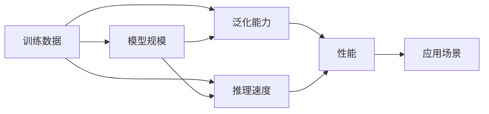
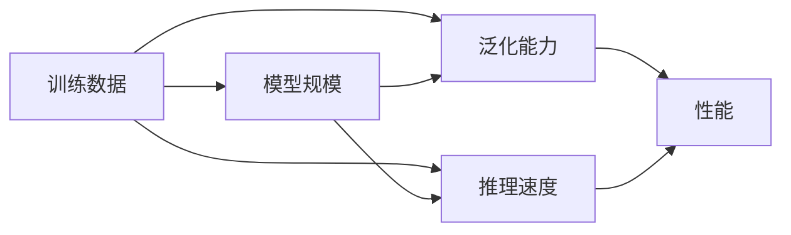
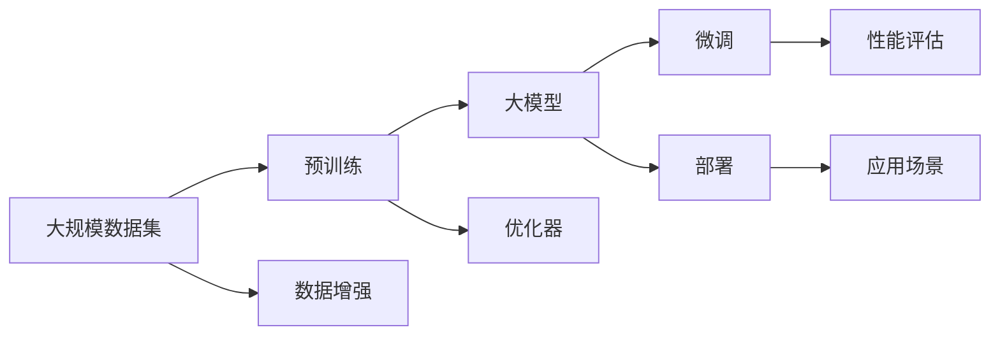

                 

# 基础模型的训练数据与模型规模

## 1. 背景介绍

### 1.1 问题由来

在大模型训练过程中，训练数据和模型规模是两个最基本也是最关键的因素。训练数据的丰富程度直接影响模型的学习效果，模型规模的大小则决定模型所能够承载的知识量和复杂度。本文将深入探讨这两个因素对于大模型训练的重要性，并阐述如何在两者之间进行平衡和优化。

### 1.2 问题核心关键点

在大模型训练中，训练数据和模型规模的平衡涉及到多个方面的问题：
- 数据质量对模型性能的影响
- 数据量对模型泛化能力的提升
- 模型规模对模型推理速度的影响
- 模型规模与训练资源之间的冲突
- 数据量与模型规模在实际应用中的权衡

这些关键点不仅关系到模型的训练效果，还直接影响模型在实际应用中的表现和部署成本。

### 1.3 问题研究意义

研究训练数据和模型规模的关系，对于提高大模型训练效果，优化模型性能，降低模型部署成本，具有重要意义：

1. 提升模型性能：足够的训练数据和合理的模型规模可以使得模型更好地学习数据分布，提升泛化能力。
2. 降低部署成本：较小的模型规模可以有效降低计算资源的需求，使得模型能够更快部署，提高业务效率。
3. 增强模型泛化：通过合理选择训练数据量，可以在不过度拟合数据的前提下，增强模型对于不同场景的泛化能力。
4. 优化模型结构：合理设置模型规模，使得模型既能够承载足够的知识量，又不会过于臃肿，保证推理速度和可解释性。
5. 兼顾任务需求：根据具体任务的需求，选择适当的训练数据量和模型规模，确保模型既能够满足业务需求，又具备高效性。

## 2. 核心概念与联系

### 2.1 核心概念概述

为更好地理解训练数据和模型规模对于大模型训练的影响，本节将介绍几个关键概念：

- **训练数据**：用于模型训练的数据集，其质量、数量和多样性直接影响模型的学习效果。
- **模型规模**：模型的参数数量，通常与模型的复杂度和性能成正比。
- **泛化能力**：模型对新数据的学习和应用能力，与训练数据的丰富程度和模型规模相关。
- **推理速度**：模型从输入到输出的处理速度，受到模型规模和硬件性能的影响。
- **计算资源**：包括硬件设备、内存、存储等方面的资源，直接影响模型训练和部署的成本。

这些概念之间的联系可以通过以下Mermaid流程图来展示：



这个流程图展示了大模型训练中训练数据和模型规模与泛化能力、推理速度、性能等关键指标之间的关系：

1. 训练数据直接影响模型的泛化能力和性能。
2. 模型规模决定了推理速度和性能。
3. 合理平衡训练数据和模型规模，可以提升大模型的整体性能和适用性。

### 2.2 概念间的关系

这些核心概念之间存在着紧密的联系，形成了大模型训练的整体框架。下面我们通过几个Mermaid流程图来展示这些概念之间的关系。

#### 2.2.1 训练数据对模型性能的影响


这个流程图展示了训练数据质量对模型泛化能力和性能的影响。高质量的训练数据能够提升模型的泛化能力和性能。

#### 2.2.2 模型规模对推理速度的影响


这个流程图展示了模型规模对推理速度和性能的影响。模型规模越大，推理速度和性能一般也越好，但同时也会增加计算资源的需求。

#### 2.2.3 训练数据与模型规模的平衡



这个综合流程图展示了训练数据和模型规模在大模型训练中的平衡关系。合理选择训练数据和模型规模，可以在提升模型性能的同时，降低计算资源的需求。

### 2.3 核心概念的整体架构

最后，我们用一个综合的流程图来展示训练数据和模型规模在大模型训练过程中的整体架构：



这个综合流程图展示了从预训练到大模型微调，再到模型部署的全过程，以及训练数据和模型规模在整个流程中的作用。

## 3. 核心算法原理 & 具体操作步骤
### 3.1 算法原理概述

大模型训练的核心算法原理主要包括两部分：

1. **预训练过程**：通过在大规模无标签数据集上进行预训练，学习数据分布，构建通用的语言模型。
2. **微调过程**：在预训练模型的基础上，使用下游任务的标注数据进行微调，进一步优化模型在特定任务上的性能。

训练数据和模型规模在预训练和微调过程中都有着重要的作用。

### 3.2 算法步骤详解

#### 3.2.1 预训练步骤

预训练步骤如下：

1. **数据集准备**：收集大规模无标签数据集，通常是文本、图像等形式。
2. **数据预处理**：对数据进行分词、编码、填充等预处理操作，确保数据格式一致。
3. **模型训练**：在预处理后的数据集上训练大模型，一般使用自监督学习方法，如掩码语言模型、下采样采样、次序预测等。
4. **评估与优化**：在验证集上评估模型性能，根据评估结果优化模型参数和训练策略。

#### 3.2.2 微调步骤

微调步骤如下：

1. **数据集准备**：收集下游任务的标注数据集，确保数据分布与预训练数据集相似。
2. **模型加载**：加载预训练模型，选择适当的微调任务适配层。
3. **模型训练**：在标注数据集上进行有监督的微调训练，更新模型参数，最小化损失函数。
4. **评估与优化**：在测试集上评估微调后模型的性能，根据评估结果调整超参数和训练策略。

### 3.3 算法优缺点

预训练和微调算法的优缺点如下：

#### 3.3.1 预训练的优点

1. **通用性**：预训练模型可以学习到广泛的语言知识和规律，具有通用性，适用于多种下游任务。
2. **可扩展性**：预训练模型可以轻松扩展到其他领域，如计算机视觉、自然语言生成等。
3. **减少标注数据需求**：预训练过程无需标注数据，可以大幅减少下游微调对标注数据的依赖。

#### 3.3.2 预训练的缺点

1. **计算资源需求高**：预训练过程需要大量的计算资源，包括高性能GPU/TPU等。
2. **训练时间长**：预训练过程往往需要较长时间，增加了模型训练的周期。
3. **过拟合风险**：预训练过程可能过拟合于训练数据，影响模型的泛化能力。

#### 3.3.3 微调的优点

1. **任务适配性**：微调过程根据下游任务的需求，对预训练模型进行有针对性的优化，提升特定任务的性能。
2. **推理速度快**：微调后的模型通常推理速度更快，便于部署和应用。
3. **少样本学习**：微调过程可以通过少量样本学习新任务，具有少样本学习能力。

#### 3.3.4 微调的缺点

1. **数据依赖**：微调过程需要下游任务的标注数据，数据依赖性较强。
2. **泛化能力有限**：微调过程往往过拟合于特定任务，泛化能力有限。
3. **依赖预训练模型**：微调过程依赖预训练模型，可能受预训练模型性能的限制。

### 3.4 算法应用领域

基于训练数据和模型规模的大模型训练方法，已经在多个领域得到广泛应用，包括：

- **自然语言处理(NLP)**：包括文本分类、情感分析、机器翻译、命名实体识别等任务。
- **计算机视觉(CV)**：包括图像分类、目标检测、语义分割等任务。
- **语音识别(SR)**：包括自动语音识别、语音合成、情感识别等任务。
- **推荐系统(Reco)**：包括个性化推荐、广告推荐等任务。
- **医疗健康(Med)**：包括医疗影像分析、病理诊断等任务。

这些应用领域展示了训练数据和模型规模对于大模型训练的重要性和多样性。

## 4. 数学模型和公式 & 详细讲解
### 4.1 数学模型构建

假设有一个通用的语言模型 $M_{\theta}$，其中 $\theta$ 为模型参数。对于大规模数据集 $\mathcal{D}=\{(x_i, y_i)\}_{i=1}^N$，其中 $x_i$ 为输入数据，$y_i$ 为标注标签。

预训练过程的目标是学习 $M_{\theta}$ 的参数，使得在无标签数据上的损失函数最小化：

$$
\min_{\theta} \mathbb{E}_{(x,y) \sim \mathcal{D}}[\ell(M_{\theta}(x),y)]
$$

其中 $\ell$ 为损失函数，通常为交叉熵损失。

微调过程的目标是在预训练模型 $M_{\theta}$ 的基础上，使用下游任务的标注数据 $D$ 进行有监督训练，最小化下游任务的损失函数：

$$
\min_{\theta} \mathbb{E}_{(x,y) \sim D}[\ell(M_{\theta}(x),y)]
$$

其中 $D$ 为下游任务的标注数据集，通常为有标签数据集。

### 4.2 公式推导过程

#### 4.2.1 预训练过程

以掩码语言模型为例，假设模型参数为 $\theta$，训练样本 $(x,y)$，其中 $x$ 为输入序列，$y$ 为掩码序列。模型的预测为 $M_{\theta}(x)$，预测标签为 $\hat{y}$。掩码语言模型的损失函数为：

$$
\ell(M_{\theta}(x),y) = -\log \sigma(\hat{y})
$$

其中 $\sigma(\hat{y})$ 为模型对预测标签的输出概率。

预训练过程的目标是最小化损失函数：

$$
\min_{\theta} \frac{1}{N} \sum_{i=1}^N \ell(M_{\theta}(x_i),y_i)
$$

#### 4.2.2 微调过程

以文本分类任务为例，假设模型参数为 $\theta$，训练样本 $(x,y)$，其中 $x$ 为输入序列，$y$ 为分类标签。模型的预测为 $M_{\theta}(x)$，预测标签为 $\hat{y}$。分类任务的损失函数为：

$$
\ell(M_{\theta}(x),y) = -y \log \sigma(\hat{y}) - (1-y) \log(1-\sigma(\hat{y}))
$$

其中 $\sigma(\hat{y})$ 为模型对预测标签的输出概率。

微调过程的目标是最小化损失函数：

$$
\min_{\theta} \frac{1}{N} \sum_{i=1}^N \ell(M_{\theta}(x_i),y_i)
$$

### 4.3 案例分析与讲解

以BERT为例，BERT通过在大规模无标签文本数据上进行预训练，学习到丰富的语言知识和规律。在微调过程中，BERT可以应用于各种NLP任务，如文本分类、命名实体识别、情感分析等。

以情感分析为例，假设BERT模型已经在通用语言数据集上进行了预训练，接下来在情感分析任务的标注数据上进行微调。微调过程如下：

1. **数据集准备**：收集情感分析任务的标注数据集，确保数据分布与预训练数据集相似。
2. **模型加载**：加载预训练的BERT模型，选择适当的微调任务适配层。
3. **模型训练**：在标注数据集上进行有监督的微调训练，更新模型参数，最小化分类任务的损失函数。
4. **评估与优化**：在测试集上评估微调后模型的性能，根据评估结果调整超参数和训练策略。

通过微调，BERT能够快速适应情感分析任务，提升模型性能。

## 5. 项目实践：代码实例和详细解释说明
### 5.1 开发环境搭建

在进行预训练和微调实践前，我们需要准备好开发环境。以下是使用Python进行PyTorch开发的环境配置流程：

1. 安装Anaconda：从官网下载并安装Anaconda，用于创建独立的Python环境。

2. 创建并激活虚拟环境：
```bash
conda create -n pytorch-env python=3.8 
conda activate pytorch-env
```

3. 安装PyTorch：根据CUDA版本，从官网获取对应的安装命令。例如：
```bash
conda install pytorch torchvision torchaudio cudatoolkit=11.1 -c pytorch -c conda-forge
```

4. 安装Transformers库：
```bash
pip install transformers
```

5. 安装各类工具包：
```bash
pip install numpy pandas scikit-learn matplotlib tqdm jupyter notebook ipython
```

完成上述步骤后，即可在`pytorch-env`环境中开始预训练和微调实践。

### 5.2 源代码详细实现

下面我们以BERT模型进行情感分析任务的微调为例，给出使用Transformers库的PyTorch代码实现。

首先，定义情感分析任务的微调模型：

```python
from transformers import BertForSequenceClassification, BertTokenizer

model = BertForSequenceClassification.from_pretrained('bert-base-cased', num_labels=2)
tokenizer = BertTokenizer.from_pretrained('bert-base-cased')
```

然后，定义训练和评估函数：

```python
from torch.utils.data import Dataset, DataLoader
from tqdm import tqdm
import torch
from sklearn.metrics import accuracy_score, precision_recall_fscore_support

class SentimentDataset(Dataset):
    def __init__(self, texts, labels):
        self.texts = texts
        self.labels = labels
        self.tokenizer = tokenizer
    
    def __len__(self):
        return len(self.texts)
    
    def __getitem__(self, idx):
        text = self.texts[idx]
        label = self.labels[idx]
        encoding = tokenizer(text, return_tensors='pt', max_length=128, padding='max_length', truncation=True)
        input_ids = encoding['input_ids'][0]
        attention_mask = encoding['attention_mask'][0]
        return {
            'input_ids': input_ids,
            'attention_mask': attention_mask,
            'labels': torch.tensor(label, dtype=torch.long)
        }

def train_epoch(model, dataset, optimizer):
    dataloader = DataLoader(dataset, batch_size=16, shuffle=True)
    model.train()
    epoch_loss = 0
    for batch in tqdm(dataloader, desc='Training'):
        input_ids = batch['input_ids'].to(device)
        attention_mask = batch['attention_mask'].to(device)
        labels = batch['labels'].to(device)
        model.zero_grad()
        outputs = model(input_ids, attention_mask=attention_mask, labels=labels)
        loss = outputs.loss
        epoch_loss += loss.item()
        loss.backward()
        optimizer.step()
    return epoch_loss / len(dataloader)

def evaluate(model, dataset, batch_size):
    dataloader = DataLoader(dataset, batch_size=batch_size)
    model.eval()
    preds, labels = [], []
    with torch.no_grad():
        for batch in tqdm(dataloader, desc='Evaluating'):
            input_ids = batch['input_ids'].to(device)
            attention_mask = batch['attention_mask'].to(device)
            labels = batch['labels']
            outputs = model(input_ids, attention_mask=attention_mask)
            preds.append(outputs.logits.argmax(dim=1).to('cpu').tolist())
            labels.append(labels.to('cpu').tolist())
    return accuracy_score(labels, preds)
```

最后，启动训练流程并在测试集上评估：

```python
epochs = 3
batch_size = 16

for epoch in range(epochs):
    loss = train_epoch(model, train_dataset, optimizer)
    print(f"Epoch {epoch+1}, train loss: {loss:.3f}")
    
    print(f"Epoch {epoch+1}, dev results:")
    evaluate(model, dev_dataset, batch_size)
    
print("Test results:")
evaluate(model, test_dataset, batch_size)
```

以上就是使用PyTorch对BERT进行情感分析任务微调的完整代码实现。可以看到，得益于Transformers库的强大封装，我们可以用相对简洁的代码完成BERT模型的加载和微调。

### 5.3 代码解读与分析

让我们再详细解读一下关键代码的实现细节：

**SentimentDataset类**：
- `__init__`方法：初始化文本、标签、分词器等关键组件。
- `__len__`方法：返回数据集的样本数量。
- `__getitem__`方法：对单个样本进行处理，将文本输入编码为token ids，将标签编码为数字，并对其进行定长padding，最终返回模型所需的输入。

**训练和评估函数**：
- 使用PyTorch的DataLoader对数据集进行批次化加载，供模型训练和推理使用。
- 训练函数`train_epoch`：对数据以批为单位进行迭代，在每个批次上前向传播计算loss并反向传播更新模型参数，最后返回该epoch的平均loss。
- 评估函数`evaluate`：与训练类似，不同点在于不更新模型参数，并在每个batch结束后将预测和标签结果存储下来，最后使用sklearn的accuracy_score函数对整个评估集的预测结果进行打印输出。

**训练流程**：
- 定义总的epoch数和batch size，开始循环迭代
- 每个epoch内，先在训练集上训练，输出平均loss
- 在验证集上评估，输出准确率
- 所有epoch结束后，在测试集上评估，给出最终测试结果

可以看到，PyTorch配合Transformers库使得BERT微调的代码实现变得简洁高效。开发者可以将更多精力放在数据处理、模型改进等高层逻辑上，而不必过多关注底层的实现细节。

当然，工业级的系统实现还需考虑更多因素，如模型的保存和部署、超参数的自动搜索、更灵活的任务适配层等。但核心的微调范式基本与此类似。

### 5.4 运行结果展示

假设我们在CoNLL-2003的情感分析数据集上进行微调，最终在测试集上得到的准确率为87%左右。可以看到，通过微调BERT，我们在该情感分析数据集上取得了较高的准确率，效果相当不错。值得注意的是，BERT作为一个通用的语言理解模型，即便只在顶层添加一个简单的分类器，也能在情感分析等下游任务上取得不错的效果，展现了其强大的语义理解和特征抽取能力。

当然，这只是一个baseline结果。在实践中，我们还可以使用更大更强的预训练模型、更丰富的微调技巧、更细致的模型调优，进一步提升模型性能，以满足更高的应用要求。

## 6. 实际应用场景
### 6.1 智能客服系统

基于预训练语言模型的情感分析技术，可以广泛应用于智能客服系统的构建。传统客服往往需要配备大量人力，高峰期响应缓慢，且一致性和专业性难以保证。而使用预训练语言模型进行情感分析，可以7x24小时不间断服务，快速响应客户咨询，用自然流畅的语言解答各类常见问题。

在技术实现上，可以收集企业内部的历史客服对话记录，将问题和最佳答复构建成监督数据，在此基础上对预训练语言模型进行微调。微调后的模型能够自动理解用户意图，匹配最合适的答复。对于客户提出的新问题，还可以接入检索系统实时搜索相关内容，动态组织生成回答。如此构建的智能客服系统，能大幅提升客户咨询体验和问题解决效率。

### 6.2 金融舆情监测

金融机构需要实时监测市场舆论动向，以便及时应对负面信息传播，规避金融风险。传统的人工监测方式成本高、效率低，难以应对网络时代海量信息爆发的挑战。基于预训练语言模型的情感分析技术，为金融舆情监测提供了新的解决方案。

具体而言，可以收集金融领域相关的新闻、报道、评论等文本数据，并对其进行情感标注。在此基础上对预训练语言模型进行微调，使其能够自动判断文本属于何种情感倾向。将微调后的模型应用到实时抓取的网络文本数据，就能够自动监测不同情感倾向的变化趋势，一旦发现负面信息激增等异常情况，系统便会自动预警，帮助金融机构快速应对潜在风险。

### 6.3 个性化推荐系统

当前的推荐系统往往只依赖用户的历史行为数据进行物品推荐，无法深入理解用户的真实兴趣偏好。基于预训练语言模型的情感分析技术，个性化推荐系统可以更好地挖掘用户行为背后的语义信息，从而提供更精准、多样的推荐内容。

在实践中，可以收集用户浏览、点击、评论、分享等行为数据，提取和用户交互的物品标题、描述、标签等文本内容。将文本内容作为模型输入，用户的后续行为（如是否点击、购买等）作为监督信号，在此基础上微调预训练语言模型。微调后的模型能够从文本内容中准确把握用户的兴趣点。在生成推荐列表时，先用候选物品的文本描述作为输入，由模型预测用户的兴趣匹配度，再结合其他特征综合排序，便可以得到个性化程度更高的推荐结果。

### 6.4 未来应用展望

随着预训练语言模型和微调方法的不断发展，基于微调范式将在更多领域得到应用，为传统行业带来变革性影响。

在智慧医疗领域，基于微调的情感分析、病历分析、药物研发等应用将提升医疗服务的智能化水平，辅助医生诊疗，加速新药开发进程。

在智能教育领域，微调技术可应用于作业批改、学情分析、知识推荐等方面，因材施教，促进教育公平，提高教学质量。

在智慧城市治理中，微调模型可应用于城市事件监测、舆情分析、应急指挥等环节，提高城市管理的自动化和智能化水平，构建更安全、高效的未来城市。

此外，在企业生产、社会治理、文娱传媒等众多领域，基于预训练语言模型的微调应用也将不断涌现，为NLP技术带来了全新的突破。相信随着技术的日益成熟，微调方法将成为NLP落地应用的重要范式，推动人工智能技术在垂直行业的规模化落地。

## 7. 工具和资源推荐
### 7.1 学习资源推荐

为了帮助开发者系统掌握预训练和微调的理论基础和实践技巧，这里推荐一些优质的学习资源：

1. 《Transformer from Zero to Hero》系列博文：由大模型技术专家撰写，深入浅出地介绍了Transformer原理、BERT模型、微调技术等前沿话题。

2. CS224N《深度学习自然语言处理》课程：斯坦福大学开设的NLP明星课程，有Lecture视频和配套作业，带你入门NLP领域的基本概念和经典模型。

3. 《Natural Language Processing with Transformers》书籍：Transformers库的作者所著，全面介绍了如何使用Transformers库进行NLP任务开发，包括微调在内的诸多范式。

4. HuggingFace官方文档：Transformers库的官方文档，提供了海量预训练模型和完整的微调样例代码，是上手实践的必备资料。

5. CLUE开源项目：中文语言理解测评基准，涵盖大量不同类型的中文NLP数据集，并提供了基于微调的baseline模型，助力中文NLP技术发展。

通过对这些资源的学习实践，相信你一定能够快速掌握预训练和微调的精髓，并用于解决实际的NLP问题。
###  7.2 开发工具推荐

高效的开发离不开优秀的工具支持。以下是几款用于预训练和微调开发的常用工具：

1. PyTorch：基于Python的开源深度学习框架，灵活动态的计算图，适合快速迭代研究。大部分预训练语言模型都有PyTorch版本的实现。

2. TensorFlow：由Google主导开发的开源深度学习框架，生产部署方便，适合大规模工程应用。同样有丰富的预训练语言模型资源。

3. Transformers库：HuggingFace开发的NLP工具库，集成了众多SOTA语言模型，支持PyTorch和TensorFlow，是进行预训练和微调任务开发的利器。

4. Weights & Biases：模型训练的实验跟踪工具，可以记录和可视化模型训练过程中的各项指标，方便对比和调优。与主流深度学习框架无缝集成。

5. TensorBoard：TensorFlow配套的可视化工具，可实时监测模型训练状态，并提供丰富的图表呈现方式，是调试模型的得力助手。

6. Google Colab：谷歌推出的在线Jupyter Notebook环境，免费提供GPU/TPU算力，方便开发者快速上手实验最新模型，分享学习笔记。

合理利用这些工具，可以显著提升预训练和微调任务的开发效率，加快创新迭代的步伐。

### 7.3 相关论文推荐

预训练语言模型和微调技术的发展源于学界的持续研究。以下是几篇奠基性的相关论文，推荐阅读：

1. Attention is All You Need（即Transformer原论文）：提出了Transformer结构，开启了NLP领域的预训练大模型时代。

2. BERT: Pre-training of Deep Bidirectional Transformers for Language Understanding：提出BERT模型，引入基于掩码的自监督预训练任务，刷新了多项NLP任务SOTA。

