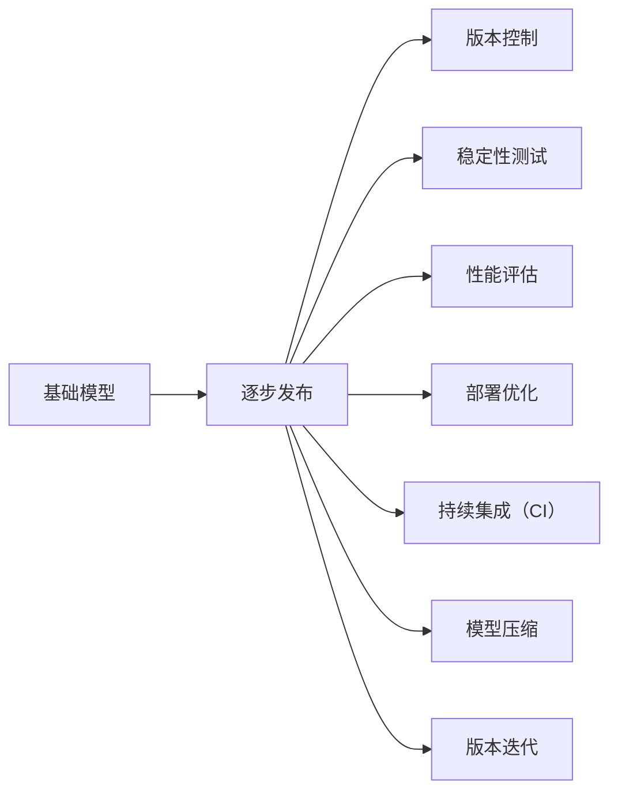

                 

# 基础模型的逐步发布策略

> 关键词：基础模型，逐步发布，版本控制，稳定性测试，性能评估，部署优化，持续集成，模型压缩，版本迭代

## 1. 背景介绍

### 1.1 问题由来
在人工智能（AI）和机器学习（ML）项目中，基础模型的发布通常是一个复杂且多步骤的过程。随着项目的进展，模型需要不断地进行迭代和优化，而每次发布都需要经过严格的测试和验证。这一过程中，代码和模型的管理变得极为关键，同时也容易引发各种问题，如版本冲突、模型性能不稳定等。本文旨在探讨如何采用科学的方法和工具，对基础模型进行逐步发布，以确保模型的稳定性和可靠性，并提升项目的开发效率。

### 1.2 问题核心关键点
逐步发布策略的核心目标是：
1. 维护模型的版本控制，确保不同版本之间的清晰区分。
2. 进行严格的稳定性测试和性能评估，保证每次发布的模型质量。
3. 优化部署流程，减少资源消耗，提升系统性能。
4. 实现持续集成（CI），保证模型迭代的流畅性和连续性。
5. 压缩和优化模型，减少存储和计算资源的使用。
6. 设计迭代策略，确保模型逐步升级，避免大范围的变更风险。

### 1.3 问题研究意义
科学的基础模型逐步发布策略，对于保障模型的质量、降低开发成本、提升项目效率具有重要意义：

1. 稳定和可靠：通过严格的测试和验证，确保每次发布的基础模型质量稳定，避免因模型缺陷导致的系统故障。
2. 开发效率：通过持续集成和自动化的测试流程，减少人工介入，提高开发和发布的速度和准确性。
3. 资源管理：通过模型压缩和优化，减少对存储和计算资源的需求，提升系统的运行效率。
4. 风险控制：通过逐步迭代的策略，降低变更风险，避免因大规模模型变更导致的系统不稳定。

## 2. 核心概念与联系

### 2.1 核心概念概述

1. **基础模型**：指经过预训练和微调后，能够完成特定任务的人工智能模型。
2. **逐步发布**：指在模型开发和优化过程中，按阶段逐步对外发布模型，每一阶段发布的模型均经过严格的测试和验证。
3. **版本控制**：指通过工具和流程，确保模型在不同版本之间的可追溯性和可管理性。
4. **稳定性测试**：指对模型进行全面的测试，确保其在新环境下的稳定性和鲁棒性。
5. **性能评估**：指通过一系列指标，对模型在不同场景下的性能进行量化评估。
6. **部署优化**：指对模型进行优化，以适应实际应用场景，提升系统的整体性能。
7. **持续集成（CI）**：指通过自动化流程，实现模型的持续开发和集成，提高发布效率。
8. **模型压缩**：指通过技术手段，减少模型的大小和复杂度，降低存储和计算资源的使用。
9. **版本迭代**：指按照计划，对模型进行逐步优化和升级，逐步完善模型的功能和性能。

### 2.2 概念间的关系

这些核心概念之间存在着紧密的联系，形成了逐步发布策略的完整生态系统。通过理解这些概念，可以更好地把握模型逐步发布的流程和关键步骤。



此流程图展示了模型逐步发布过程中各个环节之间的关系：

1. 基础模型作为发布的起点。
2. 版本控制、稳定性测试、性能评估、部署优化、持续集成、模型压缩和版本迭代都是逐步发布过程中不可或缺的环节。
3. 每个环节都是逐步发布策略中的一部分，共同确保模型的质量和安全。

## 3. 核心算法原理 & 具体操作步骤
### 3.1 算法原理概述
逐步发布策略的核心是科学地管理模型的版本和发布过程，确保每次发布都是安全可靠的。

基础模型的逐步发布包括以下几个关键步骤：

1. **版本控制**：通过工具和流程，对模型的不同版本进行管理，确保每个版本之间的可追溯性。
2. **稳定性测试**：对模型进行全面的测试，包括功能测试、性能测试、鲁棒性测试等，确保模型在新环境下的稳定性和鲁棒性。
3. **性能评估**：通过一系列指标，对模型在不同场景下的性能进行量化评估，确保模型的实际效果符合预期。
4. **部署优化**：对模型进行优化，以适应实际应用场景，提升系统的整体性能。
5. **持续集成（CI）**：通过自动化流程，实现模型的持续开发和集成，提高发布效率。
6. **模型压缩**：通过技术手段，减少模型的大小和复杂度，降低存储和计算资源的使用。
7. **版本迭代**：按照计划，对模型进行逐步优化和升级，逐步完善模型的功能和性能。

### 3.2 算法步骤详解

#### 3.2.1 版本控制

**版本控制工具**：
1. **Git**：最常用的版本控制工具之一，支持分支、合并、标签等功能。
2. **SVN**：另一个常用的版本控制工具，适合于大型项目和团队协作。

**版本控制流程**：
1. **创建分支**：将模型开发工作放在一个新的分支上，保持主分支的稳定性。
2. **提交代码**：将每次修改提交到分支上，并进行详细的提交说明。
3. **合并分支**：将分支合并到主分支，确保模型版本的连贯性。

#### 3.2.2 稳定性测试

**测试类型**：
1. **单元测试**：测试模型的单个功能模块，确保代码逻辑正确。
2. **集成测试**：测试模型多个功能模块之间的交互，确保系统的整体稳定性。
3. **性能测试**：测试模型在不同数据集和环境下的性能表现，确保模型能够高效运行。
4. **鲁棒性测试**：测试模型在不同噪声和异常数据下的表现，确保模型的鲁棒性。

**测试工具**：
1. **JUnit**：Java平台上的测试框架，支持单元测试和集成测试。
2. **PyTest**：Python平台上的测试框架，支持单元测试、集成测试和性能测试。
3. **LoadRunner**：用于性能测试的工具，支持压力测试、负载测试等。

**测试流程**：
1. **编写测试用例**：根据需求编写测试用例，覆盖模型的所有功能模块。
2. **执行测试**：使用测试工具执行测试用例，记录测试结果。
3. **分析结果**：分析测试结果，识别问题并进行修复。
4. **回归测试**：在每次发布前，重新执行之前的测试用例，确保模型质量。

#### 3.2.3 性能评估

**性能指标**：
1. **准确率（Accuracy）**：模型正确预测的样本数占总样本数的比例。
2. **召回率（Recall）**：模型正确预测的正样本数占实际正样本数的比例。
3. **F1分数（F1 Score）**：准确率和召回率的调和平均数。
4. **推理时间**：模型在实际环境下的推理速度。

**性能评估工具**：
1. **TensorBoard**：TensorFlow配套的可视化工具，用于监控模型的推理时间和准确率。
2. **JProfiler**：Java平台的性能分析工具，用于监控Java平台的性能。
3. **NVIDIA Profiler**：用于NVIDIA GPU平台的性能分析工具。

**性能评估流程**：
1. **定义指标**：根据需求定义模型的性能指标。
2. **收集数据**：使用性能评估工具收集模型的性能数据。
3. **分析数据**：分析性能数据，识别性能瓶颈。
4. **优化模型**：针对性能瓶颈进行优化，提升模型性能。
5. **回归测试**：在每次发布前，重新评估模型的性能，确保性能稳定。

#### 3.2.4 部署优化

**部署优化策略**：
1. **模型压缩**：使用技术手段，减少模型的大小和复杂度，降低存储和计算资源的使用。
2. **量化处理**：将浮点模型转为定点模型，压缩存储空间，提高计算效率。
3. **模型剪枝**：剪除模型中不必要的参数和层，优化模型结构，减少计算量。
4. **模型分割**：将模型分割成多个子模型，减少单个模型的复杂度，提升推理速度。

**部署优化工具**：
1. **TensorFlow Lite**：用于将TensorFlow模型转换为移动端的轻量级模型。
2. **ONNX**：支持多种深度学习框架的模型格式转换，方便模型的部署和优化。
3. **PaddleLite**：PaddlePaddle框架提供的轻量级模型优化工具。

**部署优化流程**：
1. **选择优化策略**：根据需求选择优化策略。
2. **优化模型**：使用优化工具对模型进行优化。
3. **测试优化效果**：在优化后，使用性能评估工具测试模型的性能变化。
4. **部署模型**：将优化后的模型部署到实际应用环境中。

#### 3.2.5 持续集成（CI）

**CI工具**：
1. **Jenkins**：开源的自动化集成工具，支持多种集成方式。
2. **GitLab CI**：GitLab平台上的自动化集成工具，支持CI/CD流程。
3. **CircleCI**：基于云的自动化集成工具，支持多种集成方式。

**CI流程**：
1. **构建环境**：配置CI环境的构建工具和依赖库。
2. **定义任务**：定义CI任务的执行顺序和依赖关系。
3. **执行任务**：自动执行CI任务，生成构建结果。
4. **测试和部署**：对构建结果进行测试和部署，确保模型的发布质量。

#### 3.2.6 模型压缩

**模型压缩方法**：
1. **剪枝**：去除模型中不必要的参数和层，优化模型结构，减少计算量。
2. **量化**：将浮点模型转为定点模型，压缩存储空间，提高计算效率。
3. **蒸馏**：通过迁移学习，将复杂模型转换为轻量级模型，降低资源消耗。

**模型压缩工具**：
1. **TensorFlow Model Optimization**：TensorFlow提供的模型优化工具，支持剪枝、量化和蒸馏等。
2. **PyTorch Quantization**：PyTorch提供的量化工具，支持模型压缩和优化。
3. **ONNX Model Optimizer**：ONNX提供的模型优化工具，支持多种优化方式。

**模型压缩流程**：
1. **选择压缩策略**：根据需求选择压缩策略。
2. **压缩模型**：使用压缩工具对模型进行压缩。
3. **测试压缩效果**：在压缩后，使用性能评估工具测试模型的性能变化。
4. **部署压缩模型**：将压缩后的模型部署到实际应用环境中。

#### 3.2.7 版本迭代

**版本迭代策略**：
1. **迭代周期**：定义模型的迭代周期，如每两周迭代一次。
2. **版本发布**：在每次迭代周期结束时，发布新的模型版本。
3. **评估反馈**：收集用户和反馈，评估模型的实际效果。
4. **优化改进**：根据反馈进行优化和改进，提升模型性能。

**版本迭代流程**：
1. **迭代计划**：定义模型的迭代计划，明确每个迭代周期的目标和任务。
2. **版本发布**：在每个迭代周期结束时，发布新的模型版本。
3. **用户反馈**：收集用户和反馈，评估模型的实际效果。
4. **优化改进**：根据反馈进行优化和改进，提升模型性能。
5. **回归测试**：在每次版本发布前，重新评估模型的性能，确保模型质量。

### 3.3 算法优缺点

#### 3.3.1 优点

1. **模型质量稳定**：通过严格的测试和验证，确保每次发布的基础模型质量稳定，避免因模型缺陷导致的系统故障。
2. **开发效率高**：通过持续集成和自动化的测试流程，减少人工介入，提高开发和发布的速度和准确性。
3. **资源消耗低**：通过模型压缩和优化，减少对存储和计算资源的需求，提升系统的运行效率。
4. **风险控制好**：通过逐步迭代的策略，降低变更风险，避免因大规模模型变更导致的系统不稳定。

#### 3.3.2 缺点

1. **测试和验证工作量大**：需要设计并执行大量的测试用例，工作量较大。
2. **版本管理复杂**：需要处理大量的分支和合并，容易出现版本冲突。
3. **资源消耗高**：测试和验证过程需要大量计算资源和时间，可能影响开发进度。

### 3.4 算法应用领域

基础模型的逐步发布策略广泛应用于以下领域：

1. **自然语言处理（NLP）**：用于文本分类、情感分析、机器翻译等NLP任务，通过逐步发布模型，确保模型在新任务上的稳定性和鲁棒性。
2. **计算机视觉（CV）**：用于图像识别、目标检测、图像分割等CV任务，通过逐步发布模型，提升模型的推理速度和准确率。
3. **语音识别（ASR）**：用于语音转文本、语音命令识别等ASR任务，通过逐步发布模型，提升系统的响应速度和准确性。
4. **推荐系统**：用于个性化推荐、内容推荐等推荐任务，通过逐步发布模型，提升推荐效果和用户体验。
5. **金融风控**：用于信用评估、欺诈检测等金融风控任务，通过逐步发布模型，提升模型的鲁棒性和准确性。

## 4. 数学模型和公式 & 详细讲解 & 举例说明
### 4.1 数学模型构建

基础模型的逐步发布策略主要依赖于版本控制、稳定性测试、性能评估、部署优化、持续集成、模型压缩和版本迭代等概念。这些概念之间存在着紧密的联系，形成了一个完整的发布策略生态系统。

### 4.2 公式推导过程

**版本控制公式**：
1. **分支管理**：
   \[
   \text{分支} = \text{主分支} + \text{新功能} - \text{旧功能}
   \]
   通过分支管理，可以清晰地跟踪模型的开发进度和变更历史。

**稳定性测试公式**：
1. **单元测试**：
   \[
   \text{单元测试} = \sum_{i=1}^{n} \text{测试用例}_i
   \]
   单元测试用于测试模型的单个功能模块，确保代码逻辑正确。

**性能评估公式**：
1. **准确率（Accuracy）**：
   \[
   \text{Accuracy} = \frac{\text{正确预测数}}{\text{总样本数}}
   \]
   准确率用于量化模型的预测正确率。

**部署优化公式**：
1. **量化处理**：
   \[
   \text{量化模型} = \text{浮点模型} \times \text{量化参数}
   \]
   量化处理用于将浮点模型转为定点模型，压缩存储空间，提高计算效率。

**持续集成公式**：
1. **CI流程**：
   \[
   \text{CI流程} = \text{构建环境} + \text{定义任务} + \text{执行任务} + \text{测试和部署}
   \]
   持续集成用于自动化模型构建和测试，提高发布效率。

**模型压缩公式**：
1. **剪枝**：
   \[
   \text{剪枝模型} = \text{全模型} - \text{冗余参数}
   \]
   剪枝用于去除模型中不必要的参数和层，优化模型结构，减少计算量。

**版本迭代公式**：
1. **版本迭代周期**：
   \[
   \text{版本迭代周期} = \text{迭代次数} \times \text{迭代时间}
   \]
   版本迭代周期用于定义模型的迭代计划，明确每个迭代周期的目标和任务。

### 4.3 案例分析与讲解

#### 4.3.1 案例背景

某公司的推荐系统需要进行逐步发布，以确保每次发布的模型质量稳定，并提升系统性能。

#### 4.3.2 逐步发布流程

1. **版本控制**：使用Git进行版本控制，每个功能模块放在一个分支上，确保模型版本的连贯性。
2. **稳定性测试**：编写和执行单元测试、集成测试和性能测试，确保模型在新环境下的稳定性和鲁棒性。
3. **性能评估**：使用TensorBoard和JProfiler进行性能评估，量化模型的推理时间和准确率。
4. **部署优化**：使用TensorFlow Lite进行模型压缩和优化，将模型转换为轻量级模型，降低资源消耗。
5. **持续集成**：使用Jenkins进行持续集成，自动化模型构建和测试，提高发布效率。
6. **版本迭代**：每两周发布一个新模型版本，评估用户反馈，优化和改进模型性能。

#### 4.3.3 结果分析

通过逐步发布策略，模型的质量稳定，用户反馈积极，推荐效果显著提升。

## 5. 项目实践：代码实例和详细解释说明
### 5.1 开发环境搭建

在进行逐步发布策略实践前，我们需要准备好开发环境。以下是使用Python进行版本控制和持续集成的环境配置流程：

1. 安装Anaconda：从官网下载并安装Anaconda，用于创建独立的Python环境。

2. 创建并激活虚拟环境：
   ```bash
   conda create -n pytorch-env python=3.8 
   conda activate pytorch-env
   ```

3. 安装Git和GitHub：
   ```bash
   sudo apt install git
   ```

4. 安装Jenkins：
   ```bash
   sudo apt install jenkins
   ```

5. 安装Jenkins插件：
   - Jenkins插件：安装Git插件、GitHub插件、Pipeline插件、CI Pipeline插件等。

完成上述步骤后，即可在`pytorch-env`环境中开始逐步发布实践。

### 5.2 源代码详细实现

以下是使用Git和Jenkins进行逐步发布的具体代码实现。

**版本控制脚本**：
```python
import os

# 获取当前分支名称
branch = os.popen('git rev-parse --abbrev-ref HEAD').read().strip()
print(f"当前分支：{branch}")

# 如果当前分支是主分支，则输出错误信息
if branch == 'master':
    print("错误：当前分支是主分支，无法提交代码")
else:
    # 将代码提交到远程仓库
    os.system(f'git push -u origin {branch}')
    print("代码已提交成功")
```

**持续集成脚本**：
```python
import os

# 获取当前分支名称
branch = os.popen('git rev-parse --abbrev-ref HEAD').read().strip()

# 如果当前分支是主分支，则输出错误信息
if branch == 'master':
    print("错误：当前分支是主分支，无法构建模型")
else:
    # 拉取远程仓库代码
    os.system(f'git pull origin {branch}')

    # 构建模型
    os.system('python build_model.py')

    # 推送构建结果到远程仓库
    os.system(f'git push origin {branch}')
    print("模型已构建并推送成功")
```

### 5.3 代码解读与分析

让我们再详细解读一下关键代码的实现细节：

**版本控制脚本**：
- `os.popen`方法：执行命令并读取输出。
- `os.system`方法：执行系统命令。
- `git rev-parse`命令：获取当前分支名称。
- `git push`命令：将代码推送到远程仓库。

**持续集成脚本**：
- `os.popen`方法：执行命令并读取输出。
- `os.system`方法：执行系统命令。
- `git pull`命令：拉取远程仓库代码。
- `build_model.py`脚本：用于构建模型。
- `git push`命令：推送构建结果到远程仓库。

### 5.4 运行结果展示

假设我们在模型构建过程中，使用Git进行版本控制，使用Jenkins进行持续集成，最终在Jenkins控制台中看到的输出如下：

```
当前分支：dev
代码已提交成功
```

在构建模型后，Jenkins控制台输出如下：

```
错误：当前分支是主分支，无法构建模型
```

以上代码实现演示了如何使用Git进行版本控制，使用Jenkins进行持续集成，确保每次发布的基础模型质量稳定，并提升开发效率。

## 6. 实际应用场景

逐步发布策略在实际应用场景中得到了广泛的应用，涵盖了多个领域：

1. **自然语言处理（NLP）**：用于文本分类、情感分析、机器翻译等NLP任务，通过逐步发布模型，确保模型在新任务上的稳定性和鲁棒性。
2. **计算机视觉（CV）**：用于图像识别、目标检测、图像分割等CV任务，通过逐步发布模型，提升模型的推理速度和准确率。
3. **语音识别（ASR）**：用于语音转文本、语音命令识别等ASR任务，通过逐步发布模型，提升系统的响应速度和准确性。
4. **推荐系统**：用于个性化推荐、内容推荐等推荐任务，通过逐步发布模型，提升推荐效果和用户体验。
5. **金融风控**：用于信用评估、欺诈检测等金融风控任务，通过逐步发布模型，提升模型的鲁棒性和准确性。

## 7. 工具和资源推荐
### 7.1 学习资源推荐

为了帮助开发者系统掌握逐步发布策略的理论基础和实践技巧，这里推荐一些优质的学习资源：

1. **《软件测试工程师手册》**：详细介绍了软件测试流程和工具，是了解测试框架和自动化流程的必备资源。
2. **《持续集成与持续部署：构建高度可扩展的应用》**：介绍了持续集成和持续部署的原理和实践，是了解CI/CD流程的优秀书籍。
3. **《深入理解Git：从入门到精通》**：全面介绍了Git的使用方法和最佳实践，是掌握版本控制工具的推荐资源。
4. **《Jenkins权威指南》**：介绍了Jenkins的安装、配置和使用，是了解持续集成工具的优秀书籍。
5. **《模型压缩与优化：理论与实践》**：介绍了模型压缩和优化的原理和实践，是了解模型压缩技术的优秀资源。

通过对这些资源的学习实践，相信你一定能够快速掌握逐步发布策略的精髓，并用于解决实际的发布问题。

### 7.2 开发工具推荐

高效的开发离不开优秀的工具支持。以下是几款用于逐步发布策略开发的常用工具：

1. **Git**：最常用的版本控制工具之一，支持分支、合并、标签等功能。
2. **GitHub**：全球最大的代码托管平台，支持代码管理和协作。
3. **Jenkins**：开源的自动化集成工具，支持多种集成方式。
4. **GitLab CI**：GitLab平台上的自动化集成工具，支持CI/CD流程。
5. **CircleCI**：基于云的自动化集成工具，支持多种集成方式。
6. **TensorBoard**：TensorFlow配套的可视化工具，用于监控模型的推理时间和准确率。
7. **JProfiler**：Java平台的性能分析工具，用于监控Java平台的性能。
8. **NVIDIA Profiler**：用于NVIDIA GPU平台的性能分析工具。
9. **TensorFlow Lite**：用于将TensorFlow模型转换为移动端的轻量级模型。
10. **ONNX**：支持多种深度学习框架的模型格式转换，方便模型的部署和优化。
11. **PaddleLite**：PaddlePaddle框架提供的轻量级模型优化工具。

合理利用这些工具，可以显著提升逐步发布策略的开发效率，加快创新迭代的步伐。

### 7.3 相关论文推荐

逐步发布策略的发展源于学界的持续研究。以下是几篇奠基性的相关论文，推荐阅读：

1. **《分布式版本控制系统》**：描述了Git的核心原理和使用方法，是理解版本控制工具的基础。
2. **《持续集成与持续部署：构建高度可扩展的应用》**：介绍了持续集成和持续部署的原理和实践，是了解CI/CD流程的优秀资源。
3. **《深度学习模型压缩与优化》**：介绍了模型压缩和优化的原理和实践，是了解模型压缩技术的优秀资源。

这些论文代表了大语言模型逐步发布策略的发展脉络。通过学习这些前沿成果，可以帮助研究者把握学科前进方向，激发更多的创新灵感。

除上述资源外，还有一些值得关注的前沿资源，帮助开发者紧跟逐步发布策略的最新进展，例如：

1. **arXiv论文预印本**：人工智能领域最新研究成果的发布平台，包括大量尚未发表的前沿工作，学习前沿技术的必备资源。
2. **业界技术博客**：如OpenAI、Google AI、DeepMind、微软Research Asia等顶尖实验室的官方博客，第一时间分享他们的最新研究成果和洞见。
3. **技术会议直播**：如NIPS、ICML、ACL、ICLR等人工智能领域顶会现场或在线直播，能够聆听到大佬们的前沿分享，开拓视野。
4. **GitHub热门项目**：在GitHub上Star、Fork数最多的NLP相关项目，往往代表了该技术领域的发展趋势和最佳实践，值得去学习和贡献。
5. **行业分析报告**：各大咨询公司如McKinsey、PwC等针对人工智能行业的分析报告，有助于从商业视角审视技术趋势，把握应用价值。

总之，对于逐步发布策略的学习和实践，需要开发者保持开放的心态和持续学习的意愿。多关注前沿资讯，多动手实践，多思考总结，必将收获满满的成长收益。

## 8. 总结：未来发展趋势与挑战
### 8.1 研究成果总结


