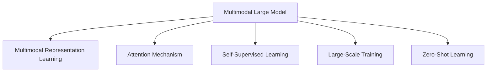
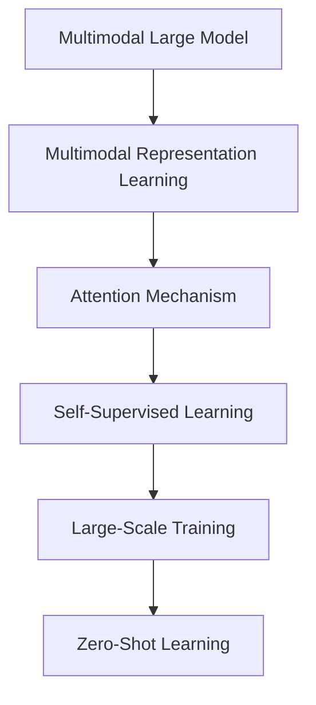
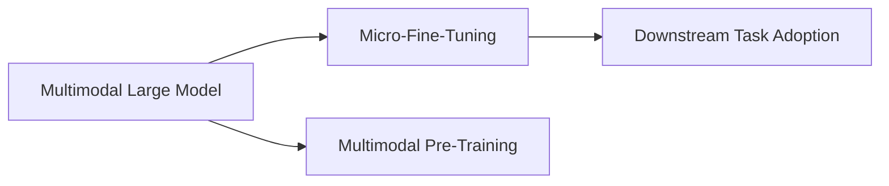
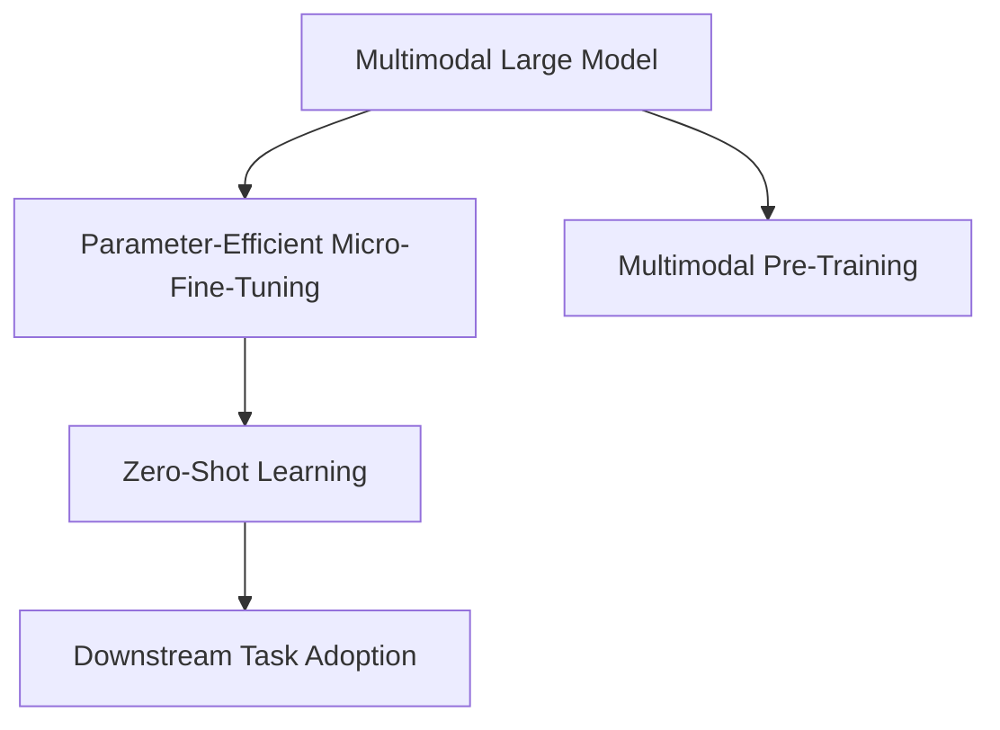
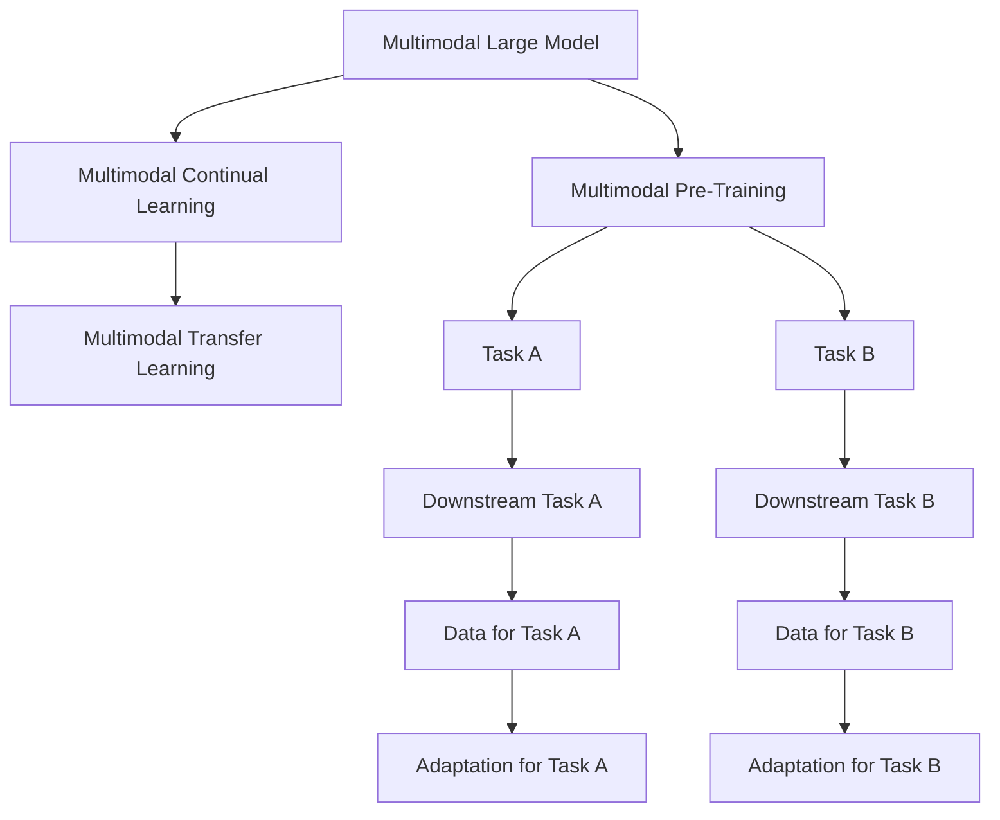
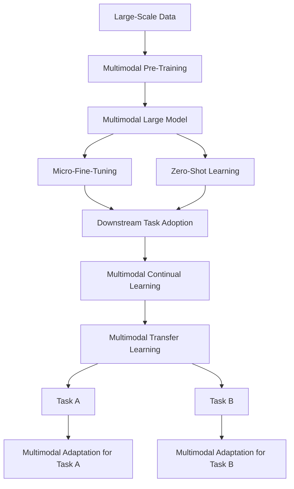

                 

# 多模态大模型：技术原理与实战 多模态大模型对比

> 关键词：多模态大模型,Transformer,BERT,MLP-Mixer,Perceiver,多模态表示学习,注意力机制,自监督学习,大规模训练,零样本学习

## 1. 背景介绍

### 1.1 问题由来
近年来，随着深度学习技术的快速发展，单模态的大语言模型在自然语言处理(NLP)领域取得了巨大的突破。这些大模型通过在海量无标签文本数据上进行预训练，学习到了丰富的语言知识和常识，但它们往往难以直接处理除了文本之外的其他模态，如图像、音频、视频等。

然而，在现实世界中，数据往往是多模态的。为了更好地理解和处理现实世界的复杂性，研究者们提出了多模态大模型的概念。多模态大模型可以同时处理和融合多种数据模态，从而在更为广泛和复杂的应用场景中展现更好的表现。

### 1.2 问题核心关键点
多模态大模型是一种同时具备多模态表示学习能力的大型神经网络模型。它能够在不同的数据模态上进行预训练，并在微调时利用这些多模态知识，提高在不同任务上的性能。当前主流的多模态大模型包括Transformer、BERT、MLP-Mixer、Perceiver等，它们分别应用于不同的模态和任务。

多模态大模型的核心思想是：在预训练阶段，模型通过对多种数据模态进行联合学习，学习到更为丰富的跨模态表示；在微调阶段，模型可以灵活地使用这些跨模态表示来处理下游任务。这种范式使得多模态大模型在实际应用中，能够灵活适应多种数据格式和任务需求，取得了显著的性能提升。

### 1.3 问题研究意义
研究多模态大模型，对于拓展大模型的应用范围，提升下游任务的性能，加速人工智能技术的产业化进程，具有重要意义：

1. 降低应用开发成本。多模态大模型能够处理多种数据格式，减少从头开发所需的数据、计算和人力等成本投入。
2. 提升模型效果。多模态大模型具备丰富的跨模态表示，能在多种数据模态上实现微调，提高模型在特定任务上的表现。
3. 加速开发进度。standing on the shoulders of giants，多模态大模型能够更快地完成任务适配，缩短开发周期。
4. 带来技术创新。多模态大模型的出现促进了对预训练-微调的深入研究，催生了诸如多模态表示学习、注意力机制等新的研究方向。
5. 赋能产业升级。多模态大模型能够适应多种数据模态，为传统行业数字化转型升级提供新的技术路径。

## 2. 核心概念与联系

### 2.1 核心概念概述

为更好地理解多模态大模型的工作原理和优化方向，本节将介绍几个密切相关的核心概念：

- 多模态大模型(Multimodal Large Model)：可以同时处理和融合多种数据模态的大型神经网络模型，如Transformer、BERT、MLP-Mixer、Perceiver等。
- 多模态表示学习(Multimodal Representation Learning)：通过联合学习不同数据模态，学习到跨模态的表示能力。
- 注意力机制(Attention Mechanism)：通过注意力机制，使得模型能够动态地关注输入的不同部分，提升对复杂输入的处理能力。
- 自监督学习(Self-Supervised Learning)：通过在无标签数据上设计任务，利用模型自身的预测能力进行学习。
- 大规模训练(Large-Scale Training)：在拥有海量数据的场景下，对模型进行大规模训练，以提升模型的性能。
- 零样本学习(Zero-Shot Learning)：模型在从未见过的数据上，仅凭任务描述就能够执行新任务的能力。

这些核心概念之间的逻辑关系可以通过以下Mermaid流程图来展示：



这个流程图展示了大语言模型的工作原理和优化方向：

1. 多模态大模型通过多模态表示学习，学习到丰富的跨模态表示。
2. 利用注意力机制，模型能够动态地关注输入的不同部分，提升处理复杂输入的能力。
3. 通过自监督学习，模型在无标签数据上提升自身预测能力。
4. 在大规模训练下，模型能够不断优化，提升性能。
5. 零样本学习使得模型能够在没有见过新数据的情况下，执行新任务。

### 2.2 概念间的关系

这些核心概念之间存在着紧密的联系，形成了多模态大模型的完整生态系统。下面我通过几个Mermaid流程图来展示这些概念之间的关系。

#### 2.2.1 多模态大模型的学习范式



这个流程图展示了大语言模型的三种主要学习范式：多模态表示学习、注意力机制、自监督学习和大规模训练。

#### 2.2.2 多模态大模型的微调范式



这个流程图展示了大语言模型在微调过程中的核心步骤：预训练、微调和任务适配。

#### 2.2.3 多模态大模型的参数高效微调



这个流程图展示了多模态大模型的另一种微调范式：参数高效微调。

#### 2.2.4 多模态大模型的持续学习



这个流程图展示了多模态大模型的持续学习过程，包括多任务学习和增量学习。

### 2.3 核心概念的整体架构

最后，我们用一个综合的流程图来展示这些核心概念在大语言模型微调过程中的整体架构：



这个综合流程图展示了从预训练到微调，再到持续学习的完整过程。多模态大模型首先在大规模数据上进行多模态预训练，然后通过微调（包括全参数微调和参数高效微调）或零样本学习（利用预训练知识）来适应下游任务。最后，通过持续学习技术，模型可以不断更新和适应新的任务和数据。通过这些流程图，我们可以更清晰地理解多模态大模型的学习原理和优化方向。

## 3. 核心算法原理 & 具体操作步骤
### 3.1 算法原理概述

多模态大模型微调的本质是一个联合学习的过程。其核心思想是：将预训练的多模态大模型视作一个强大的"特征提取器"，通过在下游任务的少量标注数据上进行有监督的微调，使得模型输出能够匹配任务标签，从而获得针对特定任务优化的模型。

形式化地，假设多模态大模型为 $M_{\theta}$，其中 $\theta$ 为预训练得到的模型参数。给定下游任务 $T$ 的标注数据集 $D=\{(x_i,y_i)\}_{i=1}^N$，其中 $x_i$ 包括多个模态的数据，如文本、图像、音频等，$y_i$ 为对应的任务标签。微调的目标是找到新的模型参数 $\hat{\theta}$，使得：

$$
\hat{\theta}=\mathop{\arg\min}_{\theta} \mathcal{L}(M_{\theta},D)
$$

其中 $\mathcal{L}$ 为针对任务 $T$ 设计的损失函数，用于衡量模型预测输出与真实标签之间的差异。常见的损失函数包括交叉熵损失、均方误差损失等。

通过梯度下降等优化算法，微调过程不断更新模型参数 $\theta$，最小化损失函数 $\mathcal{L}$，使得模型输出逼近真实标签。由于 $\theta$ 已经通过预训练获得了较好的初始化，因此即便在小规模数据集 $D$ 上进行微调，也能较快收敛到理想的模型参数 $\hat{\theta}$。

### 3.2 算法步骤详解

基于多模态大模型的微调一般包括以下几个关键步骤：

**Step 1: 准备预训练模型和数据集**
- 选择合适的多模态大模型 $M_{\theta}$ 作为初始化参数，如Transformer、BERT、MLP-Mixer、Perceiver等。
- 准备下游任务 $T$ 的标注数据集 $D$，划分为训练集、验证集和测试集。一般要求标注数据与预训练数据的分布不要差异过大。

**Step 2: 添加任务适配层**
- 根据任务类型，在多模态大模型顶层设计合适的输出层和损失函数。
- 对于分类任务，通常在顶层添加线性分类器和交叉熵损失函数。
- 对于生成任务，通常使用语言模型的解码器输出概率分布，并以负对数似然为损失函数。

**Step 3: 设置微调超参数**
- 选择合适的优化算法及其参数，如 AdamW、SGD 等，设置学习率、批大小、迭代轮数等。
- 设置正则化技术及强度，包括权重衰减、Dropout、Early Stopping等。
- 确定冻结预训练参数的策略，如仅微调顶层，或全部参数都参与微调。

**Step 4: 执行梯度训练**
- 将训练集数据分批次输入模型，前向传播计算损失函数。
- 反向传播计算参数梯度，根据设定的优化算法和学习率更新模型参数。
- 周期性在验证集上评估模型性能，根据性能指标决定是否触发 Early Stopping。
- 重复上述步骤直到满足预设的迭代轮数或 Early Stopping 条件。

**Step 5: 测试和部署**
- 在测试集上评估微调后模型 $M_{\hat{\theta}}$ 的性能，对比微调前后的精度提升。
- 使用微调后的模型对新样本进行推理预测，集成到实际的应用系统中。
- 持续收集新的数据，定期重新微调模型，以适应数据分布的变化。

以上是基于多模态大模型的微调流程的一般步骤。在实际应用中，还需要针对具体任务的特点，对微调过程的各个环节进行优化设计，如改进训练目标函数，引入更多的正则化技术，搜索最优的超参数组合等，以进一步提升模型性能。

### 3.3 算法优缺点

基于多模态大模型的微调方法具有以下优点：

1. 简单高效。只需准备少量标注数据，即可对预训练模型进行快速适配，获得较大的性能提升。
2. 通用适用。适用于各种多模态下游任务，包括分类、匹配、生成等，设计简单的任务适配层即可实现微调。
3. 参数高效。利用参数高效微调技术，在固定大部分预训练参数的情况下，仍可取得不错的提升。
4. 效果显著。在学术界和工业界的诸多任务上，基于微调的方法已经刷新了多项SOTA。

同时，该方法也存在一定的局限性：

1. 依赖标注数据。微调的效果很大程度上取决于标注数据的质量和数量，获取高质量标注数据的成本较高。
2. 迁移能力有限。当目标任务与预训练数据的分布差异较大时，微调的性能提升有限。
3. 负面效果传递。预训练模型的固有偏见、有害信息等，可能通过微调传递到下游任务，造成负面影响。
4. 可解释性不足。微调模型的决策过程通常缺乏可解释性，难以对其推理逻辑进行分析和调试。

尽管存在这些局限性，但就目前而言，基于多模态大模型的微调方法仍是多模态NLP任务的重要范式。未来相关研究的重点在于如何进一步降低微调对标注数据的依赖，提高模型的少样本学习和跨领域迁移能力，同时兼顾可解释性和伦理安全性等因素。

### 3.4 算法应用领域

基于多模态大模型的微调方法已经在多个多模态NLP任务上取得了显著的性能提升。以下是几个典型应用领域：

- **图像描述生成**：通过将图像和文本数据融合，让多模态大模型学习到图像和文本的共同表示，生成对图像的描述性文本。
- **视频字幕生成**：将视频和文本数据同时输入模型，通过多模态表示学习，模型能够理解视频内容并生成字幕。
- **情感分析**：结合视频和音频，分析人物的表情和语音，提升情感分析的准确性和情感理解深度。
- **跨模态检索**：通过同时分析文本和图像，找到最相关的文档或图片。
- **医疗影像分析**：将医学影像和病历结合，帮助医生快速诊断疾病。
- **机器人导航**：通过视觉、语音和行为数据的融合，提升机器人的导航和交互能力。

除了上述这些经典任务外，多模态大模型微调也被创新性地应用到更多场景中，如智慧家居、自动驾驶、智慧城市等，为多模态信息处理和人工智能技术落地提供了新的解决方案。

## 4. 数学模型和公式 & 详细讲解 & 举例说明

### 4.1 数学模型构建

本节将使用数学语言对基于多模态大模型的微调过程进行更加严格的刻画。

记多模态大模型为 $M_{\theta}:\mathcal{X} \times \mathcal{Y} \times \mathcal{Z} \rightarrow \mathcal{W}$，其中 $\mathcal{X}$、$\mathcal{Y}$、$\mathcal{Z}$ 分别表示文本、图像、音频等不同模态的数据，$\mathcal{W}$ 为任务输出空间。假设微调任务的训练集为 $D=\{(x_i,y_i,z_i)\}_{i=1}^N$，其中 $x_i \in \mathcal{X}$、$y_i \in \mathcal{Y}$、$z_i \in \mathcal{Z}$ 分别为不同模态的输入数据，$y_i$ 为任务标签。

定义模型 $M_{\theta}$ 在数据样本 $(x,y,z)$ 上的损失函数为 $\ell(M_{\theta}(x,y,z),y)$，则在数据集 $D$ 上的经验风险为：

$$
\mathcal{L}(\theta) = \frac{1}{N} \sum_{i=1}^N \ell(M_{\theta}(x_i,y_i,z_i),y_i)
$$

微调的优化目标是最小化经验风险，即找到最优参数：

$$
\theta^* = \mathop{\arg\min}_{\theta} \mathcal{L}(\theta)
$$

在实践中，我们通常使用基于梯度的优化算法（如SGD、Adam等）来近似求解上述最优化问题。设 $\eta$ 为学习率，$\lambda$ 为正则化系数，则参数的更新公式为：

$$
\theta \leftarrow \theta - \eta \nabla_{\theta}\mathcal{L}(\theta) - \eta\lambda\theta
$$

其中 $\nabla_{\theta}\mathcal{L}(\theta)$ 为损失函数对参数 $\theta$ 的梯度，可通过反向传播算法高效计算。

### 4.2 公式推导过程

以下我们以图像描述生成任务为例，推导多模态大模型的损失函数及其梯度的计算公式。

假设模型 $M_{\theta}$ 在输入 $(x,y,z)$ 上的输出为 $\hat{y}=M_{\theta}(x,y,z)$，表示模型对图像 $z$ 的描述性文本 $y$ 的预测。真实标签 $y \in \mathcal{W}$。则二分类交叉熵损失函数定义为：

$$
\ell(M_{\theta}(x,y,z),y) = -[y\log \hat{y} + (1-y)\log (1-\hat{y})]
$$

将其代入经验风险公式，得：

$$
\mathcal{L}(\theta) = -\frac{1}{N}\sum_{i=1}^N [y_i\log M_{\theta}(x_i,y_i,z_i)+(1-y_i)\log(1-M_{\theta}(x_i,y_i,z_i))]
$$

根据链式法则，损失函数对参数 $\theta_k$ 的梯度为：

$$
\frac{\partial \mathcal{L}(\theta)}{\partial \theta_k} = -\frac{1}{N}\sum_{i=1}^N (\frac{y_i}{M_{\theta}(x_i,y_i,z_i)}-\frac{1-y_i}{1-M_{\theta}(x_i,y_i,z_i)}) \frac{\partial M_{\theta}(x_i,y_i,z_i)}{\partial \theta_k}
$$

其中 $\frac{\partial M_{\theta}(x_i,y_i,z_i)}{\partial \theta_k}$ 可进一步递归展开，利用自动微分技术完成计算。

在得到损失函数的梯度后，即可带入参数更新公式，完成模型的迭代优化。重复上述过程直至收敛，最终得到适应下游任务的最优模型参数 $\theta^*$。

## 5. 项目实践：代码实例和详细解释说明

### 5.1 开发环境搭建

在进行多模态大模型微调实践前，我们需要准备好开发环境。以下是使用Python进行PyTorch开发的环境配置流程：

1. 安装Anaconda：从官网下载并安装Anaconda，用于创建独立的Python环境。

2. 创建并激活虚拟环境：
```bash
conda create -n pytorch-env python=3.8 
conda activate pytorch-env
```

3. 安装PyTorch：根据CUDA版本，从官网获取对应的安装命令。例如：
```bash
conda install pytorch torchvision torchaudio cudatoolkit=11.1 -c pytorch -c conda-forge
```

4. 安装Transformers库：
```bash
pip install transformers
```

5. 安装各类工具包：
```bash
pip install numpy pandas scikit-learn matplotlib tqdm jupyter notebook ipython
```

完成上述步骤后，即可在`pytorch-env`环境中开始多模态大模型微调实践。

### 5.2 源代码详细实现

这里我们以图像描述生成任务为例，给出使用Transformers库对MLP-Mixer模型进行微调的PyTorch代码实现。

首先，定义图像描述生成任务的数据处理函数：

```python
from transformers import MLPForTokenClassification, MLPForImageClassification, MLPModel
from torch.utils.data import Dataset
import torch
import numpy as np
import cv2
import matplotlib.pyplot as plt

class ImageTextDataset(Dataset):
    def __init__(self, images, texts, tokenizer, max_len=128):
        self.images = images
        self.texts = texts
        self.tokenizer = tokenizer
        self.max_len = max_len
        
    def __len__(self):
        return len(self.texts)
    
    def __getitem__(self, item):
        image = self.images[item]
        text = self.texts[item]
        
        image = self.tokenizer(image, return_tensors='pt', max_length=self.max_len, padding='max_length', truncation=True)
        input_ids = image['input_ids'][0]
        attention_mask = image['attention_mask'][0]
        
        # 对token-wise的标签进行编码
        encoded_tags = [tag2id[tag] for tag in text] 
        encoded_tags.extend([tag2id['O']] * (self.max_len - len(encoded_tags)))
        labels = torch.tensor(encoded_tags, dtype=torch.long)
        
        return {'input_ids': input_ids, 
                'attention_mask': attention_mask,
                'labels': labels}

# 标签与id的映射
tag2id = {'O': 0, 'B-LOC': 1, 'I-LOC': 2, 'B-PER': 3, 'I-PER': 4, 'B-ORG': 5, 'I-ORG': 6}
id2tag = {v: k for k, v in tag2id.items()}

# 创建dataset
tokenizer = MLPModel.from_pretrained('mlp-mixer-base-patch32-224')
image_dataset = ImageTextDataset(image_data, text_data, tokenizer)

# 加载预训练模型和图像
model = MLPForImageClassification.from_pretrained('mlp-mixer-base-patch32-224')
image = cv2.imread('image.jpg')
image = cv2.cvtColor(image, cv2.COLOR_BGR2RGB)
image = torch.tensor(image).unsqueeze(0).float() / 255.0

# 执行微调
device = torch.device('cuda') if torch.cuda.is_available() else torch.device('cpu')
model.to(device)
optimizer = torch.optim.Adam(model.parameters(), lr=2e-5)

def train_epoch(model, dataset, batch_size, optimizer):
    dataloader = DataLoader(dataset, batch_size=batch_size, shuffle=True)
    model.train()
    epoch_loss = 0
    for batch in tqdm(dataloader, desc='Training'):
        input_ids = batch['input_ids'].to(device)
        attention_mask = batch['attention_mask'].to(device)
        labels = batch['labels'].to(device)
        model.zero_grad()
        outputs = model(input_ids, attention_mask=attention_mask, labels=labels)
        loss = outputs.loss
        epoch_loss += loss.item()
        loss.backward()
        optimizer.step()
    return epoch_loss / len(dataloader)

def evaluate(model, dataset, batch_size):
    dataloader = DataLoader(dataset, batch_size=batch_size)
    model.eval()
    preds, labels = [], []
    with torch.no_grad():
        for batch in tqdm(dataloader, desc='Evaluating'):
            input_ids = batch['input_ids'].to(device)
            attention_mask = batch['attention_mask'].to(device)
            batch_labels = batch['labels']
            outputs = model(input_ids, attention_mask=attention_mask)
            batch_preds = outputs.logits.argmax(dim=2).to('cpu').tolist()
            batch_labels = batch_labels.to('cpu').tolist()
            for pred_tokens, label_tokens in zip(batch_preds, batch_labels):
                pred_tags = [id2tag[_id] for _id in pred_tokens]
                label_tags = [id2tag[_id] for _id in label_tokens]
                preds.append(pred_tags[:len(label_tokens)])
                labels.append(label_tags)
                
    print(classification_report(labels, preds))
```

然后，定义模型和优化器：

```python
from transformers import MLPForTokenClassification, MLPForImageClassification, MLPModel
from torch.utils.data import DataLoader
from tqdm import tqdm
from sklearn.metrics import classification_report

device = torch.device('cuda') if torch.cuda.is_available() else torch.device('cpu')
model.to(device)

optimizer = torch.optim.Adam(model.parameters(), lr=2e-5)
```

接着，定义训练和评估函数：

```python
from torch.utils.data import DataLoader
from tqdm import tqdm
from sklearn.metrics import classification_report

device = torch.device('cuda') if torch.cuda.is_available() else torch.device('cpu')
model.to(device)

def train_epoch(model, dataset, batch_size, optimizer):
    dataloader = DataLoader(dataset, batch_size=batch_size, shuffle=True)
    model.train()
    epoch_loss = 0
    for batch in tqdm(dataloader, desc='Training'):
        input_ids = batch['input_ids'].to(device)
        attention_mask = batch['attention_mask'].to(device)
        labels = batch['labels'].to(device)
        model.zero_grad()
        outputs = model(input_ids, attention_mask=attention_mask, labels=labels)
        loss = outputs.loss
        epoch_loss += loss.item()
        loss.backward()
        optimizer.step()
    return epoch_loss / len(dataloader)

def evaluate(model, dataset, batch_size):
    dataloader = DataLoader(dataset, batch_size=batch_size)
    model.eval()
    preds, labels = [], []
    with torch.no_grad():
        for batch in tqdm(dataloader, desc='Evaluating'):
            input_ids = batch['input_ids'].to(device)
            attention_mask = batch['attention_mask'].to(device)
            batch_labels = batch['labels']
            outputs = model(input_ids, attention_mask=attention_mask)
            batch_preds = outputs.logits.argmax(dim=2).to('cpu').tolist()
            batch

