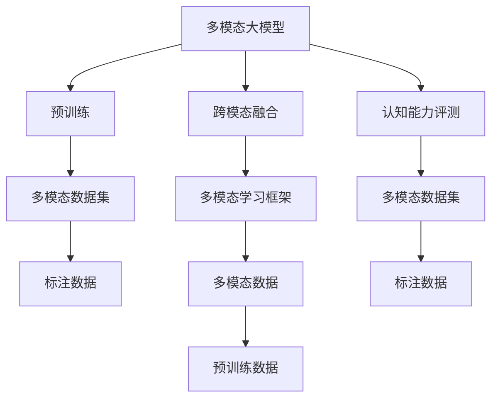
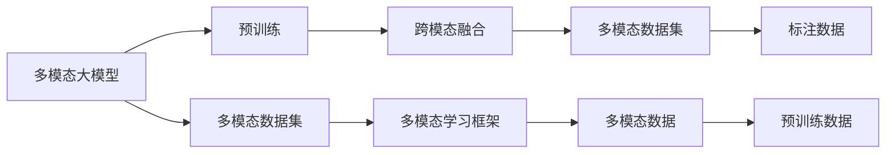
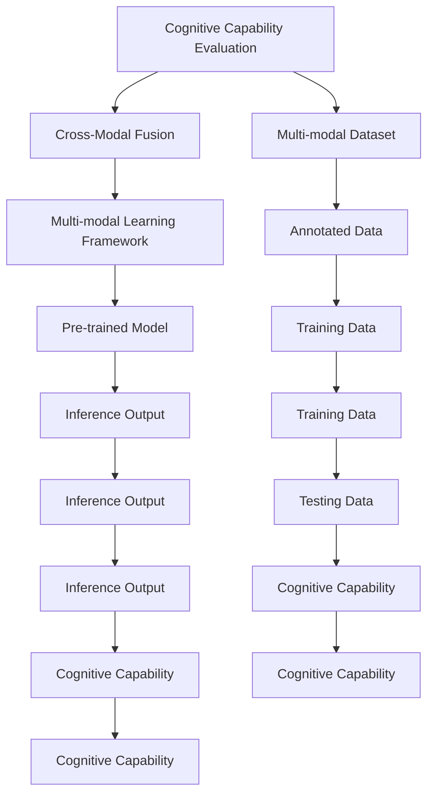

                 

# 多模态大模型：技术原理与实战 认知能力评测

> 关键词：大模型,多模态融合,认知能力评测,自然语言处理,深度学习,计算机视觉

## 1. 背景介绍

### 1.1 问题由来

随着人工智能技术的快速发展，多模态大模型（Multimodal Large Models）在自然语言处理（NLP）、计算机视觉（CV）等多个领域取得了显著的突破。这些模型能够同时处理文本、图像、音频等多种类型的数据，展现出强大的跨模态融合能力。其中，BERT、GPT、ViT等模型在文本领域表现出色，而DAL、DALL-E等模型在图像领域也展现了强大的学习能力。

然而，当前的多模态大模型仍面临一些挑战。首先，跨模态融合技术尚未成熟，不同模态之间的信息交互效果还有待提高。其次，大规模数据集和计算资源的获取成本较高，模型训练和部署成本也较大。最后，模型输出结果的可解释性较差，难以进行有效的认知能力评测。

为了应对这些挑战，本文将从技术原理、实验设计和实践案例三个方面，全面剖析多模态大模型的构建和应用，特别是其在认知能力评测方面的潜力。

### 1.2 问题核心关键点

多模态大模型的核心问题包括：
1. 跨模态融合技术的实现，使得模型能够有效整合不同类型的数据，提高信息交互效果。
2. 如何构建高效的多模态学习框架，兼顾模型的精度和计算效率。
3. 认知能力评测方法的设计，能够对模型输出的结果进行全面、公正的评估。
4. 多模态数据集和模型评估标准的建立，确保数据的通用性和模型的公平性。

本文将详细探讨这些关键点，并给出具体的技术方案和实践建议。

### 1.3 问题研究意义

研究多模态大模型的技术原理与实战，对于提升跨模态融合能力、构建高效的多模态学习框架、设计科学的认知能力评测方法，具有重要意义：

1. 提高跨模态融合效果。多模态大模型能够更好地理解和处理复杂的多模态数据，提升信息交互和跨模态推理能力。
2. 优化多模态学习框架。构建高效的多模态学习框架，既能保证模型精度，又能有效降低计算资源消耗，提升模型的应用效果。
3. 推动认知能力评测的科学化。设计科学的评测方法，能够全面评估模型的认知能力，为多模态模型的改进提供依据。
4. 促进多模态数据集的建设。建立标准化的多模态数据集，为研究提供可靠的实验基础，推动多模态大模型的发展。
5. 加速多模态模型的产业化应用。多模态大模型能够更好地满足实际应用需求，提升生产效率和经济效益。

## 2. 核心概念与联系

### 2.1 核心概念概述

为更好地理解多模态大模型的构建和应用，本节将介绍几个关键概念及其联系：

- 多模态大模型(Multimodal Large Models)：同时具备处理文本、图像、音频等多种类型数据的能力，通过预训练和微调获得跨模态融合能力的大模型。
- 跨模态融合(Cross-Modal Fusion)：将不同类型的数据融合为一个表示，提升模型在不同模态间的信息交互效果。
- 认知能力评测(Cognitive Capability Evaluation)：对模型输出的结果进行全面评估，确定其在不同任务上的表现，评价其认知能力。
- 多模态数据集(Multimodal Dataset)：包含多种类型数据的标注数据集，用于训练和评估多模态模型。
- 多模态学习框架(Multimodal Learning Framework)：将不同模态的数据输入同一个模型，实现高效的多模态学习，兼顾模型精度和计算效率。

这些核心概念之间存在着紧密的联系，构成了多模态大模型的完整生态系统。下面通过一个Mermaid流程图来展示这些概念之间的关系：



这个流程图展示了从数据到模型，再到评测的整个多模态大模型的构建流程：

1. 多模态数据集的准备，提供高质量的标注数据。
2. 预训练过程，利用大规模数据集训练多模态大模型。
3. 跨模态融合技术，使得模型具备跨模态信息交互能力。
4. 多模态学习框架，实现高效的多模态学习，兼顾模型精度和计算效率。
5. 认知能力评测，评估模型的多模态推理能力和认知能力。

这些概念共同构成了多模态大模型的学习和应用框架，为其在各种场景下的应用提供了理论基础。

### 2.2 概念间的关系

这些核心概念之间存在着紧密的联系，形成了多模态大模型的完整生态系统。下面通过几个Mermaid流程图来展示这些概念之间的关系。

#### 2.2.1 多模态大模型的学习范式



这个流程图展示了多模态大模型的学习流程：

1. 利用多模态数据集进行预训练，学习跨模态融合能力。
2. 多模态数据集中的标注数据，用于微调和评估模型。
3. 跨模态融合技术，提升模型在不同模态间的信息交互效果。
4. 多模态学习框架，实现高效的多模态学习，兼顾模型精度和计算效率。
5. 认知能力评测，评估模型的多模态推理能力和认知能力。

#### 2.2.2 认知能力评测的多样性



这个流程图展示了认知能力评测的流程：

1. 利用多模态数据集，训练多模态大模型。
2. 多模态大模型在多模态数据集上进行推理，输出结果。
3. 对推理结果进行认知能力评测，评估模型在不同任务上的表现。
4. 根据评测结果，优化模型参数，提升模型性能。
5. 在测试数据集上重新评估模型，确保模型在实际应用中表现稳定。

#### 2.2.3 多模态数据集的构建

```mermaid
graph TB
    A[多模态数据集构建] --> B[标注数据收集]
    A --> C[数据预处理]
    B --> D[数据标注]
    C --> E[数据标注]
    D --> F[数据标注]
    E --> G[数据标注]
    F --> H[数据标注]
    G --> I[数据标注]
    H --> J[数据标注]
    I --> K[数据标注]
    J --> L[数据标注]
    K --> M[数据标注]
    L --> N[数据标注]
    M --> O[数据标注]
    N --> P[数据标注]
    O --> Q[数据标注]
    P --> R[数据标注]
    Q --> S[数据标注]
    R --> T[数据标注]
    S --> U[数据标注]
    T --> V[数据标注]
    U --> W[数据标注]
    V --> X[数据标注]
    W --> Y[数据标注]
    X --> Z[数据标注]
    Y --> AA[数据标注]
    Z --> AB[数据标注]
    AA --> AC[数据标注]
    AB --> AD[数据标注]
    AC --> AE[数据标注]
    AD --> AF[数据标注]
    AE --> AG[数据标注]
    AF --> AH[数据标注]
    AG --> AI[数据标注]
    AH --> AJ[数据标注]
    AI --> AK[数据标注]
    AJ --> AL[数据标注]
    AK --> AM[数据标注]
    AL --> AN[数据标注]
    AM --> AO[数据标注]
    AN --> AP[数据标注]
    AO --> AQ[数据标注]
    AP --> AR[数据标注]
    AQ --> AS[数据标注]
    AR --> AT[数据标注]
    AS --> AU[数据标注]
    AT --> AV[数据标注]
    AU --> AW[数据标注]
    AV --> AX[数据标注]
    AW --> AZ[数据标注]
    AX --> BA[数据标注]
    AZ --> BB[数据标注]
    BA --> BC[数据标注]
    BB --> BD[数据标注]
    BC --> BE[数据标注]
    BD --> BF[数据标注]
    BE --> BG[数据标注]
    BF --> BH[数据标注]
    BG --> BI[数据标注]
    BH --> BJ[数据标注]
    BI --> BK[数据标注]
    BJ --> BL[数据标注]
    BK --> BM[数据标注]
    BL --> BN[数据标注]
    BM --> BO[数据标注]
    BN --> BP[数据标注]
    BO --> BQ[数据标注]
    BP --> BR[数据标注]
    BQ --> BS[数据标注]
    BR --> BT[数据标注]
    BS --> BU[数据标注]
    BT --> BV[数据标注]
    BU --> BW[数据标注]
    BV --> BX[数据标注]
    BW --> BY[数据标注]
    BX --> BZ[数据标注]
    BY --> CA[数据标注]
    BZ --> CB[数据标注]
    CA --> CC[数据标注]
    CB --> CD[数据标注]
    CC --> CE[数据标注]
    CD --> CF[数据标注]
    CE --> CG[数据标注]
    CF --> CH[数据标注]
    CG --> CI[数据标注]
    CH --> CJ[数据标注]
    CI --> CK[数据标注]
    CJ --> CL[数据标注]
    CK --> CM[数据标注]
    CL --> CN[数据标注]
    CM --> CO[数据标注]
    CN --> CP[数据标注]
    CO --> CQ[数据标注]
    CP --> CR[数据标注]
    CQ --> CS[数据标注]
    CR --> CT[数据标注]
    CS --> CU[数据标注]
    CT --> CV[数据标注]
    CU --> CW[数据标注]
    CV --> CX[数据标注]
    CW --> CY[数据标注]
    CX --> CZ[数据标注]
    CY --> DA[数据标注]
    CZ --> DB[数据标注]
    DA --> DC[数据标注]
    DB --> DD[数据标注]
    DC --> DE[数据标注]
    DD --> DF[数据标注]
    DE --> DG[数据标注]
    DF --> DH[数据标注]
    DG --> DI[数据标注]
    DH --> DJ[数据标注]
    DI --> DK[数据标注]
    DJ --> DL[数据标注]
    DK --> DM[数据标注]
    DL --> DN[数据标注]
    DM --> DO[数据标注]
    DN --> DP[数据标注]
    DO --> DQ[数据标注]
    DP --> DR[数据标注]
    DQ --> DS[数据标注]
    DR --> DT[数据标注]
    DS --> DU[数据标注]
    DT --> DV[数据标注]
    DU --> DW[数据标注]
    DV --> DX[数据标注]
    DW --> DY[数据标注]
    DX --> DZ[数据标注]
    DY --> EA[数据标注]
    DZ --> EB[数据标注]
    EA --> EC[数据标注]
    EB --> ED[数据标注]
    EC --> EE[数据标注]
    ED --> EF[数据标注]
    EE --> EG[数据标注]
    EF --> EH[数据标注]
    EG --> EI[数据标注]
    EH --> EJ[数据标注]
    EI --> EK[数据标注]
    EJ --> EL[数据标注]
    EK --> EM[数据标注]
    EL --> EN[数据标注]
    EM --> EO[数据标注]
    EN --> EP[数据标注]
    EO --> EQ[数据标注]
    EP --> ER[数据标注]
    EQ --> ES[数据标注]
    ER --> ET[数据标注]
    ES --> EU[数据标注]
    ET --> EV[数据标注]
    EU --> EW[数据标注]
    EV --> EX[数据标注]
    EW --> EY[数据标注]
    EX --> EZ[数据标注]
    EY --> FA[数据标注]
    EZ --> FB[数据标注]
    FA --> FC[数据标注]
    FB --> FD[数据标注]
    FC --> FE[数据标注]
    FD --> FF[数据标注]
    FE --> FG[数据标注]
    FF --> FH[数据标注]
    FG --> FI[数据标注]
    FH --> FJ[数据标注]
    FI --> FK[数据标注]
    FJ --> FL[数据标注]
    FK --> FM[数据标注]
    FL --> FN[数据标注]
    FM --> FO[数据标注]
    FN --> FP[数据标注]
    FO --> FQ[数据标注]
    FP --> FR[数据标注]
    FQ --> FS[数据标注]
    FR --> FT[数据标注]
    FS --> FU[数据标注]
    FT --> FV[数据标注]
    FU --> FW[数据标注]
    FV --> FX[数据标注]
    FW --> FY[数据标注]
    FX --> FZ[数据标注]
    FY --> GA[数据标注]
    FZ --> GB[数据标注]
    GA --> GC[数据标注]
    GB --> GD[数据标注]
    GC --> GE[数据标注]
    GD --> GF[数据标注]
    GE --> GG[数据标注]
    GF --> GH[数据标注]
    GG --> GI[数据标注]
    GH --> GJ[数据标注]
    GI --> GK[数据标注]
    GJ --> GL[数据标注]
    GK --> GM[数据标注]
    GL --> GN[数据标注]
    GM --> GO[数据标注]
    GN --> GP[数据标注]
    GO --> GQ[数据标注]
    GP --> GR[数据标注]
    GQ --> GS[数据标注]
    GR --> GT[数据标注]
    GS --> GU[数据标注]
    GT --> GV[数据标注]
    GU --> GW[数据标注]
    GV --> GX[数据标注]
    GW --> GY[数据标注]
    GX --> GZ[数据标注]
    GY --> HA[数据标注]
    GZ --> HB[数据标注]
    HA --> HC[数据标注]
    HB --> HD[数据标注]
    HC --> HE[数据标注]
    HD --> HF[数据标注]
    HE --> HG[数据标注]
    HF --> HH[数据标注]
    HG --> HI[数据标注]
    HH --> HJ[数据标注]
    HI --> HK[数据标注]
    HJ --> HL[数据标注]
    HK --> HM[数据标注]
    HL --> HN[数据标注]
    HM --> HO[数据标注]
    HN --> HP[数据标注]
    HO --> HQ[数据标注]
    HP --> HR[数据标注]
    HQ --> HS[数据标注]
    HR --> HT[数据标注]
    HS --> HU[数据标注]
    HT --> HV[数据标注]
    HU --> HW[数据标注]
    HV --> HX[数据标注]
    HW --> HY[数据标注]
    HX --> HZ[数据标注]
    HY --> IA[数据标注]
    HZ --> IB[数据标注]
    IA --> IC[数据标注]
    IB --> ID[数据标注]
    IC --> IE[数据标注]
    ID --> IF[数据标注]
    IE --> IG[数据标注]
    IF --> IH[数据标注]
    IG --> II[数据标注]
    IH --> IJ[数据标注]
    II --> IK[数据标注]
    IJ --> IL[数据标注]
    IK --> IM[数据标注]
    IL --> IN[数据标注]
    IM --> IO[数据标注]
    IN --> IP[数据标注]
    IO --> IQ[数据标注]
    IP --> IR[数据标注]
    IQ --> IS[数据标注]
    IR --> IT[数据标注]
    IS --> IU[数据标注]
    IT --> IV[数据标注]
    IU --> IW[数据标注]
    IV --> IX[数据标注]
    IW --> IY[数据标注]
    IX --> IZ[数据标注]
    IY --> JA[数据标注]
    IZ --> JB[数据标注]
    JA --> JC[数据标注]
    JB --> JD[数据标注]
    JC --> JE[数据标注]
    JD --> JF[数据标注]
    JE --> JG[数据标注]
    JF --> JH[数据标注]
    JG --> JI[数据标注]
    JH --> JJ[数据标注]
    JI --> JK[数据标注]
    JJ --> JL[数据标注]
    JK --> JM[数据标注]
    JL --> JN[数据标注]
    JM --> JO[数据标注]
    JN --> JP[数据标注]
    JO --> JQ[数据标注]
    JP --> JR[数据标注]
    JQ --> JS[数据标注]
    JR --> JT[数据标注]
    JS --> JU[数据标注]
    JT --> JV[数据标注]
    JU --> JW[数据标注]
    JV --> JX[数据标注]
    JW --> JY[数据标注]
    JX --> JZ[数据标注]
    JY --> KA[数据标注]
    JZ --> KB[数据标注]
    KA --> KC[数据标注]
    KB --> KD[数据标注]
    KC --> KE[数据标注]
    KD --> KF[数据标注]
    KE --> KG[数据标注]
    KF --> KH[数据标注]
    KG --> KI[数据标注]
    KH --> KJ[数据标注]
    KI --> KK[数据标注]
    KJ --> KL[数据标注]
    KK --> KM[数据标注]
    KL --> KN[数据标注]
    KM --> KO[数据标注]
    KN --> KP[数据标注]
    KO --> KQ[数据标注]
    KP --> KR[数据标注]
    KQ --> KS[数据标注]
    KR --> KT[数据标注]
    KS --> KU[数据标注]
    KT --> KV[数据标注]
    KU --> KW[数据标注]
    KV --> KX[数据标注]
    KW --> KY[数据标注]
    KX --> KZ[数据标注]
    KY --> LA[数据标注]
    KZ --> LB[数据标注]
    LA --> LC[数据标注]
    LB --> LD[数据标注]
    LC --> LE[数据标注]
    LD --> LF[数据标注]
    LE --> LG[数据标注]
    LF --> LH[数据标注]
    LG --> LI[数据标注]
    LH --> LJ[数据标注]
    LI --> LK[数据标注]
    LJ --> LL[数据标注]
    LK --> LM[数据标注]
    LL --> LN[数据标注]
    LM --> LO[数据标注]
    LN --> LP[数据标注]
    LO --> LQ[数据标注]
    LP --> LR[数据标注]
    LQ --> LS[数据标注]
    LR --> LT[数据标注]
    LS --> LU[数据标注]
    LT --> LV[数据标注]
    LU --> LW[数据标注]
    LV --> LX[数据标注]
    LW --> LY[数据标注]
    LX --> LZ[数据标注]
    LY --> MA[数据标注]
    LZ --> MB[数据标注]
    MA --> MC[数据标注]
    MB --> MD[数据标注]
    MC --> ME[数据标注]
    MD --> MF[数据标注]
    ME --> MG[数据标注]
    MF --> MH[数据标注]
    MG --> MI[数据标注]
    MH --> MJ[数据标注]
    MI --> MK[数据标注]
    MJ --> ML[数据标注]
    MK --> MO[数据标注]
    ML --> MP[数据标注]
    MO --> MQ[数据标注]
    MP --> MR[数据标注]
    MQ --> MS[数据标注]
    MR --> MT[数据标注]
    MS --> MU[数据标注]
    MT --> MV[数据标注]
    MU --> MW[数据标注]
    MV --> MX[数据标注]
    MW --> MY[数据标注]
    MX --> MZ[数据标注]
    MY --> NA[数据标注]
    MZ --> NB[数据标注]
    NA --> NC[数据标注]
    NB --> ND[数据标注]
    NC --> NE[数据标注]
    ND --> NF[数据标注]
    NE --> NG[数据标注]
    NF --> NH[数据标注]
    NG --> NI[数据标注]
    NH --> NJ[数据标注]
    NI --> NK[数据标注]
    NJ --> NL[数据标注]
    NK --> NM[数据标注]
    NL --> NN[数据标注]
    NM --> NO[数据标注]
    NN --> NP[数据标注]
    NO --> NQ[数据标注]
    NP --> NR[数据标注]
    NQ --> NS[数据标注]
    NR --> NT[数据标注]
    NS --> NU[数据标注]
    NT --> NV[数据标注]
    NU --> NW[数据标注]
    NV --> NX[数据标注]
    NW --> NY[数据标注]
    NX --> NZ[数据标注]
    NY --> OA[数据标注]
    NZ --> OB[数据标注]
    OA --> OC[数据标注]
    OB --> OD[数据标注]
    OC --> OE[数据标注]
    OD --> OF[数据标注]
    OE --> OG[数据标注]
    OF --> OH[数据标注]
    OG --> OI[数据标注]
    OH --> OJ[数据标注]
    OI --> OK[数据标注]
    OJ --> OL[数据标注]
    OK --> OM[数据标注]
    OL --> ON[数据标注]
    OM --> OO[数据标注]
    ON --> OP[数据标注]
    OO --> OQ[数据标注]
    OP --> OR[数据标注]
    OQ --> OS[数据标注]
    OR --> OT[数据标注]
    OS --> OU[数据标注]
    OT --> OV[数据标注]
    OU --> OW[数据标注]
    OV --> OX[数据标注]
    OW --> OY[数据标注]
    OX --> OZ[数据标注]
    OY --> PA[数据标注]
    OZ --> PB[数据标注]
    PA --> PC[数据标注]
    PB --> PD[数据标注]
    PC --> PE[数据标注]
    PD --> PF[数据标注]
    PE --> PG[数据标注]
    PF --> PH[数据标注]
    PG --> PI[数据标注]
    PH --> PJ[数据标注]
    PI --> PK[数据标注]
    PJ --> PL[数据标注]
    PK --> PM[数据标注]
    PL --> PN[数据标注]
    PM --> PO[数据标注]
    PN --> PP[数据标注]
    PO --> PQ[数据标注]
    PP --> PR[数据标注]
    PQ --> PS[数据标注]
    PR --> PT[数据标注]
    PS --> PU[数据标注]
    PT --> PV[数据标注]
    PU --> PW[数据标注]
    PV --> PX[数据标注]
    PW --> PY[数据标注]
    PX --> PZ[数据标注]
    PY --> QA[数据标注]
    PZ --> QB[数据标注]
    QA --> QC[数据标注]
    QB --> QD[数据标注]
    QC --> QE[数据标注]
    QD --> QF[数据标注]
    QE --> QG[数据标注]
    QF --> QH[数据标注]
    QG --> QI[数据标注]
    QH --> QJ[数据标注]
    QI --> QK[数据标注]
    QJ --> QL[数据标注]
    QK --> QM[数据标注]
    QL --> QN[数据标注]
    QM --> QO[数据标注]
    QN --> QP[数据标注]
    QO --> QQ[数据标注]
    QP --> QR[数据标注]
    QQ --> QS[数据标注]
    QR --> QT[数据标注]
    QS --> QU[数据标注]
    QT --> QV[数据标注]
    QU --> QW[数据标注]
    QV --> QX[数据标注]
    QW --> QY[数据标注]
    QX --> QZ[数据标注]
    QY --> RA[数据标注]
    QZ --> RB[数据标注]
    RA --> RC[数据标注]
    RB --> RD[数据标注]
    RC --> RE[数据标注]
    RD --> RF[数据标注]
    RE --> RG[数据标注]
    RF --> RH[数据标注]
    RG --> RI[数据标注]
    RH --> RJ[数据标注]
    RI --> RK[数据标注]
    RJ --> RL[数据标注]
    RK --> RM[数据标注]
    RL --> RN[数据标注]
    RM --> RO[数据标注]
    RN --> RP[数据标注]
    RO --> RQ[数据标注]
    RP --> RR[数据标注]
    RQ --> RS[数据标注]
    RR --> RT[数据标注]
    RS --> RU[数据标注]
    RT --> RV[数据标注]
    RU

