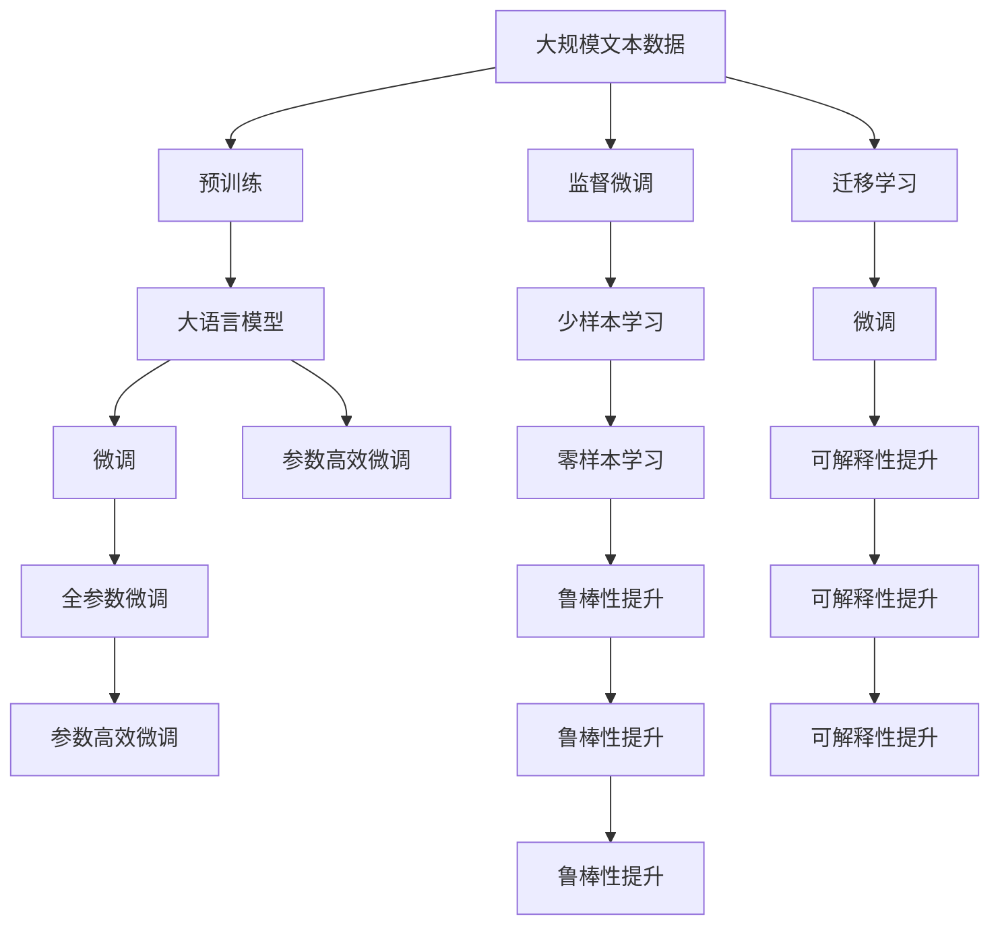

                 

## 1. 背景介绍

### 1.1 问题由来
近年来，深度学习技术在自然语言处理(NLP)领域的广泛应用，尤其是基于预训练的大语言模型，在NLP任务上取得了显著的进步。然而，随着预训练模型规模的不断扩大和任务多样性的增加，大语言模型微调工程在实际应用中也面临着诸多挑战。这些挑战不仅影响模型的性能和稳定性，还限制了其在更多场景下的应用推广。

### 1.2 问题核心关键点
本文聚焦于基于监督学习的大语言模型微调，特别是在模型规模、参数优化、数据标注、鲁棒性提升、性能可解释性等方面的难点和挑战。这些挑战对模型在不同场景下的应用，尤其是在资源有限、数据复杂和任务特定的环境，显得尤为重要。

### 1.3 问题研究意义
深入理解这些难点和挑战，不仅有助于提升模型的性能，还为开发者提供了实践中的注意事项和解决方案，有助于推动大语言模型在更多领域的广泛应用。

## 2. 核心概念与联系

### 2.1 核心概念概述

#### 2.1.1 大语言模型(Large Language Model, LLM)
大语言模型通常指采用深度学习技术，基于大规模语料库进行预训练，能够处理自然语言输入输出任务的模型，如BERT、GPT等。

#### 2.1.2 预训练(Pre-training)
预训练是指在大规模无标签数据上进行自监督学习任务，使模型学习通用的语言表示。常见的预训练任务包括语言模型预测、掩码语言模型预测等。

#### 2.1.3 微调(Fine-tuning)
微调是指在大规模无标签数据上进行预训练之后，使用特定任务的标注数据集对模型进行有监督学习优化，以适应特定任务的性能。

#### 2.1.4 迁移学习(Transfer Learning)
迁移学习是将一个领域学习到的知识，迁移到另一个领域的过程。大语言模型的预训练-微调过程是一种典型的迁移学习方式。

#### 2.1.5 参数高效微调(Parameter-Efficient Fine-Tuning, PEFT)
参数高效微调指在微调过程中，只更新部分模型参数，保留大部分预训练权重，以提高微调效率和模型的泛化能力。

#### 2.1.6 鲁棒性(Robustness)
鲁棒性指的是模型在面对数据分布变化、对抗攻击等情况下，保持稳定性能的能力。

#### 2.1.7 可解释性(Interpretability)
可解释性指的是模型决策过程的透明性，能够解释模型为什么做出特定决策，这对于需要高信任度的应用领域尤为重要。

这些核心概念在模型训练和应用过程中密切相关，共同构成大语言模型的完整训练生态系统。理解这些概念对于设计高效的微调方法至关重要。

### 2.2 概念间的关系

#### 2.2.1 大语言模型的学习范式



这个流程图展示了从预训练到大语言模型微调的整体过程，以及微调过程中的一些关键技术和方法。预训练后的大语言模型通过微调适应特定任务，参数高效微调、少样本学习、零样本学习和鲁棒性提升等技术进一步优化模型的性能和应用效果。迁移学习则确保了模型在大规模数据上的泛化能力。可解释性提升使得模型的决策过程透明化，增强了用户的信任度。

#### 2.2.2 微调与鲁棒性的关系

```mermaid
graph TB
    A[微调数据] --> B[微调]
    B --> C[鲁棒性提升]
    A --> D[鲁棒性提升]
    C --> E[鲁棒性提升]
    D --> E
    E --> F[鲁棒性提升]
    F --> G[鲁棒性提升]
    G --> H[鲁棒性提升]
    H --> I[鲁棒性提升]
    I --> J[鲁棒性提升]
    J --> K[鲁棒性提升]
    K --> L[鲁棒性提升]
    L --> M[鲁棒性提升]
    M --> N[鲁棒性提升]
    N --> O[鲁棒性提升]
    O --> P[鲁棒性提升]
    P --> Q[鲁棒性提升]
    Q --> R[鲁棒性提升]
    R --> S[鲁棒性提升]
    S --> T[鲁棒性提升]
    T --> U[鲁棒性提升]
    U --> V[鲁棒性提升]
    V --> W[鲁棒性提升]
    W --> X[鲁棒性提升]
    X --> Y[鲁棒性提升]
    Y --> Z[鲁棒性提升]
    Z --> AA[鲁棒性提升]
    AA --> AB[鲁棒性提升]
    AB --> AC[鲁棒性提升]
    AC --> AD[鲁棒性提升]
    AD --> AE[鲁棒性提升]
    AE --> AF[鲁棒性提升]
    AF --> AG[鲁棒性提升]
    AG --> AH[鲁棒性提升]
    AH --> AI[鲁棒性提升]
    AI --> AJ[鲁棒性提升]
    AJ --> AK[鲁棒性提升]
    AK --> AL[鲁棒性提升]
    AL --> AM[鲁棒性提升]
    AM --> AN[鲁棒性提升]
    AN --> AO[鲁棒性提升]
    AO --> AP[鲁棒性提升]
    AP --> AQ[鲁棒性提升]
    AQ --> AR[鲁棒性提升]
    AR --> AS[鲁棒性提升]
    AS --> AT[鲁棒性提升]
    AT --> AU[鲁棒性提升]
    AU --> AV[鲁棒性提升]
    AV --> AW[鲁棒性提升]
    AW --> AX[鲁棒性提升]
    AX --> AY[鲁棒性提升]
    AY --> AZ[鲁棒性提升]
    AZ --> BA[鲁棒性提升]
    BA --> BB[鲁棒性提升]
    BB --> BC[鲁棒性提升]
    BC --> BD[鲁棒性提升]
    BD --> BE[鲁棒性提升]
    BE --> BF[鲁棒性提升]
    BF --> BG[鲁棒性提升]
    BG --> BH[鲁棒性提升]
    BH --> BI[鲁棒性提升]
    BI --> BJ[鲁棒性提升]
    BJ --> BK[鲁棒性提升]
    BK --> BL[鲁棒性提升]
    BL --> BM[鲁棒性提升]
    BM --> BN[鲁棒性提升]
    BN --> BO[鲁棒性提升]
    BO --> BP[鲁棒性提升]
    BP --> BQ[鲁棒性提升]
    BQ --> BR[鲁棒性提升]
    BR --> BS[鲁棒性提升]
    BS --> BT[鲁棒性提升]
    BT --> BU[鲁棒性提升]
    BU --> BV[鲁棒性提升]
    BV --> BW[鲁棒性提升]
    BW --> BX[鲁棒性提升]
    BX --> BY[鲁棒性提升]
    BY --> BZ[鲁棒性提升]
    BZ --> CA[鲁棒性提升]
    CA --> CB[鲁棒性提升]
    CB --> CC[鲁棒性提升]
    CC --> CD[鲁棒性提升]
    CD --> CE[鲁棒性提升]
    CE --> CF[鲁棒性提升]
    CF --> CG[鲁棒性提升]
    CG --> CH[鲁棒性提升]
    CH --> CI[鲁棒性提升]
    CI --> CJ[鲁棒性提升]
    CJ --> CK[鲁棒性提升]
    CK --> CL[鲁棒性提升]
    CL --> CM[鲁棒性提升]
    CM --> CN[鲁棒性提升]
    CN --> CO[鲁棒性提升]
    CO --> CP[鲁棒性提升]
    CP --> CQ[鲁棒性提升]
    CQ --> CR[鲁棒性提升]
    CR --> CS[鲁棒性提升]
    CS --> CT[鲁棒性提升]
    CT --> CU[鲁棒性提升]
    CU --> CV[鲁棒性提升]
    CV --> CW[鲁棒性提升]
    CW --> CX[鲁棒性提升]
    CX --> CY[鲁棒性提升]
    CY --> CZ[鲁棒性提升]
    CZ --> DA[鲁棒性提升]
    DA --> DB[鲁棒性提升]
    DB --> DC[鲁棒性提升]
    DC --> DD[鲁棒性提升]
    DD --> DE[鲁棒性提升]
    DE --> DF[鲁棒性提升]
    DF --> DG[鲁棒性提升]
    DG --> DH[鲁棒性提升]
    DH --> DI[鲁棒性提升]
    DI --> DJ[鲁棒性提升]
    DJ --> DK[鲁棒性提升]
    DK --> DL[鲁棒性提升]
    DL --> DM[鲁棒性提升]
    DM --> DN[鲁棒性提升]
    DN --> DO[鲁棒性提升]
    DO --> DP[鲁棒性提升]
    DP --> DQ[鲁棒性提升]
    DQ --> DR[鲁棒性提升]
    DR --> DS[鲁棒性提升]
    DS --> DT[鲁棒性提升]
    DT --> DU[鲁棒性提升]
    DU --> DV[鲁棒性提升]
    DV --> DW[鲁棒性提升]
    DW --> DX[鲁棒性提升]
    DX --> DY[鲁棒性提升]
    DY --> DZ[鲁棒性提升]
    DZ --> EA[鲁棒性提升]
    EA --> EB[鲁棒性提升]
    EB --> EC[鲁棒性提升]
    EC --> ED[鲁棒性提升]
    ED --> EE[鲁棒性提升]
    EE --> EF[鲁棒性提升]
    EF --> EG[鲁棒性提升]
    EG --> EH[鲁棒性提升]
    EH --> EI[鲁棒性提升]
    EI --> EJ[鲁棒性提升]
    EJ --> EK[鲁棒性提升]
    EK --> EL[鲁棒性提升]
    EL --> EM[鲁棒性提升]
    EM --> EN[鲁棒性提升]
    EN --> EO[鲁棒性提升]
    EO --> EP[鲁棒性提升]
    EP --> EQ[鲁棒性提升]
    EQ --> ER[鲁棒性提升]
    ER --> ES[鲁棒性提升]
    ES --> ET[鲁棒性提升]
    ET --> EU[鲁棒性提升]
    EU --> EV[鲁棒性提升]
    EV --> EW[鲁棒性提升]
    EW --> EX[鲁棒性提升]
    EX --> EY[鲁棒性提升]
    EY --> EZ[鲁棒性提升]
    EZ --> FA[鲁棒性提升]
    FA --> FB[鲁棒性提升]
    FB --> FC[鲁棒性提升]
    FC --> FD[鲁棒性提升]
    FD --> FE[鲁棒性提升]
    FE --> FF[鲁棒性提升]
    FF --> FG[鲁棒性提升]
    FG --> FH[鲁棒性提升]
    FH --> FI[鲁棒性提升]
    FI --> FJ[鲁棒性提升]
    FJ --> FK[鲁棒性提升]
    FK --> FL[鲁棒性提升]
    FL --> FM[鲁棒性提升]
    FM --> FN[鲁棒性提升]
    FN --> FO[鲁棒性提升]
    FO --> FP[鲁棒性提升]
    FP --> FQ[鲁棒性提升]
    FQ --> FR[鲁棒性提升]
    FR --> FS[鲁棒性提升]
    FS --> FT[鲁棒性提升]
    FT --> FU[鲁棒性提升]
    FU --> FV[鲁棒性提升]
    FV --> FW[鲁棒性提升]
    FW --> FX[鲁棒性提升]
    FX --> FY[鲁棒性提升]
    FY --> FZ[鲁棒性提升]
    FZ --> GA[鲁棒性提升]
    GA --> GB[鲁棒性提升]
    GB --> GC[鲁棒性提升]
    GC --> GD[鲁棒性提升]
    GD --> GE[鲁棒性提升]
    GE --> GF[鲁棒性提升]
    GF --> GG[鲁棒性提升]
    GG --> GH[鲁棒性提升]
    GH --> GI[鲁棒性提升]
    GI --> GJ[鲁棒性提升]
    GJ --> GK[鲁棒性提升]
    GK --> GL[鲁棒性提升]
    GL --> GM[鲁棒性提升]
    GM --> GN[鲁棒性提升]
    GN --> GO[鲁棒性提升]
    GO --> GP[鲁棒性提升]
    GP --> GQ[鲁棒性提升]
    GQ --> GR[鲁棒性提升]
    GR --> GS[鲁棒性提升]
    GS --> GT[鲁棒性提升]
    GT --> GU[鲁棒性提升]
    GU --> GV[鲁棒性提升]
    GV --> GW[鲁棒性提升]
    GW --> GX[鲁棒性提升]
    GX --> GY[鲁棒性提升]
    GY --> GZ[鲁棒性提升]
    GZ --> HA[鲁棒性提升]
    HA --> HB[鲁棒性提升]
    HB --> HC[鲁棒性提升]
    HC --> HD[鲁棒性提升]
    HD --> HE[鲁棒性提升]
    HE --> HF[鲁棒性提升]
    HF --> HG[鲁棒性提升]
    HG --> HH[鲁棒性提升]
    HH --> HI[鲁棒性提升]
    HI --> HJ[鲁棒性提升]
    HJ --> HK[鲁棒性提升]
    HK --> HL[鲁棒性提升]
    HL --> HM[鲁棒性提升]
    HM --> HN[鲁棒性提升]
    HN --> HO[鲁棒性提升]
    HO --> HP[鲁棒性提升]
    HP --> HQ[鲁棒性提升]
    HQ --> HR[鲁棒性提升]
    HR --> HS[鲁棒性提升]
    HS --> HT[鲁棒性提升]
    HT --> HU[鲁棒性提升]
    HU --> HV[鲁棒性提升]
    HV --> HW[鲁棒性提升]
    HW --> HX[鲁棒性提升]
    HX --> HY[鲁棒性提升]
    HY --> HZ[鲁棒性提升]
    HZ --> IA[鲁棒性提升]
    IA --> IB[鲁棒性提升]
    IB --> IC[鲁棒性提升]
    IC --> ID[鲁棒性提升]
    ID --> IE[鲁棒性提升]
    IE --> IF[鲁棒性提升]
    IF --> IG[鲁棒性提升]
    IG --> IH[鲁棒性提升]
    IH --> II[鲁棒性提升]
    II --> IJ[鲁棒性提升]
    IJ --> IK[鲁棒性提升]
    IK --> IL[鲁棒性提升]
    IL --> IM[鲁棒性提升]
    IM --> IN[鲁棒性提升]
    IN --> IO[鲁棒性提升]
    IO --> IP[鲁棒性提升]
    IP --> IQ[鲁棒性提升]
    IQ --> IR[鲁棒性提升]
    IR --> IS[鲁棒性提升]
    IS --> IT[鲁棒性提升]
    IT --> IU[鲁棒性提升]
    IU --> IV[鲁棒性提升]
    IV --> IW[鲁棒性提升]
    IW --> IX[鲁棒性提升]
    IX --> IY[鲁棒性提升]
    IY --> IZ[鲁棒性提升]
    IZ --> JA[鲁棒性提升]
    JA --> JB[鲁棒性提升]
    JB --> JC[鲁棒性提升]
    JC --> JD[鲁棒性提升]
    JD --> JE[鲁棒性提升]
    JE --> JF[鲁棒性提升]
    JF --> JG[鲁棒性提升]
    JG --> JH[鲁棒性提升]
    JH --> JI[鲁棒性提升]
    JI --> JJ[鲁棒性提升]
    JJ --> JK[鲁棒性提升]
    JK --> JL[鲁棒性提升]
    JL --> JM[鲁棒性提升]
    JM --> JN[鲁棒性提升]
    JN --> JO[鲁棒性提升]
    JO --> JP[鲁棒性提升]
    JP --> JQ[鲁棒性提升]
    JQ --> JR[鲁棒性提升]
    JR --> JS[鲁棒性提升]
    JS --> JT[鲁棒性提升]
    JT --> JU[鲁棒性提升]
    JU --> JV[鲁棒性提升]
    JV --> JW[鲁棒性提升]
    JW --> JX[鲁棒性提升]
    JX --> JY[鲁棒性提升]
    JY --> JZ[鲁棒性提升]
    JZ --> KA[鲁棒性提升]
    KA --> KB[鲁棒性提升]
    KB --> KC[鲁棒性提升]
    KC --> KD[鲁棒性提升]
    KD --> KE[鲁棒性提升]
    KE --> KF[鲁棒性提升]
    KF --> KG[鲁棒性提升]
    KG --> KH[鲁棒性提升]
    KH --> KI[鲁棒性提升]
    KI --> KJ[鲁棒性提升]
    KJ --> KK[鲁棒性提升]
    KK --> KL[鲁棒性提升]
    KL --> KM[鲁棒性提升]
    KM --> KN[鲁棒性提升]
    KN --> KO[鲁棒性提升]
    KO --> KP[鲁棒性提升]
    KP --> KQ[鲁棒性提升]
    KQ --> KR[鲁棒性提升]
    KR --> KS[鲁棒性提升]
    KS --> KT[鲁棒性提升]
    KT --> KU[鲁棒性提升]
    KU --> KV[鲁棒性提升]
    KV --> KW[鲁棒性提升]
    KW --> KX[鲁棒性提升]
    KX --> KY[鲁棒性提升]
    KY --> KZ[鲁棒性提升]
    KZ --> LA[鲁棒性提升]
    LA --> LB[鲁棒性提升]
    LB --> LC[鲁棒性提升]
    LC --> LD[鲁棒性提升]
    LD --> LE[鲁棒性提升]
    LE --> LF[鲁棒性提升]
    LF --> LG[鲁棒性提升]
    LG --> LH[鲁棒性提升]
    LH --> LI[鲁棒性提升]
    LI --> LJ[鲁棒性提升]
    LJ --> LK[鲁棒性提升]
    LK --> LL[鲁棒性提升]
    LL --> LM[鲁棒性提升]
    LM --> LN[鲁棒性提升]
    LN --> LO[鲁棒性提升]
    LO --> LP[鲁棒性提升]
    LP --> LQ[鲁棒性提升]
    LQ --> LR[鲁棒性提升]
    LR --> LS[鲁棒性提升]
    LS --> LT[鲁棒性提升]
    LT --> LU[鲁棒性提升]
    LU --> LV[鲁棒性提升]
    LV --> LW[鲁棒性提升]
    LW --> LX[鲁棒性提升]
    LX --> LY[鲁棒性提升]
    LY --> LZ[鲁棒性提升]
    LZ --> MA[鲁棒性提升]
    MA --> MB[鲁棒性提升]
    MB --> MC[鲁棒性提升]
    MC --> MD[鲁棒性提升]
    MD --> ME[鲁棒性提升]
    ME --> MF[鲁棒性提升]
    MF --> MG[鲁棒性提升]
    MG --> MH[鲁棒性提升]
    MH --> MI[鲁棒性提升]
    MI --> MJ[鲁棒性提升]
    MJ --> MK[鲁棒性提升]
    MK --> ML[鲁棒性提升]
    ML --> MM[鲁棒性提升]
    MM --> MN[鲁棒性提升]
    MN --> MO[鲁棒性提升]
    MO --> MP[鲁棒性提升]
    MP --> MQ[鲁棒性提升]
    MQ --> MR[鲁棒性提升]
    MR --> MS[鲁棒性提升]
    MS --> MT[鲁棒性提升]
    MT --> MU[鲁棒性提升]
    MU --> MV[鲁棒性提升]
    MV --> MW[鲁棒性提升]
    MW --> MX[鲁棒性提升]
    MX --> MY[鲁棒性提升]
    MY --> MZ[鲁棒性提升]
    MZ --> NA[鲁棒性提升]
    NA --> NB[鲁棒性提升]
    NB --> NC[鲁棒性提升]
    NC --> ND[鲁棒性提升]
    ND --> NE[鲁棒性提升]
    NE --> NF[鲁棒性提升]
    NF --> NG[鲁棒性提升]
    NG --> NH[鲁棒性提升]
    NH --> NI[鲁棒性提升]
    NI --> NJ[鲁棒性提升]
    NJ --> NK[鲁棒性提升]
    NK --> NL[鲁棒性提升]
    NL --> NM[鲁棒性提升]
    NM --> NN[鲁棒性提升]
    NN --> NO[鲁棒性提升]
    NO --> NP[鲁棒性提升]
    NP --> NQ[鲁棒性提升]
    NQ --> NR[鲁棒性提升]
    NR --> NS[鲁棒性提升]
    NS --> NT[鲁棒性提升]
    NT --> NU[鲁棒性提升]
    NU --> NV[鲁棒性提升]
    NV --> NW[鲁棒性提升]
    NW --> NX[鲁棒性提升]
    NX --> NY[鲁棒性提升]
    NY --> NZ[鲁棒性提升]
    NZ --> OA[鲁棒性提升]
    OA --> OB[鲁棒性提升]
    OB --> OC[鲁棒性提升]
    OC --> OD[鲁棒性提升]
    OD --> OE[鲁棒性提升]
    OE --> OF[鲁棒性提升]
    OF --> OG[鲁棒性提升]
    OG --> OH[鲁棒性提升]
    OH --> OI[鲁棒性提升]
    OI --> OJ[鲁棒性提升]
    OJ --> OK[鲁棒性提升]
    OK --> OL[鲁棒性提升]
    OL --> OM[鲁棒性提升]
    OM --> ON[鲁棒性提升]
    ON --> OO[鲁棒性提升]
    OO --> OP[鲁棒性提升]
    OP --> OQ[鲁棒性提升]
    OQ --> OR[鲁棒性提升]
    OR --> OS[鲁棒性提升]
    OS --> OT[鲁棒性提升]
    OT --> OU[鲁棒性提升]
    OU --> OV[鲁棒性提升]
    OV --> OW[鲁棒性提升]
    OW --> OX[鲁棒性提升]
    OX --> OY[鲁棒性提升]
    OY --> OZ[鲁棒性提升]
    OZ --> PA[鲁棒性提升]
    PA --> PB[鲁棒性提升]
    PB --> PC[鲁棒性提升]
    PC --> PD[鲁棒性提升]
    PD --> PE[鲁棒性提升]
    PE --> PF[鲁棒性提升]
    PF --> PG[鲁棒性提升]
    PG --> PH[鲁棒性提升]
    PH --> PI[鲁棒性提升]
    PI --> PJ[鲁棒性提升]
    PJ --> PK[鲁棒性提升]
    PK --> PL[鲁棒性提升]
    PL --> PM[鲁棒性提升]
    PM --> PN[鲁棒性提升]
    PN --> PO[鲁棒性提升]
    PO --> PP[鲁棒性提升]
    PP --> PQ[鲁棒性提升]
    PQ --> PR[鲁棒性提升]
    PR --> PS[鲁棒性提升]
    PS --> PT[鲁棒性提升]
    PT --> PU[鲁棒性提升]
    PU --> PV[鲁棒性提升]
    PV --> PW[鲁棒性提升]
    PW --> PX[鲁棒性提升]
    PX --> PY[鲁棒性提升]
    PY --> PZ[鲁棒性提升]
    PZ --> QA[鲁棒性提升]
    QA --> QB[鲁棒性提升]
    QB --> QC[鲁棒性提升]
    QC --> QD[鲁棒性提升]
    QD --> QE[鲁棒性提升]
    QE --> QF[鲁棒性提升]
    QF --> QG[鲁棒性提升]
    QG --> QH[鲁棒性提升]
    QH --> QI[鲁棒性提升]
    QI --> QJ[鲁棒性提升]
    QJ --> QK[鲁棒性提升]
    QK --> QL[鲁棒性提升]
    QL --> QM[鲁棒性提升]
    QM --> QN[鲁棒性提升]
    QN --> QO[鲁棒性提升]
    QO --> QP[鲁棒性提升]
    QP --> QQ[鲁棒性提升]
    QQ --> QR[鲁棒性提升]
    QR --> QS[鲁棒性提升]
    QS --> QT[鲁棒性提升]
    QT --> QU[鲁棒性提升]
    QU --> QV[鲁棒性提升]
    QV --> QW[鲁棒性提升]
    QW --> QX[鲁棒性提升]
    QX --> QY[鲁棒性提升]
    QY --> QZ[鲁棒

