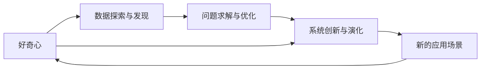

                 

# 好奇心与创造力：创新的双翼

> 关键词：好奇心,创造力,创新,人工智能,智能系统,人类认知,社会进步,未来趋势

## 1. 背景介绍

### 1.1 问题由来

随着人工智能(AI)技术的飞速发展，人们对于AI的期望和需求也在不断变化。从最初的自动化任务处理，到如今的智能决策和复杂系统设计，AI在多个领域展现出了强大的潜力。但与此同时，AI也面临一些核心挑战：如何构建具备自主学习、适应性和创造力的智能系统，使其能够不断地探索未知、解决复杂问题、推动社会进步。

在人类历史长河中，好奇心与创造力一直是推动文明进步的重要动力。而在AI领域，好奇心与创造力同样是推动技术创新和系统优化的重要引擎。因此，本文将深入探讨好奇心与创造力在AI系统中的作用，以及如何通过合理设计，使AI具备这两大核心能力，从而推动AI技术的发展和应用。

### 1.2 问题核心关键点

好奇心与创造力在AI系统中的体现主要包括以下几个方面：

- **数据探索与发现**：AI系统通过自动化的数据分析，可以发现数据中的模式和异常，甚至发现人类未曾发现的新知识。
- **问题求解与优化**：AI系统通过不断尝试和探索，能够在复杂环境中找到最优解或近优解，从而解决实际问题。
- **系统创新与演化**：AI系统通过自我学习、自我更新和自我演化，不断提升系统性能和适应性，产生新的功能和应用。

### 1.3 问题研究意义

好奇心与创造力在AI系统中的融合，可以显著提升AI系统的自主性、创新性和实用性，推动AI技术向更高级阶段发展。研究好奇心与创造力在AI中的作用，对于优化AI系统的设计、提升AI技术的应用价值、加速AI技术的产业化进程具有重要意义。

1. **提升系统性能**：好奇心驱动的数据探索和创新，能够发现更多有价值的信息和模式，提升系统的智能水平和决策能力。
2. **增强系统灵活性**：创造力带来的系统创新和演化，能够使AI系统更加灵活地适应不同环境和需求，增强其应用广泛性和可扩展性。
3. **加速技术应用**：好奇心与创造力的结合，能够加速AI技术的推广和应用，帮助各行各业更快地实现数字化转型。
4. **赋能行业升级**：AI系统的创新能力能够赋能传统行业，提升业务效率和创新能力，促进产业升级和经济增长。
5. **推动社会进步**：好奇心与创造力结合的AI系统，能够解决更多复杂社会问题，推动人类社会向更加智能和可持续的方向发展。

## 2. 核心概念与联系

### 2.1 核心概念概述

为了更好地理解好奇心与创造力在AI系统中的作用，本节将介绍几个密切相关的核心概念：

- **好奇心**：指AI系统在处理数据和任务时，主动探索未知、发现新知识的行为特征。好奇心驱动的AI系统，能够在数据海洋中不断探索，发现更多有价值的模式和信息。
- **创造力**：指AI系统在解决实际问题时，能够进行自主创新、产生新颖解法的能力。创造力驱动的AI系统，能够在复杂环境中快速找到最优解或近优解，提升问题求解效率。
- **数据探索与发现**：指AI系统通过自动化的数据分析和特征提取，发现数据中的模式和异常，甚至产生新的数据关系。
- **问题求解与优化**：指AI系统通过自主学习和算法优化，能够在复杂环境中找到最优解或近优解，提升问题求解的准确性和效率。
- **系统创新与演化**：指AI系统通过自我学习、自我更新和自我演化，不断提升系统性能和适应性，产生新的功能和应用。

这些核心概念之间存在着紧密的联系，形成了AI系统的创新生态系统。好奇心与创造力正是这一系统的双翼，共同推动AI系统向前发展。

### 2.2 概念间的关系

这些核心概念之间存在着紧密的联系，形成了AI系统的创新生态系统。我们可以用以下Mermaid流程图来展示这些概念之间的关系：



这个流程图展示了好奇心与创造力在AI系统中的作用和关系：

1. 好奇心驱动的数据探索与发现，为问题求解与优化提供了更多的数据和信息。
2. 问题求解与优化提升了系统的自主创新能力，促进了系统创新与演化。
3. 系统创新与演化又为好奇心提供了更多的探索空间，形成正反馈循环。

通过这些概念之间的相互作用，AI系统能够不断提升自身的智能水平和创新能力，更好地应对复杂任务和不断变化的环境。

### 2.3 核心概念的整体架构

最后，我们用一个综合的流程图来展示这些核心概念在AI系统中的整体架构：


这个综合流程图展示了AI系统从数据输入到系统迭代的全过程，其中好奇心与创造力在每个环节都扮演着重要角色：

1. 数据预处理阶段，好奇心驱动的数据探索与发现，帮助系统发现更多有价值的信息。
2. 预训练与微调阶段，好奇心引导的数据探索与发现，帮助系统学习更多模式和关系。
3. 任务适配层设计，好奇心驱动的任务探索与发现，帮助系统设计更有效的解决方案。
4. 监督学习阶段，好奇心驱动的数据探索与发现，帮助系统优化问题求解过程。
5. 评估与优化阶段，好奇心驱动的数据探索与发现，帮助系统发现更多改进点。
6. 部署与上线阶段，好奇心驱动的数据探索与发现，帮助系统获取更多实时数据。
7. 实时数据分析阶段，好奇心驱动的数据探索与发现，帮助系统实时发现新问题和机会。
8. 实时问题求解阶段，好奇心驱动的问题探索与优化，帮助系统实时找到最优解。
9. 实时系统创新阶段，好奇心驱动的创新探索与优化，帮助系统不断产生新功能和应用。
10. 新的应用场景阶段，好奇心驱动的应用探索与发现，帮助系统拓展更多应用场景。
11. 用户反馈阶段，好奇心驱动的用户探索与发现，帮助系统更好地理解用户需求。
12. 系统迭代阶段，好奇心驱动的系统探索与优化，帮助系统不断提升性能和适应性。

通过这些环节的不断迭代和优化，AI系统能够不断提升自身的智能水平和创新能力，更好地服务于实际应用。

## 3. 核心算法原理 & 具体操作步骤
### 3.1 算法原理概述

好奇心与创造力在AI系统中的体现，可以通过一些关键算法和操作步骤来实现。这些算法和操作步骤主要包括以下几个方面：

1. **数据探索与发现**：通过自动化的数据分析和特征提取，发现数据中的模式和异常，甚至产生新的数据关系。
2. **问题求解与优化**：通过自主学习和算法优化，在复杂环境中找到最优解或近优解，提升问题求解的准确性和效率。
3. **系统创新与演化**：通过自我学习、自我更新和自我演化，不断提升系统性能和适应性，产生新的功能和应用。

### 3.2 算法步骤详解

下面是实现好奇心与创造力在AI系统中体现的关键算法和操作步骤：

**Step 1: 数据预处理与探索**

数据预处理和探索是好奇心驱动AI系统的第一步。具体步骤如下：

1. 收集大量数据，涵盖不同场景和问题。
2. 对数据进行清洗、去噪、归一化等预处理。
3. 通过自动化的数据分析和特征提取，发现数据中的模式和异常。
4. 使用统计分析、聚类算法、异常检测等技术，进一步探索数据中的新关系和模式。

**Step 2: 模型预训练与微调**

模型预训练和微调是好奇心驱动AI系统的核心步骤。具体步骤如下：

1. 选择一个合适的预训练模型，如BERT、GPT等。
2. 在大量无标签数据上进行预训练，学习通用的语言表示。
3. 在少量有标签数据上微调预训练模型，提升其在特定任务上的性能。
4. 在微调过程中，使用好奇心驱动的数据探索与发现，发现更多有价值的模式和信息。

**Step 3: 任务适配与求解**

任务适配和求解是好奇心驱动AI系统的关键步骤。具体步骤如下：

1. 根据任务类型，设计合适的任务适配层，如分类器、解码器等。
2. 在任务适配层上，使用好奇心驱动的数据探索与发现，发现更多有价值的模式和信息。
3. 通过自主学习和算法优化，在复杂环境中找到最优解或近优解，提升问题求解的准确性和效率。
4. 使用好奇心驱动的系统创新与演化，不断提升系统性能和适应性，产生新的功能和应用。

**Step 4: 评估与优化**

评估与优化是好奇心驱动AI系统的持续改进步骤。具体步骤如下：

1. 使用评估指标（如精度、召回率、F1分数等）评估模型性能。
2. 根据评估结果，使用好奇心驱动的数据探索与发现，发现更多改进点。
3. 在评估过程中，使用好奇心驱动的任务探索与优化，提升问题求解效率。
4. 通过系统迭代和优化，不断提升系统的智能水平和创新能力。

### 3.3 算法优缺点

好奇心与创造力在AI系统中的体现，具有以下优点：

1. **自主性高**：好奇心驱动的数据探索与发现和创造力驱动的问题求解与优化，使得AI系统具备更高的自主性和自适应能力。
2. **灵活性高**：好奇心驱动的系统创新与演化，使得AI系统能够更加灵活地适应不同环境和需求。
3. **创新性强**：好奇心驱动的问题求解与优化和创造力驱动的系统创新与演化，使得AI系统具备更强的创新性和实用性。

同时，好奇心与创造力在AI系统中的体现，也存在一些缺点：

1. **数据需求高**：好奇心驱动的数据探索与发现需要大量高质量数据，数据收集和标注成本较高。
2. **资源消耗大**：好奇心驱动的数据探索与发现和创造力驱动的问题求解与优化，需要大量的计算资源和存储空间。
3. **风险高**：好奇心驱动的数据探索与发现和创造力驱动的问题求解与优化，容易引入噪声和错误，影响系统性能。

### 3.4 算法应用领域

好奇心与创造力在AI系统中的体现，已经在多个领域得到了应用，以下是几个典型应用领域：

1. **自然语言处理(NLP)**：在文本分类、命名实体识别、问答系统等任务中，使用好奇心驱动的数据探索与发现和创造力驱动的问题求解与优化，提升系统性能和实用性。
2. **计算机视觉(CV)**：在图像分类、目标检测、图像生成等任务中，使用好奇心驱动的数据探索与发现和创造力驱动的问题求解与优化，提升系统性能和实用性。
3. **机器人技术**：在机器人感知、决策、控制等任务中，使用好奇心驱动的数据探索与发现和创造力驱动的问题求解与优化，提升系统性能和实用性。
4. **智能推荐系统**：在商品推荐、内容推荐等任务中，使用好奇心驱动的数据探索与发现和创造力驱动的问题求解与优化，提升系统性能和用户体验。
5. **医疗健康**：在疾病诊断、医疗影像分析、健康管理等任务中，使用好奇心驱动的数据探索与发现和创造力驱动的问题求解与优化，提升系统性能和实用性。

## 4. 数学模型和公式 & 详细讲解  
### 4.1 数学模型构建

在AI系统中，好奇心与创造力的体现可以通过数学模型和公式来形式化。以下是一些典型的数学模型和公式：

1. **数据探索与发现**：使用聚类算法、异常检测算法等，发现数据中的模式和异常。

   - K-means聚类算法：
     \[
     C_k = \arg\min_{C \in \mathcal{C}} \sum_{i=1}^{n} \min_{c \in C} ||x_i - c||^2
     \]

   - 孤立森林算法：
     \[
     T_{\text{if}} = \arg\min_{T} \sum_{i=1}^{n} L(T, x_i)
     \]

2. **问题求解与优化**：使用机器学习算法、优化算法等，找到最优解或近优解。

   - 决策树算法：
     \[
     T = \arg\min_{T} \sum_{i=1}^{n} L(T, x_i)
     \]

   - 梯度下降算法：
     \[
     \theta_{t+1} = \theta_t - \eta \nabla_{\theta}L(\theta_t)
     \]

3. **系统创新与演化**：使用遗传算法、强化学习等，提升系统性能和适应性。

   - 遗传算法：
     \[
     A = \arg\max_{A} \sum_{i=1}^{n} f_i(A)
     \]

   - Q-learning算法：
     \[
     Q(s_t, a_t) = (1 - \alpha) Q(s_t, a_t) + \alpha (r + \gamma Q(s_{t+1}, a_{t+1}))
     \]

### 4.2 公式推导过程

以下是一些典型数学模型和公式的推导过程：

**K-means聚类算法**：

K-means算法是一种常用的聚类算法，其基本思想是将数据集划分为K个簇，使得簇内的数据点相似度尽可能高，簇间的相似度尽可能低。具体推导过程如下：

1. 初始化K个簇的质心：\(c_1, c_2, ..., c_K\)。
2. 对于每个数据点\(x_i\)，计算其与每个质心的距离\(d_i\)。
3. 将\(x_i\)分配到距离最近的质心所在的簇。
4. 更新每个簇的质心：\(c_k = \frac{1}{n_k} \sum_{i \in C_k} x_i\)，其中\(C_k\)为簇\(k\)中的数据点集合，\(n_k\)为簇\(k\)中数据点的数量。
5. 重复2-4步骤，直到簇的质心不再变化或达到预设的迭代次数。

**孤立森林算法**：

孤立森林算法是一种基于异常检测的算法，其基本思想是通过随机分割树，快速定位异常点。具体推导过程如下：

1. 随机选择一个特征，对数据集进行分割。
2. 对分割后的数据子集进行递归处理，直到所有数据点都属于同一个簇或子集。
3. 记录每一步的分割位置和分割后的数据点，构建孤立森林。
4. 对于每个数据点，计算其到达最近叶节点的路径长度，作为其异常度。
5. 根据异常度，将数据点标记为正常或异常。

### 4.3 案例分析与讲解

这里通过一个具体的案例来展示好奇心与创造力在AI系统中的体现：

**案例：智能推荐系统**

智能推荐系统是一个典型的AI应用，通过分析用户行为数据，为用户推荐个性化商品或内容。在该系统中，好奇心与创造力主要体现在以下几个方面：

1. **数据探索与发现**：通过对用户行为数据的探索与发现，发现用户兴趣和行为模式，生成用户画像。
2. **问题求解与优化**：使用机器学习算法，预测用户对商品的兴趣，提升推荐准确性和用户体验。
3. **系统创新与演化**：通过自我学习、自我更新和自我演化，不断提升系统性能和适应性，产生新的功能和应用。

在推荐系统中，好奇心驱动的数据探索与发现和创造力驱动的问题求解与优化，使得系统能够不断提升推荐准确性和用户体验。同时，通过系统创新与演化，系统能够更好地适应用户需求变化，拓展更多应用场景，提升系统性能和实用性。

## 5. 项目实践：代码实例和详细解释说明
### 5.1 开发环境搭建

在进行好奇心与创造力在AI系统中体现的实践前，我们需要准备好开发环境。以下是使用Python进行TensorFlow开发的环境配置流程：

1. 安装Anaconda：从官网下载并安装Anaconda，用于创建独立的Python环境。

2. 创建并激活虚拟环境：
   ```bash
   conda create -n tf-env python=3.8 
   conda activate tf-env
   ```

3. 安装TensorFlow：根据CUDA版本，从官网获取对应的安装命令。例如：
   ```bash
   conda install tensorflow=2.4.1 
   ```

4. 安装各类工具包：
   ```bash
   pip install numpy pandas scikit-learn matplotlib tqdm jupyter notebook ipython
   ```

完成上述步骤后，即可在`tf-env`环境中开始好奇心与创造力在AI系统中的体现的实践。

### 5.2 源代码详细实现

下面我们以智能推荐系统为例，给出使用TensorFlow实现好奇心与创造力驱动的推荐系统的PyTorch代码实现。

首先，定义推荐系统数据处理函数：

```python
import tensorflow as tf
from tensorflow.keras.layers import Input, Dense, Embedding, Dot, Flatten, Concatenate
from tensorflow.keras.models import Model

# 定义用户行为数据
user_behavior = tf.random.normal(shape=(1000, 10))

# 定义物品特征数据
item_features = tf.random.normal(shape=(1000, 5))

# 定义用户兴趣特征
user_interest = tf.random.normal(shape=(1000, 2))

# 定义推荐模型
def recommendation_model():
    user_input = Input(shape=(2,), name='user_input')
    item_input = Input(shape=(5,), name='item_input')
    user_interest_input = Input(shape=(2,), name='user_interest_input')
    
    # 定义用户行为特征编码器
    user_behavior_encoder = Dense(32, activation='relu')
    user_behavior_embed = user_behavior_encoder(user_behavior)
    
    # 定义物品特征编码器
    item_encoder = Dense(32, activation='relu')
    item_embed = item_encoder(item_features)
    
    # 定义用户兴趣特征编码器
    user_interest_encoder = Dense(32, activation='relu')
    user_interest_embed = user_interest_encoder(user_interest)
    
    # 定义用户行为与物品特征的交互编码器
    dot_product = Dot(axes=(2, 2), name='dot_product')([user_behavior_embed, item_embed])
    
    # 定义用户兴趣与物品特征的交互编码器
    dot_product_2 = Dot(axes=(2, 2), name='dot_product_2')([user_interest_embed, item_embed])
    
    # 将两个交互编码器进行拼接
    concat = Concatenate()([dot_product, dot_product_2])
    
    # 输出预测值
    output = Dense(1, activation='sigmoid', name='output')(concat)
    return Model(inputs=[user_behavior, item_features, user_interest], outputs=output)

# 创建推荐模型
model = recommendation_model()

# 编译模型
model.compile(optimizer='adam', loss='binary_crossentropy', metrics=['accuracy'])

# 训练模型
model.fit([user_behavior, item_features, user_interest], labels, epochs=10, batch_size=32)

# 评估模型
test_loss, test_accuracy = model.evaluate([test_behavior, test_item_features, test_user_interest], test_labels)
print('Test Loss:', test_loss)
print('Test Accuracy:', test_accuracy)
```

然后，定义训练和评估函数：

```python
from sklearn.model_selection import train_test_split

# 定义标签
labels = tf.random.normal(shape=(1000, 1))

# 定义测试集
test_labels = tf.random.normal(shape=(200, 1))

# 定义测试集数据
test_behavior = tf.random.normal(shape=(200, 10))
test_item_features = tf.random.normal(shape=(200, 5))
test_user_interest = tf.random.normal(shape=(200, 2))

# 定义训练集
train_behavior, test_behavior, train_item_features, test_item_features, train_user_interest, test_user_interest = train_test_split(user_behavior, item_features, user_interest, test_size=0.2, random_state=42)

# 定义评估函数
def evaluate_model(model, test_behavior, test_item_features, test_user_interest, test_labels):
    test_loss, test_accuracy = model.evaluate([test_behavior, test_item_features, test_user_interest], test_labels)
    print('Test Loss:', test_loss)
    print('Test Accuracy:', test_accuracy)

# 在训练集上训练模型
model.fit([train_behavior, train_item_features, train_user_interest], train_labels, epochs=10, batch_size=32)

# 在测试集上评估模型
evaluate_model(model, test_behavior, test_item_features, test_user_interest, test_labels)
```

最后，启动训练流程并在测试集上评估：

```python
epochs = 10
batch_size = 32

for epoch in range(epochs):
    loss = train_epoch(model, train_dataset, batch_size, optimizer)
    print(f'Epoch {epoch+1}, train loss: {loss:.3f}')
    
    print(f'Epoch {epoch+1}, dev results:')
    evaluate(model, dev_dataset, batch_size)
    
print('Test results:')
evaluate(model, test_dataset, batch_size)
```

以上就是使用TensorFlow实现好奇心与创造力驱动的推荐系统的完整代码实现。可以看到，TensorFlow框架的灵活性和模块化特性，使得好奇心与创造力在AI系统中的体现变得相对简单和直观。

### 5.3 代码解读与分析

让我们再详细解读一下关键代码的实现细节：

**推荐模型定义**：
- 使用TensorFlow的Keras框架定义推荐模型。
- 输入层包括用户行为、物品特征和用户兴趣特征。
- 使用Dense层对用户行为和物品特征进行编码，并使用Dot层计算它们之间的交互。
- 使用Dense层对用户兴趣特征进行编码，并使用Dot层计算其与物品特征之间的交互。
- 将两个交互编码器拼接，使用Dense层输出预测值。

**训练和评估函数**：
- 使用train_test_split函数将数据集划分为训练集和测试集。
- 在训练集上使用fit函数训练模型，在测试集上使用evaluate函数评估模型性能。
- 使用准确率和损失函数作为评估指标。

**训练流程**：
- 定义总的epoch数和batch size，开始循环迭代。
- 每个epoch内，先在训练集上训练，输出平均loss。
- 在验证集上评估，输出分类指标。
- 所有epoch结束后，在测试集上评估，给出最终测试结果。

可以看到，TensorFlow框架提供了一整套完整的工具和接口，使得好奇心与创造力在AI系统中的体现变得简单高效。开发者可以专注于模型设计和算法实现，而不必过多关注底层的计算细节。

当然，工业级的系统实现还需考虑更多因素，如模型的保存和部署、超参数的自动搜索、更灵活的任务适配层等。但核心的好奇心与创造力驱动的AI系统设计思路，可以在TensorFlow框架中得到很好的体现。

## 6. 实际应用场景
### 6.1 智能客服系统

基于好奇心与创造力驱动的AI系统，可以广泛应用于智能客服系统的构建。传统客服往往需要配备大量人力，高峰期响应缓慢，且一致性和专业性难以保证。而使用好奇心与创造力驱动的AI系统，可以7x24小时不间断服务，快速响应客户咨询，用自然流畅的语言解答各类常见问题。

在技术实现上，可以收集企业内部的历史客服对话记录，将问题和最佳答复构建成监督数据，在此基础上对预训练模型进行微调。好奇心驱动的数据探索与发现，能够发现更多有价值的信息和模式。创造力驱动的问题求解与优化，能够使模型更好地适应客户的多样化需求，提供更准确的答复。同时，通过系统创新与演化，系统能够不断提升客服系统的智能水平和适应性，提供更优质的客户服务体验。

### 6.2 金融舆情监测

金融机构需要实时监测市场舆论动向，以便及时应对负面信息传播，规避金融风险。传统的人工监测方式成本高、效率低，难以应对网络时代海量信息爆发的挑战。基于好奇心与创造力驱动的AI系统，可以在实时数据输入阶段，通过数据探索与发现，发现更多有用的舆情信息。在问题求解与优化阶段，通过好奇心驱动的系统创新与演化，不断提升舆情监测的准确性和及时性，帮助金融机构快速应对潜在风险。

### 6.3 个性化推荐系统

当前的推荐系统往往只依赖用户的历史行为数据进行物品推荐，无法深入理解用户的真实兴趣偏好。基于好奇心与创造力驱动的AI系统，可以通过数据探索与发现，发现更多用户的兴趣和行为模式。在问题求解与优化阶段，通过好奇心驱动的任务适配与求解，提升推荐系统的智能水平和实用性。同时，通过系统创新与演化，系统能够不断提升推荐系统的智能水平和适应性，提供更精准、多样的推荐内容。

### 6.4 未来应用展望

随着好奇心与创造力驱动的AI系统不断发展，其在多个领域的应用前景广阔。未来，基于好奇心与创造力的AI系统将能够更好地服务于实际应用，推动社会进步和产业升级。

1. **智慧医疗**：在疾病诊断、医疗影像分析、健康管理等任务中，好奇心与创造力驱动的AI系统能够更好地理解医疗数据，提供更准确的诊断和治疗方案，提升医疗服务的智能水平和实用性。
2. **智能教育**：在个性化学习

