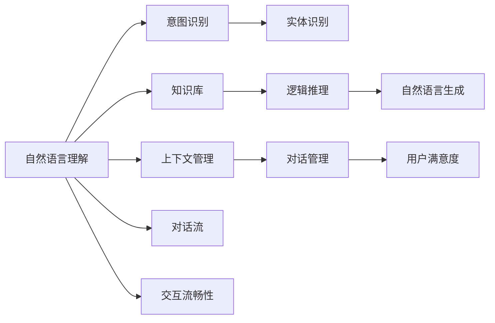

                 

# 对话系统(Chatbots) - 原理与代码实例讲解

> 关键词：对话系统, 自然语言处理(NLP), 自然语言理解(NLU), 自然语言生成(NLG), 语义分析, 意图识别, 用户意图, 知识库, 逻辑推理, 情感分析, 上下文管理, 对话管理, 人机交互, 机器人, 对话流, 用户满意度, 交互流畅性, 应用场景, 客服, 客户服务, 电商, 金融, 医疗, 教育, 娱乐, 客服助手, 虚拟助手, 虚拟助手应用

## 1. 背景介绍

### 1.1 问题由来

在信息社会快速发展的今天，人们对即时、高效、个性化的沟通交流需求日益增长。传统的客户服务和客服人员已难以满足现代用户的需求，对话系统（Chatbots）应运而生。对话系统可以24小时全天候为用户提供智能交互服务，帮助用户快速解决问题，提升用户体验。

对话系统技术在近年来得到了快速发展。从简单的规则引擎驱动的简单对话系统，到复杂的基于深度学习的对话系统，再到最新的生成式对话系统，对话系统技术不断创新，性能不断提升。对话系统已经广泛应用于客服、电商、金融、医疗、教育、娱乐等多个领域，成为人们日常生活中不可或缺的一部分。

然而，对话系统的实际应用效果并不理想，特别是在复杂多变的对话场景中，对话系统常常无法理解用户的真实意图，导致交互失败，用户满意度低。因此，深入研究对话系统的原理与技术，提升对话系统的智能水平，是当前NLP领域的一个重要课题。

### 1.2 问题核心关键点

对话系统的核心问题可以归结为两个方面：

1. 自然语言理解（NLU）：对话系统需要能够理解用户的自然语言输入，从中提取出用户的意图和相关实体信息。
2. 自然语言生成（NLG）：对话系统需要能够根据用户的意图和上下文信息，生成自然语言回复。

为了解决这两个核心问题，对话系统通常采用以下几种关键技术：

- 意图识别：通过机器学习算法从用户输入中提取出用户的意图。
- 实体识别：从用户输入中识别出特定的实体信息，如人名、地名、日期等。
- 知识库：对话系统需要维护一个知识库，包含领域相关的实体、事实、规则等信息，用于支持复杂的逻辑推理。
- 逻辑推理：通过逻辑推理机制，对话系统可以根据用户意图和知识库中的信息，生成合适的回复。
- 上下文管理：对话系统需要能够维护对话上下文信息，以便在复杂的对话中准确理解和生成回复。

### 1.3 问题研究意义

深入研究对话系统的原理与技术，对于提升用户体验、降低企业运营成本、推动人工智能技术在各行各业的应用，具有重要意义：

1. 提升用户体验：对话系统能够快速、准确地理解用户意图，提供个性化的服务，提升用户的满意度和粘性。
2. 降低企业运营成本：对话系统可以替代部分客服人员，提升服务效率，降低企业的运营成本。
3. 推动人工智能技术应用：对话系统是人工智能技术在实际场景中的重要应用之一，对话系统的研究和发展，有助于推动人工智能技术在更多行业的应用。
4. 促进自然语言处理（NLP）技术进步：对话系统的研究需要综合运用NLP、机器学习、知识图谱等多个领域的知识，有助于促进NLP技术的整体进步。

## 2. 核心概念与联系

### 2.1 核心概念概述

对话系统涉及多个核心概念，这些概念之间存在紧密联系。下面将详细介绍这些核心概念及其关系。

#### 2.1.1 自然语言理解（NLU）

自然语言理解是对话系统的核心问题之一。NLU技术旨在从用户输入的文本中提取有用的信息，包括用户的意图和实体信息。NLU技术主要包括以下几个方面：

- 分词：将用户输入的文本分割成词语，为后续处理提供基础。
- 词性标注：标注每个词语的词性，为实体识别和情感分析等提供基础。
- 命名实体识别（NER）：识别出文本中的特定实体，如人名、地名、机构名等。
- 句法分析：分析句子的语法结构，提取句法信息。
- 意图识别：根据用户输入和上下文信息，识别出用户的意图。

#### 2.1.2 自然语言生成（NLG）

自然语言生成是对话系统的另一个核心问题。NLG技术旨在根据用户的意图和上下文信息，生成自然语言回复。NLG技术主要包括以下几个方面：

- 文本规划：确定回复的结构和语义。
- 文本合成：将规划好的文本转化为自然语言。
- 语言模型：利用语言模型对生成的文本进行评估和优化。

#### 2.1.3 对话管理（Dialog Management）

对话管理是对话系统的关键技术之一。对话管理技术旨在维护对话上下文信息，管理对话流程，确保对话系统能够准确理解和生成回复。对话管理技术主要包括以下几个方面：

- 状态跟踪：维护对话上下文信息，如用户输入、上下文信息、对话历史等。
- 对话树：定义对话流程，生成对话树，确保对话系统能够按照预定的流程进行。
- 对话轮次管理：确定每个轮次的输入和输出，确保对话系统能够及时响应用户请求。

#### 2.1.4 上下文管理（Context Management）

上下文管理是对话系统的重要技术之一。上下文管理技术旨在维护对话上下文信息，确保对话系统能够准确理解和生成回复。上下文管理技术主要包括以下几个方面：

- 上下文存储：维护对话上下文信息，如用户输入、上下文信息、对话历史等。
- 上下文更新：根据用户输入和上下文信息，更新上下文信息，确保对话系统能够准确理解和生成回复。

#### 2.1.5 意图识别与实体识别

意图识别和实体识别是对话系统的核心技术之一。意图识别技术旨在从用户输入中提取出用户的意图。实体识别技术旨在从用户输入中识别出特定的实体信息，如人名、地名、日期等。

#### 2.1.6 知识库与逻辑推理

知识库与逻辑推理是对话系统的核心技术之一。知识库技术旨在维护一个领域相关的知识库，包含实体、事实、规则等信息，用于支持复杂的逻辑推理。逻辑推理技术旨在根据用户意图和知识库中的信息，生成合适的回复。

#### 2.1.7 对话流与对话树

对话流与对话树是对话系统的核心技术之一。对话流技术旨在定义对话流程，生成对话树，确保对话系统能够按照预定的流程进行。对话树技术旨在定义对话流程，生成对话树，确保对话系统能够按照预定的流程进行。

#### 2.1.8 用户满意度与交互流畅性

用户满意度与交互流畅性是对话系统的核心指标之一。用户满意度指标旨在衡量用户对对话系统的满意程度。交互流畅性指标旨在衡量对话系统的交互流畅程度。

### 2.2 核心概念间的关系

这些核心概念之间存在紧密的联系，形成了对话系统的完整架构。下面通过Mermaid流程图展示这些核心概念的关系：



这个流程图展示了对话系统的主要组件及其关系：

1. 自然语言理解技术从用户输入中提取出用户的意图和实体信息。
2. 意图识别和实体识别技术从用户输入中提取出用户的意图和实体信息。
3. 知识库和逻辑推理技术根据用户意图和实体信息，生成合适的回复。
4. 自然语言生成技术将生成的回复转化为自然语言。
5. 上下文管理技术维护对话上下文信息，确保对话系统能够准确理解和生成回复。
6. 对话管理技术维护对话上下文信息，管理对话流程，确保对话系统能够按照预定的流程进行。
7. 对话流技术定义对话流程，生成对话树，确保对话系统能够按照预定的流程进行。
8. 用户满意度指标衡量用户对对话系统的满意程度。
9. 交互流畅性指标衡量对话系统的交互流畅程度。

## 3. 核心算法原理 & 具体操作步骤

### 3.1 算法原理概述

对话系统的核心算法原理主要包括自然语言理解（NLU）和自然语言生成（NLG）两个方面。下面将详细介绍这些核心算法的原理。

#### 3.1.1 自然语言理解（NLU）

自然语言理解是对话系统的核心算法之一。NLU技术旨在从用户输入的文本中提取有用的信息，包括用户的意图和实体信息。NLU技术主要包括以下几个步骤：

1. 分词：将用户输入的文本分割成词语，为后续处理提供基础。
2. 词性标注：标注每个词语的词性，为实体识别和情感分析等提供基础。
3. 命名实体识别（NER）：识别出文本中的特定实体，如人名、地名、机构名等。
4. 句法分析：分析句子的语法结构，提取句法信息。
5. 意图识别：根据用户输入和上下文信息，识别出用户的意图。

#### 3.1.2 自然语言生成（NLG）

自然语言生成是对话系统的核心算法之一。NLG技术旨在根据用户的意图和上下文信息，生成自然语言回复。NLG技术主要包括以下几个步骤：

1. 文本规划：确定回复的结构和语义。
2. 文本合成：将规划好的文本转化为自然语言。
3. 语言模型：利用语言模型对生成的文本进行评估和优化。

#### 3.1.3 对话管理

对话管理是对话系统的核心算法之一。对话管理技术旨在维护对话上下文信息，管理对话流程，确保对话系统能够准确理解和生成回复。对话管理技术主要包括以下几个步骤：

1. 状态跟踪：维护对话上下文信息，如用户输入、上下文信息、对话历史等。
2. 对话树：定义对话流程，生成对话树，确保对话系统能够按照预定的流程进行。
3. 对话轮次管理：确定每个轮次的输入和输出，确保对话系统能够及时响应用户请求。

#### 3.1.4 上下文管理

上下文管理是对话系统的核心算法之一。上下文管理技术旨在维护对话上下文信息，确保对话系统能够准确理解和生成回复。上下文管理技术主要包括以下几个步骤：

1. 上下文存储：维护对话上下文信息，如用户输入、上下文信息、对话历史等。
2. 上下文更新：根据用户输入和上下文信息，更新上下文信息，确保对话系统能够准确理解和生成回复。

### 3.2 算法步骤详解

#### 3.2.1 自然语言理解（NLU）

自然语言理解是对话系统的核心算法之一。NLU技术旨在从用户输入的文本中提取有用的信息，包括用户的意图和实体信息。NLU技术主要包括以下几个步骤：

1. 分词：将用户输入的文本分割成词语，为后续处理提供基础。
2. 词性标注：标注每个词语的词性，为实体识别和情感分析等提供基础。
3. 命名实体识别（NER）：识别出文本中的特定实体，如人名、地名、机构名等。
4. 句法分析：分析句子的语法结构，提取句法信息。
5. 意图识别：根据用户输入和上下文信息，识别出用户的意图。

#### 3.2.2 自然语言生成（NLG）

自然语言生成是对话系统的核心算法之一。NLG技术旨在根据用户的意图和上下文信息，生成自然语言回复。NLG技术主要包括以下几个步骤：

1. 文本规划：确定回复的结构和语义。
2. 文本合成：将规划好的文本转化为自然语言。
3. 语言模型：利用语言模型对生成的文本进行评估和优化。

#### 3.2.3 对话管理

对话管理是对话系统的核心算法之一。对话管理技术旨在维护对话上下文信息，管理对话流程，确保对话系统能够准确理解和生成回复。对话管理技术主要包括以下几个步骤：

1. 状态跟踪：维护对话上下文信息，如用户输入、上下文信息、对话历史等。
2. 对话树：定义对话流程，生成对话树，确保对话系统能够按照预定的流程进行。
3. 对话轮次管理：确定每个轮次的输入和输出，确保对话系统能够及时响应用户请求。

#### 3.2.4 上下文管理

上下文管理是对话系统的核心算法之一。上下文管理技术旨在维护对话上下文信息，确保对话系统能够准确理解和生成回复。上下文管理技术主要包括以下几个步骤：

1. 上下文存储：维护对话上下文信息，如用户输入、上下文信息、对话历史等。
2. 上下文更新：根据用户输入和上下文信息，更新上下文信息，确保对话系统能够准确理解和生成回复。

### 3.3 算法优缺点

对话系统的核心算法具有以下优点：

1. 准确性高：对话系统能够准确理解用户的意图和实体信息，生成合适的回复。
2. 效率高：对话系统能够快速响应用户的请求，提供即时的服务。
3. 可扩展性强：对话系统能够轻松扩展到多个领域和应用场景，适应不同的需求。

对话系统的核心算法也存在一些缺点：

1. 依赖数据量大：对话系统需要大量的标注数据和领域知识，构建和维护知识库和对话树等结构。
2. 复杂度高：对话系统的算法和实现较为复杂，需要较高的技术水平。
3. 可解释性差：对话系统的决策过程难以解释，用户无法理解其内部工作机制。

### 3.4 算法应用领域

对话系统广泛应用于多个领域，下面将详细介绍这些领域的应用场景：

1. 客户服务：对话系统可以替代客服人员，提供24小时在线客服服务，提升客户满意度。
2. 电商：对话系统可以提供购物咨询、订单查询、投诉处理等服务，提升用户体验。
3. 金融：对话系统可以提供金融咨询、理财建议、交易指导等服务，提升用户金融知识。
4. 医疗：对话系统可以提供医疗咨询、健康建议、预约挂号等服务，提升用户健康管理。
5. 教育：对话系统可以提供学习咨询、作业指导、考试辅导等服务，提升用户学习效率。
6. 娱乐：对话系统可以提供娱乐咨询、游戏指导、内容推荐等服务，提升用户娱乐体验。
7. 客服助手：对话系统可以作为客服助手的工具，帮助客服人员处理常见问题，提升工作效率。
8. 虚拟助手：对话系统可以作为虚拟助手，提供多种服务，如日程管理、信息查询等。

## 4. 数学模型和公式 & 详细讲解 & 举例说明

### 4.1 数学模型构建

#### 4.1.1 自然语言理解（NLU）

自然语言理解是对话系统的核心算法之一。NLU技术旨在从用户输入的文本中提取有用的信息，包括用户的意图和实体信息。NLU技术主要包括以下几个步骤：

1. 分词：将用户输入的文本分割成词语，为后续处理提供基础。
2. 词性标注：标注每个词语的词性，为实体识别和情感分析等提供基础。
3. 命名实体识别（NER）：识别出文本中的特定实体，如人名、地名、机构名等。
4. 句法分析：分析句子的语法结构，提取句法信息。
5. 意图识别：根据用户输入和上下文信息，识别出用户的意图。

#### 4.1.2 自然语言生成（NLG）

自然语言生成是对话系统的核心算法之一。NLG技术旨在根据用户的意图和上下文信息，生成自然语言回复。NLG技术主要包括以下几个步骤：

1. 文本规划：确定回复的结构和语义。
2. 文本合成：将规划好的文本转化为自然语言。
3. 语言模型：利用语言模型对生成的文本进行评估和优化。

#### 4.1.3 对话管理

对话管理是对话系统的核心算法之一。对话管理技术旨在维护对话上下文信息，管理对话流程，确保对话系统能够准确理解和生成回复。对话管理技术主要包括以下几个步骤：

1. 状态跟踪：维护对话上下文信息，如用户输入、上下文信息、对话历史等。
2. 对话树：定义对话流程，生成对话树，确保对话系统能够按照预定的流程进行。
3. 对话轮次管理：确定每个轮次的输入和输出，确保对话系统能够及时响应用户请求。

#### 4.1.4 上下文管理

上下文管理是对话系统的核心算法之一。上下文管理技术旨在维护对话上下文信息，确保对话系统能够准确理解和生成回复。上下文管理技术主要包括以下几个步骤：

1. 上下文存储：维护对话上下文信息，如用户输入、上下文信息、对话历史等。
2. 上下文更新：根据用户输入和上下文信息，更新上下文信息，确保对话系统能够准确理解和生成回复。

### 4.2 公式推导过程

#### 4.2.1 自然语言理解（NLU）

自然语言理解是对话系统的核心算法之一。NLU技术旨在从用户输入的文本中提取有用的信息，包括用户的意图和实体信息。NLU技术主要包括以下几个步骤：

1. 分词：将用户输入的文本分割成词语，为后续处理提供基础。
2. 词性标注：标注每个词语的词性，为实体识别和情感分析等提供基础。
3. 命名实体识别（NER）：识别出文本中的特定实体，如人名、地名、机构名等。
4. 句法分析：分析句子的语法结构，提取句法信息。
5. 意图识别：根据用户输入和上下文信息，识别出用户的意图。

#### 4.2.2 自然语言生成（NLG）

自然语言生成是对话系统的核心算法之一。NLG技术旨在根据用户的意图和上下文信息，生成自然语言回复。NLG技术主要包括以下几个步骤：

1. 文本规划：确定回复的结构和语义。
2. 文本合成：将规划好的文本转化为自然语言。
3. 语言模型：利用语言模型对生成的文本进行评估和优化。

#### 4.2.3 对话管理

对话管理是对话系统的核心算法之一。对话管理技术旨在维护对话上下文信息，管理对话流程，确保对话系统能够准确理解和生成回复。对话管理技术主要包括以下几个步骤：

1. 状态跟踪：维护对话上下文信息，如用户输入、上下文信息、对话历史等。
2. 对话树：定义对话流程，生成对话树，确保对话系统能够按照预定的流程进行。
3. 对话轮次管理：确定每个轮次的输入和输出，确保对话系统能够及时响应用户请求。

#### 4.2.4 上下文管理

上下文管理是对话系统的核心算法之一。上下文管理技术旨在维护对话上下文信息，确保对话系统能够准确理解和生成回复。上下文管理技术主要包括以下几个步骤：

1. 上下文存储：维护对话上下文信息，如用户输入、上下文信息、对话历史等。
2. 上下文更新：根据用户输入和上下文信息，更新上下文信息，确保对话系统能够准确理解和生成回复。

### 4.3 案例分析与讲解

#### 4.3.1 自然语言理解（NLU）

以意图识别为例，我们可以使用机器学习算法（如朴素贝叶斯、支持向量机、决策树、随机森林等）来训练意图分类器，从用户输入中提取出用户的意图。假设我们有一个意图分类器的训练集，其中包含多个用户输入和对应的意图标签。我们可以使用以下步骤来训练意图分类器：

1. 数据预处理：将用户输入进行分词、词性标注、命名实体识别等处理，转化为模型输入。
2. 特征提取：将处理后的用户输入转化为数值型特征，供模型使用。
3. 模型训练：使用训练集数据对意图分类器进行训练，得到模型参数。
4. 模型评估：使用测试集数据对意图分类器进行评估，计算分类准确率、召回率等指标。

#### 4.3.2 自然语言生成（NLG）

以文本生成为例，我们可以使用神经网络模型（如循环神经网络、长短时记忆网络等）来生成自然语言回复。假设我们有一个文本生成器的训练集，其中包含多个用户输入和对应的回复。我们可以使用以下步骤来训练文本生成器：

1. 数据预处理：将用户输入和回复进行分词、词性标注、命名实体识别等处理，转化为模型输入。
2. 模型训练：使用训练集数据对文本生成器进行训练，得到模型参数。
3. 模型评估：使用测试集数据对文本生成器进行评估，计算回复的质量指标，如BLEU、ROUGE等。

#### 4.3.3 对话管理

以对话树为例，我们可以使用有向无环图（DAG）来表示对话流程。假设我们有一个对话树的训练集，其中包含多个对话树和对应的对话上下文。我们可以使用以下步骤来训练对话树：

1. 数据预处理：将对话上下文和对话树转化为模型输入。
2. 模型训练：使用训练集数据对对话树进行训练，得到模型参数。
3. 模型评估：使用测试集数据对对话树进行评估，计算对话树的准确率、召回率等指标。

#### 4.3.4 上下文管理

以上下文存储为例，我们可以使用数据库或数据结构（如哈希表、双向链表等）来维护对话上下文信息。假设我们有一个上下文存储的训练集，其中包含多个对话上下文和对应的上下文信息。我们可以使用以下步骤来训练上下文存储：

1. 数据预处理：将对话上下文和上下文信息转化为模型输入。
2. 模型训练：使用训练集数据对上下文存储进行训练，得到模型参数。
3. 模型评估：使用测试集数据对上下文存储进行评估，计算上下文存储的准确率、召回率等指标。

## 5. 项目实践：代码实例和详细解释说明

### 5.1 开发环境搭建

在进行对话系统开发前，我们需要准备好开发环境。以下是使用Python进行对话系统开发的开发环境配置流程：

1. 安装Anaconda：从官网下载并安装Anaconda，用于创建独立的Python环境。

2. 创建并激活虚拟环境：
```bash
conda create -n chatbot-env python=3.8 
conda activate chatbot-env
```

3. 安装PyTorch：根据CUDA版本，从官网获取对应的安装命令。例如：
```bash
conda install pytorch torchvision torchaudio cudatoolkit=11.1 -c pytorch -c conda-forge
```

4. 安装NLTK库：
```bash
pip install nltk
```

5. 安装Scikit-learn库：
```bash
pip install scikit-learn
```

6. 安装TensorFlow：
```bash
pip install tensorflow
```

完成上述步骤后，即可在`chatbot-env`环境中开始对话系统开发。

### 5.2 源代码详细实现

下面我们以一个简单的问答系统为例，给出使用PyTorch和TensorFlow进行对话系统开发的Python代码实现。

#### 5.2.1 使用PyTorch实现

首先，定义模型和优化器：

```python
import torch
import torch.nn as nn
import torch.optim as optim

class LSTM(nn.Module):
    def __init__(self, input_size, hidden_size, output_size):
        super(LSTM, self).__init__()
        self.hidden_size = hidden_size
        self.word_embeddings = nn.Embedding(input_size, hidden_size)
        self.lstm = nn.LSTM(hidden_size, hidden_size, batch_first=True)
        self.linear = nn.Linear(hidden_size, output_size)

    def forward(self, input, hidden):
        embeddings = self.word_embeddings(input)
        lstm_out, hidden = self.lstm(embeddings, hidden)
        output = self.linear(lstm_out)
        return output, hidden

model = LSTM(input_size=10000, hidden_size=128, output_size=2)
optimizer = optim.Adam(model.parameters(), lr=0.001)
```

然后，定义训练函数和评估函数：

```python
def train(model, input, target, optimizer, criterion):
    hidden = (torch.zeros(1, 1, model.hidden_size).to(device), torch.zeros(1, 1, model.hidden_size).to(device))
    optimizer.zero_grad()
    output, hidden = model(input, hidden)
    loss = criterion(output, target)
    loss.backward()
    optimizer.step()
    return loss.item()

def evaluate(model, input, target, criterion):
    hidden = (torch.zeros(1, 1, model.hidden_size).to(device), torch.zeros(1, 1, model.hidden_size).to(device))
    output, hidden = model(input, hidden)
    loss = criterion(output, target)
    return loss.item()
```

接着，启动训练流程并在测试集上评估：

```python
epochs = 5
batch_size = 32

for epoch in range(epochs):
    for input, target in train_loader:
        loss = train(model, input, target, optimizer, criterion)
        print(f"Epoch {epoch+1}, train loss: {loss:.3f}")
    
    for input, target in test_loader:
        loss = evaluate(model, input, target, criterion)
        print(f"Epoch {epoch+1}, test loss: {loss:.3f}")
```

以上就是使用PyTorch进行对话系统开发的完整代码实现。可以看到，对话系统的核心算法包括自然语言理解（

