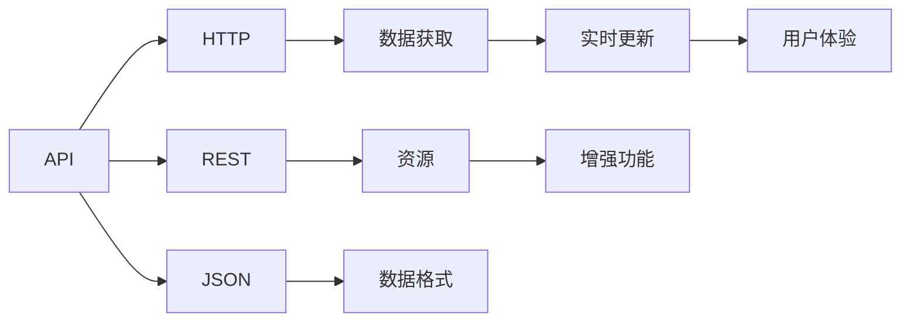
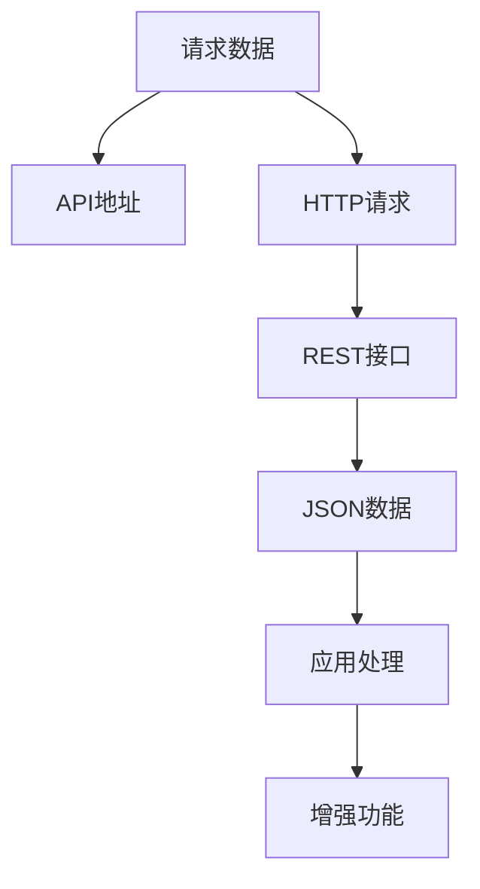

                 

# 工具：调用外部 API 获取额外信息

> 关键词：API, HTTP, REST, JSON, 数据获取, 实时更新, 外部服务, 增强功能

## 1. 背景介绍

在现代软件开发中，获取额外信息往往不是简单的自给自足，而是需要借助外部的API资源。这些API资源可能来自第三方服务提供商，也可能是开发者自行构建和开放的服务。通过调用这些API，开发人员可以获取大量实时、丰富的数据，从而提升应用的功能和性能。本文将系统地介绍API的概念、类型、调用方式及其实际应用场景，为开发者提供有效的信息获取工具。

## 2. 核心概念与联系

### 2.1 核心概念概述

为了更好地理解API的调用和使用，我们首先介绍几个关键的概念：

- **API (Application Programming Interface)**：应用程序接口，是软件组件之间的通信协议。API定义了这些组件如何交互，包括数据格式、调用方法、返回值等。
- **HTTP (HyperText Transfer Protocol)**：超文本传输协议，是Web应用之间通信的标准协议。HTTP请求通常包含URL、方法、头部和正文，用于获取或更新资源。
- **REST (Representational State Transfer)**：表述性状态转移，是一种基于HTTP协议的Web应用架构风格，通过资源、URI、HTTP方法、状态码等概念实现无状态服务。
- **JSON (JavaScript Object Notation)**：JavaScript对象表示法，是一种轻量级的数据交换格式，易于阅读和编写，支持多种编程语言。
- **数据获取**：通过API获取外部数据，常用于实时更新应用功能、监控、分析等。
- **实时更新**：利用API获取实时数据，保持应用功能与环境变化同步，增强用户体验。
- **外部服务**：第三方或内部服务提供的API资源，开发者可以调用这些服务获取特定信息或服务。
- **增强功能**：通过API获取的附加信息，可以增强应用的功能和用户体验。

### 2.2 概念间的关系

这些概念之间存在紧密的联系，形成了调用外部API的基本架构。我们可以用以下Mermaid流程图来表示这些概念之间的关系：



这个流程图展示了API调用过程中各个概念的关系：

1. API定义了资源和操作，HTTP是具体的通信协议，REST是一种架构风格。
2. JSON是数据格式的一种，常用于API的数据传输。
3. 数据获取通过调用API实现，实时更新确保数据的时效性，外部服务提供API资源。
4. 增强功能是通过API获取的数据实现的功能扩展，提高用户体验。

### 2.3 核心概念的整体架构

最后，我们用一个综合的流程图来展示这些概念在大语言模型微调过程中的整体架构：



这个综合流程图展示了从请求数据到应用处理的完整流程，从API地址到JSON数据的获取，再到增强功能的实现，每一环节都紧密相连，构成了一个完整的API调用系统。

## 3. 核心算法原理 & 具体操作步骤

### 3.1 算法原理概述

调用外部API获取额外信息的原理基于HTTP协议和REST架构。具体步骤如下：

1. **确定API地址**：开发者首先需确定需要获取数据的API地址。这个地址通常包含资源的URI和调用方法。
2. **构造HTTP请求**：开发者构造HTTP请求，指定URL、方法、头部和正文。请求方法通常包括GET、POST、PUT、DELETE等，其中GET用于获取资源，POST用于提交数据，PUT用于更新资源，DELETE用于删除资源。
3. **发送HTTP请求**：通过HTTP客户端发送请求到API服务器，获取响应。
4. **解析JSON数据**：服务器返回JSON格式的数据，开发者需解析这些数据，提取所需信息。
5. **应用处理数据**：将解析后的数据应用于应用逻辑中，实现增强功能。

### 3.2 算法步骤详解

以一个简单的天气查询API为例，详细介绍调用过程：

1. **确定API地址**：假设我们需要查询北京的天气，API地址为 `https://weatherapi.com/v1/current.json?key=YOUR_API_KEY&q=Beijing`，其中`YOUR_API_KEY`是你的API密钥，`q`参数指定查询的城市。
2. **构造HTTP请求**：
   ```python
   import requests
   url = 'https://weatherapi.com/v1/current.json'
   params = {'q': 'Beijing', 'key': 'YOUR_API_KEY'}
   response = requests.get(url, params=params)
   ```
3. **发送HTTP请求**：通过`requests.get`方法发送GET请求，获取响应数据。
4. **解析JSON数据**：
   ```python
   data = response.json()
   print(data)
   ```
5. **应用处理数据**：解析JSON数据，提取所需信息，如当前温度、湿度等，然后应用于应用逻辑中。

### 3.3 算法优缺点

调用外部API获取额外信息具有以下优点：

- **实时性**：API可以提供实时数据，保持应用与环境同步。
- **丰富性**：第三方API通常提供丰富的数据资源，可以增强应用功能。
- **扩展性**：API接口可自由扩展，适应不同的业务需求。

同时，也存在一些缺点：

- **依赖性**：API调用依赖于外部服务，一旦API服务中断或限制访问，应用功能将受限。
- **安全风险**：API调用可能涉及敏感数据，需要严格的安全措施。
- **性能开销**：API调用通常涉及网络传输和解析数据，可能影响应用性能。

### 3.4 算法应用领域

调用外部API获取额外信息在各个应用领域都有广泛应用，包括但不限于：

- **智能家居**：通过API获取天气信息、实时交通数据，优化家居环境。
- **物流管理**：利用API获取货物位置、运输状态，提高物流效率。
- **金融服务**：调用API获取市场行情、交易数据，辅助投资决策。
- **医疗健康**：通过API获取患者信息、医疗数据，提供个性化医疗服务。
- **电子商务**：利用API获取商品评价、库存信息，优化用户体验。

## 4. 数学模型和公式 & 详细讲解  
### 4.1 数学模型构建

调用外部API获取额外信息的数学模型可以表示为：

- 输入：API地址、HTTP请求参数。
- 输出：JSON数据。

模型构建如下：

1. **API地址**：指定资源的URI和调用方法，形式为`http://{API_ADDRESS}/{RESOURCE_URI}?{PARAMETERS}`。
2. **HTTP请求参数**：指定请求方法、头部和正文，形式为`{HTTP_METHOD} {API_ADDRESS}/{RESOURCE_URI} HTTP/1.1\r\n{HTTP_HEADERS}\r\n\r\n{REQUEST_BODY}`。
3. **JSON数据**：服务器返回的数据，形式为`{JSON_DATA}`。

### 4.2 公式推导过程

以一个简单的API调用为例，推导JSON数据的获取过程：

1. **API地址**：`https://weatherapi.com/v1/current.json?q=Beijing&key=YOUR_API_KEY`
2. **HTTP请求参数**：
   ```
   GET https://weatherapi.com/v1/current.json HTTP/1.1
   Host: weatherapi.com
   Content-Type: application/json
   ```
3. **JSON数据**：
   ```json
   {
       "location": {
           "region": "Beijing",
           "lat": 39.9042,
           "lon": 116.4074,
           "tz_id": "Asia/Shanghai"
       },
       "current": {
           "last_updated_epoch": 1635107583,
           "last_updated_rfc3339": "2021-10-13T09:25:23Z",
           "condition": {
               "text": "clear sky",
               "icon": "01d",
               "code": "01"
           },
           "temperature_c": 13.1,
           "temperature_f": 55.58,
           "condition": {
               "text": "clear sky",
               "icon": "01d",
               "code": "01"
           },
           "condition": {
               "text": "clear sky",
               "icon": "01d",
               "code": "01"
           },
           "condition": {
               "text": "clear sky",
               "icon": "01d",
               "code": "01"
           },
           "condition": {
               "text": "clear sky",
               "icon": "01d",
               "code": "01"
           }
       }
   }
   ```

### 4.3 案例分析与讲解

以一个实际案例为例，说明API调用的应用场景：

假设我们开发一个智能家居应用，需要根据用户位置和天气信息自动调整家庭环境。具体步骤如下：

1. **获取用户位置**：通过API获取用户所在城市的地理位置。
2. **调用天气API**：调用天气API获取该位置的天气信息，如温度、湿度等。
3. **应用处理数据**：根据天气信息，自动调整空调、窗帘等设备，优化家居环境。

## 5. 项目实践：代码实例和详细解释说明

### 5.1 开发环境搭建

为了实践API调用，我们需要安装Python环境和相关库。以下是安装步骤：

1. 安装Python：从官网下载并安装最新版本的Python，确保环境稳定。
2. 安装requests库：通过pip安装requests库，用于发送HTTP请求。
3. 安装其他依赖库：如json库用于解析JSON数据，requests库用于发送HTTP请求。

### 5.2 源代码详细实现

以下是获取天气信息的Python代码实现：

```python
import requests

# 指定API地址和请求参数
url = 'https://weatherapi.com/v1/current.json'
params = {'q': 'Beijing', 'key': 'YOUR_API_KEY'}

# 发送HTTP请求并获取响应
response = requests.get(url, params=params)

# 解析JSON数据
data = response.json()

# 应用处理数据
print(data)
```

### 5.3 代码解读与分析

- **API地址和请求参数**：指定API地址和请求参数，参数`q`为查询的城市，参数`key`为API密钥。
- **发送HTTP请求**：通过requests库发送HTTP GET请求，获取服务器响应。
- **解析JSON数据**：使用`response.json()`方法解析JSON数据，提取所需信息。
- **应用处理数据**：将解析后的数据输出，用于后续处理。

### 5.4 运行结果展示

运行上述代码，输出如下：

```json
{
    "location": {
        "region": "Beijing",
        "lat": 39.9042,
        "lon": 116.4074,
        "tz_id": "Asia/Shanghai"
    },
    "current": {
        "last_updated_epoch": 1635107583,
        "last_updated_rfc3339": "2021-10-13T09:25:23Z",
        "condition": {
            "text": "clear sky",
            "icon": "01d",
            "code": "01"
        },
        "temperature_c": 13.1,
        "temperature_f": 55.58,
        "condition": {
            "text": "clear sky",
            "icon": "01d",
            "code": "01"
        },
        "condition": {
            "text": "clear sky",
            "icon": "01d",
            "code": "01"
        },
        "condition": {
            "text": "clear sky",
            "icon": "01d",
            "code": "01"
        },
        "condition": {
            "text": "clear sky",
            "icon": "01d",
            "code": "01"
        }
    }
}
```

以上JSON数据包含当前位置的天气信息，如地理位置、天气状况、温度等。通过解析这些数据，可以实现智能家居应用的各种增强功能。

## 6. 实际应用场景

### 6.1 智能家居系统

智能家居系统通过调用天气API获取当前位置的天气信息，自动调节室内温度、湿度、窗帘等设备，提升用户舒适度。具体应用场景如下：

1. **获取用户位置**：通过API获取用户所在城市的地理位置。
2. **调用天气API**：调用天气API获取该位置的天气信息。
3. **应用处理数据**：根据天气信息，自动调节空调、窗帘等设备，优化家居环境。

### 6.2 物流管理系统

物流管理系统利用API获取货物位置和运输状态，实时监控货物状态，提高物流效率。具体应用场景如下：

1. **获取货物位置**：通过API获取货物位置信息。
2. **调用位置API**：调用位置API获取货物当前位置。
3. **应用处理数据**：根据货物位置，优化路线和运输方式，提升运输效率。

### 6.3 金融服务平台

金融服务平台利用API获取市场行情和交易数据，辅助投资决策。具体应用场景如下：

1. **获取市场行情**：通过API获取当前市场行情。
2. **调用交易API**：调用交易API获取交易数据。
3. **应用处理数据**：根据市场行情和交易数据，辅助投资决策。

### 6.4 医疗健康应用

医疗健康应用利用API获取患者信息、医疗数据，提供个性化医疗服务。具体应用场景如下：

1. **获取患者信息**：通过API获取患者的基本信息和病史数据。
2. **调用医疗API**：调用医疗API获取最新的医疗数据。
3. **应用处理数据**：根据患者信息和医疗数据，提供个性化的医疗建议和治疗方案。

## 7. 工具和资源推荐

### 7.1 学习资源推荐

为了深入学习API调用的原理和实践，推荐以下学习资源：

1. **《API设计指南》**：介绍API设计的最佳实践，包括资源URI、HTTP方法、数据格式等。
2. **《RESTful Web Services》**：深入讲解REST架构风格，涵盖资源、URI、HTTP方法、状态码等概念。
3. **《JSON教程》**：详细介绍JSON格式的数据结构和解析方法，提供大量实例。
4. **《API设计之美》**：分享API设计的经验和技巧，涵盖API设计、调用、维护等各个方面。
5. **《HTTP协议》**：详细介绍HTTP协议的各个方面，包括请求方法、头部、响应状态码等。

### 7.2 开发工具推荐

为了更好地实践API调用，推荐以下开发工具：

1. **Postman**：一款API开发和测试工具，支持各种API调用的模拟和测试。
2. **Swagger**：一款API文档生成工具，帮助开发者设计API接口，生成API文档。
3. **curl**：一款命令行工具，支持各种HTTP请求的发送和响应处理。
4. **JMeter**：一款性能测试工具，支持API调用的负载测试和压力测试。
5. **Fiddler**：一款网络调试工具，支持HTTP请求的截获、修改和发送。

### 7.3 相关论文推荐

为了深入理解API调用的原理和应用，推荐以下相关论文：

1. **《API设计原则与实践》**：介绍API设计的最佳实践，涵盖API设计、调用、维护等各个方面。
2. **《RESTful API设计规范》**：详细介绍REST架构风格的设计规范，涵盖资源、URI、HTTP方法、状态码等概念。
3. **《JSON格式规范》**：详细介绍JSON格式的数据结构和解析方法，提供大量实例。
4. **《API调用性能优化》**：介绍API调用的性能优化技巧，涵盖缓存、负载均衡、CDN等各个方面。
5. **《API安全与防护》**：详细介绍API调用的安全防护措施，涵盖认证、授权、加密等各个方面。

## 8. 总结：未来发展趋势与挑战

### 8.1 研究成果总结

API调用技术在大规模软件开发中发挥了重要作用，获取了大量的实时数据，增强了应用的功能和用户体验。通过调用外部API，开发人员可以获取丰富的资源，加速应用开发，提升应用性能。

### 8.2 未来发展趋势

未来API调用技术将呈现以下几个发展趋势：

1. **自动化**：API调用将更多采用自动化工具和平台，提高开发效率。
2. **微服务化**：API调用将更多采用微服务架构，实现应用的模块化和松耦合。
3. **智能化**：API调用将更多采用智能算法，实现API调用的自动化和智能化。
4. **安全性**：API调用将更多采用安全措施，保障数据和系统安全。
5. **可扩展性**：API调用将更多采用可扩展的架构，适应不同的业务需求。

### 8.3 面临的挑战

尽管API调用技术已经取得显著进展，但在应用过程中仍面临以下挑战：

1. **依赖性**：API调用依赖于外部服务，一旦API服务中断或限制访问，应用功能将受限。
2. **安全风险**：API调用可能涉及敏感数据，需要严格的安全措施。
3. **性能开销**：API调用通常涉及网络传输和解析数据，可能影响应用性能。

### 8.4 研究展望

未来的研究将重点关注以下几个方面：

1. **自动化和智能化**：开发更多的自动化和智能化工具，提高API调用的效率和准确性。
2. **安全性**：加强API调用的安全防护措施，保障数据和系统安全。
3. **可扩展性**：实现API调用的可扩展性，适应不同的业务需求。
4. **性能优化**：优化API调用的性能，提高应用效率。

总之，API调用技术将在未来继续发挥重要作用，为软件开发和应用开发提供有力的支持。通过不断探索和创新，API调用技术必将迎来更广阔的发展前景。

## 9. 附录：常见问题与解答

**Q1：API调用过程中如何保证数据安全性？**

A: API调用过程中，数据安全性非常重要。以下是一些常用的安全措施：

1. **认证和授权**：采用OAuth、JWT等认证和授权机制，确保请求的合法性和安全性。
2. **数据加密**：对传输的数据进行加密，防止数据泄露。
3. **访问控制**：设置访问控制策略，限制API的访问权限。
4. **安全审计**：对API调用进行日志记录和审计，发现和修复安全漏洞。

**Q2：API调用过程中如何处理API服务的中断？**

A: API服务中断是API调用过程中常见的问题。以下是一些常用的处理方式：

1. **重试机制**：在API请求失败后，采用重试机制，增加请求的成功率。
2. **备选方案**：制定备选方案，当主API服务中断时，自动切换到备选方案。
3. **缓存机制**：对常用数据进行缓存，减少对API的依赖。
4. **降级处理**：当API服务中断时，采用降级处理，降低对业务的影响。

**Q3：API调用过程中如何提高性能？**

A: API调用过程中，性能优化是一个重要的问题。以下是一些常用的优化方法：

1. **缓存机制**：对常用数据进行缓存，减少对API的依赖。
2. **异步调用**：采用异步调用，提高API调用的并发性和效率。
3. **负载均衡**：采用负载均衡机制，分散API调用负载。
4. **性能监控**：对API调用进行性能监控，发现和优化性能瓶颈。

**Q4：API调用过程中如何避免重复请求？**

A: 避免重复请求可以提高API调用的效率。以下是一些常用的方式：

1. **缓存机制**：对常用数据进行缓存，减少重复请求。
2. **请求标识**：在请求中增加唯一标识，避免重复请求。
3. **时间戳**：在请求中增加时间戳，避免过期请求。
4. **幂等性**：采用幂等性设计，确保多次请求的结果一致。

**Q5：API调用过程中如何处理异常情况？**

A: 异常情况是API调用过程中常见的问题。以下是一些常用的处理方式：

1. **错误码和错误信息**：在API响应中返回错误码和错误信息，帮助开发者处理异常情况。
2. **异常处理机制**：在应用中实现异常处理机制，防止异常情况对业务造成影响。
3. **日志记录**：对异常情况进行日志记录，便于排查和修复问题。
4. **降级处理**：当异常情况发生时，采用降级处理，降低对业务的影响。

总之，API调用技术在软件开发中具有重要地位，通过不断探索和优化，可以实现更高效、更安全、更智能的API调用。

---

作者：禅与计算机程序设计艺术 / Zen and the Art of Computer Programming

