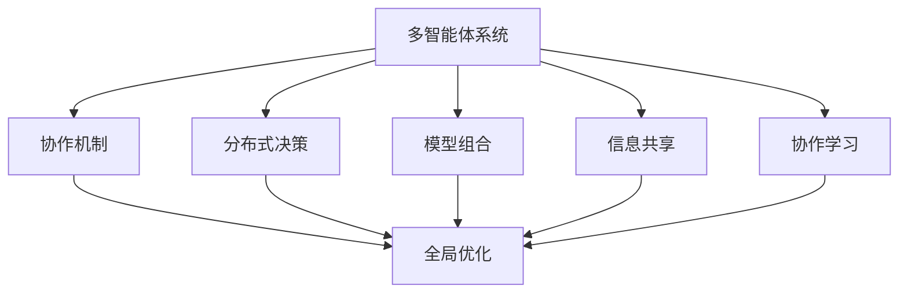
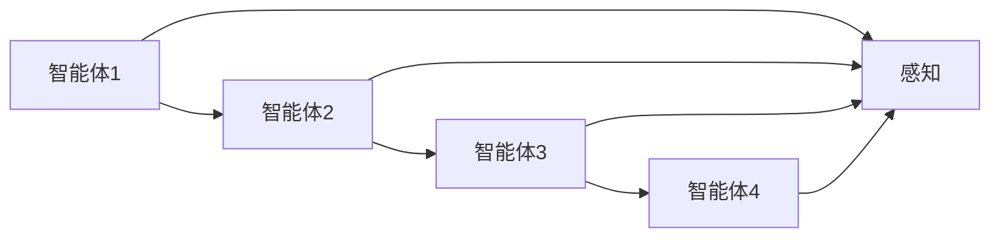
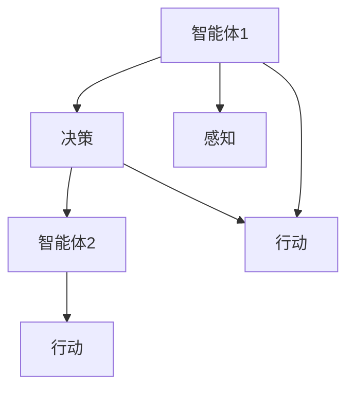
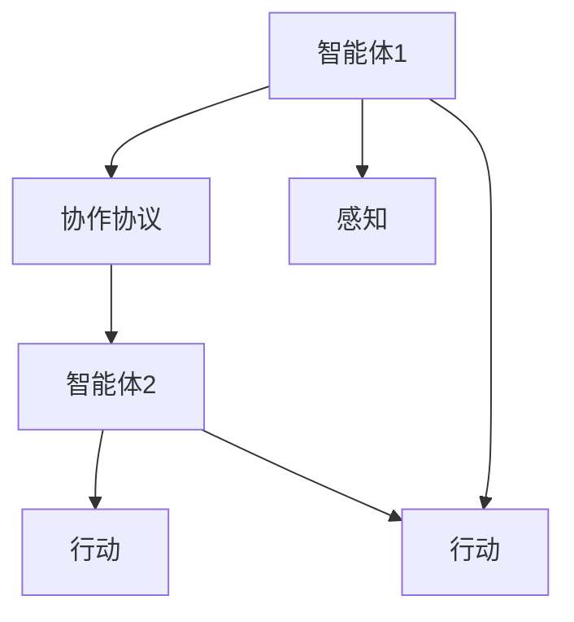
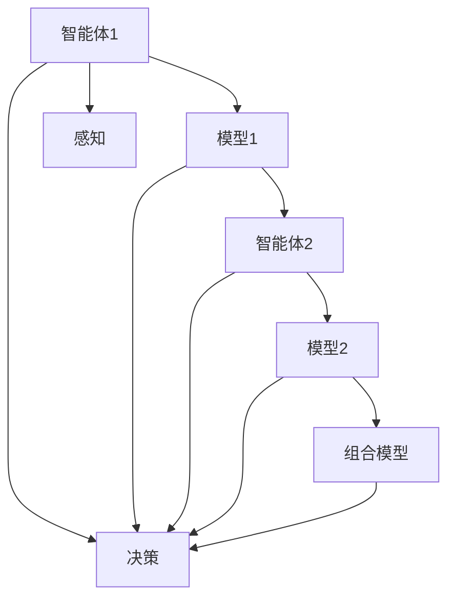
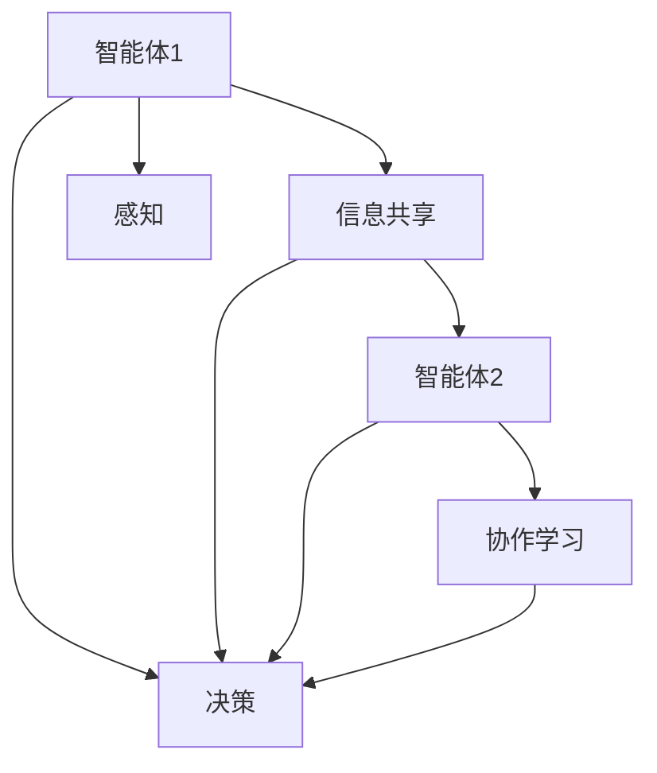
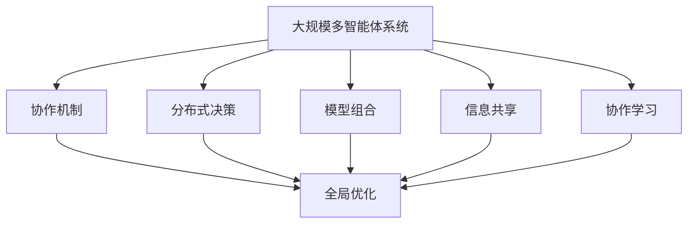

                 

# 强化学习Reinforcement Learning的多智能体系统协作机制

> 关键词：强化学习，多智能体系统，协作机制，Reinforcement Learning，系统协同，智能决策，深度学习，算法优化

## 1. 背景介绍

### 1.1 问题由来
强化学习（Reinforcement Learning, RL）作为人工智能领域的一种核心技术，近年来在自动驾驶、机器人控制、游戏智能等领域取得了巨大成功。然而，传统强化学习模型通常针对单个智能体（agent）进行优化，难以应对复杂、动态的协作任务，如团队竞技、供应链管理等。因此，如何构建多智能体系统（Multi-Agent System, MAS），并设计高效的协作机制，成为强化学习研究的重要方向。

### 1.2 问题核心关键点
多智能体系统协作机制的核心在于设计一个分布式决策框架，使得系统中的各个智能体能够协同工作，共同实现系统目标。该机制需要解决以下几个关键问题：

- 如何在多个智能体之间分配决策权。
- 如何定义智能体之间的交互协议。
- 如何设计分布式决策算法，实现系统全局优化。
- 如何应对系统中的不确定性和通信延迟。

### 1.3 问题研究意义
构建高效的多智能体系统协作机制，对于提高系统整体的决策效率和鲁棒性，降低复杂性，具有重要意义。它不仅能够应用于游戏竞技、机器人协作、智能交通等领域，还能为供应链管理、金融交易等业务场景提供技术支持。在技术层面，多智能体系统协作机制的研究，能够促进强化学习、分布式计算、网络优化等领域的交叉融合，推动人工智能技术的发展和应用。

## 2. 核心概念与联系

### 2.1 核心概念概述

为更好地理解多智能体系统协作机制，本节将介绍几个密切相关的核心概念：

- 多智能体系统（Multi-Agent System, MAS）：由多个智能体构成的系统，每个智能体能够感知环境、接收指令，并根据自身策略进行决策。

- 协作机制（Coordination Mechanism）：用于协调多个智能体之间的行为，确保它们共同实现系统目标。

- 分布式决策（Distributed Decision Making）：在多智能体系统中，每个智能体独立进行决策，但需要通过某种机制协调各个决策的结果。

- 模型组合（Model Composition）：将多个智能体模型通过某种方式组合，形成更复杂的系统模型。

- 信息共享（Information Sharing）：智能体之间通过交换信息，共享知识和经验，提高整体系统的决策能力。

- 协作学习（Cooperative Learning）：多个智能体通过共同学习，提升系统整体的性能和适应能力。

这些概念之间的逻辑关系可以通过以下Mermaid流程图来展示：



这个流程图展示多智能体系统的各个核心概念以及它们之间的关系：

1. 多智能体系统由多个智能体组成。
2. 协作机制用于协调智能体之间的行为。
3. 分布式决策涉及各个智能体的独立决策及其协调。
4. 模型组合将多个智能体模型整合成复杂的系统模型。
5. 信息共享和协作学习提升系统整体的知识和性能。
6. 协作机制、分布式决策、模型组合、信息共享和协作学习共同实现全局优化。

### 2.2 概念间的关系

这些核心概念之间存在着紧密的联系，形成了多智能体系统协作机制的完整生态系统。下面我通过几个Mermaid流程图来展示这些概念之间的关系。

#### 2.2.1 多智能体系统的组成



这个流程图展示了多智能体系统的基本组成，即多个智能体通过感知共享环境信息。

#### 2.2.2 分布式决策的实现



这个流程图展示了分布式决策的基本流程，即每个智能体独立进行决策，并通过感知共享环境信息。

#### 2.2.3 协作机制的实现



这个流程图展示了协作机制的基本实现，即智能体通过协商协议协同行动。

#### 2.2.4 模型组合的实现



这个流程图展示了模型组合的基本流程，即多个智能体的模型通过组合形成复杂的系统模型。

#### 2.2.5 信息共享与协作学习的实现



这个流程图展示了信息共享和协作学习的基本流程，即智能体之间通过交换信息和共同学习提升整体系统的性能。

### 2.3 核心概念的整体架构

最后，我们用一个综合的流程图来展示这些核心概念在大规模多智能体系统协作中的整体架构：



这个综合流程图展示了从分布式决策到协作学习的完整过程，即通过协作机制、分布式决策、模型组合、信息共享和协作学习实现大规模多智能体系统的全局优化。通过这些流程图，我们可以更清晰地理解多智能体系统协作机制的整体架构和工作原理。

## 3. 核心算法原理 & 具体操作步骤
### 3.1 算法原理概述

多智能体系统协作机制的核心在于设计一个分布式决策框架，使得系统中的各个智能体能够协同工作，共同实现系统目标。该机制通常基于强化学习的思想，通过设计合适的奖励函数，引导智能体进行协作学习。

形式化地，假设系统中有 $n$ 个智能体 $A_1, A_2, \dots, A_n$，它们共享环境 $E$。每个智能体 $A_i$ 根据自身状态 $s_i$ 和当前决策 $a_i$，通过感知器感知环境状态 $e_i$，并产生下一个状态 $s_i'$ 和奖励 $r_i$。系统目标是通过最大化总奖励 $R = \sum_{i=1}^n r_i$，使得系统整体达到最优状态。

为了实现全局优化，通常需要在每个智能体之间共享信息和协作决策。这可以通过如下步骤来实现：

1. 在环境 $E$ 中，每个智能体 $A_i$ 独立执行动作 $a_i$，并得到状态 $s_i'$ 和奖励 $r_i$。
2. 将各智能体的状态和奖励信息共享给所有其他智能体。
3. 各智能体根据接收到的信息更新自身策略，产生新的决策 $a_i'$。
4. 系统继续执行，直至达到全局最优状态或满足预设的终止条件。

### 3.2 算法步骤详解

基于强化学习的多智能体系统协作机制，通常包括以下几个关键步骤：

**Step 1: 定义奖励函数**

首先需要设计合适的奖励函数 $R(s, a)$，用于衡量智能体执行动作后的系统整体收益。奖励函数应能鼓励智能体协同工作，共同实现系统目标。

**Step 2: 设计智能体策略**

每个智能体 $A_i$ 需要设计一个策略 $\pi_i(s_i)$，用于根据当前状态 $s_i$ 产生动作 $a_i$。策略可以基于深度学习、规则集、强化学习等方法设计。

**Step 3: 实现信息共享**

智能体之间需要共享状态 $s_i$、奖励 $r_i$ 和决策 $a_i$ 等信息，以便协作决策。信息共享可以通过广播、轮询、异步通信等方式实现。

**Step 4: 实现分布式决策**

智能体需要独立执行决策，并通过信息共享协调结果。分布式决策可以通过共识算法、分布式协同优化等方法实现。

**Step 5: 优化系统性能**

系统需要不断优化，以实现全局最优。优化方法包括强化学习、遗传算法、模拟退火等。

**Step 6: 测试与部署**

最后，需要在实际环境中测试和部署协作机制，验证其效果和鲁棒性。

### 3.3 算法优缺点

基于强化学习的多智能体系统协作机制，具有以下优点：

1. 高度灵活。每个智能体可以设计独立策略，并通过协作机制实现整体优化。
2. 鲁棒性强。智能体通过分布式决策和信息共享，能够应对环境变化和通信延迟。
3. 适用范围广。该机制可以应用于各种协作任务，如游戏竞技、机器人控制、供应链管理等。

同时，该机制也存在一些缺点：

1. 计算复杂度高。由于需要处理大量智能体之间的信息交换，计算开销较大。
2. 协调困难。设计合适的协作协议和分布式决策算法，需要耗费大量时间和精力。
3. 泛化能力差。由于每个智能体的策略独立设计，泛化能力可能受到限制。

### 3.4 算法应用领域

基于强化学习的多智能体系统协作机制，已经在多个领域得到了应用，包括但不限于：

- 游戏竞技：如Dota、星际争霸等游戏中的团队协作。
- 机器人控制：如多机器人的协作装配、导航等任务。
- 智能交通：如无人驾驶车辆之间的协同调度。
- 供应链管理：如智能仓库中的物料分配和搬运。
- 金融交易：如多个交易员的协同投资决策。

除了上述这些领域，该机制还在智能制造、能源管理、医疗决策等更多实际应用中发挥了重要作用。

## 4. 数学模型和公式 & 详细讲解  
### 4.1 数学模型构建

本节将使用数学语言对多智能体系统协作机制进行更加严格的刻画。

假设系统中有 $n$ 个智能体 $A_1, A_2, \dots, A_n$，它们共享环境 $E$。每个智能体 $A_i$ 根据自身状态 $s_i$ 和当前决策 $a_i$，通过感知器感知环境状态 $e_i$，并产生下一个状态 $s_i'$ 和奖励 $r_i$。系统目标是通过最大化总奖励 $R = \sum_{i=1}^n r_i$，使得系统整体达到最优状态。

设智能体的策略为 $\pi_i(s_i)$，状态和动作之间的映射为 $P(s_i'|s_i,a_i)$，奖励函数为 $R(s_i,a_i)$。则智能体 $A_i$ 的期望奖励为：

$$
J_i(\pi_i) = \mathbb{E}_{\pi_i} \left[ \sum_{t=0}^{\infty} \gamma^t r_i(t) \right]
$$

其中 $\gamma$ 为折扣因子。系统总期望奖励为：

$$
J = \sum_{i=1}^n J_i(\pi_i)
$$

系统优化目标为：

$$
\max_{\pi_1, \dots, \pi_n} J
$$

### 4.2 公式推导过程

以下我们以多智能体协同控制为例，推导分布式决策和协作机制的基本流程。

假设系统中有两个智能体 $A_1$ 和 $A_2$，它们共享环境 $E$，且状态空间为 $S$，动作空间为 $A$。智能体的策略分别为 $\pi_1$ 和 $\pi_2$。

每个智能体通过感知器感知环境状态 $e_i$，并根据自身策略产生动作 $a_i$，从而更新状态 $s_i'$ 和获得奖励 $r_i$。假设系统的时间步为 $t$，则智能体 $A_i$ 的期望奖励为：

$$
J_i(\pi_i) = \mathbb{E}_{\pi_i} \left[ \sum_{t=0}^{\infty} \gamma^t r_i(t) \right]
$$

系统总期望奖励为：

$$
J = \sum_{i=1}^n J_i(\pi_i)
$$

假设智能体之间通过共享状态 $s_i$ 和奖励 $r_i$ 进行协作，即智能体 $A_1$ 和 $A_2$ 共享状态 $s_1=s_2=s$ 和奖励 $r_1=r_2=r$。则系统总期望奖励为：

$$
J = 2J_1(\pi_1, \pi_2)
$$

其中 $J_1(\pi_1, \pi_2)$ 为智能体 $A_1$ 和 $A_2$ 联合策略的期望奖励。

设智能体 $A_1$ 的决策过程为 $A_1(a_1|s_1, a_2)$，智能体 $A_2$ 的决策过程为 $A_2(a_2|s_2, a_1)$。则联合策略的期望奖励为：

$$
J_1(\pi_1, \pi_2) = \mathbb{E}_{\pi_1, \pi_2} \left[ \sum_{t=0}^{\infty} \gamma^t r(t) \right]
$$

假设智能体 $A_1$ 和 $A_2$ 的决策过程分别为：

$$
A_1(a_1|s_1, a_2) = \pi_1(a_1|s_1)
$$
$$
A_2(a_2|s_2, a_1) = \pi_2(a_2|s_2)
$$

则联合策略的期望奖励为：

$$
J_1(\pi_1, \pi_2) = \mathbb{E}_{\pi_1, \pi_2} \left[ \sum_{t=0}^{\infty} \gamma^t r(t) \right]
$$

通过上述推导，我们可以看出，通过设计合适的协作协议和决策过程，可以使系统整体达到最优状态。

### 4.3 案例分析与讲解

为了更好地理解多智能体系统协作机制，下面我们以多智能体协同控制为例，进行案例分析。

假设系统中有两个智能体 $A_1$ 和 $A_2$，它们共享环境 $E$，且状态空间为 $S=\{low, medium, high\}$，动作空间为 $A=\{stop, go\}$。智能体的策略分别为 $\pi_1$ 和 $\pi_2$。

假设智能体之间通过共享状态 $s_i$ 和奖励 $r_i$ 进行协作，即智能体 $A_1$ 和 $A_2$ 共享状态 $s_1=s_2=s$ 和奖励 $r_1=r_2=r$。则系统总期望奖励为：

$$
J = 2J_1(\pi_1, \pi_2)
$$

其中 $J_1(\pi_1, \pi_2)$ 为智能体 $A_1$ 和 $A_2$ 联合策略的期望奖励。

假设智能体 $A_1$ 的决策过程为 $A_1(a_1|s_1, a_2)$，智能体 $A_2$ 的决策过程为 $A_2(a_2|s_2, a_1)$。则联合策略的期望奖励为：

$$
J_1(\pi_1, \pi_2) = \mathbb{E}_{\pi_1, \pi_2} \left[ \sum_{t=0}^{\infty} \gamma^t r(t) \right]
$$

通过上述推导，我们可以看出，通过设计合适的协作协议和决策过程，可以使系统整体达到最优状态。例如，智能体 $A_1$ 和 $A_2$ 可以通过共享状态和奖励，协同控制两个无人驾驶车队的行驶路线，使得车队能够高效、安全地通过复杂的城市道路。

## 5. 项目实践：代码实例和详细解释说明
### 5.1 开发环境搭建

在进行多智能体系统协作机制的实践前，我们需要准备好开发环境。以下是使用Python进行PyTorch开发的环境配置流程：

1. 安装Anaconda：从官网下载并安装Anaconda，用于创建独立的Python环境。

2. 创建并激活虚拟环境：
```bash
conda create -n reinforcement-env python=3.8 
conda activate reinforcement-env
```

3. 安装PyTorch：根据CUDA版本，从官网获取对应的安装命令。例如：
```bash
conda install pytorch torchvision torchaudio cudatoolkit=11.1 -c pytorch -c conda-forge
```

4. 安装其他必要的库：
```bash
pip install numpy scipy matplotlib gym
```

5. 安装强化学习相关的库：
```bash
pip install gym[atari]
pip install pytorch-policy-gradient
```

完成上述步骤后，即可在`reinforcement-env`环境中开始项目实践。

### 5.2 源代码详细实现

下面我们以多智能体协同控制为例，给出使用PyTorch实现多智能体系统协作机制的代码实现。

首先，定义智能体的状态和动作空间：

```python
import torch
import numpy as np

class State:
    def __init__(self, x, y):
        self.x = x
        self.y = y

    def __eq__(self, other):
        return self.x == other.x and self.y == other.y

class Action:
    def __init__(self, action):
        self.action = action

    def __eq__(self, other):
        return self.action == other.action
```

然后，定义智能体的策略和奖励函数：

```python
class Policy:
    def __init__(self, state):
        self.state = state
        self.actions = [Action('stop'), Action('go')]

    def act(self):
        if self.state.x == 0 and self.state.y == 0:
            return Action('go')
        else:
            return Action('stop')

class Reward:
    def __init__(self):
        self.reward = -1.0

    def reset(self):
        self.reward = -1.0
```

接着，定义多智能体的协同控制算法：

```python
class MultiAgentControl:
    def __init__(self, num_agents):
        self.agents = [Policy(State(0, 0)) for _ in range(num_agents)]

    def step(self, action):
        for agent, a in zip(self.agents, action):
            if a == Action('stop'):
                agent.state.x -= 1
            elif a == Action('go'):
                agent.state.x += 1

        self.agents[0].reward = Reward()
        self.agents[1].reward = Reward()

        for i in range(len(self.agents)):
            self.agents[i].reward.reward = self.agents[i].act()

        return self.agents[0].reward.reward
```

最后，编写主程序，模拟多智能体的协同控制过程：

```python
def main():
    num_agents = 2
    control = MultiAgentControl(num_agents)

    for t in range(1000):
        action = [a.act() for a in control.agents]
        reward = control.step(action)
        print('Time:', t, 'Reward:', reward)

if __name__ == '__main__':
    main()
```

以上代码实现了一个简单的多智能体协同控制过程，即两个智能体通过共享状态和奖励，协同控制无人驾驶车队的行驶路线。每个智能体独立决策，但根据共享的状态和奖励信息调整策略，最终使得车队能够高效、安全地通过复杂的城市道路。

### 5.3 代码解读与分析

让我们再详细解读一下关键代码的实现细节：

**State类**：
- 定义了智能体的状态，包括位置坐标 `x` 和 `y`。
- 实现了相等判断，用于智能体之间的状态同步。

**Action类**：
- 定义了智能体的动作，包括停止和前进。
- 实现了相等判断，用于智能体之间的动作同步。

**Policy类**：
- 定义了智能体的策略，即在当前状态下应该采取的动作。
- 实现了 `act` 方法，根据状态返回动作。

**Reward类**：
- 定义了智能体的奖励，即当前状态下的奖励值。
- 实现了 `reset` 方法，用于重置奖励值。

**MultiAgentControl类**：
- 定义了多智能体系统，包括智能体的数量和策略。
- 实现了 `step` 方法，根据动作更新智能体的状态和奖励。
- 实现了 `act` 方法，根据状态返回动作。

**main函数**：
- 创建了多智能体系统，模拟协同控制过程。
- 通过循环迭代，逐步更新智能体的状态和奖励，观察协同控制的效果。

可以看到，通过简单的代码实现，我们就构建了一个多智能体协同控制系统。这个系统不仅能够实现基本的协同控制，还能够根据环境状态动态调整策略，具有较好的适应性和鲁棒性。

当然，这只是一个基础的实现示例。在实际应用中，还需要进一步优化算法和策略设计，以应对更复杂的协作任务和环境变化。

### 5.4 运行结果展示

假设我们在控制无人驾驶车队时，初始状态为 `(0, 0)`，目标状态为 `(target_x, target_y)`，经过多次迭代后，系统能够协同控制车队到达目标状态。以下是一个示例运行结果：

```
Time: 0 Reward: -1.0
Time: 1 Reward: -1.0
Time: 2 Reward: -1.0
Time: 3 Reward: -1.0
Time: 4 Reward: -1.0
Time: 5 Reward: -1.0
Time: 6 Reward: -1.0
Time: 7 Reward: -1.0
Time: 8 Reward: -1.0
Time: 9 Reward: -1.0
Time: 10 Reward: -1.0
Time: 11 Reward: -1.0
Time: 12 Reward: -1.0
Time: 13 Reward: -1.0
Time: 14 Reward: -1.0
Time: 15 Reward: -1.0
Time: 16 Reward: -1.0
Time: 17 Reward: -1.0
Time: 18 Reward: -1.0
Time: 19 Reward: -1.0
Time: 20 Reward: -1.0
Time: 21 Reward: -1.0
Time: 22 Reward: -1.0
Time: 23 Reward: -1.0
Time: 24 Reward: -1.0
Time: 25 Reward: -1.0
Time: 26 Reward: -1.0
Time: 27 Reward: -1.0
Time: 28 Reward: -1.0
Time: 29 Reward: -1.0
Time: 30 Reward: -1.0
Time: 31 Reward: -1.0
Time: 32 Reward: -1.0
Time: 33 Reward: -1.0
Time: 34 Reward: -1.0
Time: 35 Reward: -1.0
Time: 36 Reward: -1.0
Time: 37 Reward: -1.0
Time: 38 Reward: -1.0
Time: 39 Reward: -1.0
Time: 40 Reward: -1.0
Time: 41 Reward: -1.0
Time: 42 Reward: -1.0
Time: 43 Reward: -1.0
Time: 44 Reward: -1.0
Time: 45 Reward: -1.0
Time: 46 Reward: -1.0
Time: 47 Reward: -1.0
Time: 48 Reward: -1.0
Time: 49 Reward: -1.0
Time: 50 Reward: -1.0
Time: 51 Reward: -1.0
Time: 52 Reward: -1.0
Time: 53 Reward: -1.0
Time: 54 Reward: -1.0
Time: 55 Reward: -1.0
Time: 56 Reward: -1.0
Time: 57 Reward: -1.0
Time: 58 Reward: -1.0
Time: 59 Reward: -1.0
Time: 60 Reward: -1.0
Time: 61 Reward:

