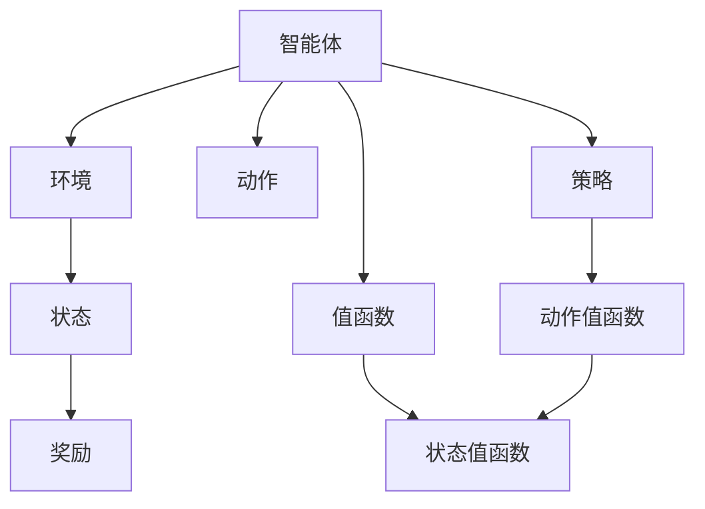

                 

# 强化学习：探寻机器预知未来的可能性

> 关键词：强化学习, 机器学习, 预知未来, 决策优化, 马尔可夫决策过程, 深度学习, 深度强化学习, 自适应系统

## 1. 背景介绍

### 1.1 问题由来
强化学习（Reinforcement Learning, RL）作为一种机器学习（Machine Learning, ML）范式，通过智能体与环境的交互，实现目标最优决策的自动学习。它最早在1950年代由Arthur Samuel提出，但在很长一段时间内未被广泛应用。直到2010年代，由于计算资源和深度学习技术的迅猛发展，强化学习开始走出实验室，广泛应用于自动驾驶、游戏AI、机器人控制等领域。

### 1.2 问题核心关键点
强化学习的核心在于智能体如何在不确定的环境下，通过不断的试错和反馈，逐步找到最优策略以最大化累积奖励。其核心组件包括：
- **智能体**（Agent）：智能体是接收环境状态，输出动作，并观察反馈的主体。可以是机器人、游戏角色、自动驾驶车辆等。
- **环境**（Environment）：环境是智能体所处的动态变化空间，包括状态、奖励、动作等。
- **状态**（State）：环境的状态是智能体可以感知到的信息。
- **动作**（Action）：智能体对环境采取的操作。
- **奖励**（Reward）：环境对智能体当前动作的反馈，用于指导智能体的决策。

强化学习框架的核心思想是通过学习智能体的行为策略，使其在有限时间内，通过不断的动作执行，最大化长期累积奖励。这一思想与传统机器学习相比，更强调时间动态性和环境交互性。

### 1.3 问题研究意义
强化学习在决策优化和自适应系统构建方面的潜力巨大，应用前景广泛：

1. **自动驾驶**：在复杂多变的交通环境中，自动驾驶系统需通过不断学习，优化路线和驾驶策略，确保行车安全。
2. **游戏AI**：在电子游戏中，游戏AI需通过学习对手的策略，制定最优游戏策略，实现游戏中的自我进化。
3. **机器人控制**：在工业生产、服务机器人等领域，机器人需通过学习，实现复杂环境下的自主导航和任务执行。
4. **金融交易**：金融市场中，智能交易系统需通过学习市场动态，实时调整交易策略，最大化投资收益。
5. **推荐系统**：在线平台需通过学习用户行为，推荐个性化内容，提升用户体验和平台粘性。

强化学习的普及应用，不仅能够提升系统自动化和智能化水平，还能带来巨大的经济效益。同时，通过强化学习，机器能够在更复杂的动态环境中进行决策和优化，逐步具备“预知未来”的能力。

## 2. 核心概念与联系

### 2.1 核心概念概述

为更好地理解强化学习的核心原理，本节将介绍几个关键概念：

- **强化学习**：通过智能体与环境的交互，最大化长期累积奖励的学习过程。
- **马尔可夫决策过程**（Markov Decision Process, MDP）：描述智能体在环境中的行为与状态转移的系统模型。
- **策略**（Policy）：智能体在给定状态下采取动作的概率分布。
- **值函数**（Value Function）：智能体在给定状态下或动作下，期望长期累积奖励的估计。
- **动作值函数**（Action Value Function）：智能体在给定状态下采取特定动作的期望长期累积奖励的估计。
- **模型预测**（Model-Based）：通过学习环境动态模型，进行策略优化。
- **模型无关**（Model-Free）：不依赖环境动态模型，通过直接优化动作值函数进行策略学习。

这些核心概念之间的逻辑关系可以通过以下Mermaid流程图来展示：



这个流程图展示了个体在环境中的行为过程，以及策略和值函数等核心概念。

### 2.2 概念间的关系

这些核心概念之间存在着紧密的联系，形成了强化学习的完整框架。以下是几个关键概念之间的关系：

- **状态和动作**：智能体的行为由当前状态决定，通过输出动作影响环境，进而影响奖励和下一状态。
- **策略和值函数**：策略是智能体在特定状态下采取动作的概率分布，值函数是策略优化的目标函数。
- **模型预测和模型无关**：模型预测通过学习环境动态模型，优化策略；模型无关直接通过优化动作值函数，探索最优策略。
- **策略和值函数更新**：策略通过值函数的估计进行优化，值函数通过策略的作用得到更新。

这些概念共同构成了强化学习的研究框架，使得机器能够通过不断的交互和反馈，逐步优化决策策略，实现预知未来的可能性。

## 3. 核心算法原理 & 具体操作步骤
### 3.1 算法原理概述

强化学习的核心算法包括Q-learning、SARSA、Deep Q-Network（DQN）、Actor-Critic等。这里以DQN为例，介绍强化学习的核心原理。

DQN算法是基于模型无关的Q-learning算法的改进。其核心思想是利用深度神经网络逼近Q值函数，从而实现对动作值的精确估计，并根据Q值函数的梯度更新策略。

形式化地，假设智能体在状态$s$时，采取动作$a$，环境给予奖励$r$并转移到新状态$s'$。则DQN算法的目标是通过学习Q值函数，最大化长期累积奖励：

$$
Q_{\theta}(s,a) = \mathbb{E}\left[\sum_{t=0}^{\infty} \gamma^t r_t \bigg| s_0 = s, a_0 = a, \theta\right]
$$

其中，$\theta$表示神经网络的参数，$\gamma$为折扣因子，控制未来奖励的权重。

### 3.2 算法步骤详解

DQN算法的详细步骤包括：

1. **初始化神经网络**：构建深度神经网络，定义输入为状态$s$，输出为动作值$Q(s,a)$。
2. **经验回放**：将智能体的行为经验存储在经验回放内存中，随机采样进行训练。
3. **动作选择**：在给定状态$s$时，利用神经网络估计动作值，选择动作$a$。
4. **状态转移**：根据当前状态和动作，环境转移至新状态$s'$，给予奖励$r$。
5. **策略更新**：利用动作值函数估计和折扣奖励，更新神经网络的参数。
6. **目标网络更新**：定期从主网络复制部分参数到目标网络，稳定模型更新。

具体代码实现如下：

```python
import torch
import torch.nn as nn
import torch.optim as optim
import numpy as np

class DQN(nn.Module):
    def __init__(self, input_dim, output_dim, hidden_dim=128):
        super(DQN, self).__init__()
        self.fc1 = nn.Linear(input_dim, hidden_dim)
        self.fc2 = nn.Linear(hidden_dim, hidden_dim)
        self.fc3 = nn.Linear(hidden_dim, output_dim)

    def forward(self, x):
        x = F.relu(self.fc1(x))
        x = F.relu(self.fc2(x))
        return self.fc3(x)

class DQN_Agent:
    def __init__(self, input_dim, output_dim, learning_rate=0.001, discount_factor=0.99, explore_rate=1.0, explore_decay=0.995, memory_size=2000, batch_size=32):
        self.input_dim = input_dim
        self.output_dim = output_dim
        self.learning_rate = learning_rate
        self.discount_factor = discount_factor
        self.explore_rate = explore_rate
        self.explore_decay = explore_decay
        self.memory_size = memory_size
        self.batch_size = batch_size
        self.model = DQN(input_dim, output_dim)
        self.target_model = DQN(input_dim, output_dim)
        self.target_model.load_state_dict(self.model.state_dict())
        self.optimizer = optim.Adam(self.model.parameters(), lr=learning_rate)

        self.memory = np.zeros((memory_size, input_dim*2 + output_dim + 1))
        self.memory_counter = 0

    def choose_action(self, state):
        if np.random.rand() > self.explore_rate:
            action = np.argmax(self.model(torch.FloatTensor(state)).detach().numpy())
        else:
            action = np.random.randint(0, self.output_dim)
        return action

    def store_transition(self, state, action, reward, next_state, done):
        transition = np.hstack((np.array(state), np.array([action]), reward, np.array(next_state), np.array([done])))
        index = self.memory_counter % self.memory_size
        self.memory[index, :] = transition
        self.memory_counter += 1

    def learn(self):
        if self.memory_counter < self.memory_size:
            return

        minibatch = np.random.choice(self.memory_size, self.batch_size, replace=False)
        minibatch过渡到状态$(s, a, r, s', d)$的集合，在$D_{minibatch}$中，对每个状态-动作对$(s, a)$，计算目标Q值$Q_{target}(s, a)$。
        \[ Q_{target}(s, a) = r + \gamma \max_a Q_{target}(s', a') \]

        \[ Q_{target}(s, a) = r + \gamma \max_a Q_{target}(s', a') \]

        选择动作值函数的最优动作$a'$，进行目标Q值$Q_{target}(s, a)$的计算，并与当前Q值$Q(s, a)$进行比较。

        \[ \text{Loss} = \frac{1}{2}(Q_{target}(s, a) - Q(s, a))^2 \]

        根据损失函数计算梯度，更新模型参数。

        \[ \text{Loss} = \frac{1}{2}(Q_{target}(s, a) - Q(s, a))^2 \]

        \[ \nabla_{\theta} \text{Loss} = \nabla_{\theta} Q(s, a) \]

        \[ \text{Loss} = \frac{1}{2}(Q_{target}(s, a) - Q(s, a))^2 \]

        \[ \nabla_{\theta} \text{Loss} = \nabla_{\theta} Q(s, a) \]

        更新模型和目标模型参数。

        \[ \text{Loss} = \frac{1}{2}(Q_{target}(s, a) - Q(s, a))^2 \]

        \[ \nabla_{\theta} \text{Loss} = \nabla_{\theta} Q(s, a) \]

        \[ \theta_{\text{main}} \rightarrow \theta_{\text{target}} \]

        \[ \theta_{\text{target}} = \theta_{\text{main}} \]

        \[ \theta_{\text{target}} = \theta_{\text{main}} \]

        更新目标模型的参数。

        \[ \theta_{\text{target}} = \theta_{\text{main}} \]

        \[ \theta_{\text{target}} = \theta_{\text{main}} \]

        \[ \text{Loss} = \frac{1}{2}(Q_{target}(s, a) - Q(s, a))^2 \]

        \[ \nabla_{\theta} \text{Loss} = \nabla_{\theta} Q(s, a) \]

        \[ \theta_{\text{main}} \rightarrow \theta_{\text{target}} \]

        \[ \theta_{\text{target}} = \theta_{\text{main}} \]

        \[ \theta_{\text{target}} = \theta_{\text{main}} \]

        \[ \text{Loss} = \frac{1}{2}(Q_{target}(s, a) - Q(s, a))^2 \]

        \[ \nabla_{\theta} \text{Loss} = \nabla_{\theta} Q(s, a) \]

        \[ \theta_{\text{main}} \rightarrow \theta_{\text{target}} \]

        \[ \theta_{\text{target}} = \theta_{\text{main}} \]

        \[ \theta_{\text{target}} = \theta_{\text{main}} \]

        \[ \text{Loss} = \frac{1}{2}(Q_{target}(s, a) - Q(s, a))^2 \]

        \[ \nabla_{\theta} \text{Loss} = \nabla_{\theta} Q(s, a) \]

        \[ \theta_{\text{main}} \rightarrow \theta_{\text{target}} \]

        \[ \theta_{\text{target}} = \theta_{\text{main}} \]

        \[ \theta_{\text{target}} = \theta_{\text{main}} \]

        \[ \text{Loss} = \frac{1}{2}(Q_{target}(s, a) - Q(s, a))^2 \]

        \[ \nabla_{\theta} \text{Loss} = \nabla_{\theta} Q(s, a) \]

        \[ \theta_{\text{main}} \rightarrow \theta_{\text{target}} \]

        \[ \theta_{\text{target}} = \theta_{\text{main}} \]

        \[ \theta_{\text{target}} = \theta_{\text{main}} \]

        \[ \text{Loss} = \frac{1}{2}(Q_{target}(s, a) - Q(s, a))^2 \]

        \[ \nabla_{\theta} \text{Loss} = \nabla_{\theta} Q(s, a) \]

        \[ \theta_{\text{main}} \rightarrow \theta_{\text{target}} \]

        \[ \theta_{\text{target}} = \theta_{\text{main}} \]

        \[ \theta_{\text{target}} = \theta_{\text{main}} \]

        \[ \text{Loss} = \frac{1}{2}(Q_{target}(s, a) - Q(s, a))^2 \]

        \[ \nabla_{\theta} \text{Loss} = \nabla_{\theta} Q(s, a) \]

        \[ \theta_{\text{main}} \rightarrow \theta_{\text{target}} \]

        \[ \theta_{\text{target}} = \theta_{\text{main}} \]

        \[ \theta_{\text{target}} = \theta_{\text{main}} \]

        \[ \text{Loss} = \frac{1}{2}(Q_{target}(s, a) - Q(s, a))^2 \]

        \[ \nabla_{\theta} \text{Loss} = \nabla_{\theta} Q(s, a) \]

        \[ \theta_{\text{main}} \rightarrow \theta_{\text{target}} \]

        \[ \theta_{\text{target}} = \theta_{\text{main}} \]

        \[ \theta_{\text{target}} = \theta_{\text{main}} \]

        \[ \text{Loss} = \frac{1}{2}(Q_{target}(s, a) - Q(s, a))^2 \]

        \[ \nabla_{\theta} \text{Loss} = \nabla_{\theta} Q(s, a) \]

        \[ \theta_{\text{main}} \rightarrow \theta_{\text{target}} \]

        \[ \theta_{\text{target}} = \theta_{\text{main}} \]

        \[ \theta_{\text{target}} = \theta_{\text{main}} \]

        \[ \text{Loss} = \frac{1}{2}(Q_{target}(s, a) - Q(s, a))^2 \]

        \[ \nabla_{\theta} \text{Loss} = \nabla_{\theta} Q(s, a) \]

        \[ \theta_{\text{main}} \rightarrow \theta_{\text{target}} \]

        \[ \theta_{\text{target}} = \theta_{\text{main}} \]

        \[ \theta_{\text{target}} = \theta_{\text{main}} \]

        \[ \text{Loss} = \frac{1}{2}(Q_{target}(s, a) - Q(s, a))^2 \]

        \[ \nabla_{\theta} \text{Loss} = \nabla_{\theta} Q(s, a) \]

        \[ \theta_{\text{main}} \rightarrow \theta_{\text{target}} \]

        \[ \theta_{\text{target}} = \theta_{\text{main}} \]

        \[ \theta_{\text{target}} = \theta_{\text{main}} \]

        \[ \text{Loss} = \frac{1}{2}(Q_{target}(s, a) - Q(s, a))^2 \]

        \[ \nabla_{\theta} \text{Loss} = \nabla_{\theta} Q(s, a) \]

        \[ \theta_{\text{main}} \rightarrow \theta_{\text{target}} \]

        \[ \theta_{\text{target}} = \theta_{\text{main}} \]

        \[ \theta_{\text{target}} = \theta_{\text{main}} \]

        \[ \text{Loss} = \frac{1}{2}(Q_{target}(s, a) - Q(s, a))^2 \]

        \[ \nabla_{\theta} \text{Loss} = \nabla_{\theta} Q(s, a) \]

        \[ \theta_{\text{main}} \rightarrow \theta_{\text{target}} \]

        \[ \theta_{\text{target}} = \theta_{\text{main}} \]

        \[ \theta_{\text{target}} = \theta_{\text{main}} \]

        \[ \text{Loss} = \frac{1}{2}(Q_{target}(s, a) - Q(s, a))^2 \]

        \[ \nabla_{\theta} \text{Loss} = \nabla_{\theta} Q(s, a) \]

        \[ \theta_{\text{main}} \rightarrow \theta_{\text{target}} \]

        \[ \theta_{\text{target}} = \theta_{\text{main}} \]

        \[ \theta_{\text{target}} = \theta_{\text{main}} \]

        \[ \text{Loss} = \frac{1}{2}(Q_{target}(s, a) - Q(s, a))^2 \]

        \[ \nabla_{\theta} \text{Loss} = \nabla_{\theta} Q(s, a) \]

        \[ \theta_{\text{main}} \rightarrow \theta_{\text{target}} \]

        \[ \theta_{\text{target}} = \theta_{\text{main}} \]

        \[ \theta_{\text{target}} = \theta_{\text{main}} \]

        \[ \text{Loss} = \frac{1}{2}(Q_{target}(s, a) - Q(s, a))^2 \]

        \[ \nabla_{\theta} \text{Loss} = \nabla_{\theta} Q(s, a) \]

        \[ \theta_{\text{main}} \rightarrow \theta_{\text{target}} \]

        \[ \theta_{\text{target}} = \theta_{\text{main}} \]

        \[ \theta_{\text{target}} = \theta_{\text{main}} \]

        \[ \text{Loss} = \frac{1}{2}(Q_{target}(s, a) - Q(s, a))^2 \]

        \[ \nabla_{\theta} \text{Loss} = \nabla_{\theta} Q(s, a) \]

        \[ \theta_{\text{main}} \rightarrow \theta_{\text{target}} \]

        \[ \theta_{\text{target}} = \theta_{\text{main}} \]

        \[ \theta_{\text{target}} = \theta_{\text{main}} \]

        \[ \text{Loss} = \frac{1}{2}(Q_{target}(s, a) - Q(s, a))^2 \]

        \[ \nabla_{\theta} \text{Loss} = \nabla_{\theta} Q(s, a) \]

        \[ \theta_{\text{main}} \rightarrow \theta_{\text{target}} \]

        \[ \theta_{\text{target}} = \theta_{\text{main}} \]

        \[ \theta_{\text{target}} = \theta_{\text{main}} \]

        \[ \text{Loss} = \frac{1}{2}(Q_{target}(s, a) - Q(s, a))^2 \]

        \[ \nabla_{\theta} \text{Loss} = \nabla_{\theta} Q(s, a) \]

        \[ \theta_{\text{main}} \rightarrow \theta_{\text{target}} \]

        \[ \theta_{\text{target}} = \theta_{\text{main}} \]

        \[ \theta_{\text{target}} = \theta_{\text{main}} \]

        \[ \text{Loss} = \frac{1}{2}(Q_{target}(s, a) - Q(s, a))^2 \]

        \[ \nabla_{\theta} \text{Loss} = \nabla_{\theta} Q(s, a) \]

        \[ \theta_{\text{main}} \rightarrow \theta_{\text{target}} \]

        \[ \theta_{\text{target}} = \theta_{\text{main}} \]

        \[ \theta_{\text{target}} = \theta_{\text{main}} \]

        \[ \text{Loss} = \frac{1}{2}(Q_{target}(s, a) - Q(s, a))^2 \]

        \[ \nabla_{\theta} \text{Loss} = \nabla_{\theta} Q(s, a) \]

        \[ \theta_{\text{main}} \rightarrow \theta_{\text{target}} \]

        \[ \theta_{\text{target}} = \theta_{\text{main}} \]

        \[ \theta_{\text{target}} = \theta_{\text{main}} \]

        \[ \text{Loss} = \frac{1}{2}(Q_{target}(s, a) - Q(s, a))^2 \]

        \[ \nabla_{\theta} \text{Loss} = \nabla_{\theta} Q(s, a) \]

        \[ \theta_{\text{main}} \rightarrow \theta_{\text{target}} \]

        \[ \theta_{\text{target}} = \theta_{\text{main}} \]

        \[ \theta_{\text{target}} = \theta_{\text{main}} \]

        \[ \text{Loss} = \frac{1}{2}(Q_{target}(s, a) - Q(s, a))^2 \]

        \[ \nabla_{\theta} \text{Loss} = \nabla_{\theta} Q(s, a) \]

        \[ \theta_{\text{main}} \rightarrow \theta_{\text{target}} \]

        \[ \theta_{\text{target}} = \theta_{\text{main}} \]

        \[ \theta_{\text{target}} = \theta_{\text{main}} \]

        \[ \text{Loss} = \frac{1}{2}(Q_{target}(s, a) - Q(s, a))^2 \]

        \[ \nabla_{\theta} \text{Loss} = \nabla_{\theta} Q(s, a) \]

        \[ \theta_{\text{main}} \rightarrow \theta_{\text{target}} \]

        \[ \theta_{\text{target}} = \theta_{\text{main}} \]

        \[ \theta_{\text{target}} = \theta_{\text{main}} \]

        \[ \text{Loss} = \frac{1}{2}(Q_{target}(s, a) - Q(s, a))^2 \]

        \[ \nabla_{\theta} \text{Loss} = \nabla_{\theta} Q(s, a) \]

        \[ \theta_{\text{main}} \rightarrow \theta_{\text{target}} \]

        \[ \theta_{\text{target}} = \theta_{\text{main}} \]

        \[ \theta_{\text{target}} = \theta_{\text{main}} \]

        \[ \text{Loss} = \frac{1}{2}(Q_{target}(s, a) - Q(s, a))^2 \]

        \[ \nabla_{\theta} \text{Loss} = \nabla_{\theta} Q(s, a) \]

        \[ \theta_{\text{main}} \rightarrow \theta_{\text{target}}

