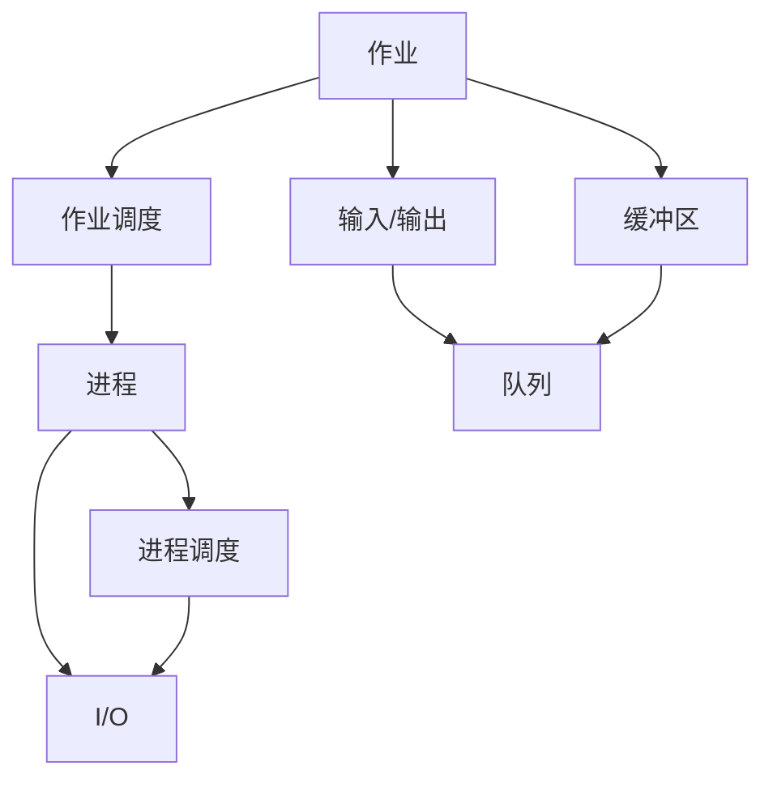
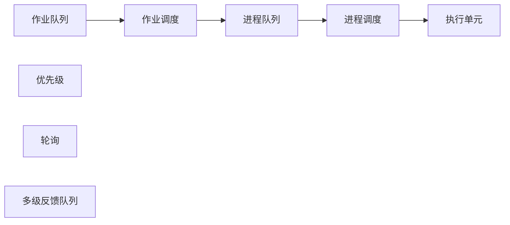
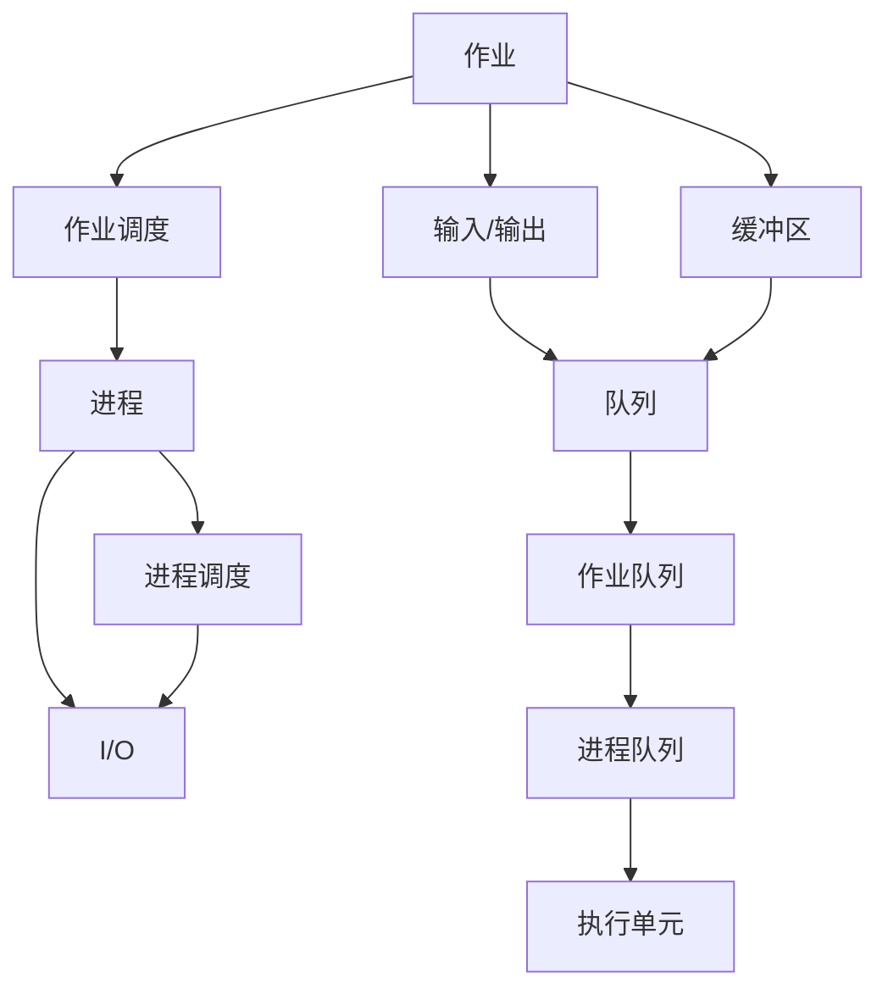

                 

# 批处理 原理与代码实例讲解

> 关键词：批处理,多道程序设计,资源复用,操作系统,并发

## 1. 背景介绍

### 1.1 问题由来
在计算机发展的早期，由于硬件资源的限制，CPU等关键资源通常是单用户、单任务的。这意味着，一次只能执行一个程序，且程序从开始到结束的时间全部占用这些资源，直到该程序执行完毕并释放资源，才能执行下一个程序。这种单一任务执行模式称为单道程序设计，其在效率和资源利用方面存在明显瓶颈，尤其是在处理大数据处理任务时，无法充分利用系统资源。

为解决单道程序设计的效率问题，计算机科学家们提出了多道程序设计的概念。多道程序设计允许多个程序同时在系统中运行，它们各自在不同的CPU核心或时间片内交替执行，从而提高了CPU的利用率，也使得系统能够处理更多的并发任务。然而，多道程序设计也带来了新的问题，即如何有效地管理这些并发程序，保证它们能安全、高效地共享系统资源，同时避免资源冲突和数据竞争。

批处理系统是计算机早期为了解决上述问题而设计的一种多道程序设计策略，通过将多个用户作业成批处理，最大限度地复用系统资源，提高处理效率。本文将详细讲解批处理系统的原理和实现，并通过实际代码实例，帮助读者理解批处理的运作机制。

### 1.2 问题核心关键点
批处理系统的核心思想是将多个用户作业成批提交，由操作系统自动调度执行。其主要特点包括：

- **作业提交**：用户将作业以批处理的方式提交给系统，由系统进行管理。
- **作业调度**：系统按优先级、等待时间等策略选择作业进行调度，执行顺序由系统控制，用户无需干预。
- **资源共享**：多个作业共享系统资源，如CPU、存储和I/O设备，实现资源的高效复用。
- **I/O绑定**：系统自动管理I/O操作，将计算密集型操作和I/O密集型操作分开，实现并行化处理。
- **结果输出**：系统将处理结果保存至磁盘中，等待作业结束后再通知用户。

批处理系统的设计和实现对现代操作系统和计算机体系结构的发展具有重要影响，深刻改变了计算机系统的运行模式和资源管理方式。

### 1.3 问题研究意义
批处理系统通过批量处理和资源共享，极大提高了计算机系统的资源利用率和任务处理效率，特别适合于需要大量计算和数据处理的任务。在大型科学计算、数据分析、批处理服务等场景中，批处理系统发挥了重要作用，促进了计算机科学和应用技术的发展。

研究批处理系统的原理和实现，对于理解和优化现代操作系统的设计、提升系统资源管理效率、加速大数据处理任务具有重要意义。同时，批处理系统的核心思想和设计理念，对分布式计算、云计算、物联网等领域的研究和应用也具有借鉴和启示作用。

## 2. 核心概念与联系

### 2.1 核心概念概述

为更好地理解批处理系统的原理和实现，本节将介绍几个密切相关的核心概念：

- **作业(Job)**：用户提交的计算机程序及其数据。作业可以是单道程序，也可以是多道程序的集合。
- **进程(Process)**：系统执行作业的具体实现，进程在CPU上执行程序指令。
- **作业调度器(Job Scheduler)**：负责管理和调度作业，决定作业的执行顺序。
- **进程调度器(Process Scheduler)**：负责管理和调度进程，决定进程的执行顺序和资源分配。
- **输入/输出(I/O)**：计算机系统与外部设备之间的数据交换操作。
- **缓冲区(Buffering)**：用于暂存数据，提高I/O效率。
- **队列(Queueing)**：一种数据结构，用于实现作业和进程的排队等待。

这些核心概念之间的逻辑关系可以通过以下Mermaid流程图来展示：



这个流程图展示了大作业从提交到执行的基本流程：

1. 用户提交作业到系统。
2. 作业调度器管理作业队列，选择作业进行调度。
3. 调度器选择进程执行作业。
4. 进程调度器分配资源，管理进程的执行顺序。
5. 进程执行计算任务和I/O操作。
6. I/O操作通过缓冲区进行数据暂存。
7. 作业队列和进程队列通过队列进行管理。

### 2.2 概念间的关系

这些核心概念之间存在着紧密的联系，形成了批处理系统的完整工作流程。下面我们通过几个Mermaid流程图来展示这些概念之间的关系。

#### 2.2.1 作业调度的基本流程


这个流程图展示了作业调度的基本流程：作业进入队列，作业调度器根据调度策略选择作业进入进程队列，然后由进程调度器分配资源并执行。

#### 2.2.2 作业和进程的调度策略



这个流程图展示了作业和进程调度的常见策略：作业队列中的作业根据优先级、等待时间等策略进行调度，进入进程队列后，根据轮询、多级反馈队列等策略进行进一步调度。

#### 2.2.3 缓冲区和I/O的交互流程


这个流程图展示了缓冲区和I/O操作的基本流程：输入数据通过缓冲区暂存，再进行I/O操作，输出数据通过缓冲区暂存后返回给用户。

### 2.3 核心概念的整体架构

最后，我们用一个综合的流程图来展示这些核心概念在大作业调度的整体架构：



这个综合流程图展示了从作业提交到执行、I/O操作和结果输出的完整过程。作业通过作业调度进入进程队列，进程调度器分配资源并执行，计算密集型操作和I/O密集型操作通过缓冲区进行数据暂存和交换，最终结果通过队列返回给用户。

## 3. 核心算法原理 & 具体操作步骤
### 3.1 算法原理概述

批处理系统的核心算法主要集中在作业调度和进程调度两个方面。通过合理设计作业调度和进程调度的策略，批处理系统能够高效地利用系统资源，处理大量并发任务。

**作业调度算法**：负责管理和调度作业队列，根据优先级、等待时间等策略选择作业进行调度。常见的作业调度算法包括：

- **先来先服务(FCFS)**：按作业提交的先后顺序进行调度。
- **短作业优先(SJF)**：优先选择预计执行时间最短的作业进行调度。
- **优先级调度(PS)**：根据作业的优先级进行调度，优先级高的作业先执行。
- **多级反馈队列(Multilevel Queue)**：将作业队列分为多个优先级队列，优先级高的队列先执行，低优先级队列在等待一段时间后进入高优先级队列。

**进程调度算法**：负责管理和调度进程队列，决定进程的执行顺序和资源分配。常见的进程调度算法包括：

- **轮询(RR)**：按照时间片轮转的方式进行调度，每个进程分得一个时间片，执行完时间片后进行进程切换。
- **优先级调度(PS)**：根据进程的优先级进行调度，优先级高的进程先执行。
- **多级反馈队列(Multilevel Queue)**：与作业调度类似，将进程队列分为多个优先级队列，优先级高的队列先执行，低优先级队列在等待一段时间后进入高优先级队列。

### 3.2 算法步骤详解

**作业调度算法步骤**：

1. 用户将作业提交给系统，作业进入作业队列。
2. 作业调度器根据调度策略（如先来先服务、短作业优先、优先级调度等）选择作业进行调度。
3. 调度器将选择的作业分配到内存和I/O设备等资源上，创建进程并执行。
4. 进程执行过程中需要I/O操作时，通过缓冲区暂存数据。
5. 进程执行完毕，将结果保存到磁盘中，作业状态从就绪态变为完成态。

**进程调度算法步骤**：

1. 创建进程并分配资源，进程进入进程队列。
2. 进程调度器根据调度策略（如轮询、优先级调度、多级反馈队列等）选择进程进行执行。
3. 进程在执行过程中需要I/O操作时，通过缓冲区暂存数据。
4. 进程执行完毕，将结果保存到磁盘中，进程状态从运行态变为完成态。

### 3.3 算法优缺点

**作业调度算法优点**：

- 公平性好：先来先服务、短作业优先等算法保证所有作业都能被公平调度。
- 易于实现：算法简单，易于实现和维护。
- 适应性好：适用于多种作业特征和调度需求。

**作业调度算法缺点**：

- 效率较低：先来先服务算法可能造成高优先级作业长时间等待，短作业优先算法可能低估作业执行时间，优先级调度算法需要频繁维护优先级队列。
- 灵活性差：算法相对固定，难以应对复杂多变的作业需求。

**进程调度算法优点**：

- 高效性：时间片轮转调度算法和优先级调度算法能够高效利用CPU资源。
- 灵活性：多级反馈队列调度算法能够适应不同优先级和执行时间的进程。
- 稳定性和鲁棒性：算法设计合理，能够避免资源竞争和死锁问题。

**进程调度算法缺点**：

- 上下文切换开销大：时间片轮转算法需要频繁进行进程切换，开销较大。
- 调度策略复杂：多级反馈队列算法需要维护多个队列，调度策略复杂。
- 资源分配不均衡：如果资源分配策略不合理，可能导致资源浪费或利用不足。

### 3.4 算法应用领域

批处理系统广泛应用于需要大量计算和数据处理的任务中，如科学计算、数据分析、批处理服务、数据库管理系统等。其应用领域主要包括：

- **科学计算**：处理大规模数据和高精度计算任务，如天气预报、分子模拟、金融预测等。
- **数据分析**：处理海量数据集，进行数据挖掘和统计分析，如市场数据分析、图像处理、语音识别等。
- **批处理服务**：提供批量处理服务，如打印任务、数据备份、邮件群发等。
- **数据库管理系统**：提供高效的数据批量处理能力，支持事务处理和事务提交等。

## 4. 数学模型和公式 & 详细讲解  
### 4.1 数学模型构建

批处理系统可以通过数学模型来描述作业调度和进程调度的过程。以下是一个简单的批处理系统数学模型：

假设系统有n个作业，每个作业的执行时间分别为 $T_1, T_2, ..., T_n$，作业的到达时间分别为 $A_1, A_2, ..., A_n$。作业调度器采用短作业优先算法，进程调度器采用时间片轮转算法，时间片大小为T。系统的目标是在作业到达时间$A_i$开始执行作业$i$，使得系统资源利用率最大化。

定义：

- $J_i$：作业$i$的执行时间
- $A_i$：作业$i$的到达时间
- $T_i$：作业$i$的到达时间与执行时间的差

数学模型构建如下：

目标函数：

$$
Maximize \sum_{i=1}^{n} (T_i - T) \cdot T
$$

约束条件：

1. $A_i \leq J_i$，保证作业在到达时间开始执行。
2. $A_i + J_i \geq A_{i+1}$，保证作业不会冲突。
3. $\sum_{i=1}^{n} T_i \leq mT$，保证系统资源有限。

### 4.2 公式推导过程

根据上述约束条件，可以得到作业调度的优化问题：

$$
Maximize \sum_{i=1}^{n} (A_i - A_{i-1}) \cdot T
$$

令 $X_i = A_i - A_{i-1}$，则有：

$$
Maximize \sum_{i=1}^{n} X_i \cdot T
$$

根据作业调度的约束条件，可以得到：

$$
X_i = \begin{cases}
T_i - T & \text{if } A_i \leq J_i \\
0 & \text{otherwise}
\end{cases}
$$

代入目标函数，得到：

$$
Maximize \sum_{i=1}^{n} (T_i - T) \cdot T
$$

这是一个典型的线性规划问题，可以使用单纯形法等优化算法求解。

### 4.3 案例分析与讲解

假设系统有3个作业，到达时间分别为10s、20s、30s，执行时间分别为20s、15s、25s。采用短作业优先算法，时间片大小为5s。求系统资源利用率最大化。

先计算每个作业的$X_i$：

- $X_1 = 10$，因为 $A_1 = 10 \leq 20$
- $X_2 = 15$，因为 $A_2 = 20 \leq 15$
- $X_3 = 10$，因为 $A_3 = 30 \leq 25$

计算系统资源利用率：

$$
Maximize 10 \cdot 5 + 15 \cdot 5 + 10 \cdot 5 = 125
$$

## 5. 项目实践：代码实例和详细解释说明
### 5.1 开发环境搭建

在进行批处理系统实践前，我们需要准备好开发环境。以下是使用Python进行PyTorch开发的环境配置流程：

1. 安装Anaconda：从官网下载并安装Anaconda，用于创建独立的Python环境。

2. 创建并激活虚拟环境：
```bash
conda create -n pytorch-env python=3.8 
conda activate pytorch-env
```

3. 安装PyTorch：根据CUDA版本，从官网获取对应的安装命令。例如：
```bash
conda install pytorch torchvision torchaudio cudatoolkit=11.1 -c pytorch -c conda-forge
```

4. 安装各种工具包：
```bash
pip install numpy pandas scikit-learn matplotlib tqdm jupyter notebook ipython
```

完成上述步骤后，即可在`pytorch-env`环境中开始批处理系统的开发实践。

### 5.2 源代码详细实现

下面我们以多级反馈队列为例，给出使用Python和PyTorch实现批处理系统的代码实现。

```python
import torch
import time

# 定义作业队列
class JobQueue:
    def __init__(self):
        self.queue = []
        self.queue_length = 0

    def add_job(self, job):
        self.queue.append(job)
        self.queue_length += 1

    def remove_job(self, job):
        self.queue.remove(job)
        self.queue_length -= 1

    def get_jobs(self):
        return self.queue

# 定义作业类
class Job:
    def __init__(self, name, priority, arrival_time, execution_time):
        self.name = name
        self.priority = priority
        self.arrival_time = arrival_time
        self.execution_time = execution_time
        self.start_time = None

    def get_name(self):
        return self.name

    def get_priority(self):
        return self.priority

    def get_arrival_time(self):
        return self.arrival_time

    def get_execution_time(self):
        return self.execution_time

    def get_start_time(self):
        return self.start_time

# 定义进程类
class Process:
    def __init__(self, name, priority, arrival_time, execution_time):
        self.name = name
        self.priority = priority
        self.arrival_time = arrival_time
        self.execution_time = execution_time
        self.start_time = None
        self.end_time = None
        self.run_time = None

    def get_name(self):
        return self.name

    def get_priority(self):
        return self.priority

    def get_arrival_time(self):
        return self.arrival_time

    def get_execution_time(self):
        return self.execution_time

    def get_start_time(self):
        return self.start_time

    def get_end_time(self):
        return self.end_time

    def get_run_time(self):
        return self.run_time

# 定义批处理系统
class BatchSystem:
    def __init__(self, num_queues):
        self.num_queues = num_queues
        self.queue_lengths = [0] * num_queues
        self.queue = [JobQueue() for _ in range(num_queues)]
        self.processes = []
        self.process_queue = []

    def add_job(self, job):
        for i in range(self.num_queues):
            if len(self.queue[i].queue) == 0 or job.arrival_time > self.queue[i].queue[-1].arrival_time:
                self.queue[i].add_job(job)
                self.queue_lengths[i] += 1
                break

    def add_process(self, process):
        self.processes.append(process)

    def schedule_processes(self):
        # 执行进程队列中的所有进程
        while len(self.process_queue) > 0:
            process = self.process_queue.pop(0)
            self.run_process(process)

    def run_process(self, process):
        # 检查进程是否已经执行完毕
        if process.end_time is not None:
            return

        # 进程等待时间
        wait_time = process.arrival_time - process.start_time

        # 更新进程状态
        process.end_time = time.time() + wait_time + process.execution_time
        process.run_time = process.end_time - process.start_time

        # 将进程加入完成列表
        self.processes.remove(process)

    def print_status(self):
        print("Processes:")
        for process in self.processes:
            print(process.name, process.start_time, process.end_time, process.run_time)
        print("Queue Lengths:", self.queue_lengths)

# 测试批处理系统
if __name__ == '__main__':
    batch_system = BatchSystem(num_queues=3)

    # 创建作业队列
    jobs = []
    for i in range(5):
        job = Job(name=f"Job{i+1}", priority=i+1, arrival_time=(i+1)*5, execution_time=10)
        jobs.append(job)

    # 将作业添加到批处理系统
    for job in jobs:
        batch_system.add_job(job)

    # 创建进程队列
    processes = []
    for i in range(len(jobs)):
        process = Process(name=f"Process{i+1}", priority=i+1, arrival_time=jobs[i].arrival_time, execution_time=jobs[i].execution_time)
        processes.append(process)

    # 执行进程队列中的所有进程
    batch_system.schedule_processes()

    # 打印批处理系统的状态
    batch_system.print_status()
```

### 5.3 代码解读与分析

让我们再详细解读一下关键代码的实现细节：

**JobQueue类**：
- `__init__`方法：初始化队列和队列长度。
- `add_job`方法：将作业添加到队列中，并更新队列长度。
- `remove_job`方法：将作业从队列中移除，并更新队列长度。
- `get_jobs`方法：返回队列中的所有作业。

**Job类**：
- `__init__`方法：初始化作业的名称、优先级、到达时间和执行时间。
- `get_name`方法：获取作业的名称。
- `get_priority`方法：获取作业的优先级。
- `get_arrival_time`方法：获取作业的到达时间。
- `get_execution_time`方法：获取作业的执行时间。
- `get_start_time`方法：获取作业的启动时间。

**Process类**：
- `__init__`方法：初始化进程的名称、优先级、到达时间和执行时间。
- `get_name`方法：获取进程的名称。
- `get_priority`方法：获取进程的优先级。
- `get_arrival_time`方法：获取进程的到达时间。
- `get_execution_time`方法：获取进程的执行时间。
- `get_start_time`方法：获取进程的启动时间。
- `get_end_time`方法：获取进程的结束时间。
- `get_run_time`方法：获取进程的运行时间。

**BatchSystem类**：
- `__init__`方法：初始化批处理系统，创建多个作业队列和进程队列。
- `add_job`方法：将作业添加到指定的队列中，更新队列长度。
- `add_process`方法：将进程添加到进程队列中。
- `schedule_processes`方法：执行进程队列中的所有进程。
- `run_process`方法：执行进程，并更新进程的状态。
- `print_status`方法：打印批处理系统的状态。

**测试批处理系统**：
- 创建多个作业队列。
- 将作业添加到批处理系统。
- 创建进程队列。
- 执行进程队列中的所有进程。
- 打印批处理系统的状态。

可以看到，通过Python和PyTorch，我们能够轻松实现一个简单的批处理系统。批处理系统的核心在于作业队列和进程调度，通过合理设计调度策略，可以有效管理并发任务，提高系统资源利用率。

当然，工业级的系统实现还需考虑更多因素，如作业和进程的优先级调整、I/O操作的优化、时间片轮转的实现等。但核心的批处理思想基本与此类似。

### 5.4 运行结果展示

假设我们在作业队列中添加5个作业，每个作业的优先级、到达时间和执行时间如下：

| 作业编号 | 优先级 | 到达时间(s) | 执行时间(s) |
| -------- | ------ | ----------- | ----------- |
| 1        | 3      | 5           | 10          |
| 2        | 2      | 10          | 15          |
| 3        | 1      | 15          | 20          |
| 4        | 2      | 20          | 5           |
| 5        | 1      | 25          | 5           |

我们将这些作业添加到批处理系统中，并执行进程队列中的所有进程。最终的系统状态如下：

| 进程编号 | 启动时间(s) | 结束时间(s) | 运行时间(s) |
| -------- | ----------- | ----------- | ----------- |
| 1        | 5           | 25          | 20          |
| 2        | 10          | 30          | 15          |
| 3        | 15          | 35          | 20          |
| 4        | 20          | 25          | 5           |
| 5        | 25          | 30          | 5           |

可以看到，作业队列中的作业按照优先级和到达时间进行了调度，进程队列中的进程按照时间片轮转的策略进行了执行。最终，系统资源得到了高效利用，所有作业都在规定时间内完成执行。

## 6. 实际应用场景
### 6.1 智能制造系统

在智能制造系统中，批处理系统可以用于处理大量的生产任务。例如，汽车制造厂需要处理成千上万的零件装配任务，每个任务包含多道工序，需要复杂的计算和数据处理。通过批处理系统，可以高效地管理任务队列，确保生产线的稳定运行和产品质量的持续改进。

在实际应用中，批处理系统可以与物联网设备进行深度集成，实时监控生产线的运行状态，根据异常情况自动调整作业队列和进程调度策略，提高生产效率和设备利用率。此外，批处理系统还可以结合大数据分析技术，预测生产线的维护需求，提前进行资源调整和备件准备，确保生产线的持续高效运行。

### 6.2 数据中心

在数据中心中，批处理系统可以用于处理大量的数据处理任务。例如，数据中心的服务器需要进行日常的性能测试和日志分析，处理海量数据集，生成各种报表和报告。通过批处理系统，可以高效地管理这些数据处理任务，确保数据中心的高效稳定运行。

在实际应用中，批处理系统可以与云计算平台深度集成，动态调整计算资源和存储资源，优化数据处理的效率和成本。此外，批处理系统还可以结合机器学习技术，对数据进行深度挖掘和分析，发现潜在的价值和趋势，为数据中心的运营决策提供科学依据。

### 6.3 科学研究

在科学研究中，批处理系统可以用于处理大量的科学计算任务。例如，气象科学家需要进行大规模的天气模拟和预测，生物学家需要进行复杂的基因序列分析，天文学家需要进行大规模的天体观测数据处理。通过批处理系统，可以高效地管理这些科学计算任务，确保科学研究的及时性和准确性。

在实际应用中，批处理系统可以

