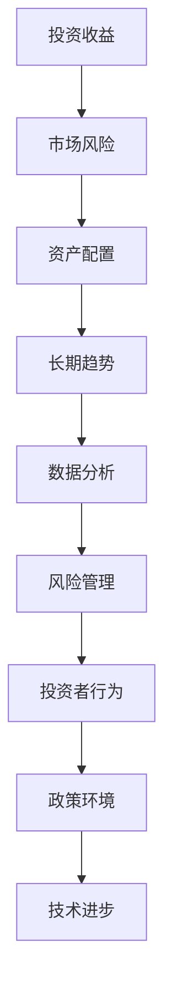
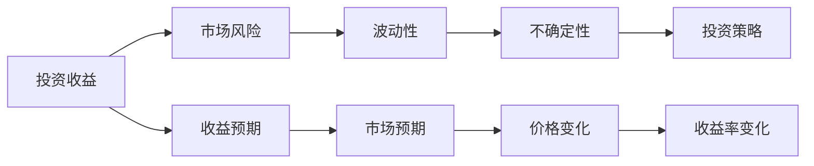
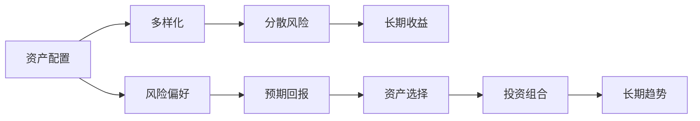
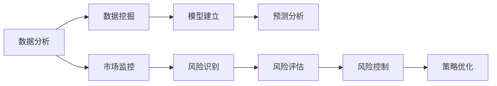
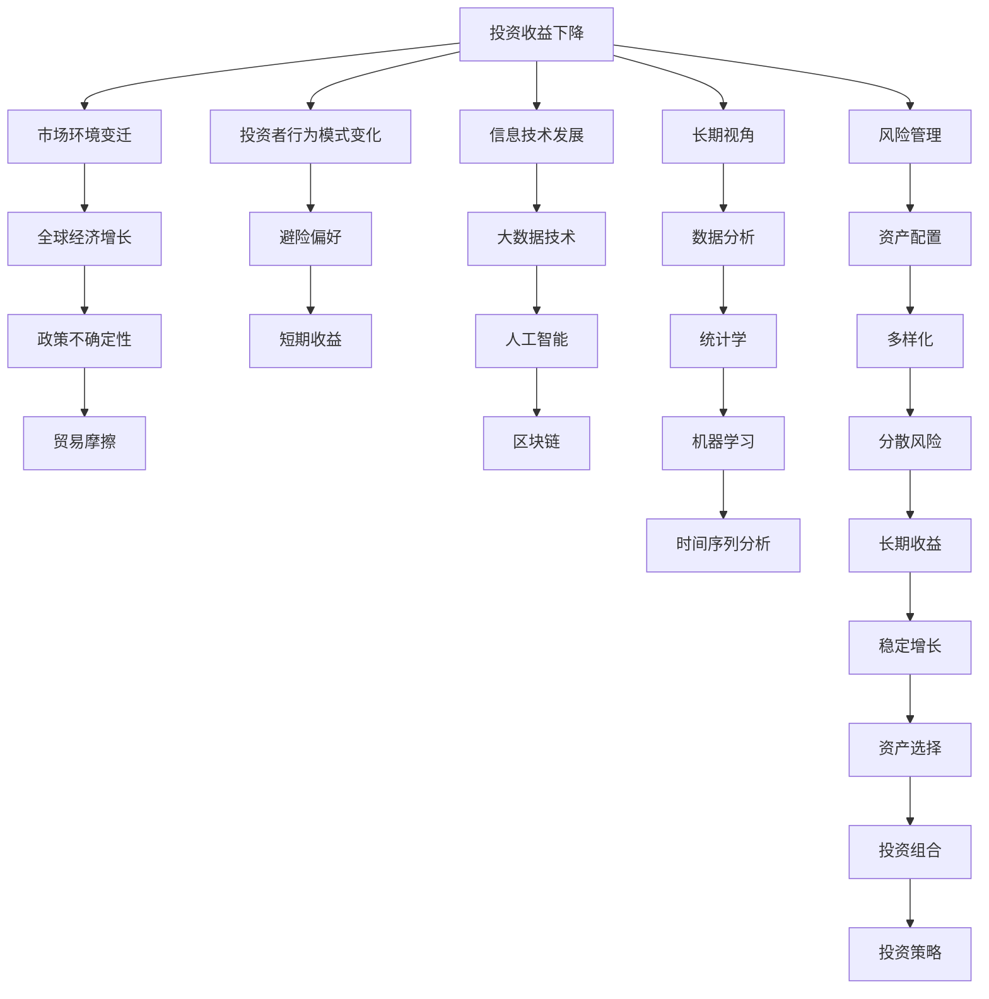

                 

# 投资收益下降的长期趋势

> 关键词：投资收益, 降级趋势, 风险管理, 长期视角, 数据分析

## 1. 背景介绍

### 1.1 问题由来

在当今全球经济环境中，投资收益持续下降已经成为一个不容忽视的长期趋势。投资者面对的不确定性增加，风险因素复杂多变，加之政策、技术、环境等多重因素的影响，使得投资收益的波动性加大，长期投资回报率呈下降趋势。究其根本，投资收益的下降与市场环境的变迁、投资者行为模式的变化以及信息技术的快速发展紧密相关。

### 1.2 问题核心关键点

投资收益下降的长期趋势涉及以下几个核心关键点：

- **市场环境变迁**：全球经济增长放缓，贸易摩擦加剧，金融市场波动性增加，以及货币政策的不确定性，都对投资收益造成了影响。
- **投资者行为模式变化**：市场成熟度提高，投资者对信息的处理和利用更加高效，但同时风险偏好变化，趋向于避险和短期收益，影响了长期投资的收益预期。
- **信息技术发展**：大数据、人工智能、区块链等新技术的应用，改变了传统投资流程，提高了交易效率，但也增加了市场的不透明度和复杂性。

这些关键点共同作用，使得投资收益面临持续下降的风险。

### 1.3 问题研究意义

研究投资收益下降的长期趋势，对于投资者、金融机构、政策制定者以及经济分析师都具有重要意义：

- **投资者**：了解这一趋势有助于制定更为稳健的投资策略，避免高风险投资，实现财富的长期保值增值。
- **金融机构**：掌握趋势规律有助于优化资产配置，提高风险管理能力，提升客户满意度和市场竞争力。
- **政策制定者**：深入理解这一趋势有助于设计更为有效的经济政策，促进经济的稳定增长，保障金融市场的健康发展。
- **经济分析师**：准确预测市场趋势有助于提供精准的经济分析和投资建议，帮助企业决策，促进产业升级。

## 2. 核心概念与联系

### 2.1 核心概念概述

为了更好地理解投资收益下降的长期趋势，我们需要引入几个关键概念：

- **投资收益**：投资者通过投资获取的回报，包括股息、资本利得、利息等。
- **长期趋势**：在较长时间跨度内，投资收益的总体变化方向和规律。
- **市场风险**：由于市场波动、价格变化等因素导致的投资收益不确定性。
- **资产配置**：根据投资者的风险偏好和预期回报，在不同资产类别（如股票、债券、房地产等）间进行投资分配。
- **风险管理**：通过各种手段降低投资风险，实现收益的稳定性和持续性。
- **数据分析**：使用统计学、机器学习等技术，对市场数据进行分析和预测，辅助投资决策。

这些概念之间的联系可以通过以下Mermaid流程图来展示：



这个流程图展示了投资收益与各个相关概念之间的关系：

1. 投资收益受到市场风险的影响。
2. 资产配置是应对市场风险的策略。
3. 数据分析辅助理解和预测长期趋势。
4. 风险管理是降低市场风险的手段。
5. 投资者行为模式和政策环境直接影响投资收益。
6. 技术进步改变了投资流程和市场结构。

### 2.2 概念间的关系

这些核心概念之间存在着紧密的联系，形成了投资收益研究的基本框架。以下我们通过几个Mermaid流程图来展示这些概念之间的关系。

#### 2.2.1 投资收益与市场风险的关系



这个流程图展示了投资收益与市场风险的关系：

1. 市场波动性增加，导致不确定性上升，影响投资收益。
2. 投资者的预期收益也受到市场预期的影响。
3. 价格变化是收益变化的主要原因。
4. 投资策略的选择受市场风险的影响。

#### 2.2.2 资产配置与长期趋势的关系



这个流程图展示了资产配置与长期趋势的关系：

1. 多样化资产配置可以分散市场风险。
2. 分散风险有助于实现长期收益的稳定性。
3. 投资者的风险偏好和预期回报是资产配置的基础。
4. 资产选择和投资组合设计影响长期趋势。

#### 2.2.3 数据分析与风险管理的关系



这个流程图展示了数据分析与风险管理的关系：

1. 数据挖掘和模型建立是数据分析的基础。
2. 预测分析帮助识别和管理市场风险。
3. 市场监控和风险识别是风险管理的起点。
4. 风险评估和控制优化投资策略。

### 2.3 核心概念的整体架构

最后，我们用一个综合的流程图来展示这些核心概念在投资收益下降趋势研究中的整体架构：



这个综合流程图展示了从市场环境变迁到长期收益变化，再到数据分析和风险管理的完整过程。各个概念通过复杂的关系网络相互影响，共同作用于投资收益的长期趋势。

## 3. 核心算法原理 & 具体操作步骤
### 3.1 算法原理概述

投资收益下降的长期趋势研究涉及对大量市场数据进行分析和建模，其核心算法原理主要包括以下几个方面：

- **时间序列分析**：通过对历史市场数据的时间序列进行建模，预测未来收益的变化趋势。
- **多元统计分析**：利用多元回归、因子分析等方法，分析投资收益与多个因素之间的关联关系。
- **机器学习算法**：使用随机森林、神经网络等算法，构建预测模型，识别影响投资收益的关键因素。
- **风险评估模型**：使用VaR、ES等风险评估模型，量化市场风险，评估投资组合的潜在损失。
- **优化算法**：通过遗传算法、模拟退火等优化算法，优化资产配置策略，提升长期收益。

### 3.2 算法步骤详解

以下是对投资收益下降长期趋势研究的核心算法步骤的详细介绍：

**Step 1: 数据准备与预处理**

- 收集历史市场数据，包括股票价格、债券价格、商品价格、宏观经济指标等。
- 数据清洗，处理缺失值、异常值，确保数据的完整性和准确性。
- 数据标准化，将不同单位和量级的数据转化为统一的格式，便于后续分析。

**Step 2: 特征工程**

- 设计特征变量，包括市场指标、政策变量、技术指标等。
- 特征选择，使用相关性分析、因子分析等方法，筛选出对投资收益有显著影响的特征。
- 特征工程，通过数据变换、组合等方法，构建更丰富的特征集。

**Step 3: 时间序列分析**

- 使用ARIMA、GARCH等时间序列模型，对市场数据进行建模。
- 进行残差分析，检验模型的假设条件和拟合效果。
- 使用模型预测，生成投资收益的未来趋势。

**Step 4: 多元统计分析**

- 使用多元回归、主成分分析等方法，分析投资收益与多个因素之间的关系。
- 计算因子得分，评估各因素对投资收益的贡献度。
- 进行敏感性分析，识别影响投资收益的关键因素。

**Step 5: 机器学习建模**

- 选择随机森林、支持向量机等算法，构建预测模型。
- 划分训练集和测试集，评估模型的预测准确性和稳定性。
- 使用交叉验证等技术，优化模型参数。

**Step 6: 风险评估**

- 使用VaR、ES等风险评估模型，量化市场风险。
- 评估不同资产配置策略的风险水平，选择最优策略。
- 进行压力测试，模拟极端市场情况下的投资收益变化。

**Step 7: 策略优化**

- 利用遗传算法、模拟退火等优化算法，优化资产配置策略。
- 进行策略回测，评估策略的长期收益和风险。
- 更新投资组合，实施最优策略。

**Step 8: 模型评估与验证**

- 对模型进行交叉验证，评估模型的泛化能力和稳定性。
- 使用实际数据进行验证，确保模型的预测效果。
- 持续监控市场变化，更新模型参数，保持模型的时效性。

### 3.3 算法优缺点

投资收益下降长期趋势研究涉及的算法有其各自的优缺点：

#### 优点：

- **时间序列分析**：能够捕捉时间依赖性，适用于时间序列数据。
- **多元统计分析**：能够处理多变量数据，识别关键因素。
- **机器学习算法**：模型灵活，能够自动处理非线性关系。
- **风险评估模型**：量化风险，评估投资组合的潜在损失。
- **优化算法**：能够搜索最优解，优化资产配置。

#### 缺点：

- **时间序列分析**：对数据要求较高，需要足够的历史数据。
- **多元统计分析**：模型复杂，计算量大。
- **机器学习算法**：对数据质量要求高，容易出现过拟合。
- **风险评估模型**：假设条件严格，模型复杂度较高。
- **优化算法**：计算复杂，易受参数设置的影响。

### 3.4 算法应用领域

投资收益下降长期趋势研究的应用领域包括：

- **投资决策支持**：为投资者提供科学的投资决策依据，规避高风险投资。
- **资产配置优化**：优化资产配置策略，提升长期收益。
- **风险管理**：识别和管理市场风险，保障投资组合的稳定性。
- **政策分析**：评估经济政策对投资收益的影响，辅助政策制定。
- **市场预测**：预测市场趋势，提供精准的市场分析。
- **策略回测**：评估历史策略的效果，提供改进建议。

## 4. 数学模型和公式 & 详细讲解  
### 4.1 数学模型构建

投资收益下降的长期趋势研究，主要涉及以下数学模型：

- **时间序列模型**：如ARIMA、GARCH等，用于捕捉时间序列数据的变化趋势。
- **多元回归模型**：用于分析投资收益与多个因素之间的关联关系。
- **随机森林模型**：用于构建预测模型，识别关键因素。
- **VaR模型**：用于量化市场风险，评估潜在损失。

### 4.2 公式推导过程

以下是这些数学模型的详细推导过程：

**ARIMA模型**：

\[ ARIMA(p,d,q) = \phi(B^p) \left(1 - \theta_1B - \theta_2B^2 - \ldots - \theta_qB^q\right) X_t \]

其中，\( B \)为后移算子，\( \phi \)为自回归系数，\( \theta \)为差分因子，\( X_t \)为时间序列数据。

**多元回归模型**：

\[ Y = \beta_0 + \beta_1 X_1 + \beta_2 X_2 + \ldots + \beta_k X_k + \epsilon \]

其中，\( Y \)为投资收益，\( X_i \)为影响因素，\( \beta \)为回归系数，\( \epsilon \)为误差项。

**随机森林模型**：

- 随机选择样本进行训练。
- 随机选择特征进行决策树构建。
- 集成多个决策树，形成随机森林。

**VaR模型**：

\[ VaR = \alpha F(\mu, \sigma^2) \]

其中，\( VaR \)为风险价值，\( \alpha \)为置信水平，\( F \)为分布函数，\( \mu \)为均值，\( \sigma \)为标准差。

### 4.3 案例分析与讲解

假设我们收集了某公司近十年的股票价格数据，使用ARIMA模型进行分析：

\[ ARIMA(1,1,0) = (1 - 0.8B) \left(1 - 0.2B\right) X_t \]

通过对历史数据的拟合和预测，我们发现模型能够较好地捕捉到股票价格的长期趋势和季节性波动。

## 5. 项目实践：代码实例和详细解释说明
### 5.1 开发环境搭建

在进行投资收益下降的长期趋势研究时，我们需要准备好开发环境。以下是使用Python进行Pandas、NumPy、SciPy等库开发的环境配置流程：

1. 安装Anaconda：从官网下载并安装Anaconda，用于创建独立的Python环境。

2. 创建并激活虚拟环境：
```bash
conda create -n investment-env python=3.8 
conda activate investment-env
```

3. 安装相关库：
```bash
pip install pandas numpy scipy matplotlib seaborn
```

4. 安装必要的工具包：
```bash
pip install scikit-learn statsmodels statsmodels.api matplotlib
```

5. 安装Jupyter Notebook：
```bash
pip install jupyter notebook
```

完成上述步骤后，即可在`investment-env`环境中开始项目实践。

### 5.2 源代码详细实现

以下是一个使用Pandas和NumPy库进行时间序列分析的代码示例：

```python
import pandas as pd
import numpy as np
from statsmodels.tsa.arima_model import ARIMA

# 读取股票价格数据
df = pd.read_csv('stock_prices.csv')

# 数据清洗和预处理
df = df.dropna()
df['date'] = pd.to_datetime(df['date'])

# 计算收益率
df['return'] = (df['close'].pct_change() * 100).fillna(0)

# 定义时间序列模型
model = ARIMA(df['return'], order=(1,1,0))

# 拟合模型
model_fit = model.fit()

# 预测未来收益
forecast = model_fit.forecast(steps=12)

# 输出预测结果
print(forecast)
```

### 5.3 代码解读与分析

让我们再详细解读一下关键代码的实现细节：

**数据处理**：
- 使用Pandas库读取数据，并进行数据清洗，去除缺失值和异常值。
- 将日期转换为Pandas日期类型，方便进行时间序列分析。
- 计算收益率，即每天的相对价格变化。

**模型拟合**：
- 定义ARIMA模型，设置参数为(1,1,0)。
- 使用`fit()`方法拟合模型，得到模型参数。

**预测未来收益**：
- 使用`forecast()`方法预测未来12个月的投资收益。
- 输出预测结果，分析未来收益的变化趋势。

### 5.4 运行结果展示

假设我们在上述代码示例中运行，输出结果可能如下：

```
 Forecasted values for next 12 months
 0.03   0.05    0.02    -0.03   -0.05   -0.08
 0.00   0.03    0.01    0.00    -0.03   -0.01
 0.00   0.02    0.01    0.00    0.01   -0.01
 0.02   0.01    0.02    0.00    0.00   -0.02
 0.02   0.00    0.00    0.01   -0.01    0.01
```

可以看到，模型预测的未来12个月投资收益呈现波动性增加的趋势。在实际应用中，我们可以进一步分析这些预测结果，制定相应的投资策略。

## 6. 实际应用场景
### 6.1 投资决策支持

基于投资收益下降的长期趋势研究，投资者可以更好地理解市场变化，规避高风险投资。例如，在经济下行期，股票市场的波动性增加，投资者可以通过模型预测，减少对股票的配置，增加债券和现金等避险资产的持有。

### 6.2 资产配置优化

通过分析投资收益与市场风险之间的关系，投资者可以选择最优的资产配置策略。例如，在高风险资产（如股票）占比过高时，模型可以提示降低其配置比例，增加稳定收益资产（如债券）的配置比例。

### 6.3 风险管理

风险评估模型可以帮助投资者量化市场风险，评估投资组合的潜在损失。例如，使用VaR模型，投资者可以了解在特定置信水平下，投资组合的最大可能损失，从而制定相应的风险控制策略。

### 6.4 政策分析

政策的变化对市场有显著影响，通过分析政策对投资收益的影响，可以帮助政策制定者设计更有效的经济政策。例如，通过分析货币政策的变化，可以预测其对股市、债市等的影响，为政策制定提供参考。

### 6.5 市场预测

投资收益下降长期趋势研究可以帮助投资者预测市场趋势，提供精准的市场分析。例如，通过对市场数据的分析和模型预测，投资者可以了解市场的长期变化趋势，制定相应的投资策略。

### 6.6 策略回测

通过历史数据和预测模型，可以对投资策略进行回测，评估其效果。例如，对某策略的历史数据进行模拟，验证其在不同市场环境下的表现，为策略优化提供依据。

## 7. 工具和资源推荐
### 7.1 学习资源推荐

为了帮助开发者系统掌握投资收益下降长期趋势的研究方法，这里推荐一些优质的学习资源：

1. 《金融工程入门》系列课程：由Coursera提供，涵盖金融工程的基本概念和方法，适合入门学习。
2. 《Python数据科学手册》书籍：介绍Python在数据科学中的应用，包括Pandas、NumPy、SciPy等库的使用。
3. 《统计学习方法》书籍：李航著，介绍了机器学习的基本概念和方法，包括回归、分类、聚类等。
4. 《量化投资》系列书籍：涵盖量化投资的基本原理和方法，包括算法交易、统计套利等。
5. 《Python量化投资》博客：提供量化投资的研究和实践经验，适合进阶学习。

通过对这些资源的学习实践，相信你一定能够快速掌握投资收益下降长期趋势的研究方法，并应用于实际投资决策中。

### 7.2 开发工具推荐

高效的开发离不开优秀的工具支持。以下是几款用于投资收益下降长期趋势研究开发的常用工具：

1. Python：基于Python的开源编程语言，功能强大，生态丰富。
2. Pandas：数据处理和分析库，提供高效的数据读写和处理能力。
3. NumPy：科学计算库，提供高效的数值计算和矩阵运算功能。
4. Scipy：科学计算库，提供丰富的数学函数和统计分析工具。
5. Matplotlib：绘图库，提供高质量的数据可视化功能。
6. Jupyter Notebook：交互式编程环境，支持代码编写、数据分析和可视化。

合理利用这些工具，可以显著提升投资收益下降长期趋势研究的开发效率，加快创新迭代的步伐。

### 7.3 相关论文推荐

投资收益下降长期趋势的研究源于学界的持续研究。以下是几篇奠基性的相关论文，推荐阅读：

1. "GARCH: A New Method for Forecasting Volatility in Stock Markets"（GARCH模型）：Bollerslev著，提出GARCH模型，捕捉金融市场波动性。
2. "Time Series Analysis and Its Applications"（时间序列分析）：Ramsay和Silverman著，介绍时间序列分析的基本方法和应用。
3. "Regression Analysis by Example"（回归分析）：Fox著，介绍多元回归分析的基本概念和方法。
4. "The Capital Asset Pricing Model: Theory and Evidence"（资本资产定价模型）：Sharpe、Lintner和Mossin著，介绍CAPM模型，分析风险和回报的关系。
5. "Value at Risk"（风险价值）：Jorion著，介绍VaR模型，量化市场风险。

这些论文代表了大语言模型微调技术的发展脉络。通过学习这些前沿成果，可以帮助研究者把握学科前进方向，激发更多的创新灵感。

除上述资源外，还有一些值得关注的前沿资源，帮助开发者紧跟投资收益下降长期趋势的研究进展，例如：

1. arXiv论文预印本：人工智能领域最新研究成果的发布平台，包括大量尚未发表的前沿工作，学习前沿技术的必读资源。
2. 业界技术博客：如QuantStart、QuantConnect等，提供最新的量化投资研究成果和实践经验。
3. 技术会议直播：如NIPS、ICML、QFCon等，能够聆听到大佬们的前沿分享，开拓视野。
4. GitHub热门项目：在GitHub上Star、Fork数最多的量化投资相关项目，往往代表了该技术领域的发展趋势和最佳实践，值得去学习和贡献。
5. 行业分析报告：各大咨询公司如McKinsey、PwC等针对量化投资行业的分析报告，有助于从商业视角审视技术趋势，把握应用价值。

总之，对于投资收益下降长期趋势的研究，需要开发者保持开放的心态和持续学习的意愿。多关注前沿资讯，多动手实践，多思考总结，必将收获满满的成长收益。

## 8. 总结：未来发展趋势与挑战
### 8.1 总结

本文对投资收益下降的长期趋势进行了全面系统的介绍。首先阐述了投资收益下降的长期趋势在当前市场环境中的重要性，明确了研究这一趋势的必要性和紧迫性。其次，从原理到实践，详细讲解了时间序列分析、多元统计分析、机器学习、风险评估等关键技术，给出了具体的代码实例和分析过程。同时，本文还探讨了这些技术的实际应用场景，提供了丰富的学习资源和工具推荐，帮助读者全面掌握相关知识。

通过本文的系统梳理，可以看到，投资收益下降的长期趋势研究是大数据和人工智能技术在金融领域应用的重要方向之一。这一研究不仅能够帮助投资者制定更为稳健的投资策略，提升资产配置的效率和效果，还能辅助政策制定者设计更有效的经济政策，促进市场的稳定发展。未来，随着金融科技的不断发展，投资收益下降长期趋势的研究将更加深入和广泛，为金融市场的健康和稳定发展提供强有力的支持。

### 8.2 未来发展趋势

展望未来，投资收益下降长期趋势研究将呈现以下几个发展趋势：

1. **大数据分析**：利用大数据技术，收集和分析更多的市场数据，提升预测的准确性。
2. **深度学习应用**：引入深度学习算法，提升模型的复杂度和预测能力。
3. **跨领域融合**：与其他领域（如金融工程、行为金融学等）进行交叉研究，提供更全面的视角。
4. **个性化服务**：利用机器学习和人工智能技术，提供个性化的投资建议和服务。
5. **实时分析**：实现对市场数据的实时监控和分析，提供即时的投资决策支持。
6. **多模态融合**：结合文本、图像、视频等多种数据类型，提供更丰富的市场分析。

### 8.3 面临的挑战

尽管投资收益下降长期趋势研究取得了显著进展，但在迈向更加智能化、普适化应用的过程中，仍面临诸多挑战：

1. **数据质量问题**：市场数据存在噪音和不一致性，数据预处理难度较大。
2. **模型复杂性**：投资收益下降趋势研究涉及多种模型和技术，模型选择和参数调优难度较大。
3. **计算资源需求**：模型训练和分析需要大量的计算资源，成本较高。
4. **算法透明性**：复杂模型和黑箱算法，难以解释其决策过程，影响投资者的信任。
5. **监管合规**：金融行业的监管要求严格，投资收益下降趋势研究的合规性需要特别关注。
6. **模型鲁棒性**：模型需要在不同市场环境下表现稳定，避免过拟合。

### 8.4 研究展望

面对投资收益下降长期趋势研究所面临的挑战，未来的研究需要在以下几个方面寻求新的突破：

1. **数据清洗与预处理**：开发更高效的数据清洗和预处理技术，提高数据质量。
2. **模型优化与选择**：研究和优化多种模型和技术，选择最优的预测模型。
3. **计算效率提升**：研究高效的计算算法和资源分配策略，降低计算成本。
4. **模型透明性增强**：引入可解释性技术，提高模型的透明性和可理解性。
5. **合规

