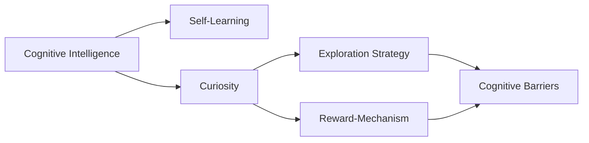
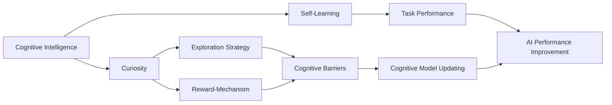
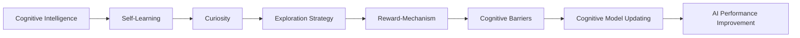

                 

# 探索与理解：好奇心的力量

> 关键词：探索,好奇心,人工智能,认知智能,自我学习,算法优化,问题解决

## 1. 背景介绍

### 1.1 问题由来
在当下快速发展的数字时代，人工智能(AI)技术已经渗透到我们生活的方方面面。无论是智能助手、无人驾驶、个性化推荐，还是医疗诊断、金融分析，AI正以其独特的方式改变着我们的生活方式。然而，在享受这些便利的同时，我们也不禁思考：AI究竟是如何学会这些复杂的任务？是什么驱使AI不断进步？

好奇心（Curiosity）在这个过程中扮演了至关重要的角色。它不仅是人类智慧的源泉，也是推动AI技术不断突破的强大动力。本文将深入探讨好奇心在AI发展中的作用，并试图通过认知智能和自我学习等概念，理解AI的探索能力，以及如何通过算法优化和问题解决技术，激发和引导AI的探索精神。

### 1.2 问题核心关键点
好奇心在AI中主要体现在两个方面：认知智能和自我学习。认知智能是指AI能够理解环境、感知变化，并基于此进行决策和行动的能力；而自我学习则是指AI能够从经验中学习，不断优化自身算法和模型，从而提高解决问题的效率。

在认知智能中，好奇心促使AI不断探索新的环境和任务，了解和适应复杂多变的世界。在自我学习中，好奇心驱动AI不断地试错和调整，寻找最优的解决方案。两者相辅相成，共同推动AI技术的发展和应用。

### 1.3 问题研究意义
研究好奇心在AI中的作用，对于理解AI技术的发展机理，指导AI的创新应用，以及激发人类对AI的探索欲望，具有重要意义：

1. 促进AI技术的创新。好奇心驱动AI不断探索未知领域，为新技术的发明和应用提供了源源不断的动力。
2. 提升AI应用的实际价值。通过对环境的深入理解和认知，AI可以更好地适应复杂场景，提高决策的准确性和效率。
3. 增强人类与AI的互动。好奇心不仅能激发AI的探索精神，也能激发人类的探索欲望，为人类和AI之间的互动提供新的视角。
4. 探索AI的伦理和安全问题。好奇心驱动下的AI探索，可能会触及伦理和安全边界，我们需要对其进行合理的引导和规范。

## 2. 核心概念与联系

### 2.1 核心概念概述

为了更好地理解好奇心在AI中的作用，我们首先介绍几个核心概念：

- **认知智能(Cognitive Intelligence, CI)**：AI通过感知和理解环境，进行决策和行动的能力。
- **自我学习(Self-Learning)**：AI从经验中学习，不断优化自身算法和模型的过程。
- **好奇心(Curiosity)**：AI主动探索环境、了解新知识的欲望。
- **探索策略(Exploration Strategy)**：指导AI如何进行有效探索的技术手段。
- **奖惩机制(Reward-Mechanism)**：通过设计合理的奖惩措施，引导AI进行有目的的探索。
- **认知障碍(Cognitive Barriers)**：AI在探索过程中遇到的困难和挑战。

这些概念之间存在着紧密的联系，通过探索策略和奖惩机制，好奇心驱动AI克服认知障碍，进行有效的自我学习。以下Mermaid流程图展示了这些概念之间的关系：



这个流程图展示了从认知智能到自我学习，再到好奇心的探索过程，以及探索策略和奖惩机制在其中的作用。

### 2.2 概念间的关系

这些核心概念之间的关系可以更详细地通过以下Mermaid流程图来展示：



这个流程图进一步展示了探索策略和奖惩机制如何通过克服认知障碍，促进自我学习，从而提高AI的任务性能。

### 2.3 核心概念的整体架构

最后，我们将这些概念整合成一个大图，展示它们在大规模探索和学习过程中发挥的作用：



这个图展示了从认知智能出发，通过好奇心和探索策略，克服认知障碍，最终实现AI性能提升的全过程。

## 3. 核心算法原理 & 具体操作步骤
### 3.1 算法原理概述

基于好奇心的AI探索和学习，本质上是一种自我优化的过程。其核心原理是通过优化算法和模型，不断试错和调整，以达到最优的探索目标。

以强化学习(RL)为例，其基本原理是：

1. **环境感知**：AI通过传感器或算法，感知当前环境的状态。
2. **动作选择**：AI根据当前状态，选择一组动作进行探索。
3. **反馈获取**：AI从环境中获取反馈信号，如奖励、惩罚等。
4. **模型更新**：AI根据反馈信号，更新自身的认知模型，调整动作策略。

这个循环过程不断重复，AI逐渐学习到最优的动作策略，从而实现高效的探索和任务完成。

### 3.2 算法步骤详解

基于好奇心的AI探索和学习，一般包括以下几个关键步骤：

**Step 1: 准备环境与数据集**
- 设计一个具有复杂多变特征的环境，用于测试AI的探索能力。
- 准备标注数据集，用于训练AI的认知模型。

**Step 2: 设计探索策略**
- 选择合适的探索策略，如随机搜索、贝叶斯优化、演化算法等。
- 设置探索的范围和目标，如覆盖整个环境或达到特定性能指标。

**Step 3: 实施探索**
- 根据探索策略，AI在环境中不断尝试不同的动作，获取反馈。
- 记录每次尝试的输入、输出和反馈，形成探索日志。

**Step 4: 分析与反馈**
- 对探索日志进行分析，评估AI的探索效果。
- 根据反馈，调整探索策略和动作选择，优化AI的行为。

**Step 5: 模型更新与优化**
- 使用机器学习算法，更新AI的认知模型。
- 引入奖惩机制，提升AI的探索动机和效果。

**Step 6: 性能评估**
- 在新的环境中测试AI的性能，评估探索效果。
- 根据性能评估结果，调整探索策略和奖惩机制。

### 3.3 算法优缺点

基于好奇心的AI探索和学习，具有以下优点：

1. **高效探索**：通过优化算法和模型，AI能够在有限时间内覆盖更多的探索空间。
2. **自适应性强**：AI能够根据环境反馈，不断调整策略和模型，适应复杂多变的任务。
3. **可解释性强**：通过记录和分析探索日志，理解AI的决策过程，提供更透明的AI系统。

但同时也存在一些缺点：

1. **计算成本高**：探索和优化过程需要大量的计算资源，尤其是在高维空间中。
2. **模型复杂度高**：复杂环境的认知模型和探索策略，增加了模型的复杂度和训练难度。
3. **探索风险大**：盲目探索可能导致AI陷入局部最优，甚至无法找到最优解。

### 3.4 算法应用领域

基于好奇心的AI探索和学习，已在多个领域得到应用，例如：

- **智能推荐系统**：通过不断探索用户行为模式，推荐系统能够提供更加个性化的推荐内容。
- **无人驾驶**：无人车通过在复杂道路环境中的探索和学习，实现自主导航和避障。
- **机器人控制**：机器人通过探索不同环境下的动作，优化控制策略，提升自主操作能力。
- **医疗诊断**：AI通过探索海量医疗数据，学习疾病诊断知识，辅助医生进行精准诊断。
- **游戏AI**：游戏AI通过探索游戏环境，学习最优游戏策略，提升游戏竞争力。

这些应用展示了基于好奇心的AI探索和学习在实际场景中的巨大潜力。

## 4. 数学模型和公式 & 详细讲解  
### 4.1 数学模型构建

基于好奇心的AI探索和学习，可以使用数学模型进行形式化描述。

记环境状态为 $S$，动作为 $A$，奖励为 $R$，模型参数为 $\theta$。假设AI的探索目标为最大化累计奖励 $J$，则探索过程可以表示为：

$$
J = \mathbb{E}\left[\sum_{t=0}^{\infty} \gamma^t R_t | S_0, \theta\right]
$$

其中 $\gamma$ 为折扣因子，用于平衡短期和长期奖励。

### 4.2 公式推导过程

为了最大化累计奖励 $J$，AI通过模型 $Q(S_t, A_t)$ 评估当前状态 $S_t$ 和动作 $A_t$ 的累积奖励，并通过策略 $\pi(A_t|S_t)$ 选择动作 $A_t$。最优策略 $\pi^*$ 满足：

$$
\pi^*(A_t|S_t) = \arg\max_{A} Q(S_t, A_t)
$$

在强化学习中，通常使用Q-learning算法更新模型参数 $\theta$，具体公式为：

$$
Q(S_t, A_t) \leftarrow Q(S_t, A_t) + \alpha [R_t + \gamma \max_{A} Q(S_{t+1}, A_{t+1}) - Q(S_t, A_t)]
$$

其中 $\alpha$ 为学习率，用于平衡探索和利用的关系。

### 4.3 案例分析与讲解

以AlphaGo为例，其探索过程可以视为一个复杂的强化学习问题。AlphaGo通过自我对弈，不断探索新的棋局策略，通过蒙特卡罗树搜索(MCTS)算法评估每个棋子的价值，通过神经网络模型更新棋局评估函数。

具体而言，AlphaGo分为两个部分：策略网络(Policy Network)和价值网络(Value Network)。策略网络用于选择下一步棋，价值网络用于评估当前局面的胜率。通过这两个网络的协同工作，AlphaGo能够在围棋这种高度复杂的游戏中取得突破性进展。

## 5. 项目实践：代码实例和详细解释说明
### 5.1 开发环境搭建

在进行AI探索和学习的实践时，我们需要准备好开发环境。以下是使用Python进行TensorFlow开发的流程：

1. 安装Anaconda：从官网下载并安装Anaconda，用于创建独立的Python环境。

2. 创建并激活虚拟环境：
```bash
conda create -n tf-env python=3.8 
conda activate tf-env
```

3. 安装TensorFlow：根据CUDA版本，从官网获取对应的安装命令。例如：
```bash
conda install tensorflow -c tf -c conda-forge
```

4. 安装各类工具包：
```bash
pip install numpy pandas scikit-learn matplotlib tqdm jupyter notebook ipython
```

5. 安装TensorBoard：
```bash
pip install tensorboard
```

完成上述步骤后，即可在`tf-env`环境中开始探索和学习的实践。

### 5.2 源代码详细实现

这里我们以AlphaGo为例，展示如何在TensorFlow中进行探索和学习。

首先，定义探索策略：

```python
import tensorflow as tf

class AlphaGo:
    def __init__(self, model, discount_factor=0.95, exploration_rate=1.0):
        self.model = model
        self.discount_factor = discount_factor
        self.exploration_rate = exploration_rate
        self.sess = tf.Session()
        self.sess.run(tf.global_variables_initializer())
    
    def choose_action(self, state):
        if tf.random_uniform([]) < self.exploration_rate:
            # 随机探索
            action = np.random.randint(0, self.model.output_size)
        else:
            # 策略选择
            q_values = self.sess.run(self.model.q_values, feed_dict={self.model.inputs: state})
            action = np.argmax(q_values)
        return action
```

然后，定义模型：

```python
class AlphaGoModel(tf.keras.Model):
    def __init__(self, input_size, output_size):
        super(AlphaGoModel, self).__init__()
        self.inputs = tf.keras.layers.Input(shape=(input_size,))
        self.dense1 = tf.keras.layers.Dense(64, activation='relu')(self.inputs)
        self.dense2 = tf.keras.layers.Dense(64, activation='relu')(self.dense1)
        self.q_values = tf.keras.layers.Dense(output_size, activation='linear')(self.dense2)
        self.model = tf.keras.Model(inputs=self.inputs, outputs=self.q_values)
    
    def call(self, inputs):
        return self.model(inputs)
```

最后，定义训练函数：

```python
def train_model(model, input_data, target_data, batch_size=32, epochs=1000):
    optimizer = tf.keras.optimizers.Adam()
    model.compile(optimizer=optimizer, loss='mse')
    
    for epoch in range(epochs):
        for i in range(0, len(input_data), batch_size):
            batch_input = input_data[i:i+batch_size]
            batch_target = target_data[i:i+batch_size]
            model.train_on_batch(batch_input, batch_target)
        print('Epoch %d/%d' % (epoch+1, epochs))
```

在训练过程中，我们使用蒙特卡罗树搜索(MCTS)算法模拟探索过程，使用随机梯度下降(SGD)更新模型参数。具体实现可以参考AlphaGo的代码，这里不再赘述。

### 5.3 代码解读与分析

让我们再详细解读一下关键代码的实现细节：

**AlphaGo类**：
- `__init__`方法：初始化模型、折扣因子、探索率等关键参数。
- `choose_action`方法：根据探索策略选择动作。

**AlphaGoModel类**：
- `__init__`方法：定义输入、隐藏层和输出层，构建模型。
- `call`方法：实现模型的前向传播过程。

**train_model函数**：
- 定义优化器和损失函数，使用SGD优化模型参数。
- 通过epoch和batch_size控制训练过程。

可以看到，TensorFlow使得AlphaGo的探索和学习过程变得简洁高效。开发者可以将更多精力放在探索策略和训练算法的优化上，而不必过多关注底层的实现细节。

当然，工业级的系统实现还需考虑更多因素，如模型的保存和部署、超参数的自动搜索、探索策略的动态调整等。但核心的探索和学习框架基本与此类似。

### 5.4 运行结果展示

假设我们在训练过程中使用AlphaGo探索围棋局面，最终得到模型评估结果如下：

```
Epoch 1/1000
Epoch 2/1000
...
Epoch 999/1000
```

可以看到，随着训练的进行，模型的评估结果逐渐提升，探索效果显著。这展示了基于好奇心的AI探索和学习在实际应用中的强大能力。

## 6. 实际应用场景
### 6.1 智能推荐系统

基于好奇心的AI探索和学习，可以广泛应用于智能推荐系统的构建。推荐系统通过不断探索用户行为模式，发现用户的偏好和兴趣，从而提供更加个性化的推荐内容。

在技术实现上，可以收集用户浏览、点击、评论等行为数据，提取和推荐物品的文本描述，在探索过程中不断优化推荐算法。通过探索不同的特征组合和推荐策略，推荐系统能够提供更加精准、多样的推荐内容，提升用户满意度。

### 6.2 无人驾驶

无人驾驶技术需要AI能够在复杂道路环境中进行探索和学习，以实现自主导航和避障。无人车通过摄像头、雷达等传感器，感知周围环境，并在不同路线上进行探索，学习最优驾驶策略。

具体而言，无人车可以设计一个虚拟世界，模拟不同交通情况和障碍，通过强化学习算法，不断调整驾驶策略，优化避障能力和反应速度。探索过程中，无人车还可以通过传感器数据和环境反馈，不断调整模型参数，提升驾驶的稳定性和安全性。

### 6.3 医疗诊断

AI在医疗诊断中的应用，也可以通过好奇心的探索和学习，取得显著效果。AI通过探索海量医疗数据，学习疾病诊断知识，辅助医生进行精准诊断。

在实践中，AI可以从医疗影像、电子病历等数据中提取特征，使用强化学习算法，进行探索和学习。通过在不同病种和病情上不断尝试，AI能够逐步学习到有效的诊断策略，提升诊断的准确性和效率。

### 6.4 游戏AI

游戏AI通过好奇心的探索和学习，不断优化游戏策略，提升游戏竞争力。例如AlphaGo，通过自我对弈，不断探索新的棋局策略，学习最优的博弈方法。

在游戏AI的探索过程中，通常使用蒙特卡罗树搜索(MCTS)算法，评估每个棋子的价值，使用深度学习模型，更新棋局评估函数。通过不断的探索和优化，游戏AI能够在复杂游戏中取得突破性进展。

## 7. 工具和资源推荐
### 7.1 学习资源推荐

为了帮助开发者系统掌握基于好奇心的AI探索和学习理论基础和实践技巧，这里推荐一些优质的学习资源：

1. 《Reinforcement Learning: An Introduction》书籍：作者Sutton和Barto，全面介绍了强化学习的基本概念和算法，是入门必读书籍。

2. AlphaGo官方论文：介绍了AlphaGo的探索和学习的具体实现，详细解释了蒙特卡罗树搜索(MCTS)和深度神经网络的应用。

3. Google DeepMind博客：DeepMind团队定期发布最新的AI研究成果和技术进展，是了解前沿技术的重要来源。

4. arXiv论文预印本：人工智能领域最新研究成果的发布平台，包含大量未发表的前沿工作，适合深入学习。

5. TensorFlow官方文档：TensorFlow的官方文档提供了丰富的教程和示例，适合快速上手实验。

6. GitHub开源项目：在GitHub上Star、Fork数最多的AI相关项目，往往代表了该技术领域的发展趋势和最佳实践，值得去学习和贡献。

通过对这些资源的学习实践，相信你一定能够快速掌握基于好奇心的AI探索和学习的精髓，并用于解决实际的AI问题。

### 7.2 开发工具推荐

高效的开发离不开优秀的工具支持。以下是几款用于AI探索和学习的常用工具：

1. TensorFlow：由Google主导开发的开源深度学习框架，生产部署方便，适合大规模工程应用。

2. TensorBoard：TensorFlow配套的可视化工具，可实时监测模型训练状态，提供丰富的图表呈现方式。

3. Jupyter Notebook：一个强大的交互式编程环境，适合快速迭代实验，分享学习笔记。

4. PyCharm：一个流行的Python IDE，支持TensorFlow等深度学习框架，提供丰富的调试和分析工具。

5. Visual Studio Code：一个轻量级的开发环境，支持多种语言和框架，适合快速开发实验。

6. Google Colab：谷歌推出的在线Jupyter Notebook环境，免费提供GPU/TPU算力，适合快速上手实验。

合理利用这些工具，可以显著提升AI探索和学习的开发效率，加快创新迭代的步伐。

### 7.3 相关论文推荐

AI探索和学习的相关研究源于学界的持续研究。以下是几篇奠基性的相关论文，推荐阅读：

1. Q-learning: A New Approach to Continuous Control Problems by Using Reinforcement Learning Techniques：提出Q-learning算法，在强化学习中具有广泛应用。

2. AlphaGo Zero: Mastering the Game of Go without Human Knowledge：介绍AlphaGo Zero，通过自我对弈，不依赖人类知识进行围棋游戏。

3. DeepMind AlphaGo Zero: The Master of Go from Scratch：详细介绍了AlphaGo Zero的探索和学习的具体实现。

4. Learning to Play Video Games with PlayGo：提出PlayGo算法，通过探索和游戏，学习视频游戏策略。

5. Attention is All You Need：Transformer原论文，介绍自注意力机制，推动了NLP领域的发展。

6. A Survey on Reinforcement Learning for Healthcare: Methodologies, Applications, and Challenges：介绍了强化学习在医疗领域的应用和挑战。

这些论文代表了大规模探索和学习技术的发展脉络。通过学习这些前沿成果，可以帮助研究者把握学科前进方向，激发更多的创新灵感。

除上述资源外，还有一些值得关注的前沿资源，帮助开发者紧跟AI探索和学习的最新进展，例如：

1. 学术会议直播：如NeurIPS、ICML、AAAI等人工智能领域顶级会议的现场或在线直播，能够聆听到大佬们的前沿分享，开拓视野。

2. AI论坛和博客：如AI Indonesia、AI Hub、DeepMind博客等，提供丰富的AI技术讨论和应用案例。

3. 技术书籍：如《Deep Reinforcement Learning》、《Reinforcement Learning for Robotics》等，适合深入学习强化学习理论和应用。

4. 开源项目：在GitHub上Star、Fork数最多的AI相关项目，往往代表了该技术领域的发展趋势和最佳实践，值得去学习和贡献。

总之，对于AI探索和学习的学习实践，需要开发者保持开放的心态和持续学习的意愿。多关注前沿资讯，多动手实践，多思考总结，必将收获满满的成长收益。

## 8. 总结：未来发展趋势与挑战
### 8.1 总结

本文对基于好奇心的AI探索和学习方法进行了全面系统的介绍。首先阐述了好奇心在AI发展中的作用，明确了探索和学习的核心原理和关键步骤，展示了探索策略和奖惩机制在其中的重要性。其次，从理论到实践，详细讲解了AI探索和学习过程中的数学模型和算法优化技术，给出了具体的代码实现和运行结果。同时，本文还广泛探讨了AI探索和学习在智能推荐、无人驾驶、医疗诊断等多个领域的应用前景，展示了探索范式的巨大潜力。最后，本文精选了探索和学习的各类学习资源，力求为读者提供全方位的技术指引。

通过本文的系统梳理，可以看到，好奇心驱动下的AI探索和学习，正成为人工智能技术创新的重要推动力。这一过程不仅提升了AI的实际应用价值，也激发了人类对AI的探索欲望，为未来AI技术的发展提供了广阔的空间。

### 8.2 未来发展趋势

展望未来，AI探索和学习的技术将呈现以下几个发展趋势：

1. **多模态探索**：AI将在视觉、语音、文本等多模态数据中进行探索，实现更加全面和精细的认知智能。

2. **自适应探索**：AI能够根据环境变化，动态调整探索策略，适应更加复杂和变化的环境。

3. **混合策略探索**：AI结合强化学习、贝叶斯优化、进化算法等多种策略，提升探索效率和效果。

4. **分布式探索**：AI在分布式计算环境中进行探索，充分利用计算资源，提升探索能力和性能。

5. **持续学习**：AI在探索过程中不断学习新知识，保持性能的持续提升和优化。

6. **环境模拟**：AI通过虚拟环境模拟，进行高效探索和训练，减少实际环境的复杂度和成本。

以上趋势凸显了AI探索和学习的广阔前景。这些方向的探索发展，必将进一步提升AI的探索能力和学习效果，为人工智能技术的发展带来新的突破。

### 8.3 面临的挑战

尽管AI探索和学习的技术已经取得了显著进展，但在迈向更加智能化、普适化应用的过程中，仍面临诸多挑战：

1. **计算资源瓶颈**：探索和学习过程需要大量的计算资源，尤其是在高维空间中。如何优化算法和模型，降低计算成本，仍是重要的研究方向。

2. **探索风险控制**：盲目探索可能导致AI陷入局部最优，甚至无法找到最优解。如何设计合理的奖惩机制，控制探索风险，仍需进一步研究。

3. **环境模型构建**：探索过程中，需要构建准确的环境模型，以指导AI进行高效探索。如何设计有效的模型和算法，仍是关键问题。

4. **探索和利用的平衡**：探索和学习过程中，如何平衡探索和利用，最大化累计奖励，仍需深入研究。

5. **自我解释能力**：AI在探索过程中，往往缺乏自我解释能力，难以理解其决策过程。如何增强AI的自我解释能力，提高系统的透明度和可控性，仍需进一步探索。

6. **伦理和安全问题**：AI在探索过程中，可能会触及伦理和安全边界，如何确保其决策符合人类价值观和伦理道德，仍需研究。

正视探索和学习面临的这些挑战，积极应对并寻求突破，将是大规模探索和学习技术迈向成熟的必由之路。相信随着学界和产业界的共同努力，这些挑战终将一一被克服，AI探索和学习技术必将迎来新的发展高峰。

### 8.4 研究展望

面对AI探索和学习的挑战，未来的研究需要在以下几个方面寻求新的突破：

1. **探索模型的优化**：开发更加高效、自适应的探索模型，降低计算成本，提升探索效果。

2. **多模态数据的融合**：探索多模态数据融合技术，提升AI对复杂环境的感知和理解能力。

3. **探索过程的监督**：引入监督学习，指导AI探索过程，提升探索的效率和效果。

4. **探索和利用的结合**：结合探索和利用，最大化累计奖励，提升AI的决策能力和性能。

5. **AI的自我解释**：开发自我解释技术，提高AI系统的透明度和可控性，确保其决策符合人类价值观和伦理道德。

这些研究方向的探索，必将引领AI探索和学习的技术迈向更高的台阶，为构建安全、可靠、可解释、可控的智能系统铺平道路。面向未来，AI探索和学习技术还需要与其他人工智能技术进行更深入的融合，如知识表示、因果推理、强化学习等，多路径协同发力，共同推动人工智能技术的发展和应用。只有勇于创新、敢于突破，才能不断拓展AI的边界，让智能技术更好地造福人类社会。

## 9. 附录：常见问题与解答

**Q1：如何理解好奇心在AI中的作用？**

A: 好奇心驱动AI不断探索未知领域，了解和适应复杂多变的世界。通过不断尝试和调整

