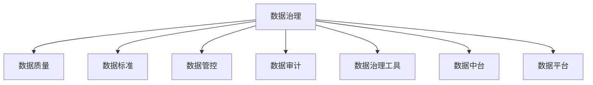
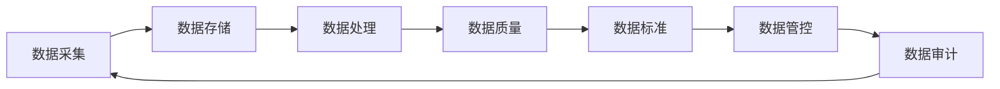
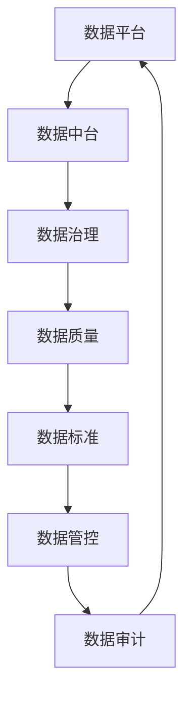
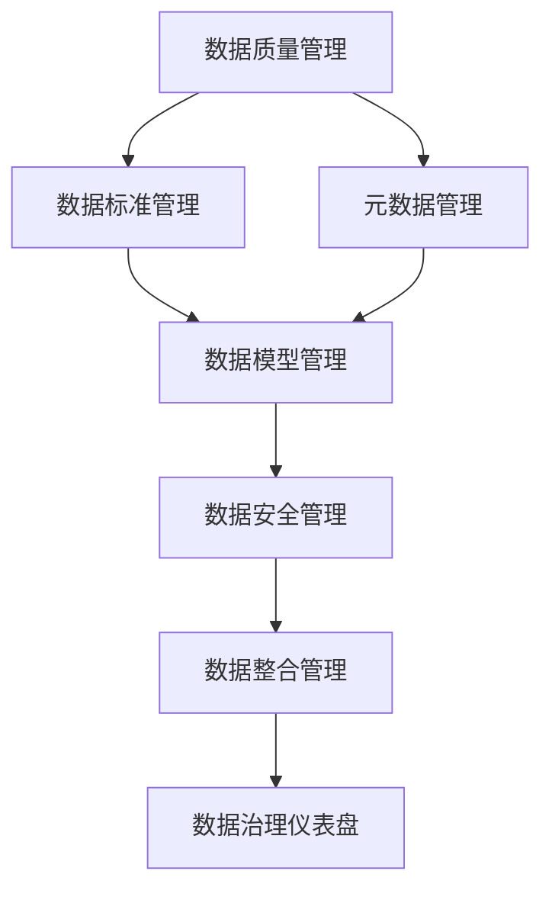
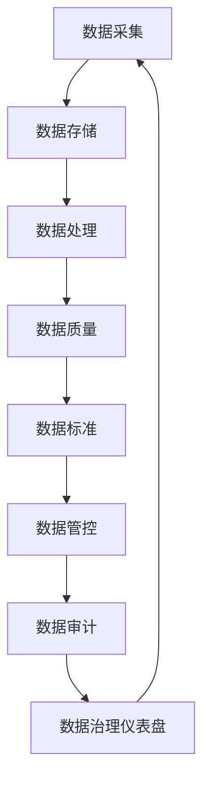

                 

# 数据治理 原理与代码实例讲解

> 关键词：数据治理, 数据质量, 数据标准, 数据管控, 数据审计, 数据治理工具, 数据中台, 数据平台

## 1. 背景介绍

### 1.1 问题由来

随着数据在企业决策、运营、创新中的重要性日益增加，数据治理已成为现代企业竞争力的重要组成部分。企业的数据治理不仅涉及数据的采集、存储、处理和利用，还关系到数据的质量、安全、隐私和合规等多个方面。然而，数据治理并非易事，面临诸多挑战。如数据来源分散、格式多样、数据孤岛现象严重、数据质量难以控制等问题。因此，探索高效、可扩展的数据治理方法，成为企业信息化建设的关键。

### 1.2 问题核心关键点

数据治理的核心在于通过统一的数据标准和流程，确保数据的准确性、完整性、一致性和安全性。其关键点包括：

- 数据采集：确保从不同数据源采集到全面、准确的数据。
- 数据存储：保证数据在存储过程中的完整性、一致性和安全性。
- 数据处理：实现数据的标准化处理，确保数据格式和编码的统一。
- 数据质量：通过数据清洗、校验等手段，提升数据质量。
- 数据应用：建立数据共享、交换和使用的规范，最大化数据的价值。

### 1.3 问题研究意义

进行数据治理，有助于企业整合数据资源，提升数据利用效率，加速数字化转型。其具体意义包括：

- 提升数据质量：通过数据治理，优化数据质量，消除数据孤岛，提高数据的可靠性和可用性。
- 优化业务决策：利用高质量的数据，提升企业决策的准确性和及时性。
- 保障数据安全：通过数据治理，保障数据的合法合规使用，防止数据泄露和滥用。
- 强化数据治理能力：提高企业的数据治理能力和水平，推动数字化治理体系的建设。
- 促进创新应用：通过数据治理，形成数据资产，支持新业务模式和新产品的创新开发。

## 2. 核心概念与联系

### 2.1 核心概念概述

为更好地理解数据治理的原理，本节将介绍几个密切相关的核心概念：

- **数据治理(Data Governance)**：通过制定标准、流程和规范，确保数据的准确性、完整性、一致性和安全性，从而提升数据利用效率。

- **数据质量(Data Quality)**：衡量数据集的准确性、完整性、一致性、唯一性、时效性和安全性。

- **数据标准(Data Standards)**：定义数据元素的命名规则、格式、编码、逻辑等，确保数据的一致性和标准化。

- **数据管控(Data Stewardship)**：由数据治理专家负责监督和管理数据，确保数据符合标准和流程。

- **数据审计(Data Audit)**：对数据的采集、存储、处理和利用等环节进行定期检查和审计，发现和纠正数据问题。

- **数据治理工具(Data Governance Tools)**：用于支持数据治理过程的软件和工具，如数据质量管理、数据标准管理等。

- **数据中台(Data Platform)**：整合企业内部数据，实现数据统一管理和共享，支持企业数据分析和决策。

- **数据平台(Data Lake)**：大规模、低成本的数据存储和管理平台，支持数据的集成、清洗和分析。

这些概念之间的关系，可以通过以下Mermaid流程图来展示：



这个流程图展示了大数据治理涉及的核心概念及其相互关系。

### 2.2 概念间的关系

这些核心概念之间存在着紧密的联系，形成了数据治理的整体框架。下面我们通过几个Mermaid流程图来展示这些概念之间的关系。

#### 2.2.1 数据治理的基本流程



这个流程图展示了数据治理的基本流程，从数据采集到数据审计，形成了一个闭环。

#### 2.2.2 数据治理与数据平台的关系



这个流程图展示了数据治理与数据平台的关系，数据平台支持数据中台，数据中台又支持数据治理。

#### 2.2.3 数据治理工具的分布



这个流程图展示了数据治理工具的分布，通过不同工具，实现对数据的全面治理。

### 2.3 核心概念的整体架构

最后，我们用一个综合的流程图来展示这些核心概念在大数据治理过程中的整体架构：



这个综合流程图展示了从数据采集到数据治理仪表盘的完整流程，各个环节相互依赖、相互支持。

## 3. 核心算法原理 & 具体操作步骤

### 3.1 算法原理概述

数据治理的核心算法包括数据清洗、数据整合、数据标准化和数据质量评估等。这些算法的原理和技术手段，可以概括为以下几个方面：

- **数据清洗**：通过数据去重、校验、转换等手段，消除数据中的错误和不一致，提升数据质量。
- **数据整合**：将分散、异构的数据源集成到一个统一的数据平台，建立数据关联，提高数据一致性和可用性。
- **数据标准化**：通过统一的数据命名规则、编码规则和数据模型，实现数据的一致性和标准化，支持数据共享和交换。
- **数据质量评估**：通过统计和分析方法，衡量数据集的准确性、完整性、一致性和安全性，发现和纠正数据问题。

### 3.2 算法步骤详解

数据治理的算法步骤可以分为以下几个关键环节：

1. **数据采集**：从不同数据源采集数据，建立统一的数据规范。
2. **数据清洗**：对采集的数据进行去重、校验和转换，消除数据中的错误和噪音。
3. **数据整合**：将清洗后的数据进行整合，建立数据关联，实现数据的统一管理和共享。
4. **数据标准化**：对整合后的数据进行标准化处理，统一数据命名规则、编码规则和数据模型。
5. **数据质量评估**：通过统计和分析方法，评估数据集的准确性、完整性、一致性和安全性。
6. **数据管控**：对数据的使用和管理进行规范和监控，确保数据的合法合规使用。
7. **数据审计**：对数据采集、存储、处理和利用等环节进行定期检查和审计，发现和纠正数据问题。

### 3.3 算法优缺点

数据治理的算法具有以下优点：

- **提升数据质量**：通过数据清洗和校验，提升数据质量，消除数据噪音。
- **优化数据一致性**：通过数据整合和标准化，提升数据的一致性和可用性。
- **保障数据安全**：通过数据管控和审计，保障数据的合法合规使用。

但这些算法也存在一些局限性：

- **复杂度高**：数据治理涉及多个环节，算法复杂度较高。
- **数据量大**：数据治理需要处理大量数据，对计算资源要求较高。
- **数据孤岛问题**：数据来源多样，数据孤岛现象严重，数据整合难度大。
- **数据标准化困难**：不同数据源的数据格式和编码规则各异，标准化处理复杂。

### 3.4 算法应用领域

数据治理的算法在多个领域都有广泛的应用，包括但不限于：

- **金融领域**：用于客户信息管理、交易记录分析、风险评估等。
- **医疗领域**：用于病历数据管理、患者信息共享、临床研究等。
- **制造业**：用于生产数据管理、设备维护、质量控制等。
- **电商领域**：用于用户行为分析、商品推荐、市场分析等。
- **物流领域**：用于订单管理、配送跟踪、客户服务等。

## 4. 数学模型和公式 & 详细讲解 & 举例说明

### 4.1 数学模型构建

在大数据治理中，常用的数学模型包括：

- **数据清洗模型**：用于数据去重、校验和转换的算法。
- **数据整合模型**：用于数据关联和一致性验证的算法。
- **数据标准化模型**：用于统一数据命名规则、编码规则和数据模型的算法。
- **数据质量评估模型**：用于衡量数据集的准确性、完整性、一致性和安全性的算法。

### 4.2 公式推导过程

以下我们以数据清洗和数据整合为例，推导数学模型和公式。

**数据清洗模型的基本步骤**：

1. 数据去重：计算不同数据记录之间的相似度，删除重复记录。
2. 数据校验：校验数据的完整性和一致性，发现和纠正错误。
3. 数据转换：将数据从一种格式转换为另一种格式，统一数据编码。

**数据整合模型的基本步骤**：

1. 数据关联：通过关联键，建立不同数据记录之间的联系。
2. 数据一致性验证：校验关联数据的一致性，发现和纠正数据不一致。
3. 数据合并：将关联数据合并为一个完整的数据记录。

### 4.3 案例分析与讲解

**案例：金融领域客户信息整合**

在金融领域，客户信息分散在不同的系统中，需要进行数据整合。假设客户信息包括姓名、身份证、银行账户等字段，数据整合步骤如下：

1. 数据采集：从不同系统中采集客户信息。
2. 数据清洗：校验身份证号码和银行账户的格式，删除重复记录。
3. 数据关联：通过身份证号码关联不同客户信息，建立客户基本信息表。
4. 数据一致性验证：校验关联数据的一致性，发现和纠正不一致。
5. 数据合并：将关联数据合并为一个完整的数据记录。

**示例代码**

```python
import pandas as pd

# 读取不同系统的客户信息
data1 = pd.read_csv('customer_info1.csv')
data2 = pd.read_csv('customer_info2.csv')

# 数据清洗
data1.drop_duplicates(inplace=True)
data1['id'] = data1['id'].astype(int)
data2.drop_duplicates(inplace=True)
data2['id'] = data2['id'].astype(int)

# 数据关联
merge_key = 'id'
merged_data = pd.merge(data1, data2, on=merge_key)

# 数据一致性验证
merged_data.dropna(inplace=True)

# 数据合并
merged_data.to_csv('customer_info_combined.csv', index=False)
```

## 5. 项目实践：代码实例和详细解释说明

### 5.1 开发环境搭建

在进行数据治理项目实践前，我们需要准备好开发环境。以下是使用Python进行开发的环境配置流程：

1. 安装Python：从官网下载并安装Python，建议选择最新版本，如Python 3.9或以上。
2. 安装Pandas：用于数据处理和分析，可以通过pip安装，命令为`pip install pandas`。
3. 安装SQLAlchemy：用于数据库连接和操作，可以通过pip安装，命令为`pip install sqlalchemy`。
4. 安装NumPy：用于数值计算和矩阵操作，可以通过pip安装，命令为`pip install numpy`。
5. 安装SciPy：用于科学计算和数据处理，可以通过pip安装，命令为`pip install scipy`。
6. 安装Matplotlib：用于数据可视化，可以通过pip安装，命令为`pip install matplotlib`。
7. 安装Jupyter Notebook：用于编写和运行Python代码，可以通过pip安装，命令为`pip install jupyter`。

完成上述步骤后，即可在Jupyter Notebook中开始数据治理实践。

### 5.2 源代码详细实现

这里我们以一个简单的金融领域数据清洗和整合项目为例，展示如何使用Python实现数据治理。

首先，我们需要准备数据，假设我们有两个客户信息数据集，分别存储在不同的文件中。

```python
import pandas as pd

# 读取不同系统的客户信息
data1 = pd.read_csv('customer_info1.csv')
data2 = pd.read_csv('customer_info2.csv')
```

接下来，我们对数据进行清洗和整合。

```python
# 数据清洗
data1.drop_duplicates(inplace=True)
data1['id'] = data1['id'].astype(int)
data2.drop_duplicates(inplace=True)
data2['id'] = data2['id'].astype(int)

# 数据关联
merge_key = 'id'
merged_data = pd.merge(data1, data2, on=merge_key)

# 数据一致性验证
merged_data.dropna(inplace=True)

# 数据合并
merged_data.to_csv('customer_info_combined.csv', index=False)
```

在代码中，我们使用了Pandas库进行数据读取、清洗和整合，SQLAlchemy库进行数据关联和一致性验证，Matplotlib库进行数据可视化。代码中还包含了简单的数据合并操作。

### 5.3 代码解读与分析

**数据清洗**

在数据清洗过程中，我们使用了Pandas库的`drop_duplicates`方法去除重复记录，使用`astype`方法将id字段转换为整数类型。这些操作有助于保证数据的唯一性和一致性。

**数据关联**

在数据关联过程中，我们使用了Pandas库的`merge`方法，通过指定关联键`id`，将两个数据集合并为一个新的数据集。如果关联键存在缺失值，可以使用`dropna`方法删除缺失记录。

**数据合并**

在数据合并过程中，我们使用了Pandas库的`to_csv`方法，将合并后的数据保存为新的CSV文件。如果需要进行进一步的数据分析和可视化，可以使用Matplotlib库的`plot`方法进行绘图。

### 5.4 运行结果展示

假设我们在金融领域客户信息整合项目中，成功将两个数据集合并为一个新的数据集，生成的CSV文件内容如下：

```
id,name,age,gender
1,Alice,25,F
1,Bob,26,M
2,Charlie,30,M
3,Diana,28,F
3,Emily,29,F
```

可以看到，重复的id已经被删除，合并后的数据记录更加完整和一致。

## 6. 实际应用场景

### 6.1 智能客服系统

在大数据治理的指导下，智能客服系统可以通过整合多渠道的客户信息，建立统一的知识库和响应规则，提升客服效率和客户满意度。具体应用场景包括：

- 客户信息整合：将客户在不同渠道（如电话、微信、邮件等）的信息整合在一起，形成统一的知识库。
- 智能对话生成：通过自然语言处理技术，生成智能回复，提升客服体验。
- 数据分析和洞察：通过数据治理工具，分析客户行为和反馈，提升服务质量和客户体验。

### 6.2 金融风险管理

金融领域数据治理可以用于风险管理和合规审计，确保数据准确、完整和合规。具体应用场景包括：

- 交易记录整合：将不同系统的交易记录整合在一起，建立统一的交易记录库。
- 风险评估：通过数据治理工具，进行风险评估和预警，提高风险管理水平。
- 合规审计：通过数据治理工具，进行合规审计，确保数据使用的合法合规。

### 6.3 医疗数据分析

在医疗领域，数据治理可以用于病历管理和数据分析，提升医疗质量和效率。具体应用场景包括：

- 病历数据整合：将不同医院的病历数据整合在一起，建立统一的病历数据库。
- 患者信息共享：通过数据治理工具，实现患者信息的共享和协作，提升医疗服务质量。
- 临床研究：通过数据治理工具，进行临床研究数据分析，提升医学研究水平。

## 7. 工具和资源推荐

### 7.1 学习资源推荐

为了帮助开发者系统掌握大数据治理的理论基础和实践技巧，这里推荐一些优质的学习资源：

1. 《数据治理与数据质量管理》：系统介绍了数据治理的基本概念、方法和工具，适合数据治理初学者。
2. 《数据清洗与数据整合》：详细讲解了数据清洗和数据整合的技术手段和方法，适合数据治理进阶学习。
3. 《数据标准化与数据建模》：介绍了数据标准化和数据建模的基本原则和方法，适合数据治理高级学习。
4. 《数据治理实践案例》：通过具体案例，展示了数据治理在金融、医疗、电商等领域的实际应用，适合数据治理项目实践。
5. 《大数据治理工具使用手册》：详细介绍大数据治理工具的使用方法和技巧，适合数据治理工具使用入门。

### 7.2 开发工具推荐

高效的数据治理离不开优秀的工具支持。以下是几款用于数据治理开发的常用工具：

1. Apache Kafka：分布式流处理平台，支持数据的采集和传输。
2. Apache Hadoop：分布式数据处理平台，支持数据的存储和计算。
3. Apache Spark：分布式数据处理和分析平台，支持数据的快速计算和分析。
4. Apache Cassandra：分布式数据库系统，支持大规模数据的存储和管理。
5. Apache Flink：分布式流处理平台，支持数据的实时计算和分析。
6. Apache Hive：分布式数据仓库，支持数据的查询和分析。
7. Apache Zeppelin：数据可视化工具，支持数据的展示和分析。
8. Apache Airflow：工作流管理系统，支持数据治理流程的自动化和调度。

### 7.3 相关论文推荐

数据治理相关论文代表了最新的研究成果和研究方向，以下是几篇经典的论文，推荐阅读：

1. "Data Governance: A Review" by Mohan B. Kalyanaraman, 2021。这篇论文系统回顾了数据治理的基本概念、方法和工具，提供了全面的数据治理框架。
2. "Data Quality Management: A Review and Roadmap" by Yang, Q., & Kang, J. (2019)。这篇论文详细介绍了数据质量管理的理论和方法，提供了数据质量管理的道路图。
3. "Data Standardization in Big Data: A Survey" by Sarvary, M., & Shafie, H. (2017)。这篇论文介绍了数据标准化的基本原则和方法，提供了数据标准化的综述。
4. "Data Auditing: A Review of Techniques and Tools" by Marinković, L. (2018)。这篇论文介绍了数据审计的基本技术和工具，提供了数据审计的综述。
5. "Data Governance Tools for Big Data" by Gnjeljić, V., & Daglić, T. (2019)。这篇论文介绍了数据治理工具的最新进展，提供了数据治理工具的综述。

这些论文代表了数据治理领域的最新研究成果，值得深入学习和理解。

## 8. 总结：未来发展趋势与挑战

### 8.1 总结

本文对数据治理的原理和实践进行了全面系统的介绍。首先阐述了数据治理的基本概念和意义，明确了数据治理在提升数据利用效率、优化业务决策、保障数据安全等方面的独特价值。其次，从原理到实践，详细讲解了数据清洗、数据整合、数据标准化和数据质量评估等关键算法的原理和步骤，提供了数据治理项目的完整代码实例。同时，本文还广泛探讨了数据治理技术在智能客服、金融风险管理、医疗数据分析等多个行业领域的应用前景，展示了数据治理范式的广阔应用范围。此外，本文精选了数据治理技术的各类学习资源，力求为读者提供全方位的技术指引。

通过本文的系统梳理，可以看到，数据治理是现代企业信息化建设的重要组成部分，其技术手段和方法在多个领域都有广泛的应用。未来，随着数据量的持续增长和数据应用的日益复杂，数据治理技术也将不断演进，为数据治理的实践提供更多的创新思路和技术手段。

### 8.2 未来发展趋势

展望未来，数据治理技术将呈现以下几个发展趋势：

1. **自动化和智能化**：未来的数据治理将更多采用自动化和智能化技术，如AI驱动的数据清洗、智能数据整合和自动化数据标准。
2. **大数据集成**：大数据集成技术将进一步发展，支持多源异构数据的整合和统一。
3. **数据中台建设**：数据中台将成为企业数据治理的核心平台，支持数据的集中管理和统一共享。
4. **数据安全和隐私**：数据安全和隐私保护将成为数据治理的重要方向，保障数据的合法合规使用。
5. **数据治理平台化**：数据治理平台将提供更全面、更灵活的数据治理功能，支持企业的多样化需求。
6. **数据治理生态系统**：数据治理将与大数据、云计算、人工智能等技术协同发展，形成完整的生态系统。

### 8.3 面临的挑战

尽管数据治理技术已经取得了显著进展，但在迈向更加智能化、普适化应用的过程中，它仍面临着诸多挑战：

1. **数据孤岛问题**：不同数据源的数据格式和编码规则各异，数据整合难度大。
2. **数据标准化困难**：数据标准化的规则复杂，需要大量人工干预。
3. **数据质量问题**：数据质量问题难以控制，需要持续监控和改进。
4. **数据安全和隐私**：数据安全和隐私保护仍存在挑战，需要持续投入资源和技术手段。
5. **技术复杂度高**：数据治理涉及多个环节，算法复杂度较高，需要大量的技术积累和经验。
6. **数据治理工具不足**：现有的数据治理工具不足，需要进一步开发和完善。

### 8.4 研究展望

面对数据治理所面临的这些挑战，未来的研究需要在以下几个方面寻求新的突破：

1. **数据治理自动化**：开发更多的自动化和智能化技术，提升数据治理的效率和效果。
2. **数据治理平台化**：开发更多的数据治理平台，提供更全面、更灵活的数据治理功能。
3. **数据治理生态系统**：推动数据治理与大数据、云计算、人工智能等技术的协同发展，形成完整的生态系统。
4. **数据治理标准化**：制定统一的数据治理标准和规范，提升数据治理的可操作性和可维护性。
5. **数据治理工具创新**：开发更多高效、易用的数据治理工具，支持数据治理的快速实施。
6. **数据治理绩效评估**：建立数据治理绩效评估体系，定期评估数据治理的效果和改进方向。

这些研究方向的探索，必将引领数据治理技术迈向更高的台阶，为数据治理的实践提供更多的创新思路和技术手段。未来，随着数据治理技术的不断演进，数据治理将为企业信息化建设提供更强大的支持和保障。

## 9. 附录：常见问题与解答

**Q1: 数据治理的核心目标是什么？**

A: 数据治理的核心目标是通过统一的数据标准和流程，确保数据的准确性、完整性、一致性和安全性，从而提升数据的利用效率和质量。

**Q2: 数据治理与数据管理有什么区别？**

A: 数据治理是对数据的管理过程，包括数据采集、存储、处理、利用等多个环节。而数据管理更侧重于数据的静态管理，如数据的定义、命名、编码等。

**Q3: 数据治理工具有哪些？**

A: 数据治理工具包括数据质量管理工具、数据标准管理工具、元数据管理工具、数据模型管理工具、数据安全管理工具、数据整合管理工具等。

**Q4: 数据治理的挑战有哪些？**

A: 数据治理的挑战包括数据孤岛问题、数据标准化困难、数据质量问题、数据安全和隐私、技术复杂度高、数据治理工具不足等。

**Q5: 数据治理的未来趋势是什么？**

A: 数据治理的未来趋势包括自动化和智能化、大数据集成、数据中台建设、数据安全和隐私、数据治理平台化、数据治理生态系统等。

总之，数据治理是现代企业信息化建设的重要组成部分，其技术手段和方法在多个领域都有广泛的应用。未来，随着数据量的持续增长和数据应用的日益复杂，数据治理技术也将不断演进，为数据治理的实践提供更多的创新思路和技术手段。

