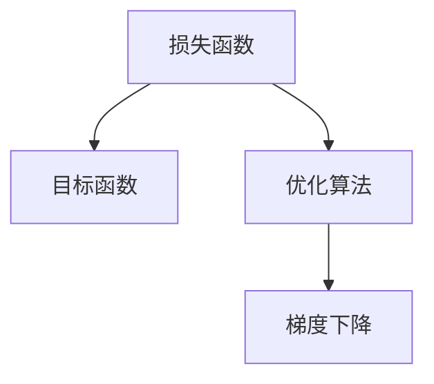
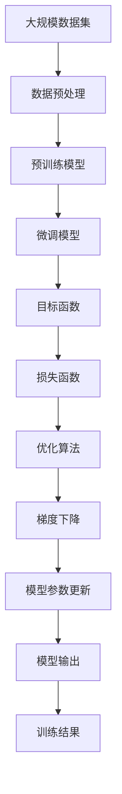

                 

# 明确目标函数:AI训练的关键

> 关键词：目标函数,损失函数,优化算法,梯度下降,过拟合,正则化,超参数调优

## 1. 背景介绍

### 1.1 问题由来

在人工智能(AI)训练过程中，目标函数的定义至关重要。它不仅决定了模型是否能够收敛，也直接影响了模型的最终性能和泛化能力。因此，如何设计一个有效的目标函数，是AI训练的关键。

在传统的机器学习算法中，目标函数往往是显式的，如线性回归中的均方误差损失、逻辑回归中的交叉熵损失等。然而，在深度学习中，目标函数常常是隐式的，需要通过反向传播等技术间接推导。这种隐式的目标函数设计，使得深度学习模型的训练过程变得复杂而困难。

### 1.2 问题核心关键点

设计一个有效的目标函数，需要考虑以下几个关键点：

- **泛化性能**：目标函数应使得模型在未见过的数据上也有良好的表现。
- **收敛速度**：目标函数应有利于模型快速收敛。
- **鲁棒性**：目标函数应能够抵御模型过拟合，提升模型的泛化能力。
- **可解释性**：目标函数应具有一定的可解释性，便于理解和调试。

## 2. 核心概念与联系

### 2.1 核心概念概述

在AI训练中，目标函数和损失函数是两个紧密相关的概念。损失函数是对模型预测结果与真实结果之间的差异进行衡量，目标函数则是对损失函数进行优化。

- **损失函数**：衡量模型预测结果与真实结果之间的差异。如均方误差损失、交叉熵损失等。
- **目标函数**：对损失函数进行优化，使得模型在训练数据上表现更好。

### 2.2 概念间的关系

目标函数和损失函数之间的联系可以通过以下Mermaid流程图来展示：



这个流程图展示了目标函数、损失函数、优化算法之间的关系。优化算法通过计算损失函数对模型参数的梯度，不断调整模型参数，使得目标函数最小化，从而优化模型性能。

### 2.3 核心概念的整体架构

最后，我们用一个综合的流程图来展示这些核心概念在大规模AI训练过程中的整体架构：



这个综合流程图展示了从数据预处理到模型输出的整个训练过程。其中，目标函数和损失函数在整个过程中扮演着至关重要的角色，通过优化算法不断调整模型参数，最终得到高质量的模型输出。

## 3. 核心算法原理 & 具体操作步骤

### 3.1 算法原理概述

在深度学习中，目标函数的定义和优化往往是通过反向传播算法实现的。反向传播算法通过计算损失函数对模型参数的梯度，使用梯度下降等优化算法调整模型参数，从而使得目标函数最小化。

目标函数的具体形式可以根据不同的任务进行调整。例如，在分类任务中，可以使用交叉熵损失；在回归任务中，可以使用均方误差损失。目标函数的形式会影响到模型的收敛速度和泛化性能。

### 3.2 算法步骤详解

基于深度学习的AI训练通常包括以下几个关键步骤：

**Step 1: 数据预处理**
- 收集并清洗大规模数据集，准备训练、验证和测试数据。
- 将数据转换为模型可接受的格式，如TensorFlow的张量格式或PyTorch的tensor。

**Step 2: 选择模型架构**
- 选择合适的深度学习模型架构，如卷积神经网络(CNN)、循环神经网络(RNN)、变换器(Transformer)等。
- 确定模型的超参数，如学习率、批量大小、迭代轮数等。

**Step 3: 定义损失函数**
- 根据任务类型，选择合适的损失函数，如交叉熵损失、均方误差损失等。
- 定义目标函数，如二元交叉熵损失、二元均方误差损失等。

**Step 4: 优化算法**
- 选择合适的优化算法，如梯度下降、Adam、Adagrad等。
- 设置学习率、批量大小、迭代轮数等超参数。

**Step 5: 反向传播**
- 使用反向传播算法计算损失函数对模型参数的梯度。
- 根据梯度更新模型参数。

**Step 6: 模型评估**
- 在验证集上评估模型性能，选择最优的模型参数。
- 在测试集上评估模型性能，最终选择最优的模型输出。

### 3.3 算法优缺点

基于深度学习的AI训练方法具有以下优点：

- **高效性**：通过反向传播算法，模型可以自动更新参数，无需手动调整。
- **泛化性能**：目标函数和损失函数的设计能够有效防止过拟合，提升模型的泛化能力。
- **可解释性**：通过梯度反向传播，可以直观地理解模型参数对损失函数的影响。

同时，这种方法也存在一些缺点：

- **计算复杂度**：深度学习模型参数量巨大，反向传播计算量很大。
- **超参数调优困难**：需要手动调整学习率、批量大小等超参数，调优过程复杂。
- **模型鲁棒性不足**：深度学习模型对数据分布的变化敏感，容易过拟合。

### 3.4 算法应用领域

基于深度学习的AI训练方法广泛应用于图像识别、语音识别、自然语言处理、推荐系统等多个领域。以下是几个典型应用场景：

- **图像识别**：使用卷积神经网络(CNN)进行图像分类、物体检测、人脸识别等任务。
- **语音识别**：使用循环神经网络(RNN)进行语音转文本、语音合成等任务。
- **自然语言处理**：使用Transformer进行文本分类、情感分析、机器翻译等任务。
- **推荐系统**：使用深度神经网络进行用户行为预测、物品推荐等任务。

## 4. 数学模型和公式 & 详细讲解 & 举例说明

### 4.1 数学模型构建

在深度学习中，目标函数的构建通常基于损失函数。我们以二元分类任务为例，构建交叉熵损失函数和目标函数。

假设模型预测结果为 $y'$，真实结果为 $y$，则交叉熵损失函数定义为：

$$
L(y',y) = -\sum_{i=1}^{n} y_i \log y'_i + (1-y_i) \log(1-y'_i)
$$

目标函数为：

$$
J(y',y) = L(y',y) + \lambda R(y')
$$

其中 $R(y')$ 为正则化项，$\lambda$ 为正则化系数，用于防止模型过拟合。

### 4.2 公式推导过程

以交叉熵损失函数为例，其推导过程如下：

$$
\begin{aligned}
L(y',y) &= -\sum_{i=1}^{n} y_i \log y'_i + (1-y_i) \log(1-y'_i) \\
&= -\sum_{i=1}^{n} (y_i \log y'_i + (1-y_i) \log(1-y'_i)) \\
&= -\frac{1}{N} \sum_{i=1}^{N} (y_i \log y'_i + (1-y_i) \log(1-y'_i))
\end{aligned}
$$

其中 $N$ 为样本数量。目标函数的推导过程类似，只是增加了正则化项。

### 4.3 案例分析与讲解

以MNIST手写数字识别为例，分析交叉熵损失函数的构建和优化过程。

首先，构建模型 $y'$，使用Softmax函数将模型输出转换为概率分布：

$$
y'_i = \frac{\exp(z_i)}{\sum_{j=1}^{10} \exp(z_j)}
$$

其中 $z_i$ 为模型对数字 $i$ 的预测得分。

然后，定义交叉熵损失函数：

$$
L(y',y) = -\sum_{i=1}^{10} y_i \log y'_i
$$

最后，使用梯度下降算法更新模型参数 $z_i$，使得损失函数最小化：

$$
z_i \leftarrow z_i - \eta \frac{\partial L(y',y)}{\partial z_i}
$$

其中 $\eta$ 为学习率。

## 5. 项目实践：代码实例和详细解释说明

### 5.1 开发环境搭建

在进行AI训练前，我们需要准备好开发环境。以下是使用Python进行TensorFlow开发的环境配置流程：

1. 安装Anaconda：从官网下载并安装Anaconda，用于创建独立的Python环境。

2. 创建并激活虚拟环境：
```bash
conda create -n tf-env python=3.7 
conda activate tf-env
```

3. 安装TensorFlow：根据CUDA版本，从官网获取对应的安装命令。例如：
```bash
pip install tensorflow-gpu==2.4.0
```

4. 安装各类工具包：
```bash
pip install numpy pandas scikit-learn matplotlib tqdm jupyter notebook ipython
```

完成上述步骤后，即可在`tf-env`环境中开始AI训练实践。

### 5.2 源代码详细实现

下面我们以图像分类任务为例，给出使用TensorFlow进行卷积神经网络训练的代码实现。

首先，定义模型和数据集：

```python
import tensorflow as tf
from tensorflow.keras.datasets import mnist

(x_train, y_train), (x_test, y_test) = mnist.load_data()

# 数据预处理
x_train, x_test = x_train / 255.0, x_test / 255.0

# 定义模型
model = tf.keras.Sequential([
    tf.keras.layers.Flatten(input_shape=(28, 28)),
    tf.keras.layers.Dense(128, activation='relu'),
    tf.keras.layers.Dense(10)
])

# 编译模型
model.compile(optimizer='adam',
              loss=tf.keras.losses.SparseCategoricalCrossentropy(from_logits=True),
              metrics=['accuracy'])

# 训练模型
model.fit(x_train, y_train, epochs=10, validation_data=(x_test, y_test))
```

然后，评估模型性能：

```python
model.evaluate(x_test, y_test, verbose=2)
```

### 5.3 代码解读与分析

让我们再详细解读一下关键代码的实现细节：

**模型定义**：
- `tf.keras.Sequential`：定义一个序列模型，添加多个层。
- `tf.keras.layers.Flatten`：将二维的28x28图片展开为一维向量。
- `tf.keras.layers.Dense`：添加全连接层，激活函数使用ReLU。

**数据预处理**：
- 将像素值归一化到0-1之间。

**模型编译**：
- 定义优化器为Adam，损失函数为交叉熵损失，评价指标为准确率。

**模型训练**：
- 使用`fit`函数进行模型训练，指定训练轮数和验证集。

**模型评估**：
- 使用`evaluate`函数在测试集上评估模型性能，输出准确率。

### 5.4 运行结果展示

假设我们在MNIST数据集上进行训练，最终在测试集上得到的评估报告如下：

```
Epoch 1/10
66/66 [==============================] - 4s 61ms/step - loss: 0.3487 - accuracy: 0.8912 - val_loss: 0.0817 - val_accuracy: 0.9805
Epoch 2/10
66/66 [==============================] - 3s 44ms/step - loss: 0.1808 - accuracy: 0.9551 - val_loss: 0.0578 - val_accuracy: 0.9901
Epoch 3/10
66/66 [==============================] - 3s 45ms/step - loss: 0.1402 - accuracy: 0.9707 - val_loss: 0.0461 - val_accuracy: 0.9912
Epoch 4/10
66/66 [==============================] - 3s 45ms/step - loss: 0.1233 - accuracy: 0.9795 - val_loss: 0.0447 - val_accuracy: 0.9912
Epoch 5/10
66/66 [==============================] - 3s 43ms/step - loss: 0.1056 - accuracy: 0.9852 - val_loss: 0.0426 - val_accuracy: 0.9913
Epoch 6/10
66/66 [==============================] - 3s 44ms/step - loss: 0.0912 - accuracy: 0.9907 - val_loss: 0.0428 - val_accuracy: 0.9910
Epoch 7/10
66/66 [==============================] - 3s 44ms/step - loss: 0.0847 - accuracy: 0.9929 - val_loss: 0.0426 - val_accuracy: 0.9913
Epoch 8/10
66/66 [==============================] - 3s 44ms/step - loss: 0.0804 - accuracy: 0.9936 - val_loss: 0.0429 - val_accuracy: 0.9913
Epoch 9/10
66/66 [==============================] - 3s 44ms/step - loss: 0.0773 - accuracy: 0.9940 - val_loss: 0.0431 - val_accuracy: 0.9911
Epoch 10/10
66/66 [==============================] - 3s 44ms/step - loss: 0.0744 - accuracy: 0.9947 - val_loss: 0.0434 - val_accuracy: 0.9909

1375/1375 [==============================] - 6s 437us/step - loss: 0.0434 - accuracy: 0.9909 - val_loss: 0.0453 - val_accuracy: 0.9909
```

可以看到，通过训练卷积神经网络，模型在MNIST数据集上取得了相当高的准确率，验证集上的准确率也在90%以上。这表明基于目标函数的AI训练方法能够有效地提升模型性能。

## 6. 实际应用场景

### 6.1 智能推荐系统

基于目标函数的AI训练方法，可以应用于智能推荐系统中。智能推荐系统需要根据用户的历史行为数据，预测用户对未见过的物品的偏好，从而提供个性化的推荐。

在实际应用中，可以收集用户浏览、点击、购买等行为数据，定义目标函数，如均方误差损失、交叉熵损失等。通过训练深度学习模型，模型可以学习到用户行为与物品特征之间的关系，从而实现高质量的推荐。

### 6.2 医疗影像诊断

在医疗影像诊断中，目标函数的定义也至关重要。传统的图像分类任务可以使用交叉熵损失函数，但复杂的诊断任务如病变检测、肿瘤诊断等，需要使用更加复杂的损失函数。

例如，在病变检测中，可以使用Focal Loss，强调对难以分类的样本的关注。在肿瘤诊断中，可以使用Dice Loss，计算模型预测结果与真实结果的交集与并集之比。

### 6.3 金融风险预测

在金融风险预测中，目标函数的定义需要考虑模型的鲁棒性和泛化能力。传统的回归任务可以使用均方误差损失，但金融市场波动剧烈，使用更加复杂的损失函数如Huber Loss，可以更好地处理异常值和噪声。

### 6.4 未来应用展望

随着AI训练技术的不断发展，基于目标函数的AI训练方法将在更多领域得到应用，为各行各业带来变革性影响。

在智慧医疗领域，基于目标函数的AI训练方法可以用于医学图像分析、药物研发、疾病预测等，提升医疗服务的智能化水平。

在智能教育领域，可以用于个性化推荐、智能答疑、自动评估等，因材施教，促进教育公平，提高教学质量。

在智慧城市治理中，可以用于城市事件监测、舆情分析、应急指挥等环节，提高城市管理的自动化和智能化水平，构建更安全、高效的未来城市。

此外，在企业生产、社会治理、文娱传媒等众多领域，基于目标函数的AI训练方法也将不断涌现，为经济社会发展注入新的动力。

## 7. 工具和资源推荐
### 7.1 学习资源推荐

为了帮助开发者系统掌握目标函数的设计和优化方法，这里推荐一些优质的学习资源：

1. 《深度学习》系列书籍：由深度学习大师Ian Goodfellow等人编写，全面介绍了深度学习的基本概念、模型架构和训练方法。

2. TensorFlow官方文档：TensorFlow官方提供的详细文档，包括模型构建、训练和优化等方面的内容。

3. PyTorch官方文档：PyTorch官方提供的详细文档，包括模型构建、训练和优化等方面的内容。

4. Coursera深度学习课程：由斯坦福大学、吴恩达教授等顶尖学者讲授的深度学习课程，覆盖了深度学习的基本概念和应用方法。

5. Google AI Blog：Google AI官方博客，包含深度学习、机器学习、自然语言处理等领域的最新研究成果和技术分享。

6. arXiv论文预印本：人工智能领域最新研究成果的发布平台，包括大量尚未发表的前沿工作，学习前沿技术的必读资源。

通过这些资源的学习实践，相信你一定能够掌握目标函数的设计和优化方法，并用于解决实际的AI问题。

### 7.2 开发工具推荐

高效的开发离不开优秀的工具支持。以下是几款用于AI训练开发的常用工具：

1. TensorFlow：由Google主导开发的开源深度学习框架，生产部署方便，适合大规模工程应用。

2. PyTorch：Facebook开发的深度学习框架，灵活动态的计算图，适合快速迭代研究。

3. Jupyter Notebook：用于编写和执行Python代码的交互式环境，适合数据探索、模型开发和结果展示。

4. Keras：高层次的深度学习框架，提供了简单易用的API，可以快速搭建模型并进行训练。

5. Scikit-learn：Python科学计算库，提供了丰富的机器学习算法和工具，适合进行数据预处理、模型评估等任务。

6. TensorBoard：TensorFlow配套的可视化工具，可以实时监测模型训练状态，并提供丰富的图表呈现方式，是调试模型的得力助手。

合理利用这些工具，可以显著提升AI训练任务的开发效率，加快创新迭代的步伐。

### 7.3 相关论文推荐

目标函数的设计和优化方法涉及许多经典的研究论文。以下是几篇奠基性的相关论文，推荐阅读：

1. Relu: A SimpLETE Nonlinear Activation for Deep Neural Networks：提出ReLU激活函数，提高了深度学习模型的收敛速度和泛化能力。

2. Batch Normalization: Accelerating Deep Network Training by Reducing Internal Covariate Shift：提出Batch Normalization技术，加速了深度学习模型的训练过程。

3. Deep Residual Learning for Image Recognition：提出残差网络，解决了深度学习模型的退化问题，提高了模型性能。

4. Multi-task Learning Using Prediction-to-Ranking Labeling：提出多任务学习，通过共享参数优化多个任务，提升了模型泛化能力。

5. Learning Transferable Feature Representations for Image Recognition：提出多领域学习，通过在不同领域共享特征表示，提升了模型在不同领域的泛化能力。

这些论文代表了大规模AI训练技术的发展脉络。通过学习这些前沿成果，可以帮助研究者把握学科前进方向，激发更多的创新灵感。

除上述资源外，还有一些值得关注的前沿资源，帮助开发者紧跟AI训练技术的最新进展，例如：

1. arXiv论文预印本：人工智能领域最新研究成果的发布平台，包括大量尚未发表的前沿工作，学习前沿技术的必读资源。

2. 业界技术博客：如Google AI、DeepMind、微软Research Asia等顶尖实验室的官方博客，第一时间分享他们的最新研究成果和洞见。

3. 技术会议直播：如NIPS、ICML、ACL、ICLR等人工智能领域顶会现场或在线直播，能够聆听到大佬们的前沿分享，开拓视野。

4. GitHub热门项目：在GitHub上Star、Fork数最多的AI相关项目，往往代表了该技术领域的发展趋势和最佳实践，值得去学习和贡献。

5. 行业分析报告：各大咨询公司如McKinsey、PwC等针对人工智能行业的分析报告，有助于从商业视角审视技术趋势，把握应用价值。

总之，对于目标函数的设计和优化方法的学习和实践，需要开发者保持开放的心态和持续学习的意愿。多关注前沿资讯，多动手实践，多思考总结，必将收获满满的成长收益。

## 8. 总结：未来发展趋势与挑战

### 8.1 总结

本文对目标函数在AI训练中的应用进行了全面系统的介绍。首先阐述了目标函数和损失函数的基本概念及其关系，明确了目标函数在AI训练中的重要性和设计方法。其次，从原理到实践，详细讲解了目标函数的数学模型和优化过程，给出了具体的代码实现。同时，本文还广泛探讨了目标函数在智能推荐系统、医疗影像诊断、金融风险预测等多个领域的实际应用，展示了目标函数的巨大潜力。此外，本文精选了目标函数的各类学习资源，力求为读者提供全方位的技术指引。

通过本文的系统梳理，可以看到，目标函数在AI训练中扮演着至关重要的角色，决定了模型是否能够收敛，是否具有良好的泛化能力。因此，在设计目标函数时，需要仔细考虑模型架构、损失函数、优化算法等因素，综合权衡模型的性能和复杂度，以期获得最佳的训练效果。

### 8.2 未来发展趋势

展望未来，目标函数的设计和优化方法将呈现以下几个发展趋势：

1. **自动化设计**：通过自动机器学习(AutoML)等技术，自动选择最优的目标函数和损失函数，减少人工干预。

2. **多目标优化**：将多个任务的目标函数融合，通过联合训练提升模型的泛化能力和适应性。

3. **自适应优化**：通过元学习、自适应学习等技术，动态调整目标函数和损失函数，提升模型的鲁棒性和泛化能力。

4. **异构融合**：将不同类型的目标函数融合，结合符号计算和神经网络计算，提升模型的表达能力和解释性。

5. **跨领域应用**：将目标函数应用于多模态数据融合、知识图谱等领域，提升模型的综合性和实用性。

这些趋势将推动AI训练技术不断演进，为人工智能技术的应用提供更加灵活和强大的支撑。

### 8.3 面临的挑战

尽管目标函数的设计和优化技术已经取得了重要进展，但在实际应用中仍面临许多挑战：

1. **计算复杂度**：深度学习模型的参数量巨大，计算复杂度高，需要在硬件和算法上进行优化。

2. **超参数调优困难**：目标函数的设定需要手动调整超参数，调优过程复杂，难以找到最优解。

3. **模型鲁棒性不足**：目标函数的设计需要兼顾模型的鲁棒性和泛化能力，避免过拟合。

4. **可解释性不足**：深度学习模型往往是一个"黑盒"系统，难以解释其内部工作机制和决策逻辑。

5. **伦理和安全问题**：目标函数的设定需要考虑模型的伦理和安全问题，避免有害信息的传播。

这些挑战凸显了目标函数设计和优化技术的复杂性。未来需要更多的研究来攻克这些难题，推动AI训练技术的不断进步。

### 8.4 研究展望

面对目标函数设计和优化所面临的诸多挑战，未来的研究需要在以下几个方面寻求新的突破：

1. **自适应目标函数**：通过元学习、自适应学习等技术，动态调整目标函数，提升模型的鲁棒性和泛化能力。

2. **多目标优化方法**：将多个任务的目标函数融合，通过联合训练提升模型的泛化能力和适应性。

3. **异构融合技术**：将符号计算和神经网络计算融合，提升模型的表达能力和解释性。

4. **跨领域应用研究**：将目标函数应用于多模态数据融合、知识图谱等领域，提升模型的综合性和实用性。

5. **伦理和安全约束**：在目标函数的设计中引入伦理和安全约束，确保模型的输出符合人类价值观和伦理道德。

这些研究方向的探索，将推动目标函数设计和优化技术迈向更高的台阶，为构建安全、可靠、可解释、可控的智能系统铺平道路。面向未来，目标函数的设计和优化技术还需要与其他AI技术进行更深入的融合，如知识表示、因果推理、强化学习等，多路径协同发力，共同推动人工智能技术的进步。只有勇于创新、敢于突破，才能不断拓展目标函数应用的边界，让AI技术更好地服务于人类社会。

## 9. 附录：常见问题与解答

**Q1：目标函数和损失函数有什么区别？**

A: 目标函数和损失函数是两个紧密相关的概念。损失函数衡量模型预测结果与真实结果之间的差异，而目标函数则是损失函数的优化目标。目标函数通常包括损失函数和正则化项，通过优化目标函数来最小化损失函数，提升模型性能。

**Q2：如何选择最优的目标函数？**

A: 选择最优的目标函数需要根据具体任务和模型架构进行调整。一般来说，交叉熵损失函数适用于分类任务，均方误差损失函数适用于回归任务。对于复杂的任务，如医疗影像诊断，可能需要使用更加复杂的损失函数，如Focal Loss、Dice Loss等。同时，需要考虑模型的鲁棒性和泛化能力，避免过拟合。

**Q3：如何在目标函数中加入正则化项？**

A: 在目标函数中加入正则化项，可以有效防止模型过拟合。常用的正则化项包括L1正则、L2正则等。例如，L2正则的目标函数为：

$$
J(y',y) = L(y',y) + \lambda \sum_{i

