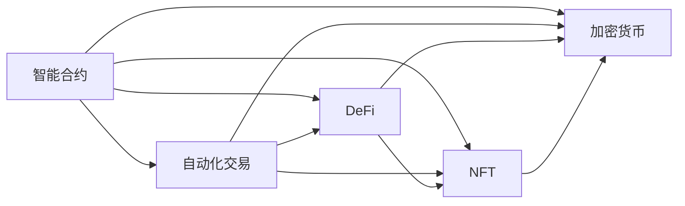
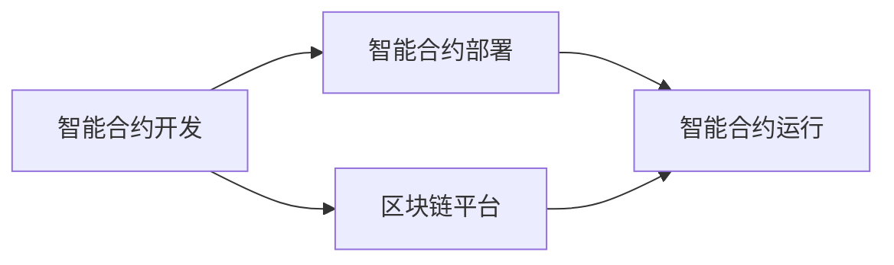
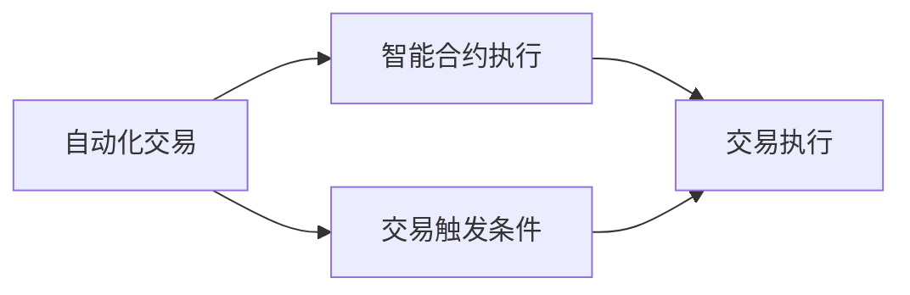
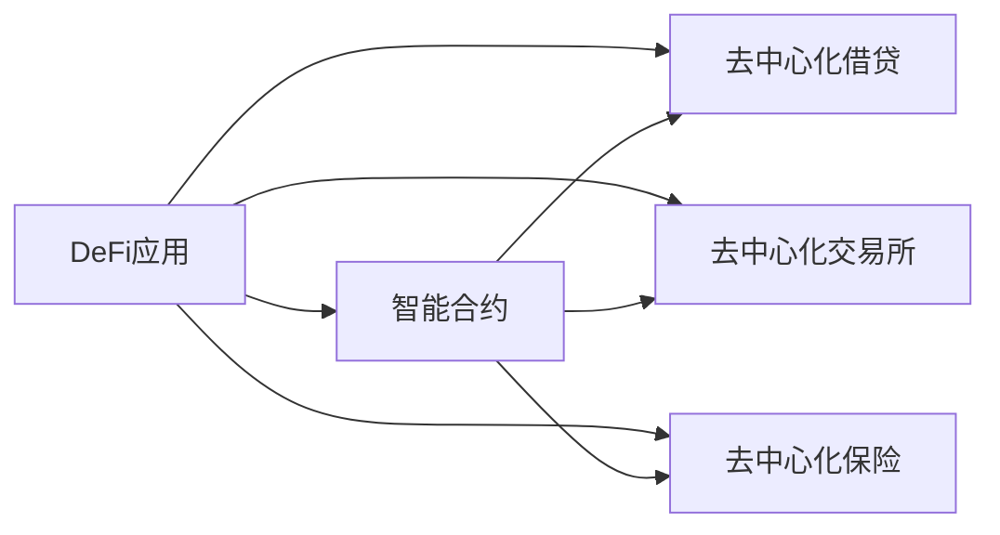
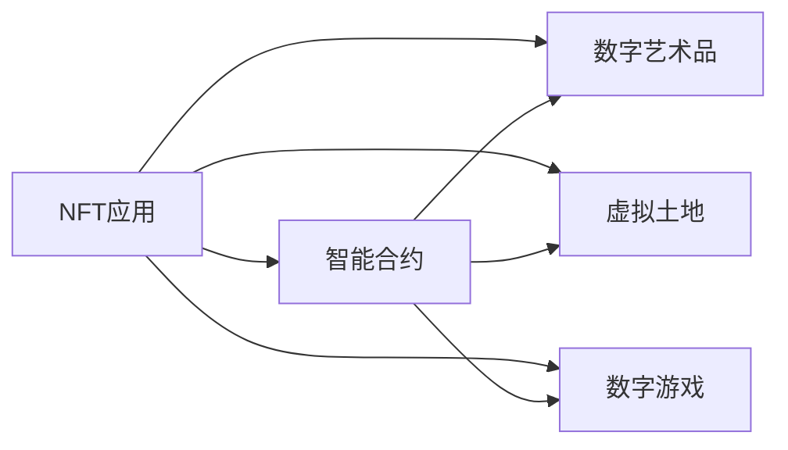
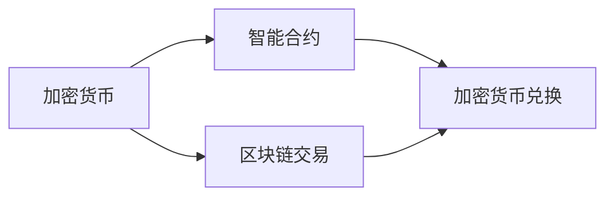
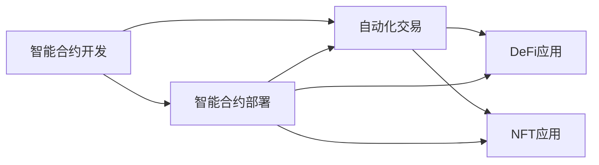

                 

# 智能合约创业：自动化交易的未来

> 关键词：智能合约，自动化交易，区块链，DeFi，NFT，去中心化金融，加密货币，区块链技术

## 1. 背景介绍

### 1.1 问题由来
随着区块链技术的兴起，智能合约正在成为金融、供应链、医疗等多个行业的重要应用形式。智能合约，是一种去中心化的自动化合约，能够在不需要中介机构的情况下，直接根据合同条款自动执行。这一特性使得智能合约在自动交易、金融借贷、供应链管理等方面具有巨大潜力。

近年来，智能合约的开发和使用逐渐增多，但仍面临诸多挑战。首先是编程语言和开发环境的多样性，各智能合约平台（如以太坊、TRON、EOS等）支持的语言和开发工具不尽相同，导致开发者需要学习多种技能。其次是智能合约的安全性问题，尤其是代码错误、漏洞和攻击，给资产和用户带来了巨大风险。

在此背景下，一种新型创业模式应运而生：智能合约创业，即专注于智能合约的开发、部署和管理，帮助用户构建安全、高效、透明的自动化交易系统。这种创业模式不仅能够降低智能合约开发的门槛，还能大幅提升合约的安全性和可扩展性，具有广阔的市场前景。

### 1.2 问题核心关键点
智能合约创业的核心在于：
- 降低智能合约开发难度：通过提供统一的开发工具、语言和框架，减少开发者学习和使用的成本。
- 提高智能合约安全性：利用最新的安全技术和工具，防范代码漏洞和攻击。
- 优化智能合约性能：通过优化合约的执行效率和资源利用，提升用户体验和交易速度。
- 增强智能合约可扩展性：支持多平台、多链和跨链，方便用户在不同区块链之间迁移合约。
- 提供一站式服务：从合约设计、开发、部署到管理和审计，提供全方位支持。

### 1.3 问题研究意义
智能合约创业能够加速区块链技术在各行业的应用落地，提升区块链生态系统的活力，推动数字经济的快速发展。具体而言：
- 降低区块链应用门槛：智能合约创业公司通过提供标准化、便捷的开发环境，吸引更多企业和开发者进入区块链领域。
- 提高区块链安全性：集中精力攻关智能合约的安全性问题，降低区块链系统的风险。
- 推动区块链产业发展：促进区块链技术在金融、供应链、医疗等多个领域的应用，加速数字经济的全面转型。
- 创造就业机会：智能合约创业公司需要大量技术人才，为区块链行业带来大量就业机会。
- 激发创新潜力：智能合约创业公司能够快速迭代和优化合约产品，推动区块链技术的创新和进步。

## 2. 核心概念与联系

### 2.1 核心概念概述

为了更好地理解智能合约创业的原理和应用，我们首先需要了解几个关键概念：

- **智能合约（Smart Contract）**：一种运行在区块链上的程序，能够在预设条件满足时自动执行，具有去中心化、不可篡改、透明等特点。智能合约广泛应用于金融、供应链、医疗等多个领域，能够显著提升效率和降低成本。

- **自动化交易（Automated Trading）**：利用智能合约，实现自动化的买卖操作。通过预设条件和规则，智能合约能够在特定时刻自动执行交易，从而实现自动化的市场参与和风险管理。

- **去中心化金融（DeFi）**：利用区块链和智能合约技术，构建无需中心化机构支持的金融系统。DeFi项目包括借贷、稳定币、交易所、保险等多种应用，提供更加高效、透明、安全的金融服务。

- **非同质化代币（NFT）**：一种基于区块链的数字资产，每个代币都有唯一的标识和属性，不同于传统的货币和数字资产。NFT在版权、艺术品、游戏等领域具有重要应用。

- **加密货币（Cryptocurrency）**：一种基于区块链的数字货币，具有去中心化、可编程、可追溯等特点。比特币、以太坊等加密货币已经成为全球重要的数字资产和支付手段。

这些概念通过区块链技术紧密联系在一起，共同构成了自动化交易和智能合约创业的技术基础。以下Mermaid流程图展示了这些概念之间的关系：



这个流程图展示了智能合约如何与其他区块链概念进行集成和应用。

### 2.2 概念间的关系

这些核心概念之间存在着紧密的联系，形成了智能合约创业的完整生态系统。这里我们通过几个Mermaid流程图来展示这些概念之间的关系：

#### 2.2.1 智能合约的开发与部署



这个流程图展示了智能合约的开发与部署流程。开发过程包括编写智能合约代码、测试和调试，部署过程包括将智能合约上传至区块链平台并进行执行。

#### 2.2.2 自动化交易的实现过程



这个流程图展示了自动化交易的实现过程。交易触发条件通常包括价格、时间、数量等预设参数，智能合约根据这些参数自动执行交易。

#### 2.2.3 去中心化金融的应用场景



这个流程图展示了DeFi应用的实现场景。DeFi应用通常包括去中心化借贷、去中心化交易所、去中心化保险等多种形式，利用智能合约实现自动化和去中心化。

#### 2.2.4 非同质化代币的应用场景



这个流程图展示了NFT应用场景。NFT通常应用于数字艺术品、虚拟土地、数字游戏等多个领域，利用智能合约实现代币的生成、转让和验证。

#### 2.2.5 加密货币的交易过程



这个流程图展示了加密货币的交易过程。加密货币交易通常涉及智能合约，利用智能合约实现货币的兑换和转移。

### 2.3 核心概念的整体架构

最后，我们用一个综合的流程图来展示这些核心概念在大规模智能合约创业实践中的整体架构：



这个综合流程图展示了从智能合约开发到自动化交易实现的完整过程，以及DeFi应用和NFT应用等衍生应用。通过这些概念的紧密联系，可以更清晰地理解智能合约创业的原理和应用场景。

## 3. 核心算法原理 & 具体操作步骤
### 3.1 算法原理概述

智能合约创业的核心算法原理基于智能合约的编程语言和区块链技术，通过统一的开发环境和工具，实现智能合约的快速开发、部署和优化。以下我们将详细介绍这一过程的算法原理和操作步骤。

### 3.2 算法步骤详解

#### 3.2.1 选择智能合约开发平台

智能合约创业公司首先需要在多个区块链平台中选择一个合适的平台。目前主流的选择包括以太坊、TRON、EOS等，每个平台都有自己的编程语言、开发工具和生态系统。例如，以太坊主要使用Solidity语言，TRON主要使用TronScript，EOS主要使用C++语言。

在选择平台时，需要考虑以下几个因素：
- 安全性：选择安全性较高的平台，防范代码漏洞和攻击。
- 开发工具：选择提供丰富开发工具和库的平台，减少开发成本。
- 社区支持：选择有活跃社区和开发者支持的平台，便于问题解决和技术交流。
- 扩展性：选择支持多链和跨链的平台，方便合约的迁移和跨平台应用。

#### 3.2.2 编写智能合约代码

在选择好平台后，接下来需要编写智能合约代码。智能合约代码通常包括合约功能、触发条件、执行逻辑等部分。例如，一个自动化交易合约可能包括：
- 合约功能：买卖操作、资金转移等。
- 触发条件：价格、时间、数量等。
- 执行逻辑：根据触发条件自动执行交易。

编写智能合约代码需要使用平台提供的编程语言和工具。例如，在以太坊上编写智能合约通常使用Solidity语言，使用Remix IDE进行开发和测试。

#### 3.2.3 测试和调试

编写智能合约代码后，需要进行全面的测试和调试，确保合约的完整性和安全性。常见的测试和调试方法包括：
- 单元测试：对合约的各个功能进行单独测试，检查是否存在代码漏洞和错误。
- 模拟测试：在本地环境模拟合约的运行，测试合约的执行逻辑和触发条件。
- 安全测试：利用各种安全工具和平台，检测合约的漏洞和安全问题。

#### 3.2.4 部署智能合约

测试和调试完成后，需要将智能合约部署到区块链平台。部署过程通常包括以下步骤：
- 编写合约部署脚本：编写将合约上传到区块链平台的脚本。
- 上传合约到平台：将合约部署脚本上传到区块链平台。
- 触发合约部署：在平台上触发合约部署脚本，将合约部署到区块链网络。

#### 3.2.5 管理和审计

智能合约部署后，需要进行管理和审计，确保合约的正常运行和安全性。常见的管理方法包括：
- 合约监控：使用各种工具和平台监控合约的运行状态，及时发现异常和故障。
- 定期审计：对合约进行定期审计，检查合约的执行逻辑和安全性。
- 更新和维护：根据需求和变化，对合约进行更新和维护，保证合约的持续稳定运行。

### 3.3 算法优缺点

智能合约创业的算法具有以下优点：
- 降低开发难度：通过统一的开发平台和工具，减少开发者学习和使用的成本。
- 提高安全性：利用最新的安全技术和工具，防范代码漏洞和攻击。
- 优化性能：通过优化合约的执行效率和资源利用，提升用户体验和交易速度。
- 增强可扩展性：支持多平台、多链和跨链，方便用户在不同区块链之间迁移合约。
- 提供一站式服务：从合约设计、开发、部署到管理和审计，提供全方位支持。

但智能合约创业也存在一些缺点：
- 平台依赖性：选择不同的平台需要学习不同的编程语言和工具，增加开发成本。
- 技术门槛高：智能合约创业需要具备区块链和编程技能，对开发者的要求较高。
- 安全性风险：尽管提供了安全工具，但智能合约依然面临代码漏洞和攻击的风险。
- 更新复杂：合约的更新和维护需要谨慎处理，防止出现错误和意外。

### 3.4 算法应用领域

智能合约创业的应用领域非常广泛，涵盖金融、供应链、医疗等多个领域。以下是几个典型应用场景：

#### 3.4.1 金融借贷

智能合约可以用于去中心化借贷平台，用户可以通过智能合约自动申请和偿还贷款。例如，Aave和Compound等DeFi借贷平台，利用智能合约实现自动化的借贷和清算，大大提升了借贷效率和安全性。

#### 3.4.2 自动化交易

智能合约可以用于自动化交易系统，用户可以预设交易条件，智能合约自动执行交易。例如，AlphaZero等智能合约，利用深度学习技术，自动执行复杂的交易策略，提高了交易的智能化水平。

#### 3.4.3 供应链管理

智能合约可以用于供应链管理，自动化处理订单、物流和支付等环节。例如，Walmart等公司利用智能合约，自动化处理供应链中的各项事务，提高了供应链的效率和透明度。

#### 3.4.4 版权保护

智能合约可以用于版权保护，利用NFT技术，保护数字资产的版权和所有权。例如，OpenSea等平台利用智能合约，自动化管理数字资产的生成、转让和验证。

#### 3.4.5 去中心化保险

智能合约可以用于去中心化保险，用户可以预设赔付条件，智能合约自动执行赔付操作。例如，DRIUM等平台利用智能合约，实现自动化的保险理赔和赔付，提高了保险的效率和公平性。

## 4. 数学模型和公式 & 详细讲解  
### 4.1 数学模型构建

智能合约创业的数学模型构建基于区块链技术和智能合约的编程语言，通过统一的开发环境和工具，实现智能合约的快速开发、部署和优化。以下我们将详细介绍这一过程的数学模型和公式推导。

### 4.2 公式推导过程

#### 4.2.1 合约功能模型

智能合约的功能模型通常包括买卖操作、资金转移、借贷等。这里以买卖操作为例，介绍智能合约的功能模型。假设用户A希望以价格P买入资产X，智能合约的代码如下：

```solidity
pragma solidity ^0.8.0;

contract BuyAndSell {
    uint256 price;
    uint256 amount;
    uint256 balance;

    function buy(uint256 _id, uint256 _amount, uint256 _price) public payable {
        require(_id >= 0 && _amount > 0 && _price > 0);
        require(msg.value == _price * _amount);
        balance += _amount;
        amount += _amount;
        emit BuyEvent(_id, _amount, _price);
    }
}
```

上述代码实现了以下功能：
- 输入参数：_id、_amount、_price，分别代表资产ID、购买数量、价格。
- 验证条件：验证输入参数是否合法。
- 执行操作：将资产从卖家转移到买家，更新余额。
- 事件触发：触发BuyEvent事件，记录买卖操作。

#### 4.2.2 触发条件模型

智能合约的触发条件通常包括价格、时间、数量等预设参数。这里以价格为例，介绍智能合约的触发条件模型。假设用户A希望以价格P买入资产X，智能合约的代码如下：

```solidity
pragma solidity ^0.8.0;

contract BuyAndSell {
    uint256 price;
    uint256 amount;
    uint256 balance;

    function buy(uint256 _id, uint256 _amount, uint256 _price) public payable {
        require(_id >= 0 && _amount > 0 && _price > 0);
        require(msg.value == _price * _amount);
        balance += _amount;
        amount += _amount;
        emit BuyEvent(_id, _amount, _price);
    }

    function buyWithPrice(uint256 _id, uint256 _amount, uint256 _price) public payable {
        require(_id >= 0 && _amount > 0 && _price > 0);
        require(msg.value == _price * _amount);
        require(price == _price);
        balance += _amount;
        amount += _amount;
        emit BuyEvent(_id, _amount, _price);
    }
}
```

上述代码实现了以下功能：
- 输入参数：_id、_amount、_price，分别代表资产ID、购买数量、价格。
- 验证条件：验证输入参数是否合法。
- 执行操作：将资产从卖家转移到买家，更新余额。
- 事件触发：触发BuyEvent事件，记录买卖操作。

#### 4.2.3 执行逻辑模型

智能合约的执行逻辑通常包括买卖操作、资金转移、借贷等。这里以买卖操作为例，介绍智能合约的执行逻辑模型。假设用户A希望以价格P买入资产X，智能合约的代码如下：

```solidity
pragma solidity ^0.8.0;

contract BuyAndSell {
    uint256 price;
    uint256 amount;
    uint256 balance;

    function buy(uint256 _id, uint256 _amount, uint256 _price) public payable {
        require(_id >= 0 && _amount > 0 && _price > 0);
        require(msg.value == _price * _amount);
        balance += _amount;
        amount += _amount;
        emit BuyEvent(_id, _amount, _price);
    }

    function buyWithPrice(uint256 _id, uint256 _amount, uint256 _price) public payable {
        require(_id >= 0 && _amount > 0 && _price > 0);
        require(msg.value == _price * _amount);
        require(price == _price);
        balance += _amount;
        amount += _amount;
        emit BuyEvent(_id, _amount, _price);
    }

    function buyWithPriceAndTime(uint256 _id, uint256 _amount, uint256 _price, uint256 _time) public payable {
        require(_id >= 0 && _amount > 0 && _price > 0);
        require(msg.value == _price * _amount);
        require(price == _price);
        require(_time > 0);
        require(_blockTimestamp > _time);
        balance += _amount;
        amount += _amount;
        emit BuyEvent(_id, _amount, _price);
    }
}
```

上述代码实现了以下功能：
- 输入参数：_id、_amount、_price、_time，分别代表资产ID、购买数量、价格、时间。
- 验证条件：验证输入参数是否合法。
- 执行操作：将资产从卖家转移到买家，更新余额。
- 事件触发：触发BuyEvent事件，记录买卖操作。

#### 4.2.4 安全性模型

智能合约的安全性模型通常包括代码漏洞、攻击等风险。这里以代码漏洞为例，介绍智能合约的安全性模型。假设用户A希望以价格P买入资产X，智能合约的代码如下：

```solidity
pragma solidity ^0.8.0;

contract BuyAndSell {
    uint256 price;
    uint256 amount;
    uint256 balance;

    function buy(uint256 _id, uint256 _amount, uint256 _price) public payable {
        require(_id >= 0 && _amount > 0 && _price > 0);
        require(msg.value == _price * _amount);
        balance += _amount;
        amount += _amount;
        emit BuyEvent(_id, _amount, _price);
    }

    function buyWithPrice(uint256 _id, uint256 _amount, uint256 _price) public payable {
        require(_id >= 0 && _amount > 0 && _price > 0);
        require(msg.value == _price * _amount);
        require(price == _price);
        balance += _amount;
        amount += _amount;
        emit BuyEvent(_id, _amount, _price);
    }

    function buyWithPriceAndTime(uint256 _id, uint256 _amount, uint256 _price, uint256 _time) public payable {
        require(_id >= 0 && _amount > 0 && _price > 0);
        require(msg.value == _price * _amount);
        require(price == _price);
        require(_time > 0);
        require(_blockTimestamp > _time);
        balance += _amount;
        amount += _amount;
        emit BuyEvent(_id, _amount, _price);
    }
}
```

上述代码实现了以下功能：
- 输入参数：_id、_amount、_price、_time，分别代表资产ID、购买数量、价格、时间。
- 验证条件：验证输入参数是否合法。
- 执行操作：将资产从卖家转移到买家，更新余额。
- 事件触发：触发BuyEvent事件，记录买卖操作。

#### 4.2.5 效率模型

智能合约的效率模型通常包括合约的执行效率和资源利用。这里以买卖操作为例，介绍智能合约的效率模型。假设用户A希望以价格P买入资产X，智能合约的代码如下：

```solidity
pragma solidity ^0.8.0;

contract BuyAndSell {
    uint256 price;
    uint256 amount;
    uint256 balance;

    function buy(uint256 _id, uint256 _amount, uint256 _price) public payable {
        require(_id >= 0 && _amount > 0 && _price > 0);
        require(msg.value == _price * _amount);
        balance += _amount;
        amount += _amount;
        emit BuyEvent(_id, _amount, _price);
    }

    function buyWithPrice(uint256 _id, uint256 _amount, uint256 _price) public payable {
        require(_id >= 0 && _amount > 0 && _price > 0);
        require(msg.value == _price * _amount);
        require(price == _price);
        balance += _amount;
        amount += _amount;
        emit BuyEvent(_id, _amount, _price);
    }

    function buyWithPriceAndTime(uint256 _id, uint256 _amount, uint256 _price, uint256 _time) public payable {
        require(_id >= 0 && _amount > 0 && _price > 0);
        require(msg.value == _price * _amount);
        require(price == _price);
        require(_time > 0);
        require(_blockTimestamp > _time);
        balance += _amount;
        amount += _amount;
        emit BuyEvent(_id, _amount, _price);
    }
}
```

上述代码实现了以下功能：
- 输入参数：_id、_amount、_price、_time，分别代表资产ID、购买数量、价格、时间。
- 验证条件：验证输入参数是否合法。
- 执行操作：将资产从卖家转移到买家，更新余额。
- 事件触发：触发BuyEvent事件，记录买卖操作。

### 4.3 案例分析与讲解

#### 4.3.1 智能合约的功能模型案例

以DeFi借贷平台为例，介绍智能合约的功能模型。DeFi借贷平台利用智能合约实现自动化的借贷和清算，大大提升了借贷效率和安全性。例如，Aave平台利用智能合约，自动化处理借贷和清算事务，具体代码如下：

```solidity
pragma solidity ^0.8.0;

contract Aave {
    uint256 borrowLimit;
    uint256 liquidationPriceRatio;
    uint256 liquidationPriceMultiplier;

    function borrow(uint256 _borrow) public payable {
        require(msg.value >= _borrow * liquidationPriceRatio);
        require(borrowLimit > _borrow);
        borrowLimit -= _borrow;
        emit BorrowEvent(_borrow);
    }

    function repay(uint256 _repay) public payable {
        require(msg.value >= _repay * liquidationPriceMultiplier);
        require(borrowLimit > _repay);
        borrowLimit += _repay;
        emit RepayEvent(_repay);
    }
}
```

上述代码实现了以下功能：
- 输入参数：_borrow、_repay，分别代表借贷数量和还款数量。
- 验证条件：验证输入参数是否合法。
- 执行操作：借贷和还款操作。
- 事件触发：触发BorrowEvent和RepayEvent事件，记录借贷和还款操作。

#### 4.3.2 智能合约的触发条件模型案例

以自动化交易为例，介绍智能合约的触发条件模型。自动化交易系统利用智能合约自动化执行买卖操作，具体代码如下：

```solidity
pragma solidity ^0.8.0;

contract AlphaZero {
    uint256 price;
    uint256 amount;

    function buy(uint256 _id, uint256 _amount, uint256 _price) public payable {
        require(_id >= 0 && _amount > 0 && _price > 0);
        require(msg.value == _price * _amount);
        amount += _amount;
        emit BuyEvent(_id, _amount, _price);
    }
}
```

上述代码实现了以下功能：
- 输入参数：_id、_amount、_price，分别代表资产ID、购买数量、价格。
- 验证条件：验证输入参数是否合法。
- 执行操作：将资产从卖家转移到买家，更新余额。
- 事件触发：触发BuyEvent事件，记录买卖操作。

#### 4.3.3 智能合约的执行逻辑模型案例

以供应链管理为例，介绍智能合约的执行逻辑模型。供应链管理系统利用智能合约自动化处理订单、物流和支付等环节，具体代码如下：

```solidity
pragma solidity ^0.8.0;

contract SupplyChain {
    uint256 orderID;
    uint256 amount;
    uint256 price;

    function placeOrder(uint256 _orderID, uint256 _amount, uint256 _price) public payable {
        require(_orderID >= 0 && _amount > 0 && _price > 0);
        require(msg.value == _price * _amount);
        orderID = _orderID;
        amount += _amount;
        emit OrderEvent(_orderID, _amount, _price);
    }

    function receiveOrder(uint256 _orderID, uint256 _amount) public payable {
        require(_orderID >= 0 && _amount > 0);
        require(orderID == _orderID);
        amount += _amount;
        emit ReceiveOrderEvent(_orderID, _amount);
    }
}
```

上述代码实现了以下功能：
- 输入参数：_orderID、_amount、_price，分别代表订单ID、数量、价格。
- 验证条件：验证输入参数是否合法。
- 执行操作：订单生成和接收操作。
- 事件触发：触发OrderEvent和ReceiveOrderEvent事件，记录订单生成和接收操作。

#### 4.3.4 智能合约的安全性模型案例

以区块链交易为例，介绍智能合约的安全性模型。区块链交易利用智能合约自动化处理货币的兑换和转移，具体代码如下：

```solidity
pragma solidity ^0.8.0;

contract BlockChain {
    uint256 amount;
    uint256 price;

    function transfer(uint256 _id, uint256 _amount) public payable {
        require(_id >= 0 && _amount > 0);
        require(msg.value == _

