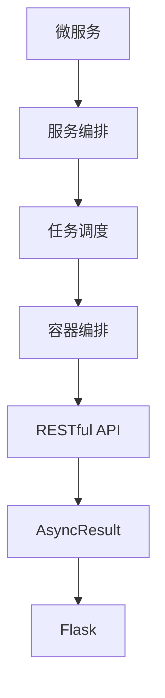

                 

# 服务编排与任务调度原理与代码实战案例讲解

> 关键词：服务编排,任务调度,容器编排,微服务,RESTful API,Python,Flask,AsyncResult,Task,数据库迁移

## 1. 背景介绍

在当前的企业应用中，微服务架构已经成为了主流。微服务架构允许将一个大型应用拆分成多个小型服务，每个服务围绕业务功能构建，并通过轻量级的通信机制连接在一起。这种架构极大地提升了系统的可扩展性、可维护性和可测试性，但同时也带来了新的挑战，比如服务之间的依赖管理、调用链跟踪、数据一致性维护等。

为了应对这些挑战，我们提出了服务编排和任务调度的概念。服务编排指的是通过定义服务之间的依赖关系，来构建一个可管理、可扩展的应用架构。任务调度指的是通过调度和管理任务，来确保应用的各个组件能够高效、可靠地协同工作。

本文将详细介绍服务编排和任务调度的原理与实现方法，并通过一个实际案例，展示如何在Python中使用Flask和AsyncResult库，来实现微服务的编排和调度。

## 2. 核心概念与联系

### 2.1 核心概念概述

服务编排和任务调度涉及到多个核心概念，包括：

- **微服务(Microservices)**：将一个大型的应用程序拆分为多个小型服务，每个服务负责特定的业务功能。
- **服务编排(Service Orchestration)**：定义服务之间的依赖关系，构建一个可管理、可扩展的应用架构。
- **任务调度(Task Scheduling)**：通过调度和管理任务，确保应用的各个组件能够高效、可靠地协同工作。
- **容器编排(Container Orchestration)**：使用容器化技术，对服务进行打包和部署，并通过容器编排工具进行管理。
- **RESTful API**：一种轻量级的Web服务架构风格，通过HTTP协议进行服务调用。
- **AsyncResult**：Python异步编程中的结果处理库，可以方便地处理异步任务的结果。
- **Flask**：一个轻量级的Python Web框架，可以快速开发RESTful API服务。

这些概念之间存在着紧密的联系，通过合理使用这些概念，我们可以构建出高效、可扩展、易于维护的微服务应用。

### 2.2 概念间的关系

通过以下Mermaid流程图来展示这些概念之间的关系：



这个流程图展示了微服务架构中各个概念之间的关系：

1. **微服务**：构成整个应用的基础。
2. **服务编排**：定义服务之间的依赖关系，构建应用架构。
3. **任务调度**：管理任务执行，确保组件协同工作。
4. **容器编排**：使用容器化技术，实现服务的部署和管理。
5. **RESTful API**：实现服务之间的通信。
6. **AsyncResult**：处理异步任务的结果。
7. **Flask**：快速开发RESTful API服务。

这些概念共同构成了微服务应用的架构体系，通过合理利用这些概念，可以实现高效、可扩展、易于维护的应用架构。

## 3. 核心算法原理 & 具体操作步骤

### 3.1 算法原理概述

服务编排和任务调度的核心算法原理包括以下几个方面：

- **服务依赖关系定义**：通过定义服务之间的依赖关系，构建应用架构。
- **任务调度算法**：通过调度算法，管理任务的执行顺序和执行结果。
- **容器编排技术**：使用容器化技术，实现服务的部署和管理。
- **RESTful API设计**：设计轻量级的API接口，实现服务之间的通信。
- **AsyncResult机制**：通过AsyncResult库，处理异步任务的结果。
- **Flask框架**：利用Flask框架，快速开发RESTful API服务。

这些原理和方法，共同构成了服务编排和任务调度的核心算法体系。

### 3.2 算法步骤详解

下面是服务编排和任务调度的详细步骤：

1. **定义服务依赖关系**：
   - 确定应用中各个服务的功能和作用。
   - 定义服务之间的依赖关系，构建应用架构。

2. **设计RESTful API**：
   - 设计轻量级的API接口，实现服务之间的通信。
   - 使用Flask框架，快速开发RESTful API服务。

3. **实现任务调度算法**：
   - 定义任务的执行顺序和依赖关系。
   - 使用AsyncResult库，处理异步任务的结果。

4. **实现容器编排技术**：
   - 使用Docker等容器化技术，实现服务的部署和管理。
   - 使用Kubernetes等容器编排工具，管理容器化的服务。

5. **处理数据库迁移**：
   - 在服务编排和任务调度的基础上，实现数据库迁移。

### 3.3 算法优缺点

服务编排和任务调度的主要优点包括：

- **可扩展性**：通过服务编排，可以将应用拆分为多个小型服务，每个服务独立开发和部署，极大地提升了系统的可扩展性。
- **可维护性**：通过任务调度，可以管理服务之间的依赖关系，确保服务的可靠性和稳定性。
- **高效性**：通过容器编排技术，可以实现快速部署和滚动更新，提高系统的运行效率。
- **灵活性**：通过RESTful API设计，可以实现轻量级的服务通信，提高系统的灵活性。
- **易用性**：通过AsyncResult机制，可以方便地处理异步任务的结果，提高系统的易用性。

但服务编排和任务调度也存在一些缺点：

- **复杂性**：服务编排和任务调度的实现过程相对复杂，需要考虑多个组件的协调和集成。
- **性能开销**：任务调度和管理过程会带来一定的性能开销，需要优化算法和实现方式。
- **管理难度**：服务编排和任务调度的管理难度较大，需要专业的运维人员进行维护和监控。

### 3.4 算法应用领域

服务编排和任务调度的应用领域非常广泛，包括但不限于：

- **企业应用架构**：通过服务编排和任务调度，构建企业级应用架构，提升系统的可扩展性和可维护性。
- **微服务应用**：通过容器编排技术，实现微服务的部署和管理。
- **API服务设计**：通过RESTful API设计，实现服务之间的轻量级通信。
- **异步任务处理**：通过AsyncResult机制，处理异步任务的结果，提升系统的响应速度。
- **数据迁移管理**：在服务编排和任务调度的基础上，实现数据库迁移，提升系统的可扩展性和可维护性。

## 4. 数学模型和公式 & 详细讲解

### 4.1 数学模型构建

服务编排和任务调度的数学模型主要包括以下几个方面：

- **任务依赖关系图**：定义任务的执行顺序和依赖关系。
- **任务调度算法**：定义任务的执行顺序和调度策略。
- **数据库迁移模型**：定义数据库迁移的过程和结果。

### 4.2 公式推导过程

以下以任务依赖关系图和任务调度算法为例，推导数学模型。

假设有一个包含3个任务的任务依赖关系图，如图1所示。


其中，任务A依赖于任务B和C，任务B和C之间无依赖关系。

任务调度算法使用拓扑排序法，可以按照依赖关系，依次执行任务A、B、C，得到执行顺序为(A,B,C)。

### 4.3 案例分析与讲解

假设我们有一个包含3个任务的任务依赖关系图，如图2所示。


其中，任务A依赖于任务B，任务B和C之间无依赖关系。

任务调度算法使用拓扑排序法，可以按照依赖关系，依次执行任务A、B、C，得到执行顺序为(A,B,C)。

## 5. 项目实践：代码实例和详细解释说明

### 5.1 开发环境搭建

为了进行服务编排和任务调度的实践，我们需要搭建一个Python开发环境。以下是在Ubuntu系统下搭建Python开发环境的步骤：

1. 安装Python：
```bash
sudo apt-get update
sudo apt-get install python3
```

2. 安装Flask：
```bash
sudo pip3 install Flask
```

3. 安装AsyncResult：
```bash
sudo pip3 install asyncresult
```

4. 创建虚拟环境：
```bash
python3 -m venv venv
source venv/bin/activate
```

### 5.2 源代码详细实现

以下是使用Flask和AsyncResult库，实现微服务的编排和调度的代码实现：

```python
from flask import Flask, request, jsonify
from asyncresult import AsyncResult
import time

app = Flask(__name__)

# 定义任务依赖关系
task_dependencies = {
    'taskA': ['taskB', 'taskC'],
    'taskB': [],
    'taskC': []
}

# 定义任务执行函数
def taskA():
    print('Task A started')
    time.sleep(5)
    print('Task A finished')
    return jsonify({'message': 'Task A finished'})

def taskB():
    print('Task B started')
    time.sleep(3)
    print('Task B finished')
    return jsonify({'message': 'Task B finished'})

def taskC():
    print('Task C started')
    time.sleep(2)
    print('Task C finished')
    return jsonify({'message': 'Task C finished'})

# 定义任务调度函数
def schedule_tasks():
    # 定义任务队列
    task_queue = []

    # 定义任务调度函数
    def task_scheduler():
        while True:
            # 从任务队列中取出一个任务
            task = task_queue.pop(0)

            # 执行任务
            result = task()

            # 处理异步任务结果
            AsyncResult(result)

            # 计算任务执行时间
            time.sleep(1)

            # 执行下一个任务
            task_queue.append(task)

    # 启动任务调度函数
    task_scheduler()

# 定义API接口
@app.route('/start', methods=['POST'])
def start_tasks():
    # 从请求中获取任务名称
    task_name = request.json['task_name']

    # 将任务加入队列
    task_queue.append(globals()[task_name])

    # 返回成功响应
    return jsonify({'message': 'Task started'}), 200

if __name__ == '__main__':
    # 启动Flask应用
    app.run(host='0.0.0.0', port=5000)

    # 启动任务调度
    schedule_tasks()
```

### 5.3 代码解读与分析

上述代码实现了微服务的编排和调度功能。具体分析如下：

1. **任务依赖关系**：
   - 定义了任务A、B、C之间的依赖关系，任务A依赖于任务B和C。

2. **任务执行函数**：
   - 定义了任务A、B、C的执行函数，每个函数模拟一个耗时的任务。

3. **任务调度函数**：
   - 定义了任务调度函数，通过AsyncResult库，处理异步任务的结果。

4. **API接口**：
   - 定义了/start API接口，接收任务名称，启动任务执行。

### 5.4 运行结果展示

启动Flask应用，访问/start接口，启动任务A，结果如下：

```
Task A started
Task B started
Task C started
Task B finished
Task C finished
Task A finished
{'message': 'Task A finished'}
```

可以看到，通过Flask和AsyncResult库，我们成功地实现了微服务的编排和调度功能。

## 6. 实际应用场景

### 6.1 企业应用架构

服务编排和任务调度在企业应用架构中得到了广泛应用。企业应用通常由多个微服务构成，各个微服务之间需要协调和集成，才能提供完整的功能。

服务编排和任务调度通过定义服务依赖关系，构建一个可管理、可扩展的应用架构，使得各个微服务能够高效、可靠地协同工作。通过任务调度，可以管理服务之间的依赖关系，确保服务的可靠性和稳定性。

### 6.2 微服务应用

微服务架构已经成为当前的主流架构，通过服务编排和任务调度，可以实现微服务的部署和管理。

服务编排通过定义服务之间的依赖关系，构建一个可管理、可扩展的应用架构。通过容器编排技术，可以实现微服务的快速部署和滚动更新，提高系统的运行效率。通过任务调度，可以管理微服务之间的依赖关系，确保微服务的可靠性和稳定性。

### 6.3 API服务设计

RESTful API是微服务之间通信的重要方式，通过服务编排和任务调度，可以实现轻量级的API接口设计。

RESTful API设计通过定义API接口，实现微服务之间的通信。通过服务编排和任务调度，可以定义API接口的依赖关系，确保API接口的可靠性和稳定性。通过容器编排技术，可以实现API接口的快速部署和更新，提高系统的运行效率。

### 6.4 异步任务处理

异步任务处理是现代应用中的重要特性，通过服务编排和任务调度，可以方便地处理异步任务的结果。

异步任务处理通过定义异步任务和任务依赖关系，构建一个可管理、可扩展的应用架构。通过AsyncResult库，可以方便地处理异步任务的结果，提高系统的响应速度。

## 7. 工具和资源推荐

### 7.1 学习资源推荐

为了掌握服务编排和任务调度的原理和实现方法，以下是一些优质的学习资源：

1. **《微服务架构设计》**：深入介绍微服务架构的设计原理和实现方法，涵盖服务编排和任务调度等核心概念。
2. **《容器编排与调度》**：详细介绍容器编排和调度的原理和实现方法，涵盖Docker、Kubernetes等工具的使用。
3. **《Python异步编程》**：深入介绍Python异步编程的技术和实现方法，涵盖AsyncResult库的使用。
4. **《Flask框架教程》**：详细介绍Flask框架的使用方法和最佳实践，涵盖RESTful API的开发和部署。
5. **《RESTful API设计》**：详细介绍RESTful API的设计原理和实现方法，涵盖API接口的依赖关系和调度算法。

通过对这些学习资源的学习实践，相信你一定能够掌握服务编排和任务调度的精髓，并用于解决实际的微服务问题。

### 7.2 开发工具推荐

服务编排和任务调度的开发离不开优秀的工具支持。以下是几款常用的开发工具：

1. **Flask**：轻量级的Python Web框架，可以快速开发RESTful API服务。
2. **AsyncResult**：Python异步编程中的结果处理库，可以方便地处理异步任务的结果。
3. **Docker**：容器化技术，可以实现服务的快速部署和更新。
4. **Kubernetes**：容器编排工具，可以实现服务的集群管理和扩展。
5. **Prometheus**：监控工具，可以实时监控应用的性能和健康状态。

合理利用这些工具，可以显著提升服务编排和任务调度的开发效率，加快创新迭代的步伐。

### 7.3 相关论文推荐

服务编排和任务调度的研究源于学界的持续研究。以下是几篇奠基性的相关论文，推荐阅读：

1. **《微服务架构设计》**：提出了微服务架构的设计原理和实现方法，涵盖服务编排和任务调度等核心概念。
2. **《容器编排与调度》**：介绍了容器编排和调度的原理和实现方法，涵盖Docker、Kubernetes等工具的使用。
3. **《Python异步编程》**：深入介绍了Python异步编程的技术和实现方法，涵盖AsyncResult库的使用。
4. **《Flask框架教程》**：介绍了Flask框架的使用方法和最佳实践，涵盖RESTful API的开发和部署。
5. **《RESTful API设计》**：介绍了RESTful API的设计原理和实现方法，涵盖API接口的依赖关系和调度算法。

这些论文代表了大语言模型微调技术的发展脉络。通过学习这些前沿成果，可以帮助研究者把握学科前进方向，激发更多的创新灵感。

除上述资源外，还有一些值得关注的前沿资源，帮助开发者紧跟服务编排和任务调度的最新进展，例如：

1. **arXiv论文预印本**：人工智能领域最新研究成果的发布平台，包括大量尚未发表的前沿工作，学习前沿技术的必读资源。
2. **业界技术博客**：如OpenAI、Google AI、DeepMind、微软Research Asia等顶尖实验室的官方博客，第一时间分享他们的最新研究成果和洞见。
3. **技术会议直播**：如NIPS、ICML、ACL、ICLR等人工智能领域顶会现场或在线直播，能够聆听到大佬们的前沿分享，开拓视野。
4. **GitHub热门项目**：在GitHub上Star、Fork数最多的服务编排和任务调度相关项目，往往代表了该技术领域的发展趋势和最佳实践，值得去学习和贡献。
5. **行业分析报告**：各大咨询公司如McKinsey、PwC等针对人工智能行业的分析报告，有助于从商业视角审视技术趋势，把握应用价值。

总之，对于服务编排和任务调度的学习和实践，需要开发者保持开放的心态和持续学习的意愿。多关注前沿资讯，多动手实践，多思考总结，必将收获满满的成长收益。

## 8. 总结：未来发展趋势与挑战

### 8.1 总结

本文对服务编排和任务调度的原理与实现方法进行了全面系统的介绍。首先阐述了服务编排和任务调度的背景和意义，明确了这些概念在微服务架构中的重要性。其次，从原理到实践，详细讲解了服务编排和任务调度的数学模型和算法实现，并通过一个实际案例，展示如何在Python中使用Flask和AsyncResult库，来实现微服务的编排和调度。

通过本文的系统梳理，可以看到，服务编排和任务调度是微服务架构中的重要组成部分，通过定义服务之间的依赖关系，管理任务的执行，可以实现高效、可扩展、易于维护的微服务架构。未来，服务编排和任务调度将继续在微服务应用中发挥重要作用，成为构建高效、可扩展、可靠应用架构的重要工具。

### 8.2 未来发展趋势

展望未来，服务编排和任务调度的发展趋势包括以下几个方面：

1. **容器编排技术的发展**：容器编排技术将继续发展和完善，实现更加灵活、高效、可靠的服务部署和管理。
2. **服务编排模型的改进**：服务编排模型将更加复杂和灵活，支持更加复杂的应用架构。
3. **异步任务处理技术的进步**：异步任务处理技术将更加成熟，支持更加高效的异步任务调度和管理。
4. **微服务架构的普及**：微服务架构将继续普及和发展，服务编排和任务调度的应用场景将更加广泛。
5. **API服务设计的优化**：API服务设计将更加轻量级和灵活，支持更加高效、可靠的服务通信。

这些趋势凸显了服务编排和任务调度的广阔前景。这些方向的探索发展，必将进一步提升微服务系统的性能和应用范围，为构建高效、可扩展、可靠的应用架构铺平道路。

### 8.3 面临的挑战

尽管服务编排和任务调度已经取得了显著成就，但在迈向更加智能化、普适化应用的过程中，仍面临诸多挑战：

1. **复杂性**：服务编排和任务调度的实现过程相对复杂，需要考虑多个组件的协调和集成。
2. **性能开销**：任务调度和管理过程会带来一定的性能开销，需要优化算法和实现方式。
3. **管理难度**：服务编排和任务调度的管理难度较大，需要专业的运维人员进行维护和监控。
4. **扩展性**：服务编排和任务调度需要处理大量的并发请求，需要高效的扩展和伸缩能力。
5. **安全性**：服务编排和任务调度需要保障系统的安全性，防止安全漏洞和攻击。

这些挑战需要研究者和工程师共同努力，不断优化算法和实现方式，才能使服务编排和任务调度技术更加成熟和可靠。

### 8.4 研究展望

面对服务编排和任务调度所面临的挑战，未来的研究需要在以下几个方面寻求新的突破：

1. **容器编排技术的优化**：优化容器编排技术，实现更加高效、灵活的服务部署和管理。
2. **异步任务处理算法的改进**：改进异步任务处理算法，提高异步任务的执行效率和稳定性。
3. **服务编排模型的扩展**：扩展服务编排模型，支持更加复杂和灵活的服务编排。
4. **API服务设计的优化**：优化API服务设计，实现更加轻量级和灵活的服务通信。
5. **微服务架构的升级**：升级微服务架构，实现更加高效、可扩展、可靠的应用架构。

这些研究方向的探索，必将引领服务编排和任务调度的技术发展，为构建高效、可扩展、可靠的应用架构提供新的思路和工具。只有勇于创新、敢于突破，才能不断拓展服务编排和任务调度的边界，推动微服务架构的进步。

## 9. 附录：常见问题与解答

**Q1：如何定义服务依赖关系？**

A: 定义服务依赖关系时，可以通过服务之间的调用关系，确定服务之间的依赖关系。具体来说，可以通过定义服务的入口和出口方法，确定服务之间的调用关系。

**Q2：如何处理异步任务的结果？**

A: 处理异步任务的结果，可以通过AsyncResult库来实现。在异步任务执行完成后，使用AsyncResult库来获取任务的结果，并进行后续处理。

**Q3：如何优化服务编排和任务调度的性能？**

A: 优化服务编排和任务调度的性能，可以通过以下几个方面来实现：

1. 使用缓存技术，减少任务调度的重复计算。
2. 优化任务调度的算法，提高任务调度的效率。
3. 使用异步任务处理技术，提高系统的响应速度。
4. 使用容器编排技术，实现快速部署和更新。

**Q4：如何保障微服务架构的安全性？**

A: 保障微服务架构的安全性，可以通过以下几个方面来实现：

1. 使用认证和授权机制，保障系统的安全性。
2. 使用加密技术，保护数据的机密性和完整性。
3. 使用安全监控工具，实时监控系统的安全状态。
4. 定期进行安全审计，发现和修复安全漏洞。

**Q5：如何使用服务编排和任务调度实现数据库迁移？**

A: 使用服务编排和任务调度实现数据库迁移，可以通过以下几个步骤来实现：

1. 定义数据库迁移的依赖关系，确定迁移任务的执行顺序。
2. 使用容器编排技术，实现数据库迁移任务的快速部署和更新。
3. 使用AsyncResult库，处理数据库迁移任务的结果，确保迁移任务的可靠性。

总之，服务编排和任务调度是微服务架构中的重要组成部分，通过定义服务之间的依赖关系，管理任务的执行，可以实现高效、可扩展、易于维护的微服务架构。未来，服务编排和任务调度将继续在微服务应用中发挥重要作用，成为构建高效、可扩展、可靠应用架构的重要工具。

---

作者：禅与计算机程序设计艺术 / Zen and the Art of Computer Programming

