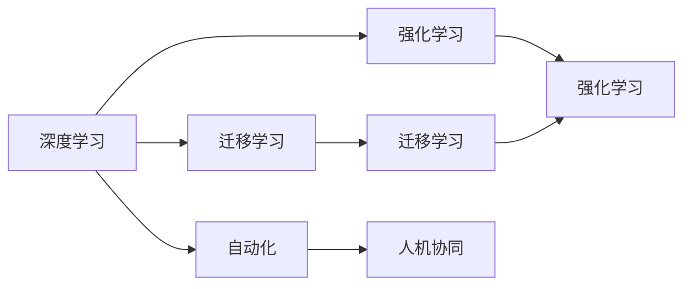

                 

# 李开复：AI 2.0 时代的开发者

在人工智能的快速发展下，AI 2.0 时代已经悄然来临。这是一个全新的时代，它不仅仅意味着技术上的突破，更意味着对开发者提出了更高的要求。作为全球知名的人工智能专家，李开复博士曾说：“AI 2.0 时代，开发者将成为主角。”本文将深入探讨李开复的观点，结合最新的AI技术发展趋势，为AI 2.0时代的开发者提供一份全面而实用的指南。

## 1. 背景介绍

### 1.1 问题由来

AI 1.0时代，也就是传统的机器学习时代，主要是通过手工设计特征来训练模型。然而，随着数据量的增加和计算能力的提升，AI 2.0时代的大数据、深度学习和强化学习等技术开始崭露头角，逐渐取代了传统方法。特别是在深度学习领域，从神经网络、卷积神经网络、循环神经网络到Transformer，深度学习模型在图像识别、自然语言处理和语音识别等方面取得了显著的进步。

### 1.2 问题核心关键点

AI 2.0时代的核心在于以下几个关键点：

1. **大数据**：AI 2.0时代的数据量以指数级增长，如何有效管理和利用这些数据成为了一个重大挑战。
2. **深度学习**：深度学习模型在大数据背景下，通过多层次的神经网络结构，实现了对复杂问题的建模。
3. **强化学习**：强化学习通过与环境的交互，自动优化决策策略，具有很强的自适应能力。
4. **自动化**：AI 2.0时代的一个重要特征是自动化，许多繁琐、重复性的任务可以被机器取代。
5. **人机协同**：AI 2.0时代，AI和人类不再是零和关系，而是协同工作，共同解决问题。

### 1.3 问题研究意义

理解AI 2.0时代的发展趋势，对于开发者而言具有重要意义：

1. **技术领先**：掌握最新技术，保持技术领先。
2. **应用范围**：了解AI 2.0技术在各个领域的应用，拓展应用范围。
3. **就业机会**：随着AI 2.0技术的普及，就业市场将有更多机会。
4. **问题解决**：AI 2.0技术提供了新的工具和方法，解决传统难题。
5. **行业发展**：AI 2.0技术推动各个行业的发展，创造新的商业模式。

## 2. 核心概念与联系

### 2.1 核心概念概述

要全面理解AI 2.0时代的开发者所面临的挑战和机遇，我们需要了解以下几个核心概念：

- **深度学习**：通过多层神经网络结构，自动学习特征，实现复杂问题的建模。
- **迁移学习**：将在一个任务上学到的知识，迁移到另一个任务上，提高新任务的学习效率。
- **强化学习**：通过与环境的交互，自动优化决策策略，具有很强的自适应能力。
- **自动化**：将传统需要人工处理的任务自动化，提高效率和准确性。
- **人机协同**：AI与人类协作，共同解决问题。

### 2.2 概念间的关系

这些核心概念之间的逻辑关系可以通过以下Mermaid流程图来展示：



这个流程图展示了大数据、深度学习、迁移学习、强化学习、自动化和人机协同之间的关系：

1. 深度学习模型在大量数据上训练，学习特征。
2. 迁移学习将深度学习得到的知识迁移到新的任务上，提高新任务的学习效率。
3. 强化学习通过与环境的交互，自动优化决策策略。
4. 自动化将传统需要人工处理的任务交给机器处理，提高效率。
5. 人机协同是AI与人类协作解决问题，实现最优解决方案。

## 3. 核心算法原理 & 具体操作步骤

### 3.1 算法原理概述

AI 2.0时代的核心算法原理主要包括深度学习、迁移学习和强化学习。这里以深度学习为例，简要介绍其原理。

深度学习模型通常由多个层次的神经网络组成，每个层次学习不同的特征。模型的输入是原始数据，经过多层变换，输出为目标变量。模型的目标是通过反向传播算法，最小化损失函数，优化模型的参数，使其输出与目标变量的误差最小。

### 3.2 算法步骤详解

以深度学习为例，以下是深度学习模型训练的详细步骤：

1. **数据预处理**：对数据进行清洗、归一化、分批处理等操作，为模型输入做好准备。
2. **模型搭建**：选择适当的深度学习模型架构，并根据任务需求进行参数初始化。
3. **训练过程**：通过前向传播和反向传播，计算损失函数，更新模型参数。
4. **验证和测试**：在验证集和测试集上评估模型性能，调整参数，直到满足要求。
5. **部署应用**：将训练好的模型部署到生产环境中，进行实际应用。

### 3.3 算法优缺点

深度学习算法的优点包括：

1. **自动学习特征**：无需手工设计特征，能够自动学习数据中的复杂模式。
2. **高泛化能力**：在大量数据上训练，具有很强的泛化能力。
3. **精度高**：在许多任务上，深度学习模型能够取得很高的精度。

缺点包括：

1. **计算量大**：需要大量的计算资源和存储空间。
2. **过拟合风险**：模型容易过拟合，需要采取正则化等方法缓解。
3. **可解释性差**：深度学习模型通常是“黑盒”模型，难以解释其内部工作机制。

### 3.4 算法应用领域

深度学习算法在以下领域得到了广泛应用：

1. **计算机视觉**：图像识别、物体检测、人脸识别等。
2. **自然语言处理**：机器翻译、情感分析、文本生成等。
3. **语音识别**：语音转文本、语音识别等。
4. **推荐系统**：个性化推荐、广告推荐等。
5. **医疗领域**：医学图像分析、疾病预测等。
6. **金融领域**：信用评估、风险预测等。

## 4. 数学模型和公式 & 详细讲解

### 4.1 数学模型构建

深度学习模型的数学模型通常包括输入数据、权重参数和损失函数。以二分类问题为例，数学模型如下：

- 输入数据：$x$，表示特征向量。
- 权重参数：$\theta$，表示神经网络的参数。
- 损失函数：$\mathcal{L}$，表示模型输出的预测值与真实值之间的误差。

### 4.2 公式推导过程

以二分类问题为例，假设模型输出的概率为$P(y=1|x;\theta)$，则损失函数为：

$$
\mathcal{L}(\theta) = -\frac{1}{N}\sum_{i=1}^N [y_i\log P(y=1|x_i;\theta) + (1-y_i)\log (1-P(y=1|x_i;\theta))]
$$

其中$y_i$表示第$i$个样本的真实标签，$P(y=1|x_i;\theta)$表示模型输出的概率。

### 4.3 案例分析与讲解

以图像分类任务为例，假设输入数据为28x28的灰度图像，输出目标为0-9的数字。模型结构为：

- 输入层：28x28的像素值。
- 隐藏层：包含多个神经元的全连接层。
- 输出层：10个神经元的softmax层。

训练过程包括：

1. 前向传播：将输入数据输入模型，得到输出概率。
2. 反向传播：计算损失函数，更新权重参数。
3. 重复多次，直至收敛。

## 5. 项目实践：代码实例和详细解释说明

### 5.1 开发环境搭建

在进行深度学习项目开发前，需要先搭建开发环境。以下是使用Python进行TensorFlow开发的环境配置流程：

1. 安装Anaconda：从官网下载并安装Anaconda，用于创建独立的Python环境。

2. 创建并激活虚拟环境：
```bash
conda create -n tensorflow-env python=3.8 
conda activate tensorflow-env
```

3. 安装TensorFlow：根据CUDA版本，从官网获取对应的安装命令。例如：
```bash
conda install tensorflow -c conda-forge
```

4. 安装各类工具包：
```bash
pip install numpy pandas scikit-learn matplotlib tqdm jupyter notebook ipython
```

完成上述步骤后，即可在`tensorflow-env`环境中开始深度学习项目开发。

### 5.2 源代码详细实现

这里我们以手写数字识别为例，使用TensorFlow实现深度学习模型的训练和评估。

```python
import tensorflow as tf
from tensorflow.keras import datasets, layers, models

# 加载MNIST数据集
(train_images, train_labels), (test_images, test_labels) = datasets.mnist.load_data()

# 数据预处理
train_images = train_images / 255.0
test_images = test_images / 255.0

# 定义模型
model = models.Sequential([
    layers.Flatten(input_shape=(28, 28)),
    layers.Dense(128, activation='relu'),
    layers.Dense(10)
])

# 编译模型
model.compile(optimizer='adam',
              loss=tf.keras.losses.SparseCategoricalCrossentropy(from_logits=True),
              metrics=['accuracy'])

# 训练模型
history = model.fit(train_images, train_labels, epochs=10, 
                    validation_data=(test_images, test_labels))

# 评估模型
test_loss, test_acc = model.evaluate(test_images,  test_labels, verbose=2)
print(test_acc)
```

### 5.3 代码解读与分析

以下是关键代码的解读与分析：

- 数据预处理：将像素值归一化到[0,1]之间，防止梯度爆炸。
- 模型定义：包含一个Flatten层将输入展平，两个全连接层，其中最后一层输出10个神经元，表示10个类别的概率分布。
- 模型编译：使用Adam优化器，交叉熵损失函数，评估指标为准确率。
- 模型训练：使用训练集进行10个epoch的训练，并使用测试集进行验证。
- 模型评估：在测试集上评估模型性能，输出准确率。

### 5.4 运行结果展示

假设模型在测试集上得到的准确率为98%，即正确识别了约98%的手写数字。

## 6. 实际应用场景

### 6.1 自动驾驶

自动驾驶系统是AI 2.0时代的重要应用之一。它需要综合利用计算机视觉、深度学习和强化学习等技术，实现对复杂道路环境的感知、决策和控制。

在实际应用中，可以通过深度学习模型对摄像头、雷达等传感器采集的数据进行预处理和特征提取，然后使用强化学习模型对决策策略进行优化。自动驾驶系统能够实时感知周边环境，自动规划路径，并做出合理的驾驶决策，确保行车安全。

### 6.2 医疗诊断

医疗诊断是AI 2.0时代的重要应用之一。深度学习模型在医学影像分析、疾病预测等方面表现优异，能够辅助医生进行诊断和治疗。

以医学影像分析为例，可以通过深度学习模型对CT、MRI等医学影像进行特征提取和分析，识别出病变区域和病变类型。然后，使用迁移学习模型将医学影像分析的知识迁移到其他医学任务上，如疾病预测、药物推荐等。

### 6.3 智能推荐

智能推荐系统是AI 2.0时代的重要应用之一。它通过深度学习模型对用户行为进行分析和预测，推荐用户可能感兴趣的商品、内容等。

在实际应用中，可以通过深度学习模型对用户行为数据进行特征提取和建模，然后使用迁移学习模型将用户行为分析的知识迁移到推荐任务上。智能推荐系统能够根据用户的兴趣和偏好，实时推荐个性化的商品和内容，提升用户体验。

### 6.4 未来应用展望

随着AI 2.0技术的不断进步，未来的应用场景将更加广泛，涵盖更多行业和领域。以下是最具潜力的几个应用场景：

1. **智慧城市**：AI 2.0技术在智慧城市中的应用将极大地提升城市管理和居民生活质量。例如，通过智能交通系统，优化交通流量，减少拥堵；通过智能安防系统，提高公共安全。

2. **智能制造**：AI 2.0技术在智能制造中的应用将推动制造业的数字化和智能化转型。例如，通过智能生产线和机器人，提升生产效率和质量；通过预测性维护，减少设备故障率。

3. **智慧医疗**：AI 2.0技术在智慧医疗中的应用将提升医疗服务的质量和效率。例如，通过智能诊断系统，辅助医生进行疾病诊断；通过智能治疗系统，优化治疗方案。

4. **金融科技**：AI 2.0技术在金融科技中的应用将提升金融服务的效率和安全性。例如，通过智能风控系统，识别和防范金融风险；通过智能投顾系统，提供个性化的投资建议。

5. **智能家居**：AI 2.0技术在智能家居中的应用将提升家居生活的舒适度和便利性。例如，通过智能音箱，控制家居设备；通过智能安防系统，提高家庭安全。

## 7. 工具和资源推荐

### 7.1 学习资源推荐

为了帮助开发者系统掌握AI 2.0技术，这里推荐一些优质的学习资源：

1. **《深度学习》书籍**：Ian Goodfellow等人编写的经典书籍，全面介绍了深度学习的基本原理和算法。
2. **《机器学习实战》书籍**：Peter Harrington等人编写的实战书籍，提供了丰富的代码示例和实践案例。
3. **TensorFlow官方文档**：TensorFlow的官方文档，提供了详细的API和教程，帮助开发者快速上手。
4. **Kaggle平台**：Kaggle是全球最大的数据科学竞赛平台，提供丰富的数据集和模型比赛，帮助开发者提升实战能力。
5. **Coursera平台**：Coursera提供了多门AI和机器学习课程，由知名高校和专家授课，涵盖理论和实践。

### 7.2 开发工具推荐

高效的开发离不开优秀的工具支持。以下是几款用于AI 2.0项目开发的常用工具：

1. **TensorFlow**：由Google主导开发的开源深度学习框架，生产部署方便，适合大规模工程应用。
2. **PyTorch**：由Facebook主导开发的开源深度学习框架，灵活动态的计算图，适合快速迭代研究。
3. **Jupyter Notebook**：一个交互式的代码编辑器，支持Python、R等多种语言，方便开发者进行实验和分享。
4. **GitHub**：全球最大的代码托管平台，方便开发者进行代码管理和版本控制。
5. **Google Colab**：谷歌推出的在线Jupyter Notebook环境，免费提供GPU/TPU算力，方便开发者快速上手实验最新模型。

### 7.3 相关论文推荐

AI 2.0技术的发展源于学界的持续研究。以下是几篇奠基性的相关论文，推荐阅读：

1. **《ImageNet Classification with Deep Convolutional Neural Networks》**：Alex Krizhevsky等人撰写的经典论文，提出了卷积神经网络在图像分类任务上的优越性能。
2. **《A Theoretical Framework for Multi-Task Learning》**：Benjamin schemmel等人撰写的论文，提出多任务学习的基本框架和理论。
3. **《AlphaGo Zero》**：David Silver等人撰写的论文，展示了强化学习在棋类游戏中的应用，取得了人类水平的成绩。
4. **《Attention is All You Need》**：Ashish Vaswani等人撰写的论文，提出了Transformer模型，展示了其在自然语言处理任务上的优越性能。
5. **《BERT: Pre-training of Deep Bidirectional Transformers for Language Understanding》**：Jacob Devlin等人撰写的论文，展示了BERT模型在自然语言处理任务上的卓越性能。

这些论文代表了AI 2.0技术的发展脉络，通过学习这些前沿成果，可以帮助研究者把握学科前进方向，激发更多的创新灵感。

## 8. 总结：未来发展趋势与挑战

### 8.1 研究成果总结

AI 2.0时代的到来，给AI领域带来了新的发展机遇和挑战。深度学习、迁移学习和强化学习等技术的不断进步，使得AI 2.0技术在各个领域得到了广泛应用，推动了人工智能的快速发展。

### 8.2 未来发展趋势

未来，AI 2.0技术将呈现以下几个发展趋势：

1. **多模态学习**：AI 2.0技术将突破传统单模态限制，实现多模态信息的融合，提升模型的复杂度和表现力。
2. **自适应学习**：AI 2.0技术将具备更强的自适应能力，能够根据环境和任务变化，自动调整模型参数和结构。
3. **分布式计算**：AI 2.0技术将利用分布式计算，实现高效的模型训练和推理。
4. **联邦学习**：AI 2.0技术将实现联邦学习，保护数据隐私的同时，实现模型的协同优化。
5. **边缘计算**：AI 2.0技术将利用边缘计算，实现高效的数据处理和模型推理。
6. **人机协同**：AI 2.0技术将进一步提升人机协同的效率和效果，实现更智能的决策和互动。

### 8.3 面临的挑战

尽管AI 2.0技术取得了显著进展，但在迈向更加智能化、普适化应用的过程中，仍面临诸多挑战：

1. **计算资源**：AI 2.0技术需要大量的计算资源，包括GPU、TPU等高性能设备，如何高效利用这些资源，是一个重要挑战。
2. **数据隐私**：AI 2.0技术在处理大量数据时，如何保护数据隐私，避免数据泄露，是一个重要问题。
3. **模型可解释性**：AI 2.0技术通常是“黑盒”模型，难以解释其内部工作机制，如何提升模型的可解释性，是一个重要挑战。
4. **公平性和伦理**：AI 2.0技术在应用过程中，如何避免偏见和歧视，保障公平性和伦理，是一个重要问题。
5. **系统安全性**：AI 2.0技术在应用过程中，如何防止恶意攻击，保障系统安全性，是一个重要问题。

### 8.4 研究展望

面对AI 2.0技术所面临的种种挑战，未来的研究需要在以下几个方面寻求新的突破：

1. **计算资源优化**：通过优化计算图、分布式计算、边缘计算等技术，提高计算资源的利用效率。
2. **数据隐私保护**：通过联邦学习、差分隐私等技术，保护数据隐私，避免数据泄露。
3. **模型可解释性增强**：通过可解释性模型、因果分析等技术，提升模型的可解释性，增强用户信任。
4. **公平性和伦理保障**：通过公平性约束、伦理评估等技术，保障AI 2.0技术的公平性和伦理。
5. **系统安全性提升**：通过安全检测、鲁棒性训练等技术，提升AI 2.0技术的安全性，保障系统稳定性。

这些研究方向的探索，必将引领AI 2.0技术迈向更高的台阶，为构建安全、可靠、可解释、可控的智能系统铺平道路。面向未来，AI 2.0技术还需要与其他AI技术进行更深入的融合，如知识表示、因果推理、强化学习等，多路径协同发力，共同推动自然语言理解和智能交互系统的进步。只有勇于创新、敢于突破，才能不断拓展AI 2.0技术的边界，让智能技术更好地造福人类社会。

## 9. 附录：常见问题与解答

**Q1：AI 2.0时代，开发者需要掌握哪些技能？**

A: AI 2.0时代，开发者需要掌握以下技能：

1. **深度学习**：掌握深度学习的基本原理和算法。
2. **多模态学习**：掌握多模态信息的融合技术。
3. **分布式计算**：掌握分布式计算的基本概念和实践。
4. **联邦学习**：掌握联邦学习的基本概念和实践。
5. **边缘计算**：掌握边缘计算的基本概念和实践。
6. **模型可解释性**：掌握可解释性模型的基本概念和实践。
7. **公平性和伦理**：掌握公平性和伦理评估的基本概念和实践。
8. **系统安全性**：掌握系统安全性检测的基本概念和实践。

**Q2：如何高效利用计算资源？**

A: 高效利用计算资源，可以通过以下方法：

1. **分布式计算**：使用分布式计算框架，如TensorFlow、PyTorch等，并行处理大规模数据。
2. **边缘计算**：使用边缘计算设备，如智能终端、物联网设备等，降低数据传输成本。
3. **量化加速**：使用量化技术，将浮点模型转为定点模型，降低计算资源消耗。
4. **混合精度训练**：使用混合精度训练技术，提升计算效率。

**Q3：如何保护数据隐私？**

A: 保护数据隐私，可以通过以下方法：

1. **差分隐私**：通过差分隐私技术，在数据处理过程中添加噪声，保护用户隐私。
2. **联邦学习**：通过联邦学习技术，在分布式环境下，模型在本地训练，避免数据泄露。
3. **加密算法**：通过加密算法，保护数据传输和存储过程中的隐私。

**Q4：如何提升模型可解释性？**

A: 提升模型可解释性，可以通过以下方法：

1. **可解释性模型**：使用可解释性模型，如LIME、SHAP等，解释模型决策过程。
2. **因果分析**：通过因果分析技术，识别模型决策的关键特征，增强用户信任。

**Q5：如何保障公平性和伦理？**

A: 保障公平性和伦理，可以通过以下方法：

1. **公平性约束**：通过公平性约束技术，避免模型偏见和歧视。
2. **伦理评估**：通过伦理评估技术，评估模型决策的公平性和伦理。

---

作者：禅与计算机程序设计艺术 / Zen and the Art of Computer Programming

