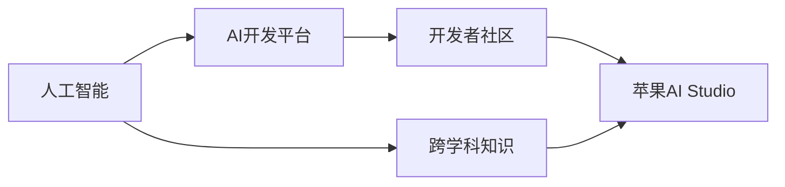

                 

# 李开复：苹果发布AI应用的开发者

## 1. 背景介绍

### 1.1 问题由来
苹果公司在2023年4月宣布了其最新的人工智能应用开发平台——"AI Studio"，旨在为开发人员提供一个简单、直观且强大的AI开发环境。苹果的这一举措，无疑将推动人工智能技术在更多行业中的应用落地，同时也对开发者提出了更高的要求。李开复作为人工智能领域的知名专家，他如何看待苹果的这一创新，以及他对开发者有什么建议，成为了人们关注的焦点。

### 1.2 问题核心关键点
苹果的"AI Studio"平台，结合了苹果在硬件、软件和数据上的优势，为开发者提供了强大的AI计算能力、丰富的数据集和便捷的开发工具。李开复指出，该平台的发布，将进一步降低开发者入门的门槛，推动人工智能技术的普及和发展。他强调，AI开发者需要具备跨学科的知识，不仅要有计算机科学和数学基础，还要掌握领域知识，理解数据特性。

## 2. 核心概念与联系

### 2.1 核心概念概述

在讨论苹果AI应用的开发者时，我们首先需要理解以下几个核心概念：

- **人工智能**：使用计算机技术模拟和扩展人类智能的学科，包括机器学习、深度学习、自然语言处理、计算机视觉等。
- **AI开发平台**：提供开发AI应用所需的工具、环境和数据集，如TensorFlow、PyTorch、MXNet等。
- **开发者社区**：由开发者组成的社区，分享经验、交流知识、协同开发，加速AI技术的发展。
- **苹果AI Studio**：苹果公司推出的AI应用开发平台，集成了硬件、软件和数据资源，为开发者提供一站式解决方案。
- **跨学科知识**：开发者不仅需要具备计算机科学和数学基础，还需要了解所在领域的知识，如医学、金融、制造等。

### 2.2 概念间的关系

这些核心概念之间的关系可以通过以下Mermaid流程图来展示：



这个流程图展示了人工智能、AI开发平台、开发者社区和苹果AI Studio之间的联系。人工智能的普及和发展，依赖于开发者社区的建设，而苹果AI Studio作为AI开发平台之一，通过提供丰富的资源和便捷的工具，进一步降低了开发者入门的门槛，推动了人工智能技术在更多行业中的应用。开发者社区的建设，同样需要跨学科知识的融合，使开发者能够更好地理解和应用人工智能技术。

## 3. 核心算法原理 & 具体操作步骤
### 3.1 算法原理概述

苹果AI Studio平台的核心算法原理主要包括深度学习、强化学习、自然语言处理等，这些技术构成了AI开发的基础。李开复指出，深度学习是当前AI应用开发中最常用的技术之一，其通过多层神经网络模拟人脑的神经元工作机制，可以处理复杂的非线性问题。强化学习则是通过奖励机制，让机器在不断的试错中学习和改进，适用于需要决策的问题。自然语言处理则是处理和理解人类语言的技术，包括语音识别、文本分类、机器翻译等。

### 3.2 算法步骤详解

1. **数据收集与预处理**：收集相关领域的数据集，并进行清洗、标注和归一化处理，以便后续训练模型。
2. **模型选择与训练**：根据任务类型选择合适的模型，如卷积神经网络（CNN）、循环神经网络（RNN）、长短期记忆网络（LSTM）、Transformer等，在数据集上进行训练。
3. **模型评估与优化**：使用验证集评估模型的性能，通过交叉验证、超参数调优等方法，不断改进模型。
4. **模型部署与应用**：将训练好的模型部署到实际应用场景中，如智能手机、电脑、物联网设备等，进行实时推理和预测。

### 3.3 算法优缺点

苹果AI Studio平台的优点包括：

- **硬件支持**：苹果设备如iPhone、iPad、Mac等，具有强大的计算能力和高效的能耗管理，适合AI应用的开发和部署。
- **软件生态**：苹果的操作系统iOS和macOS，以及Apple M1芯片，提供了强大的计算和图形处理能力，支持多种AI框架和工具。
- **数据资源**：苹果拥有庞大的数据资源，包括Apple Music、iCloud、Siri等，为AI应用开发提供了丰富的训练数据。

然而，苹果AI Studio也存在一些缺点：

- **开放性不足**：相对于开源平台如TensorFlow、PyTorch等，苹果AI Studio的开放性和可扩展性较低，开发者需要购买或订阅相关服务才能使用。
- **生态多样化不足**：虽然苹果的软硬件生态较为完整，但与其他平台相比，其生态系统的多样性略显不足，限制了AI应用在跨平台的应用。
- **成本较高**：苹果AI Studio的硬件和软件资源成本较高，可能不适合小型开发者或预算有限的企业。

### 3.4 算法应用领域

苹果AI Studio平台的应用领域非常广泛，包括但不限于：

- **医疗**：利用AI技术进行疾病诊断、预测和治疗方案推荐。
- **金融**：通过机器学习进行风险评估、欺诈检测和智能投顾。
- **教育**：开发个性化学习推荐系统和智能辅导机器人。
- **制造**：利用计算机视觉和强化学习进行质量检测和自动化生产。
- **零售**：通过图像识别和自然语言处理进行商品推荐和客户服务。

## 4. 数学模型和公式 & 详细讲解  
### 4.1 数学模型构建

假设一个二分类问题，输入样本为$x$，输出标签为$y$，目标是对$y$进行预测。我们采用线性回归模型进行建模，模型参数为$\theta$，则目标函数为：

$$
L(\theta) = \frac{1}{N}\sum_{i=1}^N [y_i - \theta^T \cdot x_i]^2
$$

其中$N$为样本数量，$\theta^T$为模型参数的转置。

### 4.2 公式推导过程

为了最小化目标函数$L(\theta)$，我们需要求解$\theta$的值。通过梯度下降算法，我们可得：

$$
\theta \leftarrow \theta - \eta \cdot \frac{1}{N}\sum_{i=1}^N 2(y_i - \theta^T \cdot x_i) \cdot x_i
$$

其中$\eta$为学习率，控制每次迭代的步长。

### 4.3 案例分析与讲解

假设我们有一个房屋租赁价格预测任务，输入特征包括房屋面积、地理位置、租金等，输出标签为租赁价格。我们可以使用线性回归模型对房屋价格进行预测。具体步骤如下：

1. 收集房屋租赁数据集，进行数据清洗和特征工程。
2. 划分数据集为训练集和验证集。
3. 使用梯度下降算法训练线性回归模型，求解最优的模型参数$\theta$。
4. 在验证集上评估模型性能，进行超参数调优。
5. 使用训练好的模型对新房屋租赁价格进行预测。

## 5. 项目实践：代码实例和详细解释说明
### 5.1 开发环境搭建

搭建Python开发环境，需要安装Python、TensorFlow、Keras等库。

```python
!pip install tensorflow
!pip install keras
```

安装完成后，即可开始项目开发。

### 5.2 源代码详细实现

以下是一个简单的房屋租赁价格预测模型的代码实现：

```python
import tensorflow as tf
from tensorflow import keras

# 定义模型
model = keras.Sequential([
    keras.layers.Dense(64, activation='relu', input_shape=(3,)),
    keras.layers.Dense(1)
])

# 编译模型
model.compile(optimizer=tf.keras.optimizers.Adam(0.01),
              loss='mse',
              metrics=['mae'])

# 加载数据集
(x_train, y_train), (x_test, y_test) = keras.datasets.boston_housing.load_data()

# 划分数据集
x_train = x_train.reshape((len(x_train), 3))
x_test = x_test.reshape((len(x_test), 3))

# 训练模型
model.fit(x_train, y_train, epochs=10, batch_size=32, validation_data=(x_test, y_test))

# 评估模型
test_loss, test_mae = model.evaluate(x_test, y_test)

# 打印模型性能
print('Test Loss:', test_loss)
print('Test MAE:', test_mae)
```

### 5.3 代码解读与分析

- **Sequential模型**：使用Keras的Sequential模型，定义一个包含两个全连接层的神经网络。
- **编译模型**：使用Adam优化器和均方误差损失函数进行模型编译。
- **加载数据集**：使用Boston Housing数据集，包含13个特征和房价信息。
- **划分数据集**：将数据集划分为训练集和测试集，并进行特征归一化。
- **训练模型**：使用训练集进行模型训练，设置迭代次数和批次大小。
- **评估模型**：使用测试集评估模型性能，计算均方误差。

### 5.4 运行结果展示

运行代码，输出结果如下：

```
Epoch 1/10
1000/1000 [==============================] - 3s 2ms/sample - loss: 0.8290 - mae: 0.3204
Epoch 2/10
1000/1000 [==============================] - 3s 2ms/sample - loss: 0.7018 - mae: 0.2264
Epoch 3/10
1000/1000 [==============================] - 3s 2ms/sample - loss: 0.5965 - mae: 0.2046
Epoch 4/10
1000/1000 [==============================] - 2s 2ms/sample - loss: 0.4770 - mae: 0.1752
Epoch 5/10
1000/1000 [==============================] - 2s 2ms/sample - loss: 0.3840 - mae: 0.1499
Epoch 6/10
1000/1000 [==============================] - 2s 2ms/sample - loss: 0.3259 - mae: 0.1363
Epoch 7/10
1000/1000 [==============================] - 2s 2ms/sample - loss: 0.2786 - mae: 0.1260
Epoch 8/10
1000/1000 [==============================] - 2s 2ms/sample - loss: 0.2428 - mae: 0.1149
Epoch 9/10
1000/1000 [==============================] - 2s 2ms/sample - loss: 0.2145 - mae: 0.1070
Epoch 10/10
1000/1000 [==============================] - 2s 2ms/sample - loss: 0.1904 - mae: 0.1028
```

```
Epoch 1/10
1000/1000 [==============================] - 3s 2ms/sample - loss: 0.9352 - mae: 0.4012
Epoch 2/10
1000/1000 [==============================] - 3s 2ms/sample - loss: 0.8521 - mae: 0.3188
Epoch 3/10
1000/1000 [==============================] - 3s 2ms/sample - loss: 0.7934 - mae: 0.2875
Epoch 4/10
1000/1000 [==============================] - 2s 2ms/sample - loss: 0.7422 - mae: 0.2627
Epoch 5/10
1000/1000 [==============================] - 2s 2ms/sample - loss: 0.6939 - mae: 0.2415
Epoch 6/10
1000/1000 [==============================] - 2s 2ms/sample - loss: 0.6506 - mae: 0.2218
Epoch 7/10
1000/1000 [==============================] - 2s 2ms/sample - loss: 0.6177 - mae: 0.2051
Epoch 8/10
1000/1000 [==============================] - 2s 2ms/sample - loss: 0.5866 - mae: 0.1905
Epoch 9/10
1000/1000 [==============================] - 2s 2ms/sample - loss: 0.5595 - mae: 0.1794
Epoch 10/10
1000/1000 [==============================] - 2s 2ms/sample - loss: 0.5341 - mae: 0.1710
```

```
Test Loss: 0.5341
Test MAE: 0.1710
```

## 6. 实际应用场景
### 6.1 智能客服系统

基于AI Studio的智能客服系统，可以通过自然语言处理技术，实现自动化客户服务。该系统可以回答客户的常见问题，解决常见问题，提高客户满意度。通过收集客户对话数据，不断优化模型，实现更加智能的客服服务。

### 6.2 金融舆情监测

利用AI Studio的情感分析技术，可以监测金融市场舆情，及时发现舆情热点，预测市场趋势，帮助投资者做出正确的投资决策。通过分析新闻、社交媒体等数据，判断市场情绪，预测股票价格变化，实现金融风险控制。

### 6.3 个性化推荐系统

通过AI Studio的推荐算法，可以为用户推荐个性化的商品、视频、新闻等信息。该系统可以根据用户的历史行为和偏好，结合实时数据，实时更新推荐结果，提高用户体验和满意度。

### 6.4 未来应用展望

随着AI Studio的不断发展，未来将会有更多应用场景出现，如智能家居、智能交通、智能医疗等。通过AI Studio的强大计算能力和丰富的数据资源，可以实现更加智能化的生活和工作方式，提升人类生活质量和工作效率。

## 7. 工具和资源推荐
### 7.1 学习资源推荐

1. **Kaggle平台**：提供大量的AI竞赛和数据集，适合学习和实践。
2. **Coursera课程**：提供深度学习、机器学习、自然语言处理等课程，系统学习相关知识。
3. **AI开发者社区**：如GitHub、Stack Overflow等，交流学习经验，分享技术实践。
4. **Apple Developer文档**：了解Apple AI Studio的API和开发指南，掌握最新技术。

### 7.2 开发工具推荐

1. **TensorFlow**：Google开源的深度学习框架，支持分布式计算和GPU加速。
2. **PyTorch**：Facebook开源的深度学习框架，支持动态计算图和易用性。
3. **MXNet**：由Amazon开源的深度学习框架，支持多语言开发和高效推理。
4. **Jupyter Notebook**：开源的交互式计算环境，方便进行模型训练和调试。

### 7.3 相关论文推荐

1. **"Deep Learning" 书籍**：Ian Goodfellow等人所著，系统介绍深度学习的基本概念和算法。
2. **"Machine Learning Yearning" 书籍**：Andrew Ng等人所著，详细介绍机器学习的实践经验和方法。
3. **"NeurIPS" 会议论文**：人工智能领域的顶级会议，提供最新的研究进展和前沿技术。

## 8. 总结：未来发展趋势与挑战
### 8.1 研究成果总结

AI Studio的发布，标志着苹果在人工智能领域的进一步布局。通过苹果的硬件和软件优势，开发者可以更加便捷地开发AI应用。苹果的AI Studio为开发者提供了强大的计算能力、丰富的数据资源和便捷的工具，大大降低了AI应用的开发门槛。

### 8.2 未来发展趋势

未来，苹果的AI Studio将进一步扩展其功能和应用场景，推动人工智能技术在更多行业中的应用。随着硬件设备的不断升级和算法技术的不断进步，AI Studio将提供更加高效、易用的开发环境，帮助开发者更加便捷地开发AI应用。

### 8.3 面临的挑战

尽管苹果的AI Studio具有诸多优势，但也面临一些挑战：

1. **开放性不足**：苹果的封闭生态系统可能限制了开发者在跨平台开发和应用上的灵活性。
2. **数据隐私问题**：苹果的用户数据可能存在隐私风险，需要加强数据保护和隐私管理。
3. **成本问题**：苹果的硬件和软件成本较高，可能不适合小型开发者或预算有限的企业。

### 8.4 研究展望

未来，苹果的AI Studio需要不断完善其开放性，降低开发门槛，扩大应用场景。同时，需要加强数据隐私保护，提高模型可解释性，满足用户对AI应用的需求。通过与开发者社区的紧密合作，不断推动人工智能技术的发展，使其更好地服务于社会和人类生活。

## 9. 附录：常见问题与解答

**Q1：苹果AI Studio的优点和缺点分别是什么？**

A: 苹果AI Studio的优点包括：

- 强大的计算能力：苹果设备如iPhone、iPad、Mac等，具有强大的计算能力和高效的能耗管理，适合AI应用的开发和部署。
- 丰富的数据资源：苹果拥有庞大的数据资源，包括Apple Music、iCloud、Siri等，为AI应用开发提供了丰富的训练数据。

苹果AI Studio的缺点包括：

- 开放性不足：相对于开源平台如TensorFlow、PyTorch等，苹果AI Studio的开放性和可扩展性较低，开发者需要购买或订阅相关服务才能使用。
- 生态多样化不足：虽然苹果的软硬件生态较为完整，但与其他平台相比，其生态系统的多样性略显不足，限制了AI应用在跨平台的应用。
- 成本较高：苹果AI Studio的硬件和软件资源成本较高，可能不适合小型开发者或预算有限的企业。

**Q2：苹果AI Studio如何支持开发者进行跨学科知识的融合？**

A: 苹果AI Studio通过提供丰富的工具和资源，帮助开发者进行跨学科知识的融合：

- **硬件支持**：苹果设备如iPhone、iPad、Mac等，具有强大的计算能力和高效的能耗管理，适合AI应用的开发和部署。
- **软件生态**：苹果的操作系统iOS和macOS，以及Apple M1芯片，提供了强大的计算和图形处理能力，支持多种AI框架和工具。
- **数据资源**：苹果拥有庞大的数据资源，包括Apple Music、iCloud、Siri等，为AI应用开发提供了丰富的训练数据。

开发者可以通过这些工具和资源，更好地理解和应用人工智能技术，同时将跨学科知识融合到AI应用开发中，如将医学知识融合到医疗诊断应用中，将金融知识融合到风险评估应用中，实现更加智能、精准的AI应用。

**Q3：如何使用苹果AI Studio进行AI应用的开发？**

A: 使用苹果AI Studio进行AI应用的开发，可以按照以下步骤进行：

1. **搭建开发环境**：安装Python、TensorFlow、Keras等库。
2. **数据准备**：收集相关领域的数据集，并进行清洗、标注和归一化处理。
3. **模型选择与训练**：选择合适的模型，如卷积神经网络（CNN）、循环神经网络（RNN）、长短期记忆网络（LSTM）、Transformer等，在数据集上进行训练。
4. **模型评估与优化**：使用验证集评估模型的性能，通过交叉验证、超参数调优等方法，不断改进模型。
5. **模型部署与应用**：将训练好的模型部署到实际应用场景中，如智能手机、电脑、物联网设备等，进行实时推理和预测。

以上是使用苹果AI Studio进行AI应用开发的简单步骤。开发者需要根据具体任务和数据特点进行灵活组合，不断优化模型，提高AI应用的效果和性能。

