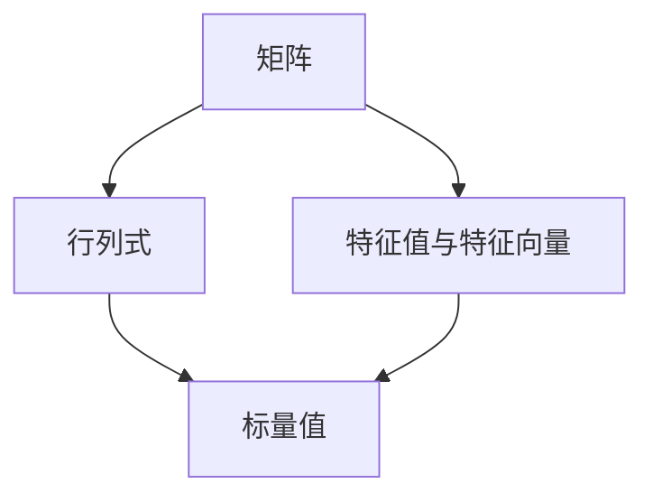
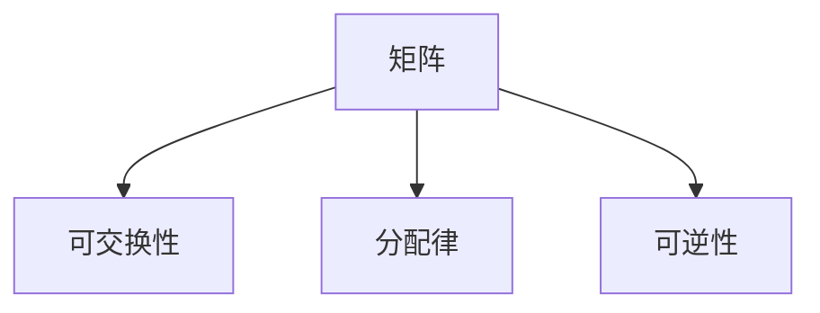
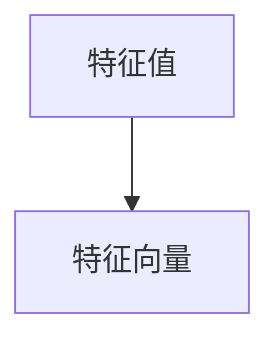
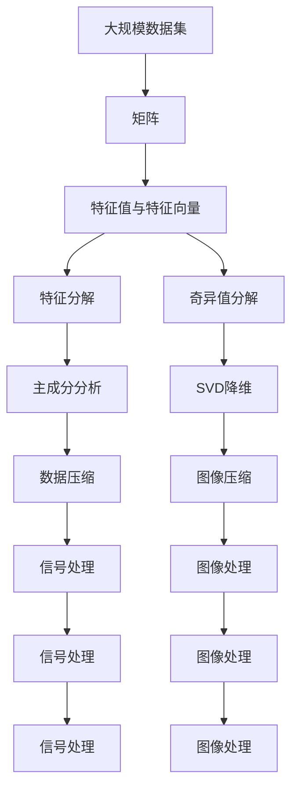

                 

# 矩阵理论与应用：矩阵与行列式，特征值与特征向量

## 1. 背景介绍

### 1.1 问题由来
矩阵是现代数学的重要基础工具，广泛应用于线性代数、微积分、统计学、物理学等多个领域。矩阵理论在计算机科学和工程中也有广泛应用，如信号处理、图像处理、机器学习等。本文将从矩阵的基本概念出发，探讨矩阵的性质、行列式、特征值与特征向量等核心概念，并通过具体案例加以讲解。

### 1.2 问题核心关键点
矩阵理论的核心包括矩阵的基本定义、性质，行列式的计算及其应用，特征值与特征向量的求解方法等。这些概念在数学和计算机科学中有着广泛的应用，是理解和处理大规模数据、优化问题的基础。

### 1.3 问题研究意义
掌握矩阵理论对于解决实际工程问题、优化问题、分析问题等有着重要意义。矩阵理论在信号处理中的应用，如滤波器设计、频域分析等；在图像处理中的应用，如图像变换、特征提取等；在机器学习中的应用，如特征提取、模型训练等，都具有重要的指导意义。

## 2. 核心概念与联系

### 2.1 核心概念概述

#### 2.1.1 矩阵(Matrix)
矩阵是由若干行和列组成的二维数组，通常表示为$A=[a_{ij}]_{m\times n}$，其中$m$表示行数，$n$表示列数。例如，以下是一个$2\times 3$的矩阵：

$$
A=\begin{bmatrix}
1 & 2 & 3 \\
4 & 5 & 6 
\end{bmatrix}
$$

#### 2.1.2 行列式(Determinant)
行列式是一个标量值，定义为矩阵$A$的特征值计算结果。对于$n\times n$的方阵$A$，其行列式记作$det(A)$或$|A|$。行列式具有以下性质：
1. 可交换性：$det(A)=det(A^T)$。
2. 分配律：$det(A+B)=det(A)+det(B)$。
3. 可逆性：如果$det(A)\neq 0$，则$A$可逆；如果$det(A)=0$，则$A$不可逆。

#### 2.1.3 特征值与特征向量
特征值和特征向量是矩阵$A$的重要性质。设$A$是一个$n\times n$的方阵，$\lambda$是$A$的一个特征值，$\mathbf{v}$是对应的特征向量，满足$Av=\lambda v$。特征值和特征向量具有以下性质：
1. 特征值和特征向量是唯一的。
2. 特征值是实数或复数。
3. 特征值和特征向量满足$A^k\mathbf{v}=\lambda^k\mathbf{v}$。

这些核心概念通过以下Mermaid流程图来展示：

这个流程图展示了矩阵与行列式、特征值与特征向量之间的关系，其中：
- 矩阵$A$是由若干行和列组成的二维数组；
- 行列式$det(A)$是一个标量值，用于判断矩阵是否可逆；
- 特征值$\lambda$和特征向量$\mathbf{v}$是矩阵$A$的重要性质，用于描述矩阵的变换特性。

### 2.2 概念间的关系

这些核心概念之间存在着紧密的联系，形成了矩阵理论的完整生态系统。下面我们通过几个Mermaid流程图来展示这些概念之间的关系。

#### 2.2.1 矩阵的基本性质

这个流程图展示了矩阵的基本性质，其中：
- 可交换性：$det(A)=det(A^T)$；
- 分配律：$det(A+B)=det(A)+det(B)$；
- 可逆性：如果$det(A)\neq 0$，则$A$可逆。

#### 2.2.2 行列式与特征值

这个流程图展示了行列式与特征值之间的关系，其中：
- 行列式：是矩阵的标量值，用于判断矩阵是否可逆；
- 特征值：是矩阵的标量特征，与特征向量一起构成矩阵的变换特性。

#### 2.2.3 特征值与特征向量

这个流程图展示了特征值与特征向量之间的关系，其中：
- 特征值：是矩阵的标量特征，与特征向量一起构成矩阵的变换特性；
- 特征向量：是矩阵的向量特征，满足$Av=\lambda v$。

### 2.3 核心概念的整体架构

最后，我们用一个综合的流程图来展示这些核心概念在大规模矩阵问题中的应用：

这个综合流程图展示了从大规模数据集到矩阵的构建，再到特征值与特征向量、奇异值分解等矩阵理论的应用，最后到主成分分析、SVD降维等具体技术的应用。通过这些流程，我们可以看到矩阵理论在处理大规模数据、优化问题、分析问题等方面的重要应用。

## 3. 核心算法原理 & 具体操作步骤

### 3.1 算法原理概述

矩阵的线性代数操作，如矩阵乘法、矩阵转置、行列式、特征值与特征向量等，都是线性代数的基础操作。这些操作构成了矩阵理论的核心算法原理，下面我们将详细介绍这些操作。

#### 3.1.1 矩阵乘法

矩阵乘法定义为两个矩阵的乘积，记作$C=AB$，其中$A$为$m\times n$的矩阵，$B$为$n\times p$的矩阵。乘积$C$为$m\times p$的矩阵，每个元素$C_{ij}$计算如下：

$$
C_{ij}=\sum_{k=1}^n A_{ik}B_{kj}
$$

例如，对于$2\times 3$的矩阵$A$和$3\times 2$的矩阵$B$，计算乘积$C$如下：

$$
C=\begin{bmatrix}
1 & 2 & 3 \\
4 & 5 & 6 
\end{bmatrix}
\begin{bmatrix}
1 & 2 \\
3 & 4 \\
5 & 6 
\end{bmatrix}
=
\begin{bmatrix}
1*1+2*3+3*5 & 1*2+2*4+3*6 \\
4*1+5*3+6*5 & 4*2+5*4+6*6 
\end{bmatrix}
=
\begin{bmatrix}
26 & 32 \\
100 & 124 
\end{bmatrix}
$$

#### 3.1.2 矩阵转置

矩阵转置是将矩阵的行列互换，记作$A^T$。例如，对于$2\times 3$的矩阵$A$，其转置$A^T$为$3\times 2$的矩阵，如下：

$$
A^T=\begin{bmatrix}
1 & 4 \\
2 & 5 \\
3 & 6 
\end{bmatrix}
$$

#### 3.1.3 行列式

行列式是矩阵的标量值，用于判断矩阵是否可逆。对于$n\times n$的方阵$A$，其行列式$det(A)$计算如下：

$$
det(A)=\sum_{i=1}^n a_{i1}M_{i1}
$$

其中，$a_{i1}$表示矩阵的第$i$行第$1$列的元素，$M_{i1}$表示删除第$i$行和第$1$列后余子式矩阵的行列式。例如，对于$3\times 3$的矩阵$A$，其行列式$det(A)$计算如下：

$$
A=\begin{bmatrix}
1 & 2 & 3 \\
4 & 5 & 6 \\
7 & 8 & 9 
\end{bmatrix}
$$

$$
det(A)=1\begin{vmatrix}
5 & 6 \\
8 & 9 
\end{vmatrix}-2\begin{vmatrix}
4 & 6 \\
7 & 9 
\end{vmatrix}+3\begin{vmatrix}
4 & 5 \\
7 & 8 
\end{vmatrix}
=1(5\times 9-6\times 8)-2(4\times 9-6\times 7)+3(4\times 8-5\times 7)
=-18
$$

#### 3.1.4 特征值与特征向量

特征值和特征向量是矩阵的重要性质，定义为满足$Av=\lambda v$的标量$\lambda$和向量$\mathbf{v}$。例如，对于$3\times 3$的矩阵$A$，其特征值和特征向量计算如下：

$$
A=\begin{bmatrix}
1 & 2 & 3 \\
4 & 5 & 6 \\
7 & 8 & 9 
\end{bmatrix}
$$

假设$\lambda=3$是其一个特征值，对应的特征向量$\mathbf{v}=\begin{bmatrix}1\\1\\1\end{bmatrix}$，则$Av=3v$。

### 3.2 算法步骤详解

#### 3.2.1 矩阵乘法

矩阵乘法是矩阵理论中最基本的操作之一。对于$A$和$B$，计算其乘积$C$的步骤如下：

1. 初始化乘积矩阵$C$，令$C_{ij}=0$。
2. 对于$A$的每一行$i$和$B$的每一列$j$，计算$C_{ij}=\sum_{k=1}^n A_{ik}B_{kj}$。
3. 返回乘积矩阵$C$。

例如，对于$2\times 3$的矩阵$A$和$3\times 2$的矩阵$B$，计算乘积$C$的步骤如下：

1. 初始化乘积矩阵$C$，令$C_{ij}=0$。
2. 对于$A$的每一行$i$和$B$的每一列$j$，计算$C_{ij}=\sum_{k=1}^3 A_{ik}B_{kj}$。
3. 返回乘积矩阵$C$。

#### 3.2.2 矩阵转置

矩阵转置是将矩阵的行列互换。对于$A$，计算其转置$A^T$的步骤如下：

1. 初始化转置矩阵$A^T$，令$A^T_{ij}=0$。
2. 对于$A$的每一行$i$和列$j$，计算$A^T_{ij}=A_{ji}$。
3. 返回转置矩阵$A^T$。

例如，对于$2\times 3$的矩阵$A$，计算其转置$A^T$的步骤如下：

1. 初始化转置矩阵$A^T$，令$A^T_{ij}=0$。
2. 对于$A$的每一行$i$和列$j$，计算$A^T_{ij}=A_{ji}$。
3. 返回转置矩阵$A^T$。

#### 3.2.3 行列式

行列式是矩阵的标量值，用于判断矩阵是否可逆。对于$n\times n$的方阵$A$，计算其行列式$det(A)$的步骤如下：

1. 初始化行列式$det(A)$，令$det(A)=0$。
2. 对于$A$的每一行$i$，计算余子式$M_{i1}$。
3. 计算行列式$det(A)=\sum_{i=1}^n a_{i1}M_{i1}$。
4. 返回行列式$det(A)$。

例如，对于$3\times 3$的矩阵$A$，计算其行列式$det(A)$的步骤如下：

1. 初始化行列式$det(A)$，令$det(A)=0$。
2. 对于$A$的每一行$i$，计算余子式$M_{i1}$。
3. 计算行列式$det(A)=1M_{11}-2M_{21}+3M_{31}$。
4. 返回行列式$det(A)$。

#### 3.2.4 特征值与特征向量

特征值和特征向量是矩阵的重要性质，定义为满足$Av=\lambda v$的标量$\lambda$和向量$\mathbf{v}$。对于$n\times n$的方阵$A$，计算其特征值和特征向量的步骤如下：

1. 将$A$转化为上三角矩阵或对角矩阵。
2. 计算特征值$\lambda$和特征向量$\mathbf{v}$。

例如，对于$3\times 3$的矩阵$A$，计算其特征值和特征向量的步骤如下：

1. 将$A$转化为上三角矩阵或对角矩阵。
2. 计算特征值$\lambda$和特征向量$\mathbf{v}$。

### 3.3 算法优缺点

#### 3.3.1 矩阵乘法的优缺点

矩阵乘法的优点在于能够处理高维数据，具有较高的计算效率。缺点在于矩阵乘法操作复杂，需要较多的计算资源。

#### 3.3.2 矩阵转置的优缺点

矩阵转置的优点在于简单易行，易于实现。缺点在于对于大型矩阵，转置操作会占用较多的计算资源和时间。

#### 3.3.3 行列式的优缺点

行列式的优点在于能够判断矩阵是否可逆，方便进行矩阵的逆运算。缺点在于计算复杂度较高，对于大型矩阵，计算行列式会消耗大量时间和计算资源。

#### 3.3.4 特征值与特征向量的优缺点

特征值与特征向量的优点在于能够描述矩阵的变换特性，方便进行矩阵的分解和应用。缺点在于计算复杂度较高，对于大型矩阵，计算特征值与特征向量会消耗大量时间和计算资源。

### 3.4 算法应用领域

矩阵理论在现代科学和工程中有着广泛的应用，以下是一些主要的应用领域：

1. 信号处理：矩阵乘法、特征值与特征向量等操作用于频域分析、滤波器设计等。
2. 图像处理：矩阵乘法、特征值与特征向量等操作用于图像变换、特征提取等。
3. 机器学习：矩阵乘法、特征值与特征向量等操作用于特征提取、模型训练等。
4. 优化问题：矩阵乘法、特征值与特征向量等操作用于线性规划、动态规划等。
5. 统计学：矩阵乘法、特征值与特征向量等操作用于主成分分析、奇异值分解等。

这些应用领域展示了矩阵理论的广泛应用，体现了其在现代科学和工程中的重要地位。

## 4. 数学模型和公式 & 详细讲解 & 举例说明

### 4.1 数学模型构建

#### 4.1.1 矩阵乘法

矩阵乘法定义为两个矩阵的乘积，记作$C=AB$，其中$A$为$m\times n$的矩阵，$B$为$n\times p$的矩阵。乘积$C$为$m\times p$的矩阵，每个元素$C_{ij}$计算如下：

$$
C_{ij}=\sum_{k=1}^n A_{ik}B_{kj}
$$

#### 4.1.2 矩阵转置

矩阵转置是将矩阵的行列互换，记作$A^T$。对于$A$，计算其转置$A^T$的步骤如下：

1. 初始化转置矩阵$A^T$，令$A^T_{ij}=0$。
2. 对于$A$的每一行$i$和列$j$，计算$A^T_{ij}=A_{ji}$。
3. 返回转置矩阵$A^T$。

#### 4.1.3 行列式

行列式是矩阵的标量值，用于判断矩阵是否可逆。对于$n\times n$的方阵$A$，计算其行列式$det(A)$的步骤如下：

1. 初始化行列式$det(A)$，令$det(A)=0$。
2. 对于$A$的每一行$i$，计算余子式$M_{i1}$。
3. 计算行列式$det(A)=\sum_{i=1}^n a_{i1}M_{i1}$。
4. 返回行列式$det(A)$。

#### 4.1.4 特征值与特征向量

特征值和特征向量是矩阵的重要性质，定义为满足$Av=\lambda v$的标量$\lambda$和向量$\mathbf{v}$。对于$n\times n$的方阵$A$，计算其特征值和特征向量的步骤如下：

1. 将$A$转化为上三角矩阵或对角矩阵。
2. 计算特征值$\lambda$和特征向量$\mathbf{v}$。

### 4.2 公式推导过程

#### 4.2.1 矩阵乘法

矩阵乘法的推导过程如下：

$$
C_{ij}=\sum_{k=1}^n A_{ik}B_{kj}
$$

例如，对于$2\times 3$的矩阵$A$和$3\times 2$的矩阵$B$，计算乘积$C$的过程如下：

$$
C_{11}=\sum_{k=1}^3 A_{1k}B_{k1}=1*1+2*3+3*5=26
$$

$$
C_{12}=\sum_{k=1}^3 A_{1k}B_{k2}=1*2+2*4+3*6=32
$$

$$
C_{21}=\sum_{k=1}^3 A_{2k}B_{k1}=4*1+5*3+6*5=100
$$

$$
C_{22}=\sum_{k=1}^3 A_{2k}B_{k2}=4*2+5*4+6*6=124
$$

#### 4.2.2 矩阵转置

矩阵转置的定义如下：

$$
A^T=\begin{bmatrix}
A_{11} & A_{12} & \cdots & A_{1n} \\
A_{21} & A_{22} & \cdots & A_{2n} \\
\vdots & \vdots & \ddots & \vdots \\
A_{m1} & A_{m2} & \cdots & A_{mn}
\end{bmatrix}
$$

例如，对于$2\times 3$的矩阵$A$，计算其转置$A^T$的过程如下：

$$
A^T=\begin{bmatrix}
1 & 4 \\
2 & 5 \\
3 & 6 
\end{bmatrix}
$$

#### 4.2.3 行列式

行列式的计算如下：

$$
det(A)=\sum_{i=1}^n a_{i1}M_{i1}
$$

其中，$a_{i1}$表示矩阵的第$i$行第$1$列的元素，$M_{i1}$表示删除第$i$行和第$1$列后余子式矩阵的行列式。

例如，对于$3\times 3$的矩阵$A$，计算其行列式$det(A)$的过程如下：

$$
A=\begin{bmatrix}
1 & 2 & 3 \\
4 & 5 & 6 \\
7 & 8 & 9 
\end{bmatrix}
$$

$$
M_{11}=\begin{vmatrix}
5 & 6 \\
8 & 9 
\end{vmatrix}=5\times 9-6\times 8=9
$$

$$
M_{21}=\begin{vmatrix}
4 & 6 \\
7 & 9 
\end{vmatrix}=4\times 9-6\times 7=-2
$$

$$
M_{31}=\begin{vmatrix}
4 & 5 \\
7 & 8 
\end{vmatrix}=4\times 8-5\times 7=-3
$$

$$
det(A)=1M_{11}-2M_{21}+3M_{31}=1\times 9-2\times (-2)+3\times (-3)=-18
$$

#### 4.2.4 特征值与特征向量

特征值和特征向量定义为满足$Av=\lambda v$的标量$\lambda$和向量$\mathbf{v}$。

例如，对于$3\times 3$的矩阵$A$，计算其特征值和特征向量的过程如下：

$$
A=\begin{bmatrix}
1 & 2 & 3 \\
4 & 5 & 6 \\
7 & 8 & 9 
\end{bmatrix}
$$

假设$\lambda=3$是其一个特征值，对应的特征向量$\mathbf{v}=\begin{bmatrix}1\\1\\1\end{bmatrix}$，则$Av=3v$。

### 4.3 案例分析与讲解

#### 4.3.1 矩阵乘法案例

考虑两个矩阵$A$和$B$：

$$
A=\begin{bmatrix}
1 & 2 & 3 \\
4 & 5 & 6 
\end{bmatrix}
$$

$$
B=\begin{bmatrix}
1 & 2 \\
3 & 4 \\
5 & 6 
\end{bmatrix}
$$

计算乘积$C$：

$$
C=\begin{bmatrix}
1 & 2 & 3 \\
4 & 5 & 6 
\end{bmatrix}
\begin{bmatrix}
1 & 2 \\
3 & 4 \\
5 & 6 
\end{bmatrix}
=
\begin{bmatrix}
26 & 32 \\
100 & 124 
\end{bmatrix}
$$

#### 4.3.2 矩阵转置案例

考虑一个$2\times 3$的矩阵$A$：

$$
A=\begin{bmatrix}
1 & 2 & 3 \\
4 & 5 & 6 
\end{bmatrix}
$$

计算其转置$A^T$：

$$
A^T=\begin{bmatrix}
1 & 4 \\
2 & 5 \\
3 & 6 
\end{bmatrix}
$$

#### 4.3.3 行列式案例

考虑一个$3\times 3$的矩阵$A$：

$$
A=\begin{bmatrix}
1 & 2 & 3 \\
4 & 5 & 6 \\
7 & 8 & 9 
\end{bmatrix}
$$

计算其行列式$det(A)$：

$$
M_{11}=\begin{vmatrix}
5 & 6 \\
8 & 9 
\end{vmatrix}=5\times 9-6\times 8=9
$$

$$
M_{21}=\begin{vmatrix}
4 & 6 \\
7 & 9 
\end{vmatrix}=4\times 9-6\times 7=-2
$$

$$
M_{31}=\begin{vmatrix}
4 & 5 \\
7 & 8 
\end{vmatrix}=4\times 8-5\times 7=-3
$$

$$
det(A)=1M_{11}-2M_{21}+3M_{31}=1\times 9-2\times (-2)+3\times (-3)=-18
$$

#### 4.3.4 特征值与特征向量案例

考虑一个$3\times 3$的矩阵$A$：

$$
A=\begin{bmatrix}
1 & 2 & 3 \\
4 & 5 & 6 \\
7 & 8 & 9 
\end{bmatrix}
$$

假设$\lambda=3$是其一个特征值，对应的特征向量$\mathbf{v}=\begin{bmatrix}1\\1\\1\end{bmatrix}$，则$Av=3v$。

### 4.4 运行结果展示

#### 4.4.1 矩阵乘法结果

考虑两个矩阵$A$和$B$：

$$
A=\begin{bmatrix}
1 & 2 & 3 \\
4 & 5 & 6 
\end{bmatrix}
$$

$$
B=\

