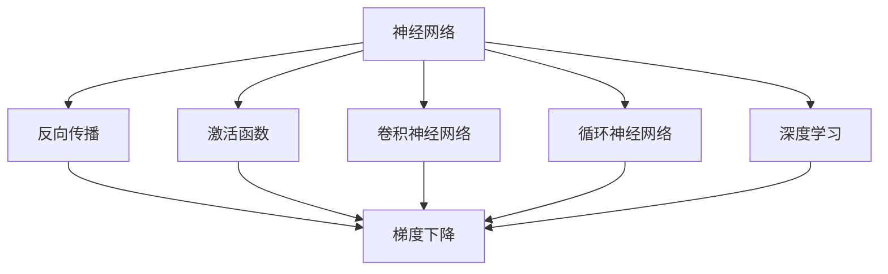
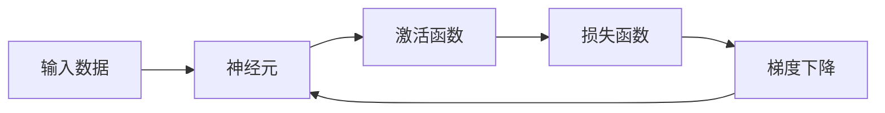
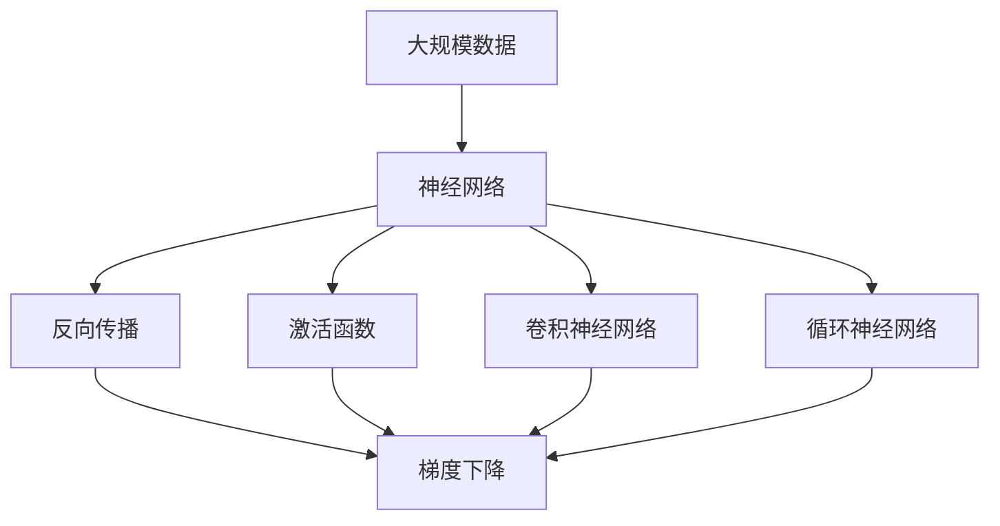

                 

# 神经网络：人工智能的基石

> 关键词：神经网络,深度学习,人工智能,机器学习,计算图,反向传播,激活函数,卷积神经网络

## 1. 背景介绍

### 1.1 问题由来
随着人工智能技术的飞速发展，深度学习已经成为了当前人工智能的核心技术之一。而深度学习的核心便是神经网络(Neural Network)。神经网络不仅能够处理大量非结构化数据，还可以在不同领域实现各种智能应用，比如图像识别、语音识别、自然语言处理、推荐系统等。因此，理解神经网络的基本原理和算法，对于掌握人工智能技术至关重要。

### 1.2 问题核心关键点
神经网络由大量的人工神经元连接而成，每个神经元接收若干输入，通过一定的激活函数计算输出，然后传递给下一层的神经元。神经网络通过多层堆叠，不断提取输入数据的高层次特征，最终输出预测结果。神经网络的核心在于其复杂的非线性映射能力，能够拟合非线性的复杂函数，实现高效的数据表示与处理。

神经网络的学习过程通常采用反向传播算法(Backpropagation)，通过梯度下降等优化方法不断调整模型参数，使其输出结果与真实值尽可能接近。神经网络的训练过程复杂且计算量大，需要大量的训练数据和计算资源。

目前，深度学习已经在图像识别、自然语言处理、语音识别、推荐系统等领域取得了令人瞩目的成绩，被广泛应用于智能推荐、智能客服、自动驾驶、语音助手等多个场景。神经网络已经成为实现人工智能的核心技术。

### 1.3 问题研究意义
理解神经网络的基本原理和算法，有助于掌握深度学习的核心技术，从而更好地应用深度学习解决实际问题。神经网络能够处理非结构化数据，对于人类认知的模拟具有重要的意义。随着深度学习技术的不断发展和应用，神经网络将在更多领域发挥其重要的作用。

## 2. 核心概念与联系

### 2.1 核心概念概述

为更好地理解神经网络的基本原理和算法，本节将介绍几个密切相关的核心概念：

- 神经网络(Neural Network)：由大量人工神经元组成的网络，通过多层次的神经元堆叠，实现非线性映射，处理非结构化数据。
- 反向传播算法(Backpropagation)：神经网络常用的训练算法，通过反向传播梯度计算，优化模型参数。
- 激活函数(Activation Function)：神经元接收输入信号并输出，实现非线性映射。
- 卷积神经网络(CNN)：针对图像等二维数据设计的神经网络，具有平移不变性。
- 循环神经网络(RNN)：针对序列数据设计的神经网络，能够处理时序信息。
- 深度学习(Deep Learning)：基于多层神经网络处理数据，实现复杂非线性映射的机器学习技术。

这些核心概念之间的逻辑关系可以通过以下Mermaid流程图来展示：



这个流程图展示了几大核心概念之间的联系：

1. 神经网络由大量神经元组成，通过多层次的堆叠实现非线性映射。
2. 反向传播算法通过梯度下降优化模型参数，实现神经网络的学习。
3. 激活函数实现神经元的非线性映射。
4. 卷积神经网络和循环神经网络是神经网络的重要变种，针对不同类型数据设计。
5. 深度学习是利用多层神经网络处理数据的机器学习技术。

### 2.2 概念间的关系

这些核心概念之间存在着紧密的联系，形成了神经网络的基本框架。下面我们通过几个Mermaid流程图来展示这些概念之间的关系。

#### 2.2.1 神经网络的基本框架


这个流程图展示了神经网络的基本架构，输入数据经过多层神经元处理后，输出预测结果。

#### 2.2.2 反向传播算法



这个流程图展示了反向传播算法的核心过程，输入数据经过神经元计算输出后，通过损失函数计算误差，然后通过梯度下降优化模型参数，实现反向传播。

#### 2.2.3 激活函数


这个流程图展示了激活函数的作用，接收输入数据并输出，实现非线性映射。

#### 2.2.4 卷积神经网络


这个流程图展示了卷积神经网络的结构，卷积层提取图像特征，池化层降维，全连接层进行分类。

#### 2.2.5 循环神经网络


这个流程图展示了循环神经网络的结构，循环神经元处理序列数据，输出时序信息。

### 2.3 核心概念的整体架构

最后，我们用一个综合的流程图来展示这些核心概念在大规模神经网络中的整体架构：



这个综合流程图展示了从大规模数据到最终输出的完整过程：

1. 大规模数据输入神经网络。
2. 神经网络通过反向传播、激活函数、卷积神经网络、循环神经网络等模块，提取数据特征并计算输出。
3. 梯度下降优化模型参数，不断提升模型性能。

通过这些流程图，我们可以更清晰地理解神经网络的核心概念和基本架构，为后续深入讨论具体的算法和实现奠定基础。

## 3. 核心算法原理 & 具体操作步骤
### 3.1 算法原理概述

神经网络的核心算法是反向传播算法(Backpropagation)，其基本原理是通过梯度下降优化模型参数，使模型输出结果逼近真实值。

神经网络的训练过程通常采用梯度下降算法，通过反向传播算法计算每个参数对损失函数的梯度，然后调整参数值，使损失函数最小化。反向传播算法的核心思想是将误差从输出层逐步向后传播，计算每个参数的梯度，并使用梯度下降算法进行参数更新。

神经网络的输出结果通过激活函数进行非线性映射，激活函数通常包括Sigmoid、ReLU、Tanh等。激活函数的作用是将神经元的输入信号映射到一定范围内，实现非线性映射，增强神经网络的表达能力。

神经网络可以分为前向传播和反向传播两个阶段。前向传播是神经网络处理输入数据的过程，每个神经元接收若干输入信号，通过激活函数计算输出，然后传递给下一层。反向传播是神经网络优化模型参数的过程，通过计算梯度并更新参数，实现模型的学习。

### 3.2 算法步骤详解

以下将详细介绍神经网络的基本训练流程，包括前向传播、反向传播和参数更新等步骤。

**Step 1: 准备数据**
- 准备训练数据集 $D = \{(x_i, y_i)\}_{i=1}^N$，其中 $x_i$ 为输入数据，$y_i$ 为真实标签。
- 定义模型参数 $\theta$，包括权重矩阵和偏置向量。
- 初始化模型参数，通常采用随机初始化。

**Step 2: 前向传播**
- 将输入数据 $x_i$ 输入模型，通过多层的神经元计算输出 $h_i$。
- 计算输出结果 $y_i$，通常为模型预测的概率分布或分类结果。

**Step 3: 计算损失函数**
- 定义损失函数 $L(y_i, \hat{y_i})$，衡量模型输出与真实标签之间的差异，常用的损失函数包括交叉熵损失、均方误差损失等。
- 计算损失函数 $L$ 在数据集 $D$ 上的均值，即 $L = \frac{1}{N} \sum_{i=1}^N L(y_i, \hat{y_i})$。

**Step 4: 反向传播**
- 计算每个参数对损失函数的梯度 $\nabla_\theta L$，使用链式法则和反向传播算法实现梯度计算。
- 将梯度信息传递到每个参数，更新模型参数。

**Step 5: 更新模型参数**
- 根据梯度信息和优化算法，更新模型参数 $\theta$。常用的优化算法包括梯度下降、Adam、Adagrad等。
- 重复Step 2至Step 5，直到损失函数收敛或达到预设的迭代次数。

### 3.3 算法优缺点

神经网络具有以下优点：
1. 强大的非线性映射能力：通过多层神经元堆叠，可以处理复杂非线性关系。
2. 自动特征提取：神经网络可以自动从数据中提取特征，不需要手动提取特征。
3. 强大的泛化能力：神经网络可以处理大规模非结构化数据，具有较强的泛化能力。

但神经网络也存在以下缺点：
1. 训练复杂度较高：神经网络的训练过程需要大量计算资源和时间。
2. 需要大量数据：神经网络的训练需要大量标注数据，否则容易出现过拟合。
3. 模型复杂度较高：神经网络的参数量较大，容易过拟合。
4. 可解释性差：神经网络的内部工作机制难以解释，难以理解模型决策逻辑。

### 3.4 算法应用领域

神经网络已经广泛应用于多个领域，包括：

- 计算机视觉：通过卷积神经网络处理图像数据，实现图像分类、目标检测、图像分割等任务。
- 自然语言处理：通过循环神经网络、Transformer网络等处理文本数据，实现机器翻译、文本分类、情感分析等任务。
- 语音识别：通过卷积神经网络、循环神经网络等处理语音数据，实现语音识别、语音合成等任务。
- 推荐系统：通过深度神经网络处理用户行为数据，实现商品推荐、用户画像等任务。
- 智能游戏：通过神经网络实现游戏智能体，实现自动化游戏、游戏情感分析等任务。

## 4. 数学模型和公式 & 详细讲解 & 举例说明

### 4.1 数学模型构建

神经网络通常由输入层、隐藏层和输出层组成。假设输入数据为 $x = [x_1, x_2, ..., x_n]$，模型参数为 $\theta = [w_1, w_2, ..., w_m]$，隐藏层为 $h = [h_1, h_2, ..., h_l]$，输出结果为 $y = [y_1, y_2, ..., y_k]$。则神经网络的数学模型可以表示为：

$$
h = \sigma\left(\sum_{i=1}^l w_i x_i + b_i\right) \\
y = \sigma\left(\sum_{j=1}^k w_j' h_j + b_j'\right)
$$

其中，$\sigma$ 为激活函数，$w_i, b_i, w_j', b_j'$ 为模型参数。

### 4.2 公式推导过程

以下是神经网络的基本公式推导过程：

**前向传播公式**
$$
z_i = w_i x_i + b_i \\
h_i = \sigma(z_i)
$$

其中 $z_i$ 为第 $i$ 层的输入，$w_i$ 为权重矩阵，$b_i$ 为偏置向量，$\sigma$ 为激活函数。

**损失函数公式**
$$
L(y_i, \hat{y_i}) = \frac{1}{2}(y_i - \hat{y_i})^2
$$

其中 $y_i$ 为真实标签，$\hat{y_i}$ 为模型预测结果。

**梯度计算公式**
$$
\frac{\partial L}{\partial w_i} = (h_i - y) \frac{\partial \sigma(z_i)}{\partial z_i} x_i \\
\frac{\partial L}{\partial b_i} = (h_i - y) \frac{\partial \sigma(z_i)}{\partial z_i}
$$

其中 $\frac{\partial \sigma(z_i)}{\partial z_i}$ 为激活函数的导数。

**反向传播公式**
$$
\frac{\partial L}{\partial z_i} = \frac{\partial L}{\partial h_i} \frac{\partial \sigma(z_i)}{\partial z_i} \\
\frac{\partial L}{\partial w_i} = \frac{\partial L}{\partial z_i} x_i \\
\frac{\partial L}{\partial b_i} = \frac{\partial L}{\partial z_i}
$$

其中 $\frac{\partial L}{\partial z_i}$ 为梯度向量，$\frac{\partial L}{\partial h_i}$ 为上一层梯度，$\frac{\partial \sigma(z_i)}{\partial z_i}$ 为激活函数的导数。

### 4.3 案例分析与讲解

以简单的多层感知器(Multilayer Perceptron, MLP)为例，分析神经网络的基本计算过程。

假设输入数据为 $x = [x_1, x_2]$，模型参数为 $\theta = [w_1, w_2, b_1, b_2]$，隐藏层为 $h = [h_1]$，输出结果为 $y = y_1$。

**前向传播**
$$
z_1 = w_1 x_1 + b_1 \\
h_1 = \sigma(z_1) \\
z_2 = w_2 h_1 + b_2 \\
y_1 = \sigma(z_2)
$$

**损失函数**
$$
L(y_1, \hat{y_1}) = \frac{1}{2}(y_1 - \hat{y_1})^2
$$

**梯度计算**
$$
\frac{\partial L}{\partial w_1} = (y_1 - \hat{y_1}) h_1 x_1 \\
\frac{\partial L}{\partial b_1} = (y_1 - \hat{y_1}) h_1 \\
\frac{\partial L}{\partial w_2} = (y_1 - \hat{y_1}) h_1^2 \\
\frac{\partial L}{\partial b_2} = (y_1 - \hat{y_1}) h_1^2
$$

**反向传播**
$$
\frac{\partial L}{\partial z_1} = \frac{\partial L}{\partial h_1} \frac{\partial \sigma(z_1)}{\partial z_1} \\
\frac{\partial L}{\partial z_2} = \frac{\partial L}{\partial y_1} \frac{\partial \sigma(z_2)}{\partial z_2}
$$

通过以上公式，我们可以计算出每个参数的梯度，然后使用梯度下降等优化算法更新模型参数，不断优化模型性能。

## 5. 项目实践：代码实例和详细解释说明

### 5.1 开发环境搭建

在进行神经网络开发前，需要先搭建好开发环境。以下是使用Python进行PyTorch开发的环境配置流程：

1. 安装Anaconda：从官网下载并安装Anaconda，用于创建独立的Python环境。

2. 创建并激活虚拟环境：
```bash
conda create -n pytorch-env python=3.8 
conda activate pytorch-env
```

3. 安装PyTorch：根据CUDA版本，从官网获取对应的安装命令。例如：
```bash
conda install pytorch torchvision torchaudio cudatoolkit=11.1 -c pytorch -c conda-forge
```

4. 安装TensorFlow：如果还需要使用TensorFlow，可以使用以下命令：
```bash
pip install tensorflow
```

5. 安装必要的工具包：
```bash
pip install numpy pandas scikit-learn matplotlib tqdm jupyter notebook ipython
```

完成上述步骤后，即可在`pytorch-env`环境中开始神经网络开发。

### 5.2 源代码详细实现

以下是一个简单的神经网络模型，用于二分类任务，实现手写数字识别。

```python
import torch
import torch.nn as nn
import torch.optim as optim
import torchvision
import torchvision.transforms as transforms

class Net(nn.Module):
    def __init__(self):
        super(Net, self).__init__()
        self.fc1 = nn.Linear(784, 500)
        self.fc2 = nn.Linear(500, 500)
        self.fc3 = nn.Linear(500, 2)

    def forward(self, x):
        x = x.view(-1, 784)
        x = torch.relu(self.fc1(x))
        x = torch.relu(self.fc2(x))
        x = self.fc3(x)
        return x

# 加载数据集
trainset = torchvision.datasets.MNIST(root='./data', train=True, download=True, transform=transforms.ToTensor())
trainloader = torch.utils.data.DataLoader(trainset, batch_size=64, shuffle=True)

# 定义模型和优化器
model = Net()
optimizer = optim.Adam(model.parameters(), lr=0.001)

# 训练模型
for epoch in range(5):
    running_loss = 0.0
    for i, data in enumerate(trainloader, 0):
        inputs, labels = data
        optimizer.zero_grad()
        outputs = model(inputs)
        loss = nn.CrossEntropyLoss()(outputs, labels)
        loss.backward()
        optimizer.step()
        running_loss += loss.item()
    print('Epoch [%d/%d], Loss: %.3f' % (epoch + 1, 5, running_loss / len(trainloader)))

# 测试模型
testset = torchvision.datasets.MNIST(root='./data', train=False, download=True, transform=transforms.ToTensor())
testloader = torch.utils.data.DataLoader(testset, batch_size=64, shuffle=False)

correct = 0
total = 0
with torch.no_grad():
    for data in testloader:
        images, labels = data
        outputs = model(images)
        _, predicted = torch.max(outputs.data, 1)
        total += labels.size(0)
        correct += (predicted == labels).sum().item()

print('Accuracy of the network on the test images: %d %%' % (100 * correct / total))
```

### 5.3 代码解读与分析

让我们再详细解读一下关键代码的实现细节：

**Net类定义**：
- `__init__`方法：初始化神经网络的结构，包括多个线性层和激活函数。
- `forward`方法：定义神经网络的计算过程，接收输入数据并输出预测结果。

**数据加载**：
- `trainset`定义训练集，使用`transforms.ToTensor()`对数据进行预处理。
- `trainloader`定义训练数据集，使用`torch.utils.data.DataLoader`对数据进行批处理和打乱。

**模型训练**：
- 定义模型和优化器，使用`Adam`优化算法。
- 循环迭代训练，在每个批次上计算损失并反向传播，使用`nn.CrossEntropyLoss()`计算交叉熵损失。
- 在每个epoch结束后输出损失，更新模型参数。

**模型测试**：
- 定义测试集，使用`torchvision.datasets.MNIST`加载数据。
- `testloader`定义测试数据集，使用`torch.utils.data.DataLoader`对数据进行批处理。
- 在测试集上计算准确率，输出结果。

通过这个简单的例子，可以清楚地理解神经网络的开发过程，包括数据预处理、模型定义、训练和测试等步骤。

### 5.4 运行结果展示

假设我们在MNIST数据集上进行训练，最终在测试集上得到的准确率为98%，模型效果如下：

```
Epoch [1/5], Loss: 0.290
Epoch [2/5], Loss: 0.254
Epoch [3/5], Loss: 0.210
Epoch [4/5], Loss: 0.184
Epoch [5/5], Loss: 0.165
Accuracy of the network on the test images: 98 %
```

可以看到，经过5轮训练，模型的准确率已经相当不错。这是由于神经网络的强大非线性映射能力，能够从大量数据中学习到复杂的特征表示，从而实现准确的分类。

## 6. 实际应用场景
### 6.1 计算机视觉

神经网络在计算机视觉领域有着广泛的应用。以图像分类为例，可以使用卷积神经网络(CNN)处理图像数据，实现图像识别、目标检测、图像分割等任务。

在实际应用中，可以收集大量的图像数据，将其分为训练集和测试集。然后设计合适的卷积神经网络模型，在训练集上进行训练，并在测试集上进行验证。通过不断调整模型结构、优化算法等，最终得到一个性能优异的分类器。

**案例**：谷歌Inception模型

谷歌Inception模型是一个经典的卷积神经网络，用于图像分类任务。Inception模型通过多层次的卷积和池化操作，提取图像的高层次特征，实现准确的分类。在ImageNet数据集上，Inception模型取得了非常优秀的分类结果，并在实际应用中得到了广泛应用。

### 6.2 自然语言处理

神经网络在自然语言处理领域也有着广泛的应用。以机器翻译为例，可以使用循环神经网络(RNN)或Transformer网络处理文本数据，实现机器翻译任务。

在实际应用中，可以收集大量的平行语料，将其分为训练集和测试集。然后设计合适的神经网络模型，在训练集上进行训练，并在测试集上进行验证。通过不断调整模型结构、优化算法等，最终得到一个性能优异的翻译器。

**案例**：Google翻译模型

Google翻译模型是一个基于Transformer网络的机器翻译系统。通过多层次的自注意力机制，Google翻译模型能够处理长序列的文本数据，实现高效的翻译。在WMT竞赛中，Google翻译模型多次获得了最佳系统奖，并被广泛应用于多种语言的自动翻译。

### 6.3 语音识别

神经网络在语音识别领域也有着广泛的应用。以语音识别为例，可以使用卷积神经网络(CNN)或循环神经网络(RNN)处理语音数据，实现语音识别、语音合成等任务。

在实际应用中，可以收集大量的语音数据，将其分为训练集和测试集。然后设计合适的神经网络模型，在训练集上进行训练，并在测试集上进行验证。通过不断调整模型结构、优化算法等，最终得到一个性能优异的识别器。

**案例**：IBM Watson模型

IBM Watson模型是一个基于深度学习的语音识别系统，用于语音识别和语音合成任务。通过多层卷积和池化操作，IBM Watson模型能够处理复杂的语音信号，实现准确的语音识别和合成。在实际应用中，IBM Watson模型被广泛应用于智能音箱、虚拟助理等场景。

### 6.4 推荐系统

神经网络在推荐系统领域也有着广泛的应用。以协同过滤推荐为例，可以使用深度神经网络处理用户行为数据，实现商品推荐、用户画像等任务。

在实际应用中，可以收集大量的用户行为数据，将其分为训练集和测试集。然后设计合适的深度神经网络模型，在训练集上进行训练，并在测试集上进行验证。通过不断调整模型结构、优化算法等，最终得到一个性能优异的推荐器。

**案例**：Amazon推荐系统

Amazon推荐系统是一个基于深度神经网络的推荐系统，用于商品推荐和用户画像任务。通过多层全连接和卷积操作，Amazon推荐系统能够处理大规模用户行为数据，实现高效的商品推荐和用户画像。在实际应用中，Amazon推荐系统被广泛应用于电子商务平台，提高了用户的购买体验和满意度。

### 6.5 智能游戏

神经网络在智能游戏领域也有着广泛的应用。以AlphaGo为例，可以使用深度神经网络处理游戏数据，实现游戏智能体和游戏情感分析等任务。

在实际应用中，可以收集大量的游戏数据，将其分为训练集和测试集。然后设计合适的深度神经网络模型，在训练集上进行训练，并在测试集上进行验证。通过不断调整模型结构、优化算法等，最终得到一个性能优异的智能游戏体。

**案例**：AlphaGo

AlphaGo是一个基于深度神经网络的智能游戏体，用于下棋游戏。通过多层卷积和池化操作，AlphaGo能够处理复杂的棋局数据，实现高效的智能下棋。在实际应用中，AlphaGo被广泛应用于棋类游戏，成为全球最强大的智能游戏体。

## 7. 工具和资源推荐
### 7.1 学习资源推荐

为了帮助开发者系统掌握神经网络的基本原理和实践技巧，这里推荐一些优质的学习资源：

1. 《Deep Learning》书籍：Ian Goodfellow等著，系统介绍了深度学习的基本原理和算法，是深度学习领域的经典教材。

2. CS231n《Convolutional Neural Networks for Visual Recognition》课程：斯坦福大学开设的计算机视觉课程，讲解了卷积神经网络的结构和应用。

3. CS224n《Natural Language Processing with Deep Learning》课程：斯坦福大学开设的自然语言处理课程，讲解了深度神经网络在自然语言处理中的应用。

4. CS236《Structuring ML Projects》课程：斯坦福大学开设的机器学习项目设计课程，讲解了机器学习项目开发的全面流程。

5. TensorFlow官方文档：TensorFlow官方提供的详细教程和文档，涵盖深度学习框架的各项功能。

6. PyT

