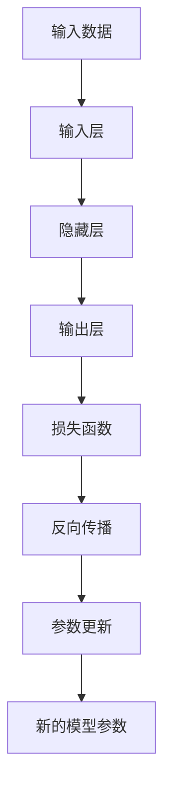

                 

## 1. 背景介绍

在智能科技不断渗透到社会各角落的今天，人工神经网络（Artificial Neural Networks, ANN）作为一种模拟人脑神经元工作原理的技术，正日益成为推动人类与机器共存发展的重要引擎。它不仅仅在图像识别、语音处理、自然语言处理等领域展示了非凡的智慧，也在生物医学、金融工程、气象预测等多个领域发挥了关键作用。本文旨在深入探讨神经网络的基本原理、核心概念、优化方法、应用场景及其在人类与机器共存中的角色。

### 1.1 问题由来

神经网络的概念最初来源于生物学的研究，是由科学家们模仿人脑神经元的连接与计算方式所创造出来的。1943年，麦卡洛克（McCulloch）和皮茨（Pitts）构建了首个人工神经网络模型，被称作MP模型，该模型能够进行简单的逻辑运算。此后，计算机科学家们不断地优化神经网络的架构和算法，使其从简单到复杂，从线性到非线性，最终演变为如今复杂且强大的深度学习模型。

人工智能和深度学习的发展让神经网络逐渐成为现代科技中的重要组成部分。其学习、自适应和泛化能力使其在各类数据驱动的复杂任务中表现优异，但也带来了新的伦理问题，如数据隐私、算法偏见、决策透明度等。如何在利用神经网络技术的同时，确保技术的公平、透明和可信，成为了当前研究的热点。

### 1.2 问题核心关键点

神经网络的核心在于其结构和算法设计。网络由多个神经元（或称为节点）通过连接权重构成，每个神经元接收输入并经过一系列计算后生成输出，输出再作为下一层神经元的输入。算法的核心在于如何通过前向传播和反向传播（backpropagation）来更新网络参数，使网络能够不断优化自身的预测能力。

神经网络的挑战包括如何选择合适的神经元数量和层数，如何设定合适的激活函数，如何优化损失函数以及如何处理过拟合等问题。同时，深度学习模型的复杂性也使得其在应用过程中面临诸如计算资源消耗高、训练时间长等挑战。

## 2. 核心概念与联系

### 2.1 核心概念概述

在神经网络中，几个核心概念构成了其工作的基本框架：

- **神经元**：神经网络的基本单位，模拟人脑中的神经元。每个神经元接收多个输入，通过加权求和、激活函数等处理后输出信号。
- **层（Layer）**：神经元按照层次组织，通常分为输入层、隐藏层和输出层。输入层接收外部数据，输出层产生预测结果，中间各层进行特征提取与变换。
- **连接权重（Weight）**：神经元之间的连接具有权重，代表信息在连接间传播的强度。
- **激活函数（Activation Function）**：决定神经元的输出值，通常采用Sigmoid、ReLU、Tanh等非线性函数。
- **损失函数（Loss Function）**：衡量模型预测与真实结果之间的误差，如均方误差（Mean Squared Error, MSE）、交叉熵（Cross-Entropy）等。
- **反向传播（Backpropagation）**：通过链式法则计算模型参数的梯度，实现模型的参数优化。

### 2.2 概念间的关系

神经网络的工作流程通过以下Mermaid流程图进行概述：



该流程图展示了数据输入、神经元计算、激活函数处理、损失函数计算、反向传播和参数更新等主要步骤，体现了神经网络的总体工作流程。

## 3. 核心算法原理 & 具体操作步骤

### 3.1 算法原理概述

神经网络的训练基于损失函数的优化。在训练过程中，通过反向传播算法，模型预测值与真实值之间的误差通过链式法则逐层传递，用于更新网络参数，使得预测结果更接近真实结果。其核心步骤包括：

1. **前向传播（Forward Propagation）**：输入数据通过神经网络，计算出最终预测结果。
2. **损失计算（Loss Calculation）**：将预测结果与真实结果进行对比，计算损失。
3. **反向传播（Backpropagation）**：利用链式法则计算每一层的梯度，用于更新参数。
4. **参数更新（Parameter Update）**：根据梯度信息，使用优化算法如梯度下降法等更新模型参数。

### 3.2 算法步骤详解

下面是神经网络模型训练的详细步骤：

1. **数据准备**：收集和预处理训练数据，将其划分为训练集、验证集和测试集。
2. **模型选择**：选择适合任务的神经网络结构，确定网络层数、神经元数量、激活函数等。
3. **初始化参数**：初始化模型的权重和偏置，通常随机初始化。
4. **前向传播**：将训练数据输入模型，计算每一层的输出。
5. **损失计算**：使用损失函数计算预测值与真实值之间的误差。
6. **反向传播**：通过链式法则，逐层计算梯度。
7. **参数更新**：使用优化算法如梯度下降法，更新模型参数。
8. **验证集评估**：在验证集上评估模型性能，防止过拟合。
9. **测试集评估**：在测试集上最终评估模型性能，确定模型泛化能力。

### 3.3 算法优缺点

神经网络具有以下优点：

- **强大的学习能力**：通过反向传播和梯度下降等算法，能够从大量数据中学习复杂模式。
- **高度可扩展性**：可以根据任务需求增加或减少神经元数量和网络层数。
- **广泛应用**：几乎可以应用于任何有监督、无监督或半监督学习任务，如图像识别、语音识别、自然语言处理等。

同时，也存在以下缺点：

- **计算资源消耗大**：深度学习模型参数众多，训练时间长。
- **易过拟合**：复杂模型容易在训练集上过拟合，影响泛化能力。
- **黑箱特性**：模型的内部决策过程复杂，难以解释和调试。

### 3.4 算法应用领域

神经网络已在许多领域取得突破性进展，主要应用领域包括：

- **计算机视觉**：通过卷积神经网络（CNN），实现图像分类、目标检测、图像生成等。
- **自然语言处理**：通过循环神经网络（RNN）、长短时记忆网络（LSTM）、Transformer等，实现文本分类、语言生成、机器翻译等。
- **语音处理**：通过卷积神经网络和递归神经网络，实现语音识别、语音合成、情感分析等。
- **生物医学**：用于疾病诊断、基因分析、药物发现等。
- **金融工程**：用于市场预测、风险评估、欺诈检测等。
- **智能推荐**：通过协同过滤、基于深度学习的推荐系统，实现个性化推荐。
- **物联网**：通过神经网络进行数据处理和模式识别，提升系统智能化水平。

## 4. 数学模型和公式 & 详细讲解 & 举例说明

### 4.1 数学模型构建

神经网络模型可以用数学表达式表示为：

$$
y = f(\text{W}x + b)
$$

其中：
- $x$ 表示输入向量，$y$ 表示输出向量。
- $\text{W}$ 表示权重矩阵，$b$ 表示偏置向量。
- $f$ 表示激活函数，常见的激活函数有Sigmoid、ReLU、Tanh等。

### 4.2 公式推导过程

以多层感知器（Multi-Layer Perceptron, MLP）为例，进行详细的数学推导。

假设神经网络有$n$个输入，$m$个隐藏层神经元，$l$个输出。隐藏层的计算公式为：

$$
z_h^{(l)} = W_h^{(l)} \cdot h^{(l-1)} + b_h^{(l)}
$$

$$
h^{(l)} = \sigma(z_h^{(l)})
$$

其中 $\sigma$ 表示激活函数。

输出层的计算公式为：

$$
z^{(L)} = W^{(L)} \cdot h^{(L-1)} + b^{(L)}
$$

$$
y = \sigma(z^{(L)})
$$

### 4.3 案例分析与讲解

以下是一个简单的两层神经网络案例，用于手写数字识别：

1. **输入**：将手写数字图像转换为28x28的像素矩阵。
2. **隐藏层**：设置16个神经元，使用ReLU激活函数。
3. **输出层**：设置10个神经元，使用Softmax激活函数，代表0到9的数字。

```python
import numpy as np
from tensorflow.keras.layers import Dense
from tensorflow.keras.models import Sequential

# 定义模型
model = Sequential()
model.add(Dense(16, input_dim=784, activation='relu'))
model.add(Dense(10, activation='softmax'))

# 编译模型
model.compile(optimizer='adam', loss='categorical_crossentropy', metrics=['accuracy'])

# 训练模型
model.fit(x_train, y_train, epochs=10, batch_size=32, validation_data=(x_val, y_val))
```

## 5. 项目实践：代码实例和详细解释说明

### 5.1 开发环境搭建

安装Python及相关的深度学习库，如TensorFlow、PyTorch、Keras等，开始神经网络项目的搭建。

### 5.2 源代码详细实现

以下是一个简单的神经网络项目实现，用于手写数字识别：

1. **数据准备**：使用MNIST数据集，将其划分为训练集、验证集和测试集。
2. **模型搭建**：使用Keras构建一个包含两个隐藏层的神经网络。
3. **模型训练**：使用Adam优化器训练模型，并进行验证集评估。

```python
import tensorflow as tf
from tensorflow.keras.datasets import mnist
from tensorflow.keras.models import Sequential
from tensorflow.keras.layers import Dense, Dropout
from tensorflow.keras.optimizers import Adam
from tensorflow.keras.utils import to_categorical

# 加载数据集
(x_train, y_train), (x_test, y_test) = mnist.load_data()

# 数据预处理
x_train = x_train / 255.0
x_test = x_test / 255.0
y_train = to_categorical(y_train)
y_test = to_categorical(y_test)

# 模型搭建
model = Sequential()
model.add(Dense(128, input_dim=784, activation='relu'))
model.add(Dropout(0.2))
model.add(Dense(64, activation='relu'))
model.add(Dropout(0.2))
model.add(Dense(10, activation='softmax'))

# 编译模型
model.compile(optimizer=Adam(lr=0.001), loss='categorical_crossentropy', metrics=['accuracy'])

# 训练模型
model.fit(x_train, y_train, epochs=10, batch_size=32, validation_data=(x_test, y_test))

# 评估模型
model.evaluate(x_test, y_test)
```

### 5.3 代码解读与分析

以上代码包含了神经网络的各个关键步骤，从数据准备到模型训练，再到模型评估，展示了完整的训练流程。具体分析如下：

- **数据准备**：首先使用MNIST数据集，将数据划分为训练集和测试集，并对数据进行预处理，将像素值归一化到0到1之间，并将标签转换为one-hot编码。
- **模型搭建**：搭建一个包含两个隐藏层的神经网络，每个隐藏层有128和64个神经元，使用ReLU激活函数，并添加Dropout防止过拟合。输出层使用Softmax激活函数，代表0到9的数字。
- **模型编译**：使用Adam优化器，学习率为0.001，损失函数为交叉熵，并定义模型评估指标为准确率。
- **模型训练**：使用训练集进行模型训练，每批次32个样本，迭代10次。同时，使用验证集进行模型性能评估。
- **模型评估**：在测试集上评估模型性能，输出准确率和损失。

### 5.4 运行结果展示

训练完成后，通过以下代码段可以得到模型在测试集上的评估结果：

```python
test_loss, test_acc = model.evaluate(x_test, y_test, verbose=2)
print('Test accuracy:', test_acc)
```

## 6. 实际应用场景

### 6.1 计算机视觉

神经网络在计算机视觉领域的应用广泛，如图像分类、目标检测、图像分割等。以ImageNet数据集为例，Google的Inception网络在2012年的ImageNet分类比赛中获得了冠军，显示了神经网络在图像识别任务上的强大能力。

### 6.2 自然语言处理

神经网络在自然语言处理（NLP）领域也取得了显著成就，如语言模型、机器翻译、文本分类等。BERT和GPT等预训练语言模型在此基础上进一步提升了NLP任务的表现，推动了NLP技术的发展。

### 6.3 语音处理

神经网络在语音识别、语音合成等任务上也有重要应用。通过卷积神经网络和递归神经网络，神经网络能够有效地处理语音信号，进行特征提取和模式识别。

### 6.4 生物医学

神经网络在生物医学领域有重要应用，如疾病预测、基因序列分析、药物发现等。通过深度学习模型，可以从大规模生物数据中学习到复杂的模式，提高诊断和治疗的准确性。

### 6.5 金融工程

神经网络在金融领域的应用包括风险评估、市场预测、欺诈检测等。通过深度学习模型，可以更好地理解市场动态，预测未来趋势，提高投资决策的准确性。

## 7. 工具和资源推荐

### 7.1 学习资源推荐

- **深度学习入门书籍**：《深度学习》（Ian Goodfellow）、《神经网络与深度学习》（Michael Nielsen）等书籍，系统介绍深度学习和神经网络的基本概念和算法。
- **在线课程**：Coursera、edX等平台的深度学习课程，如Deep Learning Specialization、Convolutional Neural Networks等。
- **博客和论文**：机器之心、Medium等平台上的深度学习博客，以及arXiv、Google Scholar等数据库中的最新论文，了解最新研究进展。

### 7.2 开发工具推荐

- **深度学习框架**：TensorFlow、PyTorch、Keras等框架，支持神经网络的搭建、训练和部署。
- **数据处理工具**：Pandas、NumPy等工具，用于数据预处理和特征工程。
- **可视化工具**：TensorBoard、Weights & Biases等工具，用于模型训练和调试。
- **云计算平台**：Google Cloud、AWS、Microsoft Azure等云平台，提供强大的计算资源支持。

### 7.3 相关论文推荐

- **深度学习突破性论文**：AlexNet、Inception、ResNet等经典网络结构，以及ImageNet、BERT等重大数据集和模型的论文。
- **最新研究论文**：关注NeurIPS、ICML、CVPR等顶会，了解最新的研究进展。

## 8. 总结：未来发展趋势与挑战

### 8.1 研究成果总结

神经网络技术在过去几十年中取得了飞速发展，从早期的感知器、BP网络到现代的深度学习模型，神经网络已广泛应用于各个领域。其核心技术包括反向传播、梯度下降、激活函数、损失函数等，并通过不断优化和创新，提升了模型的性能和应用范围。

### 8.2 未来发展趋势

神经网络未来的发展趋势主要包括以下几个方面：

- **模型的复杂化**：随着计算资源和数据量的增长，模型的复杂度将不断提高，以应对更加复杂的任务。
- **算法的多样化**：除了传统的反向传播和梯度下降，还将出现更多高效的算法，如Adam、Adagrad、Adadelta等。
- **模型的可解释性**：提升模型的透明度和可解释性，以便更好地理解和调试模型。
- **跨领域融合**：与其他AI技术如计算机视觉、自然语言处理等进行深度融合，提升综合能力。
- **高效计算**：优化模型结构，提高计算效率，适应计算资源有限的场景。

### 8.3 面临的挑战

神经网络在发展过程中仍面临一些挑战：

- **计算资源消耗**：深度学习模型的计算需求大，需要高性能的计算资源。
- **模型训练时间长**：大规模模型的训练时间较长，影响模型的应用效率。
- **过拟合问题**：在训练过程中容易出现过拟合，降低模型的泛化能力。
- **模型可解释性**：深度学习模型的黑盒特性使得其决策过程难以解释。
- **伦理与安全**：模型可能存在偏见、歧视等伦理问题，需要加强监管和保障。

### 8.4 研究展望

未来神经网络的研究方向主要集中在以下几个方面：

- **模型的可解释性**：通过模型压缩、可视化等技术，提升模型的透明度和可解释性。
- **跨模态融合**：将视觉、语音、文本等多种模态信息进行融合，提升模型的综合能力。
- **伦理与安全**：通过引入伦理导向的评估指标，保证模型的公平、透明和可信。
- **联邦学习**：通过分布式训练技术，提高模型在计算资源受限环境下的应用能力。

## 9. 附录：常见问题与解答

**Q1: 什么是反向传播算法？**

A: 反向传播算法是一种用于神经网络训练的算法，通过计算损失函数对每个神经元权重的梯度，使用梯度下降等优化方法更新权重，使得神经网络能够不断优化预测结果。

**Q2: 深度学习模型的计算资源消耗大，如何优化？**

A: 优化深度学习模型的计算资源消耗主要从以下几个方面入手：
1. **模型压缩**：通过剪枝、量化等技术减少模型参数。
2. **模型并行**：通过模型并行、数据并行、分布式训练等技术，提高模型训练效率。
3. **优化算法**：使用如Adam、Adagrad等优化算法，提高训练速度和精度。
4. **硬件加速**：使用GPU、TPU等高性能硬件，加速模型训练和推理。

**Q3: 神经网络模型的过拟合问题如何解决？**

A: 解决神经网络模型的过拟合问题主要从以下几个方面入手：
1. **数据增强**：通过旋转、缩放、裁剪等方式扩充训练集，提高模型的泛化能力。
2. **正则化**：使用L1、L2正则、Dropout等技术，抑制模型的复杂度。
3. **早停机制**：在验证集上监测模型性能，及时停止训练，避免过拟合。
4. **模型简化**：通过减少模型层数和神经元数量，降低模型的复杂度。

**Q4: 神经网络模型的伦理与安全问题如何解决？**

A: 解决神经网络模型的伦理与安全问题主要从以下几个方面入手：
1. **数据预处理**：使用去噪、清洗等技术，减少数据中的偏见和有害信息。
2. **公平性评估**：引入公平性指标，评估模型的决策过程是否公平。
3. **模型监控**：通过监控模型的输出结果，及时发现和纠正偏差。
4. **伦理导向**：在模型训练和应用过程中，引入伦理导向的评估指标，避免有害用途。

**Q5: 神经网络模型在实际应用中需要注意哪些问题？**

A: 神经网络模型在实际应用中需要注意以下几个问题：
1. **数据质量**：确保输入数据的高质量，避免噪声和异常值对模型造成影响。
2. **模型性能**：在应用前，通过验证集评估模型性能，避免过拟合和欠拟合。
3. **模型部署**：将模型封装为标准化服务接口，便于集成调用。
4. **模型监控**：实时监控模型的运行状态，确保系统稳定可靠。
5. **模型更新**：定期更新模型，避免模型过时和遗忘。

---

作者：禅与计算机程序设计艺术 / Zen and the Art of Computer Programming

