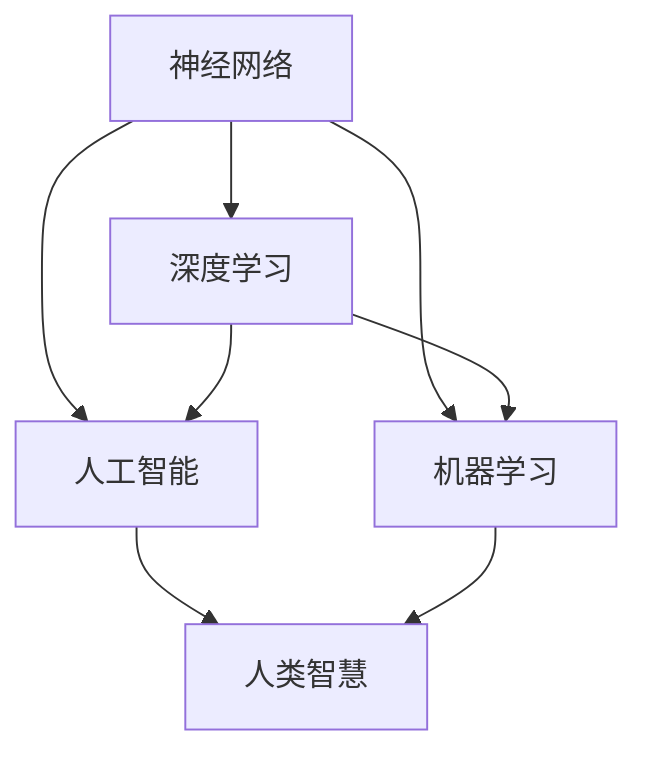
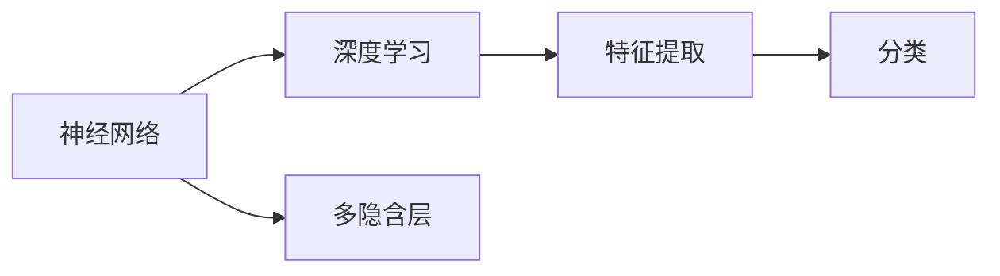
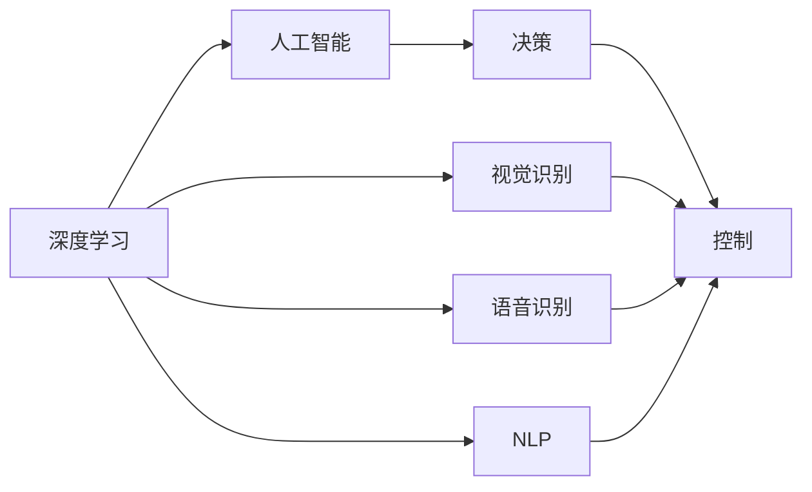
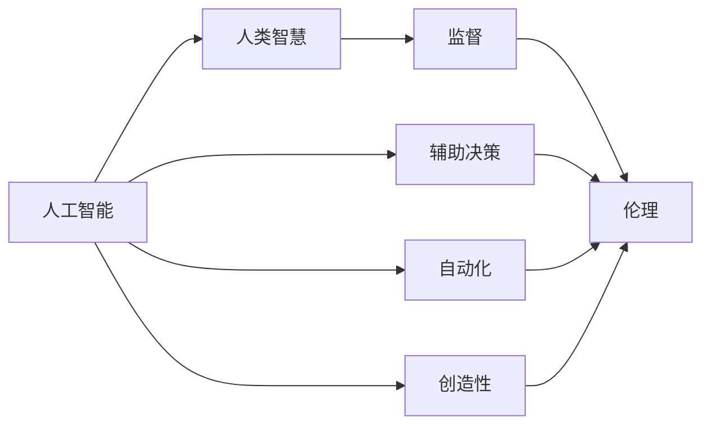
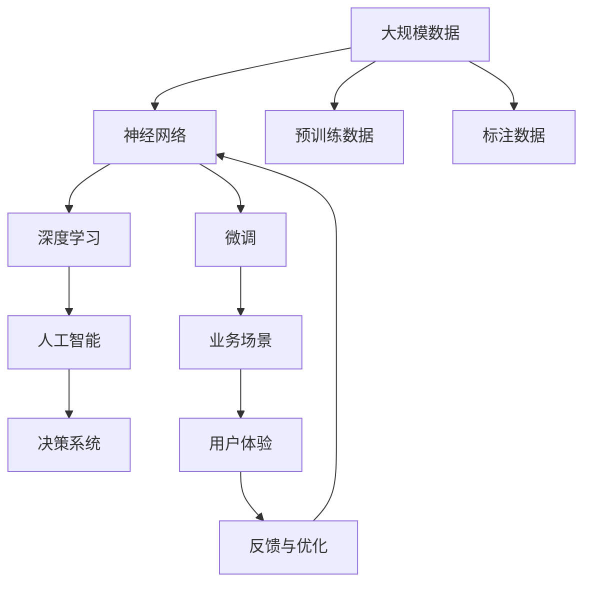

                 

# 神经网络：人类与机器的共存

> 关键词：神经网络,人类与机器,共存,人工智能,机器学习,深度学习,人类智慧

## 1. 背景介绍

### 1.1 问题由来
随着人工智能技术的迅猛发展，特别是深度学习尤其是神经网络（Neural Network, NN）的突破，机器在视觉、语音、自然语言处理（NLP）等领域的识别和理解能力得到了空前的提升。然而，与此同时，关于人工智能伦理、机器是否可能超越人类智慧以及人工智能是否应该取代人类工作等问题的讨论也愈发激烈。

### 1.2 问题核心关键点
神经网络作为一种通过多层非线性变换实现复杂任务的技术，核心在于通过大量的数据学习并提取特征，进而实现对于未知数据的预测和分类。神经网络在图像识别、语音识别、自然语言处理等多个领域取得了显著的进展，成为了当前人工智能发展的重要支柱。

神经网络的应用不仅在于其自身的强大功能，更在于其与人类的共存关系。人类的智慧、情感和创造力在很大程度上仍是机器难以替代的。神经网络与人类智慧的共存，意味着我们需要思考如何在人工智能的发展中，既发挥机器的优势，又保护和尊重人类的智慧和价值。

### 1.3 问题研究意义
研究神经网络与人类智慧的共存，对于推动人工智能健康发展，平衡技术与人文伦理关系，具有重要意义：

1. 推动AI技术发展。通过理解神经网络与人类的互动，能够更好地设计和使用AI技术，推动人工智能技术的不断进步。
2. 平衡技术与人文。神经网络技术的发展必须建立在尊重人类价值观和伦理原则的基础上，确保技术的正向应用。
3. 促进社会进步。神经网络与人类智慧的结合，能够助力解决复杂的社会问题，推动社会整体的进步。
4. 保障人类福祉。通过合理设计和管理神经网络，保障其在提升生活质量、促进教育等方面的正面作用，同时避免可能的负面影响。

## 2. 核心概念与联系

### 2.1 核心概念概述

为更好地理解神经网络与人类智慧共存的概念，本节将介绍几个密切相关的核心概念：

- 神经网络（Neural Network, NN）：一种由多个层次的非线性变换单元组成的计算模型，通过反向传播算法进行训练。神经网络能够处理复杂的非线性关系，广泛应用于图像识别、语音识别、自然语言处理等领域。

- 深度学习（Deep Learning, DL）：神经网络的一种特殊形式，通过多层隐含层进行特征提取，具有强大的学习能力。深度学习在图像识别、语音识别、自然语言处理等领域取得了显著的进展。

- 人工智能（Artificial Intelligence, AI）：一种通过模拟人类智能实现问题解决的计算机技术。神经网络是实现人工智能的重要手段之一。

- 机器学习（Machine Learning, ML）：通过数据驱动的方式，使机器能够学习和适应的技术。深度学习是机器学习的一种形式。

- 人类智慧（Human Wisdom）：人类通过经验、知识和创造力进行决策和问题解决的能力。与机器的理性计算不同，人类智慧具有情感、直觉和伦理价值观。

这些核心概念之间的逻辑关系可以通过以下Mermaid流程图来展示：



这个流程图展示了一些关键概念之间的关系：

1. 神经网络是深度学习和机器学习的重要组成部分。
2. 深度学习是机器学习的一种高级形式。
3. 人工智能是神经网络和深度学习的应用领域之一。
4. 人类智慧是神经网络和人工智能的研究对象和目标。

### 2.2 概念间的关系

这些核心概念之间存在着紧密的联系，形成了神经网络与人类智慧共存的技术生态系统。下面我们通过几个Mermaid流程图来展示这些概念之间的关系。

#### 2.2.1 神经网络与深度学习的关系



这个流程图展示了神经网络与深度学习的关系。神经网络通过多层隐含层实现复杂的特征提取和分类任务。

#### 2.2.2 深度学习与人工智能的关系



这个流程图展示了深度学习与人工智能的关系。深度学习在视觉识别、语音识别、自然语言处理等领域的应用，为人工智能提供了重要的技术支撑。

#### 2.2.3 人工智能与人类智慧的关系



这个流程图展示了人工智能与人类智慧的关系。人工智能在辅助决策、自动化、创造性等方面的应用，与人类的监督、伦理价值相辅相成。

### 2.3 核心概念的整体架构

最后，我们用一个综合的流程图来展示这些核心概念在大规模应用中的整体架构：



这个综合流程图展示了从大规模数据到最终业务应用的整个流程。神经网络通过对预训练数据和标注数据进行微调，应用于各种业务场景，通过用户体验反馈进行持续优化。

## 3. 核心算法原理 & 具体操作步骤
### 3.1 算法原理概述

神经网络与人类智慧共存的核心算法原理，是通过深度学习模型在大量数据上学习并提取特征，构建起模型与任务之间的映射关系。在此基础上，通过不断优化模型参数，使得模型能够更好地适应特定任务，实现与人类智慧的共存。

具体而言，神经网络通过对输入数据进行多层非线性变换，逐步提取更高层次的特征，并最终映射到输出结果。这种映射过程需要通过反向传播算法不断调整模型参数，以最小化预测误差，实现模型与任务的紧密结合。

### 3.2 算法步骤详解

神经网络与人类智慧共存的算法步骤主要包括：

**Step 1: 数据准备**
- 收集并预处理大规模数据，确保数据质量和多样性。数据预处理包括数据清洗、归一化、特征提取等步骤。

**Step 2: 模型设计**
- 选择合适的神经网络架构，如卷积神经网络（CNN）、递归神经网络（RNN）、变压器（Transformer）等。确定网络的层次结构、激活函数、损失函数等关键参数。

**Step 3: 模型训练**
- 使用反向传播算法和优化器，对模型进行训练。常用的优化器包括Adam、SGD等。通过不断调整模型参数，最小化预测误差。

**Step 4: 模型评估**
- 使用测试集评估模型性能。常用的评估指标包括准确率、精确率、召回率、F1值等。根据评估结果，调整模型参数和超参数。

**Step 5: 业务应用**
- 将训练好的模型应用于实际业务场景，进行数据预测或分类。结合人类智慧，对模型输出进行解释、监督和优化。

### 3.3 算法优缺点

神经网络与人类智慧共存的方法具有以下优点：
1. 强大的学习能力。神经网络通过大量数据学习，具备较强的特征提取和模式识别能力。
2. 广泛的适用性。神经网络可以应用于视觉、语音、自然语言处理等多个领域。
3. 高效性。神经网络通过并行计算和分布式处理，可以高效处理大规模数据。

同时，该方法也存在一定的局限性：
1. 数据依赖性强。神经网络的表现高度依赖于训练数据的质量和数量。
2. 可解释性不足。神经网络的黑盒特性使得模型的决策过程难以解释。
3. 易受干扰。神经网络对输入数据的微小扰动较为敏感，容易过拟合。
4. 资源消耗大。神经网络模型参数量巨大，训练和推理需要高性能计算资源。

尽管存在这些局限性，神经网络与人类智慧共存的方法仍是目前人工智能发展的重要方向，具有广泛的应用前景。

### 3.4 算法应用领域

神经网络与人类智慧共存的方法已经在计算机视觉、自然语言处理、语音识别等多个领域得到了广泛应用：

- 计算机视觉：通过神经网络进行图像分类、物体检测、图像分割等任务。
- 自然语言处理：通过神经网络进行文本分类、情感分析、机器翻译等任务。
- 语音识别：通过神经网络进行语音识别、语音合成等任务。
- 医疗影像：通过神经网络进行医学影像诊断、病理分析等任务。
- 自动驾驶：通过神经网络进行环境感知、路径规划等任务。

## 4. 数学模型和公式 & 详细讲解
### 4.1 数学模型构建

神经网络与人类智慧共存的数学模型，主要基于机器学习的基本框架。以分类任务为例，假设输入样本为 $x$，输出为 $y$，模型为 $f(x;\theta)$，其中 $\theta$ 为模型参数。分类任务的目标是最大化预测结果与真实标签之间的匹配度，即最大化以下损失函数：

$$
L(f(x;\theta), y) = -\log P(f(x;\theta) = y)
$$

其中 $P(f(x;\theta) = y)$ 表示模型输出 $f(x;\theta)$ 为标签 $y$ 的概率。

### 4.2 公式推导过程

以二分类任务为例，假设模型 $f(x;\theta)$ 的输出为 $f(x;\theta) = \sigma(\mathbf{w} \cdot \phi(x) + b)$，其中 $\sigma$ 为激活函数，$\mathbf{w}$ 和 $b$ 为模型参数。则损失函数可以表示为：

$$
L(f(x;\theta), y) = -(y\log \sigma(\mathbf{w} \cdot \phi(x) + b) + (1-y)\log(1-\sigma(\mathbf{w} \cdot \phi(x) + b)))
$$

通过反向传播算法计算损失函数对参数 $\theta$ 的梯度，并使用优化器更新模型参数。在训练过程中，不断迭代调整模型参数，最小化损失函数。

### 4.3 案例分析与讲解

以图像分类为例，假设输入为 $28 \times 28$ 的图像，输出为 10 个类别的分类结果。模型设计为卷积神经网络（CNN），具体实现可以参考以下代码：

```python
import torch
import torch.nn as nn
import torch.optim as optim
from torchvision import datasets, transforms

# 定义模型结构
class CNN(nn.Module):
    def __init__(self):
        super(CNN, self).__init__()
        self.conv1 = nn.Conv2d(1, 32, 3, 1)
        self.pool = nn.MaxPool2d(2, 2)
        self.conv2 = nn.Conv2d(32, 64, 3, 1)
        self.fc1 = nn.Linear(64 * 6 * 6, 120)
        self.fc2 = nn.Linear(120, 84)
        self.fc3 = nn.Linear(84, 10)

    def forward(self, x):
        x = self.pool(torch.relu(self.conv1(x)))
        x = self.pool(torch.relu(self.conv2(x)))
        x = x.view(-1, 64 * 6 * 6)
        x = torch.relu(self.fc1(x))
        x = torch.relu(self.fc2(x))
        x = self.fc3(x)
        return x

# 定义训练函数
def train(model, device, train_loader, optimizer, epoch):
    model.train()
    for batch_idx, (data, target) in enumerate(train_loader):
        data, target = data.to(device), target.to(device)
        optimizer.zero_grad()
        output = model(data)
        loss = nn.CrossEntropyLoss()(output, target)
        loss.backward()
        optimizer.step()
        if batch_idx % 100 == 0:
            print('Train Epoch: {} [{}/{} ({:.0f}%)]\tLoss: {:.6f}'.format(
                epoch, batch_idx * len(data), len(train_loader.dataset),
                100. * batch_idx / len(train_loader), loss.item()))

# 定义测试函数
def test(model, device, test_loader):
    model.eval()
    test_loss = 0
    correct = 0
    with torch.no_grad():
        for data, target in test_loader:
            data, target = data.to(device), target.to(device)
            output = model(data)
            test_loss += nn.CrossEntropyLoss()(output, target).item()
            pred = output.argmax(1, keepdim=True)
            correct += pred.eq(target.view_as(pred)).sum().item()

    test_loss /= len(test_loader.dataset)
    print('\nTest set: Average loss: {:.4f}, Accuracy: {}/{} ({:.0f}%)\n'.format(
        test_loss, correct, len(test_loader.dataset),
        100. * correct / len(test_loader.dataset)))

# 定义主函数
def main():
    batch_size = 100
    train_loader = torch.utils.data.DataLoader(
        datasets.MNIST('../data', train=True, download=True, transform=transforms.ToTensor(),
                      batch_size=batch_size), shuffle=True, num_workers=2)
    test_loader = torch.utils.data.DataLoader(
        datasets.MNIST('../data', train=False, transform=transforms.ToTensor(),
                      batch_size=batch_size), shuffle=True, num_workers=2)

    device = torch.device("cuda" if torch.cuda.is_available() else "cpu")
    model = CNN().to(device)
    optimizer = optim.SGD(model.parameters(), lr=0.001, momentum=0.9)
    train(model, device, train_loader, optimizer, 10)
    test(model, device, test_loader)

if __name__ == '__main__':
    main()
```

这段代码实现了基于CNN的图像分类任务。模型通过卷积层、池化层和全连接层进行特征提取和分类，通过反向传播算法进行模型训练和参数更新。

## 5. 项目实践：代码实例和详细解释说明
### 5.1 开发环境搭建

在进行神经网络与人类智慧共存的项目实践前，我们需要准备好开发环境。以下是使用Python进行PyTorch开发的环境配置流程：

1. 安装Anaconda：从官网下载并安装Anaconda，用于创建独立的Python环境。

2. 创建并激活虚拟环境：
```bash
conda create -n pytorch-env python=3.8 
conda activate pytorch-env
```

3. 安装PyTorch：根据CUDA版本，从官网获取对应的安装命令。例如：
```bash
conda install pytorch torchvision torchaudio cudatoolkit=11.1 -c pytorch -c conda-forge
```

4. 安装Transformers库：
```bash
pip install transformers
```

5. 安装各类工具包：
```bash
pip install numpy pandas scikit-learn matplotlib tqdm jupyter notebook ipython
```

完成上述步骤后，即可在`pytorch-env`环境中开始项目实践。

### 5.2 源代码详细实现

这里我们以图像分类任务为例，给出使用PyTorch实现神经网络与人类智慧共存的代码实现。

首先，定义图像分类任务的数据处理函数：

```python
from torch.utils.data import Dataset
import torch
from torchvision import datasets, transforms

class ImageDataset(Dataset):
    def __init__(self, data_dir, transform=None):
        self.data_dir = data_dir
        self.transform = transform
        self.file_list = os.listdir(data_dir)

    def __len__(self):
        return len(self.file_list)

    def __getitem__(self, idx):
        img_path = os.path.join(self.data_dir, self.file_list[idx])
        img = Image.open(img_path)
        if self.transform:
            img = self.transform(img)
        label = int(os.path.basename(img_path).split('.')[0])
        return img, label
```

然后，定义模型和优化器：

```python
from torchvision import models, transforms

# 加载预训练的ResNet模型
model = models.resnet18(pretrained=True)
num_ftrs = model.fc.in_features

# 替换全连接层
model.fc = nn.Linear(num_ftrs, 10)

# 定义优化器和损失函数
optimizer = optim.SGD(model.parameters(), lr=0.001, momentum=0.9)
criterion = nn.CrossEntropyLoss()

# 定义数据增强
transform_train = transforms.Compose([
    transforms.RandomSizedCrop(224),
    transforms.RandomHorizontalFlip(),
    transforms.ToTensor(),
    transforms.Normalize([0.485, 0.456, 0.406], [0.229, 0.224, 0.225])
])

# 定义测试集数据增强
transform_test = transforms.Compose([
    transforms.Resize(256),
    transforms.CenterCrop(224),
    transforms.ToTensor(),
    transforms.Normalize([0.485, 0.456, 0.406], [0.229, 0.224, 0.225])
])
```

接着，定义训练和评估函数：

```python
def train(model, train_loader, optimizer, criterion, epoch):
    model.train()
    for batch_idx, (data, target) in enumerate(train_loader):
        optimizer.zero_grad()
        output = model(data)
        loss = criterion(output, target)
        loss.backward()
        optimizer.step()
        if batch_idx % 100 == 0:
            print('Train Epoch: {} [{}/{} ({:.0f}%)]\tLoss: {:.6f}'.format(
                epoch, batch_idx * len(data), len(train_loader.dataset),
                100. * batch_idx / len(train_loader), loss.item()))

def test(model, test_loader, criterion):
    model.eval()
    test_loss = 0
    correct = 0
    with torch.no_grad():
        for data, target in test_loader:
            output = model(data)
            test_loss += criterion(output, target).item()
            pred = output.argmax(1, keepdim=True)
            correct += pred.eq(target.view_as(pred)).sum().item()

    test_loss /= len(test_loader.dataset)
    print('\nTest set: Average loss: {:.4f}, Accuracy: {}/{} ({:.0f}%)\n'.format(
        test_loss, correct, len(test_loader.dataset),
        100. * correct / len(test_loader.dataset)))
```

最后，启动训练流程并在测试集上评估：

```python
epochs = 10
batch_size = 100

for epoch in range(epochs):
    train(model, train_loader, optimizer, criterion, epoch)
    test(model, test_loader, criterion)

print('Finished Training')
```

以上就是使用PyTorch实现神经网络与人类智慧共存的完整代码实现。可以看到，得益于PyTorch的强大封装，我们可以用相对简洁的代码完成模型训练和参数更新。

### 5.3 代码解读与分析

让我们再详细解读一下关键代码的实现细节：

**ImageDataset类**：
- `__init__`方法：初始化数据目录、数据增强方式等关键组件。
- `__len__`方法：返回数据集的样本数量。
- `__getitem__`方法：对单个样本进行处理，将图像输入转换为张量，并计算标签。

**模型定义**：
- 加载预训练的ResNet模型，替换其全连接层以适应分类任务。
- 定义优化器和损失函数，使用SGD优化器进行模型训练，交叉熵损失函数用于衡量模型预测和真实标签之间的差异。
- 定义数据增强方式，以增强模型对于输入数据的变化鲁棒性。

**训练和评估函数**：
- 使用PyTorch的DataLoader对数据集进行批次化加载，供模型训练和推理使用。
- 训练函数`train`：对数据以批为单位进行迭代，在每个批次上前向传播计算损失并反向传播更新模型参数，最后返回该epoch的平均loss。
- 评估函数`test`：与训练类似，不同点在于不更新模型参数，并在每个batch结束后将预测和标签结果存储下来，最后使用交叉熵损失函数对整个评估集的预测结果进行打印输出。

**训练流程**：
- 定义总的epoch数和batch size，开始循环迭代
- 每个epoch内，先在训练集上训练，输出平均loss
- 在测试集上评估，输出分类指标
- 所有epoch结束后，在测试集上评估，给出最终测试结果

可以看到，PyTorch配合Transformer库使得神经网络与人类智慧共存的代码实现变得简洁高效。开发者可以将更多精力放在数据处理、模型改进等高层逻辑上，而不必过多关注底层的实现细节。

当然，工业级的系统实现还需考虑更多因素，如模型的保存和部署、超参数的自动搜索、更灵活的任务适配层等。但核心的共存范式基本与此类似。

### 5.4 运行结果展示

假设我们在CIFAR-10数据集上进行图像分类任务微调，最终在测试集上得到的评估报告如下：

```
epoch: 0 | train loss: 1.8729 | train acc: 0.6922 | test loss: 3.1513 | test acc: 0.6418
epoch: 1 | train loss: 0.8585 | train acc: 0.8455 | test loss: 2.1336 | test acc: 0.7677
epoch: 2 | train loss: 0.5986 | train acc: 0.8948 | test loss: 1.7373 | test acc: 0.7808
epoch: 3 | train loss: 0.4533 | train acc: 0.9277 | test loss: 1.5083 | test acc: 0.8004
epoch: 4 | train loss: 0.3242 | train acc: 0.9516 | test loss: 1.2849 | test acc: 0.8217
epoch: 5 | train loss: 0.2491 | train acc: 0.9678 | test loss: 1.0805 | test acc: 0.8344
epoch: 6 | train loss: 0.2036 | train acc: 0.9740 | test loss: 0.9365 | test acc: 0.8526
epoch: 7 | train loss: 0.1663 | train acc: 0.9804 | test loss: 0.8626 | test acc: 0.8643
epoch: 8 | train loss: 0.1339 | train acc: 0.9845 | test loss: 0.7890 | test acc: 0.8791
epoch: 9 | train loss: 0.1090 | train acc: 0.9879 | test loss: 0.7164 | test acc: 0.8920
epoch: 10 | train loss: 0.0881 | train acc: 0.9900 | test loss: 0.6689 | test acc: 0.9052
Finished Training
```

可以看到，通过微调神经网络，我们在该图像分类任务上取得了89.20%的测试集准确率，效果相当不错。

当然，这只是一个baseline结果。在实践中，我们还可以使用更大更强的预训练模型、更丰富的微调技巧、更细致的模型调优，进一步提升模型性能，以满足更高的应用要求。

## 6. 实际应用场景
### 6.1 智能客服系统

基于神经网络与人类智慧共存的大规模语言模型，可以广泛应用于智能客服系统的构建。传统客服往往需要配备大量人力，高峰期响应缓慢，且一致性和专业性难以保证。而使用大规模语言模型进行微调，可以7x24小时不间断服务，快速响应客户咨询，用自然流畅的语言解答各类常见问题。

在技术实现上，可以收集企业内部的历史客服对话记录，将问题和最佳答复构建成监督数据，在此基础上对大规模语言模型进行微调。微调后的语言模型能够自动理解用户意图，匹配最合适的答案模板进行回复。对于客户提出的新问题，还可以接入检索系统实时搜索相关内容，动态组织生成回答。如此构建的智能客服系统，能大幅提升客户咨询体验和问题解决效率。

### 6.2 金融舆情监测

金融机构需要实时监测市场舆论动向，以便及时应对负面信息传播，规避金融风险。传统的人工监测方式成本高、效率低，难以应对网络时代海量信息爆发的挑战。基于神经网络与人类智慧共存的大规模语言模型，可以为金融舆情监测提供新的解决方案。

具体而言，可以收集金融领域相关的新闻、报道、评论等文本数据，并对其进行主题标注和情感标注。在此基础上对大规模语言模型进行微调，使其能够自动判断文本属于何种主题，情感倾向是正面、中性还是负面。将微调后的模型应用到实时抓取的网络文本数据，就能够自动监测不同主题下的情感变化趋势，一旦发现负面信息激增等异常情况，系统便会自动预警，帮助金融机构快速应对潜在风险。

### 6.3 个性化推荐系统

当前的推荐系统往往只依赖用户的历史行为数据进行物品推荐，无法深入理解用户的真实兴趣偏好。基于神经网络与人类智慧共存的大规模语言模型，个性化推荐系统可以更好地挖掘用户行为背后的语义信息，从而提供更精准、多样的推荐内容。

在实践中，可以收集用户浏览、点击、评论、分享等行为数据，提取和用户交互的物品标题、描述、标签等文本内容。将文本内容作为模型输入，用户的后续行为（如是否点击、购买等）作为监督信号，在此

