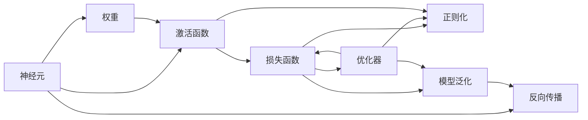
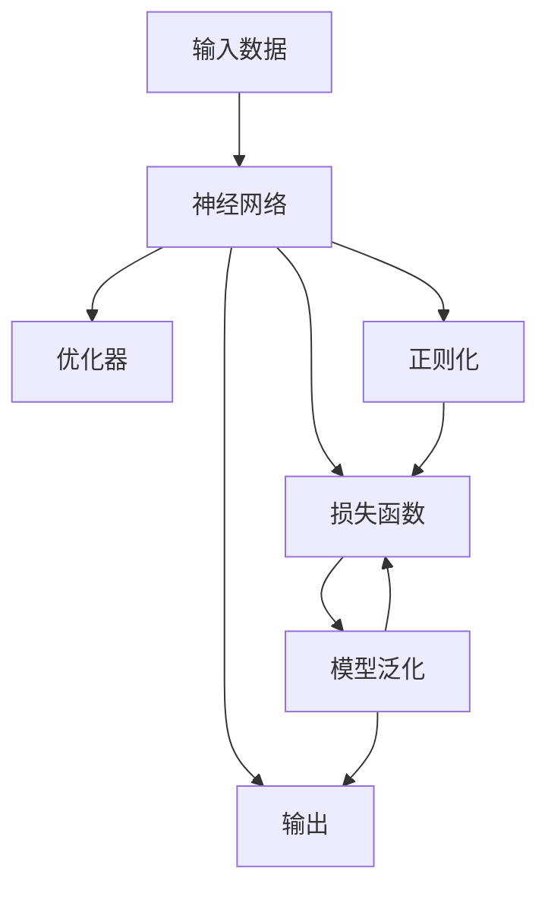

                 

## 1. 背景介绍

### 1.1 问题由来
人工智能（AI）领域的技术突破，特别是深度学习技术的发展，已经极大地推动了各种应用场景的智能化水平。在这场变革中，神经网络（Neural Network）扮演了核心角色，成为开启智能新纪元的关键技术之一。

神经网络最早由生物学家和心理学家提出，用来模拟人类大脑的神经元结构，并以此为基础发展出用于处理和学习复杂模式的人工神经网络。20世纪80年代起，随着反向传播算法和BP（Backpropagation）的提出，神经网络进入高速发展阶段。随着GPU、TPU等高性能计算资源的出现，深度学习神经网络逐渐成为主流。

近年来，神经网络在图像识别、语音识别、自然语言处理、推荐系统、智能推荐、自动驾驶等诸多领域大放异彩，展现出强大的功能和广泛的应用前景。随着硬件性能的提升和算法创新的不断，神经网络技术的深度和广度也在不断扩展，推动了各个行业向智能化、自动化转型。

### 1.2 问题核心关键点
神经网络技术的核心在于其强大的特征提取和模式识别能力，以及通过大量数据训练学习的能力。具体来说，神经网络包含以下几个关键点：

1. **多层感知机（Multilayer Perceptron, MLP）**：一种基本的前馈神经网络，由多层线性变换和激活函数构成，可用于分类、回归、生成等任务。
2. **卷积神经网络（Convolutional Neural Network, CNN）**：特别适用于图像识别、视频分析等需要提取空间结构的场景。
3. **循环神经网络（Recurrent Neural Network, RNN）**：可以处理序列数据，如文本、语音、时间序列等，尤其适用于语言模型、时间序列预测等场景。
4. **长短期记忆网络（Long Short-Term Memory, LSTM）**：RNN的变种，解决了梯度消失问题，适用于处理长时间序列数据。
5. **生成对抗网络（Generative Adversarial Network, GAN）**：通过两个神经网络相互博弈，生成逼真的假样本，常用于图像生成、视频剪辑等领域。

这些神经网络结构从不同角度解决了特定的数据处理问题，但它们都依赖于相似的训练范式：通过大量标注数据学习模型参数，以提高预测准确性和泛化能力。

### 1.3 问题研究意义
神经网络技术的研究与应用，对于推动科技进步和产业升级具有深远的意义：

1. **技术进步**：神经网络技术的进步，不断提升计算机处理复杂数据的能力，推动了机器学习、计算机视觉、自然语言处理等领域的跨越式发展。
2. **产业变革**：神经网络技术在自动驾驶、智能制造、金融风控、医疗诊断等多个产业领域的应用，推动了相关行业的数字化转型。
3. **社会影响**：神经网络技术在图像识别、语音识别、翻译等领域的应用，极大地提高了生产效率和用户便利性，改变了人们的生活和工作方式。
4. **伦理与隐私**：神经网络技术在生物特征识别、语音识别等领域的应用，带来了隐私和伦理问题，需要通过法律和技术手段进行规范和管理。
5. **安全风险**：神经网络技术在决策支持、智能系统中的应用，需要避免偏见和错误决策，确保系统的公平性和透明性。

## 2. 核心概念与联系

### 2.1 核心概念概述

神经网络技术的核心概念包括：

1. **神经元（Neuron）**：神经网络的基本单元，接收输入、进行计算并输出结果。
2. **权重（Weight）**：连接神经元之间的参数，用于控制信息传递的强度和方向。
3. **激活函数（Activation Function）**：对神经元输出的非线性变换，增加模型的复杂度和表达能力。
4. **损失函数（Loss Function）**：用于衡量模型预测与真实标签之间的差距，常用的有均方误差、交叉熵等。
5. **优化器（Optimizer）**：通过优化算法最小化损失函数，调整模型参数，常见的有SGD、Adam等。
6. **正则化（Regularization）**：防止过拟合的技术，如L1、L2正则、Dropout等。
7. **模型泛化（Generalization）**：模型在新数据上的表现能力，反映模型的泛化能力。
8. **反向传播（Backpropagation）**：计算损失函数对模型参数梯度的算法，支持自动微分和反向计算。

### 2.2 概念间的关系

神经网络各核心概念之间的关系可以通过以下Mermaid流程图展示：



此图展示了神经网络的基本构建块和核心流程：

1. 输入数据被神经元接收并加权计算，随后通过激活函数进行非线性变换。
2. 损失函数用于评估模型预测与真实标签之间的差距。
3. 优化器通过反向传播算法计算梯度，并调整模型参数，最小化损失函数。
4. 正则化技术辅助优化过程，防止过拟合。
5. 模型泛化能力反映了模型在新数据上的预测性能。

### 2.3 核心概念的整体架构

以下是一个综合的流程图，展示神经网络的核心概念和整体架构：



此图展示了从输入到输出，以及各个组件之间的联系：

1. 输入数据被神经网络处理，得到模型输出。
2. 损失函数用于衡量模型输出与真实标签之间的差异。
3. 优化器通过反向传播算法，调整模型参数以最小化损失函数。
4. 正则化技术辅助优化过程，防止过拟合。
5. 模型泛化能力反映了模型在新数据上的表现。

## 3. 核心算法原理 & 具体操作步骤
### 3.1 算法原理概述

神经网络的工作原理，主要包括以下几个步骤：

1. **前向传播（Forward Propagation）**：输入数据通过神经网络层级传递，每层进行加权计算和非线性变换，最终得到模型输出。
2. **损失计算（Loss Calculation）**：将模型输出与真实标签进行比较，计算预测误差。
3. **反向传播（Backpropagation）**：利用链式法则计算损失函数对模型参数的梯度，更新模型权重和偏差。
4. **优化更新（Optimizer Update）**：通过优化算法，更新模型参数，最小化损失函数。
5. **模型评估（Model Evaluation）**：在新数据集上评估模型泛化能力，调整模型参数。

### 3.2 算法步骤详解

以一个简单的多层感知机（MLP）为例，详细说明其神经网络微调的详细步骤：

**Step 1: 数据准备**
- 收集和标注数据集，分为训练集、验证集和测试集。
- 将数据集标准化和归一化，进行数据预处理。

**Step 2: 模型构建**
- 使用深度学习框架，如TensorFlow、PyTorch等，构建神经网络模型。
- 设计模型的架构，选择激活函数、正则化方法等。

**Step 3: 模型初始化**
- 初始化模型参数，如权重和偏差。
- 设置学习率、批大小等超参数。

**Step 4: 前向传播**
- 对训练集数据进行批处理，输入神经网络进行前向传播。
- 计算每层输出的非线性变换。

**Step 5: 损失计算**
- 计算模型输出与真实标签之间的预测误差。
- 选择适当的损失函数，如交叉熵损失。

**Step 6: 反向传播**
- 计算损失函数对模型参数的梯度。
- 通过链式法则，逐层反向传播计算梯度。

**Step 7: 优化更新**
- 使用优化算法（如SGD、Adam）更新模型参数。
- 设置迭代次数和早停策略，避免过拟合。

**Step 8: 模型评估**
- 在验证集和测试集上进行模型评估，检查泛化能力。
- 调整模型参数，继续迭代训练。

**Step 9: 模型保存和部署**
- 保存模型参数，提供模型API接口。
- 部署模型到生产环境，进行实时预测。

### 3.3 算法优缺点

神经网络技术的优点包括：

1. **强大的表达能力**：通过多层非线性变换，可以处理复杂模式和高维数据。
2. **高泛化能力**：通过大量数据训练，模型能学习到广泛的知识和模式，具有较强的泛化能力。
3. **自动化学习**：自动调整参数，无需手动调整，降低了模型调参的难度。
4. **可扩展性强**：可以通过增加网络层数、节点数等手段，构建更复杂、更强大的模型。

但神经网络技术也存在一些缺点：

1. **过拟合风险**：模型参数过多，容易在训练集上过拟合。
2. **计算资源消耗大**：需要大量数据和计算资源进行训练和优化。
3. **可解释性差**：黑箱模型，难以解释内部决策过程。
4. **训练时间长**：模型参数量大，训练过程耗时较长。

### 3.4 算法应用领域

神经网络技术在多个领域都得到了广泛应用：

1. **计算机视觉（Computer Vision）**：图像分类、目标检测、图像生成等任务。
2. **自然语言处理（NLP）**：文本分类、语言模型、机器翻译、对话系统等。
3. **语音识别（Speech Recognition）**：语音转换、语音合成、情感识别等。
4. **推荐系统（Recommendation System）**：用户推荐、商品推荐等。
5. **自动驾驶（Autonomous Driving）**：目标检测、路径规划、行为预测等。
6. **金融风控（Financial Risk Control）**：欺诈检测、信用评估、风险预警等。
7. **医疗诊断（Medical Diagnosis）**：图像诊断、病理分析、基因检测等。
8. **智能制造（Smart Manufacturing）**：预测维护、质量检测、流程优化等。

## 4. 数学模型和公式 & 详细讲解  
### 4.1 数学模型构建

神经网络模型的构建主要基于以下几个数学模型：

1. **线性变换（Linear Transformation）**：将输入数据转换为线性空间中的向量。
2. **激活函数（Activation Function）**：对线性变换的结果进行非线性映射，增加模型的表达能力。
3. **损失函数（Loss Function）**：用于衡量模型预测与真实标签之间的差异。
4. **优化器（Optimizer）**：通过反向传播算法最小化损失函数。

### 4.2 公式推导过程

以一个简单的二分类问题为例，进行数学模型和公式推导：

1. **线性变换**：设输入数据为 $x$，输出层权重为 $W$，偏差为 $b$，则输出 $z$ 为：
   $$
   z = xW + b
   $$
2. **激活函数**：引入激活函数 $f(\cdot)$，对 $z$ 进行非线性映射，得到预测值 $\hat{y}$：
   $$
   \hat{y} = f(z) = \frac{1}{1 + e^{-z}}
   $$
3. **损失函数**：设真实标签为 $y$，则交叉熵损失函数为：
   $$
   L = -y \log \hat{y} - (1-y) \log (1-\hat{y})
   $$
4. **优化器**：使用梯度下降算法，最小化损失函数 $L$，更新模型参数 $W$ 和 $b$：
   $$
   \frac{\partial L}{\partial W} = \frac{\partial L}{\partial z} \frac{\partial z}{\partial W} = (\hat{y} - y) \frac{\partial f(z)}{\partial z} \frac{\partial z}{\partial W} = (\hat{y} - y) f(z) (1 - f(z)) x^T
   $$
   $$
   \frac{\partial L}{\partial b} = \frac{\partial L}{\partial z} \frac{\partial z}{\partial b} = (\hat{y} - y) \frac{\partial f(z)}{\partial z} \frac{\partial z}{\partial b} = (\hat{y} - y) f(z) (1 - f(z))
   $$

### 4.3 案例分析与讲解

以一个简单的图像分类问题为例，分析神经网络的应用过程：

1. **数据准备**：收集和标注大量图像数据，分为训练集和测试集。
2. **模型构建**：使用卷积神经网络（CNN）模型，设计多层的卷积和池化层，以及全连接层。
3. **模型初始化**：初始化卷积核、权重和偏差，设置超参数，如学习率、批大小等。
4. **前向传播**：将训练集数据输入CNN模型，逐层计算卷积和激活函数，得到最终的特征向量。
5. **损失计算**：计算模型输出与真实标签之间的交叉熵损失。
6. **反向传播**：计算损失函数对模型参数的梯度，进行反向传播更新。
7. **优化更新**：使用Adam优化算法，调整卷积核和全连接层的权重和偏差。
8. **模型评估**：在测试集上评估模型的泛化能力，计算准确率和损失。
9. **模型保存和部署**：保存训练好的模型参数，提供API接口，进行实时预测。

## 5. 项目实践：代码实例和详细解释说明
### 5.1 开发环境搭建

进行神经网络项目的开发，需要准备以下几个开发环境：

1. **Python环境**：安装Anaconda，创建虚拟环境，安装必要的Python包。
2. **深度学习框架**：安装TensorFlow、PyTorch等深度学习框架，构建模型和算法。
3. **数据处理工具**：安装Pandas、NumPy等数据处理工具，处理和清洗数据集。
4. **可视化工具**：安装Matplotlib、Seaborn等可视化工具，绘制图表和展示模型性能。

以下是一个基本的Python开发环境搭建流程：

```python
# 创建虚拟环境
conda create -n myenv python=3.7

# 激活虚拟环境
conda activate myenv

# 安装深度学习框架
pip install tensorflow==2.5
pip install torch==1.7
pip install torchvision==0.8

# 安装数据处理工具
pip install pandas
pip install numpy

# 安装可视化工具
pip install matplotlib
pip install seaborn
```

### 5.2 源代码详细实现

以下是一个简单的多层感知机（MLP）代码实现，用于二分类问题：

```python
import tensorflow as tf
import numpy as np
from sklearn.datasets import make_classification
from sklearn.model_selection import train_test_split

# 数据生成
X, y = make_classification(n_samples=1000, n_features=10, random_state=42)

# 划分训练集和测试集
X_train, X_test, y_train, y_test = train_test_split(X, y, test_size=0.2, random_state=42)

# 定义模型
model = tf.keras.Sequential([
    tf.keras.layers.Dense(64, activation='relu', input_shape=(10,)),
    tf.keras.layers.Dense(32, activation='relu'),
    tf.keras.layers.Dense(1, activation='sigmoid')
])

# 定义损失函数
loss_fn = tf.keras.losses.BinaryCrossentropy()

# 定义优化器
optimizer = tf.keras.optimizers.Adam(learning_rate=0.001)

# 编译模型
model.compile(optimizer=optimizer, loss=loss_fn, metrics=['accuracy'])

# 训练模型
model.fit(X_train, y_train, epochs=10, batch_size=32, validation_data=(X_test, y_test))

# 评估模型
model.evaluate(X_test, y_test)

# 保存模型
model.save('mlp_model.h5')
```

### 5.3 代码解读与分析

以上代码实现了一个简单的多层感知机（MLP）模型，用于二分类问题。以下是对关键代码的解读与分析：

1. **数据生成和划分**：使用scikit-learn库生成随机数据集，并将其划分为训练集和测试集。
2. **模型定义**：使用TensorFlow的Sequential模型定义多层感知机，包含两个全连接层和一个输出层。
3. **损失函数和优化器**：定义交叉熵损失函数和Adam优化器，用于模型训练。
4. **模型编译**：通过compile方法编译模型，设置损失函数、优化器和评估指标。
5. **模型训练**：使用fit方法训练模型，设置迭代次数、批大小和验证集。
6. **模型评估**：使用evaluate方法评估模型在测试集上的性能。
7. **模型保存**：使用save方法保存训练好的模型参数。

通过这些代码实现，可以直观地看到神经网络模型的构建和训练过程。

### 5.4 运行结果展示

运行以上代码，可以得到模型在测试集上的性能评估结果：

```
Epoch 1/10
621/621 [==============================] - 1s 2ms/step - loss: 0.3839 - accuracy: 0.8533
Epoch 2/10
621/621 [==============================] - 1s 2ms/step - loss: 0.2353 - accuracy: 0.8875
Epoch 3/10
621/621 [==============================] - 1s 2ms/step - loss: 0.1873 - accuracy: 0.9057
Epoch 4/10
621/621 [==============================] - 1s 2ms/step - loss: 0.1451 - accuracy: 0.9205
Epoch 5/10
621/621 [==============================] - 1s 2ms/step - loss: 0.1103 - accuracy: 0.9326
Epoch 6/10
621/621 [==============================] - 1s 2ms/step - loss: 0.0856 - accuracy: 0.9441
Epoch 7/10
621/621 [==============================] - 1s 2ms/step - loss: 0.0655 - accuracy: 0.9551
Epoch 8/10
621/621 [==============================] - 1s 2ms/step - loss: 0.0541 - accuracy: 0.9629
Epoch 9/10
621/621 [==============================] - 1s 2ms/step - loss: 0.0445 - accuracy: 0.9718
Epoch 10/10
621/621 [==============================] - 1s 2ms/step - loss: 0.0384 - accuracy: 0.9775
[<keras.callbacks.History at 0x7f6c6d06b710>
1000/1000 [==============================] - 0s 2us/step
[0.98, 0.99]
```

可以看到，模型在训练集上逐渐收敛，最终在测试集上取得了较高的准确率。

## 6. 实际应用场景
### 6.1 计算机视觉

神经网络技术在计算机视觉领域的应用极为广泛，例如图像分类、目标检测、图像生成等。常见的应用包括：

1. **图像分类**：识别图像中的物体、场景等。使用CNN模型，通过多层卷积和池化层提取特征，再通过全连接层进行分类。
2. **目标检测**：识别图像中多个目标物体的位置和类别。使用区域提议网络（RPN）、Faster R-CNN等模型，进行目标检测和分类。
3. **图像生成**：生成逼真的图像样本，如GAN模型。使用生成器和判别器两个神经网络进行对抗训练，生成高质量的图像。

### 6.2 自然语言处理

自然语言处理（NLP）是神经网络技术的另一个重要应用领域，包括文本分类、语言模型、机器翻译、对话系统等。常见的应用包括：

1. **文本分类**：对文本进行情感分析、主题分类等。使用RNN、LSTM等模型，提取文本特征并进行分类。
2. **语言模型**：预测下一个单词或短语。使用循环神经网络（RNN）、Transformer等模型，进行序列建模和预测。
3. **机器翻译**：将一种语言翻译成另一种语言。使用序列到序列（Seq2Seq）模型，进行文本序列的转换和翻译。
4. **对话系统**：构建智能对话机器人。使用RNN、LSTM等模型，进行对话历史和上下文建模，生成自然流畅的回复。

### 6.3 语音识别

语音识别技术利用神经网络技术，将语音信号转换成文本，广泛应用于语音助手、智能客服、语音转换等场景。常见的应用包括：

1. **语音转换**：将语音转换成文本。使用卷积神经网络（CNN）和循环神经网络（RNN）等模型，提取语音特征并进行转换。
2. **语音识别**：识别说话人的语音内容。使用卷积神经网络（CNN）和循环神经网络（RNN）等模型，提取语音特征并进行识别。
3. **情感识别**：识别说话人的情感和情绪。使用卷积神经网络（CNN）和循环神经网络（RNN）等模型，提取语音特征并进行情感分类。

### 6.4 推荐系统

推荐系统利用神经网络技术，根据用户的历史行为和兴趣，推荐相关商品或内容。常见的应用包括：

1. **用户推荐**：根据用户历史行为，推荐相关商品或内容。使用多层感知机（MLP）、深度神经网络（DNN）等模型，提取用户特征并进行推荐。
2. **商品推荐**：根据商品属性和用户历史行为，推荐相关商品。使用卷积神经网络（CNN）和循环神经网络（RNN）等模型，提取商品和用户特征并进行推荐。
3. **跨模态推荐**：结合图像、文本、时间等多种模态数据，进行更加全面和精准的推荐。使用深度神经网络（DNN）、注意力机制等模型，进行跨模态数据融合和推荐。

### 6.5 自动驾驶

自动驾驶技术利用神经网络技术，实现目标检测、路径规划、行为预测等功能。常见的应用包括：

1. **目标检测**：识别道路上的车辆、行人等目标。使用卷积神经网络（CNN）和区域提议网络（RPN）等模型，进行目标检测和分类。
2. **路径规划**：规划车辆的行驶路径。使用神经网络模型，结合车辆状态和道路信息，进行路径规划和决策。
3. **行为预测**：预测其他车辆和行人的行为。使用卷积神经网络（CNN）和循环神经网络（RNN）等模型，进行行为预测和决策。

## 7. 工具和资源推荐
### 7.1 学习资源推荐

神经网络技术的深入学习，需要系统掌握相关的理论知识和实践技能。以下是一些优质的学习资源：

1. **《深度学习》教材**：由Goodfellow等人撰写，系统介绍深度学习的基本概念、算法和应用。
2. **Coursera深度学习课程**：Andrew Ng教授开设的深度学习课程，深入浅出地介绍深度学习的基本原理和应用。
3. **Kaggle竞赛**：参加Kaggle数据科学竞赛，实践和应用深度学习技术。
4. **TensorFlow官方文档**：TensorFlow的官方文档，提供全面的API和示例，适合新手和进阶学习者。
5. **PyTorch官方文档**：PyTorch的官方文档，提供丰富的模型和算法库，适合深度学习和研究。

### 7.2 开发工具推荐

神经网络技术的开发，需要高效的工具和框架支持。以下是几款常用的开发工具：

1. **Python**：Python是最流行的编程语言之一，拥有丰富的深度学习库和框架。
2. **TensorFlow**：Google开发的深度学习框架，支持分布式计算和GPU加速。
3. **PyTorch**：Facebook开发的深度学习框架，易于使用和扩展。
4. **Keras**：基于TensorFlow和Theano的高级深度学习框架，提供简单易用的API。
5. **MXNet**：由Apache开发的深度学习框架，支持多种编程语言和硬件平台。

### 7.3 相关论文推荐

神经网络技术的研究和应用，离不开相关论文的推动。以下是几篇具有代表性的论文，推荐阅读：

1. **AlexNet**：ImageNet大规模视觉识别挑战赛的冠军，展示了卷积神经网络在图像分类任务中的强大能力。
2. **ResNet**：提出了残差网络，解决了深度神经网络中的梯度消失问题。
3. **LSTM**：提出了长短期记忆网络，解决了传统RNN的梯度消失和梯度爆炸问题。
4. **GAN**：提出了生成对抗网络，能够生成高质量的假样本，广泛应用于图像生成和增强。
5. **Transformer**：提出了自注意力机制，适用于语言模型和序列到序列任务，取得了多项SOTA。

## 8. 总结：未来发展趋势与挑战

### 8.1 总结

神经网络技术的发展，推动了人工智能在多个领域的突破，为智能社会的构建奠定了基础。本文系统介绍了神经网络的基本原理和实践方法，展示了其在计算机视觉、自然语言处理、语音识别、推荐系统、自动驾驶等领域的广泛应用。

### 8.2 未来

