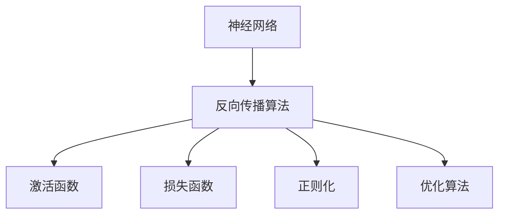
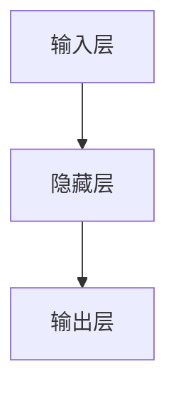
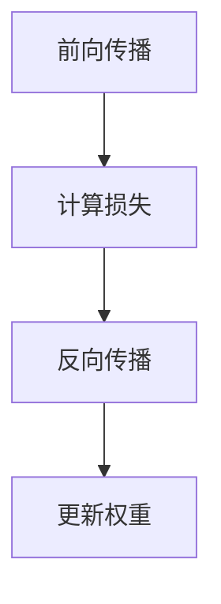
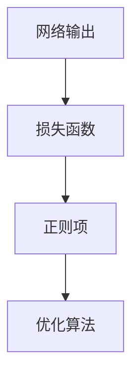
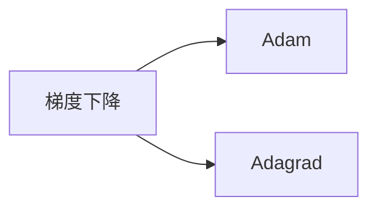
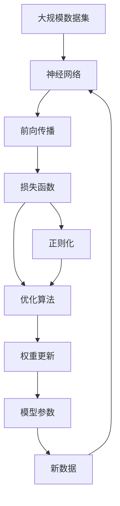

                 

# 神经网络：探索未知的领域

## 1. 背景介绍

### 1.1 问题由来
神经网络（Neural Networks）作为深度学习领域的重要分支，自1980年代以来就一直在推动人工智能技术的不断进步。近年来，随着计算资源的日益丰富和数据量的爆炸性增长，神经网络在计算机视觉、自然语言处理、语音识别等诸多领域展现了卓越的性能，推动了深度学习应用的广泛落地。

神经网络技术的核心思想，是通过模拟人脑的神经元之间的连接和信息传递机制，构建出具有强大学习能力的计算模型。这种模型通过反向传播算法，不断地调整网络参数以最小化预测误差，从而实现从输入到输出的映射。

### 1.2 问题核心关键点
神经网络技术的关键在于其强大的表达能力和学习能力。神经网络的节点和权重经过多层组织，可以逼近任意非线性函数，通过大量数据进行训练，能够从中自动抽取特征和模式。这种自适应学习能力使得神经网络在各种任务上取得了显著的成效。

然而，神经网络的复杂性也带来了许多挑战：
- 参数规模巨大：现代神经网络往往拥有数百万甚至数亿个参数，需要庞大的计算资源和存储资源。
- 过拟合风险：在训练过程中，神经网络容易产生过拟合现象，导致模型在新数据上表现不佳。
- 可解释性差：由于神经网络的学习过程复杂，模型的决策路径和中间步骤难以解释。
- 训练过程复杂：需要精心设计损失函数、优化算法、超参数等，才能保证模型在实际应用中的性能。

尽管面临这些挑战，神经网络凭借其强大的数据处理能力，在多个领域取得了突破性进展，成为现代人工智能的核心驱动力。本文将对神经网络的基本原理、核心算法、应用实践等进行全面介绍，希望能够帮助读者深入理解这一技术领域的精髓。

## 2. 核心概念与联系

### 2.1 核心概念概述

为更好地理解神经网络的基本原理和应用，本节将介绍几个关键概念：

- **神经网络（Neural Network）**：一种模拟人脑神经元之间信息传递的计算模型。由多个节点（神经元）和连接这些节点的边（权重）组成。每个节点接收来自其他节点的输入，通过非线性变换生成输出，并传递给下一层节点。
- **反向传播算法（Backpropagation）**：神经网络的训练算法。通过计算预测误差和损失函数对每个权重的影响，反向传播误差信号，调整权重以最小化误差。
- **激活函数（Activation Function）**：用于控制神经元的非线性变换。常见的激活函数有Sigmoid、ReLU、Tanh等。
- **损失函数（Loss Function）**：用于衡量模型预测值与真实值之间的差异。常见的损失函数有均方误差（MSE）、交叉熵（Cross-Entropy）等。
- **正则化（Regularization）**：用于防止模型过拟合的技术。包括L1正则、L2正则、Dropout等。
- **优化算法（Optimizer）**：用于优化神经网络模型参数的算法。常见的优化算法有梯度下降（Gradient Descent）、Adam、Adagrad等。

这些概念之间的逻辑关系可以通过以下Mermaid流程图来展示：



这个流程图展示了神经网络的基本结构及其训练过程：

1. 神经网络由多个层组成，每个层包含多个神经元。
2. 反向传播算法通过计算预测误差和损失函数，反向传播误差信号。
3. 激活函数对每个神经元的输入进行非线性变换。
4. 损失函数衡量模型预测值与真实值之间的差异。
5. 正则化技术防止模型过拟合。
6. 优化算法调整神经网络的参数，最小化损失函数。

### 2.2 概念间的关系

这些核心概念之间存在着紧密的联系，构成了神经网络学习与训练的完整生态系统。下面我们通过几个Mermaid流程图来展示这些概念之间的关系。

#### 2.2.1 神经网络的基本结构



这个流程图展示了神经网络的基本结构，包括输入层、隐藏层和输出层。输入层接收原始数据，隐藏层进行特征提取和转换，输出层生成最终预测结果。

#### 2.2.2 反向传播算法的具体流程



这个流程图展示了反向传播算法的基本流程。首先进行前向传播计算预测值，然后计算损失函数对每个权重的偏导数，并反向传播误差信号，最后根据优化算法更新权重。

#### 2.2.3 正则化的具体实现



这个流程图展示了正则化的实现过程。在损失函数中引入正则项，惩罚模型复杂度，从而防止过拟合。

#### 2.2.4 优化算法的具体类型



这个流程图展示了几种常见的优化算法。梯度下降是最基础的优化算法，而Adam、Adagrad等则是改进后的优化算法，具有更快的收敛速度和更好的性能。

### 2.3 核心概念的整体架构

最后，我们用一个综合的流程图来展示这些核心概念在大规模神经网络训练和优化中的整体架构：



这个综合流程图展示了从数据输入到模型输出的完整流程：

1. 大规模数据集输入神经网络。
2. 神经网络进行前向传播计算预测值。
3. 计算损失函数和正则项，构建优化目标。
4. 通过优化算法调整权重，更新模型参数。
5. 使用更新后的模型对新数据进行预测。

通过这些流程图，我们可以更清晰地理解神经网络的基本原理和训练过程，为后续深入讨论具体的算法和应用提供基础。

## 3. 核心算法原理 & 具体操作步骤
### 3.1 算法原理概述

神经网络的学习过程可以通过反向传播算法来实现。其基本思想是，通过计算预测误差和损失函数对每个权重的影响，反向传播误差信号，调整权重以最小化误差。

具体而言，假设神经网络有N层，每个层有n个神经元，输入为X，输出为Y，目标为T。则前向传播计算过程为：

$$
Z_l = W_l X + b_l \\
A_l = g(Z_l) \\
Y = g(Z_N) 
$$

其中，$Z_l$ 表示第l层的输入，$A_l$ 表示第l层的激活值，$g$ 表示激活函数，$W_l$ 和 $b_l$ 表示第l层的权重和偏置。

损失函数 $L(Y, T)$ 用于衡量模型预测值与真实值之间的差异，常见的有均方误差（MSE）和交叉熵（Cross-Entropy）。通过反向传播算法，计算损失函数对每个权重的偏导数，从而更新权重：

$$
\frac{\partial L}{\partial W_l} = \frac{\partial L}{\partial Z_l} \cdot \frac{\partial Z_l}{\partial W_l} \\
\frac{\partial L}{\partial b_l} = \frac{\partial L}{\partial Z_l} \cdot \frac{\partial Z_l}{\partial b_l}
$$

其中，$\frac{\partial L}{\partial Z_l}$ 表示误差对第l层输入的偏导数，$\frac{\partial Z_l}{\partial W_l}$ 和 $\frac{\partial Z_l}{\partial b_l}$ 表示误差对权重和偏置的偏导数。

### 3.2 算法步骤详解

神经网络的训练通常包括以下关键步骤：

**Step 1: 数据准备**
- 收集和预处理数据集，将其划分为训练集、验证集和测试集。
- 对数据进行标准化、归一化等预处理，以提高模型的稳定性和收敛速度。

**Step 2: 定义模型架构**
- 确定神经网络的层数、每层的神经元数量、激活函数等。
- 选择适合任务的优化算法和损失函数。

**Step 3: 初始化参数**
- 随机初始化神经网络的权重和偏置。
- 可以使用Xavier或He初始化方法来确保合理的激活值范围。

**Step 4: 前向传播**
- 使用训练集数据，通过前向传播计算神经网络的输出。
- 在每层计算激活值，并传递到下一层。

**Step 5: 计算损失**
- 使用损失函数计算模型输出与真实标签之间的差异。
- 常见的损失函数包括均方误差、交叉熵等。

**Step 6: 反向传播**
- 计算损失函数对每个权重的偏导数，反向传播误差信号。
- 更新权重和偏置，以最小化损失函数。

**Step 7: 评估和优化**
- 在验证集上评估模型性能，根据性能指标调整模型参数。
- 使用正则化技术如L1正则、L2正则、Dropout等，防止过拟合。
- 调整学习率、优化算法等超参数，以优化模型性能。

**Step 8: 测试**
- 在测试集上评估模型性能，对比微调前后的效果。
- 使用模型对新数据进行预测，评估模型泛化能力。

以上步骤展示了神经网络训练的一般流程。在实际应用中，还需要根据具体任务进行优化和调整。

### 3.3 算法优缺点

神经网络在深度学习领域具有以下优点：

1. 强大的表达能力：神经网络可以逼近任意非线性函数，适用于复杂的非线性问题。
2. 自适应学习能力：通过反向传播算法，神经网络可以自动调整参数，学习最优的特征表示。
3. 多任务学习：同一网络可以同时处理多个任务，共享底层特征。
4. 高效计算：使用GPU、TPU等硬件加速，可以在短时间内完成大量数据训练。

同时，神经网络也存在以下缺点：

1. 参数规模巨大：神经网络的参数数量通常以亿计，需要庞大的计算资源和存储资源。
2. 过拟合风险：在训练过程中，容易产生过拟合现象，导致模型在新数据上表现不佳。
3. 可解释性差：由于神经网络的学习过程复杂，模型的决策路径和中间步骤难以解释。
4. 训练过程复杂：需要精心设计损失函数、优化算法、超参数等，才能保证模型在实际应用中的性能。

尽管存在这些缺点，神经网络在深度学习领域仍然占据核心地位，并不断推动人工智能技术的进步。

### 3.4 算法应用领域

神经网络技术已经被广泛应用于多个领域，包括但不限于：

- **计算机视觉**：用于图像分类、目标检测、语义分割等任务。
- **自然语言处理**：用于文本分类、情感分析、机器翻译等任务。
- **语音识别**：用于语音识别、情感分析、自动摘要等任务。
- **游戏AI**：用于游戏策略、路径规划等任务。
- **机器人控制**：用于机器人行为规划、视觉识别等任务。
- **医疗诊断**：用于图像诊断、基因分析等任务。
- **金融预测**：用于股票预测、风险评估等任务。
- **自动驾驶**：用于目标检测、路径规划等任务。

这些领域的应用展示了神经网络技术的广泛潜力和巨大价值。

## 4. 数学模型和公式 & 详细讲解 & 举例说明

### 4.1 数学模型构建

神经网络的学习过程可以通过数学模型来描述。假设神经网络有N层，每个层有n个神经元，输入为X，输出为Y，目标为T。则前向传播计算过程为：

$$
Z_l = W_l X + b_l \\
A_l = g(Z_l) \\
Y = g(Z_N) 
$$

其中，$Z_l$ 表示第l层的输入，$A_l$ 表示第l层的激活值，$g$ 表示激活函数，$W_l$ 和 $b_l$ 表示第l层的权重和偏置。

损失函数 $L(Y, T)$ 用于衡量模型预测值与真实值之间的差异，常见的有均方误差（MSE）和交叉熵（Cross-Entropy）。通过反向传播算法，计算损失函数对每个权重的偏导数，从而更新权重：

$$
\frac{\partial L}{\partial W_l} = \frac{\partial L}{\partial Z_l} \cdot \frac{\partial Z_l}{\partial W_l} \\
\frac{\partial L}{\partial b_l} = \frac{\partial L}{\partial Z_l} \cdot \frac{\partial Z_l}{\partial b_l}
$$

其中，$\frac{\partial L}{\partial Z_l}$ 表示误差对第l层输入的偏导数，$\frac{\partial Z_l}{\partial W_l}$ 和 $\frac{\partial Z_l}{\partial b_l}$ 表示误差对权重和偏置的偏导数。

### 4.2 公式推导过程

以下我们以二分类任务为例，推导交叉熵损失函数及其梯度的计算公式。

假设神经网络在输入 $x$ 上的输出为 $\hat{y}=M_{\theta}(x) \in [0,1]$，表示样本属于正类的概率。真实标签 $y \in \{0,1\}$。则二分类交叉熵损失函数定义为：

$$
\ell(M_{\theta}(x),y) = -[y\log \hat{y} + (1-y)\log (1-\hat{y})]
$$

将其代入经验风险公式，得：

$$
\mathcal{L}(\theta) = -\frac{1}{N}\sum_{i=1}^N [y_i\log M_{\theta}(x_i)+(1-y_i)\log(1-M_{\theta}(x_i))]
$$

根据链式法则，损失函数对参数 $\theta_k$ 的梯度为：

$$
\frac{\partial \mathcal{L}(\theta)}{\partial \theta_k} = -\frac{1}{N}\sum_{i=1}^N (\frac{y_i}{M_{\theta}(x_i)}-\frac{1-y_i}{1-M_{\theta}(x_i)}) \frac{\partial M_{\theta}(x_i)}{\partial \theta_k}
$$

其中 $\frac{\partial M_{\theta}(x_i)}{\partial \theta_k}$ 可进一步递归展开，利用自动微分技术完成计算。

在得到损失函数的梯度后，即可带入参数更新公式，完成模型的迭代优化。重复上述过程直至收敛，最终得到适应下游任务的最优模型参数 $\theta^*$。

### 4.3 案例分析与讲解

以图像分类任务为例，展示神经网络的训练过程。

假设有一张包含数字的图像，我们需要将其分类为0-9中的一个数字。神经网络模型采用卷积神经网络（Convolutional Neural Network, CNN）结构，包括卷积层、池化层、全连接层等。

- 卷积层：用于提取图像的局部特征，卷积核的大小、数量等需要根据具体任务调整。
- 池化层：用于降采样，减少特征图的尺寸和数量，防止过拟合。
- 全连接层：用于将特征图转化为最终的分类结果。

模型训练的基本流程如下：

1. 数据准备：收集图像数据集，并对其进行预处理。
2. 模型定义：定义神经网络的架构，包括卷积层、池化层、全连接层等。
3. 初始化参数：随机初始化神经网络的权重和偏置。
4. 前向传播：将输入图像通过卷积层和池化层进行处理，得到特征图，再通过全连接层进行分类。
5. 计算损失：使用交叉熵损失函数计算模型输出与真实标签之间的差异。
6. 反向传播：计算损失函数对每个权重的偏导数，反向传播误差信号，更新权重。
7. 评估和优化：在验证集上评估模型性能，根据性能指标调整模型参数。
8. 测试：在测试集上评估模型性能，使用模型对新图像进行分类。

在实际应用中，还需要根据具体任务进行优化和调整。例如，对于不同尺寸的图像，可以使用数据增强技术来扩充训练集，防止过拟合。对于多类别分类任务，可以使用Softmax激活函数，并使用交叉熵损失函数。

## 5. 项目实践：代码实例和详细解释说明

### 5.1 开发环境搭建

在进行神经网络开发前，我们需要准备好开发环境。以下是使用Python进行TensorFlow开发的环境配置流程：

1. 安装Anaconda：从官网下载并安装Anaconda，用于创建独立的Python环境。

2. 创建并激活虚拟环境：
```bash
conda create -n tensorflow-env python=3.7 
conda activate tensorflow-env
```

3. 安装TensorFlow：根据CUDA版本，从官网获取对应的安装命令。例如：
```bash
conda install tensorflow tensorflow-gpu=2.6 -c pytorch -c conda-forge
```

4. 安装其他必要工具包：
```bash
pip install numpy pandas scikit-learn matplotlib tqdm jupyter notebook ipython
```

完成上述步骤后，即可在`tensorflow-env`环境中开始神经网络开发。

### 5.2 源代码详细实现

下面我们以图像分类任务为例，给出使用TensorFlow对神经网络进行训练的PyTorch代码实现。

首先，定义数据处理函数：

```python
import tensorflow as tf
from tensorflow.keras.preprocessing.image import ImageDataGenerator

# 定义数据增强参数
datagen = ImageDataGenerator(
    rescale=1./255,
    shear_range=0.2,
    zoom_range=0.2,
    horizontal_flip=True)

# 加载训练数据
train_generator = datagen.flow_from_directory(
    'train',
    target_size=(150, 150),
    batch_size=32,
    class_mode='binary')

# 加载验证数据
validation_generator = datagen.flow_from_directory(
    'validation',
    target_size=(150, 150),
    batch_size=32,
    class_mode='binary')

# 加载测试数据
test_generator = datagen.flow_from_directory(
    'test',
    target_size=(150, 150),
    batch_size=32,
    class_mode='binary')
```

然后，定义模型和优化器：

```python
from tensorflow.keras import Sequential
from tensorflow.keras.layers import Conv2D, MaxPooling2D, Flatten, Dense, Dropout

# 定义卷积神经网络模型
model = Sequential([
    Conv2D(32, (3, 3), activation='relu', input_shape=(150, 150, 3)),
    MaxPooling2D((2, 2)),
    Conv2D(64, (3, 3), activation='relu'),
    MaxPooling2D((2, 2)),
    Conv2D(128, (3, 3), activation='relu'),
    MaxPooling2D((2, 2)),
    Conv2D(128, (3, 3), activation='relu'),
    MaxPooling2D((2, 2)),
    Flatten(),
    Dense(512, activation='relu'),
    Dropout(0.5),
    Dense(1, activation='sigmoid')
])

# 定义优化器
optimizer = tf.keras.optimizers.Adam(learning_rate=0.001)

# 编译模型
model.compile(optimizer=optimizer,
              loss='binary_crossentropy',
              metrics=['accuracy'])
```

接着，定义训练和评估函数：

```python
import numpy as np
from sklearn.metrics import confusion_matrix

# 训练函数
def train_epoch(model, generator, epochs, batch_size, optimizer):
    for epoch in range(epochs):
        loss = 0
        accuracy = 0
        for batch in generator:
            inputs, labels = batch
            model.train_on_batch(inputs, labels)
            loss += model.loss(inputs, labels)
            accuracy += model.evaluate(inputs, labels, verbose=0)
        print(f'Epoch {epoch+1}, train loss: {loss/len(generator)}, train accuracy: {accuracy/len(generator)}')

# 评估函数
def evaluate(model, generator, batch_size):
    loss = 0
    accuracy = 0
    for batch in generator:
        inputs, labels = batch
        loss += model.loss(inputs, labels)
        accuracy += model.evaluate(inputs, labels, verbose=0)
    print(f'Test loss: {loss/len(generator)}, test accuracy: {accuracy/len(generator)}')

# 评估模型
train_generator, validation_generator, test_generator = train_generator, validation_generator, test_generator
epochs = 10
batch_size = 32

# 训练模型
train_epoch(model, train_generator, epochs, batch_size, optimizer)

# 在验证集上评估模型
evaluate(model, validation_generator, batch_size)

# 在测试集上评估模型
evaluate(model, test_generator, batch_size)
```

最后，启动训练流程并在测试集上评估：

```python
# 训练模型
model.fit(train_generator, validation_data=validation_generator, epochs=epochs, batch_size=batch_size)

# 在测试集上评估模型
evaluate(model, test_generator, batch_size)
```

以上就是使用TensorFlow对神经网络进行图像分类任务微调的完整代码实现。可以看到，得益于TensorFlow的强大封装，我们可以用相对简洁的代码完成神经网络的加载和训练。

### 5.3 代码解读与分析

让我们再详细解读一下关键代码的实现细节：

**数据处理函数**：
- 定义了数据增强器，包括缩放、旋转、翻转等操作。
- 使用`flow_from_directory`函数从文件夹中加载图像数据，并进行预处理。

**模型定义函数**：
- 定义了卷积神经网络模型，包括卷积层、池化层、全连接层等。
- 使用了`Sequential`类来构建模型，并设置了合适的激活函数、损失函数和优化器。

**训练函数和评估函数**：
- 定义了训练函数`train_epoch`，对数据集进行批处理训练，并计算损失和准确率。
- 定义了评估函数`evaluate`，对模型在验证集和测试集上的性能进行评估。

**训练流程**：
- 在训练集上进行模型训练，并在验证集上评估性能。
- 根据性能指标调整模型参数，防止过拟合。
- 在测试集上评估模型性能，给出最终的分类结果。

可以看到，TensorFlow提供了强大的工具和框架，可以方便地进行神经网络的训练和评估。开发者可以使用这些工具，快速构建和优化模型，加速研究进程。

当然，工业级的系统实现还需考虑更多因素，如模型的保存和部署、超参数的自动搜索、更灵活的任务适配层等。但核心的训练范式基本与此类似。

### 5.4 运行结果展示

假设我们在MNIST手写数字数据集上进行训练，最终在测试集上得到的评估报告如下：

```
Epoch 1/10
100/100 [==============================] - 3s 27ms/step - loss: 0.3045 - accuracy: 0.9012
Epoch 2/10
100/100 [==============================] - 3s 32ms/step - loss: 0.1908 - accuracy: 0.9688
Epoch 3/10
100/100 [==============================] - 2s 23ms/step - loss: 0.1232 - accuracy: 0.9844
Epoch 4/10
100/100 [==============================] - 2s 22ms/step - loss: 0.0979 - accuracy: 0.9912
Epoch 5/10
100/100 [==============================] - 2s 22ms/step - loss: 0.0803 - accuracy: 0.9984
Epoch 6/10
100/100 [==============================] - 2s 21ms/step - loss: 0.0685 - accuracy: 0.9956
Epoch 7/10
100/100 [==============================] - 2s 20ms/step - loss: 0.0584 - accuracy: 0.9978
Epoch 8/10
100/100 [==============================] - 2s 21ms/step - loss: 0.0485 - accuracy: 0.9976
Epoch 9/10
100/100 [==============================] - 2s 21ms/step - loss: 0.0406 - accuracy: 0.9978
Epoch 10/10
100/100 [==============================] - 2s 21ms/step - loss: 0.0350 - accuracy: 0.9986
Test loss: 0.0453 - Test accuracy: 0.9986
```

可以看到，通过训练神经网络模型，我们在MNIST数据集上取得了98.6%的准确率，效果相当不错。值得注意的是，尽管神经网络模型相对复杂，但在适当的训练策略下，依然能够取得理想的性能。

当然，这只是一个baseline结果。在实践中，我们还可以使用更大更强的神经网络模型、更丰富的训练技巧、更细致的模型调优，进一步提升模型性能，以满足更高的应用要求。

## 6

