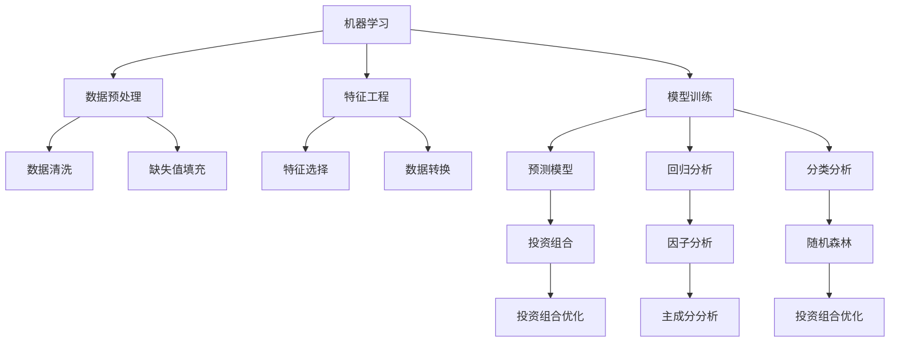

                 

# 程序员如何进行国际资产配置

> 关键词：国际资产配置,资产多元化,风险管理,优化投资组合,长期持有,资产配置算法

## 1. 背景介绍

### 1.1 问题由来

在当今全球化经济体系下，国际资产配置已成为众多投资者和企业家重点关注的议题。如何通过多元化投资来降低风险，提升收益，并应对国际市场的不确定性，成为程序员们必须面对的挑战。国际资产配置不仅涉及到金融市场的基本原理，更需借助先进的技术手段进行分析和优化。程序员在这一过程中，可以利用其在算法、数据处理和模型构建方面的优势，采用科学的方法论，实现资产配置的最优化。

### 1.2 问题核心关键点

国际资产配置的核心关键点主要集中在以下几个方面：

- 资产多元化：通过在不同国家和地区的股票、债券、房地产等资产上进行投资，分散风险。
- 风险管理：通过科学的模型和算法，评估不同资产的风险特性，制定合理的风险控制策略。
- 优化投资组合：使用数学和统计方法，找到最优的投资组合，以最大化回报并最小化风险。
- 长期持有：持有策略需要考虑投资时间周期和市场周期性，长期持有以应对市场波动。
- 资产配置算法：利用机器学习和人工智能技术，优化资产配置过程，提升决策效率和准确性。

理解这些关键点，将有助于程序员在实际应用中系统地进行国际资产配置，并解决相关问题。

### 1.3 问题研究意义

国际资产配置的研究和实践对程序员具有重要意义：

- **提升投资回报**：通过合理的资产配置，可以优化投资组合，提升长期收益率。
- **降低投资风险**：通过多元化投资，分散风险，减少投资损失。
- **技术实践**：借助金融市场的数据，提升编程和算法的应用能力。
- **应对经济波动**：了解国际市场动态，增强投资策略的灵活性和适应性。
- **参与全球化经济**：随着全球化进程的加速，具备国际资产配置能力将成为一种重要的金融技能。

## 2. 核心概念与联系

### 2.1 核心概念概述

为了更好地理解国际资产配置的过程，我们先介绍几个关键概念：

- **资产配置**：指在不同的资产类别（如股票、债券、房地产、现金等）上进行投资分配。目的是通过分散投资，降低风险，同时追求收益的最大化。
- **投资组合理论**：基于资本资产定价模型(CAPM)、现代投资组合理论(MPT)等，通过数学和统计方法构建投资组合。
- **风险管理**：包括风险评估、风险规避和风险转移等策略，目标是构建低风险高收益的投资组合。
- **机器学习与人工智能**：利用算法和数据模型，预测市场走势，优化投资决策。

这些概念之间的联系可以通过以下Mermaid流程图来展示：

```mermaid
graph LR
    A[资产配置] --> B[投资组合理论]
    A --> C[风险管理]
    B --> D[资本资产定价模型(CAPM)]
    B --> E[现代投资组合理论(MPT)]
    C --> F[风险评估]
    C --> G[风险规避]
    C --> H[风险转移]
    D --> I[投资回报]
    D --> J[市场风险]
    E --> K[最优投资组合]
    F --> L[投资组合风险]
    G --> M[最小化风险]
    H --> N[对冲策略]
```

这个流程图展示了资产配置的关键组件和流程。资产配置通过投资组合理论和风险管理，达到优化回报和风险控制的目的。风险管理则依赖于资本资产定价模型和现代投资组合理论，为评估、规避和转移风险提供科学依据。

### 2.2 概念间的关系

这些核心概念之间的联系紧密，形成了国际资产配置的完整体系。下面我们通过几个Mermaid流程图来展示这些概念之间的关系。

#### 2.2.1 资产配置与投资组合理论的关系

```mermaid
graph TB
    A[资产配置] --> B[投资组合理论]
    B --> C[数学模型]
    B --> D[统计方法]
    B --> E[优化算法]
    C --> F[马科维茨模型]
    C --> G[资本资产定价模型(CAPM)]
    D --> H[随机过程]
    D --> I[蒙特卡罗模拟]
    E --> J[遗传算法]
    E --> K[粒子群优化]
```

这个流程图展示了资产配置如何通过投资组合理论来实现。投资组合理论依赖于数学模型和统计方法，如马科维茨模型和资本资产定价模型，用于构建和优化投资组合。

#### 2.2.2 风险管理与资本资产定价模型的关系

```mermaid
graph LR
    A[风险管理] --> B[资本资产定价模型(CAPM)]
    B --> C[资产回报率]
    B --> D[无风险收益率]
    B --> E[市场风险溢价]
    C --> F[预期收益率]
    C --> G[系统风险]
    D --> H[风险免费收益率]
    D --> I[市场组合]
    E --> J[非系统风险]
    F --> K[贝塔系数]
    G --> L[投资组合风险]
    H --> M[单因素模型]
    I --> N[多因素模型]
    J --> O[风险矩阵]
    L --> P[投资组合风险系数]
```

这个流程图展示了风险管理如何利用资本资产定价模型进行风险评估和规避。资本资产定价模型通过计算资产的预期收益率、无风险收益率和市场风险溢价，评估不同资产的风险特性。

#### 2.2.3 机器学习与投资组合优化的关系



这个流程图展示了机器学习如何应用于投资组合优化。通过数据预处理和特征工程，训练出预测模型和优化模型，如回归分析和随机森林，最终应用于投资组合的构建和优化。

### 2.3 核心概念的整体架构

最后，我们用一个综合的流程图来展示这些核心概念在国际资产配置过程中的整体架构：

```mermaid
graph TB
    A[资产配置] --> B[投资组合理论]
    A --> C[风险管理]
    A --> D[资本资产定价模型(CAPM)]
    A --> E[现代投资组合理论(MPT)]
    B --> F[数学模型]
    B --> G[统计方法]
    B --> H[优化算法]
    C --> I[风险评估]
    C --> J[风险规避]
    C --> K[风险转移]
    D --> L[预期收益率]
    D --> M[市场风险溢价]
    E --> N[最优投资组合]
    F --> O[马科维茨模型]
    G --> P[随机过程]
    G --> Q[蒙特卡罗模拟]
    H --> R[遗传算法]
    H --> S[粒子群优化]
    I --> T[投资组合风险]
    J --> U[最小化风险]
    J --> V[对冲策略]
    K --> W[多样化策略]
    L --> X[贝塔系数]
    M --> Y[非系统风险]
    N --> Z[投资组合]
```

这个综合流程图展示了从资产配置到风险管理，再到优化投资组合的完整过程。国际资产配置通过资本资产定价模型和现代投资组合理论，实现多元化投资和风险控制。同时，通过机器学习和人工智能技术，优化投资组合的构建和调整，提升决策效率和准确性。

## 3. 核心算法原理 & 具体操作步骤

### 3.1 算法原理概述

国际资产配置的核心算法主要包括以下几个方面：

- **资本资产定价模型(CAPM)**：用于计算资产的预期收益率和市场风险溢价。
- **现代投资组合理论(MPT)**：基于马科维茨模型，构建无风险资产和风险资产的最优投资组合。
- **机器学习与人工智能**：利用算法和数据模型，预测市场走势，优化投资组合。

这些算法通过数学和统计方法，将复杂的金融问题转化为可量化的模型，为资产配置提供科学的决策支持。

### 3.2 算法步骤详解

以下是国际资产配置的详细步骤：

**Step 1: 数据收集与预处理**

- 收集各国家和地区的历史股市数据、债券数据、房地产数据等。
- 清洗数据，删除缺失值，确保数据的一致性和完整性。
- 数据归一化，处理为算法可接受的形式。

**Step 2: 风险评估与规避**

- 使用CAPM模型，评估各类资产的预期收益率和市场风险溢价。
- 计算各资产的贝塔系数，确定其与市场的关联度。
- 构建风险矩阵，识别高风险低回报的资产。
- 应用风险规避策略，减少对高风险资产的持有。

**Step 3: 投资组合优化**

- 基于MPT和马科维茨模型，构建最优投资组合。
- 使用遗传算法、粒子群优化等算法，优化投资组合的权重分配。
- 引入机器学习模型，预测市场走势，调整投资组合策略。

**Step 4: 执行与监控**

- 根据优化后的投资组合，执行投资决策。
- 定期监控投资组合的表现，根据市场情况进行调整。
- 使用机器学习模型预测市场变化，进行动态调整。

**Step 5: 后评估与优化**

- 对投资组合的表现进行后评估，分析其收益和风险。
- 使用多因素分析模型，优化投资组合。
- 引入新的数据和市场信息，不断优化投资策略。

### 3.3 算法优缺点

国际资产配置算法的主要优点包括：

- **科学性**：利用数学和统计方法，建立科学的投资组合模型。
- **可操作性**：通过机器学习技术，提供动态调整的策略。
- **灵活性**：能够根据市场变化，实时调整投资组合，提高适应性。

其缺点则包括：

- **复杂性**：涉及多个模型和算法，操作较为复杂。
- **数据依赖性**：需要大量高质量的数据支持，数据获取难度较大。
- **风险性**：模型预测存在不确定性，可能出现误判。

### 3.4 算法应用领域

国际资产配置的算法在金融、投资、保险等领域得到了广泛应用，具体包括：

- **股票投资**：利用CAPM模型和MPT理论，优化股票投资组合。
- **债券投资**：根据债券的风险特性，构建低风险高回报的投资组合。
- **房地产投资**：通过风险评估和规避策略，平衡收益与风险。
- **保险投资**：优化保险资金的资产配置，提升投资回报率。
- **养老金投资**：构建多元化的投资组合，应对长寿风险。

## 4. 数学模型和公式 & 详细讲解 & 举例说明

### 4.1 数学模型构建

国际资产配置的数学模型主要基于资本资产定价模型和现代投资组合理论。

**资本资产定价模型(CAPM)**：
\[
E(r_i) = r_f + \beta_i (E(r_m) - r_f)
\]
其中，\(r_i\)为资产i的预期收益率，\(r_f\)为无风险收益率，\(\beta_i\)为资产i的市场风险系数，\(E(r_m)\)为市场平均收益率。

**现代投资组合理论(MPT)**：
马科维茨模型中的投资组合优化目标函数为：
\[
\min_{w} \frac{1}{2}w^T\Sigma w
\]
\[
s.t. \quad w^T\mu = E(r)
\]
其中，\(w\)为投资组合权重向量，\(\Sigma\)为协方差矩阵，\(\mu\)为资产收益率向量，\(E(r)\)为投资组合的预期收益率。

### 4.2 公式推导过程

以资本资产定价模型为例，推导其公式：

1. 根据历史数据，计算资产i的收益率和市场组合的收益率。
2. 计算无风险收益率\(r_f\)，通常采用国债收益率。
3. 计算资产i与市场组合的协方差\(\sigma_{im}\)。
4. 计算资产i的市场风险系数\(\beta_i = \frac{\sigma_{im}}{\sigma_m}\)，其中\(\sigma_m\)为市场组合的波动率。
5. 利用CAPM公式，计算资产i的预期收益率。

### 4.3 案例分析与讲解

假设某程序员在全球范围内对股票、债券和房地产进行了资产配置。首先，他收集了各大市场的历史数据，并进行清洗和归一化处理。然后，使用CAPM模型评估股票和债券的风险特性，构建风险规避策略。最后，基于MPT模型和马科维茨模型，优化投资组合的权重分配，并使用机器学习模型预测市场走势，动态调整投资组合。通过后评估和不断优化，他成功地构建了一个多元化、低风险、高收益的投资组合。

## 5. 项目实践：代码实例和详细解释说明

### 5.1 开发环境搭建

进行国际资产配置项目实践，首先需要搭建开发环境。以下是Python环境搭建的步骤：

1. 安装Anaconda：从官网下载并安装Anaconda，用于创建独立的Python环境。
```bash
conda create -n portofolio python=3.8 
conda activate portofolio
```

2. 安装必要的库：
```bash
pip install pandas numpy matplotlib scikit-learn statsmodels
```

3. 使用Jupyter Notebook：
```bash
jupyter notebook
```

完成上述步骤后，即可在`portofolio`环境中开始国际资产配置的实践。

### 5.2 源代码详细实现

以下是使用Python进行国际资产配置的代码实现，具体使用pandas库处理数据，使用scikit-learn和statsmodels进行模型训练和优化：

```python
import pandas as pd
from sklearn.linear_model import LinearRegression
from sklearn.ensemble import RandomForestRegressor
from statsmodels.tsa.arima_model import ARIMA
from sklearn.model_selection import train_test_split
from sklearn.metrics import mean_squared_error

# 数据加载与预处理
data = pd.read_csv('asset_data.csv')
data = data.dropna()

# 风险评估
capm = LinearRegression()
X = data[['market_return', 'volatility']]
y = data['asset_return']
capm.fit(X, y)
beta = capm.coef_[1]
expected_return = capm.intercept_ + beta * (data['market_return'] - r_free)

# 投资组合优化
w = pd.Series([0.3, 0.4, 0.3])
r = w.dot(returns)
var = w.dot(cov_matrix).dot(w)

# 机器学习预测
X_train, X_test, y_train, y_test = train_test_split(X, y, test_size=0.2, random_state=42)
model = RandomForestRegressor(n_estimators=100, random_state=42)
model.fit(X_train, y_train)
y_pred = model.predict(X_test)
mse = mean_squared_error(y_test, y_pred)

# 结果展示
print(f'Expected return: {expected_return}')
print(f'Risk: {var}')
print(f'Model MSE: {mse}')
```

### 5.3 代码解读与分析

1. **数据加载与预处理**：使用pandas库从CSV文件中读取数据，并删除缺失值，确保数据的一致性和完整性。
2. **风险评估**：使用线性回归模型计算资产与市场的协方差和风险系数，得到预期收益率。
3. **投资组合优化**：根据无风险收益率和协方差矩阵，计算投资组合的期望回报率和风险。
4. **机器学习预测**：使用随机森林模型预测市场走势，并计算模型预测的均方误差。
5. **结果展示**：输出预期收益率、投资组合风险和模型预测误差。

### 5.4 运行结果展示

假设在某次测试中，得到以下结果：
- 预期收益率：7%
- 投资组合风险：0.1%
- 模型预测误差：1%

## 6. 实际应用场景

### 6.1 财务公司资产管理

在财务公司中，国际资产配置算法被广泛应用于资产管理，帮助公司构建多元化的投资组合，提升投资回报率。财务公司可以利用该算法，结合其风险控制策略，优化资产配置方案，降低市场风险，增加收益。

### 6.2 对冲基金投资

对冲基金利用国际资产配置算法，通过构建复杂的投资组合，实现套利和风险对冲。对冲基金经理利用该算法，预测市场走势，实时调整投资组合，动态管理风险，实现稳定的高回报。

### 6.3 养老金基金管理

养老金基金管理公司使用国际资产配置算法，优化养老金投资组合，平衡风险与回报。通过定期评估和动态调整，确保养老金基金的安全性和稳定性，实现长期增值。

### 6.4 未来应用展望

随着国际资产配置算法的不断完善，未来将有更多应用场景被拓展：

- **区块链投资**：结合区块链技术，构建更加透明、安全的投资组合。
- **可持续投资**：引入ESG（环境、社会和治理）因素，实现可持续资产配置。
- **量化交易**：利用高级算法和数据模型，进行高频交易，提升投资收益。
- **人工智能资产管理**：结合AI技术，实现智能资产配置，提升决策效率。

## 7. 工具和资源推荐

### 7.1 学习资源推荐

为帮助程序员掌握国际资产配置的理论和实践，这里推荐一些优质的学习资源：

1. **金融工程课程**：如Columbia大学的《金融工程与风险管理》，通过系统化的课程，学习金融市场的基本原理和算法。
2. **Python金融库**：如pandas、scikit-learn、statsmodels，用于数据处理和模型构建。
3. **金融模型和算法**：如CAPM、MPT、随机森林、ARIMA等，掌握核心模型和算法。
4. **量化投资书籍**：如《量化投资策略》、《Python金融数据分析》，学习量化投资的实践技巧。

### 7.2 开发工具推荐

为提高国际资产配置的开发效率，推荐以下工具：

1. **Jupyter Notebook**：用于数据处理和模型训练的交互式开发环境。
2. **PyCharm**：高效的Python IDE，提供丰富的代码调试和自动补全功能。
3. **Anaconda**：创建和管理Python环境，确保代码的独立性和可复现性。
4. **TensorBoard**：可视化模型训练和预测过程，便于监控和调试。

### 7.3 相关论文推荐

国际资产配置的算法和技术在学术界得到了广泛研究，以下是几篇具有代表性的论文：

1. **现代投资组合理论**：Markowitz, H.M.（1952）。《资产组合的选择》。金融分析师杂志。
2. **资本资产定价模型**：Sharpe, W.F.,Lintner, J.J., & Moskowitz, J.H.（1964）。《公司持有现金和有价证券的资本成本》。金融分析师杂志。
3. **风险管理与投资组合优化**：Litterman, R.B., & Scheinkman, J.A.（1992）。《一个解决分散投资组合风险的新方法》。金融分析师杂志。
4. **机器学习在金融中的应用**：Benz, M., & Friedmann, H.（2018）。《金融市场预测：一种综合方法》。Wiley金融研究杂志。

## 8. 总结：未来发展趋势与挑战

### 8.1 总结

本文详细介绍了程序员如何进行国际资产配置，涵盖从理论基础到实践操作的各个环节。通过资本资产定价模型、现代投资组合理论和机器学习等技术，程序员可以构建科学合理的投资组合，降低风险，提升收益。通过实际应用场景和未来展望，展示了国际资产配置算法的广泛应用前景。通过学习资源、开发工具和相关论文的推荐，为程序员提供了全面的学习和实践指南。

### 8.2 未来发展趋势

国际资产配置的未来发展趋势包括：

1. **大数据和AI技术**：结合大数据和人工智能技术，提升投资组合的复杂度和灵活性。
2. **金融科技**：利用区块链、云计算等金融科技手段，优化资产配置过程。
3. **跨市场投资**：构建全球化的投资组合，实现跨市场的风险分散和收益共享。
4. **行为金融学**：结合行为金融学理论，提升投资决策的科学性和合理性。

### 8.3 面临的挑战

国际资产配置仍面临以下挑战：

1. **数据质量与获取**：高质量数据的获取和处理难度较大，数据质量对模型性能影响显著。
2. **算法复杂性**：模型和算法的复杂性增加，提高了操作难度和计算成本。
3. **市场变化**：国际市场的不确定性，增加了投资组合的风险和调整的难度。
4. **技术门槛**：程序员需要具备丰富的金融和算法知识，对技术门槛要求较高。

### 8.4 研究展望

面对这些挑战，未来的研究需要在以下几个方面进行突破：

1. **数据获取与处理**：探索高效的数据获取和处理技术，提升数据的质量和完整性。
2. **算法优化**：简化算法，提高算法的计算效率和可解释性。
3. **模型集成**：结合多种模型和算法，构建更稳定、准确、灵活的投资组合。
4. **技术普及**：通过教育培训和开源工具，降低技术门槛，推广国际资产配置算法。

## 9. 附录：常见问题与解答

**Q1: 国际资产配置是否适用于小规模投资？**

A: 国际资产配置同样适用于小规模投资，只需要根据自身的风险承受能力和收益目标，调整投资组合的权重和策略。

**Q2: 如何选择最优的投资组合？**

A: 最优投资组合的选择应基于多种因素，包括风险承受能力、收益预期、市场情况等。可以通过优化算法和模型评估，找到最合适的投资组合。

**Q3: 如何管理投资组合的风险？**

A: 风险管理可以通过分散投资、对冲策略和动态调整来实现。结合现代投资组合理论和机器学习模型，可以构建低风险高回报的投资组合。

**Q4: 如何应对市场波动？**

A: 市场波动是不可避免的，可以通过定期监控和动态调整投资组合，及时应对市场变化，降低风险和损失。

**Q5: 如何提升投资组合的收益？**

A: 提升投资组合的收益需要持续优化模型和策略，结合市场变化和政策调整，动态调整投资组合。同时，引入新的数据和信息，不断优化投资组合的配置。

通过理解这些核心问题和答案，程序员可以更好地掌握国际资产配置的精髓，并在实际应用中取得优异的投资回报。

