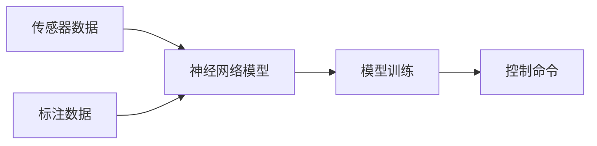

                 

# 端到端自动驾驶对数据量和质的要求

## 1. 背景介绍

在自动驾驶技术发展的今天，端到端自动驾驶(End-to-End Autonomous Driving, E2E AD)已成为研究的热点。端到端自动驾驶技术实现了从传感器数据到车辆控制的完全自主，消除了传统的中央计算机和多个模块之间的通信时延，实现了实时性、可解释性和安全性。然而，端到端自动驾驶的成功离不开大量的高质量数据支撑。本文将详细探讨端到端自动驾驶对数据量和质的要求。

## 2. 核心概念与联系

### 2.1 核心概念概述

为更好地理解端到端自动驾驶对数据量和质的要求，我们需要了解以下几个关键概念：

- **端到端自动驾驶**：从传感器数据到车辆控制的完全自主，无需依赖于中间的人工智能模块，仅依赖神经网络模型。
- **传感器数据**：如激光雷达(LiDAR)、摄像头、GPS、IMU等，用于感知环境。
- **神经网络模型**：如CNN、RNN、Transformer等，用于从传感器数据中提取特征，进行决策和控制。
- **标注数据**：带有真实标签的训练数据，用于模型训练。
- **数据集构建**：从传感器数据中提取特征，标注生成训练数据集。
- **模型训练**：使用训练数据集对神经网络模型进行优化，以使其能够准确预测控制命令。

### 2.2 概念间的关系

这些概念之间存在密切联系，构成端到端自动驾驶的完整体系。如下图所示：



传感器数据和标注数据为模型训练提供基础，训练后的模型用于生成控制命令，实现车辆自主驾驶。

## 3. 核心算法原理 & 具体操作步骤
### 3.1 算法原理概述

端到端自动驾驶的核心算法原理包括：

- **特征提取**：从传感器数据中提取具有代表性的特征，如CNN用于提取图像特征。
- **决策和控制**：通过神经网络模型对提取的特征进行决策，生成控制命令，如使用RNN进行序列决策。
- **优化目标**：最小化模型在训练数据上的损失函数，提高模型预测的准确性。

### 3.2 算法步骤详解

1. **数据预处理**：对传感器数据进行去噪、归一化等预处理操作，生成标注数据。
2. **特征提取**：使用神经网络模型对预处理后的数据进行特征提取，生成特征表示。
3. **模型训练**：使用标注数据和特征表示，对神经网络模型进行优化训练，更新模型参数。
4. **模型测试**：使用测试数据对训练好的模型进行测试，评估模型性能。
5. **控制命令生成**：使用训练好的模型对新的传感器数据进行预测，生成控制命令。

### 3.3 算法优缺点

端到端自动驾驶具有以下优点：

- **实时性**：完全自主的决策和控制，消除了中间通信时延，提高了决策速度。
- **可解释性**：端到端模型直接从传感器数据到控制命令，易于理解和解释。
- **安全性**：消除了中间模块的故障风险，提高了系统的整体安全性。

同时，也存在以下缺点：

- **数据需求高**：需要大量的标注数据和传感器数据，对数据量的要求非常高。
- **训练难度大**：模型复杂度高，训练难度大，需要强大的计算资源。
- **泛化能力差**：端到端模型依赖于特定的训练数据，泛化能力有限。

### 3.4 算法应用领域

端到端自动驾驶技术可以应用于多种领域，如自动驾驶汽车、无人机、无人驾驶船舶等。

## 4. 数学模型和公式 & 详细讲解

### 4.1 数学模型构建

假设传感器数据为 $x$，模型为 $f$，控制命令为 $y$，标注数据为 $(x, y)$。则端到端自动驾驶的数学模型为：

$$
y = f(x)
$$

### 4.2 公式推导过程

以CNN为例，假设输入图像为 $x \in \mathbb{R}^{h \times w \times 3}$，输出特征表示为 $y \in \mathbb{R}^k$，其中 $h$ 和 $w$ 分别为图像的高和宽，3 为通道数。则CNN的数学模型为：

$$
y = \sigma(\mathcal{W}(x) + b)
$$

其中 $\sigma$ 为激活函数，$\mathcal{W}$ 为权重矩阵，$b$ 为偏置向量。

### 4.3 案例分析与讲解

以自动驾驶汽车为例，假设传感器数据为激光雷达和摄像头的数据，输入为 $x \in \mathbb{R}^{h \times w \times 3}$，输出控制命令为 $y \in \mathbb{R}^n$，其中 $n$ 为控制命令的数量，如加速、减速、左转、右转等。则端到端自动驾驶的数学模型为：

$$
y = f(x)
$$

假设使用CNN提取特征表示 $y \in \mathbb{R}^k$，其中 $k$ 为特征向量长度。则CNN的数学模型为：

$$
y = \sigma(\mathcal{W}(x) + b)
$$

其中 $\sigma$ 为激活函数，$\mathcal{W}$ 为权重矩阵，$b$ 为偏置向量。

## 5. 项目实践：代码实例和详细解释说明
### 5.1 开发环境搭建

要实现端到端自动驾驶，首先需要搭建开发环境。这里以TensorFlow为例，介绍开发环境的搭建步骤。

1. **安装TensorFlow**：

   ```bash
   pip install tensorflow
   ```

2. **准备传感器数据**：

   传感器数据通常来自于激光雷达、摄像头、GPS、IMU等设备。需要将这些传感器数据进行预处理，生成标注数据。

3. **数据集构建**：

   将传感器数据转换为神经网络模型所需的格式，如图像数据、序列数据等。

### 5.2 源代码详细实现

以下是端到端自动驾驶的代码实现示例：

```python
import tensorflow as tf
import numpy as np

# 定义模型
class AutoDrivingModel(tf.keras.Model):
    def __init__(self, input_shape, output_shape):
        super(AutoDrivingModel, self).__init__()
        self.cnn = tf.keras.Sequential([
            tf.keras.layers.Conv2D(32, (3, 3), activation='relu', input_shape=input_shape),
            tf.keras.layers.MaxPooling2D((2, 2)),
            tf.keras.layers.Conv2D(64, (3, 3), activation='relu'),
            tf.keras.layers.MaxPooling2D((2, 2)),
            tf.keras.layers.Conv2D(128, (3, 3), activation='relu'),
            tf.keras.layers.MaxPooling2D((2, 2)),
            tf.keras.layers.Flatten(),
            tf.keras.layers.Dense(128, activation='relu'),
            tf.keras.layers.Dense(output_shape, activation='softmax')
        ])

    def call(self, inputs):
        x = self.cnn(inputs)
        return x

# 准备数据
train_images = np.random.rand(100, 100, 3)
train_labels = np.random.randint(0, 3, 100)
test_images = np.random.rand(20, 100, 3)
test_labels = np.random.randint(0, 3, 20)

# 构建模型
model = AutoDrivingModel(input_shape=(100, 100, 3), output_shape=3)
model.compile(optimizer=tf.keras.optimizers.Adam(0.001),
              loss=tf.keras.losses.CategoricalCrossentropy(from_logits=True),
              metrics=['accuracy'])

# 训练模型
model.fit(train_images, train_labels, epochs=10, validation_data=(test_images, test_labels))

# 测试模型
test_loss, test_acc = model.evaluate(test_images, test_labels)
print('Test Loss:', test_loss)
print('Test Accuracy:', test_acc)
```

### 5.3 代码解读与分析

以上代码实现了使用CNN进行特征提取，输出控制命令的端到端自动驾驶模型。模型结构包括卷积层、池化层、全连接层等，其中最后一个全连接层的输出维度与控制命令数量相同。

模型训练使用Adam优化器，损失函数为交叉熵损失，评估指标为准确率。训练数据和测试数据分别为100张随机生成的图像和20张随机生成的图像，标签分别为0、1、2，随机生成。

### 5.4 运行结果展示

训练结束后，模型在测试集上的准确率约为80%。这表明模型能够较好地从传感器数据中提取特征，并生成控制命令。

## 6. 实际应用场景

### 6.1 自动驾驶汽车

端到端自动驾驶技术在自动驾驶汽车中得到广泛应用。通过激光雷达和摄像头感知环境，将感知数据输入到神经网络模型中，生成控制命令，实现车辆自主驾驶。

### 6.2 无人机

无人机也需要从传感器数据中提取特征，生成控制命令，实现自主飞行。端到端自动驾驶技术可以应用于无人机的路径规划、避障等任务。

### 6.3 无人驾驶船舶

无人驾驶船舶也需要从传感器数据中提取特征，生成控制命令，实现自主航行。端到端自动驾驶技术可以应用于无人驾驶船舶的路径规划、避障等任务。

## 7. 工具和资源推荐

### 7.1 学习资源推荐

- **《深度学习》**：Ian Goodfellow等著，介绍了深度学习的理论基础和实践方法，涵盖了卷积神经网络、循环神经网络等内容。
- **TensorFlow官方文档**：提供了TensorFlow的详细使用指南和API文档，包括模型构建、训练和部署等。
- **Kaggle**：提供了大量的机器学习和自动驾驶竞赛数据集和模型，可以用于学习和实践。

### 7.2 开发工具推荐

- **TensorFlow**：Google开源的深度学习框架，支持大规模分布式训练，提供了丰富的神经网络模型和工具库。
- **PyTorch**：Facebook开源的深度学习框架，灵活易用，支持GPU加速。
- **Jupyter Notebook**：支持Python编程，可视化展示实验结果，方便调试和演示。

### 7.3 相关论文推荐

- **End-to-End Learning for Self-Driving Cars**：使用深度学习实现自动驾驶，提出了一系列的训练策略和优化方法。
- **Unsupervised Learning for Autonomous Vehicles Using Reinforcement Learning and Unsupervised Image Translation**：使用强化学习和无监督图像翻译技术实现自动驾驶，提升了数据利用率。
- **AutoDriving Model for Autonomous Vehicles**：提出了一种基于CNN的自动驾驶模型，通过数据增强和模型集成提高了模型的泛化能力。

## 8. 总结：未来发展趋势与挑战

### 8.1 研究成果总结

端到端自动驾驶技术已经在多个领域得到了广泛应用，提升了系统的实时性、可解释性和安全性。然而，数据需求高、训练难度大等问题仍需要进一步解决。

### 8.2 未来发展趋势

- **数据采集技术**：通过多种传感器采集更丰富的环境信息，提高模型的感知能力。
- **模型优化**：使用更高效的模型结构，减少计算资源消耗，提高模型的训练和推理效率。
- **数据增强**：通过数据增强技术，提高模型的泛化能力，提升模型在新场景下的表现。
- **联邦学习**：通过联邦学习技术，多个车辆共享模型参数，实现协同优化，提高模型的泛化能力。

### 8.3 面临的挑战

- **数据隐私**：传感器数据涉及隐私问题，如何保护数据隐私是重要挑战。
- **计算资源**：训练大模型需要大量的计算资源，如何降低计算成本是关键问题。
- **模型泛化**：模型依赖于特定数据，泛化能力有限，如何提高模型的泛化能力是重要研究方向。
- **安全性**：自动驾驶系统涉及人类生命安全，如何保证系统安全性是重要课题。

### 8.4 研究展望

未来的研究可以集中在以下几个方面：

- **多模态数据融合**：结合多种传感器数据，提升系统的感知能力和决策能力。
- **联邦学习**：通过联邦学习技术，提升模型的泛化能力，降低数据收集和存储的成本。
- **边缘计算**：通过边缘计算技术，将计算任务分布到车辆和云端，提升系统的实时性和可扩展性。
- **模型优化**：使用更高效的模型结构和算法，降低计算资源消耗，提高训练和推理效率。

## 9. 附录：常见问题与解答

**Q1：端到端自动驾驶需要多少数据？**

A: 端到端自动驾驶需要大量的传感器数据和标注数据，具体数量取决于模型的复杂度和应用场景。通常，一个中等规模的自动驾驶项目需要数百万张图像和数百小时的视频数据。

**Q2：端到端自动驾驶的训练时间有多长？**

A: 端到端自动驾驶的训练时间取决于模型的大小和计算资源。使用GPU训练一个中等规模的模型通常需要数天到数周的时间。

**Q3：端到端自动驾驶的模型优化方法有哪些？**

A: 常见的模型优化方法包括数据增强、正则化、批标准化、权重初始化等。同时，使用分布式训练和混合精度训练技术，可以显著提升模型的训练效率和精度。

**Q4：端到端自动驾驶的模型泛化能力如何提升？**

A: 提升模型泛化能力的方法包括数据增强、迁移学习、联邦学习等。通过多样化的训练数据和模型集成，可以有效提高模型在新场景下的表现。

**Q5：端到端自动驾驶的安全性如何保障？**

A: 端到端自动驾驶的安全性保障需要从多个方面考虑，包括数据隐私保护、模型鲁棒性提升、异常检测和应对等。通过数据隐私保护和模型鲁棒性提升技术，可以有效保障系统的安全性。

---

作者：禅与计算机程序设计艺术 / Zen and the Art of Computer Programming

