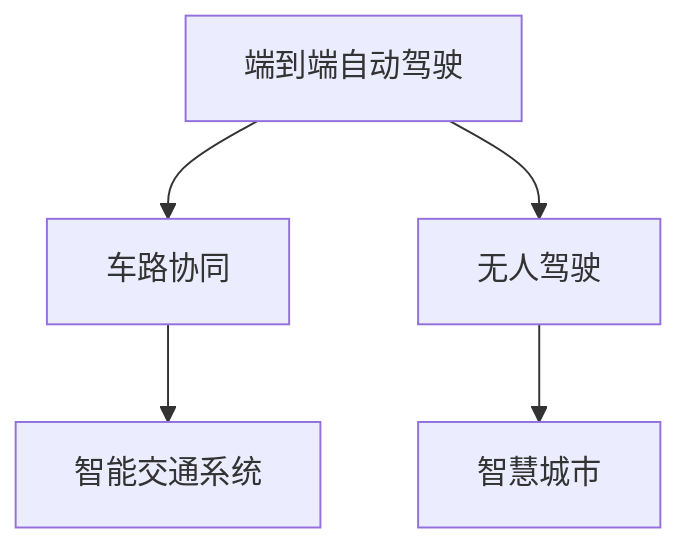
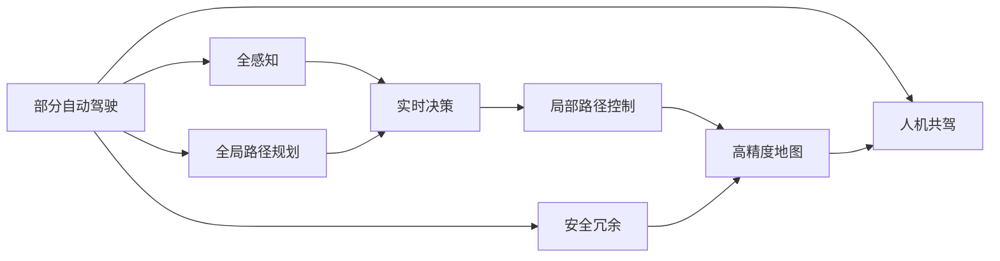
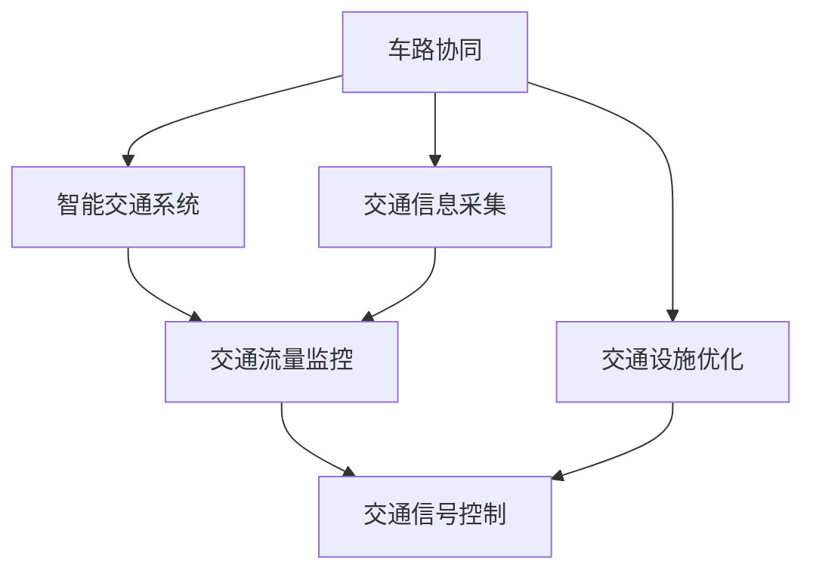
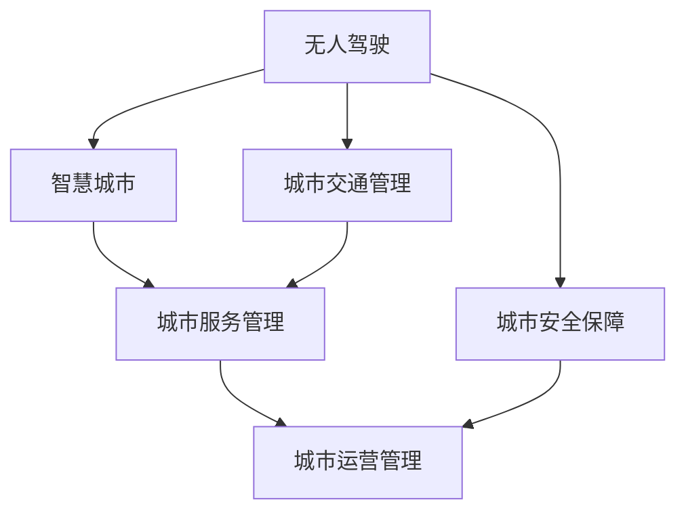
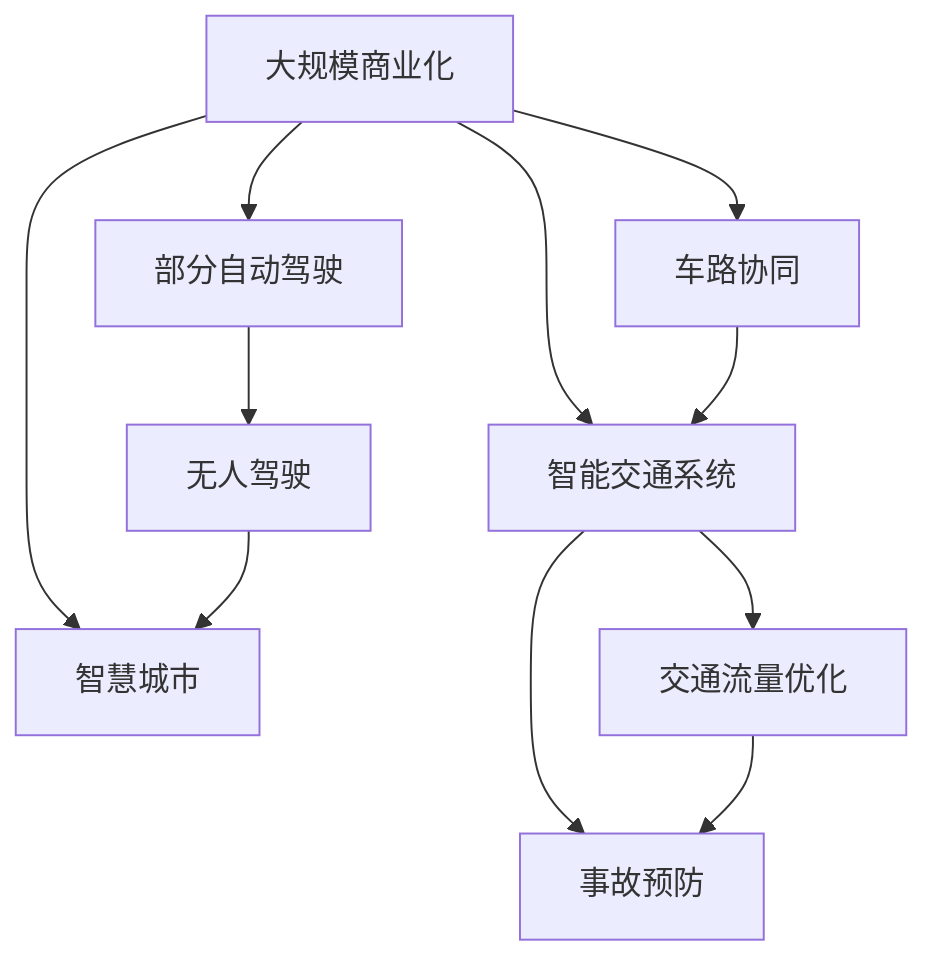

                 

# 端到端自动驾驶的渐进式商业化路径

> 关键词：端到端自动驾驶, 渐进式商业化, 车路协同, 无人驾驶, 智能交通系统

## 1. 背景介绍

自动驾驶技术近年来取得了显著进展，然而，要实现大规模商业化应用仍面临诸多挑战。从技术、法规、市场到公众接受度，每个环节都需要精心设计和规划。本文将详细探讨端到端自动驾驶技术的商业化路径，从初级阶段到完全成熟，逐级突破，分阶段进行，从而实现稳步推广和商业落地。

## 2. 核心概念与联系

### 2.1 核心概念概述

为更好地理解端到端自动驾驶技术的商业化，本节将介绍几个关键概念：

- **端到端自动驾驶**：指通过一次性实现从感知、决策到执行的完整系统，实现车辆自主导航和驾驶。这与传统的任务分解方法不同，后者通常分别处理感知、决策和执行。

- **渐进式商业化**：指从低水平功能逐步增加高级功能，从部分自动到全自动驾驶，逐步扩展应用场景，直至全面商业化。

- **车路协同**：通过车辆与路侧基础设施（如摄像头、雷达、信号灯）的协同工作，实现更高效的导航和调度。

- **无人驾驶**：指车辆完全自主驾驶，无需人类驾驶员干预。

- **智能交通系统**：通过信息技术与交通设施相结合，优化交通管理和运行效率。

- **智慧城市**：利用先进的信息技术，提高城市管理和运行效率，提升居民生活质量。

这些概念之间的联系可以通过以下Mermaid流程图来展示：



这个流程图展示了端到端自动驾驶与车路协同、无人驾驶、智能交通系统和智慧城市之间的紧密联系：

1. **端到端自动驾驶**是实现**车路协同**和**无人驾驶**的基础。
2. **车路协同**为**端到端自动驾驶**提供更强的感知能力和更优的导航策略。
3. **无人驾驶**是**端到端自动驾驶**的终极目标。
4. **智能交通系统**和**智慧城市**为**端到端自动驾驶**提供更广泛的应用场景和更高的技术要求。

### 2.2 概念间的关系

这些核心概念之间存在着紧密的联系，形成了端到端自动驾驶的完整生态系统。以下通过几个Mermaid流程图来展示这些概念之间的关系。

#### 2.2.1 端到端自动驾驶的实现路径



这个流程图展示了端到端自动驾驶从部分自动到全自动的实现路径：

1. 部分自动驾驶：在有限的场景和条件下实现部分自动驾驶功能，如车道保持、自适应巡航等。
2. 全感知：实现车辆的全场景感知能力，如多摄像头、雷达、激光雷达等传感器，实时捕捉环境信息。
3. 全局路径规划：根据高精度地图和实时感知数据，实现全局路径优化。
4. 实时决策：基于感知数据和地图信息，实时进行驾驶决策。
5. 局部路径控制：将决策结果转化为具体动作，控制车辆行驶。
6. 高精度地图：提供准确的地图数据，辅助全局路径规划。
7. 人机共驾：在部分自动驾驶阶段，通过人机协同完成驾驶任务。
8. 安全冗余：引入备用系统和传感器，保障系统安全性和可靠性。

#### 2.2.2 车路协同与智能交通系统的关系



这个流程图展示了车路协同与智能交通系统之间的紧密联系：

1. 车路协同：通过车辆与路侧设施的协同工作，实现更高效的导航和调度。
2. 智能交通系统：通过信息技术优化交通管理和运行效率，包括交通信息采集、交通流量监控和交通信号控制。
3. 交通设施优化：根据车路协同数据，优化交通设施布局和设计。

#### 2.2.3 无人驾驶与智慧城市的关系



这个流程图展示了无人驾驶与智慧城市之间的联系：

1. 无人驾驶：实现完全自主驾驶，无需人类驾驶员干预。
2. 智慧城市：利用信息技术优化城市管理和运营，提高居民生活质量。
3. 城市交通管理：通过无人驾驶技术优化城市交通流，减少拥堵和事故。
4. 城市服务管理：无人驾驶技术在物流配送、公共交通等领域的应用，提高服务效率和质量。
5. 城市运营管理：无人驾驶技术在城市维护、应急救援等领域的创新应用。
6. 城市安全保障：无人驾驶技术在提高城市安全性和应对突发事件中的作用。

### 2.3 核心概念的整体架构

最后，我们用一个综合的流程图来展示这些核心概念在大规模商业化过程中的整体架构：



这个综合流程图展示了从部分自动驾驶到大规模商业化过程中，各个概念的整合与应用：

1. 部分自动驾驶：商业化初始阶段，通过部分自动驾驶功能进行初步市场验证。
2. 车路协同：在部分自动驾驶阶段，逐步引入车路协同技术，提升感知和导航能力。
3. 无人驾驶：在车路协同和智能交通系统基础上，逐步实现无人驾驶功能。
4. 智能交通系统：与车路协同、无人驾驶等技术结合，实现交通流量优化和事故预防。
5. 智慧城市：在无人驾驶和智能交通系统基础上，实现城市运营和服务的全面智能化。

通过这个综合流程图，我们可以更清晰地理解端到端自动驾驶在大规模商业化过程中各个概念的协同作用。

## 3. 核心算法原理 & 具体操作步骤
### 3.1 算法原理概述

端到端自动驾驶的实现依赖于一系列复杂的算法和系统，包括感知、决策和执行三大部分。本文重点介绍基于深度学习的感知和决策算法，以及这些算法在大规模商业化中的应用策略。

### 3.2 算法步骤详解

#### 3.2.1 感知算法

感知算法用于从传感器数据中提取环境信息，包括视觉、激光雷达和雷达等。常用的感知算法包括：

1. **卷积神经网络（CNN）**：用于处理高分辨率的摄像头图像，提取道路、车辆、行人等目标。
2. **点云数据处理算法**：如DOPPLR、VeloceVelo等，用于处理激光雷达生成的点云数据，提取障碍物和道路特征。
3. **深度学习融合算法**：如FusionNet，将视觉、激光雷达和雷达数据进行融合，提高感知能力。

##### 3.2.1.1 CNN算法

卷积神经网络（CNN）是端到端自动驾驶中常用的视觉感知算法。其核心思想是通过卷积操作提取图像特征，并通过池化操作降低特征维度。在自动驾驶中，CNN可以用于车辆检测、行人检测、车道线识别等任务。

```python
import torch
import torch.nn as nn
import torch.optim as optim

class CNNModel(nn.Module):
    def __init__(self):
        super(CNNModel, self).__init__()
        self.conv1 = nn.Conv2d(3, 64, kernel_size=3, padding=1)
        self.relu1 = nn.ReLU(inplace=True)
        self.pool1 = nn.MaxPool2d(kernel_size=2, stride=2)
        self.conv2 = nn.Conv2d(64, 128, kernel_size=3, padding=1)
        self.relu2 = nn.ReLU(inplace=True)
        self.pool2 = nn.MaxPool2d(kernel_size=2, stride=2)
        self.fc1 = nn.Linear(128 * 7 * 7, 512)
        self.fc2 = nn.Linear(512, 2)  # 输出为车辆或行人的位置和类别

    def forward(self, x):
        x = self.conv1(x)
        x = self.relu1(x)
        x = self.pool1(x)
        x = self.conv2(x)
        x = self.relu2(x)
        x = self.pool2(x)
        x = x.view(-1, 128 * 7 * 7)
        x = self.fc1(x)
        x = self.relu(x)
        x = self.fc2(x)
        return x

# 构建CNN模型
model = CNNModel()
# 定义损失函数和优化器
criterion = nn.CrossEntropyLoss()
optimizer = optim.Adam(model.parameters(), lr=0.001)

# 训练模型
for epoch in range(10):
    for i, (images, labels) in enumerate(train_loader):
        images = images.to(device)
        labels = labels.to(device)
        optimizer.zero_grad()
        outputs = model(images)
        loss = criterion(outputs, labels)
        loss.backward()
        optimizer.step()
```

##### 3.2.1.2 点云数据处理算法

点云数据处理算法用于处理激光雷达生成的点云数据。常用的算法包括DOPPLR和VeloceVelo等。这些算法通过降采样、特征提取等操作，提取出道路、障碍物等关键信息。

```python
import torch
import torch.nn as nn
import torch.optim as optim

class PointCloudModel(nn.Module):
    def __init__(self):
        super(PointCloudModel, self).__init__()
        self.dopplr = DOPPLR()
        self.velocevelo = VeloceVelo()
        self.fc1 = nn.Linear(128, 512)
        self.fc2 = nn.Linear(512, 2)  # 输出为道路或障碍物的属性

    def forward(self, point_cloud):
        point_cloud = self.dopplr(point_cloud)
        point_cloud = self.velocevelo(point_cloud)
        point_cloud = point_cloud.view(-1, 128)
        point_cloud = self.fc1(point_cloud)
        point_cloud = self.relu(point_cloud)
        point_cloud = self.fc2(point_cloud)
        return point_cloud

# 构建点云处理模型
model = PointCloudModel()
# 定义损失函数和优化器
criterion = nn.CrossEntropyLoss()
optimizer = optim.Adam(model.parameters(), lr=0.001)

# 训练模型
for epoch in range(10):
    for i, (point_clouds, labels) in enumerate(train_loader):
        point_clouds = point_clouds.to(device)
        labels = labels.to(device)
        optimizer.zero_grad()
        outputs = model(point_clouds)
        loss = criterion(outputs, labels)
        loss.backward()
        optimizer.step()
```

##### 3.2.1.3 深度学习融合算法

深度学习融合算法通过将视觉、激光雷达和雷达数据进行融合，提高感知能力。常用的算法包括FusionNet等。

```python
import torch
import torch.nn as nn
import torch.optim as optim

class FusionModel(nn.Module):
    def __init__(self):
        super(FusionModel, self).__init__()
        self.cnn = CNNModel()
        self.pointcloud = PointCloudModel()
        self.fusion = FusionNet()

    def forward(self, images, point_clouds):
        features = self.cnn(images)
        features = self.pointcloud(point_clouds)
        outputs = self.fusion(features)
        return outputs

# 构建融合模型
model = FusionModel()
# 定义损失函数和优化器
criterion = nn.CrossEntropyLoss()
optimizer = optim.Adam(model.parameters(), lr=0.001)

# 训练模型
for epoch in range(10):
    for i, (images, point_clouds, labels) in enumerate(train_loader):
        images = images.to(device)
        point_clouds = point_clouds.to(device)
        labels = labels.to(device)
        optimizer.zero_grad()
        outputs = model(images, point_clouds)
        loss = criterion(outputs, labels)
        loss.backward()
        optimizer.step()
```

#### 3.2.2 决策算法

决策算法用于根据感知结果和环境信息，做出最优的驾驶决策。常用的决策算法包括：

1. **Q-learning**：一种强化学习算法，用于训练决策模型。
2. **深度强化学习（DRL）**：结合深度学习和强化学习的算法，用于更复杂的决策问题。
3. **行为树（Behavior Tree）**：一种基于树状结构的决策框架，用于处理多任务和异常情况。

##### 3.2.2.1 Q-learning算法

Q-learning是一种强化学习算法，用于训练决策模型。其核心思想是通过不断的试错，学习最优的决策策略。

```python
import torch
import torch.nn as nn
import torch.optim as optim
import numpy as np

class QLearningModel(nn.Module):
    def __init__(self):
        super(QLearningModel, self).__init__()
        self.fc1 = nn.Linear(128, 64)
        self.fc2 = nn.Linear(64, 4)

    def forward(self, x):
        x = self.fc1(x)
        x = self.relu(x)
        x = self.fc2(x)
        return x

# 构建Q-learning模型
model = QLearningModel()
# 定义损失函数和优化器
criterion = nn.CrossEntropyLoss()
optimizer = optim.Adam(model.parameters(), lr=0.001)

# 训练模型
for epoch in range(10):
    for i, (states, actions, rewards, next_states, dones) in enumerate(train_loader):
        states = torch.tensor(states).to(device)
        actions = torch.tensor(actions).to(device)
        rewards = torch.tensor(rewards).to(device)
        next_states = torch.tensor(next_states).to(device)
        dones = torch.tensor(dones).to(device)
        optimizer.zero_grad()
        outputs = model(states)
        loss = criterion(outputs, actions)
        loss.backward()
        optimizer.step()
```

##### 3.2.2.2 深度强化学习算法

深度强化学习（DRL）结合深度学习和强化学习的算法，用于更复杂的决策问题。常用的DRL算法包括DDPG、Actor-Critic等。

```python
import torch
import torch.nn as nn
import torch.optim as optim
import numpy as np

class DDPGModel(nn.Module):
    def __init__(self):
        super(DDPGModel, self).__init__()
        self.fc1 = nn.Linear(128, 64)
        self.fc2 = nn.Linear(64, 4)

    def forward(self, x):
        x = self.fc1(x)
        x = self.relu(x)
        x = self.fc2(x)
        return x

# 构建DDPG模型
model = DDPGModel()
# 定义损失函数和优化器
criterion = nn.CrossEntropyLoss()
optimizer = optim.Adam(model.parameters(), lr=0.001)

# 训练模型
for epoch in range(10):
    for i, (states, actions, rewards, next_states, dones) in enumerate(train_loader):
        states = torch.tensor(states).to(device)
        actions = torch.tensor(actions).to(device)
        rewards = torch.tensor(rewards).to(device)
        next_states = torch.tensor(next_states).to(device)
        dones = torch.tensor(dones).to(device)
        optimizer.zero_grad()
        outputs = model(states)
        loss = criterion(outputs, actions)
        loss.backward()
        optimizer.step()
```

##### 3.2.2.3 行为树算法

行为树（Behavior Tree）是一种基于树状结构的决策框架，用于处理多任务和异常情况。常用的行为树算法包括Behaviortree等。

```python
import torch
import torch.nn as nn
import torch.optim as optim
import numpy as np

class BehaviorTreeModel(nn.Module):
    def __init__(self):
        super(BehaviorTreeModel, self).__init__()
        self.fc1 = nn.Linear(128, 64)
        self.fc2 = nn.Linear(64, 4)

    def forward(self, x):
        x = self.fc1(x)
        x = self.relu(x)
        x = self.fc2(x)
        return x

# 构建行为树模型
model = BehaviorTreeModel()
# 定义损失函数和优化器
criterion = nn.CrossEntropyLoss()
optimizer = optim.Adam(model.parameters(), lr=0.001)

# 训练模型
for epoch in range(10):
    for i, (states, actions, rewards, next_states, dones) in enumerate(train_loader):
        states = torch.tensor(states).to(device)
        actions = torch.tensor(actions).to(device)
        rewards = torch.tensor(rewards).to(device)
        next_states = torch.tensor(next_states).to(device)
        dones = torch.tensor(dones).to(device)
        optimizer.zero_grad()
        outputs = model(states)
        loss = criterion(outputs, actions)
        loss.backward()
        optimizer.step()
```

### 3.3 算法优缺点

#### 3.3.1 感知算法的优缺点

- **优点**：
  - 通过深度学习算法，可以实现较高的感知精度。
  - 算法模块化，易于集成和维护。

- **缺点**：
  - 需要大量的标注数据进行训练，成本较高。
  - 算法复杂度高，计算量大，对硬件要求较高。

#### 3.3.2 决策算法的优缺点

- **优点**：
  - Q-learning和DRL算法可以处理更复杂的决策问题，实现更高的决策精度。
  - 行为树算法可以灵活处理多任务和异常情况。

- **缺点**：
  - 需要大量的训练样本和计算资源，训练周期较长。
  - 决策模型存在一定的延迟，影响实时决策能力。

#### 3.3.3 整体优缺点

- **优点**：
  - 端到端架构可以更高效地处理复杂驾驶任务，提升安全性和可靠性。
  - 各子算法模块化设计，便于维护和优化。

- **缺点**：
  - 需要高水平的工程和技术实现，开发成本高。
  - 需要大量的数据和计算资源进行训练和优化。

### 3.4 算法应用领域

端到端自动驾驶技术的商业化可以广泛应用于多个领域，包括但不限于：

1. **智能交通管理**：通过自动驾驶技术优化交通流，减少拥堵和事故。
2. **物流配送**：实现自动驾驶车辆在城市中的高效物流配送，降低成本，提高效率。
3. **公共交通**：在城市公共交通系统中引入自动驾驶车辆，提高服务质量和运营效率。
4. **无人驾驶出租车**：在城市中提供自动驾驶出租车服务，满足市民的出行需求。
5. **智慧停车**：通过自动驾驶车辆实现智能停车，提高停车场利用率。
6. **自动驾驶卡车**：在货运领域，实现自动驾驶卡车运输，提高运输效率和安全性。
7. **无人驾驶无人机**：在快递和农业等领域，实现无人驾驶无人机，提高物流和农业生产效率。

## 4. 数学模型和公式 & 详细讲解 & 举例说明

### 4.1 数学模型构建

端到端自动驾驶技术涉及多个子模块，包括感知、决策和执行等。以下以Q-learning算法为例，构建一个简单的数学模型。

设自动驾驶车辆的当前状态为 $s_t$，执行的动作为 $a_t$，奖励为 $r_t$，下一状态为 $s_{t+1}$，终止条件为 $d_t$。Q-learning算法通过不断迭代，学习最优的决策策略，使得总奖励最大化。

设Q值为 $Q(s_t, a_t)$，表示在状态 $s_t$ 下执行动作 $a_t$ 的预期总奖励。Q-learning算法的核心公式为：

$$
Q(s_t, a_t) = (1-\alpha)Q(s_t, a_t) + \alpha(r_t + \gamma\max_{a_{t+1}}Q(s_{t+1}, a_{t+1}))
$$

其中，$\alpha$为学习率，$\gamma$为折扣因子，表示未来奖励的权重。

### 4.2 公式推导过程

通过Q-learning算法的公式推导，可以得到最优的决策策略。其核心思想是通过不断迭代，使得Q值逼近最优决策策略。以下给出具体的公式推导过程：

设当前状态为 $s_t$，执行动作 $a_t$，奖励为 $r_t$，下一状态为 $s_{t+1}$，终止条件为 $d_t$。Q-learning算法通过不断迭代，学习最优的决策策略，使得总奖励最大化。

设Q值为 $Q(s_t, a_t)$，表示在状态 $s_t$ 下执行动作 $a_t$ 的预期总奖励。Q-learning算法的核心公式为：

$$
Q(s_t, a_t) = (1-\alpha)Q(s_t, a_t) + \alpha(r_t + \gamma\max_{a_{t+1}}Q(s_{t+1}, a_{t+1}))
$$

推导过程如下：

设当前状态为 $s_t$，执行动作 $a_t$，奖励为 $r_t$，下一状态为 $s_{t+1}$，终止条件为 $d_t$。Q-learning算法通过不断迭代，学习最优的决策策略，使得总奖励最大化。

设Q值为 $Q(s_t, a_t)$，表示在状态 $s_t$ 下执行动作 $a_t$ 的预期总奖励。Q-learning算法的核心公式为：

$$
Q(s_t, a_t) = (1-\alpha)Q(s_t, a_t) + \alpha(r_t + \gamma\max_{a_{t+1}}Q(s_{t+1}, a_{t+1}))
$$

其中，$\alpha$为学习率，$\gamma$为折扣因子，表示未来奖励的权重。

### 4.3 案例分析与讲解

#### 4.3.1 Q-learning算法的案例分析

考虑一个简单的交通场景，车辆需要从起点 $s_1$ 到达终点 $s_2$。车辆可以选择左转（L）、右转（R）和直行（S）等动作。车辆在每个状态下，可以获得一定的奖励（如+1），且每个状态都有可能进入下一个状态或终止。

| 状态 | 动作 | 奖励 | 下一状态 | 终止 |
| --- | --- | --- | --- | --- |
| $s_1$ | L | +1 | $s_3$ | 否 |
| $s_1$ | R | +1 | $s_4$ | 否 |
| $s_1$ | S | +1 | $s_2$ | 否 |
| $s_2$ | L | +1 | $s_5$ | 否 |
| $s_2$ | R | +1 | $s_6$ | 否 |
| $s_2$ | S | +1 | $s_7$ | 否 |
| $s_3$ | L | +1 | $s_5$ | 否 |
| $s_3$ | R | +1 | $s_6$ | 否 |
| $s_3$ | S | +1 | $s_8$ | 否 |
| $s_4$ | L | +1 | $s_5$ | 否 |
| $s_4$ | R | +1 | $s_6$ | 否 |
| $s_4$ | S | +1 | $s_7$ | 否 |
| $s_5$ | L | +1 | $s_2$ | 否 |
| $s_5$ | R | +1 | $s_8$ | 否 |
| $s_5$ | S | +1 | $s_9$ | 否 |
| $s_6$ | L | +1 | $s_2$ | 否 |
| $s_6$ | R | +1 | $s_8$ | 否 |
| $s_6$ | S | +1 | $s_10$ | 否 |
| $s_7$ | L | +1 | $s_2$ | 否 |
| $s_7$ | R | +1 | $s_8$ | 否 |
| $s_7$ | S | +1 | $s_10$ | 否 |
| $s_8$ | L | +1 | $s_2$ | 否 |
| $s_8$ | R | +1 | $s_10$ | 否 |
| $s_8$ | S | +1 | $s_11$ | 否 |
| $s_9$ | L | +1 | $s_2$ | 否 |
| $s_9$ | R | +1 | $s_10$ | 否 |
| $s_9$ | S | +1 | $s_11$ | 否 |
| $s_{10}$ | L | +1 | $s_2$ | 

