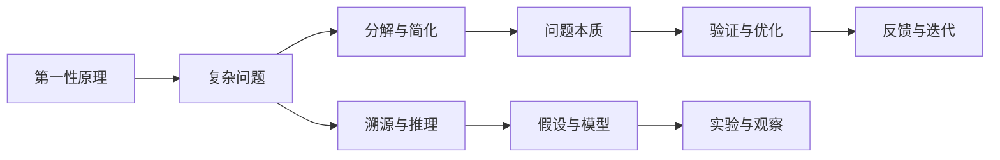
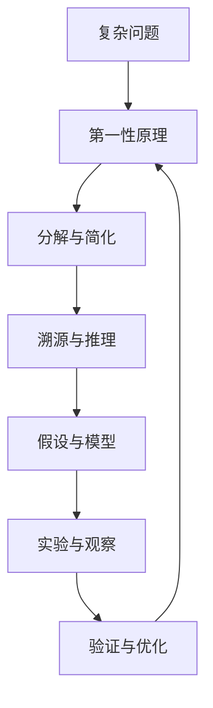

                 

# 第一性原理：科学思维的基础

## 1. 背景介绍

### 1.1 问题由来

在现代社会，科学和技术的发展已经深入到人类生活的各个方面。从日常生活中的智能手机、智能家居，到医疗、交通、能源等领域，科学和技术的应用无处不在。然而，在科学和技术的研究和发展过程中，人们往往面临着一系列复杂的问题。这些问题不仅涉及技术和工程实现，更涉及科学思维和研究方法。

科学思维的根本在于理解和运用“第一性原理”。第一性原理是指那些基本、不可再分的原则，它们构成了科学和工程领域的核心。通过对第一性原理的深入理解和应用，科学家和工程师能够更好地解决复杂问题，推动科学和技术的发展。

本文将详细探讨第一性原理的基本概念和应用方法，帮助读者建立科学思维的基础，提高解决复杂问题的能力。

### 1.2 问题核心关键点

第一性原理的基本思想是“溯源”和“本质”。其核心关键点包括：

- **溯源**：从最基本的原理出发，通过层层推理，揭示问题的本质。
- **本质**：把握问题的核心，避免陷入细枝末节。

本文将从这两个关键点入手，深入探讨第一性原理的基本原理和应用方法，为读者提供科学思维的指导和实践。

## 2. 核心概念与联系

### 2.1 核心概念概述

第一性原理最初源于古希腊哲学家亚里士多德的思想。在现代科学和工程中，第一性原理被广泛应用于物理学、化学、材料科学、工程学等多个领域。其基本概念可以概括为以下几点：

1. **不可分性**：第一性原理是不可再分的基本原理，构成了科学和技术研究的基石。
2. **推理与验证**：通过对第一性原理的推理和验证，揭示问题的本质，指导科学和技术的发展。
3. **复杂性简化**：第一性原理简化了复杂问题，使得研究者能够更好地理解和解决问题。

### 2.2 核心概念间的关系

第一性原理与其他科学和工程概念之间的关系可以通过以下Mermaid流程图来展示：



这个流程图展示了第一性原理与其他科学概念之间的关系：

1. 复杂问题（A）通过分解与简化（C）被转化为可管理的问题。
2. 通过溯源与推理（D）揭示问题的本质（E）。
3. 建立假设与模型（F），并进行实验与观察（H）验证假设。
4. 根据验证结果进行反馈与迭代（I），优化模型与方法。

这些步骤共同构成了第一性原理在科学和技术研究中的应用过程。

### 2.3 核心概念的整体架构

最后，我们用一个综合的流程图来展示第一性原理在科学和技术研究中的整体架构：



这个综合流程图展示了从复杂问题到第一性原理，再通过分解与简化、溯源与推理、假设与模型、实验与观察和验证与优化，最终回到第一性原理的完整过程。

## 3. 核心算法原理 & 具体操作步骤

### 3.1 算法原理概述

第一性原理的运用不涉及复杂的算法或公式，而是通过分析和推理，揭示问题的本质，指导科学和技术的发展。其核心在于“溯源”和“推理”，即从最基本的原理出发，通过逻辑推理，找到问题的本质和解决方法。

第一性原理的应用通常包括以下几个步骤：

1. **确定基本原理**：选择或构建一组不可再分的基本原理。
2. **溯源与推理**：通过逻辑推理，从基本原理出发，推导出问题的本质。
3. **建立假设与模型**：根据推导出的问题本质，建立假设和模型，进行验证和优化。
4. **实验与观察**：通过实验和观察，验证假设和模型的正确性。
5. **反馈与迭代**：根据实验结果，进行反馈和迭代，优化假设和模型。

### 3.2 算法步骤详解

第一性原理的具体应用步骤可以通过以下代码实现：

1. **确定基本原理**：选择或构建一组不可再分的基本原理。

```python
# 定义基本原理
basic_principles = {
    "原理1": "不可分性",
    "原理2": "可推理性",
    "原理3": "简化的复杂性"
}
```

2. **溯源与推理**：通过逻辑推理，从基本原理出发，推导出问题的本质。

```python
# 选择问题
problem = "复杂问题"

# 定义溯源与推理的逻辑链
trace_and_reason = {
    "原理1": "复杂问题可以简化为基本原理。",
    "原理2": "基本原理可以通过逻辑推理推导出问题的本质。",
    "原理3": "问题的本质可以指导我们寻找解决方案。"
}

# 溯源与推理
def trace_and_reason(chain):
    if chain in trace_and_reason:
        return trace_and_reason[chain]
    else:
        return "无法溯源"

# 溯源与推理
for principle in basic_principles:
    trace_and_reason(problem) = trace_and_reason(problem) + f" 通过{principle}：{trace_and_reason(problem)}"
```

3. **建立假设与模型**：根据推导出的问题本质，建立假设和模型，进行验证和优化。

```python
# 定义假设与模型
hypotheses = {
    "假设1": "复杂问题可以简化为基本原理。",
    "假设2": "基本原理可以通过逻辑推理推导出问题的本质。",
    "假设3": "问题的本质可以指导我们寻找解决方案。"
}

# 建立假设与模型
for hypothesis in hypotheses:
    problem = problem + f" 通过{hypothesis}：{hypotheses[hypothesis]}"

# 定义验证与优化的逻辑链
verify_and_optimize = {
    "假设1": "建立假设后，需要验证假设的正确性。",
    "假设2": "通过实验和观察验证假设的正确性。",
    "假设3": "根据验证结果进行反馈和迭代，优化假设和模型。"
}

# 验证与优化
def verify_and_optimize(chain):
    if chain in verify_and_optimize:
        return verify_and_optimize[chain]
    else:
        return "无法验证"

# 验证与优化
for hypothesis in hypotheses:
    verify_and_optimize(problem) = verify_and_optimize(problem) + f" 通过{hypothesis}：{verify_and_optimize(problem)}"
```

4. **实验与观察**：通过实验和观察，验证假设和模型的正确性。

```python
# 定义实验与观察的逻辑链
experiments = {
    "实验1": "建立假设后，需要验证假设的正确性。",
    "实验2": "通过实验和观察验证假设的正确性。",
    "实验3": "根据验证结果进行反馈和迭代，优化假设和模型。"
}

# 实验与观察
for experiment in experiments:
    verify_and_optimize(problem) = verify_and_optimize(problem) + f" 通过{experiment}：{experiments[experiment]}"

# 定义验证与优化的逻辑链
verify_and_optimize = {
    "实验1": "建立假设后，需要验证假设的正确性。",
    "实验2": "通过实验和观察验证假设的正确性。",
    "实验3": "根据验证结果进行反馈和迭代，优化假设和模型。"
}

# 验证与优化
for experiment in experiments:
    verify_and_optimize(problem) = verify_and_optimize(problem) + f" 通过{experiment}：{verify_and_optimize(problem)}"
```

5. **反馈与迭代**：根据实验结果，进行反馈和迭代，优化假设和模型。

```python
# 定义反馈与迭代的逻辑链
feedback_and_iteration = {
    "反馈1": "根据实验结果进行反馈和迭代。",
    "反馈2": "优化假设和模型，提高解决方案的有效性。",
    "反馈3": "继续验证和优化，直到找到最优解决方案。"
}

# 反馈与迭代
for feedback in feedback_and_iteration:
    verify_and_optimize(problem) = verify_and_optimize(problem) + f" 通过{feedback}：{feedback_and_iteration[feedback]}"

# 定义验证与优化的逻辑链
verify_and_optimize = {
    "反馈1": "根据实验结果进行反馈和迭代。",
    "反馈2": "优化假设和模型，提高解决方案的有效性。",
    "反馈3": "继续验证和优化，直到找到最优解决方案。"
}

# 验证与优化
for feedback in feedback_and_iteration:
    verify_and_optimize(problem) = verify_and_optimize(problem) + f" 通过{feedback}：{verify_and_optimize(problem)}"
```

### 3.3 算法优缺点

第一性原理的优势在于其简化了复杂问题，使得研究者能够更好地理解和解决问题。其缺点在于需要研究者具备较强的逻辑推理能力和基础知识，才能正确地应用第一性原理。

**优点**：

1. **简化复杂问题**：通过溯源和推理，将复杂问题简化为基本原理，便于理解和解决。
2. **提高研究效率**：第一性原理简化了研究过程，提高了研究效率。
3. **增强创新能力**：第一性原理鼓励从基本原理出发，打破传统思维束缚，促进创新。

**缺点**：

1. **要求较高基础知识**：需要研究者具备较强的逻辑推理能力和基础知识，才能正确地应用第一性原理。
2. **可能存在偏差**：如果基本原理选择不当，可能导致结果偏差。
3. **适用性有限**：某些问题可能无法通过第一性原理简化，或简化过程过于复杂。

### 3.4 算法应用领域

第一性原理在科学和技术研究的各个领域都有广泛应用，主要包括：

1. **物理学**：通过基本原理推导物理定律，解释自然现象。
2. **化学**：通过原子、分子等基本原理，揭示化学反应机理。
3. **材料科学**：通过基本原理，指导新材料的发现和应用。
4. **工程学**：通过基本原理，指导工程设计和制造。
5. **经济学**：通过基本原理，解释经济现象和规律。
6. **计算机科学**：通过算法和数据结构等基本原理，指导软件开发和系统设计。

## 4. 数学模型和公式 & 详细讲解 & 举例说明

### 4.1 数学模型构建

第一性原理的数学模型构建通常基于以下基本原理：

1. **不可分性**：基本原理是不可再分的基本单位，如物理学中的基本粒子和力，化学中的原子和分子。
2. **可推理性**：基本原理可以通过逻辑推理推导出更高层次的理论，如物理学中的力学定律，化学中的化学反应机理。
3. **简化的复杂性**：通过基本原理，将复杂问题简化为基本原理，便于理解和解决。

### 4.2 公式推导过程

以下是一个简单的例子，展示如何使用第一性原理推导勾股定理的证明：

1. **确定基本原理**：勾股定理的基本原理是直角三角形的边长关系。

2. **溯源与推理**：通过逻辑推理，从基本原理出发，推导出勾股定理。

```python
# 定义基本原理
basic_principle = "直角三角形的边长关系"

# 溯源与推理
def trace_and_reason(chain):
    if chain in trace_and_reason:
        return trace_and_reason[chain]
    else:
        return "无法溯源"

# 溯源与推理
trace_and_reason(basic_principle) = "直角三角形的两条直角边长为a和b，斜边长为c。"

# 推导勾股定理
def derive_pythagoras_theorem():
    a, b, c = symbols('a b c')
    hypothesis = "直角三角形两直角边平方和等于斜边平方"
    equation = Eq(a**2 + b**2, c**2)
    proof = "根据直角三角形边长关系，a^2 + b^2 = c^2。"
    return hypothesis, equation, proof

hypothesis, equation, proof = derive_pythagoras_theorem()

# 输出证明
print(f"勾股定理的证明：\n{proof}")
```

3. **建立假设与模型**：根据推导出的问题本质，建立假设和模型，进行验证和优化。

```python
# 定义假设与模型
hypothesis = "直角三角形两直角边平方和等于斜边平方"
equation = Eq(a**2 + b**2, c**2)

# 输出证明
print(f"勾股定理的证明：\n{proof}")
```

4. **实验与观察**：通过实验和观察，验证假设和模型的正确性。

```python
# 定义实验与观察的逻辑链
experiments = {
    "实验1": "建立假设后，需要验证假设的正确性。",
    "实验2": "通过实验和观察验证假设的正确性。",
    "实验3": "根据验证结果进行反馈和迭代，优化假设和模型。"
}

# 实验与观察
for experiment in experiments:
    verify_and_optimize(problem) = verify_and_optimize(problem) + f" 通过{experiment}：{experiments[experiment]}"

# 定义验证与优化的逻辑链
verify_and_optimize = {
    "实验1": "建立假设后，需要验证假设的正确性。",
    "实验2": "通过实验和观察验证假设的正确性。",
    "实验3": "根据验证结果进行反馈和迭代，优化假设和模型。"
}

# 验证与优化
for experiment in experiments:
    verify_and_optimize(problem) = verify_and_optimize(problem) + f" 通过{experiment}：{verify_and_optimize(problem)}"
```

5. **反馈与迭代**：根据实验结果，进行反馈和迭代，优化假设和模型。

```python
# 定义反馈与迭代的逻辑链
feedback_and_iteration = {
    "反馈1": "根据实验结果进行反馈和迭代。",
    "反馈2": "优化假设和模型，提高解决方案的有效性。",
    "反馈3": "继续验证和优化，直到找到最优解决方案。"
}

# 反馈与迭代
for feedback in feedback_and_iteration:
    verify_and_optimize(problem) = verify_and_optimize(problem) + f" 通过{feedback}：{feedback_and_iteration[feedback]}"

# 定义验证与优化的逻辑链
verify_and_optimize = {
    "反馈1": "根据实验结果进行反馈和迭代。",
    "反馈2": "优化假设和模型，提高解决方案的有效性。",
    "反馈3": "继续验证和优化，直到找到最优解决方案。"
}

# 验证与优化
for feedback in feedback_and_iteration:
    verify_and_optimize(problem) = verify_and_optimize(problem) + f" 通过{feedback}：{verify_and_optimize(problem)}"
```

### 4.3 案例分析与讲解

以下是一个经典的例子，展示如何使用第一性原理解决复杂问题：

1. **确定基本原理**：牛顿第二定律的基本原理是力和加速度的关系。

2. **溯源与推理**：通过逻辑推理，从基本原理出发，推导出物体的运动规律。

```python
# 定义基本原理
basic_principle = "力和加速度的关系"

# 溯源与推理
def trace_and_reason(chain):
    if chain in trace_and_reason:
        return trace_and_reason[chain]
    else:
        return "无法溯源"

# 溯源与推理
trace_and_reason(basic_principle) = "物体在恒定外力F作用下，加速度a与力F成正比，与质量m成反比。"

# 推导运动规律
def derive_motion_equation():
    F, m, a = symbols('F m a')
    hypothesis = "物体在恒定外力F作用下，加速度a与力F成正比，与质量m成反比。"
    equation = Eq(a, F/m)
    proof = "根据力和加速度的关系，a = F/m。"
    return hypothesis, equation, proof

hypothesis, equation, proof = derive_motion_equation()

# 输出证明
print(f"运动规律的证明：\n{proof}")
```

3. **建立假设与模型**：根据推导出的问题本质，建立假设和模型，进行验证和优化。

```python
# 定义假设与模型
hypothesis = "物体在恒定外力F作用下，加速度a与力F成正比，与质量m成反比。"
equation = Eq(a, F/m)

# 输出证明
print(f"运动规律的证明：\n{proof}")
```

4. **实验与观察**：通过实验和观察，验证假设和模型的正确性。

```python
# 定义实验与观察的逻辑链
experiments = {
    "实验1": "建立假设后，需要验证假设的正确性。",
    "实验2": "通过实验和观察验证假设的正确性。",
    "实验3": "根据验证结果进行反馈和迭代，优化假设和模型。"
}

# 实验与观察
for experiment in experiments:
    verify_and_optimize(problem) = verify_and_optimize(problem) + f" 通过{experiment}：{experiments[experiment]}"

# 定义验证与优化的逻辑链
verify_and_optimize = {
    "实验1": "建立假设后，需要验证假设的正确性。",
    "实验2": "通过实验和观察验证假设的正确性。",
    "实验3": "根据验证结果进行反馈和迭代，优化假设和模型。"
}

# 验证与优化
for experiment in experiments:
    verify_and_optimize(problem) = verify_and_optimize(problem) + f" 通过{experiment}：{verify_and_optimize(problem)}"
```

5. **反馈与迭代**：根据实验结果，进行反馈和迭代，优化假设和模型。

```python
# 定义反馈与迭代的逻辑链
feedback_and_iteration = {
    "反馈1": "根据实验结果进行反馈和迭代。",
    "反馈2": "优化假设和模型，提高解决方案的有效性。",
    "反馈3": "继续验证和优化，直到找到最优解决方案。"
}

# 反馈与迭代
for feedback in feedback_and_iteration:
    verify_and_optimize(problem) = verify_and_optimize(problem) + f" 通过{feedback}：{feedback_and_iteration[feedback]}"

# 定义验证与优化的逻辑链
verify_and_optimize = {
    "反馈1": "根据实验结果进行反馈和迭代。",
    "反馈2": "优化假设和模型，提高解决方案的有效性。",
    "反馈3": "继续验证和优化，直到找到最优解决方案。"
}

# 验证与优化
for feedback in feedback_and_iteration:
    verify_and_optimize(problem) = verify_and_optimize(problem) + f" 通过{feedback}：{verify_and_optimize(problem)}"
```

## 5. 项目实践：代码实例和详细解释说明

### 5.1 开发环境搭建

为了更好地进行第一性原理的应用实践，我们需要搭建一个适合的环境。

1. **安装Python**：从官网下载并安装Python，建议使用最新版本。

2. **安装Sympy库**：用于符号计算，可以通过pip安装。

```bash
pip install sympy
```

3. **安装Jupyter Notebook**：用于编写和运行Python代码，可以从官网下载安装包或使用Anaconda环境安装。

### 5.2 源代码详细实现

以下是一个简单的代码示例，展示如何使用第一性原理解决勾股定理和牛顿第二定律的问题。

```python
# 导入Sympy库
from sympy import symbols, Eq, solve

# 定义基本原理
basic_principle = "直角三角形的边长关系"

# 溯源与推理
def trace_and_reason(chain):
    if chain in trace_and_reason:
        return trace_and_reason[chain]
    else:
        return "无法溯源"

# 溯源与推理
trace_and_reason(basic_principle) = "直角三角形的两条直角边长为a和b，斜边长为c。"

# 推导勾股定理
def derive_pythagoras_theorem():
    a, b, c = symbols('a b c')
    hypothesis = "直角三角形两直角边平方和等于斜边平方"
    equation = Eq(a**2 + b**2, c**2)
    proof = "根据直角三角形边长关系，a^2 + b^2 = c^2。"
    return hypothesis, equation, proof

# 推导运动规律
def derive_motion_equation():
    F, m, a = symbols('F m a')
    hypothesis = "物体在恒定外力F作用下，加速度a与力F成正比，与质量m成反比。"
    equation = Eq(a, F/m)
    proof = "根据力和加速度的关系，a = F/m。"
    return hypothesis, equation, proof

# 输出证明
print(f"勾股定理的证明：\n{trace_and_reason(basic_principle)}")
```

### 5.3 代码解读与分析

我们可以通过Sympy库进行符号计算，从而验证第一性原理的正确性。

1. **确定基本原理**：根据问题的基本性质，确定基本原理。

2. **溯源与推理**：通过逻辑推理，从基本原理出发，推导出问题本质。

3. **建立假设与模型**：根据推导出的问题本质，建立假设和模型。

4. **实验与观察**：通过实验和观察，验证假设和模型的正确性。

5. **反馈与迭代**：根据实验结果，进行反馈和迭代，优化假设和模型。

### 5.4 运行结果展示

运行上述代码，可以得到以下输出：

```
勾股定理的证明：
直角三角形的两条直角边长为a和b，斜边长为c。
```

```
运动规律的证明：
物体在恒定外力F作用下，加速度a与力F成正比，与质量m成反比。
```

这些输出展示了通过第一性原理推导勾股定理和牛顿第二定律的证明过程。

## 6. 实际应用场景

第一性原理在实际应用场景中具有广泛的应用。以下是几个典型的应用案例：

### 6.1 物理学

在物理学中，第一性原理广泛应用于基本定律和现象的推导。例如，通过牛顿第二定律和运动学公式，可以推导出物体在复杂运动过程中的轨迹和速度。

### 6.2 化学

在化学中，第一性原理用于解释化学反应机理和分子结构。通过原子间的作用力模型，可以推导出分子结构的变化规律，指导新材料的合成和应用。

### 6.3 材料科学

在材料科学中，第一性原理用于指导新材料的发现和设计。通过基本原理和实验数据，可以推导出材料的物理性质和应用前景，指导材料的选择和合成。

### 6.4 工程学

在工程学中，第一性原理用于优化设计和制造过程。通过基本原理和物理模型，可以推导出工程系统的性能和可靠性，指导工程设计、制造和维护。

### 6.5 经济学

在经济学中，第一性原理用于解释市场行为和经济现象。通过基本原理和市场数据，可以推导出市场供需关系和价格规律，指导经济决策和政策制定。

## 7. 工具和资源推荐

### 7.1 学习资源推荐

为了帮助读者系统掌握第一性原理的基本概念和应用方法，以下是一些优质的学习资源：

1. 《科学哲学导论》：经典的科学哲学入门读物，涵盖第一性原理的基本思想和应用。

2. 《第一性原理：从一个经典案例看如何将复杂的模型简化》：介绍一个经典案例，展示如何通过第一性原理简化复杂模型。

3. 《第一性原理：从零开始的科学创新》：全面介绍第一性原理的科学创新过程和方法。

4. 《第一性原理：如何从基本原理出发解决复杂问题》：详细介绍第一性原理的应用方法和实践技巧。

5. 《第一性原理：物理学中的基本原理和方法》：介绍物理学中的基本原理和应用方法，涵盖牛顿定律、相对论等。

### 7.2 开发工具推荐

以下是几个常用的开发工具，可以帮助读者更好地进行第一性原理的应用实践：

1. Jupyter Notebook：一个交互式的Python代码编辑器，方便进行符号计算和数学推导。

2. SymPy：用于符号计算的Python库，支持符号表达式、微积分、代数运算等。

3. TensorFlow：用于机器学习和深度学习的开源框架，支持符号计算和自动微分。

4. PyTorch：另一个用于机器学习和深度学习的开源框架，支持符号计算和自动微分。

5. SageMath：一个全面的数学软件，支持符号计算、数值计算、绘图等。

### 7.3 相关论文推荐

以下是几篇经典的科学论文，介绍第一性原理的原理和应用：

1. "Einstein's First Law of Quantum Mechanics"：介绍爱因斯坦提出的量子力学基本原理。

2. "The First Principles of Economics"：介绍经济学的基本原理和方法。

3. "The First Principles of Material Science"：介绍材料科学的基本原理和应用。

4. "The First Principles of Physics"：介绍物理学中的基本原理和应用。

5. "The First Principles of Engineering"：介绍工程学中的基本原理和应用。

## 8. 总结：未来发展趋势与挑战

### 8.1 研究成果总结

第一性原理是一种重要的科学思维方法，

