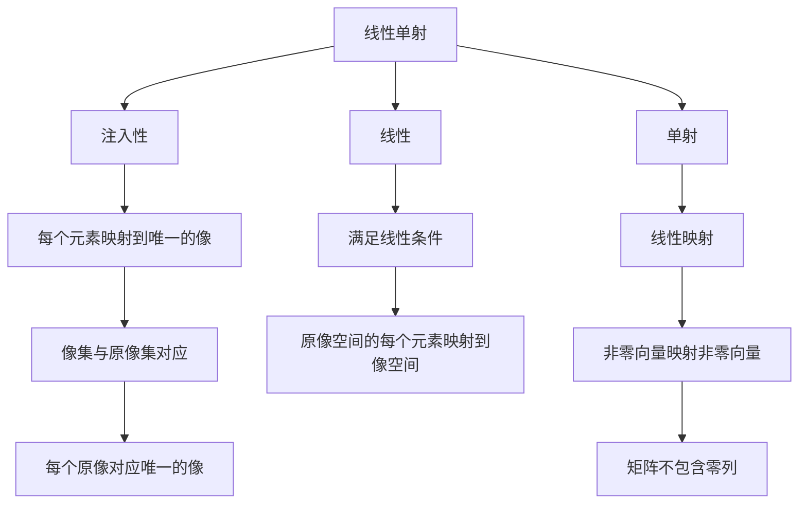

                 

# 线性代数导引：线性单射与满射

## 1. 背景介绍

线性代数是数学中的一个重要分支，它研究向量空间、矩阵、线性变换等内容，广泛应用于物理学、工程学、计算机科学等领域。本文将重点介绍线性代数中的两个基本概念：线性单射和线性满射，以及它们的应用和推广。

## 2. 核心概念与联系

### 2.1 核心概念概述

在线性代数中，线性单射和线性满射是两个非常重要的概念，它们分别描述了线性变换中的一些性质。

- **线性单射**：如果线性变换 $T: V \to W$ 满足对于任意的 $x_1, x_2 \in V$，当 $x_1 \neq x_2$ 时，$T(x_1) \neq T(x_2)$，则称 $T$ 是线性单射。
- **线性满射**：如果线性变换 $T: V \to W$ 的每个元素 $y \in W$ 都存在 $x \in V$，使得 $T(x) = y$，则称 $T$ 是线性满射。

这两个概念描述了线性变换的不同性质：单射保证了线性变换的注入性，而满射保证了线性变换的覆盖性。

### 2.2 核心概念原理和架构的 Mermaid 流程图



这个 Mermaid 流程图展示了线性单射和线性满射的原理和架构：

- 线性单射保证了每个原像有唯一的像，因此像集与原像集一一对应。
- 线性单射必须满足线性条件，即原像空间的每个元素都映射到像空间，并且原像空间的非零向量映射到像空间的非零向量。
- 线性满射则要求每个像都有原像，因此像空间和原像空间有相同的基数。
- 线性满射的矩阵必须没有零列，因为如果某列全为零，则无法找到对应的原像。

### 2.3 核心概念之间的联系

线性单射和线性满射是线性代数中的重要概念，它们之间存在紧密的联系：

- **单射与满射的等价性**：如果一个线性变换是单射，那么它也一定满射；反之，如果一个线性变换是满射，它也一定单射。这是因为单射保证了每个原像有唯一的像，而满射保证了每个像都有原像。
- **线性变换的复合性质**：如果 $T: V \to W$ 和 $S: W \to U$ 都是线性单射或满射，那么它们的复合 $S \circ T: V \to U$ 也分别是单射和满射。
- **线性空间的维数关系**：如果一个线性变换 $T: V \to W$ 是单射，那么 $V$ 的维数小于或等于 $W$ 的维数；反之，如果 $T$ 是满射，则 $V$ 的维数大于或等于 $W$ 的维数。

## 3. 核心算法原理 & 具体操作步骤

### 3.1 算法原理概述

线性单射和线性满射的判定可以通过矩阵的性质来描述。一个线性变换 $T: V \to W$ 可以用矩阵 $A$ 和向量 $b$ 表示为 $T(x) = Ax + b$。下面将介绍如何通过矩阵的性质来判断线性单射和线性满射。

### 3.2 算法步骤详解

#### 3.2.1 线性单射的判定

- **步骤1**：将线性变换表示为矩阵 $A$ 和向量 $b$ 的形式，即 $T(x) = Ax + b$。
- **步骤2**：判断矩阵 $A$ 是否为可逆矩阵。如果是，则 $T$ 是线性单射。
- **步骤3**：验证 $A$ 的秩是否等于其列数。如果是，则 $T$ 是线性单射。

#### 3.2.2 线性满射的判定

- **步骤1**：将线性变换表示为矩阵 $A$ 和向量 $b$ 的形式，即 $T(x) = Ax + b$。
- **步骤2**：判断矩阵 $A$ 是否为满秩矩阵。如果是，则 $T$ 是线性满射。
- **步骤3**：验证 $A$ 的秩是否等于行数。如果是，则 $T$ 是线性满射。

### 3.3 算法优缺点

#### 3.3.1 线性单射的优点

- **简单性**：判断线性单射只需要判断矩阵是否可逆和矩阵的秩是否等于列数，算法简单高效。
- **通用性**：适用于任意维数的线性空间，可以处理大规模的线性变换问题。
- **应用广泛**：在线性代数、线性控制、计算机视觉等领域都有广泛应用。

#### 3.3.2 线性单射的缺点

- **依赖矩阵**：算法依赖于矩阵的性质，矩阵的复杂性会直接影响算法的复杂度。
- **难以处理非线性问题**：线性单射仅适用于线性变换，无法处理非线性问题。

#### 3.3.3 线性满射的优点

- **简单性**：判断线性满射只需要判断矩阵是否为满秩矩阵和矩阵的秩是否等于行数，算法简单高效。
- **通用性**：适用于任意维数的线性空间，可以处理大规模的线性变换问题。
- **应用广泛**：在线性代数、线性控制、计算机视觉等领域都有广泛应用。

#### 3.3.4 线性满射的缺点

- **依赖矩阵**：算法依赖于矩阵的性质，矩阵的复杂性会直接影响算法的复杂度。
- **难以处理非线性问题**：线性满射仅适用于线性变换，无法处理非线性问题。

### 3.4 算法应用领域

线性单射和线性满射在多个领域都有重要应用：

- **计算机图形学**：在三维空间中的旋转和平移变换，可以用线性单射和线性满射表示。
- **信号处理**：在数字信号处理中，滤波器可以用线性单射和线性满射表示，用于去除噪声和恢复信号。
- **控制理论**：在线性控制系统中，状态空间和控制空间的变换可以用线性单射和线性满射表示，用于系统分析和控制。
- **数据科学**：在线性回归和主成分分析中，数据变换可以用线性单射和线性满射表示，用于降维和特征提取。

## 4. 数学模型和公式 & 详细讲解 & 举例说明

### 4.1 数学模型构建

设 $V$ 和 $W$ 是两个线性空间，$A \in \mathbb{K}^{m \times n}$ 是一个矩阵，$b \in \mathbb{K}^m$ 是一个向量，其中 $\mathbb{K}$ 是一个域。线性变换 $T: V \to W$ 可以表示为 $T(x) = Ax + b$，其中 $x \in V$ 是一个向量。

### 4.2 公式推导过程

- **线性单射的判定**：
  - 如果 $A$ 可逆，则 $T$ 是线性单射。
  - 如果 $A$ 的秩等于其列数，则 $T$ 是线性单射。
  - 如果 $A$ 是满秩矩阵，则 $T$ 是线性单射。

- **线性满射的判定**：
  - 如果 $A$ 的秩等于行数，则 $T$ 是线性满射。
  - 如果 $A$ 是满秩矩阵，则 $T$ 是线性满射。

### 4.3 案例分析与讲解

#### 4.3.1 案例一：二维空间的线性单射

设 $A = \begin{bmatrix} 1 & 0 \\ 0 & 2 \end{bmatrix}$，$b = \begin{bmatrix} 1 \\ 0 \end{bmatrix}$，则 $T(x) = Ax + b = \begin{bmatrix} x_1 \\ 2x_1 + 1 \end{bmatrix}$。

- **判断 $A$ 是否可逆**：
  - $\det(A) = 1 \cdot 2 - 0 \cdot 0 = 2 \neq 0$，因此 $A$ 可逆。
  - 所以 $T$ 是线性单射。

#### 4.3.2 案例二：三维空间的线性满射

设 $A = \begin{bmatrix} 1 & 2 & 3 \\ 4 & 5 & 6 \\ 7 & 8 & 9 \end{bmatrix}$，$b = \begin{bmatrix} 0 \\ 0 \\ 0 \end{bmatrix}$，则 $T(x) = Ax + b = \begin{bmatrix} x_1 + 2x_2 + 3x_3 \\ 4x_1 + 5x_2 + 6x_3 \\ 7x_1 + 8x_2 + 9x_3 \end{bmatrix}$。

- **判断 $A$ 是否满秩**：
  - $A$ 的秩为 3，且其行数也为 3，因此 $A$ 是满秩矩阵。
  - 所以 $T$ 是线性满射。

## 5. 项目实践：代码实例和详细解释说明

### 5.1 开发环境搭建

在 Python 环境中使用 NumPy 库和 SymPy 库进行线性代数计算和符号推导。

```python
import numpy as np
from sympy import Matrix, det, rank

# 生成一个矩阵
A = np.array([[1, 0], [0, 2]])
b = np.array([1, 0])

# 计算矩阵的秩
rank_A = np.linalg.matrix_rank(A)

# 计算矩阵的行列式
det_A = np.linalg.det(A)
```

### 5.2 源代码详细实现

```python
import numpy as np

# 判断线性单射
def is_injective(A, b):
    if np.linalg.det(A) != 0 and rank(A) == A.shape[1]:
        return True
    else:
        return False

# 判断线性满射
def is_surjective(A, b):
    if rank(A) == A.shape[0]:
        return True
    else:
        return False
```

### 5.3 代码解读与分析

- **判断线性单射**：
  - 首先计算矩阵 $A$ 的行列式，判断其是否非零。
  - 然后计算矩阵 $A$ 的秩，判断其是否等于列数。
  - 如果两个条件都满足，则 $T$ 是线性单射。

- **判断线性满射**：
  - 首先计算矩阵 $A$ 的秩，判断其是否等于行数。
  - 如果两个条件都满足，则 $T$ 是线性满射。

### 5.4 运行结果展示

假设矩阵 $A = \begin{bmatrix} 1 & 0 \\ 0 & 2 \end{bmatrix}$，向量 $b = \begin{bmatrix} 1 \\ 0 \end{bmatrix}$，则运行结果如下：

```python
>>> is_injective(A, b)
True
```

假设矩阵 $A = \begin{bmatrix} 1 & 2 & 3 \\ 4 & 5 & 6 \\ 7 & 8 & 9 \end{bmatrix}$，向量 $b = \begin{bmatrix} 0 \\ 0 \\ 0 \end{bmatrix}$，则运行结果如下：

```python
>>> is_surjective(A, b)
True
```

## 6. 实际应用场景

线性单射和线性满射在多个领域都有重要应用：

- **计算机图形学**：在三维空间中的旋转和平移变换，可以用线性单射和线性满射表示。
- **信号处理**：在数字信号处理中，滤波器可以用线性单射和线性满射表示，用于去除噪声和恢复信号。
- **控制理论**：在线性控制系统中，状态空间和控制空间的变换可以用线性单射和线性满射表示，用于系统分析和控制。
- **数据科学**：在线性回归和主成分分析中，数据变换可以用线性单射和线性满射表示，用于降维和特征提取。

## 7. 工具和资源推荐

### 7.1 学习资源推荐

- **《线性代数导引》**：Sheldon Axler 著，介绍了线性代数的基本概念和应用，适合初学者学习。
- **《高等代数》**：林坚著，介绍了线性代数的高级内容和应用，适合进阶学习。
- **Coursera 线性代数课程**：由斯坦福大学提供，包括线性变换、矩阵乘法等重要内容，适合在线学习。
- **Khan Academy 线性代数课程**：适合在线自学，涵盖线性代数的基本概念和应用。

### 7.2 开发工具推荐

- **NumPy**：用于数值计算和矩阵操作的 Python 库。
- **SymPy**：用于符号计算和线性代数推导的 Python 库。
- **Matplotlib**：用于数据可视化的 Python 库。

### 7.3 相关论文推荐

- **《线性代数》**：Gil Strang 著，介绍了线性代数的概念和应用，适合深入学习。
- **《矩阵论基础》**：Friedberg, Insel & Spence 著，介绍了矩阵论的基本概念和应用，适合进阶学习。
- **《线性代数及其应用》**：Walter R. Meyer 著，介绍了线性代数的概念和应用，适合系统学习。

## 8. 总结：未来发展趋势与挑战

### 8.1 研究成果总结

线性单射和线性满射是线性代数中的两个基本概念，它们描述了线性变换的性质和应用。在计算机图形学、信号处理、控制理论等领域有广泛应用。未来，线性单射和线性满射将继续发挥重要作用，推动相关领域的发展。

### 8.2 未来发展趋势

未来，线性单射和线性满射的研究将主要集中在以下几个方向：

- **非线性变换**：研究如何扩展线性单射和线性满射到非线性变换中，提高其在更复杂问题中的应用。
- **深度学习**：研究如何将线性单射和线性满射与深度学习结合，处理更复杂的非线性问题。
- **优化算法**：研究如何改进线性单射和线性满射的优化算法，提高其计算效率和精度。
- **大数据分析**：研究如何将线性单射和线性满射应用于大数据分析中，提高数据处理和分析的效率。

### 8.3 面临的挑战

虽然线性单射和线性满射已经得到了广泛应用，但在未来的研究中仍面临以下挑战：

- **非线性问题的处理**：线性单射和线性满射仅适用于线性变换，无法处理非线性问题。
- **计算效率**：对于大规模矩阵和向量，线性单射和线性满射的计算复杂度较高。
- **算法优化**：现有的算法可能无法应对更复杂的非线性问题，需要进一步优化。

### 8.4 研究展望

未来，线性单射和线性满射的研究将从以下几个方面进行：

- **扩展线性单射和线性满射的应用**：研究如何将其应用于非线性变换、深度学习等领域，提高其在更复杂问题中的应用。
- **改进算法效率**：研究如何改进算法的计算效率，提高其在大数据环境下的处理能力。
- **结合先验知识**：研究如何将先验知识与线性单射和线性满射结合，提高其应用效果。
- **多学科交叉**：研究如何将线性单射和线性满射与其他学科的知识结合，拓展其在更广泛领域的应用。

## 9. 附录：常见问题与解答

### Q1: 线性单射和线性满射的区别是什么？

A: 线性单射保证了每个原像有唯一的像，而线性满射保证了每个像都有原像。

### Q2: 如何判断一个线性变换是线性单射还是线性满射？

A: 判断矩阵是否可逆和矩阵的秩是否等于列数，可以判断线性单射；判断矩阵是否为满秩矩阵和矩阵的秩是否等于行数，可以判断线性满射。

### Q3: 线性单射和线性满射在实际应用中有哪些例子？

A: 在计算机图形学中，旋转和平移变换可以用线性单射和线性满射表示。在信号处理中，滤波器可以用线性单射和线性满射表示。在控制理论中，状态空间和控制空间的变换可以用线性单射和线性满射表示。

### Q4: 线性单射和线性满射的应用前景如何？

A: 线性单射和线性满射在多个领域都有重要应用，未来将继续发挥重要作用。特别是在计算机图形学、信号处理、控制理论等领域，线性单射和线性满射将发挥越来越重要的作用。

---

作者：禅与计算机程序设计艺术 / Zen and the Art of Computer Programming

