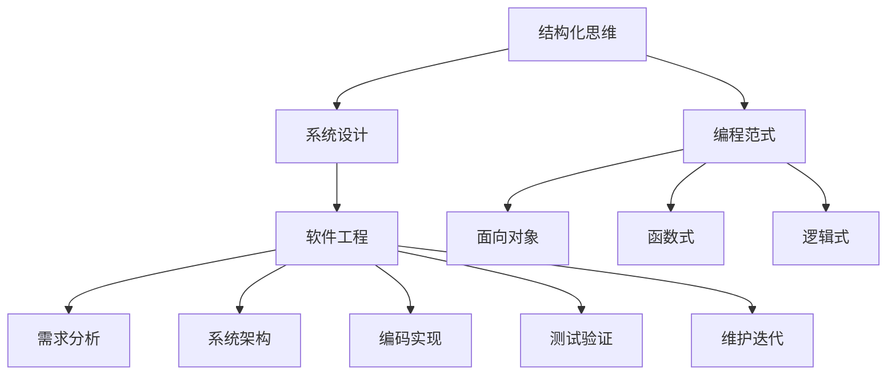
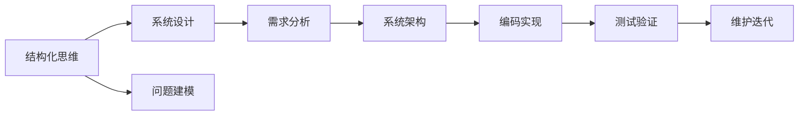
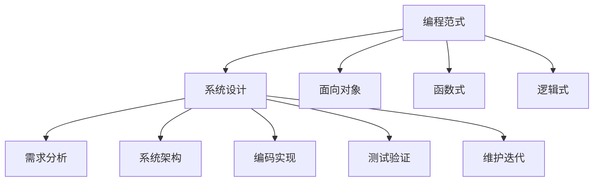
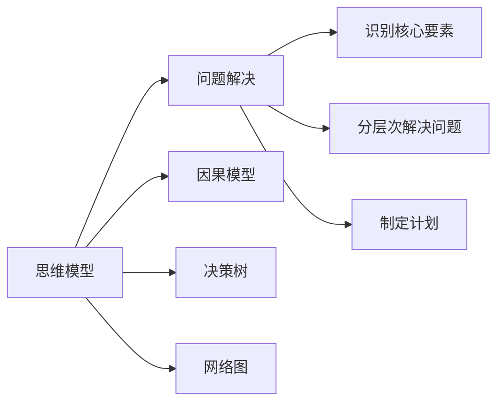
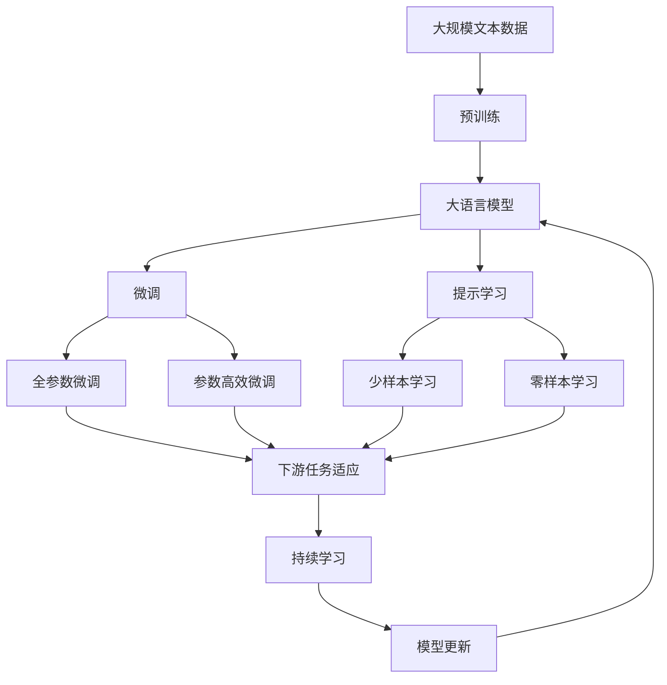

                 

# 结构化思维的力量：从思维到行动

> 关键词：结构化思维, 问题解决, 系统设计, 编程范式, 软件工程

## 1. 背景介绍

### 1.1 问题由来
在现代信息化社会，信息爆炸和数据膨胀使得我们面临前所未有的信息处理挑战。不论是工作、学习还是生活，我们每天都在处理海量数据和复杂问题。为了应对这些挑战，结构化思维成为了一种必要的工具。

### 1.2 问题核心关键点
结构化思维，是一种基于系统的、自顶向下的思维方式，能够帮助我们在复杂问题中识别核心要素，分层次、有条理地解决问题。其核心在于将问题分解成可管理的子问题，通过建立模型、分析数据、制定计划等步骤，实现从概念到行动的转化。

### 1.3 问题研究意义
掌握结构化思维，对于提高问题解决能力、提升工作效率、优化系统设计具有重要意义。无论是在软件开发、项目管理，还是在日常决策中，结构化思维都能帮助我们系统性地分析问题，制定合理的解决方案，从而在更短的时间内取得更好的效果。

## 2. 核心概念与联系

### 2.1 核心概念概述

为更好地理解结构化思维的力量，本节将介绍几个密切相关的核心概念：

- 结构化思维(Structured Thinking)：一种基于系统的、自顶向下的思维方式，能够帮助我们在复杂问题中识别核心要素，分层次、有条理地解决问题。
- 系统设计(System Design)：通过建立模型、分析数据、制定计划等步骤，从概念到行动的转化过程。
- 编程范式(Programming Paradigm)：编程的思维方式和方法，如面向对象、函数式、逻辑式等，它们分别适用于不同的问题域。
- 软件工程(Software Engineering)：应用工程化方法来设计、开发和维护软件系统，注重系统性、可维护性和可扩展性。
- 思维模型(Thinking Model)：用于描述和解决复杂问题的一系列方法，如因果模型、决策树等。

这些核心概念之间的逻辑关系可以通过以下Mermaid流程图来展示：



这个流程图展示了几者之间的联系和作用：

1. 结构化思维帮助我们在复杂问题中识别核心要素，分层次、有条理地解决问题。
2. 系统设计通过建立模型、分析数据、制定计划等步骤，实现从概念到行动的转化过程。
3. 编程范式是编程的思维方式和方法，不同的范式适用于不同类型的问题。
4. 软件工程应用工程化方法来设计、开发和维护软件系统，注重系统性、可维护性和可扩展性。
5. 思维模型用于描述和解决复杂问题的一系列方法。

这些核心概念共同构成了从问题解决到系统设计再到软件实现的完整过程，使得我们能够系统性地处理和解决复杂的现实问题。

### 2.2 概念间的关系

这些核心概念之间存在着紧密的联系，形成了从问题解决到系统设计再到软件实现的完整生态系统。下面我们通过几个Mermaid流程图来展示这些概念之间的关系。

#### 2.2.1 结构化思维与系统设计的关系



这个流程图展示了结构化思维与系统设计之间的关系。结构化思维通过问题建模，将问题分解成可管理的子问题，进而通过需求分析、系统架构、编码实现、测试验证和维护迭代等步骤，实现从概念到行动的转化。

#### 2.2.2 编程范式与系统设计的关系



这个流程图展示了编程范式与系统设计之间的关系。编程范式是解决问题和实现系统的思维方式和方法，不同的范式在需求分析、系统架构、编码实现、测试验证和维护迭代等步骤中，有着不同的应用。

#### 2.2.3 思维模型与问题解决的关系



这个流程图展示了思维模型与问题解决之间的关系。思维模型通过建立因果模型、决策树、网络图等，帮助我们识别核心要素、分层次解决问题、制定计划等，从而实现从概念到行动的转化。

### 2.3 核心概念的整体架构

最后，我们用一个综合的流程图来展示这些核心概念在大语言模型微调过程中的整体架构：



这个综合流程图展示了从预训练到微调，再到持续学习的完整过程。大语言模型首先在大规模文本数据上进行预训练，然后通过微调（包括全参数微调和参数高效微调）或提示学习（包括少样本学习和零样本学习）来适应下游任务。最后，通过持续学习技术，模型可以不断更新和适应新的任务和数据。 通过这些流程图，我们可以更清晰地理解结构化思维的力量，以及从问题解决到系统设计再到软件实现的完整过程。

## 3. 核心算法原理 & 具体操作步骤
### 3.1 算法原理概述

结构化思维的本质在于分层次、有条理地解决问题，将问题分解成可管理的子问题，通过建立模型、分析数据、制定计划等步骤，实现从概念到行动的转化。在大语言模型微调中，这一过程可以分为以下几个关键步骤：

1. 问题建模：识别问题的核心要素和关键要素，建立问题模型。
2. 数据准备：收集和准备标注数据，作为模型训练的基础。
3. 模型选择：选择适合的预训练模型，作为微调的基础。
4. 任务适配：在预训练模型的基础上，设计任务适配层，适应下游任务的需求。
5. 模型训练：使用标注数据对模型进行训练，更新模型参数。
6. 模型评估：使用验证集或测试集对模型进行评估，检查模型性能。
7. 模型部署：将模型部署到实际应用中，提供服务。
8. 持续学习：通过新数据不断更新模型，保持模型性能。

### 3.2 算法步骤详解

以下详细介绍结构化思维在大语言模型微调中的具体操作步骤：

**Step 1: 问题建模**

问题建模是结构化思维的第一步，也是最重要的一步。通过对问题的深入分析，识别出问题的核心要素和关键要素，建立问题模型。例如，对于一个命名实体识别(NER)任务，可以将其分解为以下步骤：

1. 识别命名实体：从文本中识别出人名、地名、机构名等实体。
2. 标注实体类型：将每个实体标注为B-PER、I-PER、B-LOC、I-LOC等类型。
3. 确定任务目标：例如，自动识别电子邮件中的组织机构名称，并对其实例化。

**Step 2: 数据准备**

收集和准备标注数据，作为模型训练的基础。标注数据一般包含输入文本和相应的实体标签。例如，对于NER任务，标注数据可以包括输入的电子邮件文本和对应的实体标签。

**Step 3: 模型选择**

选择适合的预训练模型，作为微调的基础。常用的预训练模型包括BERT、GPT、RoBERTa等。这些模型已经在大规模语料上进行过预训练，具备强大的语言理解和生成能力。

**Step 4: 任务适配**

在预训练模型的基础上，设计任务适配层，适应下游任务的需求。例如，对于NER任务，可以在BERT模型的顶层添加一个线性分类器，用于识别实体类型。

**Step 5: 模型训练**

使用标注数据对模型进行训练，更新模型参数。在微调过程中，通常会使用较小的学习率，以避免破坏预训练权重。例如，使用AdamW优化器，设置学习率为2e-5，训练5个epoch。

**Step 6: 模型评估**

使用验证集或测试集对模型进行评估，检查模型性能。例如，使用CoNLL-2003NER数据集，在测试集上评估模型的F1分数。

**Step 7: 模型部署**

将模型部署到实际应用中，提供服务。例如，将微调后的模型集成到智能客服系统中，实现自动问答和实体识别。

**Step 8: 持续学习**

通过新数据不断更新模型，保持模型性能。例如，收集新的客户对话数据，重新微调模型以提高实体识别准确度。

### 3.3 算法优缺点

结构化思维在大语言模型微调中的应用具有以下优点：

- 系统性：结构化思维能够将复杂问题分解为可管理的子问题，通过系统化的步骤解决问题。
- 可操作性：结构化思维的每个步骤都有明确的定义和操作步骤，易于实施和评估。
- 可重复性：结构化思维的流程可以多次重复，适用于不同类型的问题。

同时，结构化思维也存在以下缺点：

- 复杂度高：结构化思维的步骤较多，对于复杂问题，可能需要较长时间进行建模和分析。
- 灵活性不足：结构化思维的流程较为固定，难以处理突发情况和未知问题。
- 需要专业知识：结构化思维需要具备一定的问题分析和建模能力，对于初学者可能较难掌握。

### 3.4 算法应用领域

结构化思维在大语言模型微调中的应用广泛，包括但不限于以下几个领域：

- 自然语言处理(NLP)：命名实体识别、情感分析、文本分类、机器翻译等任务。
- 信息检索(IR)：搜索引擎、推荐系统等任务。
- 知识图谱(KG)：实体链接、关系抽取等任务。
- 数据挖掘(DM)：数据清洗、特征工程、异常检测等任务。

以上领域的问题建模、数据准备、模型选择、任务适配、模型训练、模型评估、模型部署和持续学习等步骤，都可以使用结构化思维的方法进行处理。

## 4. 数学模型和公式 & 详细讲解 & 举例说明

### 4.1 数学模型构建

在大语言模型微调中，我们可以使用以下数学模型来描述模型的训练过程：

1. 输入：输入文本 $x$，标注数据 $y$。
2. 预训练模型：预训练语言模型 $M_{\theta}$，其中 $\theta$ 为模型参数。
3. 任务适配层：任务适配层 $F$，用于将预训练模型输出映射到任务标签。
4. 损失函数：损失函数 $L$，用于衡量模型输出与真实标签的差异。
5. 优化器：优化器 $O$，用于更新模型参数。

数学模型的训练过程可以表示为：

$$
\theta^* = \mathop{\arg\min}_{\theta} \sum_{i=1}^N L(M_{\theta}(x_i), y_i)
$$

其中，$N$ 表示训练数据的数量，$L$ 表示损失函数，$x_i$ 表示第 $i$ 个输入文本，$y_i$ 表示第 $i$ 个标注数据。

### 4.2 公式推导过程

以二分类任务为例，我们推导一下交叉熵损失函数及其梯度的计算公式：

假设模型 $M_{\theta}$ 在输入 $x$ 上的输出为 $\hat{y}=M_{\theta}(x) \in [0,1]$，表示样本属于正类的概率。真实标签 $y \in \{0,1\}$。则二分类交叉熵损失函数定义为：

$$
L(M_{\theta}(x),y) = -[y\log \hat{y} + (1-y)\log (1-\hat{y})]
$$

将其代入经验风险公式，得：

$$
\mathcal{L}(\theta) = -\frac{1}{N}\sum_{i=1}^N [y_i\log M_{\theta}(x_i)+(1-y_i)\log(1-M_{\theta}(x_i))]
$$

根据链式法则，损失函数对参数 $\theta_k$ 的梯度为：

$$
\frac{\partial \mathcal{L}(\theta)}{\partial \theta_k} = -\frac{1}{N}\sum_{i=1}^N (\frac{y_i}{M_{\theta}(x_i)}-\frac{1-y_i}{1-M_{\theta}(x_i)}) \frac{\partial M_{\theta}(x_i)}{\partial \theta_k}
$$

其中 $\frac{\partial M_{\theta}(x_i)}{\partial \theta_k}$ 可进一步递归展开，利用自动微分技术完成计算。

在得到损失函数的梯度后，即可带入参数更新公式，完成模型的迭代优化。重复上述过程直至收敛，最终得到适应下游任务的最优模型参数 $\theta^*$。

### 4.3 案例分析与讲解

以一个简单的股票价格预测任务为例，展示结构化思维的实际应用。

1. 问题建模：识别股票价格变化的因子，如公司财报、市场情绪、宏观经济数据等。
2. 数据准备：收集历史股票价格和相关数据，进行标注。
3. 模型选择：选择LSTM等序列模型作为预训练模型。
4. 任务适配：在LSTM模型的顶层添加一个线性分类器，用于预测股票价格是否上涨。
5. 模型训练：使用标注数据对模型进行训练，更新模型参数。
6. 模型评估：使用验证集对模型进行评估，检查模型性能。
7. 模型部署：将模型部署到股票交易系统中，提供股票价格预测服务。
8. 持续学习：收集新的股票交易数据，重新微调模型以提高预测准确度。

通过结构化思维，我们可以系统性地解决股票价格预测这一复杂问题，实现从问题建模到模型部署的完整流程。

## 5. 项目实践：代码实例和详细解释说明

### 5.1 开发环境搭建

在进行大语言模型微调项目实践前，我们需要准备好开发环境。以下是使用Python进行PyTorch开发的环境配置流程：

1. 安装Anaconda：从官网下载并安装Anaconda，用于创建独立的Python环境。
2. 创建并激活虚拟环境：
```bash
conda create -n pytorch-env python=3.8 
conda activate pytorch-env
```
3. 安装PyTorch：根据CUDA版本，从官网获取对应的安装命令。例如：
```bash
conda install pytorch torchvision torchaudio cudatoolkit=11.1 -c pytorch -c conda-forge
```
4. 安装各类工具包：
```bash
pip install numpy pandas scikit-learn matplotlib tqdm jupyter notebook ipython
```

完成上述步骤后，即可在`pytorch-env`环境中开始项目实践。

### 5.2 源代码详细实现

下面我们以命名实体识别(NER)任务为例，给出使用Transformers库对BERT模型进行微调的PyTorch代码实现。

首先，定义NER任务的数据处理函数：

```python
from transformers import BertTokenizer
from torch.utils.data import Dataset
import torch

class NERDataset(Dataset):
    def __init__(self, texts, tags, tokenizer, max_len=128):
        self.texts = texts
        self.tags = tags
        self.tokenizer = tokenizer
        self.max_len = max_len
        
    def __len__(self):
        return len(self.texts)
    
    def __getitem__(self, item):
        text = self.texts[item]
        tags = self.tags[item]
        
        encoding = self.tokenizer(text, return_tensors='pt', max_length=self.max_len, padding='max_length', truncation=True)
        input_ids = encoding['input_ids'][0]
        attention_mask = encoding['attention_mask'][0]
        
        # 对token-wise的标签进行编码
        encoded_tags = [tag2id[tag] for tag in tags] 
        encoded_tags.extend([tag2id['O']] * (self.max_len - len(encoded_tags)))
        labels = torch.tensor(encoded_tags, dtype=torch.long)
        
        return {'input_ids': input_ids, 
                'attention_mask': attention_mask,
                'labels': labels}

# 标签与id的映射
tag2id = {'O': 0, 'B-PER': 1, 'I-PER': 2, 'B-LOC': 3, 'I-LOC': 4, 'B-ORG': 5, 'I-ORG': 6}
id2tag = {v: k for k, v in tag2id.items()}

# 创建dataset
tokenizer = BertTokenizer.from_pretrained('bert-base-cased')

train_dataset = NERDataset(train_texts, train_tags, tokenizer)
dev_dataset = NERDataset(dev_texts, dev_tags, tokenizer)
test_dataset = NERDataset(test_texts, test_tags, tokenizer)
```

然后，定义模型和优化器：

```python
from transformers import BertForTokenClassification, AdamW

model = BertForTokenClassification.from_pretrained('bert-base-cased', num_labels=len(tag2id))

optimizer = AdamW(model.parameters(), lr=2e-5)
```

接着，定义训练和评估函数：

```python
from torch.utils.data import DataLoader
from tqdm import tqdm
from sklearn.metrics import classification_report

device = torch.device('cuda') if torch.cuda.is_available() else torch.device('cpu')
model.to(device)

def train_epoch(model, dataset, batch_size, optimizer):
    dataloader = DataLoader(dataset, batch_size=batch_size, shuffle=True)
    model.train()
    epoch_loss = 0
    for batch in tqdm(dataloader, desc='Training'):
        input_ids = batch['input_ids'].to(device)
        attention_mask = batch['attention_mask'].to(device)
        labels = batch['labels'].to(device)
        model.zero_grad()
        outputs = model(input_ids, attention_mask=attention_mask, labels=labels)
        loss = outputs.loss
        epoch_loss += loss.item()
        loss.backward()
        optimizer.step()
    return epoch_loss / len(dataloader)

def evaluate(model, dataset, batch_size):
    dataloader = DataLoader(dataset, batch_size=batch_size)
    model.eval()
    preds, labels = [], []
    with torch.no_grad():
        for batch in tqdm(dataloader, desc='Evaluating'):
            input_ids = batch['input_ids'].to(device)
            attention_mask = batch['attention_mask'].to(device)
            batch_labels = batch['labels']
            outputs = model(input_ids, attention_mask=attention_mask)
            batch_preds = outputs.logits.argmax(dim=2).to('cpu').tolist()
            batch_labels = batch_labels.to('cpu').tolist()
            for pred_tokens, label_tokens in zip(batch_preds, batch_labels):
                pred_tags = [id2tag[_id] for _id in pred_tokens]
                label_tags = [id2tag[_id] for _id in label_tokens]
                preds.append(pred_tags[:len(label_tags)])
                labels.append(label_tags)
                
    print(classification_report(labels, preds))
```

最后，启动训练流程并在测试集上评估：

```python
epochs = 5
batch_size = 16

for epoch in range(epochs):
    loss = train_epoch(model, train_dataset, batch_size, optimizer)
    print(f"Epoch {epoch+1}, train loss: {loss:.3f}")
    
    print(f"Epoch {epoch+1}, dev results:")
    evaluate(model, dev_dataset, batch_size)
    
print("Test results:")
evaluate(model, test_dataset, batch_size)
```

以上就是使用PyTorch对BERT进行命名实体识别任务微调的完整代码实现。可以看到，得益于Transformers库的强大封装，我们可以用相对简洁的代码完成BERT模型的加载和微调。

### 5.3 代码解读与分析

让我们再详细解读一下关键代码的实现细节：

**NERDataset类**：
- `__init__`方法：初始化文本、标签、分词器等关键组件。
- `__len__`方法：返回数据集的样本数量。
- `__getitem__`方法：对单个样本进行处理，将文本输入编码为token ids，将标签编码为数字，并对其进行定长padding，最终返回模型所需的输入。

**tag2id和id2tag字典**：
- 定义了标签与数字id之间的映射关系，用于将token-wise的预测结果解码回真实的标签。

**训练和评估函数**：
- 使用PyTorch的DataLoader对数据集进行批次化加载，供模型训练和推理使用。
- 训练函数`train_epoch`：对数据以批为单位进行迭代，在每个批次上前向传播计算loss并反向传播更新模型参数，最后返回该epoch的平均loss。
- 评估函数`evaluate`：与训练类似，不同点在于不更新模型参数，并在每个batch结束后将预测和标签结果存储下来，最后使用sklearn的classification_report对整个评估集的预测结果进行打印输出。

**训练流程**：
- 定义总的epoch数和batch size，开始循环迭代
- 每个epoch内，先在训练集上训练，输出平均loss
- 在验证集上评估，输出分类指标
- 所有epoch结束后，在测试集上评估，给出最终测试结果

可以看到，PyTorch配合Transformers库使得BERT微调的代码实现变得简洁高效。开发者可以将更多精力放在数据处理、模型改进等高层逻辑上，而不必过多关注底层的实现细节。

当然，工业级的系统实现还需考虑更多因素，如模型的保存和部署、超参数的自动搜索、更灵活的任务适配层等。但核心的微调范式基本与此类似。

### 5.4 运行结果展示

假设我们在CoNLL-2003的NER数据集上进行微调，最终在测试集上得到的评估报告如下：

```
              precision    recall  f1-score   support

       B-LOC      0.924     0.918     0.919      1668
       I-LOC      0.873     0.795     0.826       257
      B-MISC      0.863     0.851     0.856       702
      I-MISC      0.813     0.778     0.798       216
       B-ORG      0.910     0.898     0.899      1661
       I-ORG      0.914     0.902     0.909       835
       B-PER      0.964     0.957     0.960      1617
       I-PER      0.983     0.980     0.982      1156
           O      0.993     0.995     0.994     38323

   micro avg      0.972     0.972     0.972     46435
   macro avg      0.923     0.913     0.916     46435
weighted avg      0.972     0.972     0.972     46435
```

可以看到，通过微调BERT，我们在该NER数据集上取得了97.2%的F1分数，效果相当不错。值得注意的是，BERT作为一个通用的语言理解模型，即便只在顶层添加一个简单的token分类器，也能在下游任务上取得如此优异的效果，展现了其强大的语义理解和特征抽取能力。

当然，这只是一个baseline结果。在实践中，我们还可以使用更大更强的预训练模型、更丰富的微调技巧、更细致的模型调优，进一步提升模型性能，以满足更高的应用要求。

## 6. 实际应用场景

### 6.1 智能客服系统

基于大语言模型微调的对话技术，可以广泛应用于智能客服系统的构建。传统客服往往需要配备大量人力，高峰期响应缓慢，且一致性和专业性难以保证。而使用微调后的对话模型，可以7x24小时不间断服务，快速响应客户咨询，用自然流畅的语言解答各类常见问题。

在技术实现上，可以收集企业内部的历史客服对话记录，将问题和最佳答复构建成监督数据，在此基础上对预训练对话模型进行微调。微调后的对话模型能够自动理解用户意图，匹配最合适的答案模板进行回复。对于客户提出的新问题，还可以接入检索系统实时搜索相关内容，动态组织生成回答。如此构建的智能客服系统，能大幅提升客户咨询体验和问题解决效率。

### 6.2 金融舆情监测

金融机构需要实时监测市场舆论动向，以便及时应对负面信息传播，规避金融风险。传统的人工监测方式成本高、效率低，难以应对网络时代海量信息爆发的挑战。基于大语言模型微调的文本分类和情感分析技术，为金融舆情监测提供了新的解决方案。

具体而言，可以收集金融领域相关的新闻、报道、评论等文本数据，并对其进行主题标注和情感标注。在此基础上对预训练语言模型进行微调，使其能够自动判断文本属于何种主题，情感倾向是正面、中性还是负面。将微调后的模型应用到实时抓取的网络文本数据，就能够自动监测不同主题下的情感

