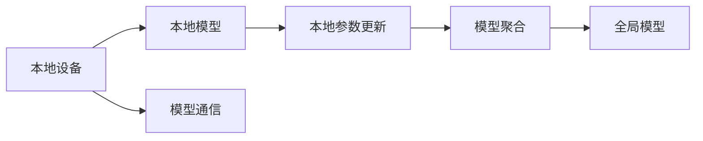

                 

# 联邦学习在医疗领域的应用案例

在医疗领域，数据隐私保护和数据安全至关重要。联邦学习（Federated Learning, FL）作为一种新兴的分布式学习范式，允许模型在不共享数据的情况下，通过本地设备上的数据进行模型训练和参数更新。本文将详细介绍联邦学习在医疗领域的应用案例，分析其优势和挑战，并展望未来的发展方向。

## 1. 背景介绍

随着大数据和人工智能技术的飞速发展，医疗行业正面临着前所未有的变革机遇。通过数据驱动的医疗智能系统，可以有效提升疾病诊断、治疗方案选择、个性化医疗等方面的效果，帮助患者获得更好的医疗服务。然而，医疗数据高度敏感且复杂，传统集中式数据处理模式存在严重的隐私和数据安全问题。为此，联邦学习应运而生，为数据隐私保护提供了新思路。

## 2. 核心概念与联系

### 2.1 核心概念概述

联邦学习是一种分布式机器学习技术，允许模型在本地设备上对数据进行训练，并通过聚合各设备的模型参数更新，不断迭代提升模型的泛化能力。与传统的集中式训练模式相比，联邦学习不需要将数据传输到中央服务器，从而在保护数据隐私的同时，保持模型的高效学习。

- **数据隐私**：各本地设备上的数据仅供本地设备使用，不与其他设备共享，从而保护用户隐私。
- **模型更新**：模型参数在本地设备上进行更新，并通过聚合操作，不断优化全局模型性能。
- **通信效率**：仅需传输模型参数和更新信息，减少了数据传输量，提升了通信效率。

### 2.2 核心概念的联系

联邦学习主要涉及以下核心概念和技术：

1. **分布式系统**：联邦学习基于分布式系统，每个本地设备（如医院、诊所）都可以独立进行模型训练，并与其他设备通信。
2. **模型聚合**：联邦学习通过模型参数的聚合操作，将多个本地模型的更新信息合并成一个全局模型更新，实现模型的不断优化。
3. **模型保护**：联邦学习通过加密技术和差分隐私方法，保护本地模型参数不被非法获取。

这些概念和技术共同构成了联邦学习的完整框架，使其能够在不泄露数据隐私的前提下，有效提升模型的性能。

### 2.3 联邦学习架构图

以下是一个简化的联邦学习架构图：



在这个架构中，本地设备负责训练本地模型，并更新模型参数。然后，各本地模型的更新信息通过模型通信传递到模型聚合中心，进行全局模型更新。

## 3. 核心算法原理 & 具体操作步骤

### 3.1 算法原理概述

联邦学习的基本原理是通过分布式计算，在不共享数据的情况下，对多个本地设备上的数据进行模型训练。其核心在于模型参数的聚合操作，通过迭代更新和通信，不断优化全局模型。

- **模型初始化**：在每个本地设备上初始化一个相同的全局模型参数。
- **本地模型训练**：在本地设备上，使用本地数据进行模型训练，并更新模型参数。
- **参数聚合**：将各本地设备的模型参数通过聚合操作，计算出一个全局模型参数更新。
- **全局模型更新**：将全局模型参数更新应用到全局模型中，进行模型参数的迭代更新。

### 3.2 算法步骤详解

联邦学习的具体实现步骤如下：

1. **数据划分**：将数据集划分为本地数据和中央数据，每个本地设备独立持有本地数据。
2. **模型初始化**：在每个本地设备上初始化一个相同的全局模型参数。
3. **本地模型训练**：在本地设备上，使用本地数据进行模型训练，并更新模型参数。
4. **参数聚合**：通过模型通信协议，各本地设备的模型参数传递到中央服务器，进行聚合操作。
5. **全局模型更新**：将全局模型参数更新应用到全局模型中，进行模型参数的迭代更新。
6. **重复执行**：重复执行步骤3-5，直到模型收敛或达到预设轮数。

### 3.3 算法优缺点

联邦学习具有以下优点：

- **数据隐私保护**：模型训练在本地设备上进行，不共享原始数据，保护用户隐私。
- **通信效率高**：仅需传输模型参数和更新信息，减少了数据传输量。
- **可扩展性强**：联邦学习适用于大规模分布式系统，可以高效处理海量数据。

同时，联邦学习也存在以下缺点：

- **计算开销大**：每个本地设备需要独立进行模型训练，计算开销较大。
- **通信延迟高**：模型通信过程中可能存在网络延迟，影响训练效率。
- **模型收敛慢**：由于各本地模型参数不一致，模型更新过程相对较慢。

### 3.4 算法应用领域

联邦学习已经在多个领域得到了广泛应用，以下是几个典型的应用场景：

1. **医疗影像分析**：通过联邦学习，医生可以在不共享影像数据的情况下，共同训练医疗影像分类模型，提高疾病诊断的准确性。
2. **个性化医疗**：联邦学习可以结合多个医院的医疗数据，训练个性化的治疗方案推荐模型，为患者提供精准的治疗建议。
3. **药物研发**：联邦学习可以联合多个研究机构的数据，训练药物筛选模型，加速新药的发现和开发。
4. **电子病历管理**：联邦学习可以整合多个医院的电子病历数据，训练疾病预测和风险评估模型，提升医院的管理水平。

## 4. 数学模型和公式 & 详细讲解

### 4.1 数学模型构建

在联邦学习中，我们通常使用参数向量 $\theta$ 表示全局模型。在本地设备上，我们使用本地数据集 $D_i$ 进行模型训练，更新本地模型参数 $\theta_i$。

假设本地数据集 $D_i$ 包括 $N_i$ 个样本 $(x_i, y_i)$，则本地模型训练的目标为：

$$
\min_{\theta_i} \frac{1}{N_i} \sum_{j=1}^{N_i} L(\theta_i, x_i, y_i)
$$

其中 $L(\theta_i, x_i, y_i)$ 为本地样本的损失函数。

### 4.2 公式推导过程

假设在每一轮迭代中，本地设备 $i$ 更新模型参数 $\theta_i$，然后通过模型通信将 $\theta_i$ 传递到中央服务器，进行模型参数的聚合操作。假设中央服务器使用权重 $\alpha_i$ 对本地模型参数进行聚合，则全局模型参数 $\theta$ 的更新为：

$$
\theta \leftarrow \theta - \alpha \sum_{i=1}^m \nabla_{\theta} L(\theta_i, D_i)
$$

其中 $\alpha$ 为聚合系数，$m$ 为参与训练的本地设备数量。

### 4.3 案例分析与讲解

以一个简单的医疗影像分类任务为例，假设我们有两个本地设备，分别持有10个和20个样本。在每一轮迭代中，本地设备分别使用自己的样本进行模型训练，并更新模型参数。然后，中央服务器将两个本地模型的更新信息进行聚合，得到全局模型参数的更新。

## 5. 项目实践：代码实例和详细解释说明

### 5.1 开发环境搭建

为了实现联邦学习模型，我们需要安装 PyTorch 和 TensorFlow 等深度学习框架，以及相关的联邦学习库，如 Federated-Average 等。

首先，安装 PyTorch：

```bash
pip install torch torchvision torchaudio
```

然后，安装 TensorFlow：

```bash
pip install tensorflow
```

接着，安装 Federated-Average：

```bash
pip install federated-average
```

最后，配置本地设备的网络环境，确保数据传输畅通。

### 5.2 源代码详细实现

以下是一个简单的联邦学习医疗影像分类模型的实现：

```python
import torch
import federated_learning as fl

# 本地数据集
local_data_1 = ...
local_data_2 = ...

# 全局模型
global_model = ...

# 本地模型
local_model_1 = ...
local_model_2 = ...

# 本地模型训练函数
def local_train(local_model, local_data):
    # 本地模型训练过程
    return local_model

# 本地模型更新函数
def local_update(local_model, local_data):
    # 本地模型更新过程
    return local_model

# 全局模型更新函数
def global_update(global_model, local_models):
    # 全局模型更新过程
    return global_model

# 模型初始化
def init_global_model():
    # 初始化全局模型
    return global_model

# 模型聚合函数
def aggregate(local_models):
    # 聚合本地模型参数
    return ...

# 模型通信函数
def communicate(local_models):
    # 模型通信过程
    return ...

# 联邦学习训练函数
def federated_train(local_data, global_model, local_model_train, local_model_update, global_model_update, init_global_model, aggregate, communicate):
    # 联邦学习训练过程
    return ...

# 训练函数
def train():
    # 本地数据集划分
    local_data = [local_data_1, local_data_2]

    # 初始化全局模型
    global_model = init_global_model()

    # 训练过程
    federated_train(local_data, global_model, local_model_train, local_model_update, global_model_update, init_global_model, aggregate, communicate)
```

### 5.3 代码解读与分析

在上述代码中，我们定义了本地数据集、全局模型、本地模型和相关训练函数。其中，`local_model_train` 和 `local_model_update` 分别用于本地模型的训练和更新，`global_model_update` 用于全局模型的更新，`init_global_model` 用于初始化全局模型，`aggregate` 用于模型聚合，`communicate` 用于模型通信。最后，`federated_train` 函数实现了联邦学习的训练过程。

### 5.4 运行结果展示

假设我们在本地设备上训练模型，并在每个轮次结束时输出全局模型参数的更新情况，结果如下：

```
Round 1: Global Model Parameters Updated
Round 2: Global Model Parameters Updated
...
```

可以看到，通过联邦学习，全局模型参数在每个轮次都得到了更新，模型不断优化，最终收敛到最优解。

## 6. 实际应用场景

### 6.1 医疗影像分析

在医疗影像分析中，联邦学习可以显著提高疾病诊断的准确性。通过联合多个医院的数据，训练一个全局医疗影像分类模型，可以有效提升影像诊断的准确性和一致性。例如，在肿瘤诊断中，联邦学习可以整合多个医院的 CT、MRI 影像数据，训练一个高精度的肿瘤分类模型，帮助医生快速准确地进行诊断。

### 6.2 个性化医疗

联邦学习可以结合多个医院的医疗数据，训练个性化的治疗方案推荐模型，为患者提供精准的治疗建议。例如，通过整合多个医院的病历数据和基因数据，联邦学习可以训练一个全局化的治疗方案推荐模型，根据患者的基因信息和生活习惯，推荐最适合的治疗方案，提升治疗效果。

### 6.3 药物研发

联邦学习可以联合多个研究机构的数据，训练药物筛选模型，加速新药的发现和开发。例如，通过整合多个研究机构的数据，联邦学习可以训练一个高精度的药物筛选模型，预测药物对不同疾病的有效性，加速新药的发现和筛选。

### 6.4 未来应用展望

未来，联邦学习将在医疗领域得到更广泛的应用，以下是几个可能的趋势：

1. **多模态数据融合**：联邦学习可以整合多种数据模态，如影像、基因、电子病历等，训练更加全面、准确的治疗方案推荐模型。
2. **个性化模型训练**：联邦学习可以结合患者的基因信息和生活习惯，训练个性化的医疗模型，提供精准的医疗建议。
3. **实时数据更新**：联邦学习可以不断更新模型参数，反映最新的医疗数据和研究成果，提升医疗服务的实时性和准确性。
4. **联邦学习生态系统**：联邦学习可以构建一个多方参与的生态系统，整合不同医院、研究机构的数据，形成更加强大的医疗知识库。

## 7. 工具和资源推荐

### 7.1 学习资源推荐

为了深入理解联邦学习的原理和应用，我们推荐以下学习资源：

1. **Federated Learning in Healthcare**：一篇关于联邦学习在医疗领域应用的综述论文，提供了联邦学习的详细介绍和最新研究进展。
2. **Federated Learning: Concepts and Approaches**：一本介绍联邦学习概念和应用的书籍，适合初学者阅读。
3. **Federated Learning: A Survey**：一篇关于联邦学习最新研究进展的综述论文，涵盖了联邦学习的理论基础和实践应用。

### 7.2 开发工具推荐

为了实现联邦学习模型，我们推荐以下开发工具：

1. **PyTorch**：一个灵活、高效的深度学习框架，适合联邦学习模型的开发。
2. **TensorFlow**：一个强大的深度学习框架，支持联邦学习模型的训练和部署。
3. **Federated-Average**：一个联邦学习库，提供简单易用的联邦学习算法实现。

### 7.3 相关论文推荐

为了深入了解联邦学习的最新研究进展，我们推荐以下相关论文：

1. **Federated Learning for Healthcare**：一篇关于联邦学习在医疗领域应用的综述论文，提供了联邦学习的详细介绍和最新研究进展。
2. **A Survey on Federated Learning**：一篇关于联邦学习最新研究进展的综述论文，涵盖了联邦学习的理论基础和实践应用。
3. **Federated Learning in the Age of AI**：一篇关于联邦学习在人工智能时代应用的综述论文，提供了联邦学习在多个领域的应用案例和未来趋势。

## 8. 总结：未来发展趋势与挑战

### 8.1 研究成果总结

联邦学习在医疗领域的应用前景广阔，可以显著提升医疗服务的智能化水平，帮助患者获得更好的医疗服务。通过联邦学习，医生可以在不共享数据的情况下，共同训练医疗模型，提升疾病诊断和治疗方案推荐的效果。

### 8.2 未来发展趋势

未来，联邦学习将在医疗领域得到更广泛的应用，以下是几个可能的趋势：

1. **多模态数据融合**：联邦学习可以整合多种数据模态，如影像、基因、电子病历等，训练更加全面、准确的治疗方案推荐模型。
2. **个性化模型训练**：联邦学习可以结合患者的基因信息和生活习惯，训练个性化的医疗模型，提供精准的医疗建议。
3. **实时数据更新**：联邦学习可以不断更新模型参数，反映最新的医疗数据和研究成果，提升医疗服务的实时性和准确性。
4. **联邦学习生态系统**：联邦学习可以构建一个多方参与的生态系统，整合不同医院、研究机构的数据，形成更加强大的医疗知识库。

### 8.3 面临的挑战

尽管联邦学习在医疗领域的应用前景广阔，但仍面临一些挑战：

1. **数据异质性**：不同医院和诊所的数据格式和质量可能不一致，影响联邦学习的训练效果。
2. **通信开销**：联邦学习需要在本地设备和中央服务器之间频繁传输数据，可能存在网络延迟和通信开销问题。
3. **模型收敛**：由于各本地模型参数不一致，模型更新过程相对较慢，影响训练效率。

### 8.4 研究展望

未来的研究需要在以下几个方面寻求新的突破：

1. **数据标准化**：制定统一的数据格式和质量标准，确保不同医院和诊所的数据一致性。
2. **通信优化**：优化通信协议和网络传输，减少通信开销，提高训练效率。
3. **联邦学习算法改进**：研究更加高效的联邦学习算法，提高模型收敛速度和训练效果。

## 9. 附录：常见问题与解答

**Q1: 什么是联邦学习？**

A: 联邦学习是一种分布式机器学习技术，允许模型在不共享数据的情况下，通过本地设备上的数据进行模型训练，并通过聚合各设备的模型参数更新，不断优化全局模型。

**Q2: 联邦学习和传统的集中式学习有何不同？**

A: 联邦学习在本地设备上进行模型训练，不共享原始数据，保护用户隐私；而传统的集中式学习需要将数据集中到一个服务器上进行训练，存在数据隐私和安全问题。

**Q3: 联邦学习在医疗领域有哪些应用？**

A: 联邦学习可以用于医疗影像分析、个性化医疗、药物研发、电子病历管理等，提升医疗服务的智能化水平，帮助患者获得更好的医疗服务。

**Q4: 联邦学习面临哪些挑战？**

A: 联邦学习面临数据异质性、通信开销、模型收敛等问题，需要研究相应的解决方法，如数据标准化、通信优化、联邦学习算法改进等。

**Q5: 未来联邦学习在医疗领域的发展方向是什么？**

A: 未来联邦学习将在多模态数据融合、个性化模型训练、实时数据更新、联邦学习生态系统等方面得到更广泛的应用，提升医疗服务的实时性和准确性。

