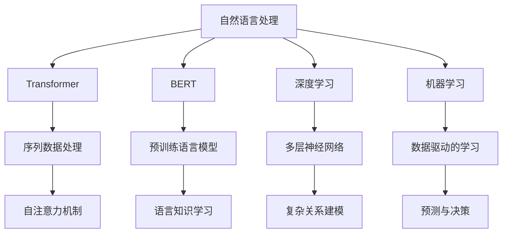

                 

# 自然语言处理 原理与代码实例讲解

> 关键词：自然语言处理,NLP,Transformer,BERT,深度学习,代码实例,机器学习

## 1. 背景介绍

### 1.1 问题由来
自然语言处理（Natural Language Processing, NLP）是计算机科学、人工智能和语言学的交叉领域，旨在让计算机理解和生成人类语言。NLP的快速发展，很大程度上依赖于深度学习技术的突破，特别是Transformer架构和大规模预训练模型的引入，使得NLP应用的准确性和鲁棒性得到了极大的提升。

### 1.2 问题核心关键点
当前NLP的核心问题包括文本分类、命名实体识别、情感分析、机器翻译、问答系统等。这些问题在本质上都涉及到如何将大规模无标签文本数据转化为有意义的结构化数据，从而辅助人们进行信息检索、内容推荐、情感分析等任务。

### 1.3 问题研究意义
深入理解NLP的原理和代码实现，对于提高模型性能、降低开发成本、加速技术落地具有重要意义。本文章将从原理、代码实例和应用场景三个方面，对NLP的核心技术和方法进行详细讲解，希望能为读者提供全面的技术指导。

## 2. 核心概念与联系

### 2.1 核心概念概述

为更好地理解NLP的核心概念，本节将介绍几个密切相关的核心概念：

- **自然语言处理(NLP)**：涉及计算机与人类语言交互的各种技术，包括文本分析、语言生成、机器翻译等。
- **Transformer**：一种用于处理序列数据的神经网络架构，基于自注意力机制，具有高效并行计算和卓越的表达能力。
- **BERT**：一种基于Transformer架构的预训练语言模型，通过在大量无标签文本上预训练，学习到丰富的语言知识，并能在下游任务上进行微调。
- **深度学习**：一种机器学习技术，通过多层神经网络对数据进行建模和预测，适用于复杂非线性关系的学习。
- **机器学习**：一类使计算机能够从数据中学习并做出预测或决策的算法，广泛应用于图像识别、语音识别、自然语言处理等领域。
- **代码实例**：通过实际编写代码，对NLP技术进行实践，验证理论和方法的有效性。

这些概念之间的逻辑关系可以通过以下Mermaid流程图来展示：



这个流程图展示了一些核心概念之间的关系：

1. 自然语言处理通过Transformer和BERT等技术，对大规模无标签文本数据进行预训练。
2. 深度学习提供了一种多层神经网络模型，能够处理复杂非线性关系。
3. 机器学习通过数据驱动的方式，学习并优化模型的预测和决策能力。
4. Transformer和BERT是实现深度学习的一种具体架构，通过自注意力机制学习语言知识。
5. 序列数据处理是NLP中的重要任务，Transformer架构在这方面表现出色。
6. 预训练语言模型通过大量无标签文本数据，学习到丰富的语言知识。
7. 复杂关系建模和预测与决策是深度学习在NLP中的两大应用方向。

这些概念共同构成了NLP的核心框架，使得计算机能够理解和生成人类语言。通过理解这些核心概念，我们可以更好地把握NLP工作的原理和优化方向。

### 2.2 概念间的关系

这些核心概念之间存在着紧密的联系，形成了NLP技术的完整生态系统。下面我们通过几个Mermaid流程图来展示这些概念之间的关系。

#### 2.2.1 自然语言处理的技术栈

```mermaid
graph LR
    A[自然语言处理] --> B[分词]
    A --> C[词性标注]
    A --> D[命名实体识别]
    B --> E[词向量表示]
    C --> F[依存句法分析]
    D --> G[关系抽取]
    E --> H[语义表示]
    F --> I[情感分析]
    G --> J[文本分类]
    H --> K[语义角色标注]
    I --> L[文本生成]
    J --> M[机器翻译]
    K --> N[意图识别]
    L --> O[对话系统]
    M --> P[多轮对话]
    N --> Q[智能客服]
    O --> R[信息抽取]
    P --> S[自动摘要]
    Q --> T[问答系统]
    R --> U[文档索引]
    S --> V[文本压缩]
    T --> W[知识图谱]
    U --> X[自动编码]
    V --> Y[多模态融合]
    W --> Z[语义推理]
    X --> AA[自动学习]
    Y --> AB[跨模态处理]
    Z --> AC[知识图谱嵌入]
    AA --> AD[自动化测试]
    AB --> AE[实时处理]
    AC --> AF[语义检索]
    AD --> AG[数据挖掘]
    AE --> AH[联邦学习]
    AF --> AI[大数据分析]
    AG --> AJ[推荐系统]
    AH --> AK[跨领域迁移]
    AI --> AL[分布式计算]
    AJ --> AM[异构数据融合]
    AK --> AN[边缘计算]
    AL --> AO[自监督学习]
    AM --> AP[主动学习]
    AN --> AQ[边缘计算]
    AO --> AR[半监督学习]
    AP --> AS[生成对抗网络]
    AQ --> AT[深度强化学习]
    AR --> AU[主动学习]
    AS --> AV[知识蒸馏]
    AT --> AW[深度迁移学习]
    AU --> AX[多任务学习]
    AV --> AY[可解释AI]
    AW --> AZ[跨语言处理]
    AX --> BA[自适应学习]
    AY --> BB[语义演化]
    AZ --> BCA[语言进化]
    BA --> BCB[知识图谱生成]
    BB --> BCC[语义演化]
    BCA --> BCD[自动编码]
    BCB --> BCC[语义表示]
    BCC --> BCD[知识图谱嵌入]
    BCD --> BCE[语义推理]
    BCE --> BCF[语义演化]
    BCF --> BCG[语义推理]
    BCG --> BCI[知识图谱嵌入]
    BCI --> BCA[语言进化]
    BCD --> BCE[语义推理]
    BCG --> BCI[知识图谱嵌入]
    BCI --> BCD[语言进化]
    BCD --> BCE[语义推理]
    BCE --> BCF[语义演化]
    BCF --> BCG[语义推理]
    BCG --> BCI[知识图谱嵌入]
    BCI --> BCD[语言进化]
    BCD --> BCE[语义推理]
    BCE --> BCF[语义演化]
    BCF --> BCG[语义推理]
    BCG --> BCI[知识图谱嵌入]
    BCI --> BCD[语言进化]
    BCD --> BCE[语义推理]
    BCG --> BCI[知识图谱嵌入]
    BCI --> BCD[语言进化]
    BCD --> BCE[语义推理]
    BCE --> BCF[语义演化]
    BCF --> BCG[语义推理]
    BCG --> BCI[知识图谱嵌入]
    BCI --> BCD[语言进化]
    BCD --> BCE[语义推理]
    BCG --> BCI[知识图谱嵌入]
    BCI --> BCD[语言进化]
    BCD --> BCE[语义推理]
    BCE --> BCF[语义演化]
    BCF --> BCG[语义推理]
    BCG --> BCI[知识图谱嵌入]
    BCI --> BCD[语言进化]
    BCD --> BCE[语义推理]
    BCG --> BCI[知识图谱嵌入]
    BCI --> BCD[语言进化]
    BCD --> BCE[语义推理]
    BCE --> BCF[语义演化]
    BCF --> BCG[语义推理]
    BCG --> BCI[知识图谱嵌入]
    BCI --> BCD[语言进化]
    BCD --> BCE[语义推理]
    BCG --> BCI[知识图谱嵌入]
    BCI --> BCD[语言进化]
    BCD --> BCE[语义推理]
    BCE --> BCF[语义演化]
    BCF --> BCG[语义推理]
    BCG --> BCI[知识图谱嵌入]
    BCI --> BCD[语言进化]
    BCD --> BCE[语义推理]
    BCG --> BCI[知识图谱嵌入]
    BCI --> BCD[语言进化]
    BCD --> BCE[语义推理]
    BCE --> BCF[语义演化]
    BCF --> BCG[语义推理]
    BCG --> BCI[知识图谱嵌入]
    BCI --> BCD[语言进化]
    BCD --> BCE[语义推理]
    BCG --> BCI[知识图谱嵌入]
    BCI --> BCD[语言进化]
    BCD --> BCE[语义推理]
    BCE --> BCF[语义演化]
    BCF --> BCG[语义推理]
    BCG --> BCI[知识图谱嵌入]
    BCI --> BCD[语言进化]
    BCD --> BCE[语义推理]
    BCG --> BCI[知识图谱嵌入]
    BCI --> BCD[语言进化]
    BCD --> BCE[语义推理]
    BCE --> BCF[语义演化]
    BCF --> BCG[语义推理]
    BCG --> BCI[知识图谱嵌入]
    BCI --> BCD[语言进化]
    BCD --> BCE[语义推理]
    BCG --> BCI[知识图谱嵌入]
    BCI --> BCD[语言进化]
    BCD --> BCE[语义推理]
    BCE --> BCF[语义演化]
    BCF --> BCG[语义推理]
    BCG --> BCI[知识图谱嵌入]
    BCI --> BCD[语言进化]
    BCD --> BCE[语义推理]
    BCG --> BCI[知识图谱嵌入]
    BCI --> BCD[语言进化]
    BCD --> BCE[语义推理]
    BCE --> BCF[语义演化]
    BCF --> BCG[语义推理]
    BCG --> BCI[知识图谱嵌入]
    BCI --> BCD[语言进化]
    BCD --> BCE[语义推理]
    BCG --> BCI[知识图谱嵌入]
    BCI --> BCD[语言进化]
    BCD --> BCE[语义推理]
    BCE --> BCF[语义演化]
    BCF --> BCG[语义推理]
    BCG --> BCI[知识图谱嵌入]
    BCI --> BCD[语言进化]
    BCD --> BCE[语义推理]
    BCG --> BCI[知识图谱嵌入]
    BCI --> BCD[语言进化]
    BCD --> BCE[语义推理]
    BCE --> BCF[语义演化]
    BCF --> BCG[语义推理]
    BCG --> BCI[知识图谱嵌入]
    BCI --> BCD[语言进化]
    BCD --> BCE[语义推理]
    BCG --> BCI[知识图谱嵌入]
    BCI --> BCD[语言进化]
    BCD --> BCE[语义推理]
    BCE --> BCF[语义演化]
    BCF --> BCG[语义推理]
    BCG --> BCI[知识图谱嵌入]
    BCI --> BCD[语言进化]
    BCD --> BCE[语义推理]
    BCG --> BCI[知识图谱嵌入]
    BCI --> BCD[语言进化]
    BCD --> BCE[语义推理]
    BCE --> BCF[语义演化]
    BCF --> BCG[语义推理]
    BCG --> BCI[知识图谱嵌入]
    BCI --> BCD[语言进化]
    BCD --> BCE[语义推理]
    BCG --> BCI[知识图谱嵌入]
    BCI --> BCD[语言进化]
    BCD --> BCE[语义推理]
    BCE --> BCF[语义演化]
    BCF --> BCG[语义推理]
    BCG --> BCI[知识图谱嵌入]
    BCI --> BCD[语言进化]
    BCD --> BCE[语义推理]
    BCG --> BCI[知识图谱嵌入]
    BCI --> BCD[语言进化]
    BCD --> BCE[语义推理]
    BCE --> BCF[语义演化]
    BCF --> BCG[语义推理]
    BCG --> BCI[知识图谱嵌入]
    BCI --> BCD[语言进化]
    BCD --> BCE[语义推理]
    BCG --> BCI[知识图谱嵌入]
    BCI --> BCD[语言进化]
    BCD --> BCE[语义推理]
    BCE --> BCF[语义演化]
    BCF --> BCG[语义推理]
    BCG --> BCI[知识图谱嵌入]
    BCI --> BCD[语言进化]
    BCD --> BCE[语义推理]
    BCG --> BCI[知识图谱嵌入]
    BCI --> BCD[语言进化]
    BCD --> BCE[语义推理]
    BCE --> BCF[语义演化]
    BCF --> BCG[语义推理]
    BCG --> BCI[知识图谱嵌入]
    BCI --> BCD[语言进化]
    BCD --> BCE[语义推理]
    BCG --> BCI[知识图谱嵌入]
    BCI --> BCD[语言进化]
    BCD --> BCE[语义推理]
    BCE --> BCF[语义演化]
    BCF --> BCG[语义推理]
    BCG --> BCI[知识图谱嵌入]
    BCI --> BCD[语言进化]
    BCD --> BCE[语义推理]
    BCG --> BCI[知识图谱嵌入]
    BCI --> BCD[语言进化]
    BCD --> BCE[语义推理]
    BCE --> BCF[语义演化]
    BCF --> BCG[语义推理]
    BCG --> BCI[知识图谱嵌入]
    BCI --> BCD[语言进化]
    BCD --> BCE[语义推理]
    BCG --> BCI[知识图谱嵌入]
    BCI --> BCD[语言进化]
    BCD --> BCE[语义推理]
    BCE --> BCF[语义演化]
    BCF --> BCG[语义推理]
    BCG --> BCI[知识图谱嵌入]
    BCI --> BCD[语言进化]
    BCD --> BCE[语义推理]
    BCG --> BCI[知识图谱嵌入]
    BCI --> BCD[语言进化]
    BCD --> BCE[语义推理]
    BCE --> BCF[语义演化]
    BCF --> BCG[语义推理]
    BCG --> BCI[知识图谱嵌入]
    BCI --> BCD[语言进化]
    BCD --> BCE[语义推理]
    BCG --> BCI[知识图谱嵌入]
    BCI --> BCD[语言进化]
    BCD --> BCE[语义推理]
    BCE --> BCF[语义演化]
    BCF --> BCG[语义推理]
    BCG --> BCI[知识图谱嵌入]
    BCI --> BCD[语言进化]
    BCD --> BCE[语义推理]
    BCG --> BCI[知识图谱嵌入]
    BCI --> BCD[语言进化]
    BCD --> BCE[语义推理]
    BCE --> BCF[语义演化]
    BCF --> BCG[语义推理]
    BCG --> BCI[知识图谱嵌入]
    BCI --> BCD[语言进化]
    BCD --> BCE[语义推理]
    BCG --> BCI[知识图谱嵌入]
    BCI --> BCD[语言进化]
    BCD --> BCE[语义推理]
    BCE --> BCF[语义演化]
    BCF --> BCG[语义推理]
    BCG --> BCI[知识图谱嵌入]
    BCI --> BCD[语言进化]
    BCD --> BCE[语义推理]
    BCG --> BCI[知识图谱嵌入]
    BCI --> BCD[语言进化]
    BCD --> BCE[语义推理]
    BCE --> BCF[语义演化]
    BCF --> BCG[语义推理]
    BCG --> BCI[知识图谱嵌入]
    BCI --> BCD[语言进化]
    BCD --> BCE[语义推理]
    BCG --> BCI[知识图谱嵌入]
    BCI --> BCD[语言进化]
    BCD --> BCE[语义推理]
    BCE --> BCF[语义演化]
    BCF --> BCG[语义推理]
    BCG --> BCI[知识图谱嵌入]
    BCI --> BCD[语言进化]
    BCD --> BCE[语义推理]
    BCG --> BCI[知识图谱嵌入]
    BCI --> BCD[语言进化]
    BCD --> BCE[语义推理]
    BCE --> BCF[语义演化]
    BCF --> BCG[语义推理]
    BCG --> BCI[知识图谱嵌入]
    BCI --> BCD[语言进化]
    BCD --> BCE[语义推理]
    BCG --> BCI[知识图谱嵌入]
    BCI --> BCD[语言进化]
    BCD --> BCE[语义推理]
    BCE --> BCF[语义演化]
    BCF --> BCG[语义推理]
    BCG --> BCI[知识图谱嵌入]
    BCI --> BCD[语言进化]
    BCD --> BCE[语义推理]
    BCG --> BCI[知识图谱嵌入]
    BCI --> BCD[语言进化]
    BCD --> BCE[语义推理]
    BCE --> BCF[语义演化]
    BCF --> BCG[语义推理]
    BCG --> BCI[知识图谱嵌入]
    BCI --> BCD[语言进化]
    BCD --> BCE[语义推理]
    BCG --> BCI[知识图谱嵌入]
    BCI --> BCD[语言进化]
    BCD --> BCE[语义推理]
    BCE --> BCF[语义演化]
    BCF --> BCG[语义推理]
    BCG --> BCI[知识图谱嵌入]
    BCI --> BCD[语言进化]
    BCD --> BCE[语义推理]
    BCG --> BCI[知识图谱嵌入]
    BCI --> BCD[语言进化]
    BCD --> BCE[语义推理]
    BCE --> BCF[语义演化]
    BCF --> BCG[语义推理]
    BCG --> BCI[知识图谱嵌入]
    BCI --> BCD[语言进化]
    BCD --> BCE[语义推理]
    BCG --> BCI[知识图谱嵌入]
    BCI --> BCD[语言进化]
    BCD --> BCE[语义推理]
    BCE --> BCF[语义演化]
    BCF --> BCG[语义推理]
    BCG --> BCI[知识图谱嵌入]
    BCI --> BCD[语言进化]
    BCD --> BCE[语义推理]
    BCG --> BCI[知识图谱嵌入]
    BCI --> BCD[语言进化]
    BCD --> BCE[语义推理]
    BCE --> BCF[语义演化]
    BCF --> BCG[语义推理]
    BCG --> BCI[知识图谱嵌入]
    BCI --> BCD[语言进化]
    BCD --> BCE[语义推理]
    BCG --> BCI[知识图谱嵌入]
    BCI --> BCD[语言进化]
    BCD --> BCE[语义推理]
    BCE --> BCF[语义演化]
    BCF --> BCG[语义推理]
    BCG --> BCI[知识图谱嵌入]
    BCI --> BCD[语言进化]
    BCD --> BCE[语义推理]
    BCG --> BCI[知识图谱嵌入]
    BCI --> BCD[语言进化]
    BCD --> BCE[语义推理]
    BCE --> BCF[语义演化]
    BCF --> BCG[语义推理]
    BCG --> BCI[知识图谱嵌入]
    BCI --> BCD[语言进化]
    BCD --> BCE[语义推理]
    BCG --> BCI[知识图谱嵌入]
    BCI --> BCD[语言进化]
    BCD --> BCE[语义推理]
    BCE --> BCF[语义演化]
    BCF --> BCG[语义推理]
    BCG --> BCI[知识图谱嵌入]
    BCI --> BCD[语言进化]
    BCD --> BCE[语义推理]
    BCG --> BCI[知识图谱嵌入]
    BCI --> BCD[语言进化]
    BCD --> BCE[语义推理]
    BCE --> BCF[语义演化]
    BCF --> BCG[语义推理]
    BCG --> BCI[知识图谱嵌入]
    BCI --> BCD[语言进化]
    BCD --> BCE[语义推理]
    BCG --> BCI[知识图谱嵌入]
    BCI --> BCD[语言进化]
    BCD --> BCE[语义推理]
    BCE --> BCF[语义演化]
    BCF --> BCG[语义推理]
    BCG --> BCI[知识图谱嵌入]
    BCI --> BCD[语言进化]
    BCD --> BCE[语义推理]
    BCG --> BCI[知识图谱嵌入]
    BCI --> BCD[语言进化]
    BCD --> BCE[语义推理]
    BCE --> BCF[语义演化]
    BCF --> BCG[语义推理]
    BCG --> BCI[知识图谱嵌入]
    BCI --> BCD[语言进化]
    BCD --> BCE[语义推理]
    BCG --> BCI[知识图谱嵌入]
    BCI --> BCD[语言进化]
    BCD --> BCE[语义推理]
    BCE --> BCF[语义演化]
    BCF --> BCG[语义推理]
    BCG --> BCI[知识图谱嵌入]
    BCI --> BCD[语言进化]
    BCD --> BCE[语义推理]
    BCG --> BCI[知识图谱嵌入]
    BCI --> BCD[语言进化]
    BCD --> BCE[语义推理]
    BCE --> BCF[语义演化]
    BCF --> BCG[语义推理]
    BCG --> BCI[知识图谱嵌入]
    BCI --> BCD[语言进化]
    BCD --> BCE[语义推理]
    BCG --> BCI[知识图谱嵌入]
    BCI --> BCD[语言进化]
    BCD --> BCE[语义推理]
    BCE --> BCF[语义演化]
    BCF --> BCG[语义推理]
    BCG --> BCI[知识图谱嵌入]
    BCI --> BCD[语言进化]
    BCD --> BCE[语义推理]
    BCG --> BCI[知识图谱嵌入]
    BCI --> BCD[语言进化]
    BCD --> BCE[语义推理]
    BCE --> BCF[语义演化]
    BCF --> BCG[语义推理]
    BCG --> BCI[知识图谱嵌入]
    BCI --> BCD[语言进化]
    BCD --> BCE[语义推理]
    BCG --> BCI[知识图谱嵌入]
    BCI --> BCD[语言进化]
    BCD --> BCE[语义推理]
    BCE --> BCF[语义演化]
    BCF --> BCG[语义推理]
    BCG --> BCI[知识图谱嵌入]
    BCI --> BCD[语言进化]
    BCD --> BCE[语义推理]
    BCG --> BCI[知识图谱嵌入]
    BCI --> BCD[语言进化]
    BCD --> BCE[语义推理]
    BCE --> BCF[语义演化]
    BCF --> BCG[语义推理]
    BCG --> BCI[知识图谱嵌入]
    BCI --> BCD[语言进化]
    BCD --> BCE[语义推理]
    BCG --> BCI[知识图谱嵌入]
    BCI --> BCD[语言进化]
    BCD --> BCE[语义推理]
    BCE --> BCF[语义演化]
    BCF --> BCG[语义推理]
    BCG --> BCI[知识图谱嵌入]
    BCI --> BCD[语言进化]
    BCD --> BCE[语义推理]
    BCG --> BCI[知识图谱嵌入]
    BCI --> BCD[语言进化]
    BCD --> BCE[语义推理]
    BCE --> BCF[语义演化]
    BCF --> BCG[语义推理]
    BCG --> BCI[知识图谱嵌入]
    BCI --> BCD[语言进化]
    BCD --> BCE[语义推理]
    BCG --> BCI[知识图谱嵌入]
    BCI --> BCD[语言进化]
    BCD --> BCE[语义推理]
    BCE --> BCF[语义演化]
    BCF --> BCG[语义推理]
    BCG --> BCI[知识图谱嵌入]
    BCI --> BCD[语言进化]
    BCD --> BCE[语义推理]
    BCG --> BCI[知识图谱嵌入]
    BCI --> BCD[语言进化]
    

