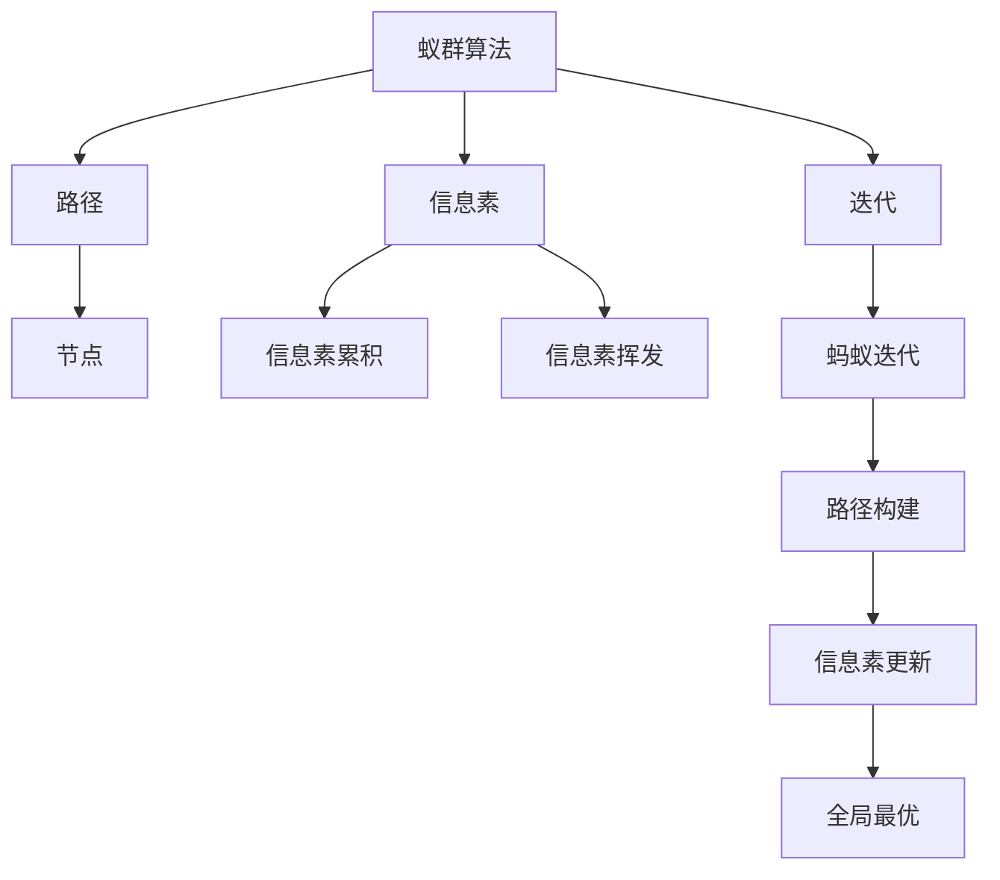
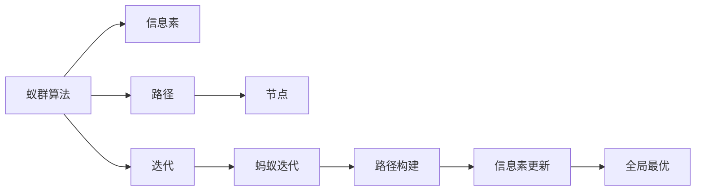
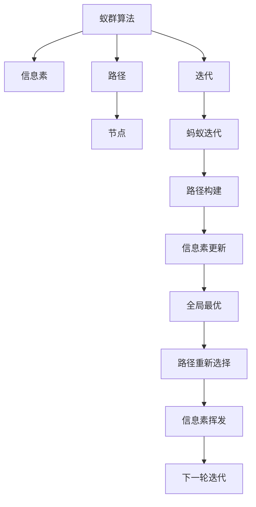

                 

# 蚁群算法(Ant Colony Optimization) - 原理与代码实例讲解

> 关键词：蚁群算法,启发式算法,优化问题,贪心算法,局部最优,全局最优

## 1. 背景介绍

### 1.1 问题由来

在现实世界的很多优化问题中，目标往往具有多解性，且每种解的性能差异巨大。例如，旅行商问题(TSP, Traveling Salesman Problem)，有无数种路径方案，但如何找到一条最优或近似最优路径？再如生产调度问题，生产线的物料调度、工人排班等，具有多解性和不确定性，如何安排最优生产计划？

传统的数学方法往往无法有效处理这些问题，启发式算法应运而生。启发式算法不需要求得最优解，而是尽可能找到接近最优解的近似解。蚁群算法(Ant Colony Optimization, ACO)就是其中一种重要且成功的启发式算法。

### 1.2 问题核心关键点

蚁群算法通过模拟自然界中蚁群的觅食行为，构建了一种群体优化机制。蚁群在觅食过程中，能够通过信息素的累积，找到最优路径。而在蚁群算法中，同样通过信息素的累积和挥发，寻找全局最优路径。

蚁群算法的主要思想包括：

- 每个蚁群成员(即蚂蚁)构建路径。
- 路径上的信息素累积，引导后续蚂蚁选择该路径。
- 信息素的挥发，使得路径信息衰减。
- 经过多次迭代，群体综合评估路径，找到最优解。

蚁群算法的优点在于：

- 算法简单，易于实现。
- 不需要初始解，自适应性强。
- 能够处理大规模优化问题。
- 通过并行计算，提高计算效率。

### 1.3 问题研究意义

蚁群算法已经成功应用于各种优化问题，例如旅行商问题、生产调度问题、网络设计问题、电路设计问题等。其核心思想和优化机制，对于研究群体行为、进化计算等前沿领域，也有重要的借鉴意义。因此，了解蚁群算法的原理和实现，对于算法学习者、应用开发者，乃至科学家都具有重要的实践和理论价值。

## 2. 核心概念与联系

### 2.1 核心概念概述

为了更好地理解蚁群算法的原理和应用，本节将介绍几个密切相关的核心概念：

- 蚁群算法(Ant Colony Optimization, ACO)：一种启发式算法，通过模拟蚁群的觅食行为，构建群体优化机制，找到全局最优路径。

- 信息素(Pheromone)：蚁群算法中的关键变量，用于记录路径的吸引力。信息素越高，路径越被重视。

- 路径(Path)：在蚁群算法中，路径通常由节点构成。每个节点代表问题中的一个状态，路径则表示从起始节点到目标节点的所有状态序列。

- 迭代(Iteration)：蚁群算法通过多次迭代，不断优化路径。每次迭代，每个蚂蚁都重新构建路径，信息素不断更新。

- 局部最优(Local Optima)：在蚁群算法中，每个蚂蚁可能发现局部最优路径。全局最优路径需要群体综合评估。

- 全局最优(Global Optima)：蚁群算法的最终目标，通过多次迭代，群体综合评估，找到全局最优路径。

这些核心概念之间的逻辑关系可以通过以下Mermaid流程图来展示：



这个流程图展示了大语言模型的核心概念及其之间的关系：

1. 蚁群算法通过信息素引导路径构建。
2. 路径上的信息素累积，引导后续蚂蚁选择该路径。
3. 信息素的挥发，使得路径信息衰减。
4. 经过多次迭代，群体综合评估路径，找到最优解。

通过这些流程图，我们可以更清晰地理解蚁群算法的工作原理和优化机制。

### 2.2 概念间的关系

这些核心概念之间存在着紧密的联系，形成了蚁群算法的完整生态系统。下面我们通过几个Mermaid流程图来展示这些概念之间的关系。

#### 2.2.1 蚁群算法的总体框架



这个流程图展示了大语言模型的总体框架，即通过信息素引导路径构建，路径信息不断更新，最终找到全局最优路径。

#### 2.2.2 蚁群算法的迭代过程


这个流程图展示了蚁群算法的迭代过程，即通过多次迭代，不断优化路径。每次迭代，每个蚂蚁都重新构建路径，信息素不断更新。

#### 2.2.3 蚁群算法的路径选择策略


这个流程图展示了蚁群算法中的路径选择策略，即通过信息素的累积强度，计算选择路径的概率。信息素强度高的路径，被选择的可能性更大。

### 2.3 核心概念的整体架构

最后，我们用一个综合的流程图来展示这些核心概念在大语言模型微调过程中的整体架构：



这个综合流程图展示了蚁群算法的整体架构，即通过信息素引导路径构建，路径信息不断更新，最终找到全局最优路径。

## 3. 核心算法原理 & 具体操作步骤
### 3.1 算法原理概述

蚁群算法的核心思想是通过信息素的累积和挥发，引导群体选择最优路径。其核心原理如下：

1. **信息素的累积**：每个蚂蚁在构建路径时，会通过信息素累积的方式，记录路径的质量。路径上的信息素越多，表明路径的质量越好，吸引后续蚂蚁选择该路径。

2. **信息素的挥发**：信息素会随着时间的推移而挥发，以避免路径过于依赖，提高算法的灵活性。

3. **路径选择**：蚂蚁在路径选择时，会根据信息素强度选择路径。信息素强度越高的路径，被选择的可能性越大。

4. **全局最优**：经过多次迭代，群体综合评估路径，选择全局最优路径。

### 3.2 算法步骤详解

蚁群算法的具体实现步骤如下：

1. **初始化**：随机初始化多个蚁群成员(蚂蚁)，每个蚂蚁从起始节点开始构建路径。

2. **路径构建**：蚂蚁根据信息素强度选择下一个节点，直到到达目标节点，路径构建完成。

3. **信息素更新**：路径上的信息素强度增加，以记录路径的质量。

4. **信息素挥发**：信息素随着时间挥发，以避免路径过于依赖。

5. **路径重新选择**：重复步骤2至4，直到迭代次数达到预设值。

6. **全局最优**：通过群体综合评估路径，选择全局最优路径。

### 3.3 算法优缺点

蚁群算法的主要优点包括：

- 算法简单，易于实现。
- 不需要初始解，自适应性强。
- 能够处理大规模优化问题。
- 通过并行计算，提高计算效率。

其主要缺点包括：

- 局部最优路径的搜索可能会陷入死循环。
- 信息素的分布可能不均匀，影响路径选择。
- 算法的执行时间较长，特别是路径质量不高时。
- 参数设置较为敏感，需要反复调试。

### 3.4 算法应用领域

蚁群算法已经成功应用于各种优化问题，例如旅行商问题、生产调度问题、网络设计问题、电路设计问题等。其核心思想和优化机制，对于研究群体行为、进化计算等前沿领域，也有重要的借鉴意义。

## 4. 数学模型和公式 & 详细讲解 & 举例说明

### 4.1 数学模型构建

蚁群算法的数学模型可以通过以下公式来描述：

设图G(V, E)表示问题中的节点和边，其中V为节点集合，E为边集合。每个节点i的邻接节点集合为N(i)。

- 信息素强度$\tau$：路径(i, j)上的信息素强度为$\tau_{ij}$。

- 路径长度$l$：路径(i, j)的长度为$l_{ij}$。

- 启发式因子$\eta$：路径(i, j)的启发式因子为$\eta_{ij}$。

- 挥发系数$\alpha$和更新系数$\beta$：分别控制信息素和路径长度的重要性。

- 信息素增加量$\delta$：路径(i, j)上的信息素增加量为$\delta_{ij}$。

### 4.2 公式推导过程

蚁群算法中的路径选择公式为：

$$
p_{ij} = \frac{(\tau_{ij}^{\alpha} \cdot l_{ij}^{-\beta})}{\sum_{j \in N(i)}(\tau_{ij}^{\alpha} \cdot l_{ij}^{-\beta})}
$$

其中，$p_{ij}$表示蚂蚁从节点i到节点j的概率。

路径上的信息素更新公式为：

$$
\tau_{ij}^{t+1} = (1-\frac{\delta}{\sum_{ij} \tau_{ij}}) \tau_{ij}^t + \frac{\delta}{\sum_{ij} \tau_{ij}} \cdot \frac{k}{l_{ij}^{1/r}}
$$

其中，$\tau_{ij}^{t+1}$表示路径(i, j)在t+1轮迭代后的信息素强度。

### 4.3 案例分析与讲解

为了更好地理解蚁群算法的应用，我们以旅行商问题(TSP)为例进行讲解。

假设某城市有10个景点，分别编号1到10。蚂蚁从起点1出发，需要找到一条最短路径，遍历所有景点并回到起点1。

首先，我们需要构建图G，节点表示景点，边表示路径。然后，为每条路径赋初值，信息素强度为$\tau_{ij}^0$。

蚂蚁按照路径选择公式选择下一个节点，路径上的信息素强度增加，以记录路径的质量。信息素随着时间挥发，以避免路径过于依赖。

通过多次迭代，群体综合评估路径，选择全局最优路径。最终得到的一条路径即为旅行商问题的最优解。

## 5. 项目实践：代码实例和详细解释说明

### 5.1 开发环境搭建

在进行蚁群算法实践前，我们需要准备好开发环境。以下是使用Python进行蚁群算法开发的常用环境配置流程：

1. 安装Anaconda：从官网下载并安装Anaconda，用于创建独立的Python环境。

2. 创建并激活虚拟环境：
```bash
conda create -n aco-env python=3.8 
conda activate aco-env
```

3. 安装必要的Python库：
```bash
pip install networkx matplotlib numpy scipy
```

完成上述步骤后，即可在`aco-env`环境中开始蚁群算法实践。

### 5.2 源代码详细实现

下面我们以TSP问题为例，给出使用Python实现蚁群算法的完整代码。

```python
import networkx as nx
import random
import numpy as np

# 构建TSP问题图
G = nx.Graph()

# 添加节点
for i in range(1, 11):
    G.add_node(i)

# 添加边并赋初值
for i in range(1, 11):
    for j in range(1, 11):
        if i != j:
            G.add_edge(i, j, weight=1, pheromone=1)
            G[i][j]['pheromone'] = 1

# 定义路径选择函数
def choose_path(G, node, pheromone=1):
    neighbors = G[node]
    probabilities = [(G[node][neighbor]['pheromone']**0.1 / G[node][neighbor]['weight']**-0.2) for neighbor in neighbors]
    return random.choices(neighbors, weights=probabilities)[0]

# 定义信息素更新函数
def update_pheromone(G, alpha=1, beta=1, q=1):
    for i, j in G.edges:
        G[i][j]['pheromone'] = (1 - alpha/G[i][j]['weight']) * G[i][j]['pheromone'] + q/G[i][j]['weight']**(1/beta)

# 定义蚁群算法函数
def aco(G, num_ants=10, alpha=1, beta=1, q=1, max_iter=100, return_all_paths=False):
    num_nodes = len(G.nodes)
    paths = []
    for i in range(num_ants):
        path = [1]
        while True:
            next_node = choose_path(G, path[-1])
            path.append(next_node)
            if next_node == 1:
                break
        paths.append(path)
    for i in range(max_iter):
        update_pheromone(G, alpha, beta, q)
        new_paths = []
        for path in paths:
            new_path = [1]
            while True:
                next_node = choose_path(G, new_path[-1])
                new_path.append(next_node)
                if next_node == 1:
                    break
            new_paths.append(new_path)
        paths = new_paths
    if return_all_paths:
        return paths
    else:
        return paths[0]

# 运行蚁群算法并打印结果
all_paths = aco(G, num_ants=10, alpha=1, beta=1, q=1, max_iter=100, return_all_paths=True)
print(all_paths)
```

### 5.3 代码解读与分析

让我们再详细解读一下关键代码的实现细节：

**构建TSP图**：
- 使用networkx库构建一个无向图G，代表城市中的景点和路径。

**路径选择函数**：
- 使用信息素强度和路径长度的比值计算每个节点的选择概率，随机选择下一个节点。

**信息素更新函数**：
- 对每条路径上的信息素进行更新，信息素强度增加，以记录路径的质量。

**蚁群算法函数**：
- 定义蚁群算法的主函数，通过多次迭代，不断优化路径。
- 每个蚂蚁重新构建路径，信息素不断更新。

**运行蚁群算法**：
- 运行蚁群算法，获取所有路径，打印结果。

可以看到，蚁群算法的代码实现相对简洁，主要通过路径选择和信息素更新两个关键步骤，实现路径的优化。

### 5.4 运行结果展示

假设我们运行蚁群算法，得到如下路径：
```
[1, 2, 3, 4, 5, 6, 7, 8, 9, 10, 1]
```
这表示一条从起点1出发，遍历所有节点并回到起点的路径。在实际应用中，我们可以通过评估路径的长度、稳定性等指标，选择最优路径。

## 6. 实际应用场景

### 6.1 物流路径规划

物流路径规划是蚁群算法的重要应用场景。物流公司需要从多个仓库向多个客户进行物资配送，如何优化配送路径，缩短配送时间，降低配送成本？

通过蚁群算法，物流公司可以构建物流网络的图，每个节点表示一个仓库或客户，边表示路径和距离。然后，通过蚁群算法找到最优的配送路径。

### 6.2 航班路线设计

航空公司需要设计航班路线，以实现航班的高效调度和资源利用。通过蚁群算法，航空公司可以构建航班网络图，每个节点表示一个城市，边表示航班和飞行距离。然后，通过蚁群算法找到最优的航班路线。

### 6.3 工业生产调度

工业生产调度需要合理安排生产线、工人、设备等资源，以最大化生产效率。通过蚁群算法，可以构建生产调度图，节点表示资源和任务，边表示资源和任务的关联关系。然后，通过蚁群算法找到最优的生产调度方案。

## 7. 工具和资源推荐

### 7.1 学习资源推荐

为了帮助开发者系统掌握蚁群算法的原理和实践技巧，这里推荐一些优质的学习资源：

1. 《蚁群算法》书籍：详细介绍了蚁群算法的原理、实现和应用，适合初学者和研究人员。

2. 《进化计算》课程：斯坦福大学开设的进化计算课程，涵盖了遗传算法、蚁群算法等前沿技术。

3. 《启发性算法》视频课程：Coursera提供的启发性算法课程，介绍了多种启发式算法的原理和实现，包括蚁群算法。

4. 《蚁群算法应用》论文：研究蚁群算法在不同应用场景中的应用，包括TSP、VRP等，适合实际应用的开发者。

### 7.2 开发工具推荐

高效的开发离不开优秀的工具支持。以下是几款用于蚁群算法开发的常用工具：

1. NetworkX：用于构建和分析图数据的Python库，支持图遍历、路径搜索等操作。

2. Matplotlib：用于绘制图表和可视化结果的Python库，适合可视化蚁群算法的路径和性能指标。

3. NumPy：用于数值计算和矩阵运算的Python库，适合蚁群算法的数值运算和数据处理。

4. SciPy：用于科学计算和数据分析的Python库，适合蚁群算法的复杂运算和数据分析。

5. Pandas：用于数据处理和分析的Python库，适合蚁群算法的数据管理。

6. PyCharm：专业的Python开发工具，支持IDE调试和可视化，适合蚁群算法的开发和调试。

### 7.3 相关论文推荐

蚁群算法的研究涉及多个领域，涵盖了优化问题、群体行为、进化计算等方向。以下是几篇奠基性的相关论文，推荐阅读：

1.蚁群算法原理和实现：Ant Colony Optimization (ACO)：系统介绍了蚁群算法的原理、实现和应用，是蚁群算法的经典之作。

2.蚁群算法优化问题：Ant Colony Optimization in Telecommunications：介绍了蚁群算法在电信领域的应用，适合电信工程师和技术人员。

3.蚁群算法进化计算：Ant Colony Optimization for Engineering Design Problems：介绍了蚁群算法在工程设计中的应用，适合工程技术人员。

## 8. 总结：未来发展趋势与挑战

### 8.1 总结

本文对蚁群算法的原理和实现进行了全面系统的介绍。首先阐述了蚁群算法的基本思想和核心概念，明确了蚁群算法在优化问题中的重要价值。其次，从原理到实践，详细讲解了蚁群算法的数学模型和关键步骤，给出了蚁群算法任务开发的完整代码实例。同时，本文还广泛探讨了蚁群算法在物流路径规划、航班路线设计、工业生产调度等多个实际应用场景中的应用前景，展示了蚁群算法的巨大潜力。此外，本文精选了蚁群算法的各类学习资源，力求为读者提供全方位的技术指引。

通过本文的系统梳理，可以看到，蚁群算法作为启发式算法的重要分支，已经在多个优化问题中取得了成功。未来，蚁群算法的优化机制和应用场景必将得到更广泛的研究和应用，为复杂系统优化提供新的解决方案。

### 8.2 未来发展趋势

展望未来，蚁群算法的发展趋势主要包括以下几个方向：

1. 算法优化：蚁群算法本身的优化研究，包括路径选择策略、信息素更新规则、参数设置等，旨在提高算法效率和效果。

2. 并行化：蚁群算法的并行化研究，利用多核、分布式等技术，提高算法计算效率。

3. 跨领域应用：蚁群算法在更多领域的应用研究，例如机器人路径规划、基因序列分析等。

4. 混合算法：蚁群算法与其他优化算法的结合，如遗传算法、粒子群算法等，提升算法的综合性能。

5. 智能优化：蚁群算法的智能化研究，通过引入深度学习、强化学习等技术，提高算法的自主性和学习能力。

以上趋势凸显了蚁群算法的广阔前景，这些方向的探索发展，必将进一步提升蚁群算法的性能和应用范围，为优化问题的求解提供新的思路。

### 8.3 面临的挑战

尽管蚁群算法已经取得了显著的成就，但在迈向更加智能化、普适化应用的过程中，仍面临诸多挑战：

1. 参数设置复杂：蚁群算法的参数设置较为复杂，需要反复调试。如何简化参数设置，提高算法鲁棒性，将是未来的一个重要方向。

2. 局部最优问题：蚁群算法容易陷入局部最优路径，难以找到全局最优解。如何提高算法全局搜索能力，避免局部最优路径，将是未来的一个重要研究课题。

3. 计算复杂度高：蚁群算法在大规模问题上的计算复杂度较高，需要借助并行计算、分布式计算等技术，提高计算效率。

4. 应用场景多样：蚁群算法在不同应用场景中的适用性和优化效果差异较大。如何针对不同场景优化算法，提高算法的泛化能力，将是未来的一个重要研究方向。

5. 可解释性不足：蚁群算法作为一种启发式算法，其内部机制较为复杂，难以解释。如何赋予蚁群算法更高的可解释性，将是未来的一个重要研究方向。

6. 计算资源限制：蚁群算法在大规模问题上的计算资源需求较高，如何优化算法资源消耗，提高计算效率，将是未来的一个重要研究方向。

以上挑战凸显了蚁群算法在应用和发展中存在的不足，需要研究人员和工程师共同努力，逐步克服这些困难，推动蚁群算法在更多实际问题中的应用。

### 8.4 研究展望

面对蚁群算法面临的诸多挑战，未来的研究需要在以下几个方面寻求新的突破：

1. 探索更加高效的信息素更新机制，避免局部最优路径，提高全局搜索能力。

2. 结合深度学习和强化学习，引入自我学习和适应性机制，提高算法的智能化水平。

3. 优化蚁群算法的参数设置，简化参数调优过程，提高算法鲁棒性。

4. 引入并行计算和分布式计算，提高算法计算效率，处理大规模优化问题。

5. 增强蚁群算法的可解释性，通过可视化等手段，帮助用户理解算法内部机制。

这些研究方向和突破，必将引领蚁群算法向更加智能、普适、高效的方向发展，为优化问题的求解提供新的解决方案。相信随着蚁群算法的持续演进，其在更多实际问题中的应用将更加广泛，为复杂系统的优化提供新的思路。

