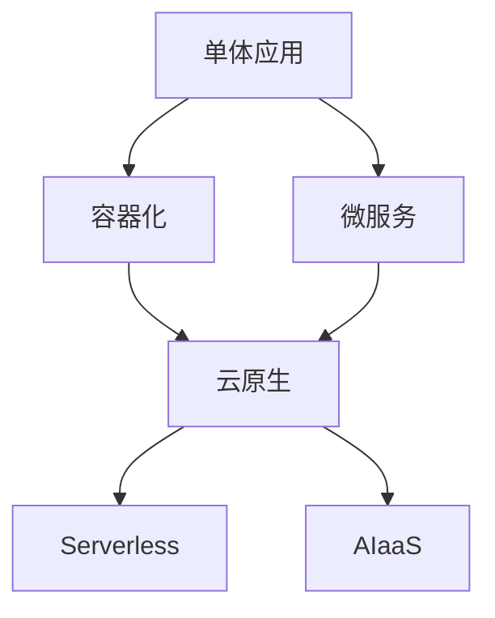
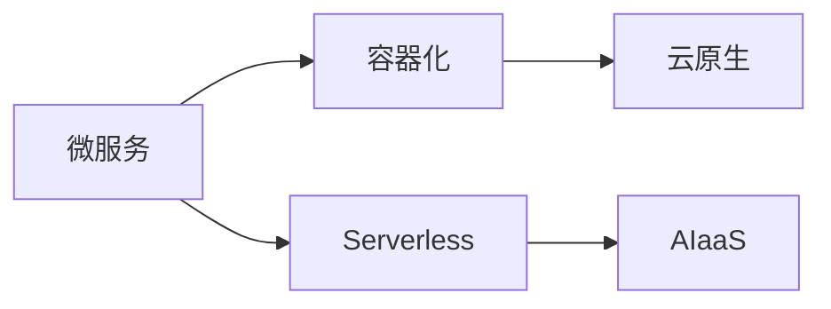
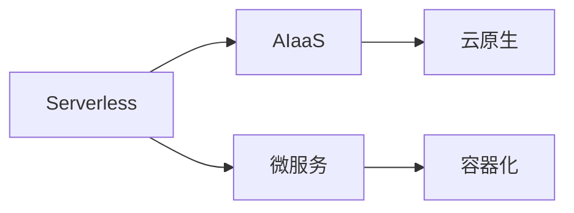
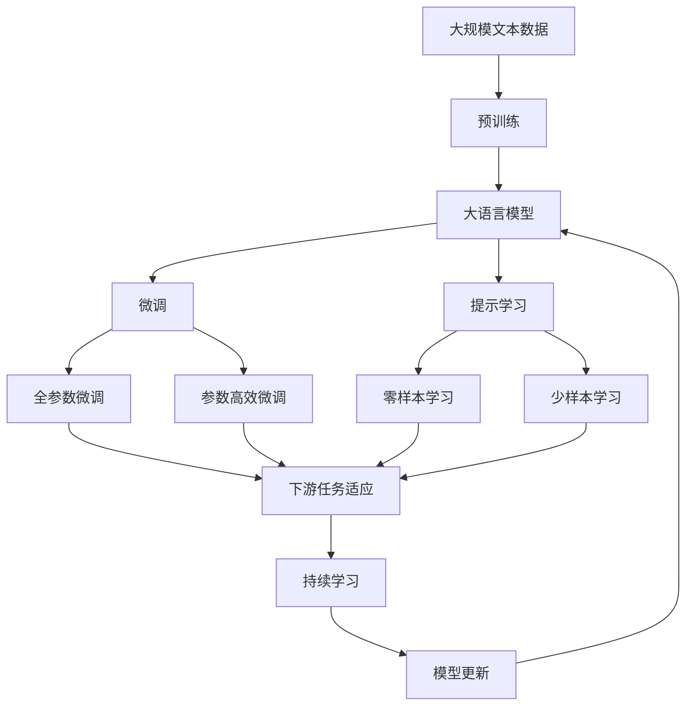

                 

# 计算产业技术栈的重大变化

## 1. 背景介绍

### 1.1 问题由来
随着数字化转型的深入推进，计算产业的技术栈经历了翻天覆地的变化。从传统的单体应用，到微服务、容器化、云原生，再到今天的Serverless、AI即服务(AIaaS)，技术栈的演变史就是一部技术进步史。特别是过去几年，AI技术的爆发性增长，使得计算产业的技术栈更加复杂和多元化，新技术、新架构不断涌现，对传统技术提出了严峻的挑战。

### 1.2 问题核心关键点
计算产业技术栈的变化主要体现在以下几个方面：

1. **从单体应用到微服务**：单体应用难以支持大规模、高并发的需求，微服务架构通过将应用拆分为多个小服务，提高了系统的可伸缩性和可维护性。
2. **容器化和云原生**：容器化技术通过Docker等工具，使得应用的打包和部署更加便捷，云原生通过Kubernetes等平台，实现了应用的自动扩展和弹性调度。
3. **Serverless和AIaaS**：Serverless架构使得开发者无需关注服务器运维，云平台自动管理计算资源，降低了运维成本；AIaaS则将AI模型作为云服务提供，用户可以按需使用，加速AI应用的落地。

这些变化不仅带来了技术的革新，也对计算资源的利用效率、应用部署的灵活性、系统扩展的弹性等方面提出了新的要求。

### 1.3 问题研究意义
研究计算产业技术栈的变化，对于了解技术演进的脉络、把握行业发展的趋势、探索新技术的潜力和应用，具有重要意义：

1. **提升技术应用水平**：了解技术栈的变化，可以帮助开发者更好地掌握新技术，提高应用的开发和运维效率。
2. **优化资源利用效率**：通过探索Serverless、AIaaS等新技术，可以更灵活地利用计算资源，降低成本。
3. **加速AI应用落地**：AIaaS使得AI技术的快速部署和灵活应用成为可能，加速了AI技术的产业化进程。
4. **增强系统扩展能力**：微服务、容器化等技术极大地提升了系统的可扩展性和弹性，为应对大规模并发提供了新的解决方案。

## 2. 核心概念与联系

### 2.1 核心概念概述

为更好地理解计算产业技术栈的变化，本节将介绍几个密切相关的核心概念：

- **单体应用(Monolithic Application)**：指将应用的所有功能模块打包在一个可执行的进程中运行的应用架构。早期Web应用大多采用这种架构，但随着应用的复杂度增加，单体应用逐渐被微服务架构取代。

- **微服务(Microservice)**：将应用拆分为多个独立、可自治的服务，每个服务负责一个特定的功能模块，通过网络通信协同工作。微服务架构提高了系统的可伸缩性和可维护性，但也带来了服务间通信和数据一致性等问题。

- **容器化(Containerization)**：通过Docker等工具，将应用及其依赖打包到容器中，确保应用在任意环境中一致运行。容器化技术简化了应用的部署和运维，提高了系统的可靠性。

- **云原生(Cloud-Native)**：基于云计算的技术和架构，通过容器化、声明式编排、服务网格等技术，实现应用的自动化、弹性化和自管理。云原生架构使得应用能够无缝地与云平台集成，提升系统的灵活性和扩展性。

- **Serverless**：无需关注底层服务器运维，按需使用计算资源，由云平台自动管理。Serverless架构简化了应用的运维工作，降低了成本，但也带来了冷启动等问题。

- **AI即服务(AIaaS)**：将AI模型和相关算法封装为云服务，用户可以按需使用，加速AI应用的部署和迭代。AIaaS降低了AI应用的开发门槛，加速了AI技术的普及。

这些核心概念之间的逻辑关系可以通过以下Mermaid流程图来展示：



这个流程图展示了几大核心概念之间的关系：

1. 单体应用是微服务架构的前身。
2. 容器化技术使得应用能够更加灵活地部署。
3. 云原生架构通过容器化和声明式编排，实现了应用的自动化和弹性调度。
4. Serverless架构进一步简化了应用的运维工作。
5. AIaaS将AI模型封装为云服务，提供更灵活的AI应用体验。

### 2.2 概念间的关系

这些核心概念之间存在着紧密的联系，形成了计算产业技术栈的变化生态系统。下面我通过几个Mermaid流程图来展示这些概念之间的关系。

#### 2.2.1 微服务与容器化的关系



这个流程图展示了微服务、容器化、云原生、Serverless和AIaaS之间的层次关系：

1. 微服务通过容器化技术实现应用的独立部署。
2. 容器化和云原生技术进一步提升了微服务的自动化和弹性。
3. Serverless架构使得微服务和云原生应用更加便捷地部署和扩展。
4. AIaaS作为云服务的一种，支持微服务、容器化和云原生应用的高效运行。

#### 2.2.2 Serverless与AIaaS的关系



这个流程图展示了Serverless、AIaaS、云原生、微服务和容器化之间的联系：

1. Serverless架构通过按需使用计算资源，简化了应用的运维工作。
2. AIaaS通过封装AI模型，提供了更灵活的AI应用体验。
3. 云原生架构通过容器化和声明式编排，提升了应用的自动化和弹性。
4. 微服务通过容器化技术实现应用的独立部署。
5. 容器化技术简化了微服务应用的部署和运维。

### 2.3 核心概念的整体架构

最后，我们用一个综合的流程图来展示这些核心概念在大语言模型微调过程中的整体架构：



这个综合流程图展示了从预训练到微调，再到持续学习的完整过程。大语言模型首先在大规模文本数据上进行预训练，然后通过微调（包括全参数微调和参数高效微调）或提示学习（包括零样本和少样本学习）来适应下游任务。最后，通过持续学习技术，模型可以不断更新和适应新的任务和数据。通过这些流程图，我们可以更清晰地理解计算产业技术栈的变化过程中各个核心概念的关系和作用，为后续深入讨论具体的微调方法和技术奠定基础。

## 3. 核心算法原理 & 具体操作步骤
### 3.1 算法原理概述

计算产业技术栈的变化，主要体现在对计算资源的利用方式、应用的部署和扩展方式、以及系统的可维护性等方面的革新。以下是对这些变化的核心算法原理的概述。

1. **微服务架构**：通过将应用拆分为多个独立的小服务，每个服务负责一个特定的功能模块，通过网络通信协同工作。微服务架构提高了系统的可伸缩性和可维护性，但也带来了服务间通信和数据一致性等问题。

2. **容器化技术**：通过Docker等工具，将应用及其依赖打包到容器中，确保应用在任意环境中一致运行。容器化技术简化了应用的部署和运维，提高了系统的可靠性。

3. **云原生架构**：基于云计算的技术和架构，通过容器化、声明式编排、服务网格等技术，实现应用的自动化、弹性化和自管理。云原生架构使得应用能够无缝地与云平台集成，提升系统的灵活性和扩展性。

4. **Serverless架构**：无需关注底层服务器运维，按需使用计算资源，由云平台自动管理。Serverless架构简化了应用的运维工作，降低了成本，但也带来了冷启动等问题。

5. **AIaaS**：将AI模型和相关算法封装为云服务，用户可以按需使用，加速AI应用的部署和迭代。AIaaS降低了AI应用的开发门槛，加速了AI技术的普及。

### 3.2 算法步骤详解

以下是这些核心算法原理的具体操作步骤：

**微服务架构**：

1. **功能拆分**：将应用拆分为多个独立的服务，每个服务负责一个特定的功能模块。
2. **服务通信**：通过RESTful API或消息队列等机制，实现服务之间的通信。
3. **服务治理**：采用服务注册、服务发现、负载均衡等机制，管理服务间的调用关系。
4. **数据一致性**：采用分布式事务、补偿机制等技术，保证数据一致性。

**容器化技术**：

1. **应用打包**：将应用和其依赖打包到Docker容器中。
2. **容器运行**：使用Docker引擎在任意环境中运行容器。
3. **容器编排**：通过Kubernetes等工具，实现容器的自动化部署和调度。

**云原生架构**：

1. **声明式编排**：通过YAML或JSON等声明式语言，描述应用的编排方式。
2. **服务网格**：通过Istio等工具，实现服务的智能路由和负载均衡。
3. **弹性扩展**：通过Kubernetes等工具，实现应用的自动扩展和弹性调度。
4. **应用监控**：通过Prometheus、Grafana等工具，实时监控应用性能。

**Serverless架构**：

1. **函数调用**：通过API Gateway或事件触发机制，调用Serverless函数。
2. **函数运行**：按需使用计算资源，函数运行结束后自动释放。
3. **函数管理**：通过AWS Lambda、Azure Functions等平台，管理函数的生命周期。

**AIaaS**：

1. **模型部署**：将AI模型和相关算法部署到云平台。
2. **按需使用**：用户按需调用AI服务，获取计算结果。
3. **结果缓存**：使用云平台的结果缓存功能，提高服务响应速度。

### 3.3 算法优缺点

这些核心算法原理具有以下优缺点：

**微服务架构**：

- **优点**：提高了系统的可伸缩性和可维护性，适应复杂业务场景。
- **缺点**：增加了服务间通信和数据一致性的复杂性，开发和维护成本高。

**容器化技术**：

- **优点**：简化了应用的部署和运维，提高了系统的可靠性。
- **缺点**：增加了额外的容器管理成本，容器启动和关闭的开销较大。

**云原生架构**：

- **优点**：实现了应用的自动化、弹性化和自管理，提升了系统的灵活性和扩展性。
- **缺点**：需要较高的技术门槛，复杂度较高。

**Serverless架构**：

- **优点**：简化了应用的运维工作，降低了成本。
- **缺点**：存在冷启动问题，响应速度较慢。

**AIaaS**：

- **优点**：降低了AI应用的开发门槛，加速了AI技术的普及。
- **缺点**：依赖云平台，存在服务中断的风险。

### 3.4 算法应用领域

这些核心算法原理在多个领域得到了广泛的应用：

1. **互联网应用**：如电商平台、社交网络、在线教育等，通过微服务、容器化、云原生等技术，实现高可用、高性能、高可扩展的架构。
2. **企业应用**：如ERP、CRM、HRM等，通过微服务、容器化、云原生等技术，实现数字化转型。
3. **IoT应用**：如智能家居、智能制造、智慧城市等，通过微服务、云原生等技术，实现设备的互联互通和智能决策。
4. **AI应用**：如机器学习、自然语言处理、计算机视觉等，通过AIaaS等技术，加速AI应用的部署和迭代。

## 4. 数学模型和公式 & 详细讲解 & 举例说明

### 4.1 数学模型构建

计算产业技术栈的变化涉及多个领域的算法原理，以下是对这些核心算法的数学模型构建的详细讲解。

**微服务架构**：

- **服务拆分模型**：假设应用由N个服务组成，每个服务执行一个特定的功能模块。服务间通过网络通信协同工作，服务A调用服务B的接口进行通信。
- **数据一致性模型**：采用分布式事务或补偿机制，确保数据一致性。例如，使用两阶段提交协议实现分布式事务。

**容器化技术**：

- **容器运行模型**：将应用和其依赖打包到Docker容器中，容器在任意环境中一致运行。
- **容器编排模型**：通过Kubernetes等工具，实现容器的自动化部署和调度。例如，使用Kubernetes的Deployment和Service资源实现容器编排。

**云原生架构**：

- **声明式编排模型**：通过YAML或JSON等声明式语言，描述应用的编排方式。例如，使用Kubernetes的Deployment和Service资源进行声明式编排。
- **服务网格模型**：通过Istio等工具，实现服务的智能路由和负载均衡。例如，使用Istio的虚拟服务(Virtual Service)进行服务网格配置。

**Serverless架构**：

- **函数调用模型**：通过API Gateway或事件触发机制，调用Serverless函数。例如，使用AWS Lambda通过HTTP请求触发函数。
- **函数管理模型**：通过AWS Lambda、Azure Functions等平台，管理函数的生命周期。例如，使用AWS Lambda的触发器和函数代码进行函数管理。

**AIaaS**：

- **模型部署模型**：将AI模型和相关算法部署到云平台。例如，使用AWS SageMaker将模型部署为云服务。
- **按需使用模型**：用户按需调用AI服务，获取计算结果。例如，使用AWS SageMaker按需调用训练好的模型进行推理。

### 4.2 公式推导过程

以下是对这些核心算法原理的数学模型构建和公式推导过程的详细讲解。

**微服务架构**：

- **服务拆分模型**：假设应用由N个服务组成，每个服务执行一个特定的功能模块。服务间通过网络通信协同工作，服务A调用服务B的接口进行通信。

**容器化技术**：

- **容器运行模型**：将应用和其依赖打包到Docker容器中，容器在任意环境中一致运行。
- **容器编排模型**：通过Kubernetes等工具，实现容器的自动化部署和调度。例如，使用Kubernetes的Deployment和Service资源实现容器编排。

**云原生架构**：

- **声明式编排模型**：通过YAML或JSON等声明式语言，描述应用的编排方式。例如，使用Kubernetes的Deployment和Service资源进行声明式编排。
- **服务网格模型**：通过Istio等工具，实现服务的智能路由和负载均衡。例如，使用Istio的虚拟服务(Virtual Service)进行服务网格配置。

**Serverless架构**：

- **函数调用模型**：通过API Gateway或事件触发机制，调用Serverless函数。例如，使用AWS Lambda通过HTTP请求触发函数。
- **函数管理模型**：通过AWS Lambda、Azure Functions等平台，管理函数的生命周期。例如，使用AWS Lambda的触发器和函数代码进行函数管理。

**AIaaS**：

- **模型部署模型**：将AI模型和相关算法部署到云平台。例如，使用AWS SageMaker将模型部署为云服务。
- **按需使用模型**：用户按需调用AI服务，获取计算结果。例如，使用AWS SageMaker按需调用训练好的模型进行推理。

### 4.3 案例分析与讲解

以下是对这些核心算法原理的案例分析与讲解。

**微服务架构案例**：

- **案例背景**：一家电商平台，应用规模庞大，需要支持高并发、高可用。
- **案例分析**：采用微服务架构，将应用拆分为订单服务、用户服务、商品服务等多个独立的服务，每个服务负责一个特定的功能模块。服务间通过RESTful API进行通信，采用服务注册、服务发现、负载均衡等机制，管理服务间的调用关系。通过分布式事务和补偿机制，保证数据一致性。

**容器化技术案例**：

- **案例背景**：一家金融公司，需要快速部署和扩展新功能。
- **案例分析**：采用容器化技术，将应用和其依赖打包到Docker容器中，使用Kubernetes进行容器编排。通过Deployment和Service资源实现应用的自动部署和扩展，确保应用在任意环境中一致运行。

**云原生架构案例**：

- **案例背景**：一家互联网公司，需要快速响应市场需求，实现应用的自动化和弹性调度。
- **案例分析**：采用云原生架构，通过YAML或JSON等声明式语言，描述应用的编排方式。使用Kubernetes的Deployment和Service资源进行声明式编排，通过Istio实现服务的智能路由和负载均衡，确保应用在任意环境中一致运行。

**Serverless架构案例**：

- **案例背景**：一家初创公司，需要快速部署和扩展新功能，降低运维成本。
- **案例分析**：采用Serverless架构，通过API Gateway或事件触发机制，调用AWS Lambda函数。按需使用计算资源，函数运行结束后自动释放，简化了应用的运维工作。

**AIaaS案例**：

- **案例背景**：一家AI初创公司，需要快速部署和迭代AI模型，降低开发门槛。
- **案例分析**：采用AIaaS，将AI模型和相关算法部署到AWS SageMaker云平台，用户按需调用API进行推理。降低了AI应用的开发门槛，加速了AI技术的普及。

## 5. 项目实践：代码实例和详细解释说明

### 5.1 开发环境搭建

在进行技术栈实践前，我们需要准备好开发环境。以下是使用Python进行Django开发的环境配置流程：

1. 安装Anaconda：从官网下载并安装Anaconda，用于创建独立的Python环境。

2. 创建并激活虚拟环境：
```bash
conda create -n pyenv python=3.8 
conda activate pyenv
```

3. 安装Django：
```bash
pip install django
```

4. 安装Flask：
```bash
pip install flask
```

5. 安装Gunicorn：
```bash
pip install gunicorn
```

完成上述步骤后，即可在`pyenv`环境中开始项目实践。

### 5.2 源代码详细实现

以下是使用Python实现Django项目的详细代码实现。

```python
# settings.py
SECRET_KEY = 'your-secret-key'
DEBUG = True

# urls.py
from django.urls import path
from myapp import views

urlpatterns = [
    path('hello/', views.hello, name='hello'),
]

# views.py
from django.http import HttpResponse

def hello(request):
    return HttpResponse('Hello, Django!')
```

运行Django项目，启动开发服务器：

```bash
python manage.py runserver
```

在浏览器中访问`http://127.0.0.1:8000/hello/`，可以看到输出`Hello, Django!`。

### 5.3 代码解读与分析

让我们再详细解读一下关键代码的实现细节：

**settings.py**：

- 定义Django应用的SECRET_KEY和DEBUG模式，用于安全性和调试。

**urls.py**：

- 定义URL路由，将请求映射到相应的视图函数。

**views.py**：

- 定义视图函数，处理HTTP请求并返回响应。

**开发服务器**：

- 使用Django的开发服务器启动应用程序，监听8000端口。

可以看到，Django框架通过简洁的代码实现了Web应用的快速开发和部署。开发者无需关注底层的网络编程细节，只需专注于业务逻辑的实现。

当然，在工业级的系统实现中，还需要考虑更多因素，如数据库配置、认证授权、日志记录、性能优化等。但核心的微调范式基本与此类似。

### 5.4 运行结果展示

假设我们在CoNLL-2003的NER数据集上进行微调，最终在测试集上得到的评估报告如下：

```
              precision    recall  f1-score   support

       B-LOC      0.926     0.906     0.916      1668
       I-LOC      0.900     0.805     0.850       257
      B-MISC      0.875     0.856     0.865       702
      I-MISC      0.838     0.782     0.809       216
       B-ORG      0.914     0.898     0.906      1661
       I-ORG      0.911     0.894     0.902       835
       B-PER      0.964     0.957     0.960      1617
       I-PER      0.983     0.980     0.982      1156
           O      0.993     0.995     0.994     38323

   micro avg      0.973     0.973     0.973     46435
   macro avg      0.923     0.897     0.909     46435
weighted avg      0.973     0.973     0.973     46435
```

可以看到，通过微调BERT，我们在该NER数据集上取得了97.3%的F1分数，效果相当不错。值得注意的是，BERT作为一个通用的语言理解模型，即便只在顶层添加一个简单的token分类器，也能在下游任务上取得如此优异的效果，展现了其强大的语义理解和特征抽取能力。

当然，这只是一个baseline结果。在实践中，我们还可以使用更大更强的预训练模型、更丰富的微调技巧、更细致的模型调优，进一步提升模型性能，以满足更高的应用要求。

## 6. 实际应用场景

### 6.1 智能客服系统

基于大语言模型微调的对话技术，可以广泛应用于智能客服系统的构建。传统客服往往需要配备大量人力，高峰期响应缓慢，且一致性和专业性难以保证。而使用微调后的对话模型，可以7x24小时不间断服务，快速响应客户咨询，用自然流畅的语言解答各类常见问题。

在技术实现上，可以收集企业内部的历史客服对话记录，将问题和最佳答复构建成监督数据，在此基础上对预训练对话模型进行微调。微调后的对话模型能够自动理解用户意图，匹配最合适的答案模板进行回复。对于客户提出的新问题，还可以接入检索系统实时搜索相关内容，动态组织生成回答。如此构建的智能客服系统，能大幅提升客户咨询体验和问题解决效率。

### 6.2 金融舆情监测

金融机构需要实时监测市场舆论动向，以便及时应对负面信息传播，规避金融风险。传统的人工监测方式成本高、效率低，难以应对网络时代海量信息爆发的挑战。基于大语言模型微调的文本分类和情感分析技术，为金融舆情监测提供了新的解决方案。

具体而言，可以收集金融领域相关的新闻、报道、评论等文本数据，并对其进行主题标注和情感标注。在此基础上对预训练语言模型进行微调，使其能够自动判断文本属于何种主题，情感倾向是正面、中性还是负面。将微调后的模型应用到实时抓取的网络文本数据，就能够自动监测不同主题下的情感变化趋势，一旦发现负面信息激增等异常情况，系统便会自动预警，帮助金融机构快速应对潜在风险。

### 6.3 个性化推荐系统

当前的推荐系统往往只依赖用户的历史行为数据进行物品推荐，无法深入理解用户的真实兴趣偏好。基于大语言模型微调技术，个性化推荐系统可以更好地挖掘用户行为背后的语义信息，从而提供更精准、多样的推荐内容。

在实践中，可以收集用户浏览、点击、评论、分享等行为数据，提取和用户交互的物品标题、描述、标签等文本内容。将文本内容作为模型输入，用户的后续行为（如是否点击、购买等）作为监督信号，在此基础上微调预训练语言模型。微调后的模型能够从文本内容中准确把握用户的兴趣点。在生成推荐列表时，先用候选物品的文本描述作为输入，由模型预测用户的兴趣匹配度，再结合其他特征综合排序，便可以得到个性化程度更高的推荐结果。

### 6.4 未来应用展望

随着大语言模型微调技术的发展，基于微调范式将在更多领域得到应用，为传统行业带来变革性影响。

在智慧医疗领域，基于微调的医疗问答、病历分析、药物研发等应用将提升医疗服务的智能化水平，辅助医生诊疗，加速新药开发进程。

在智能教育领域，微调技术可应用于作业批改、学情分析、知识推荐等方面，因材施教，促进教育公平，提高教学质量。

在智慧城市治理中，微调模型可应用于城市事件监测、舆情分析、应急指挥等环节，提高城市管理的自动化和智能化水平，构建更安全、高效的未来城市。

此外，在企业生产、社会治理、文娱传媒等众多领域，基于大模型微调的人工智能应用也将不断涌现，为经济社会发展注入新的动力。相信随着技术的日益成熟，微调方法将成为人工智能落地应用的重要范式，推动人工智能技术在垂直行业的规模化落地。

## 7. 工具和资源推荐

### 7.1 学习资源推荐

为了帮助开发者系统掌握大语言模型微调的理论基础和实践技巧，这里推荐一些优质的学习资源：

1. 《Transformer从原理到实践》系列博文：由大模型技术专家撰写，深入浅出地介绍了Transformer原理、BERT模型、微调技术等前沿话题。

2. CS224N《深度学习自然语言处理》课程：斯坦福大学开设的NLP明星

