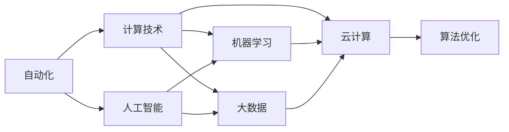
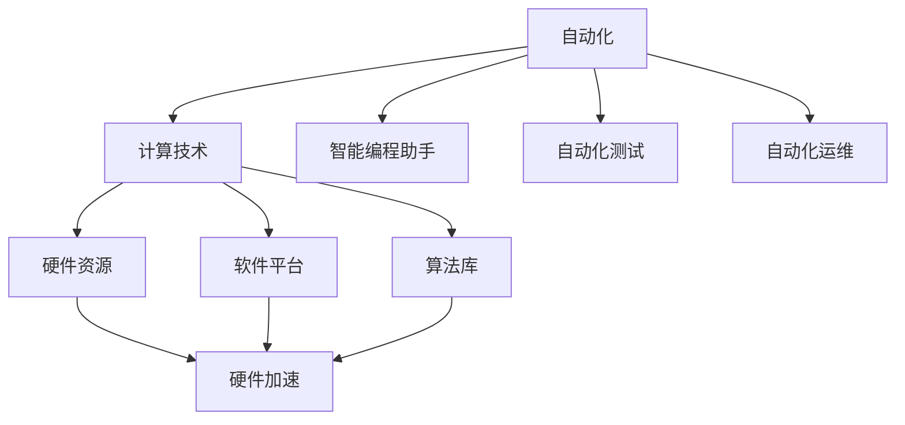
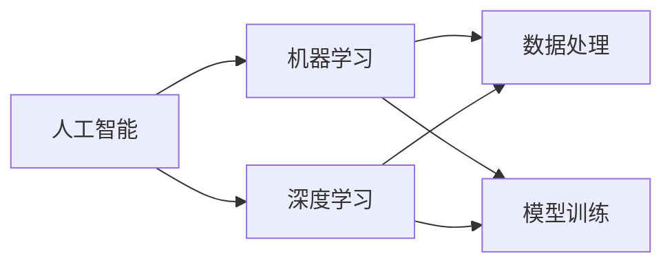
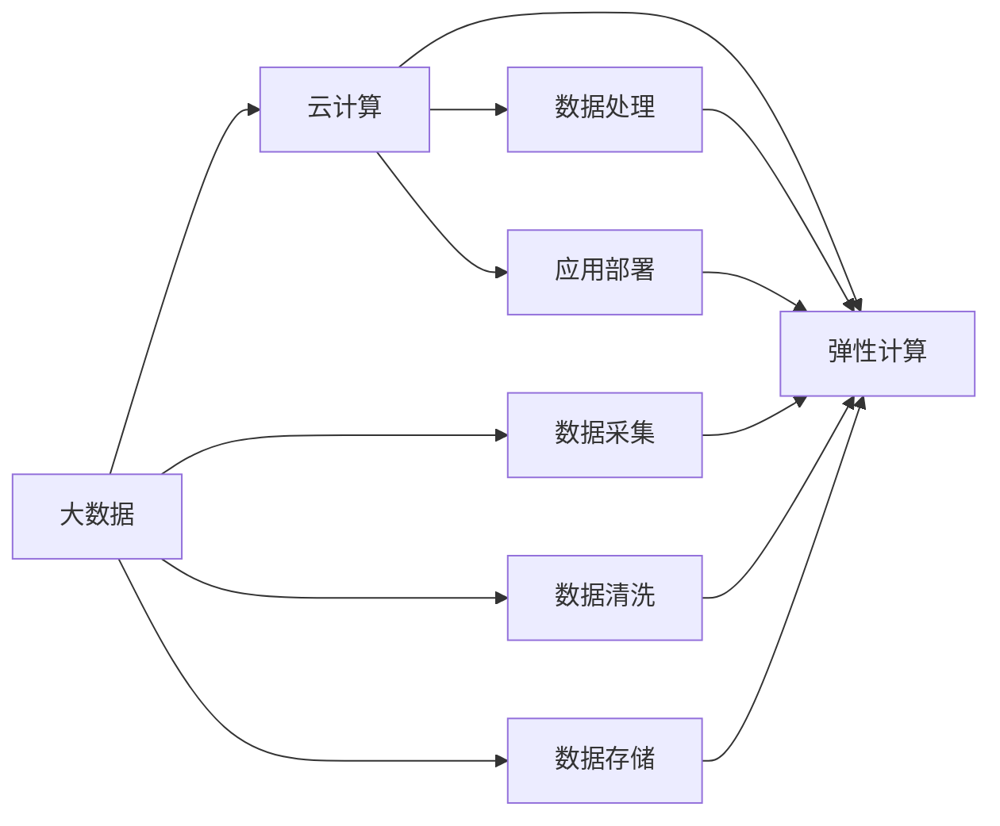
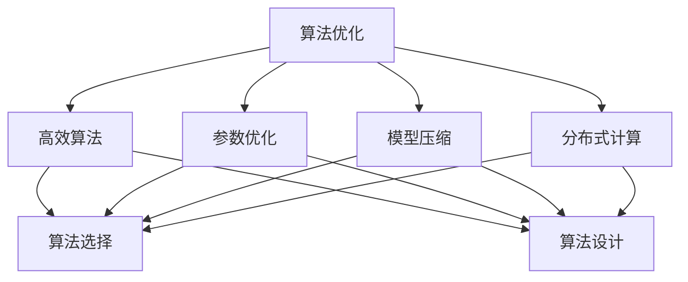
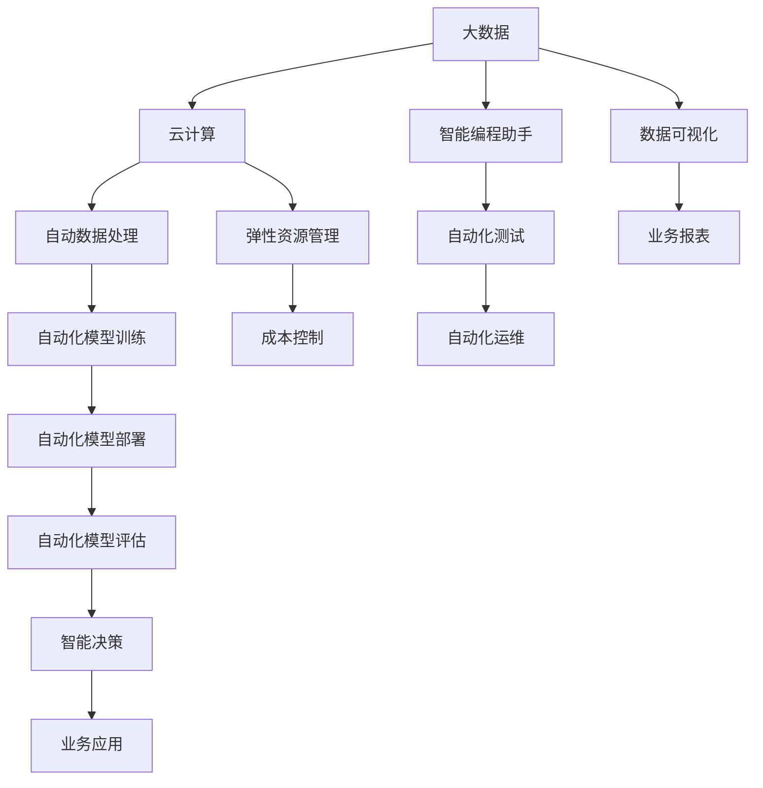

                 

# 计算领域的自动化发展趋势

> 关键词：自动化,计算技术,人工智能,机器学习,大数据,云计算,算法优化

## 1. 背景介绍

### 1.1 问题由来

随着信息技术的高速发展，计算领域正在经历一场深刻的自动化变革。从早期的程序化控制，到近年来的智能自动化，自动化技术在计算领域的应用已经深入到各个层面。这种变革不仅提高了工作效率，降低了人力成本，更在一定程度上推动了计算技术的发展和应用边界扩展。

### 1.2 问题核心关键点

自动化技术在计算领域的应用，主要集中在以下几个方面：

- 自动化编程：通过智能编程助手、代码生成器等工具，提升编程效率，降低错误率。
- 自动化测试：通过单元测试、集成测试、持续集成等技术，快速发现和修正代码中的问题。
- 自动化运维：通过自动化部署、监控、调优等工具，实现软件系统的自动化管理。
- 自动化数据分析：通过自动化的数据采集、清洗、分析等技术，提升数据处理效率，降低分析成本。
- 自动化机器学习：通过自动化模型训练、调参、评估等技术，加速机器学习模型的开发和优化。

自动化技术在计算领域的广泛应用，正在深刻改变计算资源的分配和使用方式，推动了计算技术和应用的发展。但与此同时，自动化技术也面临着诸多挑战，需要不断探索和创新，以应对新场景和新需求。

### 1.3 问题研究意义

研究计算领域的自动化发展趋势，对于理解未来计算技术的发展方向，提升自动化技术的应用水平，具有重要意义：

1. 推动技术创新：自动化技术的发展，有助于激发新的计算模型和算法，推动计算技术的前沿突破。
2. 提升生产力：通过自动化技术，大幅提升计算资源利用率和应用效率，降低成本，提升企业竞争力。
3. 促进行业发展：自动化技术在各行各业的应用，推动了行业的数字化转型，带来了新的增长点。
4. 增强用户体验：自动化技术在用户体验优化、智能客服等方面的应用，提升了用户满意度和使用体验。
5. 支持可持续发展：自动化技术在资源管理和节能减排方面的应用，有助于实现计算资源的可持续利用。

## 2. 核心概念与联系

### 2.1 核心概念概述

为更好地理解计算领域的自动化发展趋势，本节将介绍几个密切相关的核心概念：

- 自动化(Automation)：指利用计算机程序、硬件设备等自动化工具，自动执行任务或处理数据的过程。
- 计算技术(Computational Technology)：指使用计算机进行计算、处理和分析数据的技术，包括硬件、软件和算法等。
- 人工智能(Artificial Intelligence, AI)：指利用算法和模型，让计算机系统模拟人类智能行为的技术，涵盖感知、学习、推理等多个方面。
- 机器学习(Machine Learning, ML)：指利用数据训练模型，让计算机系统具备自主学习和适应能力的技术。
- 大数据(Big Data)：指规模庞大、类型多样、增长迅速的数据集，需要特殊的技术和算法进行处理。
- 云计算(Cloud Computing)：指通过互联网提供计算资源和服务，实现资源按需分配、弹性扩展的技术。
- 算法优化(Algorithm Optimization)：指通过改进算法设计或优化算法参数，提高算法性能和效率的过程。

这些核心概念之间的逻辑关系可以通过以下Mermaid流程图来展示：



这个流程图展示了一些关键概念的相互关系：

1. 自动化技术支持计算技术的发展，如智能编程助手、自动化测试等。
2. 人工智能与机器学习紧密相关，AI是ML的具体应用。
3. 大数据与云计算相辅相成，云计算为大数据处理提供了基础设施支持。
4. 算法优化贯穿于自动化、AI、ML等多个方面，是提升技术性能的重要手段。

### 2.2 概念间的关系

这些核心概念之间存在着紧密的联系，形成了计算领域自动化的完整生态系统。下面我通过几个Mermaid流程图来展示这些概念之间的关系。

#### 2.2.1 自动化与计算技术的关系



这个流程图展示了自动化技术在计算技术中的应用：

1. 自动化工具如智能编程助手、自动化测试、自动化运维等，支持计算资源的分配和使用。
2. 硬件资源、软件平台和算法库是计算技术的基础设施。
3. 自动化工具与基础设施的结合，推动了计算技术的全面自动化。

#### 2.2.2 人工智能与机器学习的关系



这个流程图展示了人工智能与机器学习的关系：

1. 人工智能包括感知、学习、推理等多个方面，机器学习是其中的重要组成部分。
2. 深度学习是机器学习的一种重要形式，利用神经网络模型进行复杂数据处理。
3. 数据处理和模型训练是机器学习的主要步骤，也是AI实现的基础。

#### 2.2.3 大数据与云计算的关系



这个流程图展示了大数据与云计算的关系：

1. 大数据涵盖数据采集、存储、清洗等多个环节。
2. 云计算提供弹性计算资源、数据处理和应用部署等基础设施支持。
3. 大数据与云计算的结合，实现了计算资源的全面自动化和优化。

#### 2.2.4 算法优化的方法



这个流程图展示了算法优化的主要方法：

1. 算法优化包括高效算法、参数优化、模型压缩等多个方面。
2. 算法选择和设计是算法优化的基础，高效算法和分布式计算是实现高性能和可扩展性的关键。
3. 参数优化和模型压缩则是提升计算效率和资源利用率的有效手段。

### 2.3 核心概念的整体架构

最后，我们用一个综合的流程图来展示这些核心概念在大数据和AI技术的应用中的整体架构：



这个综合流程图展示了大数据和AI技术在大规模自动化应用中的整体架构：

1. 大数据和云计算为自动化处理提供了基础设施支持。
2. 自动数据处理、模型训练、部署和评估等环节，实现了模型开发的全自动化。
3. 智能决策和业务应用，将自动化技术应用到具体业务场景中，提升了效率和效果。
4. 智能编程助手、自动化测试、自动化运维等工具，支持各环节的自动化执行。
5. 弹性资源管理和成本控制，优化了计算资源的使用和成本。
6. 数据可视化和业务报表，为决策提供直观的数据支持。

通过这些流程图，我们可以更清晰地理解计算领域自动化技术的应用过程和关键组件，为后续深入讨论具体的自动化方法和技术奠定基础。

## 3. 核心算法原理 & 具体操作步骤
### 3.1 算法原理概述

计算领域的自动化发展，离不开算法和模型的支持。下面将详细探讨几种典型的自动化算法和模型：

- 自动化编程：通过代码生成、自动化重构等技术，提升编程效率。
- 自动化测试：通过单元测试、集成测试等技术，快速发现和修复代码错误。
- 自动化运维：通过自动化部署、监控、调优等技术，实现软件系统的自动化管理。
- 自动化数据分析：通过自动化的数据采集、清洗、分析等技术，提升数据处理效率。
- 自动化机器学习：通过自动化的模型训练、调参、评估等技术，加速机器学习模型的开发和优化。

这些算法和模型共同构成了计算领域的自动化生态系统，推动了计算技术的全面自动化。

### 3.2 算法步骤详解

#### 3.2.1 自动化编程

自动化编程通过智能编程助手、代码生成器等工具，提升编程效率，降低错误率。

1. 智能编程助手：如GPT-4等AI编程助手，可以自动生成代码片段，辅助程序员编写程序。
2. 代码生成器：如PyCharm、VS Code等IDE中的代码自动补全功能，能够根据已有代码自动生成新的代码行。
3. 自动化重构：如Golang、Python等语言中的自动化重构工具，可以自动优化代码结构，提升代码质量。

#### 3.2.2 自动化测试

自动化测试通过单元测试、集成测试等技术，快速发现和修复代码错误。

1. 单元测试：使用测试框架（如JUnit、pytest等），对代码中的每个函数进行测试，保证代码的正确性。
2. 集成测试：对整个程序模块进行测试，验证模块之间的交互是否正确。
3. 持续集成（CI）：通过自动化测试工具（如Jenkins、Travis CI等），实现代码提交后的即时测试，及时发现和修复问题。

#### 3.2.3 自动化运维

自动化运维通过自动化部署、监控、调优等技术，实现软件系统的自动化管理。

1. 自动化部署：使用工具（如Ansible、Kubernetes等），自动执行软件发布和部署过程，减少人为操作。
2. 自动化监控：使用工具（如Prometheus、Grafana等），实时监控系统运行状态，自动告警和处理问题。
3. 自动化调优：使用工具（如New Relic、Dynatrace等），自动化优化系统性能，提升用户体验。

#### 3.2.4 自动化数据分析

自动化数据分析通过自动化的数据采集、清洗、分析等技术，提升数据处理效率。

1. 自动数据采集：使用工具（如Apache Nifi、Talend等），自动从多个数据源采集数据，降低人工操作成本。
2. 自动数据清洗：使用工具（如ETL工具、Pandas等），自动清洗数据中的噪声和异常，保证数据质量。
3. 自动数据分析：使用工具（如Python中的Pandas、NumPy等），自动执行数据分析任务，生成报表和图表。

#### 3.2.5 自动化机器学习

自动化机器学习通过自动化的模型训练、调参、评估等技术，加速机器学习模型的开发和优化。

1. 自动化模型训练：使用工具（如AutoML平台、Kubeflow等），自动选择和训练模型，快速完成模型开发。
2. 自动化调参：使用工具（如Hyperopt、Optuna等），自动搜索最优参数组合，提升模型性能。
3. 自动化评估：使用工具（如MLflow、TensorBoard等），自动评估模型性能，生成评估报告。

### 3.3 算法优缺点

#### 3.3.1 自动化编程

自动化编程的优点在于：

- 提高效率：智能编程助手和代码生成器能够快速生成代码，减少手动编写代码的时间。
- 降低错误率：自动化重构工具可以自动优化代码结构，提升代码质量和可维护性。
- 提升学习效果：通过智能编程助手和自动化重构工具，新手程序员可以更快地学习编程技能。

缺点在于：

- 依赖性较强：自动化工具的效果依赖于高质量的输入数据和算法模型。
- 理解难度高：智能编程助手和自动化重构工具的原理和使用方法较为复杂，需要一定的学习成本。
- 局限性较大：自动化编程无法替代程序员的创造性思维和复杂逻辑处理。

#### 3.3.2 自动化测试

自动化测试的优点在于：

- 提高测试效率：自动化测试能够快速发现和修复代码错误，提升测试速度。
- 降低测试成本：自动测试工具可以处理大量测试任务，降低人力成本。
- 提升代码质量：自动化测试工具能够全面覆盖代码，保证代码的正确性和稳定性。

缺点在于：

- 依赖测试环境：自动化测试依赖于测试环境和工具，可能存在环境不一致的问题。
- 维护成本高：自动测试工具需要持续维护和更新，以适应新需求和问题。
- 覆盖率有限：自动化测试可能无法覆盖所有测试场景，需要结合人工测试。

#### 3.3.3 自动化运维

自动化运维的优点在于：

- 提升运维效率：自动化部署和监控工具能够自动处理大部分运维任务，减少人为操作。
- 提高系统稳定性：自动监控工具能够及时发现系统异常，自动处理问题，提升系统稳定性。
- 优化资源使用：自动调优工具能够优化系统性能，提升资源利用率。

缺点在于：

- 依赖性强：自动化运维工具依赖于系统环境、硬件设备等基础设施，可能存在局限性。
- 复杂度高：自动化运维工具的配置和调试较为复杂，需要一定的技术背景。
- 安全风险高：自动化运维工具可能存在安全漏洞，需要严格的安全管理措施。

#### 3.3.4 自动化数据分析

自动化数据分析的优点在于：

- 提高数据处理效率：自动数据采集和清洗工具能够快速处理大量数据，提升处理效率。
- 提升数据质量：自动数据清洗工具能够去除噪声和异常，保证数据质量。
- 降低人工成本：自动数据分析工具能够自动生成报表和图表，减少人工工作量。

缺点在于：

- 依赖数据质量：自动化数据分析依赖于高质量的数据输入，可能存在数据偏差问题。
- 需要技术支持：自动数据分析工具需要一定的技术支持，可能存在学习成本和维护成本。
- 复杂度高：数据采集、清洗和分析等环节较为复杂，需要综合考虑数据源和业务需求。

#### 3.3.5 自动化机器学习

自动化机器学习的优点在于：

- 加速模型开发：自动化模型训练和调参工具能够快速完成模型开发，加速项目进度。
- 提升模型性能：自动化调参工具能够搜索最优参数组合，提升模型性能。
- 降低开发成本：自动化工具能够降低模型开发和调优的成本，提高开发效率。

缺点在于：

- 依赖数据质量：自动化机器学习依赖于高质量的数据和算法模型，可能存在偏差问题。
- 学习成本高：自动机器学习工具需要一定的学习成本，可能存在使用难度。
- 复杂度高：模型训练、调参和评估等环节较为复杂，需要综合考虑多方面因素。

### 3.4 算法应用领域

自动化技术在计算领域的应用已经涵盖了多个领域，以下是几个典型应用场景：

#### 3.4.1 软件开发

自动化编程技术广泛应用于软件开发领域，通过智能编程助手、代码生成器和自动化重构工具，提升程序员的开发效率和代码质量。如GitHub的代码智能提示功能、Microsoft的Visual Studio中的智能代码补全等。

#### 3.4.2 系统运维

自动化运维技术广泛应用于系统运维领域，通过自动化部署、监控和调优工具，实现软件系统的自动化管理。如Kubernetes的自动化部署、Dynatrace的自动调优等。

#### 3.4.3 数据处理

自动化数据分析技术广泛应用于数据处理领域，通过自动数据采集、清洗和分析工具，提升数据处理效率和数据质量。如Apache Nifi的数据自动化采集、Python中的Pandas库的数据清洗和分析功能等。

#### 3.4.4 机器学习

自动化机器学习技术广泛应用于机器学习领域，通过自动模型训练、调参和评估工具，加速机器学习模型的开发和优化。如AutoML平台、Kubeflow的自动化模型训练功能等。

## 4. 数学模型和公式 & 详细讲解 & 举例说明

### 4.1 数学模型构建

计算领域的自动化技术涉及到许多数学模型和算法。本节将使用数学语言对几种典型的自动化算法进行更严格的刻画。

#### 4.1.1 自动化编程模型

以智能编程助手为例，其核心算法包括：

1. 自然语言理解：将自然语言指令转换为计算机可执行的代码指令。
2. 代码生成：根据自然语言指令生成对应的代码。
3. 代码优化：对生成的代码进行优化，提升代码质量。

#### 4.1.2 自动化测试模型

以单元测试为例，其核心算法包括：

1. 测试用例设计：根据程序功能设计测试用例。
2. 测试执行：执行测试用例，获取测试结果。
3. 测试报告：生成测试报告，分析测试结果。

#### 4.1.3 自动化运维模型

以自动化部署为例，其核心算法包括：

1. 部署计划设计：根据系统需求设计部署计划。
2. 部署执行：执行部署计划，更新系统环境。
3. 部署监控：监控部署过程，及时发现和处理问题。

#### 4.1.4 自动化数据分析模型

以自动数据清洗为例，其核心算法包括：

1. 数据采集：从多个数据源采集数据。
2. 数据清洗：去除噪声和异常，保证数据质量。
3. 数据分析：对数据进行分析，生成报表和图表。

#### 4.1.5 自动化机器学习模型

以自动化调参为例，其核心算法包括：

1. 参数搜索：在参数空间中搜索最优参数组合。
2. 模型评估：评估模型性能，选择最优模型。
3. 模型优化：对模型进行优化，提升模型性能。

### 4.2 公式推导过程

#### 4.2.1 智能编程助手

以GPT-4为例，其核心算法可以表示为：

1. 输入解析：将自然语言指令解析为计算机可执行的代码指令。
2. 代码生成：根据解析后的代码指令生成对应的代码。
3. 代码优化：对生成的代码进行优化，提升代码质量。

#### 4.2.2 单元测试

以JUnit为例，其核心算法可以表示为：

1. 测试用例设计：根据程序功能设计测试用例。
2. 测试执行：执行测试用例，获取测试结果。
3. 测试报告：生成测试报告，分析测试结果。

#### 4.2.3 自动化部署

以Kubernetes为例，其核心算法可以表示为：

1. 部署计划设计：根据系统需求设计部署计划。
2. 部署执行：执行部署计划，更新系统环境。
3. 部署监控：监控部署过程，及时发现和处理问题。

#### 4.2.4 自动数据清洗

以Pandas为例，其核心算法可以表示为：

1. 数据采集：从多个数据源采集数据。
2. 数据清洗：去除噪声和异常，保证数据质量。
3. 数据分析：对数据进行分析，生成报表和图表。

#### 4.2.5 自动化调参

以Hyperopt为例，其核心算法可以表示为：

1. 参数搜索：在参数空间中搜索最优参数组合。
2. 模型评估：评估模型性能，选择最优模型。
3. 模型优化：对模型进行优化，提升模型性能。

### 4.3 案例分析与讲解

#### 4.3.1 智能编程助手案例

以GPT-4为例，其工作流程如图：

```
自然语言指令 -> 输入解析 -> 代码生成 -> 代码优化 -> 执行结果
```

在实际应用中，GPT-4首先接收用户的自然语言指令，如“打印当前时间”，然后解析指令，将其转换为计算机可执行的代码指令。接着，根据解析后的代码指令生成对应的代码，如`print(datetime.now())`。最后，对生成的代码进行优化，提升代码质量和性能，并执行代码，输出结果。

#### 4.3.2 单元测试案例

以JUnit为例，其工作流程如图：

```
测试用例设计 -> 测试执行 -> 测试报告
```

在实际应用中，JUnit首先根据程序功能设计测试用例，如`assertEqual(1+1, 2)`。然后，执行测试用例，获取测试结果。最后，生成测试报告，分析测试结果，如`OK (3 passed) / 3 tests`。

#### 4.3.3 自动化部署案例

以Kubernetes为例，其工作流程如图：

```
部署计划设计 -> 部署执行 -> 部署监控
```

在实际应用中，Kubernetes首先根据系统需求设计部署计划，如`kubectl apply -f deployment.yaml`。然后，执行部署计划，更新系统环境，如`kubectl apply -f deployment.yaml`。最后，监控部署过程，及时发现和处理问题，如`kubectl logs deployment/myapp`。

#### 4.3.4 自动数据清洗案例

以Pandas为例，其工作流程如图：

```
数据采集 -> 数据清洗 -> 数据分析
```

在实际应用中，Pandas首先从多个数据源采集数据，如`df = pd.read_csv('data.csv')`。然后，去除噪声和异常，保证数据质量，如`df.dropna()`。最后，对数据进行分析，生成报表和图表，如`df.describe()`。

#### 4.3.5 自动化调参案例

以Hyperopt为例，其工作流程如图：

```
参数搜索 -> 模型评估 -> 模型优化
```

在实际应用中，Hyperopt首先在参数空间中搜索最优参数组合，如`hyperopt.fmin(fn, space)`。然后，评估模型性能，选择最优模型，如`hyperopt.fmin(fn, space)`。最后，对模型进行优化，提升模型性能，如`hyperopt.fmin(fn, space)`。

## 5. 项目实践：代码实例和详细解释说明

### 5.1 开发环境搭建

在进行自动化技术实践前，我们需要准备好开发环境。以下是使用Python进行PyTorch开发的环境配置流程：

1. 安装Anaconda：从官网下载并安装Anaconda，用于创建独立的Python环境。

2. 创建并激活虚拟环境：
```bash
conda create -n pytorch-env python=3.8 
conda activate pytorch-env
```

3. 安装PyTorch：根据CUDA版本，从官网获取对应的安装命令。例如：
```bash
conda install pytorch torchvision torchaudio cudatoolkit=11.1 -c pytorch -c conda-forge
```

4. 安装TensorFlow：
```bash
conda install tensorflow -c conda-forge
```

5. 安装Transformers库：
```bash
pip install transformers
```

6. 安装各类工具包：
```bash
pip install numpy pandas scikit-learn matplotlib tqdm jupyter notebook ipython
```

完成上述步骤后，即可在`pytorch-env`环境中开始自动化技术实践。

### 5.2 源代码详细实现

这里我们以机器学习模型的自动化调参为例，给出使用Hyperopt进行参数优化的PyTorch代码实现。

首先，定义模型和优化器：

```python
import torch
import torch.nn as nn
from torch.optim import Adam
from hyperopt import hp, tpe, fmin

class MLP(nn.Module):
    def __init__(self):
        super(MLP, self).__init__()
        self.fc1 = nn.Linear(784, 128)
        self.fc2 = nn.Linear(128, 64)
        self.fc3 = nn.Linear(64, 10)

    def forward(self, x):
        x = torch.relu(self.fc1(x))
        x = torch.relu(self.fc2(x))
        x = self.fc3(x)
        return x

model = MLP()
optimizer = Adam(model.parameters(), lr=0.001)

def objective(params):
    model.load_state_dict({
        'fc1.weight': params['fc1_weight'],
        'fc1.bias': params['fc1_bias'],
        'fc2.weight': params['fc2_weight'],
        'fc2.bias': params['fc2_bias'],
        'fc3.weight': params['fc3_weight'],
        'fc3.bias': params['fc3_bias']
    })
    optimizer.load_state_dict({
        'lr': params['lr']
    })
    model.train()
    data_loader = torch.utils.data.DataLoader(train_dataset, batch_size=64, shuffle=True)
    total_loss = 0
    for batch_idx, (data, target) in enumerate(data_loader):
        optimizer.zero_grad()
        output = model(data)
        loss = nn.CrossEntropyLoss()(output, target)
        loss.backward()
        optimizer.step()
        total_loss += loss.item()
    return total_loss / len(data_loader)

# 定义参数搜索空间
param_space = {
    'fc1

