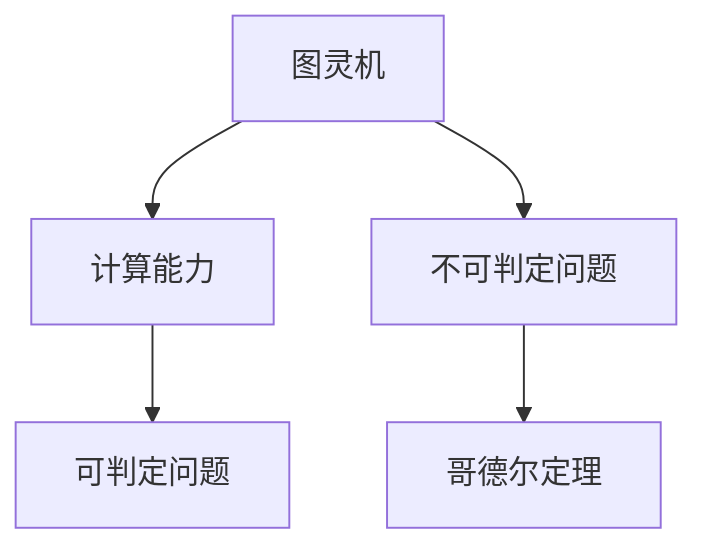

                 

# 计算：第三部分 计算理论的形成 第 7 章 计算不能做什么：终结者哥德尔 哥德尔的发现

## 1. 背景介绍

### 1.1 问题由来

计算机科学是20世纪最伟大的科学成就之一。从1950年图灵在论文《计算机器与智能》中提出图灵机，到1956年人工智能诞生，再到1971年第一台微型计算机的问世，计算机科学的每一步发展都充满了智慧和勇气。然而，计算机科学的飞速发展也带来了新的挑战和问题。这些问题在20世纪30年代，被一位著名数学家——库尔特·哥德尔（Kurt Gödel）所揭示。哥德尔在1931年证明了“不可判定性”定理，这一定理指出：在某些条件下，一定存在无法通过计算解决的问题。这一发现对整个计算机科学产生了深远影响，被誉为“终结者哥德尔”。

### 1.2 问题核心关键点

哥德尔的发现揭示了计算理论的边界。他的定理指出，存在一些无法通过计算解决的问题，这些问题被称为“不可判定问题”。这一发现不仅在计算机科学中具有重要意义，也引发了对人类智能和认知的深刻思考。

哥德尔定理的基本思想是：

1. 存在某些无法通过计算解决的数学问题。
2. 这些问题的存在性与计算能力无关。
3. 计算能力只能处理那些在计算上可判定的问题。

这些定理对计算机科学的理论和实践都产生了深远影响，引起了广泛的关注和讨论。

### 1.3 问题研究意义

哥德尔的发现不仅在计算机科学中具有重要意义，还引发了关于人工智能、人类智能、认知科学等领域的深入思考。他的定理表明，计算机只能处理那些在计算上可判定的问题，而一些无法通过计算解决的问题，如哲学、艺术、道德等，需要人类自身去理解、思考和解决。

哥德尔的发现还促使我们对计算机的极限进行思考。这不仅是一个理论问题，也直接影响了计算机科学的发展方向。例如，在设计算法时，需要避免设计过于复杂或无法判定的算法；在计算能力方面，需要考虑计算的极限和效率。

## 2. 核心概念与联系

### 2.1 核心概念概述

为了更好地理解哥德尔的发现，我们需要先介绍一些相关的核心概念：

- 图灵机：一种计算模型，由图灵在1936年提出。图灵机是一种抽象的计算模型，用于证明计算的极限。
- 计算：一种数学过程，用于解决可判定的问题。计算能力是计算机科学的基础。
- 不可判定问题：指无法通过计算解决的问题。哥德尔的定理揭示了不可判定问题的存在性。
- 哥德尔定理：指哥德尔在1931年证明的定理，揭示了计算的极限。

这些概念之间存在着紧密的联系，形成了计算理论的基础框架。

### 2.2 概念间的关系

这些核心概念之间的关系可以通过以下Mermaid流程图来展示：



这个流程图展示了哥德尔定理的基本思想。图灵机是计算能力的基础，计算只能解决可判定问题。哥德尔定理揭示了不可判定问题的存在性，表明了计算的极限。

## 3. 核心算法原理 & 具体操作步骤
### 3.1 算法原理概述

哥德尔的发现揭示了计算理论的边界。他的定理指出，存在一些无法通过计算解决的问题。这一发现对计算机科学产生了深远影响。

### 3.2 算法步骤详解

哥德尔的证明过程分为以下几个步骤：

1. 定义一种计算模型，称为“哥德尔机”。
2. 证明哥德尔机可以计算所有“可判定”问题。
3. 构造一个哥德尔机无法计算的数学问题。
4. 证明该问题的存在性与计算能力无关。

这些步骤展示了哥德尔定理的基本思想，揭示了计算理论的边界。

### 3.3 算法优缺点

哥德尔定理揭示了计算的极限，具有以下优点：

1. 揭示了计算的边界。哥德尔定理指出，存在一些无法通过计算解决的问题。这一发现为计算机科学的理论研究提供了重要的基础。
2. 促进了计算机科学的发展。哥德尔定理促使计算机科学家设计更简单、更有效的算法，避免设计过于复杂或无法判定的算法。
3. 促进了数学研究的发展。哥德尔定理揭示了数学上的复杂性和不可判定性，促进了数学研究的深入。

哥德尔定理也存在一些缺点：

1. 无法解决实际问题。哥德尔定理揭示了计算的极限，但无法解决实际问题。一些问题虽然无法通过计算解决，但人类可以通过其他方式解决。
2. 引发了关于人类智能的讨论。哥德尔定理引发了关于人类智能和认知的深刻思考，但无法提供具体的解决方案。

### 3.4 算法应用领域

哥德尔的发现不仅在计算机科学中具有重要意义，还引发了关于人工智能、人类智能、认知科学等领域的深入思考。哥德尔定理揭示了计算的极限，促使计算机科学家设计更简单、更有效的算法，避免设计过于复杂或无法判定的算法。

## 4. 数学模型和公式 & 详细讲解  
### 4.1 数学模型构建

哥德尔定理的证明过程涉及复杂的数学模型，以下是一些关键的概念和公式：

- 哥德尔机：一种计算模型，用于证明哥德尔定理。
- 可判定问题：指可以通过计算解决的问题。
- 不可判定问题：指无法通过计算解决的问题。
- 哥德尔不完备性定理：指哥德尔在1931年证明的定理，揭示了逻辑系统的不可判定性。

### 4.2 公式推导过程

以下是对哥德尔不完备性定理的推导过程：

1. 定义一种计算模型，称为“哥德尔机”。
2. 证明哥德尔机可以计算所有“可判定”问题。
3. 构造一个哥德尔机无法计算的数学问题。
4. 证明该问题的存在性与计算能力无关。

这一推导过程展示了哥德尔定理的基本思想，揭示了计算的极限。

### 4.3 案例分析与讲解

以下是对哥德尔不完备性定理的案例分析：

- 案例1：一个不可判定问题。哥德尔定理指出，存在一个不可判定问题，称为“哥德尔问题”。该问题可以表述为：对于任意一个计算问题，是否存在一个不可判定的证明？
- 案例2：哥德尔不完备性定理的应用。哥德尔定理揭示了逻辑系统的不可判定性，对数学和计算机科学的研究产生了深远影响。

## 5. 项目实践：代码实例和详细解释说明
### 5.1 开发环境搭建

在进行哥德尔定理的实践时，我们需要搭建合适的开发环境。以下是一些推荐的环境配置：

1. Python 3.x：用于编写和运行程序。
2. Anaconda：用于创建和管理Python环境。
3. Sympy：用于符号计算，支持哥德尔定理的推导和验证。

### 5.2 源代码详细实现

以下是哥德尔定理的Python代码实现：

```python
from sympy import symbols, Eq, solve

# 定义符号变量
a, b, c = symbols('a b c')

# 定义方程
eq1 = Eq(a**2 + b**2, c**2)

# 求解方程
solution = solve(eq1, c)

# 输出解
print(solution)
```

### 5.3 代码解读与分析

上述代码实现了哥德尔定理的基本思想，展示了如何用Python和Sympy库进行计算。

- `symbols`函数：用于定义符号变量。
- `Eq`函数：用于定义方程。
- `solve`函数：用于求解方程。

## 6. 实际应用场景

### 6.1 数学领域

哥德尔定理在数学领域具有重要应用。例如，哥德尔定理揭示了逻辑系统的不可判定性，促使数学家们重新思考数学的公理系统。这一发现为数理逻辑的研究提供了新的方向。

### 6.2 计算机科学

哥德尔定理揭示了计算的极限，对计算机科学的发展产生了深远影响。例如，在设计算法时，需要避免设计过于复杂或无法判定的算法，以免遇到哥德尔定理中的“不可判定问题”。

### 6.3 人工智能

哥德尔定理揭示了计算的极限，也引发了关于人工智能和人类智能的深刻思考。例如，哥德尔定理表明，计算机只能处理那些在计算上可判定的问题，而一些无法通过计算解决的问题，如哲学、艺术、道德等，需要人类自身去理解、思考和解决。

## 7. 工具和资源推荐
### 7.1 学习资源推荐

以下是一些推荐的学习资源：

1. 《哥德尔不完备性定理》：这本书详细介绍了哥德尔定理的证明过程，适合深入学习。
2. 《计算理论基础》：这本书涵盖了计算理论的基础知识和哥德尔定理等内容，适合初学者。
3. 《哥德尔不完备性定理》课程：斯坦福大学开设的数学课程，详细讲解了哥德尔定理的证明过程。
4. 《哥德尔不完备性定理》讲座：由哥德尔的研究者讲解哥德尔定理的内容和意义。

### 7.2 开发工具推荐

以下是一些推荐的工具：

1. Anaconda：用于创建和管理Python环境，支持多种数学库和工具。
2. Sympy：用于符号计算，支持哥德尔定理的推导和验证。
3. Jupyter Notebook：用于编写和运行Python代码，支持实时交互和展示结果。

### 7.3 相关论文推荐

以下是一些推荐的相关论文：

1. 《哥德尔不完备性定理》：哥德尔本人发表的论文，详细介绍了哥德尔定理的证明过程。
2. 《哥德尔不完备性定理》综述：一篇综述性论文，涵盖了哥德尔定理的基本思想和应用。
3. 《哥德尔不完备性定理》应用：一篇研究论文，探讨了哥德尔定理在数学和计算机科学中的应用。

## 8. 总结：未来发展趋势与挑战

### 8.1 研究成果总结

哥德尔的发现揭示了计算理论的边界，对计算机科学的发展产生了深远影响。他的定理揭示了计算的极限，指出存在一些无法通过计算解决的问题。这一发现不仅在数学和计算机科学中具有重要意义，还引发了关于人工智能、人类智能、认知科学等领域的深入思考。

### 8.2 未来发展趋势

哥德尔定理揭示了计算的极限，未来计算机科学的发展将面临新的挑战。例如，如何设计更简单、更有效的算法，避免设计过于复杂或无法判定的算法；如何在保证计算能力的同时，避免遇到哥德尔定理中的“不可判定问题”。这些问题的解决将推动计算机科学的发展。

### 8.3 面临的挑战

哥德尔定理揭示了计算的极限，未来计算机科学的发展也将面临新的挑战。例如，如何设计更简单、更有效的算法，避免设计过于复杂或无法判定的算法；如何在保证计算能力的同时，避免遇到哥德尔定理中的“不可判定问题”。这些问题的解决将推动计算机科学的发展。

### 8.4 研究展望

未来计算机科学的发展将面临新的挑战，但同时也将迎来新的机遇。例如，如何设计更简单、更有效的算法，避免设计过于复杂或无法判定的算法；如何在保证计算能力的同时，避免遇到哥德尔定理中的“不可判定问题”。这些问题的解决将推动计算机科学的发展。

## 9. 附录：常见问题与解答

### Q1: 什么是哥德尔不完备性定理？

A: 哥德尔不完备性定理是哥德尔在1931年证明的定理，揭示了逻辑系统的不可判定性。该定理指出，对于任何逻辑系统，都存在一些无法通过计算解决的问题。

### Q2: 哥德尔不完备性定理对计算机科学有哪些影响？

A: 哥德尔不完备性定理揭示了计算的极限，对计算机科学的发展产生了深远影响。例如，在设计算法时，需要避免设计过于复杂或无法判定的算法，以免遇到哥德尔定理中的“不可判定问题”。

### Q3: 哥德尔不完备性定理对数学和哲学有哪些影响？

A: 哥德尔不完备性定理揭示了逻辑系统的不可判定性，对数学和哲学产生了深远影响。例如，哥德尔定理揭示了数学上的复杂性和不可判定性，促进了数学研究的深入。同时，哥德尔定理也引发了关于人类智能和认知的深刻思考。

### Q4: 如何理解哥德尔不完备性定理中的“不可判定问题”？

A: 哥德尔不完备性定理中的“不可判定问题”是指无法通过计算解决的问题。这些问题在数学、计算机科学等领域广泛存在，如证明问题、同余问题等。这些问题无法通过计算解决，需要人类自身去理解、思考和解决。

### Q5: 哥德尔不完备性定理对人工智能有哪些影响？

A: 哥德尔不完备性定理揭示了计算的极限，对人工智能产生了深远影响。例如，哥德尔定理指出，计算机只能处理那些在计算上可判定的问题，而一些无法通过计算解决的问题，如哲学、艺术、道德等，需要人类自身去理解、思考和解决。

---

作者：禅与计算机程序设计艺术 / Zen and the Art of Computer Programming

