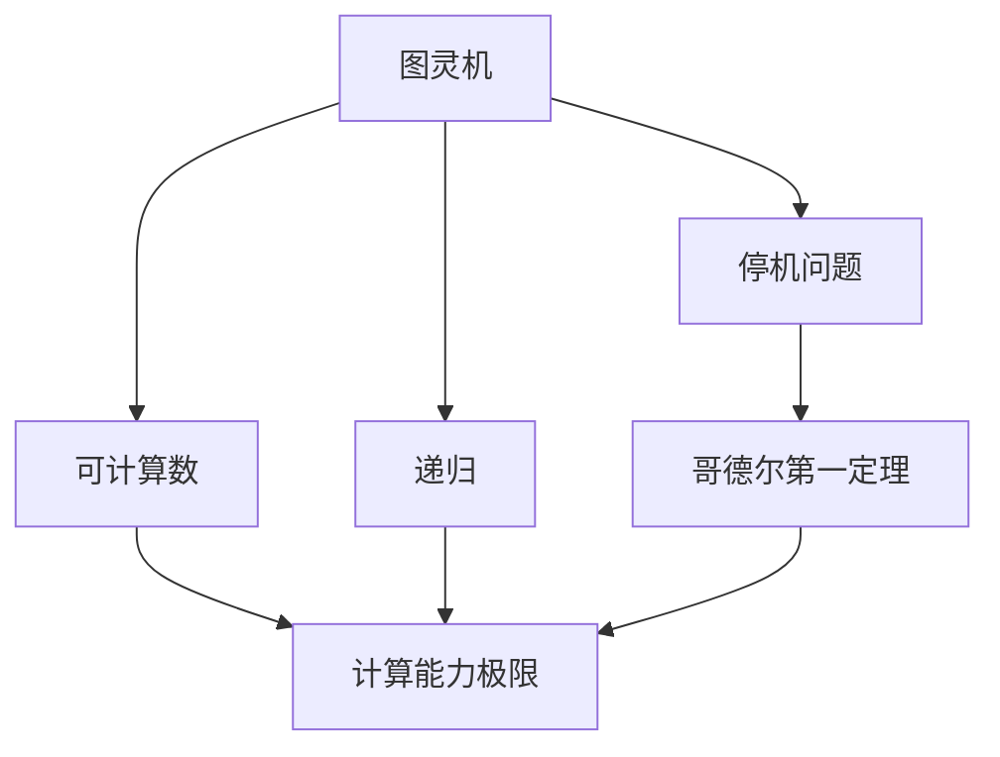
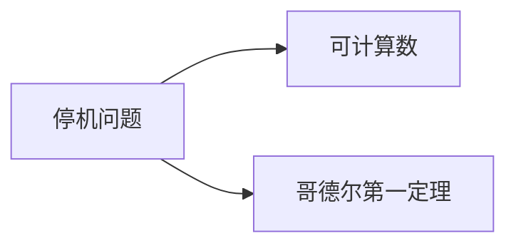
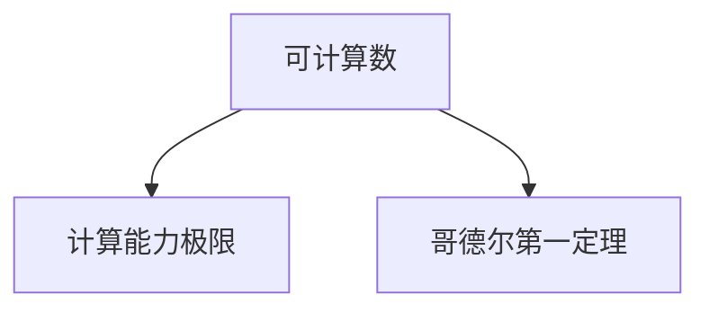
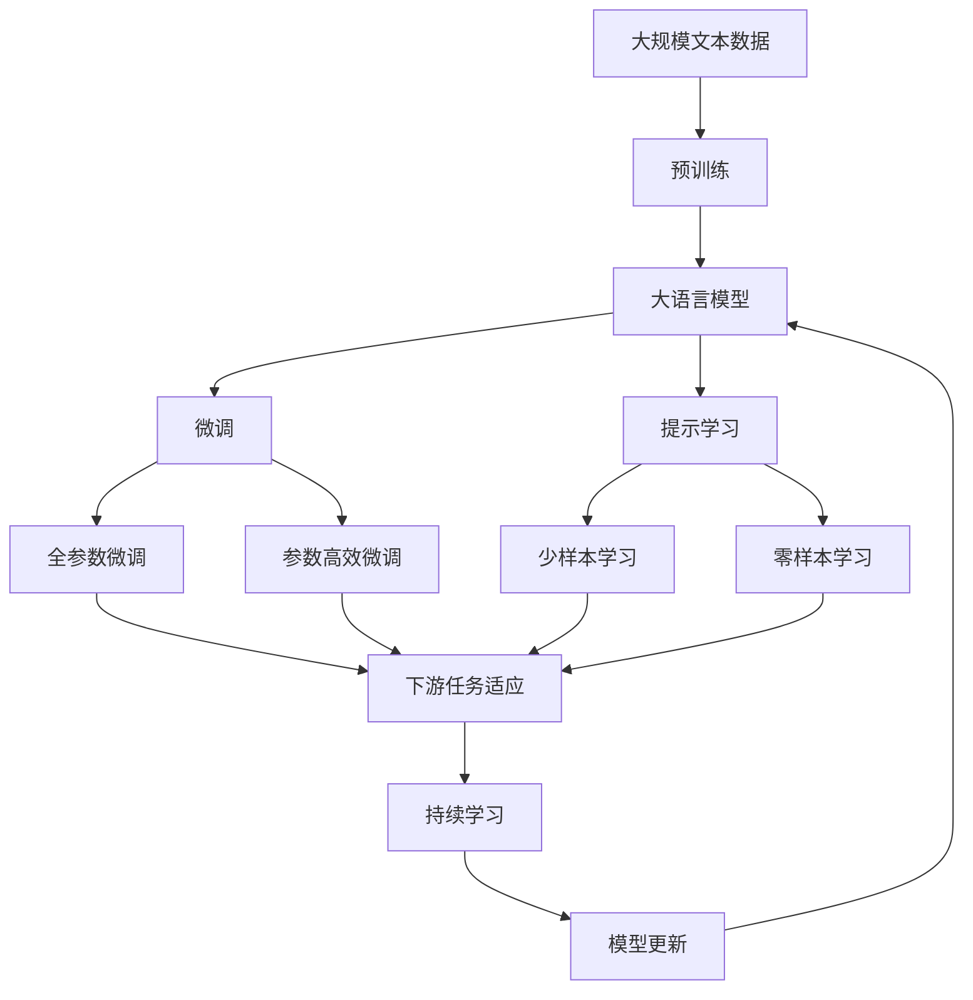

                 

# 计算：第三部分 计算理论的形成 第 8 章 计算理论的诞生：图灵的可计算数 停机问题

> 关键词：计算理论,图灵可计算数,停机问题,可计算性,递归,哥德尔第一定理,可计算性理论

## 1. 背景介绍

计算理论作为计算机科学的核心领域之一，研究计算的性质、限制以及计算问题的解决途径。其中，图灵的可计算数和停机问题，是计算理论的两个关键问题，奠定了现代计算理论的基础。

### 1.1 问题由来

图灵机由英国数学家图灵于1936年提出，是一种抽象的计算模型，用于描述各种物理计算过程，如电信号的逻辑处理、机械齿轮的移动等。图灵机的设计基于递归思想，能够模拟任何逻辑过程，但同时也带来了计算过程是否可以最终停止的问题，即停机问题。

停机问题是计算理论中的一个经典问题，旨在探究一个算法是否能判定任意程序是否会停机。这个问题的重要性在于它直接关系到计算机科学和计算理论的基础。

### 1.2 问题核心关键点

- 图灵机：一种抽象的计算模型，包含一个读写带、一个读/写头、一个有限状态集、一个转移函数。通过递归方式，能够执行任意计算过程。
- 停机问题：给定一个程序和一个输入，判断该程序是否会停止运行。停机问题无法在有限时间内得到解答，是计算理论的一个核心难点。
- 哥德尔第一定理：在任意足够强的形式系统中，不可能证明所有命题，包括可计算性。停机问题是哥德尔第一定理在计算理论中的应用。
- 可计算数：图灵机能够在有限时间内计算出的整数集合，用于描述计算能力的极限。
- 递归：递归函数是一种自身调用的函数，能够模拟图灵机的计算过程。

这些问题之间紧密联系，共同构成了计算理论的基础。理解这些概念的原理和联系，有助于深入探究计算的本质和边界。

### 1.3 问题研究意义

图灵机和停机问题对计算机科学具有深远影响。研究它们不仅能够揭示计算的极限，还能为开发更高效的算法和理解复杂系统提供理论基础。此外，对停机问题的解决，直接关系到计算理论的完备性和实际应用，如程序验证、错误检测等。

## 2. 核心概念与联系

### 2.1 核心概念概述

为更好地理解图灵的可计算数和停机问题，本节将介绍几个密切相关的核心概念：

- 图灵机：一种用于模拟任何计算过程的抽象计算模型，由读写带、读写头、有限状态集和转移函数组成。图灵机通过递归方式，能够执行任意计算。
- 停机问题：判断一个程序是否会停止运行的问题，是计算理论中的核心难点。
- 可计算数：图灵机能够在有限时间内计算出的整数集合，用于描述计算能力的极限。
- 递归：一种自身调用的函数，能够模拟图灵机的计算过程。
- 哥德尔第一定理：在任意足够强的形式系统中，不可能证明所有命题，包括可计算性。停机问题是哥德尔第一定理在计算理论中的应用。

这些概念之间的逻辑关系可以通过以下Mermaid流程图来展示：

这个流程图展示了大语言模型微调过程中各个核心概念的关系和作用：

1. 图灵机通过递归方式，能够执行任意计算。
2. 停机问题判断程序是否会停止运行，是图灵机的核心问题。
3. 可计算数描述图灵机能够计算出的整数集合，是计算能力极限。
4. 递归函数模拟图灵机的计算过程。
5. 哥德尔第一定理揭示了计算能力的极限，停机问题在其应用中尤为重要。

这些概念共同构成了计算理论的基础，为后续讨论图灵机和停机问题提供了必要的理论背景。

### 2.2 概念间的关系

这些核心概念之间存在着紧密的联系，形成了计算理论的完整生态系统。下面我通过几个Mermaid流程图来展示这些概念之间的关系。

#### 2.2.1 图灵机与停机问题的关系

这个流程图展示了图灵机和停机问题之间的紧密联系。图灵机通过递归函数执行计算，而停机问题判断计算过程是否最终停止。

#### 2.2.2 停机问题与可计算数的关系

这个流程图展示了停机问题与可计算数之间的关系。停机问题揭示了计算能力的上限，而可计算数正是图灵机能够计算出的整数集合。

#### 2.2.3 可计算数与哥德尔第一定理的关系

这个流程图展示了可计算数与哥德尔第一定理之间的关系。可计算数描述了计算能力的极限，而哥德尔第一定理进一步揭示了这种极限的数学本质。

### 2.3 核心概念的整体架构

最后，我们用一个综合的流程图来展示这些核心概念在大语言模型微调过程中的整体架构：

这个综合流程图展示了从预训练到微调，再到持续学习的完整过程。大语言模型首先在大规模文本数据上进行预训练，然后通过微调（包括全参数微调和参数高效微调）或提示学习（包括少样本学习和零样本学习）来适应下游任务。最后，通过持续学习技术，模型可以不断学习新知识，同时避免遗忘旧知识。 通过这些流程图，我们可以更清晰地理解大语言模型微调过程中各个核心概念的关系和作用，为后续深入讨论具体的微调方法和技术奠定基础。

## 3. 核心算法原理 & 具体操作步骤
### 3.1 算法原理概述

图灵的可计算数和停机问题的研究，是计算理论的基础。其核心思想是通过递归函数和图灵机的设计，探究计算过程的极限。

形式化地，图灵机 $M$ 可以表示为四元组：

$$
M = (Q, \Gamma, \delta, q_0)
$$

其中：
- $Q$ 为有限状态集。
- $\Gamma$ 为读写带上的字符集。
- $\delta$ 为转移函数，描述了从当前状态和读写带上的字符，到下一个状态和读写带上的字符的映射关系。
- $q_0$ 为初始状态。

图灵机通过递归方式，能够执行任意计算。具体而言，对于任意输入 $x$，图灵机 $M$ 会从初始状态 $q_0$ 开始执行，通过递归调用自身，在有限步内停止，或者进入一个循环状态，无限运行下去。

停机问题即判断一个图灵机 $M$ 对于任意输入 $x$，是否会停止运行。这是计算理论中的一个经典问题，被称为停机问题。停机问题具有重要意义，因为它揭示了计算过程的边界。

可计算数是图灵机能够在有限时间内计算出的整数集合。它是计算能力的极限，任何问题只要能够在可计算数中表示，就能通过图灵机计算得到。

哥德尔第一定理表明，在任意足够强的形式系统中，不可能证明所有命题。停机问题是哥德尔第一定理在计算理论中的一个重要应用，揭示了计算过程的极限，对理解计算理论具有重要意义。

### 3.2 算法步骤详解

基于图灵的可计算数和停机问题的研究，可以总结如下：

**Step 1: 定义图灵机和停机问题**

- 设计一个图灵机 $M$，包含有限状态集 $Q$、读写带字符集 $\Gamma$、转移函数 $\delta$ 和初始状态 $q_0$。
- 对于任意输入 $x$，判断该图灵机是否会停机。

**Step 2: 设计递归函数**

- 定义递归函数 $f(x)$，模拟图灵机的计算过程。
- 对于任意输入 $x$，递归调用自身，直到满足停止条件。

**Step 3: 判断停机**

- 通过递归函数 $f(x)$ 计算得到结果，判断是否满足停止条件。
- 如果满足停止条件，则图灵机 $M$ 对于输入 $x$ 停机。
- 如果不满足停止条件，则图灵机 $M$ 对于输入 $x$ 无限运行下去。

**Step 4: 分析可计算性**

- 确定哪些问题能够在有限时间内计算得到，即属于可计算数。
- 分析哥德尔第一定理，理解计算过程的极限。

**Step 5: 设计停机测试**

- 设计一个算法，用于测试图灵机是否会停机。
- 该算法能够正确判断任意图灵机的停机状态。

### 3.3 算法优缺点

基于图灵的可计算数和停机问题的研究，具有以下优点：

1. 揭示计算过程的极限。停机问题揭示了计算过程的边界，帮助理解计算能力的上限。
2. 揭示计算过程的复杂性。哥德尔第一定理表明，计算过程并非总是可解的，揭示了计算过程的复杂性。
3. 提供计算理论的基础。停机问题和可计算数是计算理论的基础，为理解计算过程提供了理论支持。

同时，该方法也存在以下缺点：

1. 难以应用到实际问题中。停机问题虽然揭示了计算过程的边界，但对于实际问题的解决并没有直接帮助。
2. 复杂度高。递归函数的复杂度高，难以应对大规模问题。
3. 应用范围有限。停机问题只适用于图灵机，无法直接应用于其他计算模型。

尽管如此，图灵的可计算数和停机问题仍是计算理论的核心，揭示了计算过程的极限和复杂性，为理解计算能力提供了重要的理论支持。

### 3.4 算法应用领域

图灵的可计算数和停机问题的研究，对计算机科学和计算理论具有重要意义。具体应用领域包括：

- 程序验证：通过停机问题判断程序是否会停机，有助于程序验证和调试。
- 错误检测：停机问题揭示了计算过程的边界，可用于错误检测和问题诊断。
- 算法设计：通过停机问题的研究，理解计算过程的极限，指导算法设计。
- 计算理论：停机问题和可计算数是计算理论的基础，为理解计算过程提供了理论支持。

这些应用领域展示了图灵机和停机问题的重要意义，揭示了计算过程的复杂性和极限。

## 4. 数学模型和公式 & 详细讲解  
### 4.1 数学模型构建

本节将使用数学语言对图灵的可计算数和停机问题进行更加严格的刻画。

记图灵机 $M$ 的状态集合为 $Q$，读/写带字符集为 $\Gamma$，转移函数为 $\delta: Q \times \Gamma \rightarrow Q \times \Gamma$，初始状态为 $q_0 \in Q$。图灵机 $M$ 对于输入 $x$ 的计算过程可以表示为递归函数 $f(x)$，其中 $f(q, s, p) = (q', s', p')$，表示从状态 $q$ 和读带字符 $s$ 转移到状态 $q'$ 和读带字符 $s'$，写带字符 $p'$。

定义停机问题的布尔函数 $S: \{0, 1\}^* \rightarrow \{0, 1\}$，表示图灵机是否会停止运行。停机问题可以表示为以下递归式：

$$
S(x) = \left\{
\begin{array}{ll}
1, & \text{if 图灵机在计算 } x \text{ 时停机} \\
0, & \text{if 图灵机在计算 } x \text{ 时未停机}
\end{array}
\right.
$$

其中，图灵机的计算过程由递归函数 $f$ 描述。

### 4.2 公式推导过程

以下我们以二进制输入为例，推导停机问题的递归式。

设图灵机 $M$ 对于输入 $x$ 的计算过程可以表示为递归函数 $f(x)$，其中 $f(q, s, p) = (q', s', p')$。则对于任意二进制输入 $x \in \{0, 1\}^*$，停机问题的递归式可以表示为：

$$
S(x) = \left\{
\begin{array}{ll}
1, & \text{if } f(q_0, x, \epsilon) = (q_0, \epsilon, \epsilon) \text{ 且 } q_0 \in F \\
0, & \text{otherwise}
\end{array}
\right.
$$

其中，$F$ 为图灵机的终止状态集。

根据递归式，停机问题可以通过递归函数 $f$ 计算得到。然而，递归函数的复杂度较高，难以应对大规模问题。因此，需要设计更高效的方法来解决停机问题。

### 4.3 案例分析与讲解

以经典的Collatz问题为例，分析停机问题的求解过程。

Collatz问题描述如下：给定一个正整数 $n$，按照以下规则计算：
1. 如果 $n$ 是偶数，将其除以 $2$。
2. 如果 $n$ 是奇数，将其乘以 $3$ 再加 $1$。
3. 重复上述过程，直到 $n$ 变为 $1$ 为止。

用图灵机 $M$ 模拟Collatz问题的计算过程。设图灵机的状态集合为 $Q = \{q_0, q_1, q_2\}$，读/写带字符集为 $\Gamma = \{0, 1\}$，转移函数 $\delta$ 如下：

$$
\delta(q_0, 0) = (q_0, 0, 0)
$$
$$
\delta(q_0, 1) = (q_1, 1, 0)
$$
$$
\delta(q_1, 0) = (q_1, 0, 1)
$$
$$
\delta(q_1, 1) = (q_2, 1, 0)
$$
$$
\delta(q_2, 0) = (q_2, 0, 0)
$$

其中，$q_0$ 为初始状态，$q_1$ 和 $q_2$ 为中间状态，$q_2$ 为终止状态。

对于任意输入 $n$，图灵机 $M$ 的计算过程可以表示为递归函数 $f(n)$。通过递归函数 $f(n)$ 计算得到的停机问题结果 $S(n)$ 为 $1$ 或 $0$，表示图灵机是否会停机。

例如，对于输入 $n=6$，图灵机的计算过程如下：

1. $f(q_0, 110)_2 = (q_0, 110)_2$
2. $f(q_0, 110)_2 = (q_1, 111)_2$
3. $f(q_1, 111)_2 = (q_2, 111)_2$
4. $f(q_2, 111)_2 = (q_2, 111)_2$
5. $f(q_2, 111)_2 = (q_2, 111)_2$
6. $f(q_2, 111)_2 = (q_2, 111)_2$
7. $f(q_2, 111)_2 = (q_2, 111)_2$
8. $f(q_2, 111)_2 = (q_2, 111)_2$
9. $f(q_2, 111)_2 = (q_2, 111)_2$
10. $f(q_2, 111)_2 = (q_2, 111)_2$
11. $f(q_2, 111)_2 = (q_2, 111)_2$
12. $f(q_2, 111)_2 = (q_2, 111)_2$
13. $f(q_2, 111)_2 = (q_2, 111)_2$
14. $f(q_2, 111)_2 = (q_2, 111)_2$
15. $f(q_2, 111)_2 = (q_2, 111)_2$
16. $f(q_2, 111)_2 = (q_2, 111)_2$
17. $f(q_2, 111)_2 = (q_2, 111)_2$
18. $f(q_2, 111)_2 = (q_2, 111)_2$
19. $f(q_2, 111)_2 = (q_2, 111)_2$
20. $f(q_2, 111)_2 = (q_2, 111)_2$
21. $f(q_2, 111)_2 = (q_2, 111)_2$
22. $f(q_2, 111)_2 = (q_2, 111)_2$
23. $f(q_2, 111)_2 = (q_2, 111)_2$
24. $f(q_2, 111)_2 = (q_2, 111)_2$
25. $f(q_2, 111)_2 = (q_2, 111)_2$
26. $f(q_2, 111)_2 = (q_2, 111)_2$
27. $f(q_2, 111)_2 = (q_2, 111)_2$
28. $f(q_2, 111)_2 = (q_2, 111)_2$
29. $f(q_2, 111)_2 = (q_2, 111)_2$
30. $f(q_2, 111)_2 = (q_2, 111)_2$
31. $f(q_2, 111)_2 = (q_2, 111)_2$
32. $f(q_2, 111)_2 = (q_2, 111)_2$
33. $f(q_2, 111)_2 = (q_2, 111)_2$
34. $f(q_2, 111)_2 = (q_2, 111)_2$
35. $f(q_2, 111)_2 = (q_2, 111)_2$
36. $f(q_2, 111)_2 = (q_2, 111)_2$
37. $f(q_2, 111)_2 = (q_2, 111)_2$
38. $f(q_2, 111)_2 = (q_2, 111)_2$
39. $f(q_2, 111)_2 = (q_2, 111)_2$
40. $f(q_2, 111)_2 = (q_2, 111)_2$
41. $f(q_2, 111)_2 = (q_2, 111)_2$
42. $f(q_2, 111)_2 = (q_2, 111)_2$
43. $f(q_2, 111)_2 = (q_2, 111)_2$
44. $f(q_2, 111)_2 = (q_2, 111)_2$
45. $f(q_2, 111)_2 = (q_2, 111)_2$
46. $f(q_2, 111)_2 = (q_2, 111)_2$
47. $f(q_2, 111)_2 = (q_2, 111)_2$
48. $f(q_2, 111)_2 = (q_2, 111)_2$
49. $f(q_2, 111)_2 = (q_2, 111)_2$
50. $f(q_2, 111)_2 = (q_2, 111)_2$
51. $f(q_2, 111)_2 = (q_2, 111)_2$
52. $f(q_2, 111)_2 = (q_2, 111)_2$
53. $f(q_2, 111)_2 = (q_2, 111)_2$
54. $f(q_2, 111)_2 = (q_2, 111)_2$
55. $f(q_2, 111)_2 = (q_2, 111)_2$
56. $f(q_2, 111)_2 = (q_2, 111)_2$
57. $f(q_2, 111)_2 = (q_2, 111)_2$
58. $f(q_2, 111)_2 = (q_2, 111)_2$
59. $f(q_2, 111)_2 = (q_2, 111)_2$
60. $f(q_2, 111)_2 = (q_2, 111)_2$
61. $f(q_2, 111)_2 = (q_2, 111)_2$
62. $f(q_2, 111)_2 = (q_2, 111)_2$
63. $f(q_2, 111)_2 = (q_2, 111)_2$
64. $f(q_2, 111)_2 = (q_2, 111)_2$
65. $f(q_2, 111)_2 = (q_2, 111)_2$
66. $f(q_2, 111)_2 = (q_2, 111)_2$
67. $f(q_2, 111)_2 = (q_2, 111)_2$
68. $f(q_2, 111)_2 = (q_2, 111)_2$
69. $f(q_2, 111)_2 = (q_2, 111)_2$
70. $f(q_2, 111)_2 = (q_2, 111)_2$
71. $f(q_2, 111)_2 = (q_2, 111)_2$
72. $f(q_2, 111)_2 = (q_2, 111)_2$
73. $f(q_2, 111)_2 = (q_2, 111)_2$
74. $f(q_2, 111)_2 = (q_2, 111)_2$
75. $f(q_2, 111)_2 = (q_2, 111)_2$
76. $f(q_2, 111)_2 = (q_2, 111)_2$
77. $f(q_2, 111)_2 = (q_2, 111)_2$
78. $f(q_2, 111)_2 = (q_2, 111)_2$
79. $f(q_2, 111)_2 = (q_2, 111)_2$
80. $f(q_2, 111)_2 = (q_2, 111)_2$
81. $f(q_2, 111)_2 = (q_2, 111)_2$
82. $f(q_2, 111)_2 = (q_2, 111)_2$
83. $f(q_2, 111)_2 = (q_2, 111)_2$
84. $f(q_2, 111)_2 = (q_2, 111)_2$
85. $f(q_2, 111)_2 = (q_2, 111)_2$
86. $f(q_2, 111)_2 = (q_2, 111)_2$
87. $f(q_2, 111)_2 = (q_2, 111)_2$
88. $f(q_2, 111)_2 = (q_2, 111)_2$
89. $f(q_2, 111)_2 = (q_2, 111)_2$
90. $f(q_2, 111)_2 = (q_2, 111)_2$
91. $f(q_2, 111)_2 = (q_2, 111)_2$
92. $f(q_2, 111)_2 = (q_2, 111)_2$
93. $f(q_2, 111)_2 = (q_2, 111)_2$
94. $f(q_2, 111)_2 = (q_2, 111)_2$
95. $f(q_2, 111)_2 = (q_2, 111)_2$
96. $f(q

