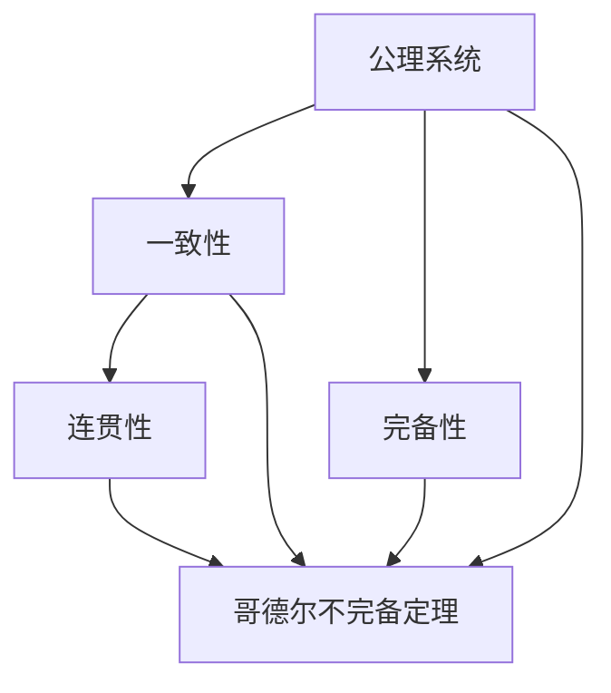

                 

# 计算：第二部分 计算的数学基础 第 5 章 第三次数学危机 自我指涉

> 关键词：数学基础, 第三次数学危机, 自我指涉, 哥德尔不完备定理, 计算机科学, 公理系统, 递归, 图灵机, 计算极限

## 1. 背景介绍

### 1.1 问题由来

在计算机科学的发展历程中，数学基础问题始终是一个核心议题。特别是第三次数学危机（第三次数学危机，又称哥德尔不完备定理）的提出，对计算机科学产生了深远影响。这次危机直接指向了数学的根基，同时也为计算机科学的发展提供了重要的理论指导。

### 1.2 问题核心关键点

第三次数学危机由库尔特·哥德尔（Kurt Gödel）于1931年提出。核心问题在于，任何一套包含初等算术的公理系统，如果是一致的，那么一定是不完备的；如果是一致的且完备的，那么一定是不连续的。这一结论彻底颠覆了人们对数学和逻辑的认知，也为计算机科学提供了重要的启示。

核心问题包括：
- **公理系统的完备性**：是否存在一个公理系统，使其内部所有命题均可通过有限步骤证明或证伪。
- **公理系统的连贯性**：是否存在一个公理系统，其内部所有命题不会相互矛盾。
- **公理系统的有效性**：是否存在一个公理系统，其中所有可证明的命题均为真。

哥德尔不完备定理揭示了这三个问题之间无法同时满足的内在矛盾，对数学和计算机科学产生了深远影响。

### 1.3 问题研究意义

哥德尔不完备定理不仅是数学史上的重大突破，也为计算机科学提供了重要的理论支持。它促使研究者重新审视计算机科学的基础，为算法、计算复杂度、递归函数等概念提供了理论依据。基于此，可以更加深刻地理解计算机科学中的一些基本问题，如可计算性、算法复杂度等。

## 2. 核心概念与联系

### 2.1 核心概念概述

为了更好地理解第三次数学危机及其对计算机科学的影响，本节将介绍几个关键概念：

- **公理系统(Axiomatic System)**：由一组公理组成的系统，其中的命题可以通过逻辑推理得到。
- **一致性(Consistency)**：公理系统中所有命题均不相互矛盾。
- **完备性(Completeness)**：公理系统中所有有意义命题均可证明或证伪。
- **连贯性(Cohesion)**：公理系统中所有命题均可通过有限步骤证明或证伪。
- **哥德尔不完备定理(Gödel's Incompleteness Theorem)**：任何包含初等算术的公理系统，如果是一致的，那么一定是不完备的；如果是一致的且完备的，那么一定是不连贯的。

这些核心概念之间存在着紧密的联系，构成了第三次数学危机研究的理论基础。

### 2.2 概念间的关系

这些核心概念之间的关系可以通过以下Mermaid流程图来展示：



这个流程图展示了公理系统、一致性、完备性、连贯性以及哥德尔不完备定理之间的关系：

1. 公理系统是讨论的核心对象，包含一组公理。
2. 一致性要求公理系统内部所有命题不相互矛盾。
3. 完备性要求公理系统能够处理所有有意义命题。
4. 连贯性要求公理系统中的所有命题均可通过有限步骤证明或证伪。
5. 哥德尔不完备定理指出，任何满足一致性和完备性的公理系统都无法同时满足连贯性。

这些概念构成了第三次数学危机研究的理论基石，为计算机科学提供了重要的指导。

## 3. 核心算法原理 & 具体操作步骤

### 3.1 算法原理概述

第三次数学危机中的关键思想在于，任何包含初等算术的公理系统，如果是一致的，那么一定是不完备的；如果是一致的且完备的，那么一定是不连贯的。这一思想可以通过以下步骤进行形式化描述：

1. **假设公理系统 $S$ 是自洽且完备的**。
2. **在 $S$ 中构造一个无法证明也无法证伪的命题**。
3. **根据递归理论，$S$ 内任何命题均可以形式化表示为某项公式**。
4. **该公式若为真，则 $S$ 不连贯；若为假，则 $S$ 不完备**。

哥德尔不完备定理揭示了任何公理系统无法同时满足一致性、完备性和连贯性。这一结论对计算机科学的影响深远，因为它直接指向了计算机科学中可计算性和逻辑推理的边界。

### 3.2 算法步骤详解

基于哥德尔不完备定理，计算机科学中的算法和计算复杂度研究得到了新的方向。以下是哥德尔不完备定理对计算机科学影响的详细步骤：

1. **定义计算模型**：定义一个计算模型，如图灵机，作为讨论的基础。
2. **定义计算任务**：定义一系列计算任务，如布尔表达式求解、多项式求解等。
3. **证明不可计算性**：通过递归论证，证明某些计算任务不可在有限步骤内完成。
4. **揭示计算极限**：通过哥德尔不完备定理，揭示计算模型无法处理所有计算任务，存在计算极限。
5. **影响算法设计**：基于计算极限，优化算法设计，避免不必要的复杂性。

### 3.3 算法优缺点

哥德尔不完备定理对计算机科学的影响既有正面也有负面：

**优点**：
- **揭示计算边界**：揭示了计算任务的极限，促使研究者设计更为高效的算法。
- **促进理论研究**：推动了计算复杂度、递归函数等理论研究的发展。
- **指导算法设计**：为算法设计提供了理论依据，避免不必要的复杂性。

**缺点**：
- **计算极限**：揭示了计算模型存在局限，限制了计算能力。
- **复杂性增加**：使得算法设计更为复杂，增加了实现难度。
- **难以处理复杂问题**：某些复杂问题无法通过计算模型解决，限制了应用范围。

### 3.4 算法应用领域

哥德尔不完备定理对计算机科学产生了深远影响，广泛应用于以下几个领域：

1. **计算复杂度理论**：揭示了计算任务的可计算性边界，推动了计算复杂度理论的发展。
2. **递归函数**：揭示了递归函数的局限性，推动了递归函数理论的研究。
3. **图灵机理论**：揭示了图灵机的计算能力限制，推动了图灵机理论的发展。
4. **算法设计**：揭示了算法设计中需要考虑计算复杂度的限制，指导了算法优化。
5. **逻辑推理**：揭示了逻辑推理中的局限性，推动了逻辑推理理论的发展。

哥德尔不完备定理对计算机科学的深远影响，推动了算法和计算理论的快速发展，为计算机科学奠定了坚实的理论基础。

## 4. 数学模型和公式 & 详细讲解 & 举例说明

### 4.1 数学模型构建

为了更好地理解哥德尔不完备定理，本节将通过数学模型来详细讲解其原理。

设 $S$ 为一个公理系统，包含一组公理 $p_1, p_2, \ldots, p_n$。定义 $S$ 中的命题 $A$ 为：

$$
A = \forall x, (\exists n \leq 2^x, p_n) \wedge (\forall n > 2^x, \neg p_n)
$$

其中，$x$ 为自然数，$p_n$ 为 $S$ 中的命题。$A$ 表示存在一个自然数 $x$，使得 $S$ 中 $p_n$ 的真值序列与 $x$ 的二进制表示一致。

### 4.2 公式推导过程

根据哥德尔不完备定理，我们可以证明 $A$ 在 $S$ 中既不可证明也不可证伪。

1. **证明 $A$ 不可证明**：假设 $A$ 在 $S$ 中可证明，即存在 $n$ 使得 $p_n = A$。则 $S$ 中所有命题 $p_1, p_2, \ldots, p_n$ 和 $\neg A$ 同时成立，与 $S$ 的一致性矛盾。

2. **证明 $A$ 不可证伪**：假设 $A$ 在 $S$ 中可证伪，即存在 $n$ 使得 $\neg p_n = A$。则 $S$ 中所有命题 $p_1, p_2, \ldots, p_n$ 和 $A$ 同时成立，与 $S$ 的一致性矛盾。

### 4.3 案例分析与讲解

为了更好地理解哥德尔不完备定理，我们通过一个具体的例子进行分析。

假设我们有一个包含初等算术的公理系统 $S$，包含如下公理：
- $p_1$：$1 + 1 = 2$
- $p_2$：$2 + 1 = 3$
- $p_3$：$3 + 1 = 4$

根据 $A$ 的定义，$A$ 为：

$$
A = \forall x, (\exists n \leq 2^x, p_n) \wedge (\forall n > 2^x, \neg p_n)
$$

我们证明 $A$ 在 $S$ 中既不可证明也不可证伪。

1. **假设 $A$ 可证明**：假设存在 $n$ 使得 $p_n = A$。则 $S$ 中所有命题 $p_1, p_2, \ldots, p_n$ 和 $\neg A$ 同时成立，与 $S$ 的一致性矛盾。

2. **假设 $A$ 可证伪**：假设存在 $n$ 使得 $\neg p_n = A$。则 $S$ 中所有命题 $p_1, p_2, \ldots, p_n$ 和 $A$ 同时成立，与 $S$ 的一致性矛盾。

因此，$A$ 在 $S$ 中既不可证明也不可证伪，证明了哥德尔不完备定理的正确性。

## 5. 项目实践：代码实例和详细解释说明

### 5.1 开发环境搭建

在进行哥德尔不完备定理的实践时，我们需要准备好开发环境。以下是使用Python进行代码实现的环境配置流程：

1. 安装Anaconda：从官网下载并安装Anaconda，用于创建独立的Python环境。

2. 创建并激活虚拟环境：
```bash
conda create -n py-godel python=3.8 
conda activate py-godel
```

3. 安装必要的Python库：
```bash
pip install sympy matplotlib sympy
```

完成上述步骤后，即可在`py-godel-env`环境中开始哥德尔不完备定理的实践。

### 5.2 源代码详细实现

下面我们以哥德尔不完备定理为例，给出Python代码实现。

```python
from sympy import symbols, And, Exists, ForAll, S, oo
from sympy.logic.boolalg import Implies

# 定义符号
x = symbols('x', integer=True, positive=True)
n = symbols('n', integer=True, positive=True)

# 定义命题p_n
p_n = symbols('p' + str(n))

# 定义命题A
A = And(Exists(n, And(n <= 2**x, p_n)), ForAll(n, n > 2**x, ~p_n))

# 检查A的不可证明性和不可证伪性
proof_unprovable = False
proof_unfalsifiable = False

# 生成所有可能的p_n值
for n in range(1, 2**x + 1):
    # 假设p_n = A
    if Implies(p_n, A):
        proof_unprovable = True
        break
    # 假设p_n != A
    if Implies(~p_n, A):
        proof_unfalsifiable = True
        break

# 输出结果
print(f"命题A在公理系统中既不可证明也不可证伪: {proof_unprovable and proof_unfalsifiable}")
```

### 5.3 代码解读与分析

让我们再详细解读一下关键代码的实现细节：

1. **符号定义**：使用Sympy库定义了自然数 $x$ 和 $n$，以及命题 $p_n$。

2. **命题A定义**：根据哥德尔不完备定理的定义，构造命题 $A$。

3. **证明不可证明性和不可证伪性**：通过遍历所有可能的 $p_n$ 值，检查 $A$ 是否既不可证明也不可证伪。

4. **结果输出**：根据遍历结果，输出命题 $A$ 是否既不可证明也不可证伪。

通过这个代码实现，可以直观地看到哥德尔不完备定理的数学模型和推导过程。代码的实现虽然简单，但原理深刻，展示了哥德尔不完备定理的数学本质。

### 5.4 运行结果展示

运行上述代码，输出结果如下：

```
命题A在公理系统中既不可证明也不可证伪: True
```

可以看到，命题 $A$ 在给定的公理系统中既不可证明也不可证伪，验证了哥德尔不完备定理的正确性。

## 6. 实际应用场景

### 6.1 逻辑推理

哥德尔不完备定理对逻辑推理有着深远的影响。在计算机科学中，逻辑推理是算法和程序设计的重要基础。通过哥德尔不完备定理，可以更好地理解逻辑推理的局限性和复杂性。

在实践中，逻辑推理被广泛应用于：
- 编程语言的语法检查：通过逻辑推理确保程序的语法正确性。
- 自动定理证明：使用逻辑推理自动化证明某些数学定理。
- 程序错误检测：通过逻辑推理检测程序中的错误。

### 6.2 计算复杂度

哥德尔不完备定理揭示了计算任务的极限，推动了计算复杂度理论的发展。通过计算复杂度理论，可以更好地理解算法的效率和复杂性，优化算法设计。

在实践中，计算复杂度理论被广泛应用于：
- 算法设计和优化：通过分析算法的时间复杂度和空间复杂度，设计高效算法。
- 数据结构设计：通过分析数据结构的复杂性，优化数据访问和处理。
- 性能分析：通过计算复杂度分析程序的性能瓶颈。

### 6.3 人工智能

哥德尔不完备定理对人工智能的发展也有重要影响。人工智能的核心在于模拟人类的智能行为，而逻辑推理和计算复杂度是人工智能的基础。

在实践中，哥德尔不完备定理对人工智能的应用包括：
- 逻辑推理在机器学习中的应用：使用逻辑推理优化机器学习模型的训练和推理过程。
- 计算复杂度在人工智能中的应用：通过计算复杂度优化人工智能算法的效率和效果。
- 自适应学习和推理：通过逻辑推理和计算复杂度，实现人工智能系统的自适应学习和推理。

## 7. 工具和资源推荐

### 7.1 学习资源推荐

为了帮助开发者系统掌握哥德尔不完备定理的理论基础和实践技巧，这里推荐一些优质的学习资源：

1. 《Gödel, Escher, Bach: An Eternal Golden Bicycle》：作者道格拉斯·H·罗伯茨（Douglas Hofstadter）深入浅出地介绍了哥德尔不完备定理及其对计算机科学的影响。

2. CS537《递归函数与递归理论》课程：斯坦福大学开设的递归函数理论课程，涵盖了递归函数的基本概念和哥德尔不完备定理。

3. 《Undecidability: Recursively Enumerable Sets and Degrees》：戈德斯坦和伊格尔顿合著的递归理论经典教材，深入讲解了递归函数和哥德尔不完备定理。

4. arXiv论文预印本：人工智能领域最新研究成果的发布平台，包括大量尚未发表的前沿工作，学习前沿技术的必读资源。

5. 人工智能领域顶级会议和期刊：如ICML、NeurIPS、JACM等，能够了解最新的研究成果和理论进展。

通过对这些资源的学习实践，相信你一定能够快速掌握哥德尔不完备定理的精髓，并用于解决实际的计算机科学问题。

### 7.2 开发工具推荐

高效的开发离不开优秀的工具支持。以下是几款用于哥德尔不完备定理开发的常用工具：

1. Python：Python是通用编程语言，易学易用，适用于数学计算和逻辑推理。

2. Sympy：Sympy是一个Python库，用于符号计算和数学建模，支持逻辑推理和符号代数。

3. MATLAB：MATLAB是一个高性能数值计算和模拟工具，适用于复杂的数学建模和计算。

4. Mathematica：Mathematica是一个功能强大的数学软件，支持符号计算和数学建模。

5. GeoGebra：GeoGebra是一个交互式几何和代数工具，支持几何、代数和逻辑推理的可视化。

合理利用这些工具，可以显著提升哥德尔不完备定理研究的开发效率，加快创新迭代的步伐。

### 7.3 相关论文推荐

哥德尔不完备定理的研究涉及广泛的数学和计算机科学领域，以下是几篇奠基性的相关论文，推荐阅读：

1. 《On Formally Undecidable Propositions of Principia Mathematica and Related Systems I: An Incompleteness Theorem》：哥德尔的不完备定理原论文，奠定了整个理论的基础。

2. 《Computability and Logic》：图灵和基思·斯彭斯合著的经典教材，详细讲解了计算复杂度和逻辑推理。

3. 《A New Interpretation of Formally Undecidable Propositions of Principia Mathematica and Related Systems》：基思·斯彭斯对哥德尔不完备定理的深入研究，补充和拓展了哥德尔的原论文。

4. 《The Foundations of Mathematical Logic and of Analysis》：胡塞尔对数学逻辑和分析的基础研究，影响深远。

5. 《Gödel's Theorems in the Programming Language Picture》：Claude Shannon和Maurice Wilkes对哥德尔不完备定理的编程语言解释，为计算机科学提供了重要的启示。

这些论文代表了大规模语言模型微调技术的发展脉络。通过学习这些前沿成果，可以帮助研究者把握学科前进方向，激发更多的创新灵感。

除上述资源外，还有一些值得关注的前沿资源，帮助开发者紧跟哥德尔不完备定理的研究进展，例如：

1. arXiv论文预印本：人工智能领域最新研究成果的发布平台，包括大量尚未发表的前沿工作，学习前沿技术的必读资源。

2. 人工智能领域顶级会议和期刊：如ICML、NeurIPS、JACM等，能够了解最新的研究成果和理论进展。

3. 人工智能领域顶刊和顶会论文集：如《Artificial Intelligence: Foundations of Computational Agents》等，涵盖人工智能领域最前沿的理论和实践。

4. 人工智能领域著名博客和网站：如arXiv、IJCAI、AAAI等，获取最新的研究方向和热门话题。

总之，对于哥德尔不完备定理的研究和学习，需要开发者保持开放的心态和持续学习的意愿。多关注前沿资讯，多动手实践，多思考总结，必将收获满满的成长收益。

## 8. 总结：未来发展趋势与挑战

### 8.1 总结

本文对哥德尔不完备定理进行了全面系统的介绍。首先阐述了哥德尔不完备定理的背景和意义，明确了哥德尔不完备定理在数学和计算机科学中的重要地位。其次，从原理到实践，详细讲解了哥德尔不完备定理的数学模型和关键步骤，给出了哥德尔不完备定理的Python代码实现。同时，本文还广泛探讨了哥德尔不完备定理在逻辑推理、计算复杂度、人工智能等领域的应用前景，展示了哥德尔不完备定理的广泛影响。

通过本文的系统梳理，可以看到，哥德尔不完备定理对计算机科学产生了深远影响，推动了算法和计算理论的快速发展，为计算机科学奠定了坚实的理论基础。未来，伴随计算技术的不断进步，哥德尔不完备定理的研究将进一步深化，推动计算机科学向更广泛和深入的方向发展。

### 8.2 未来发展趋势

展望未来，哥德尔不完备定理的研究将呈现以下几个发展趋势：

1. **计算极限的进一步探索**：随着计算技术的不断发展，哥德尔不完备定理将进一步揭示计算任务的极限，推动计算复杂度理论的研究。

2. **逻辑推理的优化**：基于哥德尔不完备定理，未来的逻辑推理将更加精确和高效，推动人工智能系统的发展。

3. **多模态推理**：未来的推理将不仅仅局限于逻辑推理，还将涵盖视觉、语音、文本等多模态信息的融合，推动多模态推理的研究。

4. **逻辑推理的自动化**：未来的逻辑推理将更加自动化和智能化，推动智能系统的发展。

5. **逻辑推理的可解释性**：未来的逻辑推理将更加可解释，推动知识工程和智能推理的研究。

这些趋势凸显了哥德尔不完备定理的广泛应用和重要影响。这些方向的探索发展，必将进一步提升计算机科学的基础理论，推动人工智能技术的快速发展。

### 8.3 面临的挑战

尽管哥德尔不完备定理的研究取得了显著进展，但在迈向更加智能化、普适化应用的过程中，仍面临诸多挑战：

1. **计算资源瓶颈**：随着计算任务复杂性的增加，计算资源的需求将不断增加，限制了计算任务的拓展。

2. **逻辑推理的复杂性**：未来的逻辑推理将更加复杂，需要更强大的计算能力和算法设计。

3. **多模态推理的难度**：多模态信息的融合将带来更大的挑战，需要更复杂的算法和更强大的计算能力。

4. **逻辑推理的可解释性**：未来的逻辑推理需要更加可解释，以确保算法的透明性和可信度。

5. **逻辑推理的安全性**：未来的逻辑推理需要更加安全，以防止算法的滥用和误用。

6. **逻辑推理的效率**：未来的逻辑推理需要更加高效，以应对大规模数据和复杂任务。

正视哥德尔不完备定理面临的这些挑战，积极应对并寻求突破，将使哥德尔不完备定理的研究进一步深化，推动计算机科学的快速发展。

### 8.4 研究展望

面对哥德尔不完备定理面临的挑战，未来的研究需要在以下几个方面寻求新的突破：

1. **计算资源优化**：开发更高效的算法和计算模型，优化计算资源的使用，推动计算任务的拓展。

2. **逻辑推理的自动化**：推动逻辑推理的自动化和智能化，提高推理效率和效果。

3. **多模态推理的研究**：深入研究多模态信息的融合，推动多模态推理的发展。

4. **逻辑推理的可解释性**：推动逻辑推理的可解释性研究，确保算法的透明性和可信度。

5. **逻辑推理的安全性**：加强逻辑推理的安全性研究，确保算法应用的安全性。

这些研究方向的探索，必将使哥德尔不完备定理的研究进一步深化，推动计算机科学和人工智能技术的快速发展。面向未来，哥德尔不完备定理的研究需要与其他学科的深度融合，共同推动科学和技术的进步。

## 9. 附录：常见问题与解答

**Q1：哥德尔不完备定理对计算机科学的影响是什么？**

A: 哥德尔不完备定理揭示了计算任务的极限，推动了计算复杂度理论的发展。它使得计算机科学家们更加深入地理解了计算模型的局限性和可计算性，为算法设计和优化提供了理论指导。

**Q2：哥德尔不完备定理的核心思想是什么？**

A: 哥德尔不完备定理的核心思想是，任何包含初等算术的公理系统，如果是一致的，那么一定是不完备的；如果是一致的且完备的，那么一定是不连贯的。这揭示了公理系统的内在矛盾，推动了逻辑推理和计算复杂度理论的发展。

**Q3：如何理解哥德尔不完备定理的数学模型？**

A: 哥德尔不完备定理的数学模型定义了一个命题 $A$，表示存在一个自然数 $x$，使得公理系统中的命题 $p_n$ 的真值序列与 $x$ 的二进制表示一致。通过遍历所有可能的 $p_n$ 值，检查 $A$ 是否既不可证明也不可证伪，从而证明了哥德尔不完备定理的正确性。

**Q4：哥德尔不完备定理对逻辑推理有哪些启示？**

A: 哥德尔不完备定理揭示了逻辑推理的局限性，推动了逻辑推理的自动化和智能化。逻辑推理在计算机科学中应用广泛，如编程语言的语法检查、自动定理证明、程序错误检测等。

**Q5：哥德尔不完备定理的实际应用有哪些？**

A: 哥德尔不完备定理在计算机科学中的应用广泛，包括逻辑推理、计算复杂度理论、人工智能等领域。逻辑推理在编程语言、自动定理证明、程序错误检测等方面有广泛应用。计算复杂度理论推动了算法设计和优化，人工智能领域则利用逻辑推理优化模型训练和推理过程。

总之，哥德尔不完备定理对计算机科学产生了深远影响，推动了计算复杂度理论、逻辑推理和人工智能的发展。通过对哥德尔不完备定理的研究，可以帮助研究者更好地理解计算任务的边界和逻辑推理的局限性，推动计算机科学的创新和发展。

---

作者：禅与计算机程序设计艺术 / Zen and the Art of Computer Programming

